# 第3章 Elasticsearch 基础功能

## 3.1 索引操作 

### 3.1.1 创建索引

ES 软件的索引可以类比为 MySQL 中表的概念，创建一个索引，类似于创建一个表。 查询完成后，Kibana 右侧会返回响应结果及请求状态

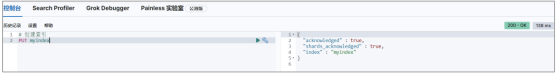

重复创建索引时，Kibana 右侧会返回响应结果，其中包含错误信息。

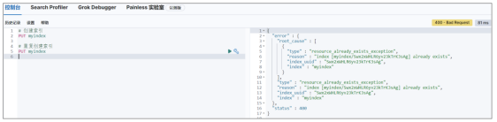


### 3.1.2 查询指定索引

根据索引名称查询指定索引，如果查询到，会返回索引的详细信息

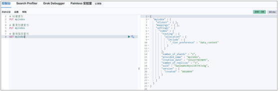

如果查询的索引未存在，会返回错误信息

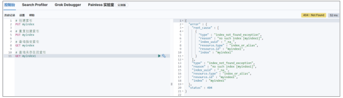


### 3.1.3 查询所有索引

为了方便，可以查询当前所有索引数据。这里请求路径中的_cat 表示查看的意思，indices 表示索引，所以整体含义就是查看当前 ES 服务器中的所有索引，就好像 MySQL 中的 show tables 的感觉


这里的查询结果表示索引的状态信息，按顺序数据表示结果如下：

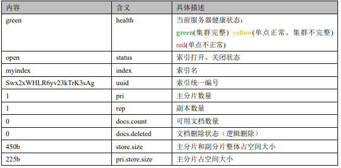


### 3.1.4 删除索引

删除指定已存在的索引


如果删除一个不存在的索引，那么会返回错误信息

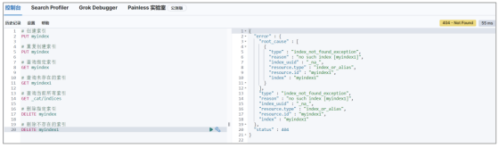


## 3.2 文档操作

文档是 ES 软件搜索数据的最小单位, 不依赖预先定义的模式，所以可以将文档类比为表的 一行JSON类型的数据。我们知道关系型数据库中，要提前定义字段才能使用，在Elasticsearch 中，对于字段是非常灵活的，有时候，我们可以忽略该字段，或者动态的添加一个新的字段。


### 3.2.1 创建文档

索引已经创建好了，接下来我们来创建文档，并添加数据。这里的文档可以类比为关系型数 据库中的表数据，添加的数据格式为 JSON 格式

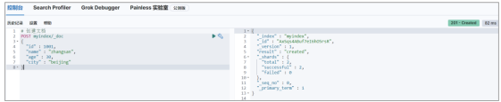

此处因为没有指定数据唯一性标识，所以无法使用 PUT 请求，只能使用 POST 请求，且对 数据会生成随机的唯一性标识。否则会返回错误信息

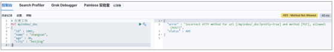

如果在创建数据时，指定唯一性标识，那么请求范式 POST，PUT 都可以

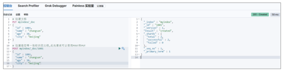


### 3.2.2 查询文档

根据唯一性标识可以查询对应的文档

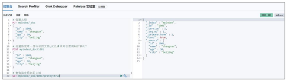


### 3.2.3 修改文档

修改文档本质上和新增文档是一样的，如果存在就修改，如果不存在就新增

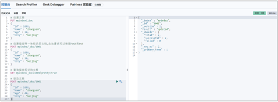


### 3.2.4 删除文档

删除一个文档不会立即从磁盘上移除，它只是被标记成已删除（逻辑删除）。

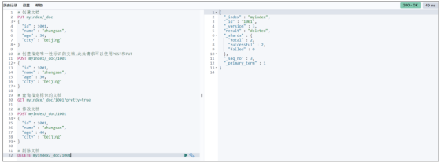


### 3.2.5 查询所有文档

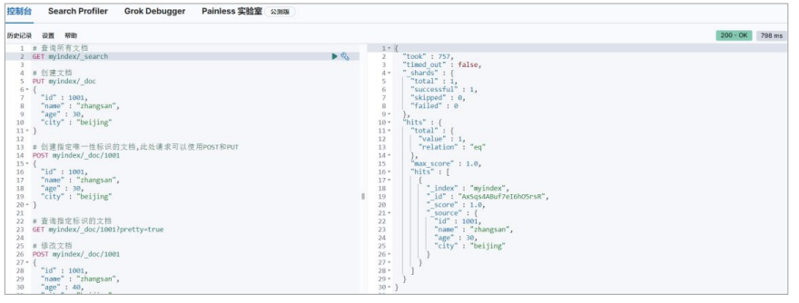


## 3.3 数据搜索

为了方便演示，事先准备多条数据

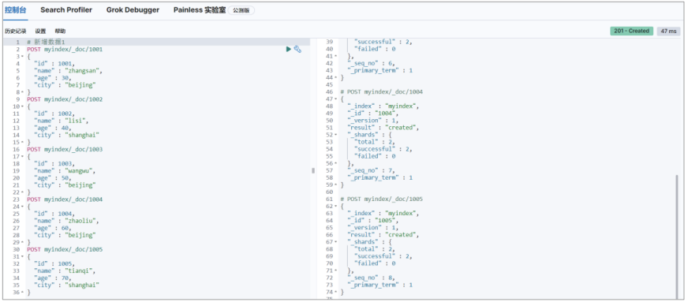


### 3.3.1 查询所有文档

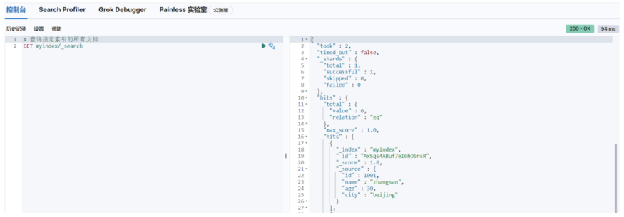


### 3.3.2 匹配查询文档

这里的查询表示文档数据中 JSON 对象数据中的 name 属性是 zhangsan。

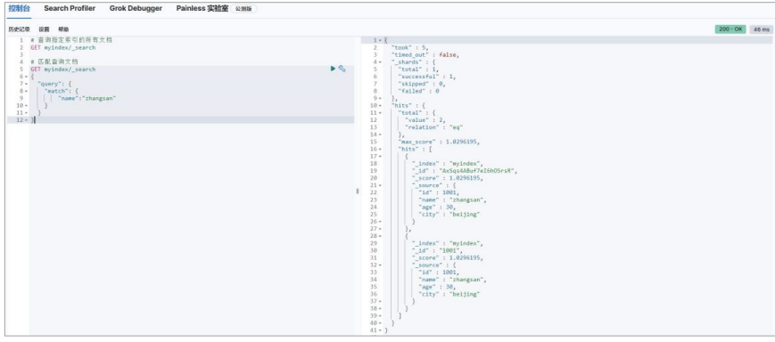


### 3.3.3 匹配查询字段

默认情况下，Elasticsearch 在搜索的结果中，会把文档中保存在_source 的所有字段都返回。 如果我们只想获取其中的部分字段，我们可以添加_source 的过滤

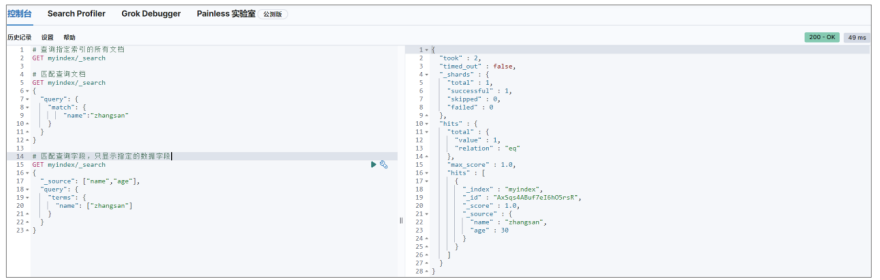


## 3.4 聚合搜索

聚合允许使用者对 es 文档进行统计分析，类似与关系型数据库中的 group by，当然还有很 多其他的聚合，例如取最大值、平均值等等。


### 3.4.1 平均值

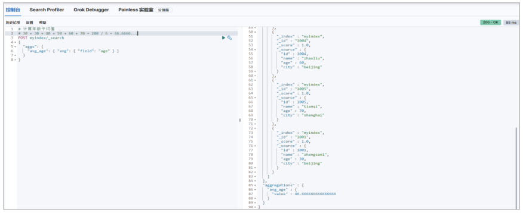


### 3.4.2 求和

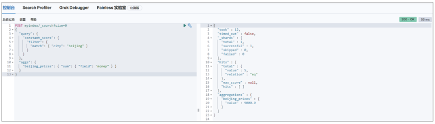


### 3.4.3 最大值

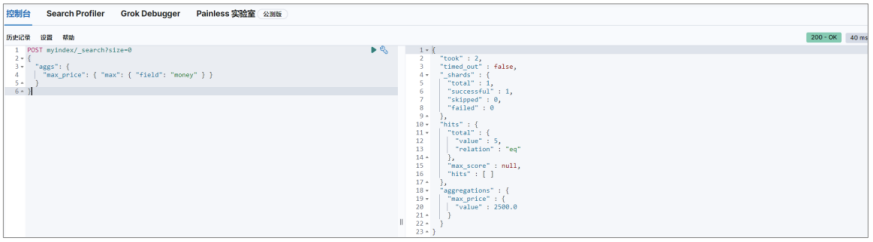


### 3.4.4 TopN

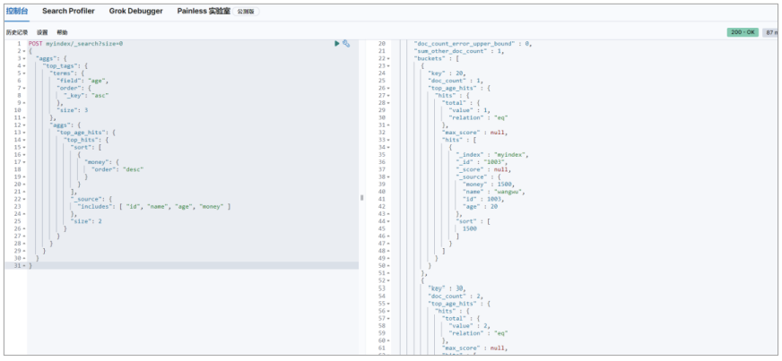


## 3.5 索引模板

我们之前对索引进行一些配置信息设置，但是都是在单个索引上进行设置。在实际开发 中，我们可能需要创建不止一个索引，但是每个索引或多或少都有一些共性。比如我们在设 计关系型数据库时，一般都会为每个表结构设计一些常用的字段，比如：创建时间，更新时 间，备注信息等。elasticsearch 在创建索引的时候，就引入了模板的概念，你可以先设置一 些通用的模板，在创建索引的时候，elasticsearch 会先根据你创建的模板对索引进行设置。elasticsearch 中提供了很多的默认设置模板，这就是为什么我们在新建文档的时候，可以为 你自动设置一些信息，做一些字段转换等。

索引可使用预定义的模板进行创建,这个模板称作 Index templates。模板设置包括 settings 和 mappings


### 3.5.1 创建模板

```
# 模板名称小写
PUT _template/mytemplate
{
 "index_patterns" : [
 "my*"
 ],
 "settings" : {
 "index" : {
 "number_of_shards" : "1"
 }
 },
 "mappings" : {
 "properties" : {
 "now": {
 "type" : "date",
 "format" : "yyyy/MM/dd"
 }
 }
 }
}
```

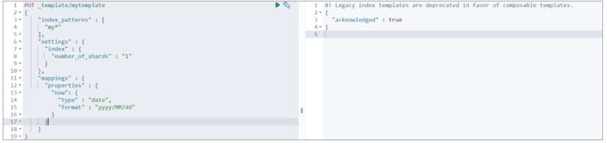


### 3.5.2 查看模板

```
#
GET /_template/mytemplate
```

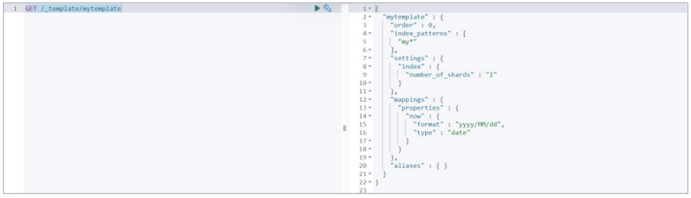


### 3.5.3 验证模板是否存在

```
#
HEAD /_template/mytemplate
```


### 3.5.4 创建索引

```
#
PUT testindex
#
PUT mytest
```

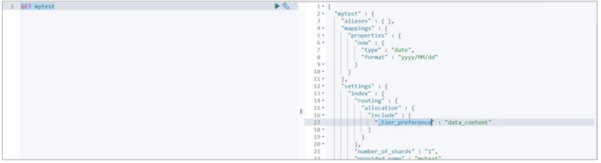


### 3.5.5 删除模板

```
#
DELETE /_template/mytemplate
```


## 3.6 中文分词

我们在使用 Elasticsearch 官方默认的分词插件时会发现，其对中文的分词效果不佳，经 常分词后得效果不是我们想要得。

```
GET _analyze
{
 "analyzer": "chinese",
 "text": ["我是一个学生"]
}
```

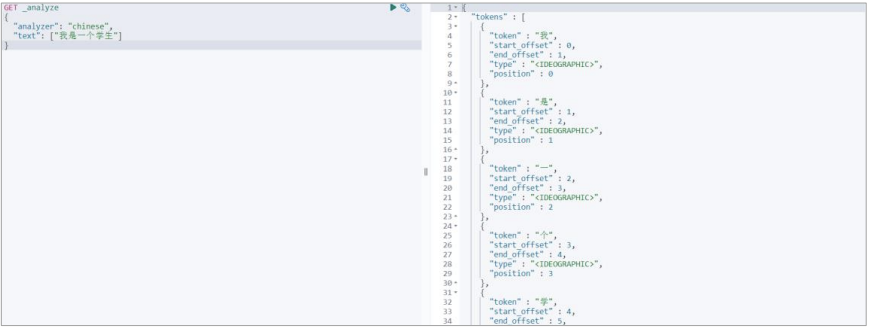

为了能够更好地对中文进行搜索和查询，就需要在Elasticsearch中集成好的分词器插件， 而 IK 分词器就是用于对中文提供支持得插件。


### 3.6.1 集成 IK 分词器

#### 3.6.1.1 下载

下载地址：https://github.com/medcl/elasticsearch-analysis-ik/releases 

注意：选择下载的版本要与 Elasticsearch 版本对应。我们这里选择 8.1.0

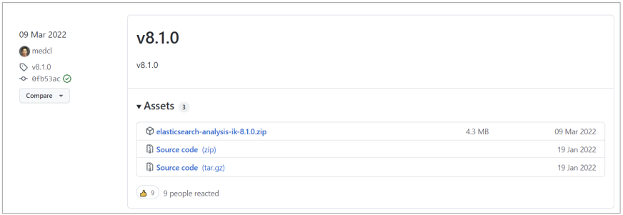


#### 3.6.1.2 安装

在安装目录 plugins 目中，将下载得压缩包直接解压缩得里面即可

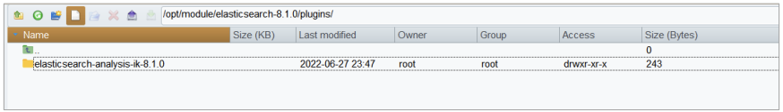

**重启 Elasticsearch 服务**


### 3.6.2 使用 IK 分词器

IK 分词器提供了两个分词算法： 

➢ ik_smart: 最少切分 

➢ Ik_max_word:最细粒度划分

接下来咱们使用 ik_smart 算法对之前得中文内容进行分词，明显会发现和默认分词器得区 别。

```
GET _analyze
{
 "analyzer": "ik_smart",
 "text": ["我是一个学生"]
}
```

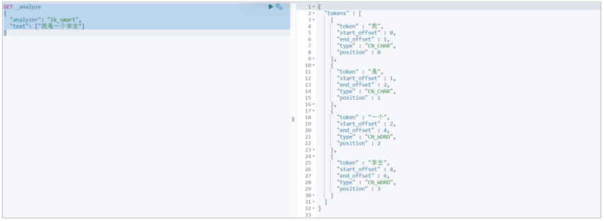

接下来，再对比 ik_max_word 算法分词后的效果

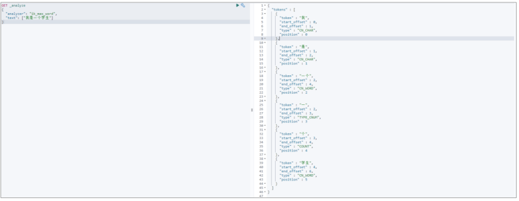


### 3.6.3 自定义分词效果

我们在使用 IK 分词器时会发现其实有时候分词的效果也并不是我们所期待的,有时一些特 殊得术语会被拆开，比如上面得中文“一个学生”希望不要拆开，怎么做呢？其实 IK 插件 给我们提供了自定义分词字典，我们就可以添加自己想要保留得字了。

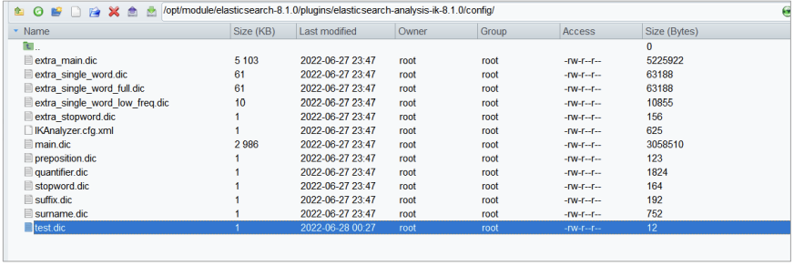

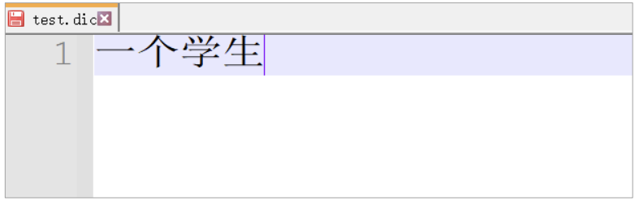

接下来我们修改配置文件：IKAnalyzer.cfg.xml

```xml
<?xml version="1.0" encoding="UTF-8"?>
<!DOCTYPE properties SYSTEM "http://java.sun.com/dtd/properties.dtd">
<properties>
<comment>IK Analyzer 扩展配置</comment>
<!--用户可以在这里配置自己的扩展字典 -->
<entry key="ext_dict">test.dic</entry>
<!--用户可以在这里配置自己的扩展停止词字典-->
<entry key="ext_stopwords"></entry>
<!--用户可以在这里配置远程扩展字典 -->
<!-- <entry key="remote_ext_dict">words_location</entry> -->
<!--用户可以在这里配置远程扩展停止词字典-->
<!-- <entry key="remote_ext_stopwords">words_location</entry> -->
</properties>
```


**重启 Elasticsearch 服务器查看效果**

```
GET _analyze
{
 "analyzer": "ik_smart",
 "text": ["我是一个学生"]
}
```

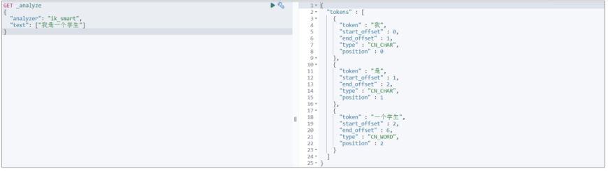


## 3.7 文档得分

Lucene 和 ES 的得分机制是一个基于词频和逆文档词频的公式，简称为 TF-IDF 公式

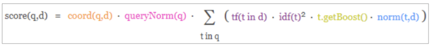

公式中将查询作为输入，使用不同的手段来确定每一篇文档的得分，将每一个因素最后 通过公式综合起来，返回该文档的最终得分。这个综合考量的过程，就是我们希望相关的文 档被优先返回的考量过程。在 Lucene 和 ES 中这种相关性称为得分。

考虑到查询内容和文档得关系比较复杂，所以公式中需要输入得参数和条件非常得多。但是其中比较重要得其实是两个算法机制


➢ TF (词频)

Term Frequency : 搜索文本中的各个词条（term）在查询文本中出现了多少次， 出现次数越多，就越相关，得分会比较高


➢ IDF(逆文档频率)

Inverse Document Frequency : 搜索文本中的各个词条（term）在整个索引的所有文档中 出现了多少次，出现的次数越多，说明越不重要，也就越不相关，得分就比较低。


### 3.7.1 打分机制

接下来咱们用一个例子简单分析一下文档的打分机制：

\1) 首先，咱们先准备一个基础数据

```
# 创建索引
PUT /atguigu
# 增加文档数据
# 此时索引中只有这一条数据
PUT /atguigu/_doc/1
{
 "text":"hello"
}

```

\2) 查询匹配条件的文档数据

```
#
GET /atguigu/_search
{
 "query": {
 "match": {
 "text": "hello"
 }
 }
}
```

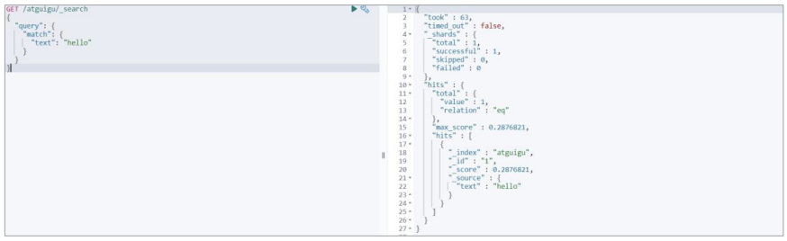

这里文档的得分为：0.2876821，很奇怪，此时索引中只有一个文档数据，且文档数据中可 以直接匹配查询条件，为什么分值这么低？这就是公式的计算结果，咱们一起来看看


\3) 分析文档数据打分过程

```
# 增加分析参数
GET /atguigu/_search?explain=true
{
 "query": {
 "match": {
 "text": "hello"
 }
 }
}
```

执行后，会发现打分机制中有 2 个重要阶段：计算 TF 值和 IDF 值

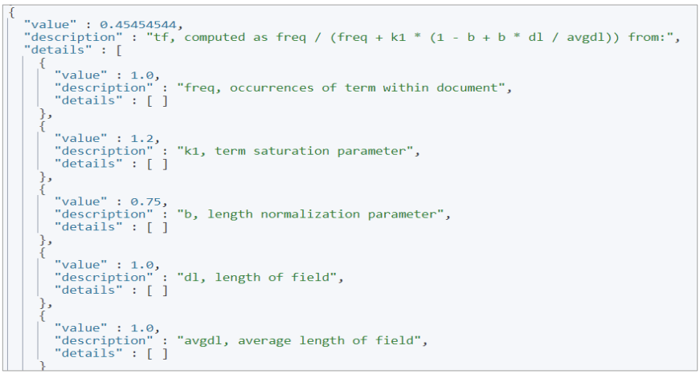

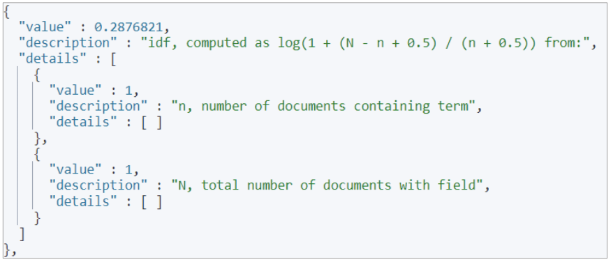

最后的分数为：

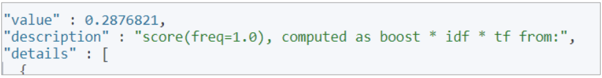


\4) 计算 TF 值


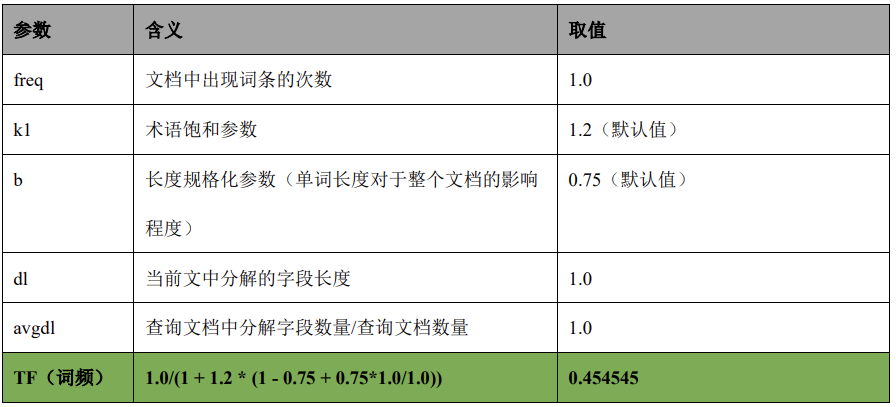


\5) 计算 IDF 值

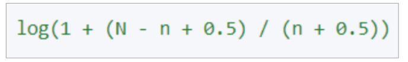

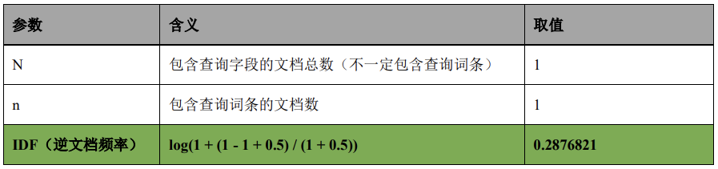

**注：这里的 log 是底数为 e 的对数**


\6) 计算文档得分


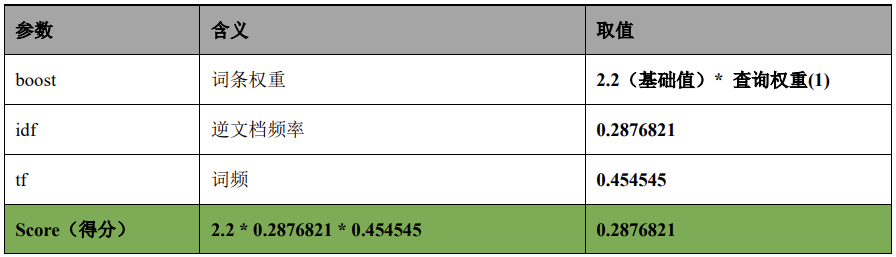


\7) 增加新的文档，测试得分

⚫ 增加一个毫无关系的文档

```
# 增加文档
PUT /atguigu/_doc/2
```

```
{
 "text" : "spark"
}
# 因为新文档无词条相关信息，所以匹配的文档数据得分就应该较高：
# 0.6931741
GET /atguigu/_search
{
 "query": {
 "match": {
 "text": "hello"
 }
 }
}
```

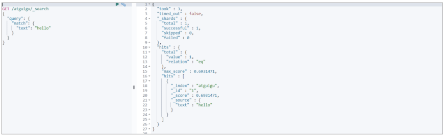


⚫ 增加一个一模一样的文档

```
# 增加文档
PUT /atguigu/_doc/2
{
 "text" : "hello"
}
# 因为新文档含词条相关信息，且多个文件含有词条，所以显得不是很重要，得分会变低
# 0.18232156
GET /atguigu/_search
{
 "query": {
 "match": {
 "text": "hello"
 }
 }
}

```


⚫ 增加一个含有词条，但是内容较多的文档

```
# 增加文档
PUT /atguigu/_doc/2
```

```
{
 "text" : "hello elasticsearch"
}
# 因为新文档含词条相关信息，但只是其中一部分，所以查询文档的分数会变得更低一些。
# 0.14874382
GET /atguigu/_search
{
 "query": {
 "match": {
 "text": "hello"
 }
 }
}
```


### 3.7.2 案例

需求： 查询文档标题中含有“Hadoop”,“Elasticsearch”,“Spark”的内容。 

优先选择“Spark”的内容

\1) 准备数据

```
# 准备数据
PUT /testscore/_doc/1001
{
 "title" : "Hadoop is a Framework",
 "content" : "Hadoop 是一个大数据基础框架"
}
PUT /testscore/_doc/1002
{
 "title" : "Hive is a SQL Tools",
 "content" : "Hive 是一个 SQL 工具"
}
PUT /testscore/_doc/1003
{
 "title" : "Spark is a Framework",
 "content" : "Spark 是一个分布式计算引擎"
}
```


\2) 查询数据

```
# 查询文档标题中含有“Hadoop”,“Elasticsearch”,“Spark”的内容
GET /testscore/_search?explain=true
{
 "query": {
 "bool": {
 "should": [
 {
 "match": {
 "title": {"query": "Hadoop", "boost": 1}
 }
 },
 {
 "match": {
 "title": {"query": "Hive", "boost": 1}
 }
 },
 {
 "match": {
 "title": {"query": "Spark", "boost": 1}
 }
 }
 ]
 }
 }
}

```

此时，你会发现，Spark 的结果并不会放置在最前面

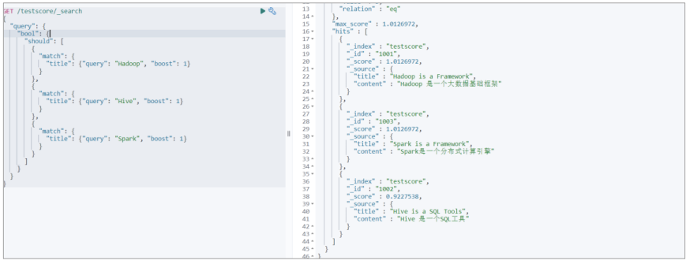

此时，咱们可以更改 Spark 查询的权重参数 boost.看看查询的结果有什么不同

```
# 查询文档标题中含有“Hadoop”,“Elasticsearch”,“Spark”的内容
GET /testscore/_search?explain=true
{
 "query": {
 "bool": {
 "should": [
 {
 "match": {
 "title": {"query": "Hadoop", "boost": 1}
 }
 },
 {
 "match": {
 "title": {"query": "Hive", "boost": 1}
 }
 },
 {
 "match": {
 "title": {"query": "Spark", "boost": 2}
 }
 }
 ]
 }
 }
}
```

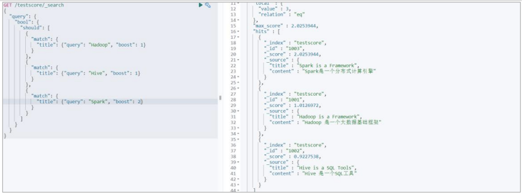