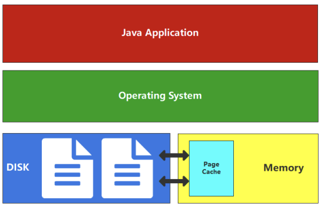

# 第5章 Elasticsearch 优化 

## 5.1 性能优化之缓存

Elasticsearch 应用时会使用各种缓存，而缓存是加快数据检索速度的王道。接下来，我 们将着重介绍以下三种缓存

➢ 页缓存 

➢ 分片级请求缓存 

➢ 查询缓存


### 5.1.1 页缓存

为了数据的安全、可靠，常规操作中，数据都是保存在磁盘文件中的。所以对数据的访 问，绝大数情况下其实就是对文件的访问，为了提升对文件的读写的访问效率，Linux 内核 会以页大小（4KB）为单位，将文件划分为多个数据块。当用户对文件中的某个数据块进行 读写操作时，内核首先会申请一个内存页（称为 PageCache 页缓存）与文件中的数据块进 行绑定。



页缓存的基本理念是从磁盘读取数据后将数据放入可用内存中，以便下次读取时从内存 返回数据，而且获取数据不需要进行磁盘查找。所有这些对应用程序来说是完全透明的，应 用程序发出相同的系统调用，但操作系统可以使用页缓存而不是从磁盘读取。


Java 程序是跨平台的，所以没有和硬件（磁盘，内存）直接交互的能力，如果想要和磁 盘文件交互，那么必须要通过 OS 操作系统来完成文件的读写，我们一般就称之为用户态转 换为内核态。而操作系统对文件进行读写时，实际上就是对文件的页缓存进行读写。所以对 文件进行读写操作时，会分以下两种情况进行处理：

⚫ 当从文件中读取数据时，如果要读取的数据所在的页缓存已经存在，那么就直接把页缓 存的数据拷贝给用户即可。否则，内核首先会申请一个空闲的内存页（页缓存），然后 从文件中读取数据到页缓存，并且把页缓存的数据拷贝给用户。 

⚫ 当向文件中写入数据时，如果要写入的数据所在的页缓存已经存在，那么直接把新数据 写入到页缓存即可。否则，内核首先会申请一个空闲的内存页（页缓存），并且把新数 据写入到页缓存中。对于被修改的页缓存，内核会定时把这些页缓存刷新到文件中。

页缓存对 Elasticsearch 来说意味着什么？与访问磁盘上的数据相比，通过页缓存可以更快 地访问数据。这就是为什么建议的 Elasticsearch 内存通常不超过总可用内存的一半，这样 另一半就可用于页缓存了。这也意味着不会浪费任何内存


如果数据本身发生更改，页缓存会将数据标记为脏数据，并将这些数据从页缓存中释放。 由于 Elasticsearch 和 Lucene 使用的段只写入一次，因此这种机制非常适合数据的存储方 式。段在初始写入之后是只读的，因此数据的更改可能是合并或添加新数据。在这种情况下， 需要进行新的磁盘访问。另一种可能是内存被填满了。在这种情况下，缓存数据过期的操作 为 LRU。


### 5.1.2 分片级请求缓存

对一个或多个索引发送搜索请求时，搜索请求首先会发送到 ES 集群中的某个节点，称 之为协调节点；协调节点会把该搜索请求分发给其他节点并在相应分片上执行搜索操作，我 们把分片上的执行结果称为“本地结果集”，之后，分片再将执行结果返回给协调节点；协调 节点获得所有分片的本地结果集之后，合并成最终的结果并返回给客户端。Elasticsearch 会 在每个分片上缓存了本地结果集，这使得频繁使用的搜索请求几乎立即返回结果。这里的缓 存，称之为 Request Cache, 全称是 Shard Request Cache，即分片级请求缓存。

ES 能够保证在使用与不使用 Request Cache 情况下的搜索结果一致，那 ES 是如何保 证的呢？这就要通过 Request Cache 的失效机制来了解啦。Request Cache 缓存失效是自动 的，当索引 refresh 时就会失效，也就是说在默认情况下， Request Cache 是每 1 秒钟失效 一次，但需要注意的是，只有在分片的数据实际上发生了变化时，刷新分片缓存才会失效。 也就是说当一个文档被索引 到 该文档变成 Searchable 的这段时间内，不管是否有请求命中 缓存该文档都不会被返回。

所以我们可以通过 index.refresh_interval 参数来设置 refresh 的刷新时间间隔，刷新间 隔越长，缓存的数据越多，当缓存不够的时候，将使用 LRU 最近最少使用策略删除数据。 

当然，我们也可以手动设置参数 indices.request.cache.expire 指定失效时间（单位为分 钟），但是基本上我们没必要去这样做，因为缓存在每次索引 refresh 时都会自动失效。


⚫ Request Cache 的使用

默认情况下，Request Cache 是关闭的，我们可以在创建新的索引时启用

```
curl -XPUT 服务器 IP:端口/索引名 -d
'{
 "settings": {
 "index.requests.cache.enable": true
 }
}
```

也可以通过动态参数配置来进行设置：

```
curl -XPUT 服务器 IP:端口/索引名/_settings -d
'{
 "index.requests.cache.enable": true
}'
```

开启缓存后，需要在搜索请求中加上 request_cache=true 参数，才能使查询请求被缓存， 比如：

```
curl -XGET '服务器 IP:端口/索引名/_search?request_cache=true&pretty' -H
'Content-Type: application/json' -d
'{
 "size": 0,
 "aggs": {
 "popular_colors": {
 "terms": {
 "field": "colors"
 }
 }
 }
}'
```

两个注意事项： 

第一：参数 size：0 必须强制指定才能被缓存，否则请求是不会缓存的，即使手动的 设置 request_cache=true 

第二：在使用 script 脚本执行查询时，由于脚本的执行结果是不确定的（比如使用 random 函数或使用了当前时间作为参数），一定要指定 request_cache=false 禁用 Request Cache 缓存。


⚫ Request Cache 的设置 

Request Cache 作用域为 Node，在 Node 中的 Shard 共享这个 Cache 空间。默认最大 大小为 JVM 堆内存的 1％。可以使用以下命令在 config/elasticsearch.yml 文件中进行 更改：

```yml
indices.requests.cache.size: 1%
```

Request Cache 是以查询的整个 DSL 语句做为 key 的，所以如果要命中缓存，那么查询 生成的 DSL 一定要一样，即使修改了一个字符或者条件顺序，都不能利用缓存，需要 重新生成 Cache。


### 5.1.3 查询缓存

这种缓存的工作方式也与其他缓存有着很大的不同。页缓存方式缓存的数据与实际从查 询中读取的数据量无关。当使用类似查询时，分片级请求缓存会缓存数据。查询缓存更精细 些，可以缓存在不同查询之间重复使用的数据。

Elasticsearch 具有 IndicesQueryCache 类。这个类与 IndicesService 的生命周期绑定在 一起，这意味着它不是按索引，而是按节点的特性 — 这样做是有道理的，因为缓存本身使 用了 Java 堆。这个索引查询缓存占用以下两个配置选项

```yml
indices.queries.cache.count：缓存条目总数，默认为 10,000
indices.queries.cache.size：用于此缓存的 Java 堆的百分比，默认为 10%
```

查询缓存已进入下一个粒度级别，可以跨查询重用！凭借其内置的启发式算法，它只缓 存多次使用的筛选器，还根据筛选器决定是否值得缓存，或者现有的查询方法是否足够快， 以避免浪费任何堆内存。这些位集的生命周期与段的生命周期绑定在一起，以防止返回过时 的数据。一旦使用了新段，就需要创建新的位集。


缓存是加快检索速度的唯一方法吗？

➢ io_uring。这是一种在 Linux 下使用自 Linux 5.1 以来发布的完成队列进行异步 I/O 的 新方法。请注意，io_uring 仍处于大力开发阶段。但是，Java 中有一些首次使用 io_uring 的尝试，例如 netty。简单应用程序的性能测试结果十分惊人。我想我们还得等一段时 间才能看到实际的性能数据，尽管我预计这些数据也会有重大变化。我们希望 JDK 将 来也能提供对这一功能的支持。有一些计划支持 io_uring 作为 Project Loom 的一部分， 这可能会将 io_uring 引入 JVM。更多的优化，比如能够通过 madvise() 提示 Linux 内核 的访问模式，还尚未内置于 JVM 中。这个提示可防止预读问题，即内核尝试读取的数 据会比预期下次读取的数据要多，这在需要随机访问时是无用的。

➢ Lucene 开发人员一如既往地忙于从任何系统中获得最大的收益。目前已经有使用 Foreign Memory API 重写 Lucene MMapDirectory 的初稿，这可能会成为 Java 16 中的一 个预览功能。然而，这样做并不是出于性能原因，而是为了克服当前 MMap 实现的某 些限制

➢ Lucene最近的另一个变化是通过在FileChannel 类中使用直接i/o (O_DIRECT)来摆脱原 生扩展。这意味着写入数据将不会让页缓存出现“抖动”现象，这将是 Lucene 9 的功能


## 5.2 性能优化之减少内存堆

由于 Elasticsearch 用户不断突破在 Elasticsearch 节点上存储的数据量的极限，所以他 们有时会在耗尽磁盘空间之前就将堆内存用完了。对于这些用户来说，这个问题难免让他们 沮丧，因为每个节点拟合尽可能多的数据通常是降低成本的重要手段。

但为什么 Elasticsearch 需要堆内存来存储数据呢？为什么它不能只用磁盘空间呢？这 其中有几个原因，但最主要的一个是，Lucene 需要在内存中存储一些信息，以便知道在磁 盘的什么位置进行查找。例如，Lucene 的倒排索引由术语字典和术语索引组成，术语字典 将术语按排序顺序归入磁盘上的区块，术语索引用于快速查找术语字典。该术语索引将术语 前缀与磁盘上区块（包含具有该前缀的术语）起始位置的偏移量建立映射。术语字典在磁盘 上，但是术语索引直到最近还在堆上。

索引需要多少内存？通常情况下，每 GB 索引需要几 MB 内存。这并不算多，但随着 用户在节点上安装 TB 数越来越大的磁盘，索引很快就需要 10-20 GB 的堆内存来存储这 些 TB 量级的索引。鉴于 Elastic 的建议，不要超过 30 GB，不然就没有给聚合等其他堆 内存消耗者留下太多空间，而且，如果 JVM 没有为集群管理操作留出足够的空间，就会导 致稳定性问题。

使用 7.7 版本减少 Elasticsearch 堆！


## 5.3 功能优化之冻结层和可搜索快照

Elasticsearch 7.12 版中推出了冻结层的技术预览版，让您能够将计算与存储完全分离， 并直接在对象存储（如 AWS S3、Microsoft Azure Storage 和 Google Cloud Storage）中搜索 数据。作为我们数据层旅程的下一个重要里程碑，冻结层实现以超低成本长期存储大量数据 的同时，还能保持数据处于完全活动和可搜索状态，显著扩展了您的数据覆盖范围。

长期以来，我们一直支持通过多个数据层来进行数据生命周期管理：热层用于提供较高 的处理速度，温层则用于降低成本，但性能也较低。两者都利用本地硬件来存储主数据和冗 余副本。最近，我们引入了冷层，通过消除在本地存储冗余副本的需要，您可以在相同数量 的硬件上最多存储两倍于热层的数据。尽管为了获得最佳性能，主数据仍然存储在本地，但 冷层中的索引由存储在对象存储中的可搜索快照提供支持，以实现冗余。

冻结层更进一步，完全不需要在本地存储任何数据。相反，它会使用可搜索快照来直接 搜索存储在对象存储中的数据，而无需先将其解冻。本地缓存存储最近查询的数据，以便在 进行重复搜索时提供最佳性能。因此，存储成本显著下降：与热层或温层相比，最多可降低 90%；与冷层相比，最多可降低 80%。数据的全自动生命周期现已成为完整体：从热到温 到冷，然后再到冻结，同时还可确保以尽可能低的存储成本获得所需的访问和搜索性能。

冻结层利用可搜索快照将计算与存储完全分离。在根据索引生命周期管理 (ILM) 策略 将数据从温层或冷层迁移到冻结层时，本地节点上的索引将迁移到 S3 或您选择的对象存 储中。冷层将索引迁移到对象存储，但它仍然在本地节点上保留数据的单个完整副本，以确 保提供快速而一致的搜索体验。另一方面，冻结层完全消除了本地副本，而是直接搜索对象 存储中的数据。它会为最近查询的数据构建本地缓存，以便加快重复搜索的速度，但缓存大 小只是存储在冻结层中的完整数据大小的一小部分。

对于典型的 10% 本地缓存大小，这意味着您只需少数几个本地层节点即可处理数百 TB 的冻结层数据。下面简单比较一下：如果 RAM 为 64 GB 的典型温层节点可管理 10 TB，冷层节点将能够处理大约两倍于此的 20 TB，而冻结层节点将跃升至 100 TB。这相当 于 1:1500 的 RAM 与存储比率，这还只是一个保守的估计。


## 5.4 功能优化之原生矢量搜索

Elasticsearch 8.0 版引入了一整套原生矢量搜索功能，让客户和员工能够使用他们自己 的文字和语言来搜索并收到高度相关的结果。早在 Elasticsearch 7.0 版中，我们就针对高维 矢量引入了字段类型。在 Elasticsearch 7.3 和 Elasticsearch 7.4 版中，引入了对矢量相似函 数的支持。在 Elasticsearch 8.0 版中，将对自然语言处理 (NLP) 模型的原生支持直接引入 了 Elasticsearch，让矢量搜索功能更容易实现。此外，Elasticsearch 8.0 版还包含了对近似最 近邻 (ANN) 搜索的原生支持，因此可以快速且大规模地比较基于矢量的查询与基于矢量的 文档语料库。

自然语言处理（Natural Language Processing）是计算科学领域与人工智能领域中的一个 重要方向。它研究能实现人与计算机之间用自然语言进行有效通信的各种理论和方法。自然 语言处理是一门融语言学、计算机科学、数学于一体的科学。因此，这一领域的研究将涉及 自然语言，即人们日常使用的语言，所以它与语言学的研究有着密切的联系，但又有重要的 区别。自然语言处理并不是一般地研究自然语言，而在于研制能有效地实现自然语言通信的 计算机系统，特别是其中的软件系统。因而它是计算机科学的一部分


⚫ NLP 的目标 

NLP 的目标是让计算机在理解语言方面像人类一样智能，最终的目标是弥补人类交流（自 然语言）和计算机理解（机器语言）之间的差距。 

⚫ 为什么需要 

NLP 有了 NLP，就可能完成自动语音、自动文本的编写等任务。让我们从大量的数据中解放出 来，让计算机去执行。这些任务包括自动生成给定文本的摘要、机器翻译及其他的任务。


## 5.5 功能优化之搜索聚合

Elasticsearch 7.13 版新增功能可以实现更快的聚合。在 date_histogram 聚合方面， Elasticsearch 通过在内部将其重写为 filters 聚合，获得了巨大的性能提升。具体来说，它变 成了一个包含 range 查询的 filters 聚合。这就是 Elasticsearch 优化的内容 — range 查询。

为了加快 terms 和 date_histogram 这两个聚合的速度。可以将它们作为 filters 运行， 然后加快 filters 的聚合速度。