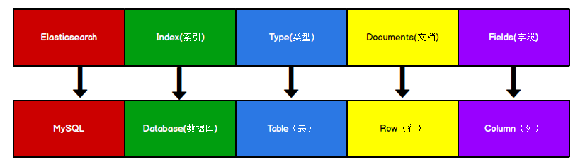
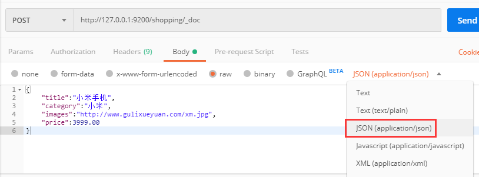

## 04-入门-环境准备

[官方网址](https://www.elastic.co/cn/)

[官方文档](https://www.elastic.co/guide/index.html)

[Elasticsearch 7.8.0下载页面](https://www.elastic.co/cn/downloads/past-releases/elasticsearch-7-8-0)

Windows 版的 Elasticsearch 压缩包，解压即安装完毕，解压后的 Elasticsearch 的目录结构如下 ：

|  目录   |      含义      |
| :-----: | :------------: |
|   bin   | 可执行脚本目录 |
| config  |    配置目录    |
|   jdk   | 内置 JDK 目录  |
|   lib   |      类库      |
|  logs   |    日志目录    |
| modules |    模块目录    |
| plugins |    插件目录    |

解压后，进入 bin 文件目录，点击 elasticsearch.bat 文件启动 ES 服务 。

注意： 9300 端口为 Elasticsearch 集群间组件的通信端口， 9200 端口为浏览器访问的 http协议 RESTful 端口。

打开浏览器，输入地址： http://localhost:9200，测试返回结果，返回结果如下：


```json
{
  "name" : "DESKTOP-LNJQ0VF",
  "cluster_name" : "elasticsearch",
  "cluster_uuid" : "nCZqBhfdT1-pw8Yas4QU9w",
  "version" : {
    "number" : "7.8.0",
    "build_flavor" : "default",
    "build_type" : "zip",
    "build_hash" : "757314695644ea9a1dc2fecd26d1a43856725e65",
    "build_date" : "2020-06-14T19:35:50.234439Z",
    "build_snapshot" : false,
    "lucene_version" : "8.5.1",
    "minimum_wire_compatibility_version" : "6.8.0",
    "minimum_index_compatibility_version" : "6.0.0-beta1"
  },
  "tagline" : "You Know, for Search"
}

```


## 05-入门-RESTful & JSON

REST 指的是一组架构约束条件和原则。满足这些约束条件和原则的应用程序或设计就是 RESTful。 Web 应用程序最重要的 REST 原则是，客户端和服务器之间的交互在请求之间是无状态的。从客户端到服务器的每个请求都必须包含理解请求所必需的信息。如果服务器在请求之间的任何时间点重启，客户端不会得到通知。此外，无状态请求可以由任何可用服务器回答，这十分适合云计算之类的环境。客户端可以缓存数据以改进性能。

在服务器端，应用程序状态和功能可以分为各种资源。资源是一个有趣的概念实体，它向客户端公开。资源的例子有：应用程序对象、数据库记录、算法等等。每个资源都使用 URI(Universal Resource Identifier) 得到一个唯一的地址。所有资源都共享统一的接口，以便在客户端和服务器之间传输状态。使用的是标准的 HTTP 方法，比如 GET、 PUT、 POST 和DELETE。

在 REST 样式的 Web 服务中，每个资源都有一个地址。资源本身都是方法调用的目
标，方法列表对所有资源都是一样的。这些方法都是标准方法，包括 HTTP GET、 POST、PUT、 DELETE，还可能包括 HEAD 和 OPTIONS。简单的理解就是，如果想要访问互联网上的资源，就必须向资源所在的服务器发出请求，请求体中必须包含资源的网络路径， 以及对资源进行的操作(增删改查)。

REST 样式的 Web 服务若有返回结果，大多数以JSON字符串形式返回。


## 06-入门-[Postman](https://so.csdn.net/so/search?q=Postman&spm=1001.2101.3001.7020)客户端工具

如果直接通过浏览器向 Elasticsearch 服务器发请求，那么需要在发送的请求中包含
HTTP 标准的方法，而 HTTP 的大部分特性且仅支持 GET 和 POST 方法。所以为了能方便地进行客户端的访问，可以使用 Postman 软件Postman 是一款强大的网页调试工具，提供功能强大的 Web API 和 HTTP 请求调试。

软件功能强大，界面简洁明晰、操作方便快捷，设计得很人性化。 Postman 中文版能够发送任何类型的 HTTP 请求 (GET, HEAD, POST, PUT…)，不仅能够表单提交，且可以附带任意类型请求体。

[Postman下载页面](https://www.postman.com/downloads/)


## 07-入门-倒排索引

正排索引（传统）

|  id  |       content        |
| :--: | :------------------: |
| 1001 | my name is zhang san |
| 1002 |   my name is li si   |

倒排索引

| keyword |     id     |
| :-----: | :--------: |
|  name   | 1001, 1002 |
|  zhang  |    1001    |

Elasticsearch 是**面向文档型数据库**，一条数据在这里就是一个文档。 为了方便大家理解，我们将 Elasticsearch 里存储文档数据和关系型数据库 MySQL 存储数据的概念进行一个类比



ES 里的 Index 可以看做一个库，而 Types 相当于表， Documents 则相当于表的行。这里 Types 的概念已经被逐渐弱化， Elasticsearch 6.X 中，一个 index 下已经只能包含一个type， Elasticsearch 7.X 中, Type 的概念已经被删除了。


## 08-入门-HTTP-索引-创建

对比关系型数据库，创建索引就等同于创建数据库。

在 Postman 中，向 ES 服务器发 PUT 请求 ： http://127.0.0.1:9200/shopping

请求后，服务器返回响应：

```json
{
    "acknowledged": true,//响应结果
    "shards_acknowledged": true,//分片结果
    "index": "shopping"//索引名称
}
```

后台日志：

```
[2021-04-08T13:57:06,954][INFO ][o.e.c.m.MetadataCreateIndexService] [DESKTOP-LNJQ0VF] [shopping] creating index, cause [api], templates [], shards [1]/[1], mappings []
```

如果重复发 PUT 请求 ： http://127.0.0.1:9200/shopping 添加索引，会返回错误信息 :

```js
{
    "error": {
        "root_cause": [
            {
                "type": "resource_already_exists_exception",
                "reason": "index [shopping/J0WlEhh4R7aDrfIc3AkwWQ] already exists",
                "index_uuid": "J0WlEhh4R7aDrfIc3AkwWQ",
                "index": "shopping"
            }
        ],
        "type": "resource_already_exists_exception",
        "reason": "index [shopping/J0WlEhh4R7aDrfIc3AkwWQ] already exists",
        "index_uuid": "J0WlEhh4R7aDrfIc3AkwWQ",
        "index": "shopping"
    },
    "status": 400
}
```


## 09-入门-HTTP-索引-查询 & 删除

**查看所有索引**

在 Postman 中，向 ES 服务器发 GET 请求 ： http://127.0.0.1:9200/_cat/indices?v

这里请求路径中的_cat 表示查看的意思， indices 表示索引，所以整体含义就是查看当前 ES服务器中的所有索引，就好像 MySQL 中的 show tables 的感觉，服务器响应结果如下 :


```
health status index    uuid                   pri rep docs.count docs.deleted store.size pri.store.size
yellow open   shopping J0WlEhh4R7aDrfIc3AkwWQ   1   1          0            0       208b           208b
```

|      表头      |                             含义                             |
| :------------: | :----------------------------------------------------------: |
|     health     | 当前服务器健康状态： green(集群完整) yellow(单点正常、集群不完整) red(单点不正常) |
|     status     |                      索引打开、关闭状态                      |
|     index      |                            索引名                            |
|      uuid      |                         索引统一编号                         |
|      pri       |                          主分片数量                          |
|      rep       |                           副本数量                           |
|   docs.count   |                         可用文档数量                         |
|  docs.deleted  |                   文档删除状态（逻辑删除）                   |
|   store.size   |                 主分片和副分片整体占空间大小                 |
| pri.store.size |                       主分片占空间大小                       |


### 查看单个索引

在 Postman 中，向 ES 服务器发 GET 请求 ： http://127.0.0.1:9200/shopping

返回结果如下：

```json
{
    "shopping": {//索引名
        "aliases": {},//别名
        "mappings": {},//映射
        "settings": {//设置
            "index": {//设置 - 索引
                "creation_date": "1617861426847",//设置 - 索引 - 创建时间
                "number_of_shards": "1",//设置 - 索引 - 主分片数量
                "number_of_replicas": "1",//设置 - 索引 - 主分片数量
                "uuid": "J0WlEhh4R7aDrfIc3AkwWQ",//设置 - 索引 - 主分片数量
                "version": {//设置 - 索引 - 主分片数量
                    "created": "7080099"
                },
                "provided_name": "shopping"//设置 - 索引 - 主分片数量
            }
        }
    }
}
```


### 删除索引

在 Postman 中，向 ES 服务器发 DELETE 请求 ： http://127.0.0.1:9200/shopping

返回结果如下：

```json
{
    "acknowledged": true
}
```

再次查看所有索引，GET http://127.0.0.1:9200/_cat/indices?v，返回结果如下：

```
health status index uuid pri rep docs.count docs.deleted store.size pri.store.size
```

成功删除。


## 10-入门-HTTP-文档-创建（Put & Post）

假设索引已经创建好了，接下来我们来创建文档，并添加数据。这里的文档可以类比为关系型数据库中的表数据，添加的数据格式为 JSON 格式

在 Postman 中，向 ES 服务器发 POST 请求 ： http://127.0.0.1:9200/shopping/_doc，请求体JSON内容为：


```json
{
    "title":"小米手机",
    "category":"小米",
    "images":"http://www.gulixueyuan.com/xm.jpg",
    "price":3999.00
}
```



注意，此处发送请求的方式必须为 POST，不能是 PUT，否则会发生错误 。

返回结果：

```json
{
    "_index": "shopping",//索引
    "_type": "_doc",//类型-文档
    "_id": "ANQqsHgBaKNfVnMbhZYU",//唯一标识，可以类比为 MySQL 中的主键，随机生成
    "_version": 1,//版本
    "result": "created",//结果，这里的 create 表示创建成功
    "_shards": {//
        "total": 2,//分片 - 总数
        "successful": 1,//分片 - 总数
        "failed": 0//分片 - 总数
    },
    "_seq_no": 0,
    "_primary_term": 1
}
```

上面的数据创建后，由于没有指定数据唯一性标识（ID），默认情况下， ES 服务器会随机生成一个。

如果想要自定义唯一性标识，需要在创建时指定： http://127.0.0.1:9200/shopping/_doc/1，请求体JSON内容为：

```json
{
    "title":"小米手机",
    "category":"小米",
    "images":"http://www.gulixueyuan.com/xm.jpg",
    "price":3999.00
}
```

返回结果如下：

```json
{
    "_index": "shopping",
    "_type": "_doc",
    "_id": "1",//<------------------自定义唯一性标识
    "_version": 1,
    "result": "created",
    "_shards": {
        "total": 2,
        "successful": 1,
        "failed": 0
    },
    "_seq_no": 1,
    "_primary_term": 1
}
```

**此处需要注意：如果增加数据时明确数据主键，那么请求方式也可以为 PUT。**


## 11-入门-HTTP-查询-主键查询 & 全查询

查看文档时，需要指明文档的唯一性标识，类似于 MySQL 中数据的主键查询

在 Postman 中，向 ES 服务器发 GET 请求 ： http://127.0.0.1:9200/shopping/_doc/1 。

返回结果如下：

```json
{
    "_index": "shopping",
    "_type": "_doc",
    "_id": "1",
    "_version": 1,
    "_seq_no": 1,
    "_primary_term": 1,
    "found": true,
    "_source": {
        "title": "小米手机",
        "category": "小米",
        "images": "http://www.gulixueyuan.com/xm.jpg",
        "price": 3999
    }
}
```

查找不存在的内容，向 ES 服务器发 GET 请求 ： http://127.0.0.1:9200/shopping/_doc/1001。

返回结果如下：

```json
{
    "_index": "shopping",
    "_type": "_doc",
    "_id": "1001",
    "found": false
}
```

查看索引下所有数据，向 ES 服务器发 GET 请求 ： http://127.0.0.1:9200/shopping/_search。

返回结果如下：

```json
{
    "took": 133,
    "timed_out": false,
    "_shards": {
        "total": 1,
        "successful": 1,
        "skipped": 0,
        "failed": 0
    },
    "hits": {
        "total": {
            "value": 2,
            "relation": "eq"
        },
        "max_score": 1,
        "hits": [
            {
                "_index": "shopping",
                "_type": "_doc",
                "_id": "ANQqsHgBaKNfVnMbhZYU",
                "_score": 1,
                "_source": {
                    "title": "小米手机",
                    "category": "小米",
                    "images": "http://www.gulixueyuan.com/xm.jpg",
                    "price": 3999
                }
            },
            {
                "_index": "shopping",
                "_type": "_doc",
                "_id": "1",
                "_score": 1,
                "_source": {
                    "title": "小米手机",
                    "category": "小米",
                    "images": "http://www.gulixueyuan.com/xm.jpg",
                    "price": 3999
                }
            }
        ]
    }
}
```


## 12-入门-HTTP-全量修改 & 局部修改 & 删除


### 全量修改

和新增文档一样，输入相同的 URL 地址请求，如果请求体变化，会将原有的数据内容覆盖

在 Postman 中，向 ES 服务器发 POST 请求 ： http://127.0.0.1:9200/shopping/_doc/1

请求体JSON内容为:

```json
{
    "title":"华为手机",
    "category":"华为",
    "images":"http://www.gulixueyuan.com/hw.jpg",
    "price":1999.00
}
```

修改成功后，服务器响应结果：

```json
{
    "_index": "shopping",
    "_type": "_doc",
    "_id": "1",
    "_version": 2,
    "result": "updated",//<-----------updated 表示数据被更新
    "_shards": {
        "total": 2,
        "successful": 1,
        "failed": 0
    },
    "_seq_no": 2,
    "_primary_term": 1
}
```


### 局部修改

修改数据时，也可以只修改某一给条数据的局部信息

在 Postman 中，向 ES 服务器发 POST 请求 ： http://127.0.0.1:9200/shopping/_update/1。

请求体JSON内容为:

```json
{
	"doc": {
		"title":"小米手机",
		"category":"小米"
	}
}
```

返回结果如下：

```json
{
    "_index": "shopping",
    "_type": "_doc",
    "_id": "1",
    "_version": 3,
    "result": "updated",//<-----------updated 表示数据被更新
    "_shards": {
        "total": 2,
        "successful": 1,
        "failed": 0
    },
    "_seq_no": 3,
    "_primary_term": 1
}
```

在 Postman 中，向 ES 服务器发 GET请求 ： http://127.0.0.1:9200/shopping/_doc/1，查看修改内容：

```json
{
    "_index": "shopping",
    "_type": "_doc",
    "_id": "1",
    "_version": 3,
    "_seq_no": 3,
    "_primary_term": 1,
    "found": true,
    "_source": {
        "title": "小米手机",
        "category": "小米",
        "images": "http://www.gulixueyuan.com/hw.jpg",
        "price": 1999
    }
}
```


### 删除

删除一个文档不会立即从磁盘上移除，它只是被标记成已删除（逻辑删除）。

在 Postman 中，向 ES 服务器发 DELETE 请求 ： http://127.0.0.1:9200/shopping/_doc/1

返回结果：

```json
{
    "_index": "shopping",
    "_type": "_doc",
    "_id": "1",
    "_version": 4,
    "result": "deleted",//<---删除成功
    "_shards": {
        "total": 2,
        "successful": 1,
        "failed": 0
    },
    "_seq_no": 4,
    "_primary_term": 1
}
```

在 Postman 中，向 ES 服务器发 GET请求 ： http://127.0.0.1:9200/shopping/_doc/1，查看是否删除成功：

```json
{
    "_index": "shopping",
    "_type": "_doc",
    "_id": "1",
    "found": false
}
```


## 13-入门-HTTP-条件查询 & 分页查询 & 查询排序


### 条件查询

假设有以下文档内容，（在 Postman 中，向 ES 服务器发 GET请求 ： http://127.0.0.1:9200/shopping/_search）：

```json
{
    "took": 5,
    "timed_out": false,
    "_shards": {
        "total": 1,
        "successful": 1,
        "skipped": 0,
        "failed": 0
    },
    "hits": {
        "total": {
            "value": 6,
            "relation": "eq"
        },
        "max_score": 1,
        "hits": [
            {
                "_index": "shopping",
                "_type": "_doc",
                "_id": "ANQqsHgBaKNfVnMbhZYU",
                "_score": 1,
                "_source": {
                    "title": "小米手机",
                    "category": "小米",
                    "images": "http://www.gulixueyuan.com/xm.jpg",
                    "price": 3999
                }
            },
            {
                "_index": "shopping",
                "_type": "_doc",
                "_id": "A9R5sHgBaKNfVnMb25Ya",
                "_score": 1,
                "_source": {
                    "title": "小米手机",
                    "category": "小米",
                    "images": "http://www.gulixueyuan.com/xm.jpg",
                    "price": 1999
                }
            },
            {
                "_index": "shopping",
                "_type": "_doc",
                "_id": "BNR5sHgBaKNfVnMb7pal",
                "_score": 1,
                "_source": {
                    "title": "小米手机",
                    "category": "小米",
                    "images": "http://www.gulixueyuan.com/xm.jpg",
                    "price": 1999
                }
            },
            {
                "_index": "shopping",
                "_type": "_doc",
                "_id": "BtR6sHgBaKNfVnMbX5Y5",
                "_score": 1,
                "_source": {
                    "title": "华为手机",
                    "category": "华为",
                    "images": "http://www.gulixueyuan.com/xm.jpg",
                    "price": 1999
                }
            },
            {
                "_index": "shopping",
                "_type": "_doc",
                "_id": "B9R6sHgBaKNfVnMbZpZ6",
                "_score": 1,
                "_source": {
                    "title": "华为手机",
                    "category": "华为",
                    "images": "http://www.gulixueyuan.com/xm.jpg",
                    "price": 1999
                }
            },
            {
                "_index": "shopping",
                "_type": "_doc",
                "_id": "CdR7sHgBaKNfVnMbsJb9",
                "_score": 1,
                "_source": {
                    "title": "华为手机",
                    "category": "华为",
                    "images": "http://www.gulixueyuan.com/xm.jpg",
                    "price": 1999
                }
            }
        ]
    }
}
```


#### URL带参查询

**查找category为小米的文档**，在 Postman 中，向 ES 服务器发 GET请求 ： http://127.0.0.1:9200/shopping/_search?q=category:小米，返回结果如下：

```json
{
    "took": 94,
    "timed_out": false,
    "_shards": {
        "total": 1,
        "successful": 1,
        "skipped": 0,
        "failed": 0
    },
    "hits": {
        "total": {
            "value": 3,
            "relation": "eq"
        },
        "max_score": 1.3862942,
        "hits": [
            {
                "_index": "shopping",
                "_type": "_doc",
                "_id": "ANQqsHgBaKNfVnMbhZYU",
                "_score": 1.3862942,
                "_source": {
                    "title": "小米手机",
                    "category": "小米",
                    "images": "http://www.gulixueyuan.com/xm.jpg",
                    "price": 3999
                }
            },
            {
                "_index": "shopping",
                "_type": "_doc",
                "_id": "A9R5sHgBaKNfVnMb25Ya",
                "_score": 1.3862942,
                "_source": {
                    "title": "小米手机",
                    "category": "小米",
                    "images": "http://www.gulixueyuan.com/xm.jpg",
                    "price": 1999
                }
            },
            {
                "_index": "shopping",
                "_type": "_doc",
                "_id": "BNR5sHgBaKNfVnMb7pal",
                "_score": 1.3862942,
                "_source": {
                    "title": "小米手机",
                    "category": "小米",
                    "images": "http://www.gulixueyuan.com/xm.jpg",
                    "price": 1999
                }
            }
        ]
    }
}
```

上述为URL带参数形式查询，这很容易让不善者心怀恶意，或者参数值出现中文会出现乱码情况。为了避免这些情况，我们可用使用带JSON请求体请求进行查询。


#### 请求体带参查询

接下带JSON请求体，还是**查找category为小米的文档**，在 Postman 中，向 ES 服务器发 GET请求 ： http://127.0.0.1:9200/shopping/_search，附带JSON体如下：

```json
{
	"query":{
		"match":{
			"category":"小米"
		}
	}
}
```

返回结果如下：

```json
{
    "took": 3,
    "timed_out": false,
    "_shards": {
        "total": 1,
        "successful": 1,
        "skipped": 0,
        "failed": 0
    },
    "hits": {
        "total": {
            "value": 3,
            "relation": "eq"
        },
        "max_score": 1.3862942,
        "hits": [
            {
                "_index": "shopping",
                "_type": "_doc",
                "_id": "ANQqsHgBaKNfVnMbhZYU",
                "_score": 1.3862942,
                "_source": {
                    "title": "小米手机",
                    "category": "小米",
                    "images": "http://www.gulixueyuan.com/xm.jpg",
                    "price": 3999
                }
            },
            {
                "_index": "shopping",
                "_type": "_doc",
                "_id": "A9R5sHgBaKNfVnMb25Ya",
                "_score": 1.3862942,
                "_source": {
                    "title": "小米手机",
                    "category": "小米",
                    "images": "http://www.gulixueyuan.com/xm.jpg",
                    "price": 1999
                }
            },
            {
                "_index": "shopping",
                "_type": "_doc",
                "_id": "BNR5sHgBaKNfVnMb7pal",
                "_score": 1.3862942,
                "_source": {
                    "title": "小米手机",
                    "category": "小米",
                    "images": "http://www.gulixueyuan.com/xm.jpg",
                    "price": 1999
                }
            }
        ]
    }
}
```


#### 带请求体方式的查找所有内容

**查找所有文档内容**，也可以这样，在 Postman 中，向 ES 服务器发 GET请求 ： http://127.0.0.1:9200/shopping/_search，附带JSON体如下：

```json
{
	"query":{
		"match_all":{}
	}
}
```

则返回所有文档内容：

```json
{
    "took": 2,
    "timed_out": false,
    "_shards": {
        "total": 1,
        "successful": 1,
        "skipped": 0,
        "failed": 0
    },
    "hits": {
        "total": {
            "value": 6,
            "relation": "eq"
        },
        "max_score": 1,
        "hits": [
            {
                "_index": "shopping",
                "_type": "_doc",
                "_id": "ANQqsHgBaKNfVnMbhZYU",
                "_score": 1,
                "_source": {
                    "title": "小米手机",
                    "category": "小米",
                    "images": "http://www.gulixueyuan.com/xm.jpg",
                    "price": 3999
                }
            },
            {
                "_index": "shopping",
                "_type": "_doc",
                "_id": "A9R5sHgBaKNfVnMb25Ya",
                "_score": 1,
                "_source": {
                    "title": "小米手机",
                    "category": "小米",
                    "images": "http://www.gulixueyuan.com/xm.jpg",
                    "price": 1999
                }
            },
            {
                "_index": "shopping",
                "_type": "_doc",
                "_id": "BNR5sHgBaKNfVnMb7pal",
                "_score": 1,
                "_source": {
                    "title": "小米手机",
                    "category": "小米",
                    "images": "http://www.gulixueyuan.com/xm.jpg",
                    "price": 1999
                }
            },
            {
                "_index": "shopping",
                "_type": "_doc",
                "_id": "BtR6sHgBaKNfVnMbX5Y5",
                "_score": 1,
                "_source": {
                    "title": "华为手机",
                    "category": "华为",
                    "images": "http://www.gulixueyuan.com/xm.jpg",
                    "price": 1999
                }
            },
            {
                "_index": "shopping",
                "_type": "_doc",
                "_id": "B9R6sHgBaKNfVnMbZpZ6",
                "_score": 1,
                "_source": {
                    "title": "华为手机",
                    "category": "华为",
                    "images": "http://www.gulixueyuan.com/xm.jpg",
                    "price": 1999
                }
            },
            {
                "_index": "shopping",
                "_type": "_doc",
                "_id": "CdR7sHgBaKNfVnMbsJb9",
                "_score": 1,
                "_source": {
                    "title": "华为手机",
                    "category": "华为",
                    "images": "http://www.gulixueyuan.com/xm.jpg",
                    "price": 1999
                }
            }
        ]
    }
}
```


#### 查询指定字段

**如果你想查询指定字段**，在 Postman 中，向 ES 服务器发 GET请求 ： http://127.0.0.1:9200/shopping/_search，附带JSON体如下：

```json
{
	"query":{
		"match_all":{}
	},
	"_source":["title"]
}
```

返回结果如下：

```json
{
    "took": 5,
    "timed_out": false,
    "_shards": {
        "total": 1,
        "successful": 1,
        "skipped": 0,
        "failed": 0
    },
    "hits": {
        "total": {
            "value": 6,
            "relation": "eq"
        },
        "max_score": 1,
        "hits": [
            {
                "_index": "shopping",
                "_type": "_doc",
                "_id": "ANQqsHgBaKNfVnMbhZYU",
                "_score": 1,
                "_source": {
                    "title": "小米手机"
                }
            },
            {
                "_index": "shopping",
                "_type": "_doc",
                "_id": "A9R5sHgBaKNfVnMb25Ya",
                "_score": 1,
                "_source": {
                    "title": "小米手机"
                }
            },
            {
                "_index": "shopping",
                "_type": "_doc",
                "_id": "BNR5sHgBaKNfVnMb7pal",
                "_score": 1,
                "_source": {
                    "title": "小米手机"
                }
            },
            {
                "_index": "shopping",
                "_type": "_doc",
                "_id": "BtR6sHgBaKNfVnMbX5Y5",
                "_score": 1,
                "_source": {
                    "title": "华为手机"
                }
            },
            {
                "_index": "shopping",
                "_type": "_doc",
                "_id": "B9R6sHgBaKNfVnMbZpZ6",
                "_score": 1,
                "_source": {
                    "title": "华为手机"
                }
            },
            {
                "_index": "shopping",
                "_type": "_doc",
                "_id": "CdR7sHgBaKNfVnMbsJb9",
                "_score": 1,
                "_source": {
                    "title": "华为手机"
                }
            }
        ]
    }
}
```


### 分页查询

在 Postman 中，向 ES 服务器发 GET请求 ： http://127.0.0.1:9200/shopping/_search，附带JSON体如下：

```json
{
	"query":{
		"match_all":{}
	},
	"from":0,
	"size":2
}
```

返回结果如下：

```json
{
    "took": 1,
    "timed_out": false,
    "_shards": {
        "total": 1,
        "successful": 1,
        "skipped": 0,
        "failed": 0
    },
    "hits": {
        "total": {
            "value": 6,
            "relation": "eq"
        },
        "max_score": 1,
        "hits": [
            {
                "_index": "shopping",
                "_type": "_doc",
                "_id": "ANQqsHgBaKNfVnMbhZYU",
                "_score": 1,
                "_source": {
                    "title": "小米手机",
                    "category": "小米",
                    "images": "http://www.gulixueyuan.com/xm.jpg",
                    "price": 3999
                }
            },
            {
                "_index": "shopping",
                "_type": "_doc",
                "_id": "A9R5sHgBaKNfVnMb25Ya",
                "_score": 1,
                "_source": {
                    "title": "小米手机",
                    "category": "小米",
                    "images": "http://www.gulixueyuan.com/xm.jpg",
                    "price": 1999
                }
            }
        ]
    }
}

```


### 查询排序

如果你想通过排序查出价格最高的手机，在 Postman 中，向 ES 服务器发 GET请求 ： http://127.0.0.1:9200/shopping/_search，附带JSON体如下：

```json
{
	"query":{
		"match_all":{}
	},
	"sort":{
		"price":{
			"order":"desc"
		}
	}
}
```

返回结果如下：

```json
{
    "took": 96,
    "timed_out": false,
    "_shards": {
        "total": 1,
        "successful": 1,
        "skipped": 0,
        "failed": 0
    },
    "hits": {
        "total": {
            "value": 6,
            "relation": "eq"
        },
        "max_score": null,
        "hits": [
            {
                "_index": "shopping",
                "_type": "_doc",
                "_id": "ANQqsHgBaKNfVnMbhZYU",
                "_score": null,
                "_source": {
                    "title": "小米手机",
                    "category": "小米",
                    "images": "http://www.gulixueyuan.com/xm.jpg",
                    "price": 3999
                },
                "sort": [
                    3999
                ]
            },
            {
                "_index": "shopping",
                "_type": "_doc",
                "_id": "A9R5sHgBaKNfVnMb25Ya",
                "_score": null,
                "_source": {
                    "title": "小米手机",
                    "category": "小米",
                    "images": "http://www.gulixueyuan.com/xm.jpg",
                    "price": 1999
                },
                "sort": [
                    1999
                ]
            },
            {
                "_index": "shopping",
                "_type": "_doc",
                "_id": "BNR5sHgBaKNfVnMb7pal",
                "_score": null,
                "_source": {
                    "title": "小米手机",
                    "category": "小米",
                    "images": "http://www.gulixueyuan.com/xm.jpg",
                    "price": 1999
                },
                "sort": [
                    1999
                ]
            },
            {
                "_index": "shopping",
                "_type": "_doc",
                "_id": "BtR6sHgBaKNfVnMbX5Y5",
                "_score": null,
                "_source": {
                    "title": "华为手机",
                    "category": "华为",
                    "images": "http://www.gulixueyuan.com/xm.jpg",
                    "price": 1999
                },
                "sort": [
                    1999
                ]
            },
            {
                "_index": "shopping",
                "_type": "_doc",
                "_id": "B9R6sHgBaKNfVnMbZpZ6",
                "_score": null,
                "_source": {
                    "title": "华为手机",
                    "category": "华为",
                    "images": "http://www.gulixueyuan.com/xm.jpg",
                    "price": 1999
                },
                "sort": [
                    1999
                ]
            },
            {
                "_index": "shopping",
                "_type": "_doc",
                "_id": "CdR7sHgBaKNfVnMbsJb9",
                "_score": null,
                "_source": {
                    "title": "华为手机",
                    "category": "华为",
                    "images": "http://www.gulixueyuan.com/xm.jpg",
                    "price": 1999
                },
                "sort": [
                    1999
                ]
            }
        ]
    }
}
```


## 14-入门-HTTP-多条件查询 & 范围查询

### 多条件查询

假设想找出小米牌子，价格为3999元的。（must相当于数据库的&&）

在 Postman 中，向 ES 服务器发 GET请求 ： http://127.0.0.1:9200/shopping/_search，附带JSON体如下：

```json
{
	"query":{
		"bool":{
			"must":[{
				"match":{
					"category":"小米"
				}
			},{
				"match":{
					"price":3999.00
				}
			}]
		}
	}
}
```

返回结果如下：

```json
{
    "took": 134,
    "timed_out": false,
    "_shards": {
        "total": 1,
        "successful": 1,
        "skipped": 0,
        "failed": 0
    },
    "hits": {
        "total": {
            "value": 1,
            "relation": "eq"
        },
        "max_score": 2.3862944,
        "hits": [
            {
                "_index": "shopping",
                "_type": "_doc",
                "_id": "ANQqsHgBaKNfVnMbhZYU",
                "_score": 2.3862944,
                "_source": {
                    "title": "小米手机",
                    "category": "小米",
                    "images": "http://www.gulixueyuan.com/xm.jpg",
                    "price": 3999
                }
            }
        ]
    }
}
```

假设想找出小米和华为的牌子。（should相当于数据库的||）

在 Postman 中，向 ES 服务器发 GET请求 ： http://127.0.0.1:9200/shopping/_search，附带JSON体如下：

```json
{
	"query":{
		"bool":{
			"should":[{
				"match":{
					"category":"小米"
				}
			},{
				"match":{
					"category":"华为"
				}
			}]
		},
        "filter":{
            "range":{
                "price":{
                    "gt":2000
                }
            }
        }
	}
}
```

返回结果如下：

```json
{
    "took": 8,
    "timed_out": false,
    "_shards": {
        "total": 1,
        "successful": 1,
        "skipped": 0,
        "failed": 0
    },
    "hits": {
        "total": {
            "value": 6,
            "relation": "eq"
        },
        "max_score": 1.3862942,
        "hits": [
            {
                "_index": "shopping",
                "_type": "_doc",
                "_id": "ANQqsHgBaKNfVnMbhZYU",
                "_score": 1.3862942,
                "_source": {
                    "title": "小米手机",
                    "category": "小米",
                    "images": "http://www.gulixueyuan.com/xm.jpg",
                    "price": 3999
                }
            },
            {
                "_index": "shopping",
                "_type": "_doc",
                "_id": "A9R5sHgBaKNfVnMb25Ya",
                "_score": 1.3862942,
                "_source": {
                    "title": "小米手机",
                    "category": "小米",
                    "images": "http://www.gulixueyuan.com/xm.jpg",
                    "price": 1999
                }
            },
            {
                "_index": "shopping",
                "_type": "_doc",
                "_id": "BNR5sHgBaKNfVnMb7pal",
                "_score": 1.3862942,
                "_source": {
                    "title": "小米手机",
                    "category": "小米",
                    "images": "http://www.gulixueyuan.com/xm.jpg",
                    "price": 1999
                }
            },
            {
                "_index": "shopping",
                "_type": "_doc",
                "_id": "BtR6sHgBaKNfVnMbX5Y5",
                "_score": 1.3862942,
                "_source": {
                    "title": "华为手机",
                    "category": "华为",
                    "images": "http://www.gulixueyuan.com/xm.jpg",
                    "price": 1999
                }
            },
            {
                "_index": "shopping",
                "_type": "_doc",
                "_id": "B9R6sHgBaKNfVnMbZpZ6",
                "_score": 1.3862942,
                "_source": {
                    "title": "华为手机",
                    "category": "华为",
                    "images": "http://www.gulixueyuan.com/xm.jpg",
                    "price": 1999
                }
            },
            {
                "_index": "shopping",
                "_type": "_doc",
                "_id": "CdR7sHgBaKNfVnMbsJb9",
                "_score": 1.3862942,
                "_source": {
                    "title": "华为手机",
                    "category": "华为",
                    "images": "http://www.gulixueyuan.com/xm.jpg",
                    "price": 1999
                }
            }
        ]
    }
}
```


### 范围查询

假设想找出小米和华为的牌子，价格大于2000元的手机。

在 Postman 中，向 ES 服务器发 GET请求 ： http://127.0.0.1:9200/shopping/_search，附带JSON体如下：

```json
{
	"query":{
		"bool":{
			"should":[{
				"match":{
					"category":"小米"
				}
			},{
				"match":{
					"category":"华为"
				}
			}],
            "filter":{
            	"range":{
                	"price":{
                    	"gt":2000
                	}
	            }
    	    }
		}
	}
}
```

返回结果如下：

```json
{ 
   "took": 72,
    "timed_out": false,
    "_shards": {
        "total": 1,
        "successful": 1,
        "skipped": 0,
        "failed": 0
    },
    "hits": {
        "total": {
            "value": 1,
            "relation": "eq"
        },
        "max_score": 1.3862942,
        "hits": [
            {
                "_index": "shopping",
                "_type": "_doc",
                "_id": "ANQqsHgBaKNfVnMbhZYU",
                "_score": 1.3862942,
                "_source": {
                    "title": "小米手机",
                    "category": "小米",
                    "images": "http://www.gulixueyuan.com/xm.jpg",
                    "price": 3999
                }
            }
        ]
    }
}
```


## 15-入门-HTTP-全文检索 & 完全匹配 & 高亮查询

### 全文检索

这功能像搜索引擎那样，如品牌输入“小华”，返回结果带回品牌有“小米”和华为的。

在 Postman 中，向 ES 服务器发 GET请求 ： http://127.0.0.1:9200/shopping/_search，附带JSON体如下：

```json
{
	"query":{
		"match":{
			"category" : "小华"
		}
	}
}
```

返回结果如下：

```json
{
    "took": 7,
    "timed_out": false,
    "_shards": {
        "total": 1,
        "successful": 1,
        "skipped": 0,
        "failed": 0
    },
    "hits": {
        "total": {
            "value": 6,
            "relation": "eq"
        },
        "max_score": 0.6931471,
        "hits": [
            {
                "_index": "shopping",
                "_type": "_doc",
                "_id": "ANQqsHgBaKNfVnMbhZYU",
                "_score": 0.6931471,
                "_source": {
                    "title": "小米手机",
                    "category": "小米",
                    "images": "http://www.gulixueyuan.com/xm.jpg",
                    "price": 3999
                }
            },
            {
                "_index": "shopping",
                "_type": "_doc",
                "_id": "A9R5sHgBaKNfVnMb25Ya",
                "_score": 0.6931471,
                "_source": {
                    "title": "小米手机",
                    "category": "小米",
                    "images": "http://www.gulixueyuan.com/xm.jpg",
                    "price": 1999
                }
            },
            {
                "_index": "shopping",
                "_type": "_doc",
                "_id": "BNR5sHgBaKNfVnMb7pal",
                "_score": 0.6931471,
                "_source": {
                    "title": "小米手机",
                    "category": "小米",
                    "images": "http://www.gulixueyuan.com/xm.jpg",
                    "price": 1999
                }
            },
            {
                "_index": "shopping",
                "_type": "_doc",
                "_id": "BtR6sHgBaKNfVnMbX5Y5",
                "_score": 0.6931471,
                "_source": {
                    "title": "华为手机",
                    "category": "华为",
                    "images": "http://www.gulixueyuan.com/xm.jpg",
                    "price": 1999
                }
            },
            {
                "_index": "shopping",
                "_type": "_doc",
                "_id": "B9R6sHgBaKNfVnMbZpZ6",
                "_score": 0.6931471,
                "_source": {
                    "title": "华为手机",
                    "category": "华为",
                    "images": "http://www.gulixueyuan.com/xm.jpg",
                    "price": 1999
                }
            },
            {
                "_index": "shopping",
                "_type": "_doc",
                "_id": "CdR7sHgBaKNfVnMbsJb9",
                "_score": 0.6931471,
                "_source": {
                    "title": "华为手机",
                    "category": "华为",
                    "images": "http://www.gulixueyuan.com/xm.jpg",
                    "price": 1999
                }
            }
        ]
    }
}
```


### 完全匹配

在 Postman 中，向 ES 服务器发 GET请求 ： http://127.0.0.1:9200/shopping/_search，附带JSON体如下：

```json
{
	"query":{
		"match_phrase":{
			"category" : "为"
		}
	}
}
```

返回结果如下：

```json
{
    "took": 2,
    "timed_out": false,
    "_shards": {
        "total": 1,
        "successful": 1,
        "skipped": 0,
        "failed": 0
    },
    "hits": {
        "total": {
            "value": 3,
            "relation": "eq"
        },
        "max_score": 0.6931471,
        "hits": [
            {
                "_index": "shopping",
                "_type": "_doc",
                "_id": "BtR6sHgBaKNfVnMbX5Y5",
                "_score": 0.6931471,
                "_source": {
                    "title": "华为手机",
                    "category": "华为",
                    "images": "http://www.gulixueyuan.com/xm.jpg",
                    "price": 1999
                }
            },
            {
                "_index": "shopping",
                "_type": "_doc",
                "_id": "B9R6sHgBaKNfVnMbZpZ6",
                "_score": 0.6931471,
                "_source": {
                    "title": "华为手机",
                    "category": "华为",
                    "images": "http://www.gulixueyuan.com/xm.jpg",
                    "price": 1999
                }
            },
            {
                "_index": "shopping",
                "_type": "_doc",
                "_id": "CdR7sHgBaKNfVnMbsJb9",
                "_score": 0.6931471,
                "_source": {
                    "title": "华为手机",
                    "category": "华为",
                    "images": "http://www.gulixueyuan.com/xm.jpg",
                    "price": 1999
                }
            }
        ]
    }
}
```

### 高亮查询

在 Postman 中，向 ES 服务器发 GET请求 ： http://127.0.0.1:9200/shopping/_search，附带JSON体如下：

```json
{
	"query":{
		"match_phrase":{
			"category" : "为"
		}
	},
    "highlight":{
        "fields":{
            "category":{}//<----高亮这字段
        }
    }
}
```

返回结果如下：

```json
{
    "took": 100,
    "timed_out": false,
    "_shards": {
        "total": 1,
        "successful": 1,
        "skipped": 0,
        "failed": 0
    },
    "hits": {
        "total": {
            "value": 3,
            "relation": "eq"
        },
        "max_score": 0.6931471,
        "hits": [
            {
                "_index": "shopping",
                "_type": "_doc",
                "_id": "BtR6sHgBaKNfVnMbX5Y5",
                "_score": 0.6931471,
                "_source": {
                    "title": "华为手机",
                    "category": "华为",
                    "images": "http://www.gulixueyuan.com/xm.jpg",
                    "price": 1999
                },
                "highlight": {
                    "category": [
                        "华<em>为</em>"//<------高亮一个为字。
                    ]
                }
            },
            {
                "_index": "shopping",
                "_type": "_doc",
                "_id": "B9R6sHgBaKNfVnMbZpZ6",
                "_score": 0.6931471,
                "_source": {
                    "title": "华为手机",
                    "category": "华为",
                    "images": "http://www.gulixueyuan.com/xm.jpg",
                    "price": 1999
                },
                "highlight": {
                    "category": [
                        "华<em>为</em>"
                    ]
                }
            },
            {
                "_index": "shopping",
                "_type": "_doc",
                "_id": "CdR7sHgBaKNfVnMbsJb9",
                "_score": 0.6931471,
                "_source": {
                    "title": "华为手机",
                    "category": "华为",
                    "images": "http://www.gulixueyuan.com/xm.jpg",
                    "price": 1999
                },
                "highlight": {
                    "category": [
                        "华<em>为</em>"
                    ]
                }
            }
        ]
    }
}
```


## 16-入门-HTTP-聚合查询

聚合允许使用者对 es 文档进行统计分析，类似与关系型数据库中的 group by，当然还有很多其他的聚合，例如取最大值max、平均值avg等等。

接下来按price字段进行分组：

在 Postman 中，向 ES 服务器发 GET请求 ： http://127.0.0.1:9200/shopping/_search，附带JSON体如下：

```json
{
	"aggs":{//聚合操作
		"price_group":{//名称，随意起名
			"terms":{//分组
				"field":"price"//分组字段
			}
		}
	}
}
```

```json
{
    "took": 63,
    "timed_out": false,
    "_shards": {
        "total": 1,
        "successful": 1,
        "skipped": 0,
        "failed": 0
    },
    "hits": {
        "total": {
            "value": 6,
            "relation": "eq"
        },
        "max_score": 1,
        "hits": [
            {
                "_index": "shopping",
                "_type": "_doc",
                "_id": "ANQqsHgBaKNfVnMbhZYU",
                "_score": 1,
                "_source": {
                    "title": "小米手机",
                    "category": "小米",
                    "images": "http://www.gulixueyuan.com/xm.jpg",
                    "price": 3999
                }
            },
            {
                "_index": "shopping",
                "_type": "_doc",
                "_id": "A9R5sHgBaKNfVnMb25Ya",
                "_score": 1,
                "_source": {
                    "title": "小米手机",
                    "category": "小米",
                    "images": "http://www.gulixueyuan.com/xm.jpg",
                    "price": 1999
                }
            },
            {
                "_index": "shopping",
                "_type": "_doc",
                "_id": "BNR5sHgBaKNfVnMb7pal",
                "_score": 1,
                "_source": {
                    "title": "小米手机",
                    "category": "小米",
                    "images": "http://www.gulixueyuan.com/xm.jpg",
                    "price": 1999
                }
            },
            {
                "_index": "shopping",
                "_type": "_doc",
                "_id": "BtR6sHgBaKNfVnMbX5Y5",
                "_score": 1,
                "_source": {
                    "title": "华为手机",
                    "category": "华为",
                    "images": "http://www.gulixueyuan.com/xm.jpg",
                    "price": 1999
                }
            },
            {
                "_index": "shopping",
                "_type": "_doc",
                "_id": "B9R6sHgBaKNfVnMbZpZ6",
                "_score": 1,
                "_source": {
                    "title": "华为手机",
                    "category": "华为",
                    "images": "http://www.gulixueyuan.com/xm.jpg",
                    "price": 1999
                }
            },
            {
                "_index": "shopping",
                "_type": "_doc",
                "_id": "CdR7sHgBaKNfVnMbsJb9",
                "_score": 1,
                "_source": {
                    "title": "华为手机",
                    "category": "华为",
                    "images": "http://www.gulixueyuan.com/xm.jpg",
                    "price": 1999
                }
            }
        ]
    },
    "aggregations": {
        "price_group": {
            "doc_count_error_upper_bound": 0,
            "sum_other_doc_count": 0,
            "buckets": [
                {
                    "key": 1999,
                    "doc_count": 5
                },
                {
                    "key": 3999,
                    "doc_count": 1
                }
            ]
        }
    }
}
```

上面返回结果会附带原始数据的。若不想要不附带原始数据的结果，在 Postman 中，向 ES 服务器发 GET请求 ： http://127.0.0.1:9200/shopping/_search，附带JSON体如下：

```json
{
	"aggs":{
		"price_group":{
			"terms":{
				"field":"price"
			}
		}
	},
    "size":0
}
```

返回结果如下：

```json
{
    "took": 60,
    "timed_out": false,
    "_shards": {
        "total": 1,
        "successful": 1,
        "skipped": 0,
        "failed": 0
    },
    "hits": {
        "total": {
            "value": 6,
            "relation": "eq"
        },
        "max_score": null,
        "hits": []
    },
    "aggregations": {
        "price_group": {
            "doc_count_error_upper_bound": 0,
            "sum_other_doc_count": 0,
            "buckets": [
                {
                    "key": 1999,
                    "doc_count": 5
                },
                {
                    "key": 3999,
                    "doc_count": 1
                }
            ]
        }
    }
}
```

若想对所有手机价格求**平均值**。

在 Postman 中，向 ES 服务器发 GET请求 ： http://127.0.0.1:9200/shopping/_search，附带JSON体如下：

```json
{
	"aggs":{
		"price_avg":{//名称，随意起名
			"avg":{//求平均
				"field":"price"
			}
		}
	},
    "size":0
}
```

返回结果如下：

```json
{
    "took": 14,
    "timed_out": false,
    "_shards": {
        "total": 1,
        "successful": 1,
        "skipped": 0,
        "failed": 0
    },
    "hits": {
        "total": {
            "value": 6,
            "relation": "eq"
        },
        "max_score": null,
        "hits": []
    },
    "aggregations": {
        "price_avg": {
            "value": 2332.3333333333335
        }
    }
}
```


## 17-入门-HTTP-映射关系

有了索引库，等于有了数据库中的 database。

接下来就需要建索引库(index)中的映射了，类似于数据库(database)中的表结构(table)。

创建数据库表需要设置字段名称，类型，长度，约束等；索引库也一样，需要知道这个类型下有哪些字段，每个字段有哪些约束信息，这就叫做映射(mapping)。

先创建一个索引：

```json
# PUT http://127.0.0.1:9200/user
```

返回结果：

```json
{
    "acknowledged": true,
    "shards_acknowledged": true,
    "index": "user"
}
```

**创建映射**

```json
# PUT http://127.0.0.1:9200/user/_mapping

{
    "properties": {
        "name":{
        	"type": "text",
        	"index": true
        },
        "sex":{
        	"type": "keyword",
        	"index": true
        },
        "tel":{
        	"type": "keyword",
        	"index": false
        }
    }
}
```

返回结果如下：

```json
{
    "acknowledged": true
}
```

**查询映射**

```js
#GET http://127.0.0.1:9200/user/_mapping
```

返回结果如下：

```json
{
    "user": {
        "mappings": {
            "properties": {
                "name": {
                    "type": "text"
                },
                "sex": {
                    "type": "keyword"
                },
                "tel": {
                    "type": "keyword",
                    "index": false
                }
            }
        }
    }
}
```

增加数据

```json
#PUT http://127.0.0.1:9200/user/_create/1001
{
	"name":"小米",
	"sex":"男的",
	"tel":"1111"
}
```

返回结果如下：

```json
{
    "_index": "user",
    "_type": "_doc",
    "_id": "1001",
    "_version": 1,
    "result": "created",
    "_shards": {
        "total": 2,
        "successful": 1,
        "failed": 0
    },
    "_seq_no": 0,
    "_primary_term": 1
}
```

查找name含有”小“数据：

```json
#GET http://127.0.0.1:9200/user/_search
{
	"query":{
		"match":{
			"name":"小"
		}
	}
}
```

返回结果如下：

```json
{
    "took": 495,
    "timed_out": false,
    "_shards": {
        "total": 1,
        "successful": 1,
        "skipped": 0,
        "failed": 0
    },
    "hits": {
        "total": {
            "value": 1,
            "relation": "eq"
        },
        "max_score": 0.2876821,
        "hits": [
            {
                "_index": "user",
                "_type": "_doc",
                "_id": "1001",
                "_score": 0.2876821,
                "_source": {
                    "name": "小米",
                    "sex": "男的",
                    "tel": "1111"
                }
            }
        ]
    }
}
```

查找sex含有”男“数据：

```json
#GET http://127.0.0.1:9200/user/_search
{
	"query":{
		"match":{
			"sex":"男"
		}
	}
}
```

返回结果如下：

```json
{
    "took": 1,
    "timed_out": false,
    "_shards": {
        "total": 1,
        "successful": 1,
        "skipped": 0,
        "failed": 0
    },
    "hits": {
        "total": {
            "value": 0,
            "relation": "eq"
        },
        "max_score": null,
        "hits": []
    }
}
```

找不想要的结果，只因创建映射时"sex"的类型为"keyword"。

"sex"只能完全为”男的“，才能得出原数据。

```json
#GET http://127.0.0.1:9200/user/_search
{
	"query":{
		"match":{
			"sex":"男的"
		}
	}
}
```

返回结果如下：

```json
{
    "took": 2,
    "timed_out": false,
    "_shards": {
        "total": 1,
        "successful": 1,
        "skipped": 0,
        "failed": 0
    },
    "hits": {
        "total": {
            "value": 1,
            "relation": "eq"
        },
        "max_score": 0.2876821,
        "hits": [
            {
                "_index": "user",
                "_type": "_doc",
                "_id": "1001",
                "_score": 0.2876821,
                "_source": {
                    "name": "小米",
                    "sex": "男的",
                    "tel": "1111"
                }
            }
        ]
    }
}
```

查询电话
```json
# GET http://127.0.0.1:9200/user/_search
{
	"query":{
		"match":{
			"tel":"11"
		}
	}
}
```

返回结果如下：

```json
{
    "error": {
        "root_cause": [
            {
                "type": "query_shard_exception",
                "reason": "failed to create query: Cannot search on field [tel] since it is not indexed.",
                "index_uuid": "ivLnMfQKROS7Skb2MTFOew",
                "index": "user"
            }
        ],
        "type": "search_phase_execution_exception",
        "reason": "all shards failed",
        "phase": "query",
        "grouped": true,
        "failed_shards": [
            {
                "shard": 0,
                "index": "user",
                "node": "4P7dIRfXSbezE5JTiuylew",
                "reason": {
                    "type": "query_shard_exception",
                    "reason": "failed to create query: Cannot search on field [tel] since it is not indexed.",
                    "index_uuid": "ivLnMfQKROS7Skb2MTFOew",
                    "index": "user",
                    "caused_by": {
                        "type": "illegal_argument_exception",
                        "reason": "Cannot search on field [tel] since it is not indexed."
                    }
                }
            }
        ]
    },
    "status": 400
}
```

报错只因创建映射时"tel"的"index"为false。


## 18-入门-JavaAPI-环境准备

新建Maven工程。

添加依赖：

```xml
<dependencies>
    <dependency>
        <groupId>org.elasticsearch</groupId>
        <artifactId>elasticsearch</artifactId>
        <version>7.8.0</version>
    </dependency>
    <!-- elasticsearch 的客户端 -->
    <dependency>
        <groupId>org.elasticsearch.client</groupId>
        <artifactId>elasticsearch-rest-high-level-client</artifactId>
        <version>7.8.0</version>
    </dependency>
    <!-- elasticsearch 依赖 2.x 的 log4j -->
    <dependency>
        <groupId>org.apache.logging.log4j</groupId>
        <artifactId>log4j-api</artifactId>
        <version>2.8.2</version>
    </dependency>
    <dependency>
        <groupId>org.apache.logging.log4j</groupId>
        <artifactId>log4j-core</artifactId>
        <version>2.8.2</version>
    </dependency>
    <dependency>
        <groupId>com.fasterxml.jackson.core</groupId>
        <artifactId>jackson-databind</artifactId>
        <version>2.9.9</version>
    </dependency>
    <!-- junit 单元测试 -->
    <dependency>
        <groupId>junit</groupId>
        <artifactId>junit</artifactId>
        <version>4.12</version>
    </dependency>
</dependencies>
```

HelloElasticsearch

```java
import java.io.IOException;

import org.apache.http.HttpHost;
import org.elasticsearch.client.RestClient;
import org.elasticsearch.client.RestHighLevelClient;

public class HelloElasticsearch {

	public static void main(String[] args) throws IOException {
		// 创建客户端对象
		RestHighLevelClient client = new RestHighLevelClient(
				RestClient.builder(new HttpHost("localhost", 9200, "http")));
//		...
		System.out.println(client);

		// 关闭客户端连接
		client.close();
	}
}
```


## 19-入门-JavaAPI-索引-创建

```java
import org.apache.http.HttpHost;
import org.elasticsearch.action.admin.indices.create.CreateIndexRequest;
import org.elasticsearch.action.admin.indices.create.CreateIndexResponse;
import org.elasticsearch.client.RequestOptions;
import org.elasticsearch.client.RestClient;
import org.elasticsearch.client.RestHighLevelClient;

import java.io.IOException;

public class CreateIndex {

    public static void main(String[] args) throws IOException {
        // 创建客户端对象
        RestHighLevelClient client = new RestHighLevelClient(
                RestClient.builder(new HttpHost("localhost", 9200, "http")));

        // 创建索引 - 请求对象
        CreateIndexRequest request = new CreateIndexRequest("user2");
        // 发送请求，获取响应
        CreateIndexResponse response = client.indices().create(request,
                RequestOptions.DEFAULT);
        boolean acknowledged = response.isAcknowledged();
        // 响应状态
        System.out.println("操作状态 = " + acknowledged);

        // 关闭客户端连接
        client.close();
    }

}
```

后台打印：

```java
四月 09, 2021 2:12:08 下午 org.elasticsearch.client.RestClient logResponse
警告: request [PUT http://localhost:9200/user2?master_timeout=30s&include_type_name=true&timeout=30s] returned 1 warnings: [299 Elasticsearch-7.8.0-757314695644ea9a1dc2fecd26d1a43856725e65 "[types removal] Using include_type_name in create index requests is deprecated. The parameter will be removed in the next major version."]
操作状态 = true

Process finished with exit code 0
```


## 20-入门-JavaAPI-索引-查询 & 删除

### 查询

```java
import org.apache.http.HttpHost;

import org.elasticsearch.client.RequestOptions;
import org.elasticsearch.client.RestClient;
import org.elasticsearch.client.RestHighLevelClient;
import org.elasticsearch.client.indices.GetIndexRequest;
import org.elasticsearch.client.indices.GetIndexResponse;

import java.io.IOException;

public class SearchIndex {
    public static void main(String[] args) throws IOException {
        // 创建客户端对象
        RestHighLevelClient client = new RestHighLevelClient(
                RestClient.builder(new HttpHost("localhost", 9200, "http")));

        // 查询索引 - 请求对象
        GetIndexRequest request = new GetIndexRequest("user2");
        // 发送请求，获取响应
        GetIndexResponse response = client.indices().get(request,
                RequestOptions.DEFAULT);
        
        System.out.println("aliases:"+response.getAliases());
        System.out.println("mappings:"+response.getMappings());
        System.out.println("settings:"+response.getSettings());

        client.close();
    }
}
```

后台打印：

```java
aliases:{user2=[]}
mappings:{user2=org.elasticsearch.cluster.metadata.MappingMetadata@ad700514}
settings:{user2={"index.creation_date":"1617948726976","index.number_of_replicas":"1","index.number_of_shards":"1","index.provided_name":"user2","index.uuid":"UGZ1ntcySnK6hWyP2qoVpQ","index.version.created":"7080099"}}

Process finished with exit code 0
```

### 删除

```java
import org.apache.http.HttpHost;
import org.elasticsearch.action.admin.indices.delete.DeleteIndexRequest;
import org.elasticsearch.action.support.master.AcknowledgedResponse;
import org.elasticsearch.client.RequestOptions;
import org.elasticsearch.client.RestClient;
import org.elasticsearch.client.RestHighLevelClient;

import java.io.IOException;

public class DeleteIndex {
    public static void main(String[] args) throws IOException {
        RestHighLevelClient client = new RestHighLevelClient(
                RestClient.builder(new HttpHost("localhost", 9200, "http")));
        // 删除索引 - 请求对象
        DeleteIndexRequest request = new DeleteIndexRequest("user2");
        // 发送请求，获取响应
        AcknowledgedResponse response = client.indices().delete(request,RequestOptions.DEFAULT);
        // 操作结果
        System.out.println("操作结果 ： " + response.isAcknowledged());
        client.close();
    }
}
```

后台打印：

```java
操作结果 ： true

Process finished with exit code 0
```


## 21-入门-JavaAPI-文档-新增 & 修改

### 重构

上文由于频繁使用以下连接Elasticsearch和关闭它的代码，于是**个人**对它进行重构。

```java
public class SomeClass {
    public static void main(String[] args) throws IOException {
        RestHighLevelClient client = new RestHighLevelClient(
                RestClient.builder(new HttpHost("localhost", 9200, "http")));
		
        ...
        
        client.close();
    }
}
```

重构后的代码：

```java
import org.elasticsearch.client.RestHighLevelClient;

public interface ElasticsearchTask {

    void doSomething(RestHighLevelClient client) throws Exception;

}
```

```java
public class ConnectElasticsearch{

    public static void connect(ElasticsearchTask task){
        // 创建客户端对象
        RestHighLevelClient client = new RestHighLevelClient(
                RestClient.builder(new HttpHost("localhost", 9200, "http")));
        try {
            task.doSomething(client);
            // 关闭客户端连接
            client.close();
        } catch (Exception e) {
            e.printStackTrace();
        }
    }
}
```

接下来，如果想让Elasticsearch完成一些操作，就编写一个lambda式即可。

```java
public class SomeClass {

    public static void main(String[] args) {
        ConnectElasticsearch.connect(client -> {
			//do something
        });
    }
}
```


### 新增

```java
import com.fasterxml.jackson.databind.ObjectMapper;
import com.lun.elasticsearch.hello.ConnectElasticsearch;
import com.lun.elasticsearch.model.User;
import org.elasticsearch.action.index.IndexRequest;
import org.elasticsearch.action.index.IndexResponse;
import org.elasticsearch.client.RequestOptions;
import org.elasticsearch.common.xcontent.XContentType;

public class InsertDoc {

    public static void main(String[] args) {
        ConnectElasticsearch.connect(client -> {
            // 新增文档 - 请求对象
            IndexRequest request = new IndexRequest();
            // 设置索引及唯一性标识
            request.index("user").id("1001");

            // 创建数据对象
            User user = new User();
            user.setName("zhangsan");
            user.setAge(30);
            user.setSex("男");

            ObjectMapper objectMapper = new ObjectMapper();
            String productJson = objectMapper.writeValueAsString(user);
            // 添加文档数据，数据格式为 JSON 格式
            request.source(productJson, XContentType.JSON);
            // 客户端发送请求，获取响应对象
            IndexResponse response = client.index(request, RequestOptions.DEFAULT);
            3.打印结果信息
            System.out.println("_index:" + response.getIndex());
            System.out.println("_id:" + response.getId());
            System.out.println("_result:" + response.getResult());
        });
    }
}
```

后台打印：

```
_index:user
_id:1001
_result:UPDATED

Process finished with exit code 0
```


### 修改

```java
import com.lun.elasticsearch.hello.ConnectElasticsearch;
import org.elasticsearch.action.update.UpdateRequest;
import org.elasticsearch.action.update.UpdateResponse;
import org.elasticsearch.client.RequestOptions;
import org.elasticsearch.common.xcontent.XContentType;

public class UpdateDoc {

    public static void main(String[] args) {
        ConnectElasticsearch.connect(client -> {
            // 修改文档 - 请求对象
            UpdateRequest request = new UpdateRequest();
            // 配置修改参数
            request.index("user").id("1001");
            // 设置请求体，对数据进行修改
            request.doc(XContentType.JSON, "sex", "女");
            // 客户端发送请求，获取响应对象
            UpdateResponse response = client.update(request, RequestOptions.DEFAULT);
            System.out.println("_index:" + response.getIndex());
            System.out.println("_id:" + response.getId());
            System.out.println("_result:" + response.getResult());
        });
    }

}
```

后台打印：

```
_index:user
_id:1001
_result:UPDATED

Process finished with exit code 0
```


## 22-入门-JavaAPI-文档-查询 & 删除

### 查询

```java
import com.lun.elasticsearch.hello.ConnectElasticsearch;
import org.elasticsearch.action.get.GetRequest;
import org.elasticsearch.action.get.GetResponse;
import org.elasticsearch.client.RequestOptions;

public class GetDoc {

    public static void main(String[] args) {
        ConnectElasticsearch.connect(client -> {
            //1.创建请求对象
            GetRequest request = new GetRequest().index("user").id("1001");
            //2.客户端发送请求，获取响应对象
            GetResponse response = client.get(request, RequestOptions.DEFAULT);
            3.打印结果信息
            System.out.println("_index:" + response.getIndex());
            System.out.println("_type:" + response.getType());
            System.out.println("_id:" + response.getId());
            System.out.println("source:" + response.getSourceAsString());
        });
    }
}

```

后台打印：

```
_index:user
_type:_doc
_id:1001
source:{"name":"zhangsan","age":30,"sex":"男"}

Process finished with exit code 0
```


### 删除

```java
import com.lun.elasticsearch.hello.ConnectElasticsearch;
import org.elasticsearch.action.delete.DeleteRequest;
import org.elasticsearch.action.delete.DeleteResponse;
import org.elasticsearch.client.RequestOptions;

public class DeleteDoc {
    public static void main(String[] args) {
        ConnectElasticsearch.connect(client -> {
            //创建请求对象
            DeleteRequest request = new DeleteRequest().index("user").id("1001");
            //客户端发送请求，获取响应对象
            DeleteResponse response = client.delete(request, RequestOptions.DEFAULT);
            //打印信息
            System.out.println(response.toString());
        });
    }
}
```

后台打印：

```
DeleteResponse[index=user,type=_doc,id=1001,version=16,result=deleted,shards=ShardInfo{total=2, successful=1, failures=[]}]

Process finished with exit code 0
```


## 23-入门-JavaAPI-文档-批量新增 & 批量删除

### 批量新增

```java
import com.lun.elasticsearch.hello.ConnectElasticsearch;
import org.elasticsearch.action.bulk.BulkRequest;
import org.elasticsearch.action.bulk.BulkResponse;
import org.elasticsearch.action.index.IndexRequest;
import org.elasticsearch.client.RequestOptions;
import org.elasticsearch.common.xcontent.XContentType;

public class BatchInsertDoc {

    public static void main(String[] args) {
        ConnectElasticsearch.connect(client -> {
            //创建批量新增请求对象
            BulkRequest request = new BulkRequest();
            request.add(new
                    IndexRequest().index("user").id("1001").source(XContentType.JSON, "name",
                    "zhangsan"));
            request.add(new
                    IndexRequest().index("user").id("1002").source(XContentType.JSON, "name",
                            "lisi"));
            request.add(new
                    IndexRequest().index("user").id("1003").source(XContentType.JSON, "name",
                    "wangwu"));
            //客户端发送请求，获取响应对象
            BulkResponse responses = client.bulk(request, RequestOptions.DEFAULT);
            //打印结果信息
            System.out.println("took:" + responses.getTook());
            System.out.println("items:" + responses.getItems());
        });
    }
}
```

后台打印

```
took:294ms
items:[Lorg.elasticsearch.action.bulk.BulkItemResponse;@2beee7ff

Process finished with exit code 0
```


### 批量删除

```java
import com.lun.elasticsearch.hello.ConnectElasticsearch;
import org.elasticsearch.action.bulk.BulkRequest;
import org.elasticsearch.action.bulk.BulkResponse;
import org.elasticsearch.action.delete.DeleteRequest;
import org.elasticsearch.client.RequestOptions;

public class BatchDeleteDoc {
    public static void main(String[] args) {
        ConnectElasticsearch.connect(client -> {
            //创建批量删除请求对象
            BulkRequest request = new BulkRequest();
            request.add(new DeleteRequest().index("user").id("1001"));
            request.add(new DeleteRequest().index("user").id("1002"));
            request.add(new DeleteRequest().index("user").id("1003"));
            //客户端发送请求，获取响应对象
            BulkResponse responses = client.bulk(request, RequestOptions.DEFAULT);
            //打印结果信息
            System.out.println("took:" + responses.getTook());
            System.out.println("items:" + responses.getItems());
        });
    }
}
```

后台打印

```
took:108ms
items:[Lorg.elasticsearch.action.bulk.BulkItemResponse;@7b02881e

Process finished with exit code 0
```


## 24-入门-JavaAPI-文档-高级查询-全量查询

先批量增加数据

```java
public class BatchInsertDoc {

    public static void main(String[] args) {
        ConnectElasticsearch.connect(client -> {
            //创建批量新增请求对象
            BulkRequest request = new BulkRequest();
            request.add(new IndexRequest().index("user").id("1001").source(XContentType.JSON, "name", "zhangsan", "age", "10", "sex","女"));
            request.add(new IndexRequest().index("user").id("1002").source(XContentType.JSON, "name", "lisi", "age", "30", "sex","女"));
            request.add(new IndexRequest().index("user").id("1003").source(XContentType.JSON, "name", "wangwu1", "age", "40", "sex","男"));
            request.add(new IndexRequest().index("user").id("1004").source(XContentType.JSON, "name", "wangwu2", "age", "20", "sex","女"));
            request.add(new IndexRequest().index("user").id("1005").source(XContentType.JSON, "name", "wangwu3", "age", "50", "sex","男"));
            request.add(new IndexRequest().index("user").id("1006").source(XContentType.JSON, "name", "wangwu4", "age", "20", "sex","男"));
            //客户端发送请求，获取响应对象
            BulkResponse responses = client.bulk(request, RequestOptions.DEFAULT);
            //打印结果信息
            System.out.println("took:" + responses.getTook());
            System.out.println("items:" + responses.getItems());
        });
    }
}
```

后台打印

```
took:168ms
items:[Lorg.elasticsearch.action.bulk.BulkItemResponse;@2beee7ff

Process finished with exit code 0
```

**查询所有索引数据**

```java
import com.lun.elasticsearch.hello.ConnectElasticsearch;
import org.elasticsearch.action.search.SearchRequest;
import org.elasticsearch.action.search.SearchResponse;
import org.elasticsearch.client.RequestOptions;
import org.elasticsearch.index.query.QueryBuilders;
import org.elasticsearch.search.SearchHit;
import org.elasticsearch.search.SearchHits;
import org.elasticsearch.search.builder.SearchSourceBuilder;

public class QueryDoc {

    public static void main(String[] args) {
        ConnectElasticsearch.connect(client -> {
            // 创建搜索请求对象
            SearchRequest request = new SearchRequest();
            request.indices("user");
            // 构建查询的请求体
            SearchSourceBuilder sourceBuilder = new SearchSourceBuilder();
            // 查询所有数据
            sourceBuilder.query(QueryBuilders.matchAllQuery());
            request.source(sourceBuilder);
            SearchResponse response = client.search(request, RequestOptions.DEFAULT);
            // 查询匹配
            SearchHits hits = response.getHits();
            System.out.println("took:" + response.getTook());
            System.out.println("timeout:" + response.isTimedOut());
            System.out.println("total:" + hits.getTotalHits());
            System.out.println("MaxScore:" + hits.getMaxScore());
            System.out.println("hits========>>");
            for (SearchHit hit : hits) {
            //输出每条查询的结果信息
                System.out.println(hit.getSourceAsString());
            }
            System.out.println("<<========");
        });
    }

}
```

后台打印

```java
took:2ms
timeout:false
total:6 hits
MaxScore:1.0
hits========>>
{"name":"zhangsan","age":"10","sex":"女"}
{"name":"lisi","age":"30","sex":"女"}
{"name":"wangwu1","age":"40","sex":"男"}
{"name":"wangwu2","age":"20","sex":"女"}
{"name":"wangwu3","age":"50","sex":"男"}
{"name":"wangwu4","age":"20","sex":"男"}
<<========

Process finished with exit code 0
```


## 25-入门-JavaAPI-文档-高级查询-分页查询 & 条件查询 & 查询排序

### 条件查询

```java
import com.lun.elasticsearch.hello.ConnectElasticsearch;
import com.lun.elasticsearch.hello.ElasticsearchTask;
import org.elasticsearch.action.search.SearchRequest;
import org.elasticsearch.action.search.SearchResponse;
import org.elasticsearch.client.RequestOptions;
import org.elasticsearch.index.query.QueryBuilders;
import org.elasticsearch.search.SearchHit;
import org.elasticsearch.search.SearchHits;
import org.elasticsearch.search.builder.SearchSourceBuilder;
import org.elasticsearch.search.sort.SortOrder;

public class QueryDoc {
    
	public static final ElasticsearchTask SEARCH_BY_CONDITION = client -> {
        // 创建搜索请求对象
        SearchRequest request = new SearchRequest();
        request.indices("user");
        // 构建查询的请求体
        SearchSourceBuilder sourceBuilder = new SearchSourceBuilder();
        sourceBuilder.query(QueryBuilders.termQuery("age", "30"));
        request.source(sourceBuilder);
        SearchResponse response = client.search(request, RequestOptions.DEFAULT);
        // 查询匹配
        SearchHits hits = response.getHits();
        System.out.println("took:" + response.getTook());
        System.out.println("timeout:" + response.isTimedOut());
        System.out.println("total:" + hits.getTotalHits());
        System.out.println("MaxScore:" + hits.getMaxScore());
        System.out.println("hits========>>");
        for (SearchHit hit : hits) {
            //输出每条查询的结果信息
            System.out.println(hit.getSourceAsString());
        }
        System.out.println("<<========");
    };
    
    public static void main(String[] args) {
        ConnectElasticsearch.connect(SEARCH_BY_CONDITION);
    }
}
```

后台打印

```
took:1ms
timeout:false
total:1 hits
MaxScore:1.0
hits========>>
{"name":"lisi","age":"30","sex":"女"}
<<========
```


### 分页查询

```java
import com.lun.elasticsearch.hello.ConnectElasticsearch;
import com.lun.elasticsearch.hello.ElasticsearchTask;
import org.elasticsearch.action.search.SearchRequest;
import org.elasticsearch.action.search.SearchResponse;
import org.elasticsearch.client.RequestOptions;
import org.elasticsearch.index.query.QueryBuilders;
import org.elasticsearch.search.SearchHit;
import org.elasticsearch.search.SearchHits;
import org.elasticsearch.search.builder.SearchSourceBuilder;
import org.elasticsearch.search.sort.SortOrder;

public class QueryDoc {
    
	public static final ElasticsearchTask SEARCH_BY_PAGING = client -> {
        // 创建搜索请求对象
        SearchRequest request = new SearchRequest();
        request.indices("user");
        // 构建查询的请求体
        SearchSourceBuilder sourceBuilder = new SearchSourceBuilder();
        sourceBuilder.query(QueryBuilders.matchAllQuery());
        // 分页查询
        // 当前页其实索引(第一条数据的顺序号)， from
        sourceBuilder.from(0);

        // 每页显示多少条 size
        sourceBuilder.size(2);
        request.source(sourceBuilder);
        SearchResponse response = client.search(request, RequestOptions.DEFAULT);
        // 查询匹配
        SearchHits hits = response.getHits();
        System.out.println("took:" + response.getTook());
        System.out.println("timeout:" + response.isTimedOut());
        System.out.println("total:" + hits.getTotalHits());
        System.out.println("MaxScore:" + hits.getMaxScore());
        System.out.println("hits========>>");
        for (SearchHit hit : hits) {
            //输出每条查询的结果信息
            System.out.println(hit.getSourceAsString());
        }
        System.out.println("<<========");
    };
    
    public static void main(String[] args) {
        ConnectElasticsearch.connect(SEARCH_BY_CONDITION);
    }

}
```

后台打印

```
took:1ms
timeout:false
total:6 hits
MaxScore:1.0
hits========>>
{"name":"zhangsan","age":"10","sex":"女"}
{"name":"lisi","age":"30","sex":"女"}
<<========
```


### 查询排序

```java
import com.lun.elasticsearch.hello.ConnectElasticsearch;
import com.lun.elasticsearch.hello.ElasticsearchTask;
import org.elasticsearch.action.search.SearchRequest;
import org.elasticsearch.action.search.SearchResponse;
import org.elasticsearch.client.RequestOptions;
import org.elasticsearch.index.query.QueryBuilders;
import org.elasticsearch.search.SearchHit;
import org.elasticsearch.search.SearchHits;
import org.elasticsearch.search.builder.SearchSourceBuilder;
import org.elasticsearch.search.sort.SortOrder;

public class QueryDoc {
    
	public static final ElasticsearchTask SEARCH_WITH_ORDER = client -> {
        // 创建搜索请求对象
        SearchRequest request = new SearchRequest();
        request.indices("user");

        // 构建查询的请求体
        SearchSourceBuilder sourceBuilder = new SearchSourceBuilder();
        sourceBuilder.query(QueryBuilders.matchAllQuery());
        // 排序
        sourceBuilder.sort("age", SortOrder.ASC);
        request.source(sourceBuilder);
        SearchResponse response = client.search(request, RequestOptions.DEFAULT);
        // 查询匹配
        SearchHits hits = response.getHits();
        System.out.println("took:" + response.getTook());
        System.out.println("timeout:" + response.isTimedOut());
        System.out.println("total:" + hits.getTotalHits());
        System.out.println("MaxScore:" + hits.getMaxScore());
        System.out.println("hits========>>");
        for (SearchHit hit : hits) {
        //输出每条查询的结果信息
            System.out.println(hit.getSourceAsString());
        }
        System.out.println("<<========");
    };

    public static void main(String[] args) {
        ConnectElasticsearch.connect(SEARCH_WITH_ORDER);
    }

}
```

后台打印

```java
took:1ms
timeout:false
total:6 hits
MaxScore:NaN
hits========>>
{"name":"zhangsan","age":"10","sex":"女"}
{"name":"wangwu2","age":"20","sex":"女"}
{"name":"wangwu4","age":"20","sex":"男"}
{"name":"lisi","age":"30","sex":"女"}
{"name":"wangwu1","age":"40","sex":"男"}
{"name":"wangwu3","age":"50","sex":"男"}
<<========
```


## 26-入门-JavaAPI-文档-高级查询-组合查询 & 范围查询

### 组合查询

```java
import com.lun.elasticsearch.hello.ConnectElasticsearch;
import com.lun.elasticsearch.hello.ElasticsearchTask;
import org.elasticsearch.action.search.SearchRequest;
import org.elasticsearch.action.search.SearchResponse;
import org.elasticsearch.client.RequestOptions;
import org.elasticsearch.index.query.BoolQueryBuilder;
import org.elasticsearch.index.query.QueryBuilders;
import org.elasticsearch.search.SearchHit;
import org.elasticsearch.search.SearchHits;
import org.elasticsearch.search.builder.SearchSourceBuilder;
import org.elasticsearch.search.sort.SortOrder;

public class QueryDoc {
    
	public static final ElasticsearchTask SEARCH_BY_BOOL_CONDITION = client -> {
        // 创建搜索请求对象
        SearchRequest request = new SearchRequest();
        request.indices("user");
        // 构建查询的请求体
        SearchSourceBuilder sourceBuilder = new SearchSourceBuilder();
        BoolQueryBuilder boolQueryBuilder = QueryBuilders.boolQuery();
        // 必须包含
        boolQueryBuilder.must(QueryBuilders.matchQuery("age", "30"));
        // 一定不含
        boolQueryBuilder.mustNot(QueryBuilders.matchQuery("name", "zhangsan"));
        // 可能包含
        boolQueryBuilder.should(QueryBuilders.matchQuery("sex", "男"));
        sourceBuilder.query(boolQueryBuilder);
        request.source(sourceBuilder);
        SearchResponse response = client.search(request, RequestOptions.DEFAULT);
        // 查询匹配
        SearchHits hits = response.getHits();
        System.out.println("took:" + response.getTook());
        System.out.println("timeout:" + response.isTimedOut());
        System.out.println("total:" + hits.getTotalHits());
        System.out.println("MaxScore:" + hits.getMaxScore());
        System.out.println("hits========>>");
        for (SearchHit hit : hits) {
            //输出每条查询的结果信息
            System.out.println(hit.getSourceAsString());
        }
        System.out.println("<<========");

    };

    public static void main(String[] args) {
        ConnectElasticsearch.connect(SEARCH_BY_BOOL_CONDITION);
    }
}
```


后台打印

```java
took:28ms
timeout:false
total:1 hits
MaxScore:1.0
hits========>>
{"name":"lisi","age":"30","sex":"女"}
<<========

Process finished with exit code 0
```


### 范围查询

```java
import com.lun.elasticsearch.hello.ConnectElasticsearch;
import com.lun.elasticsearch.hello.ElasticsearchTask;
import org.elasticsearch.action.search.SearchRequest;
import org.elasticsearch.action.search.SearchResponse;
import org.elasticsearch.client.RequestOptions;
import org.elasticsearch.index.query.BoolQueryBuilder;
import org.elasticsearch.index.query.QueryBuilders;
import org.elasticsearch.index.query.RangeQueryBuilder;
import org.elasticsearch.search.SearchHit;
import org.elasticsearch.search.SearchHits;
import org.elasticsearch.search.builder.SearchSourceBuilder;
import org.elasticsearch.search.sort.SortOrder;

public class QueryDoc {
    
	public static final ElasticsearchTask SEARCH_BY_RANGE = client -> {
        // 创建搜索请求对象
        SearchRequest request = new SearchRequest();
        request.indices("user");
        // 构建查询的请求体
        SearchSourceBuilder sourceBuilder = new SearchSourceBuilder();
        RangeQueryBuilder rangeQuery = QueryBuilders.rangeQuery("age");
        // 大于等于
        //rangeQuery.gte("30");
        // 小于等于
        rangeQuery.lte("40");
        sourceBuilder.query(rangeQuery);
        request.source(sourceBuilder);
        SearchResponse response = client.search(request, RequestOptions.DEFAULT);
        // 查询匹配
        SearchHits hits = response.getHits();
        System.out.println("took:" + response.getTook());
        System.out.println("timeout:" + response.isTimedOut());
        System.out.println("total:" + hits.getTotalHits());
        System.out.println("MaxScore:" + hits.getMaxScore());
        System.out.println("hits========>>");
        for (SearchHit hit : hits) {
        //输出每条查询的结果信息
            System.out.println(hit.getSourceAsString());
        }
        System.out.println("<<========");
    };

    public static void main(String[] args) {
        ConnectElasticsearch.connect(SEARCH_BY_RANGE);
    }

}
```

后台打印

```java
took:1ms
timeout:false
total:5 hits
MaxScore:1.0
hits========>>
{"name":"zhangsan","age":"10","sex":"女"}
{"name":"lisi","age":"30","sex":"女"}
{"name":"wangwu1","age":"40","sex":"男"}
{"name":"wangwu2","age":"20","sex":"女"}
{"name":"wangwu4","age":"20","sex":"男"}
<<========

Process finished with exit code 0
```


## 27-入门-JavaAPI-文档-高级查询-模糊查询 & 高亮查询

### 模糊查询

```java
import com.lun.elasticsearch.hello.ConnectElasticsearch;
import com.lun.elasticsearch.hello.ElasticsearchTask;
import org.elasticsearch.action.search.SearchRequest;
import org.elasticsearch.action.search.SearchResponse;
import org.elasticsearch.client.RequestOptions;
import org.elasticsearch.common.unit.Fuzziness;
import org.elasticsearch.index.query.BoolQueryBuilder;
import org.elasticsearch.index.query.QueryBuilders;
import org.elasticsearch.index.query.RangeQueryBuilder;
import org.elasticsearch.search.SearchHit;
import org.elasticsearch.search.SearchHits;
import org.elasticsearch.search.builder.SearchSourceBuilder;
import org.elasticsearch.search.sort.SortOrder;

public class QueryDoc {
    
    public static final ElasticsearchTask SEARCH_BY_FUZZY_CONDITION = client -> {
        // 创建搜索请求对象
        SearchRequest request = new SearchRequest();
        request.indices("user");
        // 构建查询的请求体
        SearchSourceBuilder sourceBuilder = new SearchSourceBuilder();
        sourceBuilder.query(QueryBuilders.fuzzyQuery("name","wangwu").fuzziness(Fuzziness.ONE));
        request.source(sourceBuilder);
        SearchResponse response = client.search(request, RequestOptions.DEFAULT);
        // 查询匹配
        SearchHits hits = response.getHits();
        System.out.println("took:" + response.getTook());
        System.out.println("timeout:" + response.isTimedOut());
        System.out.println("total:" + hits.getTotalHits());
        System.out.println("MaxScore:" + hits.getMaxScore());
        System.out.println("hits========>>");
        for (SearchHit hit : hits) {
            //输出每条查询的结果信息
            System.out.println(hit.getSourceAsString());
        }
        System.out.println("<<========");
    };


    public static void main(String[] args) {
//        ConnectElasticsearch.connect(SEARCH_ALL);
//        ConnectElasticsearch.connect(SEARCH_BY_CONDITION);
//        ConnectElasticsearch.connect(SEARCH_BY_PAGING);
//        ConnectElasticsearch.connect(SEARCH_WITH_ORDER);
//        ConnectElasticsearch.connect(SEARCH_BY_BOOL_CONDITION);
//        ConnectElasticsearch.connect(SEARCH_BY_RANGE);
        ConnectElasticsearch.connect(SEARCH_BY_FUZZY_CONDITION);
    }

}
```

后台打印

```java
took:152ms
timeout:false
total:4 hits
MaxScore:1.2837042
hits========>>
{"name":"wangwu1","age":"40","sex":"男"}
{"name":"wangwu2","age":"20","sex":"女"}
{"name":"wangwu3","age":"50","sex":"男"}
{"name":"wangwu4","age":"20","sex":"男"}
<<========

Process finished with exit code 0
```


### 高亮查询

```java
import com.lun.elasticsearch.hello.ConnectElasticsearch;
import com.lun.elasticsearch.hello.ElasticsearchTask;
import org.elasticsearch.action.search.SearchRequest;
import org.elasticsearch.action.search.SearchResponse;
import org.elasticsearch.client.RequestOptions;
import org.elasticsearch.common.unit.Fuzziness;
import org.elasticsearch.index.query.BoolQueryBuilder;
import org.elasticsearch.index.query.QueryBuilders;
import org.elasticsearch.index.query.RangeQueryBuilder;
import org.elasticsearch.index.query.TermsQueryBuilder;
import org.elasticsearch.search.SearchHit;
import org.elasticsearch.search.SearchHits;
import org.elasticsearch.search.builder.SearchSourceBuilder;
import org.elasticsearch.search.fetch.subphase.highlight.HighlightBuilder;
import org.elasticsearch.search.fetch.subphase.highlight.HighlightField;
import org.elasticsearch.search.sort.SortOrder;

import java.util.Map;

public class QueryDoc {
    
    public static final ElasticsearchTask SEARCH_WITH_HIGHLIGHT = client -> {
        // 高亮查询
        SearchRequest request = new SearchRequest().indices("user");
        //2.创建查询请求体构建器
        SearchSourceBuilder sourceBuilder = new SearchSourceBuilder();
        //构建查询方式：高亮查询
        TermsQueryBuilder termsQueryBuilder =
                QueryBuilders.termsQuery("name","zhangsan");
        //设置查询方式
        sourceBuilder.query(termsQueryBuilder);
        //构建高亮字段
        HighlightBuilder highlightBuilder = new HighlightBuilder();
        highlightBuilder.preTags("<font color='red'>");//设置标签前缀
        highlightBuilder.postTags("</font>");//设置标签后缀
        highlightBuilder.field("name");//设置高亮字段
        //设置高亮构建对象
        sourceBuilder.highlighter(highlightBuilder);
        //设置请求体
        request.source(sourceBuilder);
        //3.客户端发送请求，获取响应对象
        SearchResponse response = client.search(request, RequestOptions.DEFAULT);
        //4.打印响应结果
        SearchHits hits = response.getHits();
        System.out.println("took::"+response.getTook());
        System.out.println("time_out::"+response.isTimedOut());
        System.out.println("total::"+hits.getTotalHits());
        System.out.println("max_score::"+hits.getMaxScore());
        System.out.println("hits::::>>");
        for (SearchHit hit : hits) {
            String sourceAsString = hit.getSourceAsString();
            System.out.println(sourceAsString);
            //打印高亮结果
            Map<String, HighlightField> highlightFields = hit.getHighlightFields();
            System.out.println(highlightFields);
        }
        System.out.println("<<::::");
    };


    public static void main(String[] args) {
        ConnectElasticsearch.connect(SEARCH_WITH_HIGHLIGHT);
    }

}
```

后台打印

```java
took::672ms
time_out::false
total::1 hits
max_score::1.0
hits::::>>
{"name":"zhangsan","age":"10","sex":"女"}
{name=[name], fragments[[<font color='red'>zhangsan</font>]]}
<<::::

Process finished with exit code 0
```


## 28-入门-JavaAPI-文档-高级查询-最大值查询 & 分组查询

### 最大值查询

```java
import com.lun.elasticsearch.hello.ConnectElasticsearch;
import com.lun.elasticsearch.hello.ElasticsearchTask;
import org.elasticsearch.action.search.SearchRequest;
import org.elasticsearch.action.search.SearchResponse;
import org.elasticsearch.client.RequestOptions;
import org.elasticsearch.common.unit.Fuzziness;
import org.elasticsearch.index.query.BoolQueryBuilder;
import org.elasticsearch.index.query.QueryBuilders;
import org.elasticsearch.index.query.RangeQueryBuilder;
import org.elasticsearch.index.query.TermsQueryBuilder;
import org.elasticsearch.search.SearchHit;
import org.elasticsearch.search.SearchHits;
import org.elasticsearch.search.aggregations.AggregationBuilders;
import org.elasticsearch.search.builder.SearchSourceBuilder;
import org.elasticsearch.search.fetch.subphase.highlight.HighlightBuilder;
import org.elasticsearch.search.fetch.subphase.highlight.HighlightField;
import org.elasticsearch.search.sort.SortOrder;

import java.util.Map;

public class QueryDoc {
    
    public static final ElasticsearchTask SEARCH_WITH_MAX = client -> {
        // 高亮查询
        SearchRequest request = new SearchRequest().indices("user");
        SearchSourceBuilder sourceBuilder = new SearchSourceBuilder();
        sourceBuilder.aggregation(AggregationBuilders.max("maxAge").field("age"));
        //设置请求体
        request.source(sourceBuilder);
        //3.客户端发送请求，获取响应对象
        SearchResponse response = client.search(request, RequestOptions.DEFAULT);
        //4.打印响应结果
        SearchHits hits = response.getHits();
        System.out.println(response);
    };

    public static void main(String[] args) {
        ConnectElasticsearch.connect(SEARCH_WITH_MAX);
    }

}
```

后台打印

```
{"took":16,"timed_out":false,"_shards":{"total":1,"successful":1,"skipped":0,"failed":0},"hits":{"total":{"value":6,"relation":"eq"},"max_score":1.0,"hits":[{"_index":"user","_type":"_doc","_id":"1001","_score":1.0,"_source":{"name":"zhangsan","age":"10","sex":"女"}},{"_index":"user","_type":"_doc","_id":"1002","_score":1.0,"_source":{"name":"lisi","age":"30","sex":"女"}},{"_index":"user","_type":"_doc","_id":"1003","_score":1.0,"_source":{"name":"wangwu1","age":"40","sex":"男"}},{"_index":"user","_type":"_doc","_id":"1004","_score":1.0,"_source":{"name":"wangwu2","age":"20","sex":"女"}},{"_index":"user","_type":"_doc","_id":"1005","_score":1.0,"_source":{"name":"wangwu3","age":"50","sex":"男"}},{"_index":"user","_type":"_doc","_id":"1006","_score":1.0,"_source":{"name":"wangwu4","age":"20","sex":"男"}}]},"aggregations":{"max#maxAge":{"value":50.0}}}

Process finished with exit code 0
```


### 分组查询

```java
import com.lun.elasticsearch.hello.ConnectElasticsearch;
import com.lun.elasticsearch.hello.ElasticsearchTask;
import org.elasticsearch.action.search.SearchRequest;
import org.elasticsearch.action.search.SearchResponse;
import org.elasticsearch.client.RequestOptions;
import org.elasticsearch.common.unit.Fuzziness;
import org.elasticsearch.index.query.BoolQueryBuilder;
import org.elasticsearch.index.query.QueryBuilders;
import org.elasticsearch.index.query.RangeQueryBuilder;
import org.elasticsearch.index.query.TermsQueryBuilder;
import org.elasticsearch.search.SearchHit;
import org.elasticsearch.search.SearchHits;
import org.elasticsearch.search.aggregations.AggregationBuilders;
import org.elasticsearch.search.builder.SearchSourceBuilder;
import org.elasticsearch.search.fetch.subphase.highlight.HighlightBuilder;
import org.elasticsearch.search.fetch.subphase.highlight.HighlightField;
import org.elasticsearch.search.sort.SortOrder;

import java.util.Map;

public class QueryDoc {

	public static final ElasticsearchTask SEARCH_WITH_GROUP = client -> {
        SearchRequest request = new SearchRequest().indices("user");
        SearchSourceBuilder sourceBuilder = new SearchSourceBuilder();
        sourceBuilder.aggregation(AggregationBuilders.terms("age_groupby").field("age"));
        //设置请求体
        request.source(sourceBuilder);
        //3.客户端发送请求，获取响应对象
        SearchResponse response = client.search(request, RequestOptions.DEFAULT);
        //4.打印响应结果
        SearchHits hits = response.getHits();
        System.out.println(response);
    };

    public static void main(String[] args) {
        ConnectElasticsearch.connect(SEARCH_WITH_GROUP);
    }

}
```

后台打印

```java
{"took":10,"timed_out":false,"_shards":{"total":1,"successful":1,"skipped":0,"failed":0},"hits":{"total":{"value":6,"relation":"eq"},"max_score":1.0,"hits":[{"_index":"user","_type":"_doc","_id":"1001","_score":1.0,"_source":{"name":"zhangsan","age":"10","sex":"女"}},{"_index":"user","_type":"_doc","_id":"1002","_score":1.0,"_source":{"name":"lisi","age":"30","sex":"女"}},{"_index":"user","_type":"_doc","_id":"1003","_score":1.0,"_source":{"name":"wangwu1","age":"40","sex":"男"}},{"_index":"user","_type":"_doc","_id":"1004","_score":1.0,"_source":{"name":"wangwu2","age":"20","sex":"女"}},{"_index":"user","_type":"_doc","_id":"1005","_score":1.0,"_source":{"name":"wangwu3","age":"50","sex":"男"}},{"_index":"user","_type":"_doc","_id":"1006","_score":1.0,"_source":{"name":"wangwu4","age":"20","sex":"男"}}]},"aggregations":{"lterms#age_groupby":{"doc_count_error_upper_bound":0,"sum_other_doc_count":0,"buckets":[{"key":20,"doc_count":2},{"key":10,"doc_count":1},{"key":30,"doc_count":1},{"key":40,"doc_count":1},{"key":50,"doc_count":1}]}}}

Process finished with exit code 0
```

