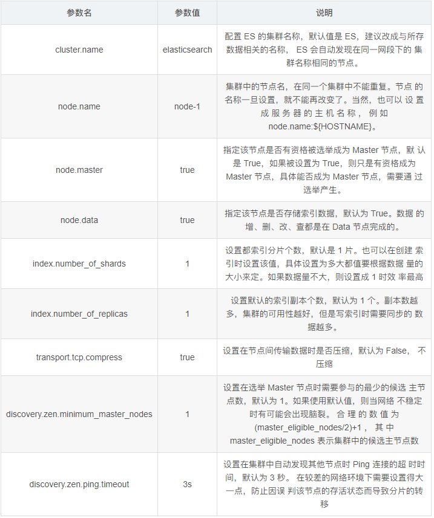

## 56-优化-硬件选择

Elasticsearch 的基础是 Lucene，所有的索引和文档数据是存储在本地的磁盘中，具体的路径可在 ES 的配置文件…/config/elasticsearch.yml中配置，如下：

```yml
#
# Path to directory where to store the data (separate multiple locations by comma):
#
path.data: /path/to/data
#
# Path to log files:
#
path.logs: /path/to/logs
```

磁盘在现代服务器上通常都是瓶颈。Elasticsearch重度使用磁盘，你的磁盘能处理的吞吐量越大，你的节点就越稳定。这里有一些优化磁盘I/O的技巧：

- 使用SSD就像其他地方提过的，他们比机械磁盘优秀多了。
- 使用RAID0。条带化RAID会提高磁盘IO，代价显然就是当一块硬盘故障时整个就故障了。不要使用镜像或者奇偶校验RAID，因为副本已经提供了这个功能。

- 另外，使用多块硬盘，并允许Elasticsearch 通过多个path data目录配置把数据条带化分配到它们上面。

- 不要使用远程挂载的存储，比如NFS或者SMB/CIFS。这个引入的延迟对性能来说完全是背道而驰的。


## 57-优化-分片策略

### 合理设置分片数

分片和副本的设计为 ES 提供了支持分布式和故障转移的特性，但并不意味着分片和副本是可以无限分配的。而且索引的分片完成分配后由于索引的路由机制，我们是不能重新修改分片数的。

可能有人会说，我不知道这个索引将来会变得多大，并且过后我也不能更改索引的大小，所以为了保险起见，还是给它设为 1000 个分片吧。但是需要知道的是，一个分片并不是没有代价的。需要了解：

- 一个分片的底层即为一个 Lucene 索引，会消耗一定文件句柄、内存、以及 CPU运转。
- 每一个搜索请求都需要命中索引中的每一个分片，如果每一个分片都处于不同的节点还好， 但如果多个分片都需要在同一个节点上竞争使用相同的资源就有些糟糕了。
- 用于计算相关度的词项统计信息是基于分片的。如果有许多分片，每一个都只有很少的数据会导致很低的相关度。

一个业务索引具体需要分配多少分片可能需要架构师和技术人员对业务的增长有个预先的判断，横向扩展应当分阶段进行。为下一阶段准备好足够的资源。 只有当你进入到下一个阶段，你才有时间思考需要作出哪些改变来达到这个阶段。一般来说，我们遵循一些原则：

- 控制每个分片占用的硬盘容量不超过 ES 的最大 JVM 的堆空间设置（一般设置不超过 32G，参考下文的 JVM 设置原则），因此，如果索引的总容量在 500G 左右，那分片大小在 16 个左右即可；当然，最好同时考虑原则 2。

- 考虑一下 node 数量，一般一个节点有时候就是一台物理机，如果分片数过多，大大超过了节点数，很可能会导致一个节点上存在多个分片，一旦该节点故障，即使保持了 1 个以上的副本，同样有可能会导致数据丢失，集群无法恢复。所以， 一般都设置分片数不超过节点数的 3 倍。

- 主分片，副本和节点最大数之间数量，我们分配的时候可以参考以下关系：
  `节点数<=主分片数 *（副本数+1）`


### 推迟分片分配

对于节点瞬时中断的问题，默认情况，集群会等待一分钟来查看节点是否会重新加入，如果这个节点在此期间重新加入，重新加入的节点会保持其现有的分片数据，不会触发新的分片分配。这样就可以减少 ES 在自动再平衡可用分片时所带来的极大开销。

通过修改参数 delayed_timeout ，可以延长再均衡的时间，可以全局设置也可以在索引级别进行修改：

```json
#PUT /_all/_settings
{
	"settings": {
		"index.unassigned.node_left.delayed_timeout": "5m"
	}
}
```


## 58-优化-路由选择

当我们查询文档的时候， Elasticsearch 如何知道一个文档应该存放到哪个分片中呢？它其实是通过下面这个公式来计算出来：

```
shard = hash(routing) % number_of_primary_shards
```

routing 默认值是文档的 id，也可以采用自定义值，比如用户 id。


### 不带routing查询

在查询的时候因为不知道要查询的数据具体在哪个分片上，所以整个过程分为2个步骤

- 分发：请求到达协调节点后，协调节点将查询请求分发到每个分片上。
- 聚合：协调节点搜集到每个分片上查询结果，在将查询的结果进行排序，之后给用户返回结果。


### 带routing查询

查询的时候，可以直接根据routing 信息定位到某个分配查询，不需要查询所有的分配，经过协调节点排序。向上面自定义的用户查询，如果routing 设置为userid 的话，就可以直接查询出数据来，效率提升很多。


## 59-优化-写入速度优化

ES 的默认配置，是综合了数据可靠性、写入速度、搜索实时性等因素。实际使用时，我们需要根据公司要求，进行偏向性的优化。

针对于搜索性能要求不高，但是对写入要求较高的场景，我们需要尽可能的选择恰当写优化策略。综合来说，可以考虑以下几个方面来提升写索引的性能：

- 加大Translog Flush，目的是降低Iops、Writeblock。
- 增加Index Refesh间隔，目的是减少Segment Merge的次数。

- 调整Bulk 线程池和队列。
- 优化节点间的任务分布。

- 优化Lucene层的索引建立，目的是降低CPU及IO。


### 优化存储设备

ES 是一种密集使用磁盘的应用，在段合并的时候会频繁操作磁盘，所以对磁盘要求较高，当磁盘速度提升之后，集群的整体性能会大幅度提高。


### 合理使用合并

Lucene 以段的形式存储数据。当有新的数据写入索引时， Lucene 就会自动创建一个新的段。

随着数据量的变化，段的数量会越来越多，消耗的多文件句柄数及 CPU 就越多，查询效率就会下降。

由于 Lucene 段合并的计算量庞大，会消耗大量的 I/O，所以 ES 默认采用较保守的策略，让后台定期进行段合并。


### 减少 Refresh 的次数

Lucene 在新增数据时，采用了延迟写入的策略，默认情况下索引的refresh_interval 为1 秒。

Lucene 将待写入的数据先写到内存中，超过 1 秒（默认）时就会触发一次 Refresh，然后 Refresh 会把内存中的的数据刷新到操作系统的文件缓存系统中。

如果我们对搜索的实效性要求不高，可以将 Refresh 周期延长，例如 30 秒。

这样还可以有效地减少段刷新次数，但这同时意味着需要消耗更多的 Heap 内存。


### 加大 Flush 设置

Flush 的主要目的是把文件缓存系统中的段持久化到硬盘，当 Translog 的数据量达到 512MB 或者 30 分钟时，会触发一次 Flush。

index.translog.flush_threshold_size 参数的默认值是 512MB，我们进行修改。

增加参数值意味着文件缓存系统中可能需要存储更多的数据，所以我们需要为操作系统的文件缓存系统留下足够的空间。


### 减少副本的数量

ES 为了保证集群的可用性，提供了 Replicas（副本）支持，然而每个副本也会执行分析、索引及可能的合并过程，所以 Replicas 的数量会严重影响写索引的效率。

当写索引时，需要把写入的数据都同步到副本节点，副本节点越多，写索引的效率就越慢。


如果我们需要大批量进行写入操作，可以先禁止Replica复制，设置

index.number_of_replicas: 0 关闭副本。在写入完成后， Replica 修改回正常的状态。


## 60-优化-内存设置

ES 默认安装后设置的内存是 1GB，对于任何一个现实业务来说，这个设置都太小了。如果是通过解压安装的 ES，则在 ES 安装文件中包含一个 jvm.option 文件，添加如下命令来设置 ES 的堆大小， Xms 表示堆的初始大小， Xmx 表示可分配的最大内存，都是 1GB。

确保 Xmx 和 Xms 的大小是相同的，其目的是为了能够在 Java 垃圾回收机制清理完堆区后不需要重新分隔计算堆区的大小而浪费资源，可以减轻伸缩堆大小带来的压力。

假设你有一个 64G 内存的机器，按照正常思维思考，你可能会认为把 64G 内存都给ES 比较好，但现实是这样吗， 越大越好？虽然内存对 ES 来说是非常重要的，但是答案是否定的！


因为 ES 堆内存的分配需要满足以下两个原则：

不要超过物理内存的 50%： Lucene 的设计目的是把底层 OS 里的数据缓存到内存中。Lucene 的段是分别存储到单个文件中的，这些文件都是不会变化的，所以很利于缓存，同时操作系统也会把这些段文件缓存起来，以便更快的访问。如果我们设置的堆内存过大， Lucene 可用的内存将会减少，就会严重影响降低 Lucene 的全文本查询性能。

堆内存的大小最好不要超过 32GB：在 Java 中，所有对象都分配在堆上，然后有一个 Klass Pointer 指针指向它的类元数据。这个指针在 64 位的操作系统上为 64 位， 64 位的操作系统可以使用更多的内存（2^64）。在 32 位的系统上为 32 位， 32 位的操作系统的最大寻址空间为 4GB（2^32）。但是 64 位的指针意味着更大的浪费，因为你的指针本身大了。浪费内存不算，更糟糕的是，更大的指针在主内存和缓存器（例如 LLC, L1 等）之间移动数据的时候，会占用更多的带宽。


最终我们都会采用 31 G 设置

- -Xms 31g
- -Xmx 31g

假设你有个机器有 128 GB 的内存，你可以创建两个节点，每个节点内存分配不超过 32 GB。也就是说不超过 64 GB 内存给 ES 的堆内存，剩下的超过 64 GB 的内存给 Lucene。


## 61-优化-重要配置

