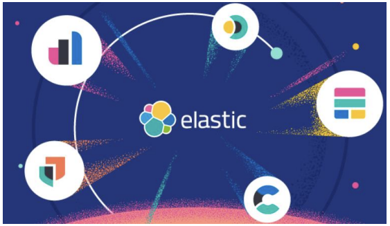

# 第1章 Elasticsearch 8.X 概述

## 1.1 Elasticsearch 8.X 来了

距 2019 年 Elasticsearch 上一大版本 7.0 发布至今已经过去了 3 年。这 3 年中，由于疫情 等众所周知的原因，程序员对很多软件技术的更新和迭代其实并不会抱有太多的期待和幻 想。不过，2022 年 2 月 11 日，Elasticsearch 发布了全新的 8.0 正式版本，这着实给了我们不 小的惊喜！新版本中通过改进 Elasticsearch 的矢量搜索功能、对现代自然语言处理模型的 原生支持、不断简化的数据上线过程，以及精简的安全防护体验，在速度、扩展幅度、相关 性和简便性方面，让搜索引擎技术迎来了一个全新的时代。

## 1.2 Elasticsearch 新特性

从 2019 年 4 月 10 日 Elasticsearch7.0 版本的发布，到 2022 年 2 月 11 日 Elasticsearch8.0 版本的发布的近 3 年间，基于不断优化的开发设计理念，Elasticsearch 发布了一系列的小版 本。这些小版本在以下方面取得了长足的进步并同时引入一些全新的功能：

➢ 减少内存堆使用，完全支持 ARM 架构，引入全新的方式以使用更少的存储空间，从 而让每个节点托管更多的数据

➢ 降低查询开销，在大规模部署中成效尤为明显

➢ 提高日期直方图和搜索聚合的速度，增强了页面缓存的性能，并创建了一个新的 “pre-filter”搜索短语

➢ 在 Elasticsearch 7.3 和 Elasticsearch 7.4 版中，引入了对矢量相似函数的支持

在最新发布的 8.0 版本中，也同样增加和完善了很多新的功能

➢ 增加对自然语言处理 (NLP) 模型的原生支持，让矢量搜索功能更容易实现，让客户和 员工能够使用他们自己的文字和语言来搜索并收到高度相关的结果。

➢ 直接在 Elasticsearch 中执行命名实体识别、情感分析、文本分类等，而无需使用额外 的组件或进行编码。

➢ Elasticsearch 8.0 基于 Lucene 9.0 开发的，那些利用现代 NLP 的搜索体验，都可以借 助（新增的）对近似最近邻搜索的原生支持，快速且大规模地实现。通过 ANN，可以 快速并高效地将基于矢量的查询与基于矢量的文档语料库（无论是小语料库、大语料库 还是巨型语料库）进行比较。

➢ 可以直接在 Elasticsearch 中使用 PyTorch Machine Learning 模型（如 BERT），并在 Elasticsearch 中原生使用这些模型执行推理。

