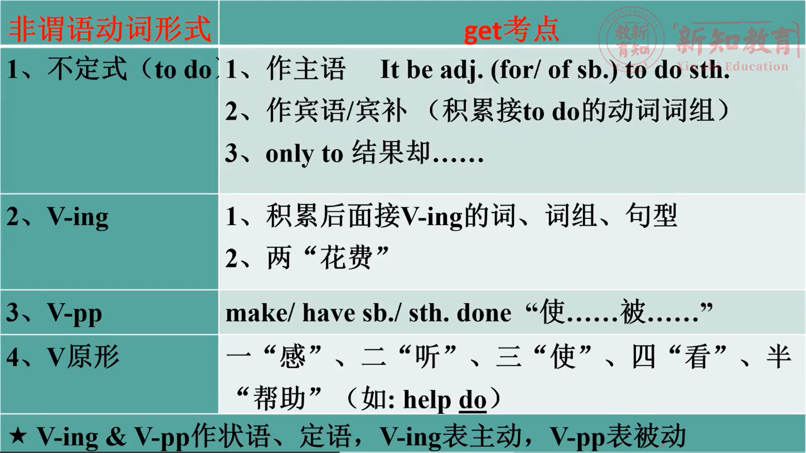

# 第八章：非谓语动词

---

比较句子:

1、My mom asks me **to clean** the kitchen.      妈妈让我去打扫厨房

2、I like **eating** noodles.     我喜欢吃面条。

3、The boy will have his bike **repaired**.       这个小男孩将让人修理他的自行车

4、The manager makes us **carry out** the plan.      经理让我们执行这个计划。

特殊: She sings and dances well. ( 两个谓语动词)

**谓语动词是放在主语后面的，而不在主语后面的谓语就是非谓语动词**

分析句子结构:

He missed the rare Chance for his rudeness yesterday at the meeting.

主     谓          定          宾      状              状        (时间、 地点、原因、且的、条件、假设、让步等都做状语)

他昨天在会议上因为无礼而错失了这个机会。

 

---

### 比较非谓语动词形式todo在句中的成分:

1. **To learn English** well is important for us. ( **主语**)

2. I want **to arrive** there as soon as possible. ( **宾语**)

3. The important thing is **to finish** the work on time. (**表语**)

4. **To catch** the train, we have to get up early. (**状语**)

***非谓语动词除了不能做谓语外，其他的成分都可以担当***

---

## 一、动词不定式 to do

其形式是 “ **to + 动词原形** ”。to是不定式符号，其否定式是在 to 前面加上 not , never 等否定词。

如: ask sb. to do sth. --- a sk sb. not to do sth.

注意: look forward to doing sth. 期盼做某事(to 为介词)

**used to do sth.过去常常做某事(to? )**

**be used to doing sth.习惯做某事(to? )**

### A.做主语:

在不定式短语作主语的句子中，用it作形式所主语，而不把不定式短语放在句子的后面。

To tell a lie is not easy.  =  It's not easy to tell a lie.

To know everything is impossible. =  It's impossible to know everything.

★不定式做主语转换成: ***It is + adj. / n. ( of / for sb. ) to do sth.***

It is difficult for us to communicate with each other.

对我们来说相互交流太困难了

---

### B.作宾语及宾补

I want to arrive there as soon as possible.     (动词 + to do)

I want him to arrive there as soon as possible.     (动词 + sb. + to do)

[真题练习]

15. I expect the girl _______ her promises. (2016真题)

A. carrying   B. carry out   C. carried out    D. to carry out

➢**常见的搭配to do的谓语动词有:**

***expect  期待，used to  过去常常做某事*** ; fail  失败 ，decide 决定，ask  要求，wish / hope   希望，agree  同意，

intend  打算，refuse  拒绝  ,  manage  设法，plan  计划, attempt  试图，encourage  鼓励，

force  迫使，persuade  说服，offer  提供，advise  劝告，allow  允许，pretend  假装(P123 &124单词)

---

### C.作状语(时间/地点/目的/结果/原因/条件..)

He rushed to the house to save the child.

他冲进房子去救这个孩子。

He waved and shouted ***in order to be*** noticed.

为了让别人注意到他，他挥手并喊叫。

He hurried to the post office ***only to*** find it was closed.

他匆忙赶到邮局,结果却发现关门了。

引导目的、结果状语从句的不定式短语:

***➢to do / in order to / so as to为了(表目的)***

***➢only to do 结果却.***

[真题练习]

10. They got to the station, only _______ the train had

already left. (2020真题 )

A. to find  B. finding  C. found   D. find

---

## 二、动名词 V - ing

动名词的否定形式是在前面加上not,never等否定词。

作主语

Watching TV too much is bad for your eyes.

[真题练习]

42. Many people like to watch TV, and ______ TV is one of their most important activities of the day. ( 2015完形填空真题)

A. watching  B. watch   C. seeing   D. see

---

### A.动名词短语作宾语

例: David suggested selling your car to pay the debt.

戴维建议卖掉你的狗和车抵债。

1) V. + V - ing 如: like playing football

所有“喜欢”: ***enjoy / prefer*** / love / like / be fond of + 动ing

***注：prefer to + V.原 宁愿 ； prefer …. + Ving to …. Ving*** 

---

### B.动名词短语作宾语

常用的能接动名词的动词:

***mind 介意，suggest 建议，finish 结束，avoid 避免，keep 保持***，practice 实践，appreciate 感激，consider 考虑，

feel like 想要，admit 承认，escape 逃脱，**imagine 想象**，permit 允许、forgive 原谅、deny 否认、risk 冒险等。

 

2)词组+ V-ing

***look forward to doing期盼做某事    spend time doing sth.花时间做某事***

***succeed in doing sth.成功做某事     be used to doing sth.习惯做某事***

***object to doing sth.反对做某事      be worth doing sth.值得做某事***

insist on doing sth.坚持做某事       can't help doing sth.情不自禁做某事

pay attention to doing sth.注意.....

***Have difficulty / trouble (in) doing sth.做....困难/麻烦***

***It's (no) use + V-ing “做....没用" it为形式主语，***

***It's (no) good + V-ing "做..... (不)好"***

It's (not) worthwhile + V-ing “ (不)值得做....”

It's (no) good throwing the rubbish everywhere. 四处扔垃圾是不好的。

It is no use operating on the sick man. 给这个病人做手术已经没用了

**★两“花费”:**

sb. **spend** (时间/钱) **doing** sth . 某人花(钱/时间)做.....

It **takes** sb. some time to do sth . 某人花了(多久)做.....

例: She spends a month preparing for the exam.

​      It takes me a month to finish the experiment.

3、**stop doing sth**

​     **stop to do sth**

  

**4)所有介词后都 + 动ing (介词: in / on / at / of / to / by / from / with / about / after / before等)**

[真题练习]

40. True courage may also be shown by ________ to do what we know to be wrong, even though some people may laugh at us. (201 6完形填空真题)

A. refuse   B. refused   C. refuses   D. refusing

---

## 三、**非谓语V-pp形式**:

作宾语补足语:表示请别人做某事或安排某人做某事。

**make / have sb. / sth. done “使....。被.....”**

The boy will have his bike **repaired**.

---

## 四、非谓语动词V原形( 省略不定式中的to)

一、“感': feel

二、“听 : hear, listen to

三、“使”:make, let, have   ***make sb. do sth.***

四、“看”: notice, see, observe, watch

半“帮助:help

**help sb. do sth.**

**help sb. to do sth.**

★常见词组 v-ing & to do 的区别

hear sb doing sth. 听到某人正在干.

hear sb.do sth. ①指听到全过程 ②经常听到.

如: I hear Tom shouting on the phone.

​      I often hear the girl sing in her room.

★注意:see / watch / **notice** 等感官动词都有此种用法。

***remember doing sth.记得做过某事(事情已经做了）***

***remember to do sth.记得要做某事(事情未做)***

I remember doing the exercises. 我记得做过练习了。

I must remember to do the exercises tomorrow.   我必须记得明天要做练习。

**forget、regret 用法同remember**

---

## 六、非谓语动词V-ing&V-pp做定语&状语的区别:

(1)有时间上的区别

a. **V-ing表动作正在进行，V-pp表示动作已完成**

the rising sun正在升起的太阳 / the risen sun升起的太

developing countries发展中国家/developed countries发达国家

boiling water正在沸腾的水/boiled water开水

(2) V- ing修饰物& V-pp修饰人:

I like an interesting book. (定语)

I am interested in this book. (表语)

V-ing 修饰“物”  令人......

V-ed 修饰“人“  感到.....

常用的词有: exciting / excited, interesting / interested,surprising / surprised, tiring / tired,relaxing / relaxed等等

a.非谓语动词V-ing&V-pp做状语的区别:

(表时间、原因、伴随等状语)

**➢V-ing作状语表示主动， V-pp作状语表示被动**

★比较:

**I saw** from the top of the hill, and **I found** the city more beautiful.

**Seeing** from the top of the hill, **I** found the city more beautiful.

**Seen** from the top of the hill, **the city** looks more beautiful.

 

b.非谓语V.做后置定语，

V-ing表主动，V_pp表 被动。

例: The boy (**wearing** the school uniform) is my brother.(主动)

The school **built** last year is for disabled children.(被动)

The school **to be built** last year is for disabled children.(被动且发生)

 

**如何区分非谓语动词做定语&状语考点:**

非谓语V.做状语:

1. _____ the film twice, she doesn't want to go to the     cinema.

A. seeing     B. Having seen     C. Seen       D. To see

非谓语V.做定语:

3. This is the problem ________ in our board meeting tomorrow.

A. discussed      B. discussing      C. to discuss      D. to be discussed

➢共同点:选项中V-ing表主动，V-pp表 被动

➢不同点:

(1)做状语，空格在句首;做定语空格在名词后。

(2)做状语,选项可以考虑 **having done**

   做定语，选项可以考虑 **to be done** 

