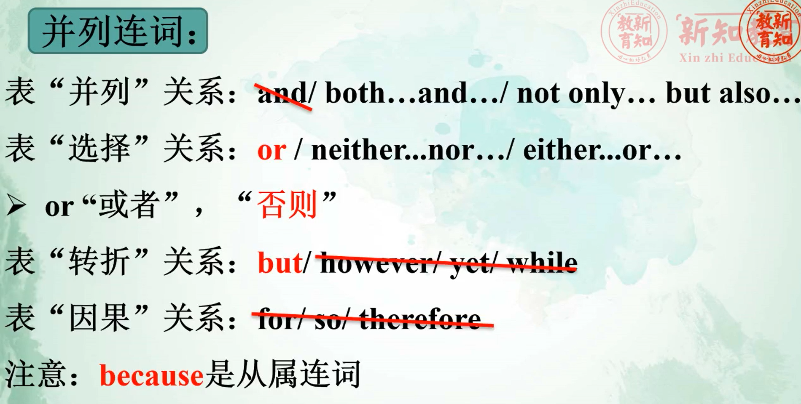

# 第十二章：复合句

## **[考点一]:状语从句: (13题)**

### 1.时间状语从句:

when / as / while 当....时候

after在.....之后  /  before.....之前(完形爱考)

as soon as (主将从现)

hardly (scarcely)... when ...     一……,就....

no sooner.. than…   **(前过完，后过去式)**

**2、条件状语从句:**

连接词有: **if (如果) / unless (除非) / as (so) long as (只要)** / in case( 假如) / only if( only强调if) / on confition (+that)= if

**➢if也遵循“主将从现”原则**

We'll visit my aunt's family if it 

A. isn't going to rain

B. won't rain

C. doesn't rain

D. isn't raining

### 3、结果状从&目的状从:

结果状从: **so... that.../such... that...**   (如此.....以至于),

目的状从: **so that** (为了，以便) ; in order that ; for fear that (以防)

so that 为了

***so...that… 如此.....以至于.....                   such + a / an + adj. +n.        ➢such后就是a/an*****

***such...that… 如此.....以至于.....               so + adj.+ a/an +n.               ➢So后跟了adj.再加a/***

### 4.让步状语从句:

**though / although  "虽然...但是**     **★与but不同用** 

名词或主语 + as 

No matter how = however + 形容词/副词 + 主语 + 谓语 

例: Though he studies hard, he doesn't pass the exam.

虽然他努力学习，但是仍然没通过考试。

练习:

he felt tired,_______ he still went on working.

A. Because, so

B. Although, but

C. /, so

D. Though,/

 

 *(2)  **even if & even though“即使，虽然”   (引导让步状从)***

​        ***as if & as though“好像，似乎”      (引导方式状从)***

 (真题练习]

\46. Since people change as time passes, loving them means

you accept them______ they become those you

disagree with. (2017完形填空真题)

A. if

B. as if

C. even if

D. no matter what

### 5、原因状语从句:

连接词有:**because**/ since/ as/ in that

表因果: **because** ( 从属连词)和**so** (并列连词)不同用

[真题练习]

\4. I didn't buy the book yesterday

my father _____ will give me one.(2015真题)

A. until

B. before :

C. if

D. because

---

## 定语从句

定义:在复合句中作定语修饰句子中某一名词或代词的从句叫定语从句。

Lucy lives in a **beautiful** house.

Lucy lives in a house **which is far from mine**.

 

分析:

This is the book **that/which** I want.（查宾语）

This is the place **that/which** we visited last year.（查宾语）

Shanghai is the city **where** I was born.（不缺主宾）

Please tell me the reason **why** you were late for school.（不缺主宾）

**关系代词: that, which (物), who (whom & whose 谁的)(人)**

**关系副词有: when, where, why**

**➢缺主语/宾语一关系代词:**

**先行词是     人用who & whom & whose,**

​                    **物用that/ which**

**➢不缺主/宾一关系副词:**
**时间--- when		地点--- where		原因--- why**

**★定从关系用that/which时，只用that而不用which的情况:**

(考点:考单选题)

a.先行词有**最高级**或**序数词**修饰时，用 that不用 which:

This is the **best** film that I've ever seen.

这是我曾经看过的最好的电影。

 I still remember the **first** time that we met.

我仍记得我们第一次见面的时候。

b.先行词有**the only , the very , all**, the same, the last, no,

much, little, none等时，常用 **that**,而不用 **which**:

例: All that I can say is thank you very much.

我能说的是非常感谢你。

He is the only man that I want to see.

他是我唯一想见的人。

c.当先行词**既有人又有物**时用**that**,不用**which**:

例: We talked about the **persons** and **things** that we

remembered.我们在讨论我们记得的人和事。

(真题练习]:

21. They talked about things and persons ______ they had

visited in Beijing. (2016真题)

A. who

B. which

C. that

D. what

## 非限制性定语从句: (标配答案)

定语从句:限制性定语从句&非限制性定语从句

比较:

This is the house (which we bought last month).

这是我们上个月买的房子。( 限制性)

The house, (which we bought last month), is very nice.

我们上个月买的房子，很漂亮。(非限制性)

I don't want to do exercise which makes my mother very angry). (非限制性)

➢主句和从句之间用逗号分开

➢非限能将词或整个主句作为先行词对其进行修饰，从句谓语动词要用单三。

非限中:**句首关系词用 as,句中关系词用 which**

➢非限定语从句可以由as, which 引导;

例: As we all know,  Mr. Wang is a good teacher.

众所周知，王老师是一一个好老师。

The sun heats the earth, which is very important to us.

太阳是地球变暖，这对我们来说很重要。

## 宾语从句

定义:在句子中作及物动词或介词的宾语的从句叫做宾语从句。.

例如: I think **that** he is a student.

​		 I' m not sure **whether** it is right or not.

​		 I don't know **why** they will cancel the wedding.

1、**that** 引导的宾从:从句为陈述句(that不做成分，可以省略)

They believe it. They can pass the test.

They believe (that) they can pass the test.他们相信 他们能够通过考试。

2、**Whether / if(是否)**  引导的宾从:从句为二-般疑问句(关系词不能省略)

I wonder it. Can I ask him to give me a hand?

I wonder **whether**/if I can ask him to give me a hand (**or not**).

句末有or not 只能用whether

3、**特殊疑问词**引导的宾从:从句为特殊疑问句(关系词不能省略) **考试重点**

(如what/when/ where/ how/ why等)。

Can you tell me where you are from?你能告诉我你来自哪里吗?

He asked me why  I was late for school yesterday.他问我昨天为什么迟到。

做题重点:宾从中关系词需要翻译意思。

二、宾语从句的语序

宾语从句的语序采用陈述语序(主+谓)。如:

Can you tell me where you are from?你能告诉我你来自哪里吗?

Where are you from ?