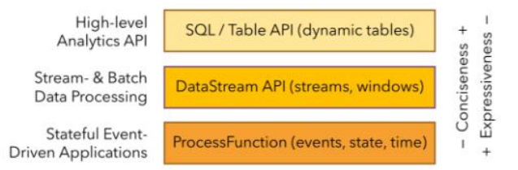
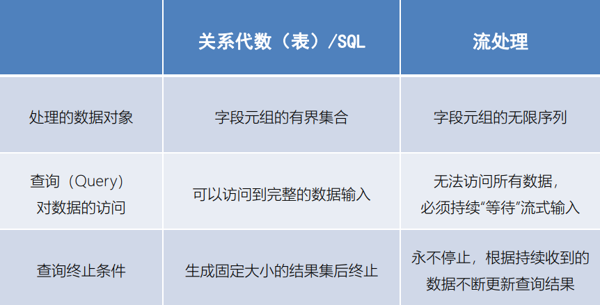
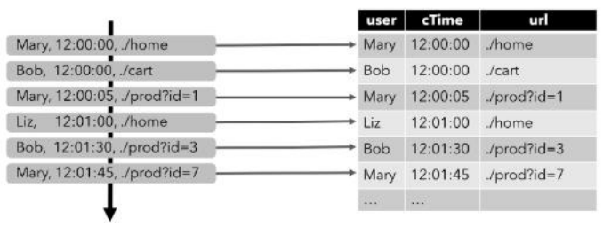
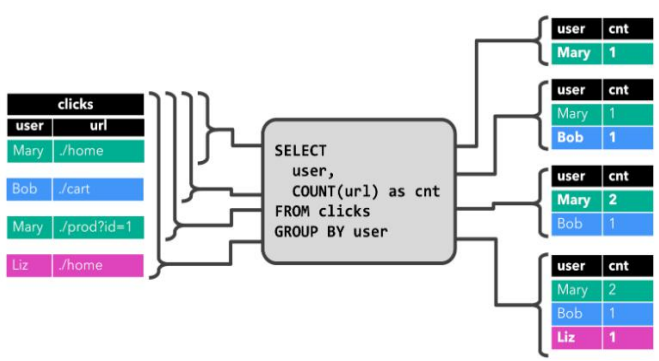
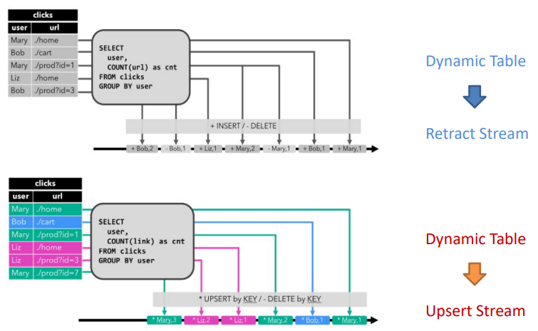
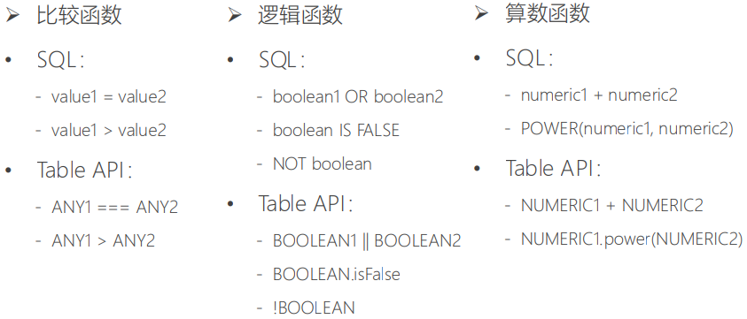
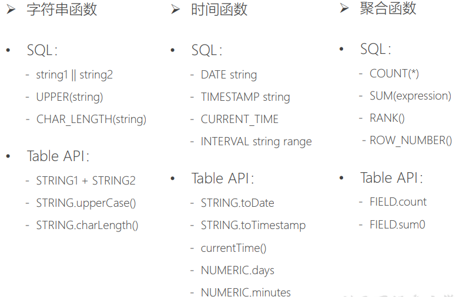
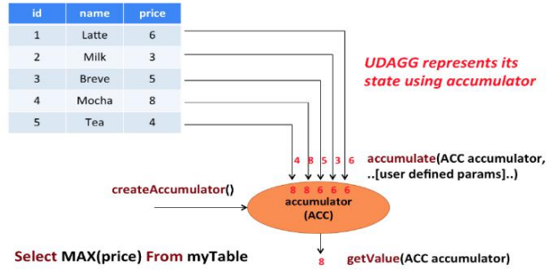
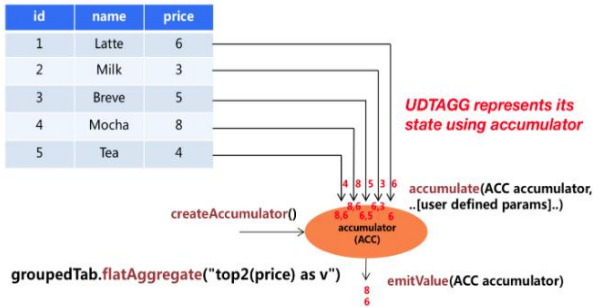

# 11. Table API 与 SQL


# 11.1 Table API 和Flink SQL 是什么


• Flink 对批处理和流处理，提供了统一的上层API 

• Table API 是一套内嵌在 Java 和 Scala 语言中的查询API，它允许以非常直观的方式组合来自一些关系运算符的查询

• Flink 的 SQL 支持基于实现了 SQL 标准的Apache Calcite




----


# 11.2 基本程序结构


• Table API 和 SQL 的程序结构，与流式处理的程序结构十分类似

```scala
val tableEnv = ... // 创建表的执行环境

// 创建一张表，用于读取数据
tableEnv.connect(...).createTemporaryTable("inputTable")

// 注册一张表，用于把计算结果输出
tableEnv.connect(...).createTemporaryTable("outputTable")

// 通过 Table API 查询算子，得到一张结果表
val result = tableEnv.from("inputTable").select(...)

// 通过 SQL查询语句，得到一张结果表
val sqlResult = tableEnv.sqlQuery("SELECT ... FROM inputTable...")// 将结果表写入输出表中
result.insertInto("outputTable")
```


---


## 11.2.1 创建TableEnvironment


• 创建表的执行环境，需要将 flink 流处理的执行环境传入

```scala
val tableEnv = StreamTableEnvironment.create(env)
```

• TableEnvironment 是 flink 中集成 Table API 和SQL 的核心概念，所有对表的操作都基于 TableEnvironment

– 注册 Catalog 

– 在 Catalog 中注册表 

– 执行 SQL 查询 

– 注册用户自定义函数（UDF）


---


## 11.2.2 配置TableEnvironment


```scala
// 基于老版本planner的流处理
    val settings: EnvironmentSettings = EnvironmentSettings.newInstance()
      .useOldPlanner()
      .inStreamingMode()
      .build()
    val oldStreamTableEnv: StreamTableEnvironment = StreamTableEnvironment.create(environment, settings)

//基于老版本的批处理
    val bathEnv: ExecutionEnvironment = ExecutionEnvironment.getExecutionEnvironment
    val oldBathTableEnv: BatchTableEnvironment = BatchTableEnvironment.create(bathEnv)
```


---


## 11.2.3 配置TableEnvironment


```scala
// 基于blink planner的流处理
    val blinkStreamSettings = EnvironmentSettings.newInstance()
      .useBlinkPlanner()
      .inStreamingMode()
      .build()

    val blinkStreamTbaleEnv = StreamTableEnvironment.create(environment, blinkStreamSettings)

// 基于blink planner的批处理
    val blinkBatchSettings = EnvironmentSettings.newInstance()
      .useBlinkPlanner()
      .inStreamingMode()
      .build()

    val blinkBathTableEnv: TableEnvironment = TableEnvironment.create(blinkBatchSettings)
```


---


# 11.3 表（Table）


• TableEnvironment 可以注册目录 Catalog，并可以基于Catalog注册表

• 表（Table）是由一个“标识符”（identifier）来指定的，由3部分组成：Catalog名、数据库（database）名和对象名

• 表可以是常规的，也可以是虚拟的（视图，View）

• 常规表（Table）一般可以用来描述外部数据，比如文件、数据库表或消息队列的数据，也可以直接从 DataStream转换而来

• 视图（View）可以从现有的表中创建，通常是table API 或者SQL查询的一个结果集


---


## 11.3.1 创建表


• TableEnvironment 可以调用 .connect() 方法，连接外部系统，并调用 .createTemporaryTable() 方法，在 Catalog 中注册表

```scala
tableEnv
	.connect(...) // 定义表的数据来源，和外部系统建立连接
	.withFormat(...) // 定义数据格式化方法
	.withSchema(...) // 定义表结构
	.createTemporaryTable("MyTable") // 创建临时表
```


• 可以创建 Table 来描述文件数据，它可以从文件中读取，或者将数据写入文件

```scala
tableEnv.connect(new FileSystem().path("src/main/resources/sensor.txt"))
      .withFormat(new OldCsv())
      .withSchema(new Schema()
        .field("id", DataTypes.STRING())
        .field("timetamp", DataTypes.BIGINT())
        .field("temperature", DataTypes.DOUBLE()))
      .createTemporaryTable("inputTable")
```


• 从Kafka读取数据

```scala
tableEnv.connect(new Kafka()
      .version("universal")
      .topic("sensor")
      .property("zookeeper.connect", "master:2181")
      .property("bootstrap.servers", "master:9092,master:9093,master:9094")
    )
      .withFormat(new OldCsv())
      .withSchema(new Schema()
        .field("id", DataTypes.STRING())
        .field("timetamp", DataTypes.BIGINT())
        .field("temperature", DataTypes.DOUBLE()))
      .createTemporaryTable("kafkainputTable")
```


---


## 11.3.2 表的查询– Table API


• Table API 是集成在 Scala 和 Java 语言内的查询API 

• Table API 基于代表“表”的 Table 类，并提供一整套操作处理的方法API；这些方法会返回一个新的 Table 对象，表示对输入表应用转换操作的结果

• 有些关系型转换操作，可以由多个方法调用组成，构成链式调用结构

```scala
val sensorTable: Table = tableEnv.from("inputTable")
val resultTable: Table = sensorTable
		.select('id, 'temperature)
    .filter('id === "sensor_1")
```


---


## 11.3.3 表的查询– SQL


• Flink 的 SQL 集成，基于实现 了SQL 标准的Apache Calcite

• 在 Flink 中，用常规字符串来定义 SQL 查询语句

• SQL 查询的结果，也是一个新的 Table

```scala
val resultSqlTable: Table = tableEnv.sqlQuery(
      """
        |select id,temperature
        |from inputTable
        |where id = 'sensor_1'
        |""".stripMargin)
```


---


## 11.3.4 将 DataStream转换成表


• 对于一个 DataStream，可以直接转换成Table，进而方便地调用TableAPI做转换操作

```scala
val dataStream: DataStream[SensorReading] = ...
val sensorTable: Table = tableEnv.fromDataStream(dataStream)
```

• 默认转换后的 Table schema 和 DataStream中的字段定义一一对应，也可以单独指定出来

```scala
val dataStream: DataStream[SensorReading] = ...
val sensorTable = tableEnv
	.fromDataStream(dataStream,'id, 'timestamp, 'temperature)
```


---


## 11.3.5 数据类型与Schema 的对应


• DataStream 中的数据类型，与表的 Schema 之间的对应关系，可以有两种：基于字段名称，或者基于字段位置 

• 基于名称（name-based）

```scala
val sensorTable = tableEnv
	.fromDataStream(dataStream,'timestamp as 'ts, 'id as 'myId, 'temperature)
```

• 基于位置（position-based）

```scala
val sensorTable = tableEnv.fromDataStream(dataStream, 'myId,'ts)
```


---


## 11.3.6 创建临时视图（TemporaryView）


• 基于 DataStream 创建临时视图

```scala
tableEnv.createTemporaryView("sensorView", dataStream)
tableEnv.createTemporaryView("sensorView",dataStream, 'id, 'temperature, 
```

• 基于 Table 创建临时视图

```scala
tableEnv.createTemporaryView("sensorView", sensorTable)
```


---


# 11.4 输出表


• 表的输出，是通过将数据写入 TableSink 来实现的

• TableSink 是一个通用接口，可以支持不同的文件格式、存储数据库和消息队列

• 输出表最直接的方法，就是通过 Table.insertInto() 方法将一个Table写入注册过的 TableSink 中

```scala
tableEnv.connect(...)
	.createTemporaryTable("outputTable")

val resultSqlTable: Table = ...

resultTable.insertInto("outputTable")
```


---


## 11.4.1 输出到文件


```scala
tableEnv.connect(new FileSystem().path("src/main/resources/output.txt"))
      .withFormat(new OldCsv())
      .withSchema(new Schema()
        .field("id", DataTypes.STRING())
        .field("temperature", DataTypes.DOUBLE())
        //.field("cnt", DataTypes.BIGINT())
        )
      .createTemporaryTable("outputTable")

resultTable.insertInto("outputTable")
```


---


## 11.4.2 更新模式


• 对于流式查询，需要声明如何在表和外部连接器之间执行转换

• 与外部系统交换的消息类型，由更新模式（Update Mode）指定


Ø 追加（Append）模式 

​	– 表只做插入操作，和外部连接器只交换插入（Insert）消息

Ø 撤回（Retract）模式 

​	– 表和外部连接器交换添加（Add）和撤回（Retract）消息

​	– 插入操作（Insert）编码为 Add 消息；删除（Delete）编码为Retract 消息；更新（Update）编码为上一条的 Retract 和下一条的 Add 消息 

Ø 更新插入（Upsert）模式 

​	– 更新和插入都被编码为 Upsert 消息；删除编码为 Delete 消息

---


## 11.4.2 输出到Kafka


• 可以创建 Table 来描述 kafka 中的数据，作为输入或输出的TableSink

```scala
tableEnv.connect(new Kafka()
          .version("universal")
          .topic("sinktest")
          .property("zookeeper.connect", "master:2181")
          .property("bootstrap.servers", "master:9092,master:9093,master:9094")
        )
          .withFormat(new OldCsv())
          .withSchema(new Schema()
            .field("id", DataTypes.STRING())
            .field("temperature", DataTypes.DOUBLE()))
          .createTemporaryTable("kafkaoutputTable")

resultTable.insertInto("kafkaoutputTable")
```


---


## 11.4.3 输出到ES


```scala
tableEnv.connect(new Elasticsearch()
      .version("6")
      .host("localhost", 9200, "http")
      .index("sensor")
      .documentType("temperature")
    )
      .inUpsertMode()
      .withFormat(new Json())
      .withSchema(new Schema()
        .field("id", DataTypes.STRING())
        .field("count", DataTypes.BIGINT())
      )
      .createTemporaryTable("esOutputTable")

aggTable.insertInto("esOutputTable")
```


---


## 11.4.5 输出到MySql


• 可以创建 Table 来描述 MySql 中的数据，作为输入和输出

```scala
 val sinkMysql: String =
      """
        |create table mysqloutput(
        |id varchar(20), timetmep bigint, temp double
        |)with(
        |'connector.type' = 'jdbc',
        |'connector.url' = 'jdbc:mysql://192.168.100.10/sensorTest',
        |'connector.table' = 'sensor_test',
        |'connector.driver' = 'com.mysql.jdbc.Driver',
        |'connector.username' = 'root',
        |'connector.password' = '123456'
        | )
        |""".stripMargin

tableEnv.sqlUpdate(sinkMysql)
result.insertInto("mysqloutput")
```


---


## 11.4.6 将 Table 转换成DataStream


• 表可以转换为 DataStream 或 DataSet ，这样自定义流处理或批处理程序就可以继续在 Table API 或 SQL 查询的结果上运行了

• 将表转换为 DataStream 或 DataSet 时，需要指定生成的数据类型，即要将表的每一行转换成的数据类型 

• 表作为流式查询的结果，是动态更新的

• 转换有两种转换模式：追加（Appende）模式和撤回（Retract）模式


---


## 11.4.7 查看执行计划


• Table API 提供了一种机制来解释计算表的逻辑和优化查询计划

• 查看执行计划，可以通过 TableEnvironment.explain(table) 方法或TableEnvironment.explain() 方法完成，返回一个字符串，描述三个计划

Ø 优化的逻辑查询计划 

Ø 优化后的逻辑查询计划 

Ø 实际执行计划。

```scala
val explaination: String = tableEnv.explain(resultTable)println(explaination)
```


---


# 11.5 流处理和关系代数的区别





---


## 11.5.1 动态表（Dynamic Tables）


• 动态表是 Flink 对流数据的 Table API 和SQL 支持的核心概念

• 与表示批处理数据的静态表不同，动态表是随时间变化的

​	Ø 持续查询（Continuous Query） 

• 动态表可以像静态的批处理表一样进行查询，查询一个动态表会产生持续查询（Continuous Query） 

• 连续查询永远不会终止，并会生成另一个动态表

• 查询会不断更新其动态结果表，以反映其动态输入表上的更改


---


## 11.5.2 动态表和持续查询


Ø 流式表查询的处理过程： 

1. 流被转换为动态表 

2. 对动态表计算连续查询，生成新的动态表

3. 生成的动态表被转换回流


----


## 11.5.3 将流转换成动态表


• 为了处理带有关系查询的流，必须先将其转换为表

• 从概念上讲，流的每个数据记录，都被解释为对结果表的插入（Insert）修改操作




## 11.5.4 持续查询


• 持续查询会在动态表上做计算处理，并作为结果生成新的动态表




---


## 11.5.5 将动态表转换成DataStream


• 与常规的数据库表一样，动态表可以通过插入（Insert）、更新（Update）和删除（Delete）更改，进行持续的修改 

• 将动态表转换为流或将其写入外部系统时，需要对这些更改进行编码


Ø 仅追加（Append-only）流 

​	– 仅通过插入（Insert）更改来修改的动态表，可以直接转换为仅追加流

Ø 撤回（Retract）流 

​	– 撤回流是包含两类消息的流：添加（Add）消息和撤回（Retract）消息

Ø Upsert（更新插入）流 

​	– Upsert 流也包含两种类型的消息：Upsert 消息和删除（Delete）消息




---


# 11.6 时间特性（Time Attributes）


• 基于时间的操作（比如 Table API 和 SQL 中窗口操作），需要定义相关的时间语义和时间数据来源的信息 

• Table 可以提供一个逻辑上的时间字段，用于在表处理程序中，指示时间和访问相应的时间戳 

• 时间属性，可以是每个表schema的一部分。一旦定义了时间属性，它就可以作为一个字段引用，并且可以在基于时间的操作中使用

• 时间属性的行为类似于常规时间戳，可以访问，并且进行计算


---


## 11.6.1 定义处理时间（ProcessingTime）


• 处理时间语义下，允许表处理程序根据机器的本地时间生成结果。它是时间的最简单概念。它既不需要提取时间戳，也不需要生成watermark


Ø 由 DataStream 转换成表时指定 

• 在定义Schema期间，可以使用.proctime，指定字段名定义处理时间字段

• 这个proctime属性只能通过附加逻辑字段，来扩展物理schema。因此，只能在schema定义的末尾定义它

```scala
val sensorTable: Table = tableEnvironment
	.fromDataStream(dataStream, 'id, 'temperature, 'timestamp, 'pt.proctime)
```


Ø 定义 Table Schema 时指定

```scala
.withSchema(new Schema()
	.field("id", DataTypes.STRING())
	.field("timestamp", DataTypes.BIGINT())
	.field("temperature", DataTypes.DOUBLE())
	.field("pt", DataTypes.TIMESTAMP(3))
	.proctime()
)
```


Ø 在创建表的 DDL 中定义

```scala
val sinkDDL: String =
	"""
		|create table dataTable (
		| id varchar(20) not null,
		| ts bigint,
		| temperature double,
		| pt AS PROCTIME()
		|) with (
		| 'connector.type' = 'filesystem',
		| 'connector.path' = '/sensor.txt',
		| 'format.type' = 'csv'
		|)
	""".stripMargin

tableEnv.sqlUpdate(sinkDDL)
```


---


## 11.6.2 定义事件时间（Event Time）


• 事件时间语义，允许表处理程序根据每个记录中包含的时间生成结果。这样即使在有乱序事件或者延迟事件时，也可以获得正确的结果。

• 为了处理无序事件，并区分流中的准时和迟到事件；Flink 需要从事件数据中，提取时间戳，并用来推进事件时间的进展

• 定义事件时间，同样有三种方法： 

​	Ø 由 DataStream 转换成表时指定 

​	Ø 定义 Table Schema 时指定 

​	Ø 在创建表的 DDL 中定义


Ø 由 DataStream 转换成表时指定 

• 在 DataStream 转换成 Table，使用 .rowtime 可以定义事件时间属性

```scala
// 将 DataStream转换为 Table，并指定时间字段
val sensorTable = tableEnv.fromDataStream(dataStream,'id, 'timestamp.rowtime, 'temperature)

// 或者，直接追加时间字段
val sensorTable = tableEnv.fromDataStream(dataStream,'id, 'temperature, 'timestamp, 'rt.rowtime)
```


• 定义 Table Schema 时指定

```scala
.withSchema(new Schema()
	.field("id", DataTypes.STRING())
	.field("timestamp", DataTypes.BIGINT())
	.rowtime(
		new Rowtime()
		.timestampsFromField("timestamp") 
    // 从字段中提取时间戳.watermarksPeriodicBounded(1000) // watermark延迟1秒)
		.field("temperature", DataTypes.DOUBLE())
	)
```


• 在创建表的 DDL 中定义

```scala
val sinkDDL: String =
	"""
		|create table dataTable (
		| id varchar(20) not null,
		| ts bigint,
		| temperature double,
		| rt AS TO_TIMESTAMP( FROM_UNIXTIME(ts) ),
		| watermark for rt as rt - interval '1' second
		|) with (
		| 'connector.type' = 'filesystem',
		| 'connector.path' = '/sensor.txt',
		| 'format.type' = 'csv'
		|)
	""".stripMargin

tableEnv.sqlUpdate(sinkDDL)
```


---


# 11.7 窗口


• 时间语义，要配合窗口操作才能发挥作用

• 在 Table API 和 SQL 中，主要有两种窗口

​	Ø Group Windows（分组窗口） 

​		– 根据时间或行计数间隔，将行聚合到有限的组（Group）中，并对每个组的数据执行一次聚合函数 

​	Ø Over Windows 

​		– 针对每个输入行，计算相邻行范围内的聚合


---


## 11.7.1 Group Windows


• Group Windows 是使用 window（w:GroupWindow）子句定义的，并且必须由as子句指定一个别名。

• 为了按窗口对表进行分组，窗口的别名必须在group by 子句中，像常规的分组字段一样引用

```scala
val table = input
	.window([w: GroupWindow] as 'w) // 定义窗口，别名为w
	.groupBy('w, 'a) // 按照字段 a和窗口w分组
	.select('a, 'b.sum) // 聚合
```

• Table API 提供了一组具有特定语义的预定义Window类，这些类会被转换为底层 DataStream 或 DataSet 的窗口操作


---


### 11.7.1.1 滚动窗口（Tumblingwindows）


• 滚动窗口要用 Tumble 类来定义

```scala
// Tumbling Event-time Window
.window(Tumble over 10.minutes on 'rowtime as 'w)

// Tumbling Processing-time Window
.window(Tumble over 10.minutes on 'proctime as 'w)

// Tumbling Row-count Window
.window(Tumble over 10.rows on 'proctime as 'w)
```


---


### 11.7.1.2 滑动窗口（Slidingwindows）


 • 滑动窗口要用 Slide 类来定义

```scala
// Sliding Event-time Window
.window(Slide over 10.minutes every 5.minutes on 'rowtime as'w)

// Sliding Processing-time window
.window(Slide over 10.minutes every 5.minutes on 'proctime as'w)

// Sliding Row-count window
.window(Slide over 10.rows every 5.rows on 'proctime as 'w)
```


---


### 11.7.1.3 会话窗口（Sessionwindows）


• 会话窗口要用 Session 类来定义

```scala
// Session Event-time Window
.window(Session withGap 10.minutes on 'rowtime as 'w)

// Session Processing-time Window
.window(Session withGap 10.minutes on 'proctime as 'w)
```


---


## 11.7.2 Over Windows


• Over window 聚合是标准 SQL 中已有的（over 子句），可以在查询的SELECT 子句中定义

• Over window 聚合，会针对每个输入行，计算相邻行范围内的聚合

• Over windows 使用 window（w:overwindows*）子句定义，并在select（）方法中通过别名来引用

```scala
val table = input
	.window([w: OverWindow] as 'w)
	.select('a, 'b.sum over 'w, 'c.min over 'w)
```

• Table API 提供了 Over 类，来配置 Over 窗口的属性


---


### 11.7.2.1 无界Over Windows


• 可以在事件时间或处理时间，以及指定为时间间隔、或行计数的范围内，定义 Over windows 

• 无界的 over window 是使用常量指定的

```scala
// 无界的事件时间 over window
.window(Over partitionBy 'a orderBy 'rowtime preceding UNBOUNDED_RANGEas'w)

//无界的处理时间 over window
.window(Over partitionBy 'a orderBy 'proctime preceding UNBOUNDED_RANGEas'w)

// 无界的事件时间 Row-count over window
.window(Over partitionBy 'a orderBy 'rowtime preceding UNBOUNDED_ROWas'w)

//无界的处理时间 Row-count over window
.window(Over partitionBy 'a orderBy 'proctime preceding UNBOUNDED_ROWas'w)
```


---


### 11.7.2.2 有界Over Windows


• 有界的 over window 是用间隔的大小指定的

```scala
// 有界的事件时间 over window
.window(Over partitionBy 'a orderBy 'rowtime preceding 1.minutesas'w)

// 有界的处理时间 over window
.window(Over partitionBy 'a orderBy 'proctime preceding 1.minutesas'w)

// 有界的事件时间 Row-count over window
.window(Over partitionBy 'a orderBy 'rowtime preceding 10.rowsas'w)

// 有界的处理时间 Row-count over window
.window(Over partitionBy 'a orderBy 'proctime preceding 10.rowsas'w)
```


---


## 11.7.4 SQL 中的Group Windows


• Group Windows 定义在 SQL 查询的 Group By 子句中

​	Ø TUMBLE(time_attr, interval) 

• 定义一个滚动窗口，第一个参数是时间字段，第二个参数是窗口长度

​	Ø HOP(time_attr, interval, interval) 

• 定义一个滑动窗口，第一个参数是时间字段，第二个参数是窗口滑动步长，第三个是窗口长度 

​	Ø SESSION(time_attr, interval) • 定义一个会话窗口，第一个参数是时间字段，第二个参数是窗口间隔


---


## 11.7.5 SQL 中的Over Windows


• 用 Over 做窗口聚合时，所有聚合必须在同一窗口上定义，也就是说必须是相同的分区、排序和范围 

• 目前仅支持在当前行范围之前的窗口 

• ORDER BY 必须在单一的时间属性上指定

```sql
SELECT COUNT(amount) OVER ( 
	PARTITION BY user 
	ORDER BY proctime 
	ROWS BETWEEN 2 PRECEDING AND CURRENT ROW)
FROM Orders
```


---


# 11.8 函数（Functions）


• Flink Table API 和 SQL 为用户提供了一组用于数据转换的内置函数

• SQL 中支持的很多函数，Table API 和 SQL 都已经做了实现






---


## 11.8.1 用户自定义函数（UDF）


• 用户定义函数（User-defined Functions，UDF）是一个重要的特性，它们显著地扩展了查询的表达能力

• 在大多数情况下，用户定义的函数必须先注册，然后才能在查询中使用

• 函数通过调用 registerFunction（）方法在TableEnvironment 中注册。当用户定义的函数被注册时，它被插入到 TableEnvironment 的函数目录中，这样Table API 或 SQL 解析器就可以识别并正确地解释它


---


## 11.8.2 标量函数（Scalar Functions）


• 用户定义的标量函数，可以将0、1或多个标量值，映射到新的标量值

• 为了定义标量函数，必须在 org.apache.flink.table.functions 中扩展基类Scalar Function，并实现（一个或多个）求值（eval）方法

• 标量函数的行为由求值方法决定，求值方法必须公开声明并命名为eval

```scala
package cn.SHF.udftest

import cn.SHF.apitest.SensorReading
import org.apache.flink.streaming.api._
import org.apache.flink.streaming.api.functions.timestamps.BoundedOutOfOrdernessTimestampExtractor
import org.apache.flink.streaming.api.scala._
import org.apache.flink.streaming.api.windowing.time.Time
import org.apache.flink.table.api._
import org.apache.flink.table.api.scala._
import org.apache.flink.table.functions.ScalarFunction
import org.apache.flink.types.Row

object ScalaFunctionTest {
  def main(args: Array[String]): Unit = {
    val environment: StreamExecutionEnvironment = StreamExecutionEnvironment.getExecutionEnvironment
    environment.setParallelism(1)

    //    environment.setStreamTimeCharacteristic(TimeCharacteristic.ProcessingTime)
    environment.setStreamTimeCharacteristic(TimeCharacteristic.EventTime)

    //1.10版本不配置默认是oldPlanner，1.11则为blinkPlanner
    val settings: EnvironmentSettings = EnvironmentSettings.newInstance()
      .useBlinkPlanner()
      .inStreamingMode()
      .build()
    val tableEnvironment: StreamTableEnvironment = StreamTableEnvironment.create(environment,settings)

    val inputPath = "src/main/resources/sensor.txt"
    val inputStream: DataStream[String] = environment.readTextFile(inputPath)

    val dataStream: DataStream[SensorReading] = inputStream.map(data => {
      val strings: Array[String] = data.split(",")
      SensorReading(strings(0),strings(1).toLong,strings(2).toDouble)
    })
      .assignTimestampsAndWatermarks(new BoundedOutOfOrdernessTimestampExtractor[SensorReading](Time.seconds(1)) {
        override def extractTimestamp(t: SensorReading): Long = t.timestamp * 1000L
      })

    //val sensorTable: Table = tableEnvironment.fromDataStream(dataStream, 'id, 'temperature, 'timestamp, 'pt.proctime)
    val sensorTable: Table = tableEnvironment.fromDataStream(dataStream, 'id, 'temperature, 'timestamp.rowtime as'ts )

    //条用自定义hash函数，对id进行hash晕眩
    //1，table api
    //首先new一个UDF的实例
    val code = new HashCode(23)
    val resultTable: Table = sensorTable
      .select('id, 'ts, code('id))

    //2.sql
    //需要在环境中注册UDF
    tableEnvironment.createTemporaryView("sensor",sensorTable)
    tableEnvironment.registerFunction("hashCode",code)
    val resultSqlTable: Table = tableEnvironment.sqlQuery(
      """
        |select
        |id,ts,hashCode(id)
        |from sensor
        |""".stripMargin)

    resultTable.toAppendStream[Row].print("result")
    resultSqlTable.toAppendStream[Row].print("sqlresult")

    environment.execute()

  }

}

//自定义标量函数
class HashCode(factor: Int) extends ScalarFunction {
  def eval(input: String): Int = {
    input.hashCode * factor - 1000
  }
}
```


---


## 11.8.3 表函数（Table Functions）


• 用户定义的表函数，也可以将0、1或多个标量值作为输入参数；与标量函数不同的是，它可以返回任意数量的行作为输出，而不是单个值

• 为了定义一个表函数，必须扩展 org.apache.flink.table.functions 中的基类TableFunction 并实现（一个或多个）求值方法

• 表函数的行为由其求值方法决定，求值方法必须是public 的，并命名为eval

```scala
package cn.SHF.udftest

import cn.SHF.apitest.SensorReading
import org.apache.flink.streaming.api._
import org.apache.flink.streaming.api.functions.timestamps.BoundedOutOfOrdernessTimestampExtractor
import org.apache.flink.streaming.api.scala._
import org.apache.flink.streaming.api.windowing.time.Time
import org.apache.flink.table.api._
import org.apache.flink.table.api.scala._
import org.apache.flink.table.functions.TableFunction
import org.apache.flink.types.Row

object TableFunctionTest {
  def main(args: Array[String]): Unit = {
    val environment: StreamExecutionEnvironment = StreamExecutionEnvironment.getExecutionEnvironment
    environment.setParallelism(1)

    //    environment.setStreamTimeCharacteristic(TimeCharacteristic.ProcessingTime)
    environment.setStreamTimeCharacteristic(TimeCharacteristic.EventTime)

    //1.10版本不配置默认是oldPlanner，1.11则为blinkPlanner
    val settings: EnvironmentSettings = EnvironmentSettings.newInstance()
      .useBlinkPlanner()
      .inStreamingMode()
      .build()
    val tableEnvironment: StreamTableEnvironment = StreamTableEnvironment.create(environment,settings)

    val inputPath = "src/main/resources/sensor.txt"
    val inputStream: DataStream[String] = environment.readTextFile(inputPath)

    val dataStream: DataStream[SensorReading] = inputStream.map(data => {
      val strings: Array[String] = data.split(",")
      SensorReading(strings(0),strings(1).toLong,strings(2).toDouble)
    })
      .assignTimestampsAndWatermarks(new BoundedOutOfOrdernessTimestampExtractor[SensorReading](Time.seconds(1)) {
        override def extractTimestamp(t: SensorReading): Long = t.timestamp * 1000L
      })

    //val sensorTable: Table = tableEnvironment.fromDataStream(dataStream, 'id, 'temperature, 'timestamp, 'pt.proctime)
    val sensorTable: Table = tableEnvironment.fromDataStream(dataStream, 'id, 'temperature, 'timestamp.rowtime as'ts )

    //table api
    val split = new Split("_")
    val resultTable: Table = sensorTable
      .joinLateral(split('id) as('word, 'length))
      .select('id, 'word,'length)

    //sql
    tableEnvironment.createTemporaryView("sensor",sensorTable)
    tableEnvironment.registerFunction("split",split)
    val SqlresultTable: Table = tableEnvironment.sqlQuery(
      """
        |select
        |id,ts,word,length
        |from
        |sensor,lateral table(split(id)) as splitid(word,length)
        |""".stripMargin)

    resultTable.toAppendStream[Row].print("result")
    SqlresultTable.toAppendStream[Row].print("sqlresult")

    environment.execute()

  }

}

//自定义TableFunction
class Split(separator:String)extends TableFunction[(String,Int)]{
  def eval(str:String):Unit={
    str.split(separator).foreach(
      word => collect((word,word.length))
    )
  }
}
```


---


## 11.8.4 聚合函数（AggregateFunctions）


• 用户自定义聚合函数（User-Defined Aggregate Functions，UDAGGs）可以把一个表中的数据，聚合成一个标量值

• 用户定义的聚合函数，是通过继承 AggregateFunction 抽象类实现的




• AggregationFunction要求必须实现的方法：

​	– createAccumulator() 

​	– accumulate() 

​	– getValue() 


• AggregateFunction 的工作原理如下：

​	– 首先，它需要一个累加器（Accumulator），用来保存聚合中间结果的数据结构；可以通过调用 createAccumulator() 方法创建空累加器

​	– 随后，对每个输入行调用函数的 accumulate() 方法来更新累加器

​	– 处理完所有行后，将调用函数的 getValue() 方法来计算并返回最终结果

```scala
package cn.SHF.udftest

import cn.SHF.apitest.SensorReading
import org.apache.flink.streaming.api._
import org.apache.flink.streaming.api.functions.timestamps.BoundedOutOfOrdernessTimestampExtractor
import org.apache.flink.streaming.api.scala._
import org.apache.flink.streaming.api.windowing.time.Time
import org.apache.flink.table.api._
import org.apache.flink.table.api.scala._
import org.apache.flink.table.functions.AggregateFunction
import org.apache.flink.types.Row

object AggregateFunctionTest {
  def main(args: Array[String]): Unit = {
    val environment: StreamExecutionEnvironment = StreamExecutionEnvironment.getExecutionEnvironment
    environment.setParallelism(1)

    //    environment.setStreamTimeCharacteristic(TimeCharacteristic.ProcessingTime)
    environment.setStreamTimeCharacteristic(TimeCharacteristic.EventTime)

    //1.10版本不配置默认是oldPlanner，1.11则为blinkPlanner
    val settings: EnvironmentSettings = EnvironmentSettings.newInstance()
      .useBlinkPlanner()
      .inStreamingMode()
      .build()
    val tableEnvironment: StreamTableEnvironment = StreamTableEnvironment.create(environment, settings)

    val inputPath = "src/main/resources/sensor.txt"
    val inputStream: DataStream[String] = environment.readTextFile(inputPath)

    val dataStream: DataStream[SensorReading] = inputStream.map(data => {
      val strings: Array[String] = data.split(",")
      SensorReading(strings(0), strings(1).toLong, strings(2).toDouble)
    })
      .assignTimestampsAndWatermarks(new BoundedOutOfOrdernessTimestampExtractor[SensorReading](Time.seconds(1)) {
        override def extractTimestamp(t: SensorReading): Long = t.timestamp * 1000L
      })

    //val sensorTable: Table = tableEnvironment.fromDataStream(dataStream, 'id, 'temperature, 'timestamp, 'pt.proctime)
    val sensorTable: Table = tableEnvironment.fromDataStream(dataStream, 'id, 'temperature, 'timestamp.rowtime as 'ts)

    //table api
    val avgTemp = new AvgTemp
    val resultTable: Table = sensorTable
      .groupBy('id)
      .aggregate(avgTemp('temperature) as 'avgTemp)
      .select('id, 'avgTemp)

    //sql
    tableEnvironment.createTemporaryView("sensor",sensorTable)
    tableEnvironment.registerFunction("avgTemp",avgTemp)
    val SqlresultTable: Table = tableEnvironment.sqlQuery(
      """
        |select
        |id,avgTemp(temperature)
        |from sensor
        |group by id
        |""".stripMargin)

    resultTable.toRetractStream[Row].print("result")
    SqlresultTable.toRetractStream[Row].print("Sqlresult")

    environment.execute()

  }

}

//定义一个类，专门用于表示聚合的状态
class AvgTempAcc {
  var sum: Double = 0.0
  var count: Int = 0
}

//自定义一个聚合函数,求每个传感器的平均温度值
class AvgTemp extends AggregateFunction[Double, AvgTempAcc] {
  override def getValue(acc: AvgTempAcc): Double = acc.sum / acc.count

  override def createAccumulator(): (AvgTempAcc) = new AvgTempAcc

  //还要实现一个具体的处理计算函数，accumulate
  def accumulate(acc: AvgTempAcc, temp: Double): Unit = {
    acc.sum += temp
    acc.count += 1
  }
}

```


---


## 11.8.5 表聚合函数（Table AggregateFunctions）


• 用户定义的表聚合函数（User-Defined Table Aggregate Functions，UDTAGGs），可以把一个表中数据，聚合为具有多行和多列的结果表

• 用户定义表聚合函数，是通过继承 TableAggregateFunction抽象类来实现的




• AggregationFunction 要求必须实现的方法：

​	– createAccumulator() 

​	– accumulate() 

​	– emitValue() 


• TableAggregateFunction 的工作原理如下: 

​	– 首先，它同样需要一个累加器（Accumulator），它是保存聚合中间结果的数据结构。通过调用 createAccumulator() 方法可以创建空累加器。

​	– 随后，对每个输入行调用函数的 accumulate() 方法来更新累加器。

​	– 处理完所有行后，将调用函数的 emitValue() 方法来计算并返回最终结果。

```scala
package cn.SHF.udftest

import cn.SHF.apitest.SensorReading
import org.apache.flink.streaming.api.TimeCharacteristic
import org.apache.flink.streaming.api.functions.timestamps.BoundedOutOfOrdernessTimestampExtractor
import org.apache.flink.streaming.api.scala._
import org.apache.flink.streaming.api.windowing.time.Time
import org.apache.flink.table.api._
import org.apache.flink.table.api.scala._
import org.apache.flink.table.functions.TableAggregateFunction
import org.apache.flink.types.Row
import org.apache.flink.util.Collector

object TableAggregateFunctionTest {
  def main(args: Array[String]): Unit = {
    val environment: StreamExecutionEnvironment = StreamExecutionEnvironment.getExecutionEnvironment
    environment.setParallelism(1)

    //    environment.setStreamTimeCharacteristic(TimeCharacteristic.ProcessingTime)
    environment.setStreamTimeCharacteristic(TimeCharacteristic.EventTime)

    //1.10版本不配置默认是oldPlanner，1.11则为blinkPlanner
    val settings: EnvironmentSettings = EnvironmentSettings.newInstance()
      .useBlinkPlanner()
      .inStreamingMode()
      .build()
    val tableEnvironment: StreamTableEnvironment = StreamTableEnvironment.create(environment, settings)

    val inputPath = "src/main/resources/sensor.txt"
    val inputStream: DataStream[String] = environment.readTextFile(inputPath)

    val dataStream: DataStream[SensorReading] = inputStream.map(data => {
      val strings: Array[String] = data.split(",")
      SensorReading(strings(0), strings(1).toLong, strings(2).toDouble)
    })
      .assignTimestampsAndWatermarks(new BoundedOutOfOrdernessTimestampExtractor[SensorReading](Time.seconds(1)) {
        override def extractTimestamp(t: SensorReading): Long = t.timestamp * 1000L
      })

    //val sensorTable: Table = tableEnvironment.fromDataStream(dataStream, 'id, 'temperature, 'timestamp, 'pt.proctime)
    val sensorTable: Table = tableEnvironment.fromDataStream(dataStream, 'id, 'temperature, 'timestamp.rowtime as 'ts)

    //table api
    val top2Temp = new Top2Temp
    val result: Table = sensorTable
      .groupBy('id)
      .flatAggregate(top2Temp('temperature) as('temp, 'rank))
      .select('id, 'temp, 'rank)

    result.toRetractStream[Row].print()

    environment.execute()


  }

}

//定义一个类，用来表示聚合函数的状态
class Top2TempAcc {
  var highestTemp: Double = Double.MinValue
  var secondHighestTemp: Double = Double.MinValue
}

//自定义表聚合函数，提取所有温度值中最高的两个温度，输出（temp，rank）
class Top2Temp extends TableAggregateFunction[(Double, Int), Top2TempAcc] {
  override def createAccumulator(): Top2TempAcc = new Top2TempAcc

  def accumulate(acc: Top2TempAcc, temp: Double): Unit = {
    //判断当前温度值，是否比状态中的值大
    if (temp > acc.highestTemp) {
      acc.secondHighestTemp = acc.highestTemp
      acc.highestTemp = temp
    } else if (temp > acc.secondHighestTemp) {
      acc.secondHighestTemp = temp
    }
  }

  //实现一个输出结果的方法，最终处理完表中所有数据时调用
  def emitValue(acc: Top2TempAcc, out: Collector[(Double, Int)]): Unit = {
    out.collect((acc.highestTemp, 1))
    out.collect((acc.secondHighestTemp, 2))
  }
}
```

