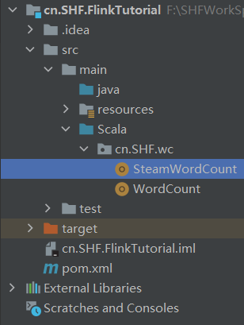

# 2.1 搭建 maven 工程 FlinkTutorial


pom 文件

```properties
<?xml version="1.0" encoding="UTF-8"?>
<project xmlns="http://maven.apache.org/POM/4.0.0" xmlns:xsi="http://www.w3.org/2001/XMLSchema-instance" xsi:schemaLocation="http://maven.apache.org/POM/4.0.0
http://maven.apache.org/xsd/maven-4.0.0.xsd">
<modelVersion>4.0.0</modelVersion>
<groupId>com.atguigu.flink</groupId>
<artifactId>FlinkTutorial</artifactId>
<version>1.0-SNAPSHOT</version>
<dependencies>
<dependency>
<groupId>org.apache.flink</groupId>
<artifactId>flink-scala_2.12</artifactId>
<version>1.10.1</version>
</dependency>
<!-- https://mvnrepository.com/artifact/org.apache.flink/flink-streaming-scala -->
<dependency>
<groupId>org.apache.flink</groupId>
<artifactId>flink-streaming-scala_2.12</artifactId>
<version>1.10.1</version>
</dependency>
</dependencies>
```

---

## 2.1.2 添加 scala 框架 和 scala 文件夹




---


# 2.2 批处理 wordcount


```scala
package cn.SHF.wc

import org.apache.flink.api.scala.ExecutionEnvironment
import org.apache.flink.api.scala._

object WordCount {
  def main(args: Array[String]): Unit = {
    //TODO:创建一个批处理的执行环境
    val environment = ExecutionEnvironment.getExecutionEnvironment

    //TODO:从文件中读取数据
    val inputPath = "F:\\SHFWorkSpace\\cn.SHF.FlinkTutorial\\src\\main\\resources\\hello.txt"
    val inputDaraSst = environment.readTextFile(inputPath)

    //TODO:对数据进行转换处理统计，先分词，再按照word进行分组，最后进行聚合统计
    val result = inputDaraSst.flatMap(_.split(" "))
      .map((_, 1))
      .groupBy(0) //以第一个元素作为Key，进行分组
      .sum(1) //对所有数据的第二个元素求和

    //TODO:打印输出
    result.print()
  }

}
```

**注意：Flink 程序支持 java 和 scala 两种语言，本课程中以 scala 语言为主。在 引入包中，有 java 和 scala 两种包时注意要使用 scala 的包。**


---


# 2.3 流处理 wordcount


```scala
package cn.SHF.wc

import org.apache.flink.api.java.utils.ParameterTool
import org.apache.flink.streaming.api.scala._

object SteamWordCount {
  def main(args: Array[String]): Unit = {

    //TODO:从外部命令中提取参数，作为socket主机名和端口号
//    val params: ParameterTool = ParameterTool.fromArgs(args)
//    val host: String = params.get("host")
//    val port: Int = params.getInt("port")

    //TODO:创建流处理的执行环境
    val environment = StreamExecutionEnvironment.getExecutionEnvironment
    //线程设置数
    //environment.setParallelism(8)

    //TODO:接收有一个socket文本流
    val inputStream = environment.socketTextStream("localhost", 9999)
    //TODO:进行转换处理统计
    val resultData = inputStream
      .flatMap(x => x.split(" "))
      .filter(_.nonEmpty)
      .map((_, 1))
      .keyBy(0)
      .sum(1)

    resultData.print()
      //设置并行度
      .setParallelism(1)

    //TODO:启动任务执行
    environment.execute("stream word count")
  }

}
```

测试——在 windows 系统中用 netcat 命令进行发送测试。

```bash
nc -l -p 778
```

