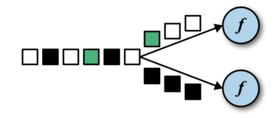
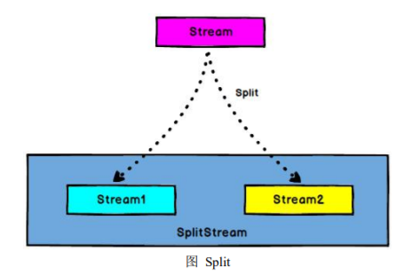

# 5.  Flink 流处理 API


# 5.1 Environment


## 5.1.1 getExecutionEnvironment

创建一个执行环境，表示当前执行程序的上下文。 如果程序是独立调用的，则 此方法返回本地执行环境；如果从命令行客户端调用程序以提交到集群，则此方法 返回此集群的执行环境，也就是说，getExecutionEnvironment 会根据查询运行的方 式决定返回什么样的运行环境，是最常用的一种创建执行环境的方式。

```scala
//批处理
val env: ExecutionEnvironment = ExecutionEnvironment.getExecutionEnvironment
```

```scala
//流处理
val env = StreamExecutionEnvironment.getExecutionEnvironment
```

如果没有设置并行度，会以 flink-conf.yaml 中的配置为准，默认是 1。


---


## 5.1.2 createLocalEnvironment


返回本地执行环境，需要在调用时指定默认的并行度。

```scala
val env = StreamExecutionEnvironment.createLocalEnvironment(1)
```


---


## 5.1.3 createRemoteEnvironment


返回集群执行环境，将 Jar 提交到远程服务器。需要在调用时指定 JobManager 的 IP 和端口号，并指定要在集群中运行的 Jar 包。

```scala
val env = ExecutionEnvironment.createRemoteEnvironment("jobmanage-hostname", 6123,"YOURPATH//wordcount.jar")
```


---


# 5.2 Source


## 5.2.1 从集合读取数据


```scala
/定义样例类，温度传感器
case class SensorReading(id: String,timestamp:Long,temperature:Double)


object SourceTest {
  def main(args: Array[String]): Unit = {
    //TODO:创建执行环境
    val environment = StreamExecutionEnvironment.getExecutionEnvironment

    //TODO:1.从集合中读取数据
    val datalist = List(
      SensorReading("sensor_1", 1547718199, 35.8),
        SensorReading("sensor_6", 1547718201, 15.4),
        SensorReading("sensor_7", 1547718202, 6.7),
        SensorReading("sensor_10", 1547718205, 38.1)
    )

    //读取集合中的数据
    val stream1 = environment.fromCollection(datalist)
    //environment.fromElements(1.0,35,"hello") 此方法没有传参限制
    //stream1.print()
```


---


## 5.2.2 从文件读取数据


```scala
//TODO: 2.从文件中读取数据
val inputPath = "src/main/resources/sensor.txt"
val Stream2 = environment.readTextFile(inputPath)

//Stream2.print()
```


---


## 5.2.3 以 kafka 消息队列的数据作为来源


```scala
//TODO: 3.从Kafka中读取数据
    val properties = new Properties()
    properties.setProperty("bootstrap.servers","192.168.0.205:9092,192.168.0.206:9092,192.168.0.207:9092")
    properties.setProperty("group.id","consumer-group")
    val stream3 = environment.addSource(new FlinkKafkaConsumer011[String]("sensor",new SimpleStringSchema(),properties))
    stream3.print()

    //执行
    environment.execute("source test")
```


---


## 5.2.4 自定义 Source


除了以上的 source 数据来源，我们还可以自定义 source。需要做的，只是传入 一个 SourceFunction 就可以。具体调用如下：

```scala
//TODO：4.自定义source
    val stream4 = environment.addSource(new MySencorSource())
```

我们希望可以随机生成传感器数据，MySensorSource 具体的代码实现如下：

```scala
//自定义SourceFunction
class MySencorSource() extends SourceFunction[SensorReading] {

  //定义一个标识位flag，用来表示数据源是否正常运行发送数据
  var runnning: Boolean = true

  override def run(sourceContext: SourceFunction.SourceContext[SensorReading]): Unit = {
    //顶一个随机数发生器
    val rand = new Random()

    //随机生成一组（10个）传感器的初始温度：（id，temp）
    var curTemp = 1.to(10).map(x => ("sensor_" + x, rand.nextDouble() * 100))

    //定义无限循环，不停的产生数据，除非被cancel
    while (runnning) {
      //在上次数据基础上微调更新温度值
      curTemp.map(x => (x._1, x._2 + rand.nextGaussian())) //nextGaussian() 高斯随机数，离均值越近，概率越高，反之则相反。
      //获取当前时间戳，加入到数据中,调用sourceContext.collect()发出数据
      val curtime: Long = System.currentTimeMillis()
      curTemp.foreach(data => sourceContext.collect(SensorReading(data._1, curtime, data._2)))
      Thread.sleep(1000)
    }
  }

  override def cancel(): Unit = false
}
```


---


# 5.3 Transform


转换算子

前三个为简单转换，中间三个为键控流（聚合）转换，后三个为多流转换（分为 分流 和 和流）


## 5.3.1 map


```scala
val streamMap = stream.map { x => x * 2 }
```


---


## 5.3.2 flatMap


flatMap 的函数签名：def flatMap[A,B](as: List[A])(f: A ⇒ List[B]): List[B] 

例如: flatMap(List(1,2,3))(i ⇒ List(i,i)) 

结果是 List(1,1,2,2,3,3), 

而 List("a b", "c d").flatMap(line ⇒ line.split(" ")) 

结果是 List(a, b, c, d)。


---


## 5.3.3 Filter


```scala
val streamFilter = stream.filter{
x => x == 1
}
```


---


## 5.3.4 KeyBy





DataStream → KeyedStream：逻辑地将一个流拆分成不相交的分区，每个分区包含具有相同 key 的元素，在内部以 hash 的形式实现的。


---


## 5.3.5 滚动聚合算子（Rolling Aggregation）


这些算子可以针对 KeyedStream 的每一个支流做聚合。

是对之前的数据做滚动更新聚合。

| sum()   |
| ------- |
| min()   |
| max()   |
| minBy() |
| maxBy() |


---


## 5.3.7 Split 和 Select


### Split




DataStream → SplitStream：根据某些特征把一个 DataStream 拆分成两个或者多个 DataStream。


### Select


SplitStream→DataStream：从一个 SplitStream 中获取一个或者多个 DataStream。


需求：传感器数据按照温度高低（以 30 度为界），拆分成两个流。

```scala
//TODO: 4.多流转换操作
    //4.1 分流，将传感器温度数据分成低温，高温两条流
    val splitStream = dataStream
      .split(data => {
        if (data.temperature > 30.0) Seq("high") else Seq("low")
      })
    val highTempStream = splitStream.select("high")
    val lowTempStream = splitStream.select("low")
    val allTempStream = splitStream.select("high", "low")

    highTempStream.print("high")
    lowTempStream.print("low")
    allTempStream.print("all")
```


---


## 5.3.8 Connect 和 CoMap


DataStream,DataStream → ConnectedStreams：连接两个保持他们类型的数据流，两个数据流被 Connect 之后，只是被放在了一个同一个流中，内部依然保持 各自的数据和形式不发生任何变化，两个流相互独立。

CoMap,CoFlatMap


ConnectedStreams → DataStream：作用于 ConnectedStreams 上，功能与 map 和 flatMap 一样，对 ConnectedStreams 中的每一个 Stream 分别进行 map 和 flatMap 处理。

```scala
//TODO: 4.2 合流，connect
    val warningStream = highTempStream.map(data => (data.id, data.temperature))
    val connectedStream = warningStream.connect(lowTempStream)

    //用coMap对数据进行分别处理
    val coMapResultStream = connectedStream.map(
      warningdata => (warningdata._1, warningdata._2, "warning"),
      lowTempData => (lowTempData.id, "healthy")
    )

    coMapResultStream.print("coMap")
```


---


## 5.3.9 Union


DataStream → DataStream：对两个或者两个以上的 DataStream 进行 union 操 作，产生一个包含所有 DataStream 元素的新 DataStream。

```scala
//TODO: 4.3 union合流
    val unionStream = highTempStream.union(lowTempStream)

    environment.execute("transfrom test")
```


Connect 与 Union 区别：

1． Union 之前两个流的类型必须是一样，Connect 可以不一样，在之后的 coMap 中再去调整成为一样的。 

2. Connect 只能操作两个流，Union 可以操作多个。


---


# 5.4 支持的数据类型


Flink 流应用程序处理的是以数据对象表示的事件流。所以在 Flink 内部，我们 需要能够处理这些对象。它们需要被序列化和反序列化，以便通过网络传送它们； 或者从状态后端、检查点和保存点读取它们。为了有效地做到这一点，Flink 需要明 确知道应用程序所处理的数据类型。Flink 使用类型信息的概念来表示数据类型，并 为每个数据类型生成特定的序列化器、反序列化器和比较器。

Flink 还具有一个类型提取系统，该系统分析函数的输入和返回类型，以自动获 取类型信息，从而获得序列化器和反序列化器。但是，在某些情况下，例如 lambda 函数或泛型类型，需要显式地提供类型信息，才能使应用程序正常工作或提高其性能。

Flink 支持 Java 和 Scala 中所有常见数据类型。使用最广泛的类型有以下几种。


---

## 5.4.1 基础数据类型


Flink 支持所有的 Java 和 Scala 基础数据类型，Int, Double, Long, String, …

```scala
val numbers: DataStream[Long] = env.fromElements(1L, 2L, 3L, 4L)
numbers.map( n => n + 1 )
```


---


## 5.4.2 Java 和 Scala 元组（Tuples）


```scala
val persons: DataStream[(String, Integer)] = env.fromElements(
("Adam", 17),
("Sarah", 23) )
persons.filter(p => p._2 > 18)
```


---


## 5.4.3 Scala 样例类（case classes）


```scala
case class Person(name: String, age: Int)
val persons: DataStream[Person] = env.fromElements(
Person("Adam", 17),
Person("Sarah", 23) )
persons.filter(p => p.age > 18)
```


---


## 5.4.4 Java 简单对象（POJOs）


```java
public class Person {
public String name;
public int age;
public Person() {}
public Person(String name, int age) {
this.name = name;
this.age = age;
}
}
DataStream<Person> persons = env.fromElements(
new Person("Alex", 42),
new Person("Wendy", 23));
```


---


## 5.4.5 其它（Arrays, Lists, Maps, Enums, 等等）


Flink 对 Java 和 Scala 中的一些特殊目的的类型也都是支持的，比如 Java 的 ArrayList，HashMap，Enum 等等。


---


# 5.5 实现 UDF 函数——更细粒度的控制流


## 5.5.1 函数类（Function Classes）


Flink 暴露了所有 udf 函数的接口(实现方式为接口或者抽象类)。例如 MapFunction, FilterFunction, ProcessFunction 等等。

下面例子实现了 FilterFunction 接口：

```scala
class FilterFilter extends FilterFunction[String] {
	override def filter(value: String): Boolean = {
		value.contains("flink")
	}
}
val flinkTweets = tweets.filter(new FlinkFilter)
```

还可以将函数实现成匿名类

```scala
val flinkTweets = tweets.filter(
	new RichFilterFunction[String] {
		override def filter(value: String): Boolean = {
			value.contains("flink")
		}
	}
)
```

我们 filter 的字符串"flink"还可以当作参数传进去。

```scala
val tweets: DataStream[String] = ...

val flinkTweets = tweets.filter(new KeywordFilter("flink"))

class KeywordFilter(keyWord: String) extends FilterFunction[String] {
	override def filter(value: String): Boolean = {
		value.contains(keyWord)
	}
}
```


---


## 5.5.2 匿名函数（Lambda Functions）


```scala
val tweets: DataStream[String] = ...
val flinkTweets = tweets.filter(_.contains("flink"))
```


---


## 5.5.3 富函数（Rich Functions）


“富函数”是 DataStream API 提供的一个函数类的接口，所有 Flink 函数类都 有其 Rich 版本。它与常规函数的不同在于，可以获取运行环境的上下文，并拥有一 些生命周期方法，所以可以实现更复杂的功能。

 RichMapFunction 

 RichFlatMapFunction 

 RichFilterFunction


Rich Function 有一个生命周期的概念。典型的生命周期方法有：

 open()方法是 rich function 的初始化方法，当一个算子例如 map 或者 filter 被调用之前 open()会被调用。 

 close()方法是生命周期中的最后一个调用的方法，做一些清理工作。 

 getRuntimeContext()方法提供了函数的 RuntimeContext 的一些信息，例如函 数执行的并行度，任务的名字，以及 state 状态


---


# 5.6 Sink


Flink 没有类似于 spark 中 foreach 方法，让用户进行迭代的操作。虽有对外的 输出操作都要利用 Sink 完成。最后通过类似如下方式完成整个任务最终输出操作。

```scala
stream.addSink(new MySink(xxxx))
```

官方提供了一部分的框架的 sink。除此以外，需要用户自定义实现 sink。


## 5.6.1 Kafka


pom.xml

```properties
<!--
https://mvnrepository.com/artifact/org.apache.flink/flink-connector-kafka-0.11
-->
<dependency>
<groupId>org.apache.flink</groupId>
<artifactId>flink-connector-kafka-0.11_2.12</artifactId>
<version>1.10.1</version>
</dependency>
```

主函数中添加 sink：

```scala
//将数据输出到kafka
    dataStream.addSink(new FlinkKafkaProducer011[String]("192.168.0.205:9092,192.168.0.206:9092,192.168.0.207:9092",
     "sinktest",new SimpleStringSchema()))
```


---


## 5.6.2 Redis


```scala
package cn.SHF.sinktest

import org.apache.flink.streaming.api.scala._
import org.apache.flink.streaming.connectors.redis.RedisSink
import org.apache.flink.streaming.connectors.redis.common.config.FlinkJedisPoolConfig
import org.apache.flink.streaming.connectors.redis.common.mapper._

object RedisSinkTest {
  def main(args: Array[String]): Unit = {
    val environment: StreamExecutionEnvironment = StreamExecutionEnvironment.getExecutionEnvironment

    environment.setParallelism(1)

    val inpath = "src/main/resources/sensor.txt"
    val instream = environment.readTextFile(inpath)

    val dataStream: DataStream[(String, Long, Double)] = instream.map(
      data => {
        val strings: Array[String] = data.split(",")
        (strings(0), strings(1).toLong, strings(2).toDouble)
      }
    )

    //定义一个FlinkJedisPoolConfig，redis的连接池
    val conf: FlinkJedisPoolConfig = new FlinkJedisPoolConfig.Builder()
      .setHost("192.168.100.10")
      .setPort(6379)
      .build()

    dataStream.addSink(new RedisSink[(String, Long, Double)](conf,new MyRedisMapper))

    environment.execute()

  }
}

//定义一个RedisMapper
class MyRedisMapper extends RedisMapper[(String, Long, Double)]{
  //定义保存数据写入redis的命令，HSET key field valus
  override def getCommandDescription: RedisCommandDescription = {
    new RedisCommandDescription(RedisCommand.HSET,"sensor_temp")
  }

  //将id指定为key
  override def getKeyFromData(data: (String, Long, Double)): String = {
    data._1
  }

  //将温度值指定为value
  override def getValueFromData(data: (String, Long, Double)): String = {
    data._3.toString
  }
}
```


---


## 5.6.3 Elasticsearch


```scala
package cn.SHF.sinktest

import cn.SHF.apitest.SensorReading

import java.util
import org.apache.flink.api.common.functions.RuntimeContext
import org.apache.flink.streaming.api.scala._
import org.apache.flink.streaming.connectors.elasticsearch._
import org.apache.flink.streaming.connectors.elasticsearch6.ElasticsearchSink
import org.apache.http.HttpHost
import org.elasticsearch.client.Requests


/**
  * Copyright (c) 2018-2028 尚硅谷 All Rights Reserved 
  *
  * Project: FlinkTutorial
  * Package: com.atguigu.apitest.sinttest
  * Version: 1.0
  *
  * Created by wushengran on 2020/8/7 10:49
  */
object EsSinkTest {
  def main(args: Array[String]): Unit = {
    val env = StreamExecutionEnvironment.getExecutionEnvironment
    env.setParallelism(1)
    // 读取数据
    val inputPath = "D:\\Projects\\BigData\\FlinkTutorial\\src\\main\\resources\\sensor.txt"
    val inputStream = env.readTextFile(inputPath)

    // 先转换成样例类类型（简单转换操作）
    val dataStream = inputStream
      .map(data => {
        val arr = data.split(",")
        SensorReading(arr(0), arr(1).toLong, arr(2).toDouble)
      })

    // 定义HttpHosts
    val httpHosts = new util.ArrayList[HttpHost]()
    httpHosts.add(new HttpHost("localhost", 9200))

    // 自定义写入es的EsSinkFunction
    val myEsSinkFunc = new ElasticsearchSinkFunction[SensorReading] {
      override def process(t: SensorReading, runtimeContext: RuntimeContext, requestIndexer: RequestIndexer): Unit = {
        // 包装一个Map作为data source
        val dataSource = new util.HashMap[String, String]()
        dataSource.put("id", t.id)
        dataSource.put("temperature", t.temperature.toString)
        dataSource.put("ts", t.timestamp.toString)

        // 创建index request，用于发送http请求
        val indexRequest = Requests.indexRequest()
          .index("sensor")
          .`type`("readingdata")
          .source(dataSource)

        // 用indexer发送请求
        requestIndexer.add(indexRequest)

      }
    }

    dataStream.addSink(new ElasticsearchSink
      .Builder[SensorReading](httpHosts, myEsSinkFunc)
      .build()
    )

    env.execute("es sink test")
  }
}
```


---


## 5.6.4 JDBC 自定义 sink


```scala
package cn.SHF.sinktest

import org.apache.flink.configuration.Configuration
import org.apache.flink.streaming.api.functions.sink.RichSinkFunction
import org.apache.flink.streaming.api.scala._

import java.sql.{Connection, DriverManager, PreparedStatement}

object JdbcSinkTest {
  def main(args: Array[String]): Unit = {
    val environment: StreamExecutionEnvironment = StreamExecutionEnvironment.getExecutionEnvironment

    environment.setParallelism(1)

    val inpath = "src/main/resources/sensor.txt"
    val instream = environment.readTextFile(inpath)

    val dataStream: DataStream[(String, Long, Double)] = instream.map(
      data => {
        val strings: Array[String] = data.split(",")
        (strings(0), strings(1).toLong, strings(2).toDouble)
      }
    )

    dataStream.addSink(new MyJdbcSinkFunc)

    environment.execute()
  }
}

class MyJdbcSinkFunc extends RichSinkFunction[(String, Long, Double)] {
  //定义连接、预编译语句
  var conn: Connection = _
  var insertStmt: PreparedStatement = _
  var updateStmt: PreparedStatement = _

  override def open(parameters: Configuration): Unit = {
    conn = DriverManager.getConnection("jdbc:mysql://192.168.100.10/test", "root", "123456")
    insertStmt = conn.prepareStatement("insert into sensor_temp (id,temp) values (?, ?)")
    updateStmt = conn.prepareStatement("update sensor_temp set temp = ? where id = ?")
  }

  override def invoke(value: (String, Long, Double)): Unit = {
    //先执行更新操作，查到就更新
    updateStmt.setDouble(1, value._3)
    updateStmt.setString(2, value._1)
    updateStmt.execute()
    //如果更新没有查到数据，就插入
    if (updateStmt.getUpdateCount == 0) {
      insertStmt.setString(1, value._1)
      insertStmt.setDouble(2, value._3)
      insertStmt.execute()
    }
  }

  override def close(): Unit = {
    insertStmt.close()
    updateStmt.close()
    conn.close()
  }
}
```

