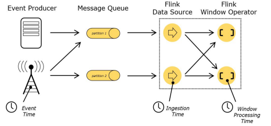
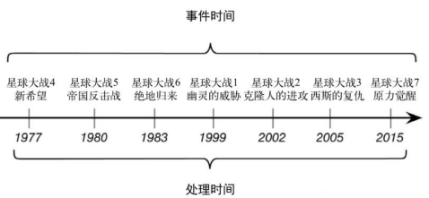
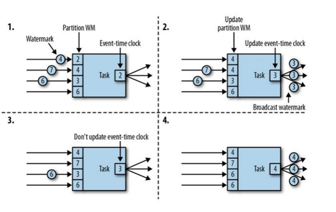

# 7.1 Flink 中的时间语义


在 Flink 的流式处理中，会涉及到时间的不同概念，如下图所示：



**Event Time**：是事件创建的时间。它通常由事件中的时间戳描述，例如采集的日志数据中，每一条日志都会记录自己的生成时间，Flink 通过时间戳分配器访问事件时间戳。

**Ingestion Time**：是数据进入 Flink 的时间。

**Processing Time**：是每一个执行基于时间操作的算子的本地系统时间，与机器相关，默认的时间属性就是 Processing Time。

一个例子——电影《星球大战》：



• 不同的时间语义有不同的应用场合 

• 我们往往更关心事件时间（Event Time）


例如，一条日志进入 Flink 的时间为 2017-11-12 10:00:00.123，到达Window的系统时间为 2017-11-12 10:00:01.234，日志的内容如下：

```properties
2017-11-02 18:37:15.624 INFO Fail over to rm2
```

对于业务来说，要统计 1min 内的故障日志个数，哪个时间是最有意义的？——eventTime，因为我们要根据日志的生成时间进行统计。


---


# 7.2 EventTime 的引入


**在 Flink 的流式处理中，绝大部分的业务都会使用 eventTime**，一般只在eventTime 无法使用时，才会被迫使用 ProcessingTime 或者 IngestionTime。

如果要使用 EventTime，那么需要引入 EventTime 的时间属性，引入方式如下所示：

```scala
val env = StreamExecutionEnvironment.getExecutionEnvironment
// 从调用时刻开始给 env 创建的每一个 stream 追加时间特征
env.setStreamTimeCharacteristic(TimeCharacteristic.EventTime)
```


---


# 7.3 Watermar


## 7.3.1 基本概念


我们知道，流处理从事件产生，到流经 source，再到 operator，中间是有一个过程和时间的，虽然大部分情况下，流到 operator 的数据都是按照事件产生的时间顺序来的，但是也不排除由于网络、分布式等原因，导致乱序的产生，所谓乱序，就是指 Flink 接收到的事件的先后顺序不是严格按照事件的 Event Time 顺序排列的。


那么此时出现一个问题，一旦出现乱序，如果只根据 eventTime 决定window的运行，我们不能明确数据是否全部到位，但又不能无限期的等下去，此时必须要有个机制来保证一个特定的时间后，必须触发 window 去进行计算了，这个特别的机制，就是 Watermark。

 Watermark 是一种衡量 Event Time 进展的机制。

 **Watermark 是用于处理乱序事件的**，而正确的处理乱序事件，通常用Watermark 机制结合 window 来实现。

 数据流中的 Watermark 用于表示 timestamp 小于 Watermark 的数据，都已经到达了，因此，window 的执行也是由 Watermark 触发的。

 Watermark 可以理解成一个延迟触发机制，我们可以设置Watermark 的延时时长 t，每次系统会校验已经到达的数据中最大的 maxEventTime，然后认定eventTime 小于 maxEventTime - t 的所有数据都已经到达，如果有窗口的停止时间等于maxEventTime – t，那么这个窗口被触发执行。


有序流的 Watermarker 如下图所示：（Watermark 设置为 0）


乱序流的 Watermarker 如下图所示：（Watermark 设置为 2）


当 Flink 接收到数据时，会按照一定的规则去生成 Watermark，这条Watermark就等于当前所有到达数据中的 maxEventTime - 延迟时长，也就是说，Watermark 是基于数据携带的时间戳生成的，一旦 Watermark 比当前未触发的窗口的停止时间要晚，那么就会触发相应窗口的执行。由于 event time 是由数据携带的，因此，如果运行过程中无法获取新的数据，那么没有被触发的窗口将永远都不被触发。

上图中，我们设置的允许最大延迟到达时间为 2s，所以时间戳为7s 的事件对应的 Watermark 是 5s，时间戳为 12s 的事件的 Watermark 是 10s，如果我们的窗口1 是 1s~5s，窗口 2 是 6s~10s，那么时间戳为 7s 的事件到达时的Watermarker 恰好触发窗口 1，时间戳为 12s 的事件到达时的 Watermark 恰好触发窗口2。

Watermark 就是触发前一窗口的“关窗时间”，一旦触发关门那么以当前时刻为准在窗口范围内的所有所有数据都会收入窗中。

只要没有达到水位那么不管现实中的时间推进了多久都不会触发关窗


**watermark 的传递**




---


## 7.3.2 Watermark 的引入


• Event Time 的使用一定要指定数据源中的时间戳

• 调用 assignTimestampAndWatermarks 方法，传入一个BoundedOutOfOrdernessTimestampExtractor，就可以指定watermark

```scala
dataStream. assignTimestampsAndWatermarks(
	new BoundedoutOfOrdernessTimestampExtractor[SensorReading](Time . milliseconds(1000)) {
		override def extractT ime stamp( element: SensorReading): Long = {element. timestamp * 1000
		}
	}
)
```

• 对于排好序的数据，不需要延迟触发，可以只指定时间戳就行了

```scala
//注意单位是毫秒，所以根据时间戳的不同，可能需要乘1000
.assignAscendingTimestamps(_._2*1000L)
```

Event Time 的使用一定要**指定数据源中的时间戳**。否则程序无法知道事件的事件时间是什么(数据源里的数据没有时间戳的话，就只能使用 Processing Time 了)。

我们看到上面的例子中创建了一个看起来有点复杂的类，这个类实现的其实就是分配时间戳的接口。Flink 暴露了 TimestampAssigner 接口供我们实现，使我们可以自定义如何从事件数据中抽取时间戳

```scala
val env = StreamExecutionEnvironment.getExecutionEnvironment

// 从调用时刻开始给 env 创建的每一个 stream 追加时间特性
env.setStreamTimeCharacteristic(TimeCharacteristic.EventTime)

val readings: DataStream[SensorReading] = env
	.addSource(new SensorSource)
	.assignTimestampsAndWatermarks(new MyAssigner())
```

MyAssigner 有两种类型 

 AssignerWithPeriodicWatermarks 

 AssignerWithPunctuatedWatermarks 

以上两个接口都继承自 TimestampAssigner。


#### Assigner with periodic watermarks


周期性的生成 watermark：系统会周期性的将 watermark 插入到流中(水位线也是一种特殊的事件!)。默认周期是 200 毫秒。可以使用 ExecutionConfig.setAutoWatermarkInterval()方法进行设置。

```scala
val env = StreamExecutionEnvironment.getExecutionEnvironment

env.setStreamTimeCharacteristic(TimeCharacteristic.EventTime)

// 每隔 5 秒产生一个 watermark
env.getConfig.setAutoWatermarkInterval(5000)
//时间语义默认的时候是为0，event的时候是200，此处可自定义
```

产生 watermark 的逻辑：每隔 5 秒钟，Flink 会调用 AssignerWithPeriodicWatermarks 的 getCurrentWatermark()方法。如果方法返回一个时间戳大于之前水位的时间戳，新的 watermark 会被插入到流中。这个检查保证了水位线是单调递增的。如果方法返回的时间戳小于等于之前水位的时间戳，则不会产生新的 watermark。

例子，自定义一个周期性的时间戳抽取：

```
class PeriodicAssigner extends AssignerWithPeriodicWatermarks[SensorReading] {

	val bound: Long = 60 * 1000 // 延时为 1 分钟
	var maxTs: Long = Long.MinValue // 观察到的最大时间戳
	
	override def getCurrentWatermark: Watermark = {
		new Watermark(maxTs - bound)
	}
	
	override def extractTimestamp(r: SensorReading, previousTS: Long) ={
		maxTs = maxTs.max(r.timestamp)
		r.timestamp
	}
}
```

一种简单的特殊情况是，如果我们事先得知数据流的时间戳是单调递增的，也就是说没有乱序，那我们可以使用 assignAscendingTimestamps，这个方法会直接使用数据的时间戳生成 watermark。

```scala
val stream: DataStream[SensorReading] = ...
val withTimestampsAndWatermarks = stream
	.assignAscendingTimestamps(e => e.timestamp)

>> result: E(1), W(1), E(2), W(2), ...
```

而对于乱序数据流，如果我们能大致估算出数据流中的事件的最大延迟时间，就可以使用如下代码：

```scala
val stream: DataStream[SensorReading] = ...
val withTimestampsAndWatermarks = stream.assignTimestampsAndWatermarks(
  new SensorTimeAssigner
)

class SensorTimeAssigner extends BoundedOutOfOrdernessTimestampExtractor[SensorReading](Time.seconds(5)) {
  // 抽取时间戳
	override def extractTimestamp(r: SensorReading): Long = r.timestamp
}

>> relust: E(10), W(0), E(8), E(7), E(11), W(1), ...
```


#### Assigner with punctuated watermarks


间断式地生成 watermark。和周期性生成的方式不同，这种方式不是固定时间的，而是可以根据需要对每条数据进行筛选和处理。直接上代码来举个例子，我们只给sensor_1 的传感器的数据流插入 watermark：

```scala
class PunctuatedAssigner extends AssignerWithPunctuatedWatermarks[SensorReading] {

	val bound: Long = 60 * 1000
	
	override def checkAndGetNextWatermark(r: SensorReading, extractedTS:Long): Watermark = {
	if (r.id == "sensor_1") {
		new Watermark(extractedTS - bound)
		} else {
				null
		}
	}
	
	override def extractTimestamp(r: SensorReading, previousTS: Long): Long= {
		r.timestamp
	}
}
```


---


# 7.4 EvnetTime 在 window 中的使用


## 7.4.1 滚动窗口（TumblingEventTimeWindows）


```scala
def main(args: Array[String]): Unit = {
  
	// 环境
	val env: StreamExecutionEnvironment = StreamExecutionEnvironment.getExecutionEnvironment
  
	env.setStreamTimeCharacteristic(TimeCharacteristic.EventTime)
  
	env.setParallelism(1)
  
	val dstream: DataStream[String] = env.socketTextStream("localhost",7777)
  
  val textWithTsDstream: DataStream[(String, Long, Int)] = dstream.map{ 
    text => val arr: Array[String] = text.split(" ")
		(arr(0), arr(1).toLong, 1)
	}
  
	val textWithEventTimeDstream: DataStream[(String, Long, Int)] =
		textWithTsDstream.assignTimestampsAndWatermarks(new
			BoundedOutOfOrdernessTimestampExtractor[(String, Long,Int)](Time.milliseconds(1000)) {
				override def extractTimestamp(element: (String, Long, Int)): Long = {return element._2
			}
	})
  
	val textKeyStream: KeyedStream[(String, Long, Int), Tuple] = textWithEventTimeDstream
  .keyBy(0)
  
	textKeyStream.print("textkey:")
  
	val windowStream: WindowedStream[(String, Long, Int), Tuple, TimeWindow]=
  	textKeyStream.window(TumblingEventTimeWindows.of(Time.seconds(2)))

  val groupDstream: DataStream[mutable.HashSet[Long]] = windowStream
  .fold(new mutable.HashSet[Long]()) { 
    case (set, (key, ts, count))=> set += ts
	}

  groupDstream.print("window::::").setParallelism(1)
  
  env.execute()
  
	}
}
```

结果是按照 Event Time 的时间窗口计算得出的，而无关系统的时间（包括输入的快慢）。


## 7.4.2 滑动窗口（SlidingEventTimeWindows）

```
def main(args: Array[String]): Unit = {
	// 环境
	val env: StreamExecutionEnvironment = StreamExecutionEnvironment.getExecutionEnvironment
	
	env.setStreamTimeCharacteristic(TimeCharacteristic.EventTime)

	env.setParallelism(1)

	val dstream: DataStream[String] = env.socketTextStream("localhost",7777)
	
	val textWithTsDstream: DataStream[(String, Long, Int)] = dstream
		.map { 
		text => val arr: Array[String] = text.split(" ")
		(arr(0), arr(1).toLong, 1)
	}

	val textWithEventTimeDstream: DataStream[(String, Long, Int)] =
		BoundedOutOfOrdernessTimestampExtractor[(String, Long,Int)](Time.milliseconds(1000)) {
			override def extractTimestamp(element: (String, Long, Int)): Long = {
				return element._2
			}
	})

	val textKeyStream: KeyedStream[(String, Long, Int), Tuple] = textWithEventTimeDstream
		.keyBy(0)

 	textKeyStream.print("textkey:")

	val windowStream: WindowedStream[(String, Long, Int), Tuple, TimeWindow]=textKeyStream
		.window(SlidingEventTimeWindows.of(Time.seconds(2),Time.milliseconds(500)))

	val groupDstream: DataStream[mutable.HashSet[Long]] = windowStream
		.fold(newmutable.HashSet[Long]()) { 
		case (set, (key, ts, count)) => set += ts
	}

	groupDstream.print("window::::").setParallelism(1)
	
	env.execute()

}
```


---


## 7.4.3 会话窗口（EventTimeSessionWindows）


相邻两次数据的 EventTime 的时间差超过指定的时间间隔就会触发执行。如果加入 Watermark， 会在符合窗口触发的情况下进行延迟。到达延迟水位再进行窗口触发。

```scala
def main(args: Array[String]): Unit = {
	// 环境
  val env: StreamExecutionEnvironment = StreamExecutionEnvironment.getExecutionEnvironment

  env.setStreamTimeCharacteristic(TimeCharacteristic.EventTime)

  env.setParallelism(1)

  val dstream: DataStream[String] = env.socketTextStream("localhost",7777)
  
  val textWithTsDstream: DataStream[(String, Long, Int)] = dstream
  .map { text=>
					val arr: Array[String] = text.split(" ")
					(arr(0), arr(1).toLong, 1)
	}
  
	val textWithEventTimeDstream: DataStream[(String, Long, Int)] = textWithTsDstream
  .assignTimestampsAndWatermarks(new BoundedOutOfOrdernessTimestampExtractor[(String, Long,
Int)](Time.milliseconds(1000)) {
			override def extractTimestamp(element: (String, Long, Int)): Long = {return element._2
		}
	})

  val textKeyStream: KeyedStream[(String, Long, Int), Tuple] = textWithEventTimeDstream.keyBy(0)
 	
  textKeyStream.print("textkey:")

  val windowStream: WindowedStream[(String, Long, Int), Tuple, TimeWindow] = textKeyStream
  .window(EventTimeSessionWindows.withGap(Time.milliseconds(500)) )
	
  windowStream.reduce((text1,text2)=>( text1._1,0L,text1._3+text2._3)) 
  	.map(_._3).print("windows:::").setParallelism(1)
  
env.execute()
  
}
```

