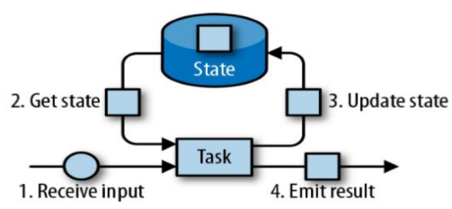
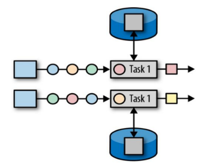
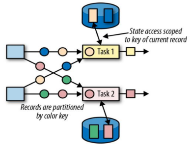
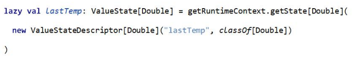
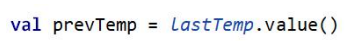
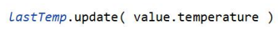

# 8.1 Flink 中的状态




• 由一个任务维护，并且用来计算某个结果的所有数据，都属于这个任务的状态 

• 可以认为状态就是一个本地变量，可以被任务的业务逻辑访问

• Flink 会进行状态管理，包括状态一致性、故障处理以及高效存储和访问，以便开发人员可以专注于应用程序的逻辑

• 在 Flink 中，状态始终与特定算子相关联

• 为了使运行时的 Flink 了解算子的状态，算子需要预先注册其状态


Ø 总的说来，有两种类型的状态： 

• 算子状态（Operator State） 

​	• 算子状态的作用范围限定为算子任务 

• 键控状态（Keyed State） 

​	• 根据输入数据流中定义的键（key）来维护和访问


---


# 8.2 算子状态（Operator State）



• 算子状态的作用范围限定为算子任务，由同一并行任务所处理的所有数据都可以访问到相同的状态 

• 状态对于同一子任务而言是共享的 

• 算子状态不能由相同或不同算子的另一个子任务访问


---


# 8.3 算子状态数据结构


Ø 列表状态（List state） 

​	• 将状态表示为一组数据的列表 


Ø 联合列表状态（Union list state） 

​	• 也将状态表示为数据的列表。它与常规列表状态的区别在于，在发生故障时，或者从保存点（savepoint）启动应用程序时如何恢复


Ø 广播状态（Broadcast state） 

​	• 如果一个算子有多项任务，而它的每项任务状态又都相同，那么这种特殊情况最适合应用广播状态。


---


# 8.4 键控状态（Keyed State）




• 键控状态是根据输入数据流中定义的键（key）来维护和访问的

• Flink 为每个 key 维护一个状态实例，并将具有相同键的所有数据，都分区到同一个算子任务中，这个任务会维护和处理这个key 对应的状态

• 当任务处理一条数据时，它会自动将状态的访问范围限定为当前数据的key


---


# 8.5 键控状态数据结构


Ø 值状态（Value state） 

​	• 将状态表示为单个的值 


Ø 列表状态（List state） 

​	• 将状态表示为一组数据的列表 


Ø 映射状态（Map state） 

​	• 将状态表示为一组 Key-Value 对 


Ø 聚合状态（Reducing state & Aggregating State）

​	• 将状态表示为一个用于聚合操作的列表


---


# 8.6 键控状态的使用


• 声明一个键控状态




• 读取状态




• 对状态赋值




案例：

```scala
object StateTest {
  def main(args: Array[String]): Unit = {
    val environment: StreamExecutionEnvironment = StreamExecutionEnvironment.getExecutionEnvironment
    environment.setParallelism(1)

    //从本地nc读取数据
    val ncStream: DataStream[String] = environment.socketTextStream("localhost", 9999)

    val dataStream: DataStream[(String, Long, Double)] = ncStream.map(data => {
      val strings: Array[String] = data.split(",")
      (strings(0), strings(1).toLong, strings(2).toDouble)
    })

    //需求：对于温度传感器温度值跳变，超过10度，报警
    val alertStream = dataStream.keyBy(_._1)
      //.flatMap(new TempChangeAlert(10.0))
      .flatMapWithState[(String, Double, Double), Double] {
        case (data: (String, Long, Double), None) => (List.empty, Some(data._3))
        case (data: (String, Long, Double), lastTemp: Some[Double]) => {
          //跟最新的温度值求差值作比较
          val diff = (data._3 - lastTemp.get).abs
          if (diff > 10.0) {
            (List((data._1, lastTemp.get, data._3)), Some(data._3))
          } else {
            (List.empty, Some(data._3))
          }
        }
      }

    alertStream.print()

    environment.execute()
  }

}

//实现自定义RichFlatmapFunction
class TempChangeAlert(threshold: Double) extends RichFlatMapFunction[(String, Long, Double), (String, Double, Double)] {
  //定义状态保存上一次的温度值
  lazy val lastTempState: ValueState[Double] = getRuntimeContext.getState(new ValueStateDescriptor[Double]("last-temp", classOf[Double]))

  override def flatMap(value: (String, Long, Double), out: Collector[(String, Double, Double)]): Unit = {
    //获取上次的温度值
    val lastTemp: Double = lastTempState.value()
    //跟最新的温度值求差值作比较
    val diff = (value._3 - lastTemp).abs
    if (diff > threshold)
      out.collect((value._1, lastTemp, value._3))

    //更新状态
    lastTempState.update(value._3)
  }
}

//keyed state测试：必须定义在RichFunction中，因为需要运行时上下文
class MyRichMapper1 extends RichMapFunction[(String, Long, Double), String] {

  var valueState: ValueState[Double] = _
  lazy val listState: ListState[Int] = getRuntimeContext.getListState(new ListStateDescriptor[Int]("liststate", classOf[Int]))
  lazy val mapState: MapState[String, Double] = getRuntimeContext.getMapState(new MapStateDescriptor[String, Double]("mapstate", classOf[String], classOf[Double]))

  override def open(parameters: Configuration): Unit = {
    valueState = getRuntimeContext.getState(new ValueStateDescriptor[Double]("valuestate", classOf[Double]))
  }

  override def map(value: (String, Long, Double)): String = {
    //状态的读写
    val myV: Double = valueState.value()
    valueState.update(value._3)

    listState.add(1)
    val list = new util.ArrayList[Int]()
    list.add(2)
    list.add(3)
    listState.addAll(list)
    listState.update(list)
    listState.get()

    mapState.contains("sensor_1")
    mapState.get("sensor_1")
    mapState.put("sensor_1", 1.3)

    value._1
  }
}
```


---


# 8.7 状态后端（State Backends）


• 每传入一条数据，有状态的算子任务都会读取和更新状态

• 由于有效的状态访问对于处理数据的低延迟至关重要，因此每个并行任务都会在本地维护其状态，以确保快速的状态访问

• 状态的存储、访问以及维护，由一个可插入的组件决定，这个组件就叫做状态后端（state backend） 

• 状态后端主要负责两件事：本地的状态管理，以及将检查点（checkpoint）状态写入远程存储


## 8.7.1选择一个状态后端


Ø MemoryStateBackend 

​	• 内存级的状态后端，会将键控状态作为内存中的对象进行管理，将它们存储在TaskManager 的 JVM 堆上，而将 checkpoint 存储在JobManager 的内存中

​	• 特点：快速、低延迟，但不稳定 


Ø FsStateBackend 

​	• 将 checkpoint 存到远程的持久化文件系统（FileSystem）上，而对于本地状态，跟 MemoryStateBackend 一样，也会存在 TaskManager 的JVM堆上

​	• 同时拥有内存级的本地访问速度，和更好的容错保证


Ø RocksDBStateBackend 

​	• 将所有状态序列化后，存入本地的 RocksDB 中存储。