# 1. 技术架构


## CS :客户端服务器架构模式

优点:充分利用客户端机器的资源,减轻服务器的负荷

(一部分安全要求不高的计 算任务存储任务放在客户端执行,不需要把所有的计算和存储都在服务器端执行,从而能够减轻服务器的压力,也能够减轻网络负荷)

缺点:需要安装;升级维护成本较高

## BS :浏览器服务器架构模式

优点:客户端不需要安装;维护成本较低

缺点:所有的计算和存储任务都是放在服务器端的,服务器的负荷较重;在服务端计算完成之后把结果再传输给客户端,因此客户端和服务器端会进行非常频繁的数据通信,从而网络负荷较重


# 2. Tomcat安装与配置

1)解压:不要有中文不要有空格

2)目录结构说明:

​	bin可执行文件目录

​	conf配置文件目录

​	lib 存放lib的目录

​	logs日志文件目录

​	webapps项目部署的目录

​	work工作目录

​	temp临时目录

3)配置环境变量,让tomcat能够运行因为tomcat也是用java和C来写的,因此需要JRE ,所以需要配置JAVA_ HOME

4)启动tomcat ,然后访问主页


2.新建Web项目,并在tomcat中部署

最后再访问

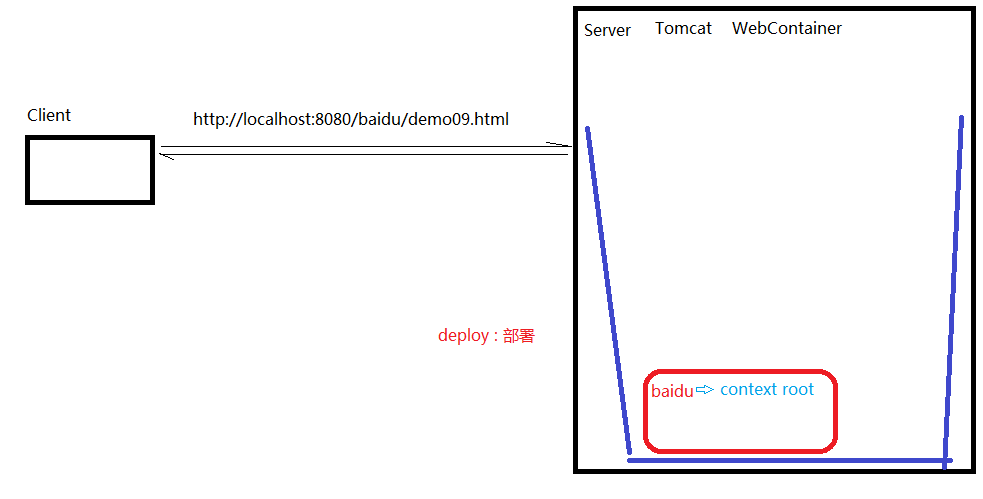


# 3. 创建JavaWeb项目

由于新版里在创建项目的时候不能直接设置添加web项目

所以需要在创建完项目以后右击刚才创建的项目中的此选项

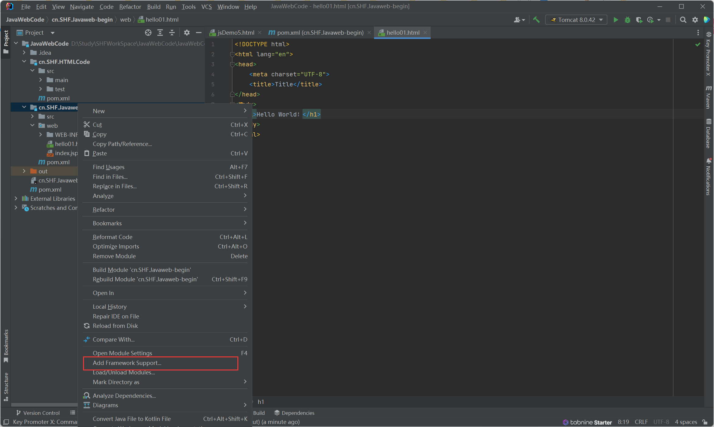

接着在其中选择Web Application

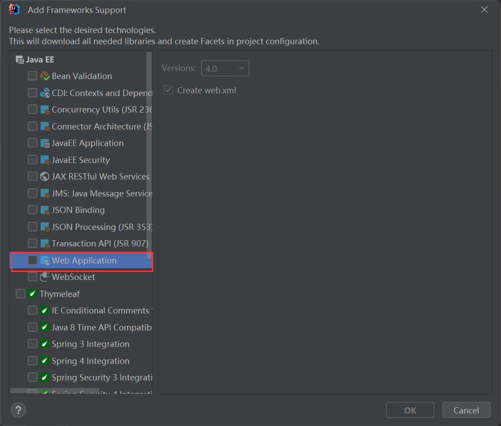


也可以在Project Structure中的Facrts中添加

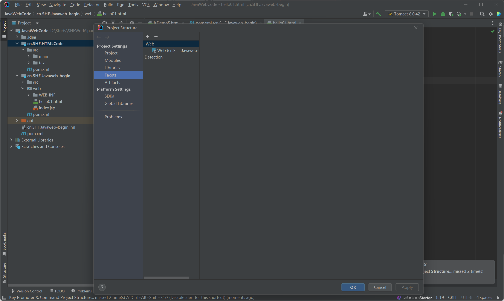


当导入他人的项目的时候，需要在此添加web配置文件夹才可以

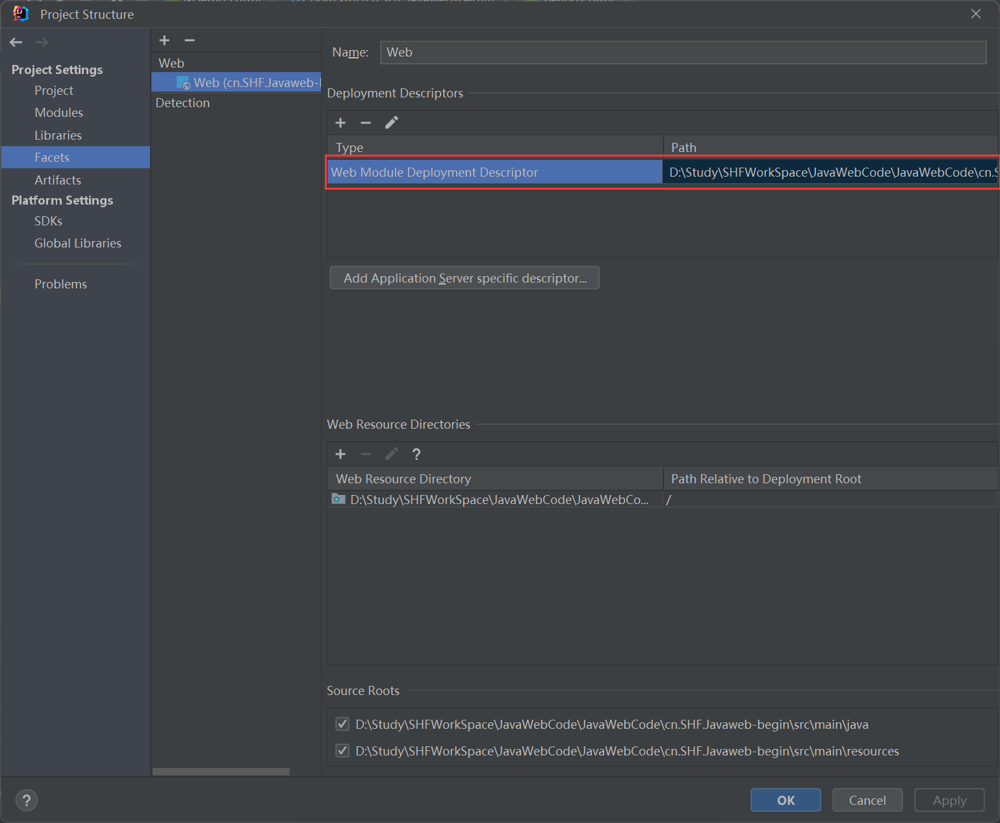


# 4.在idea中配置Tomcat设置

点击此选项

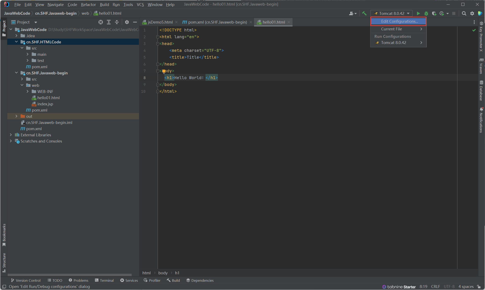


 点击添加新的Tomcat项目

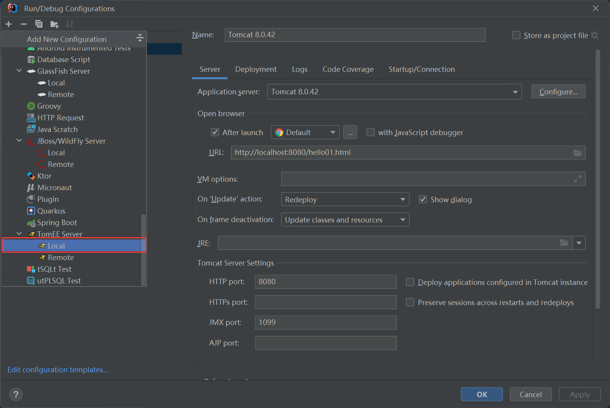


接着将第一个红框中的路径指向Tomcat的安装包的位置

后面两个设置为如图选项

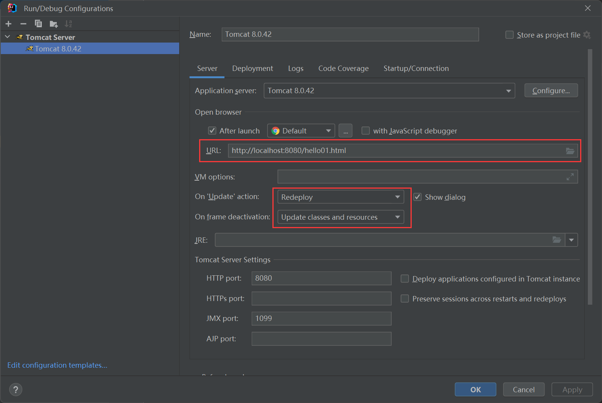

 

然后在Deployment中添加新的项目

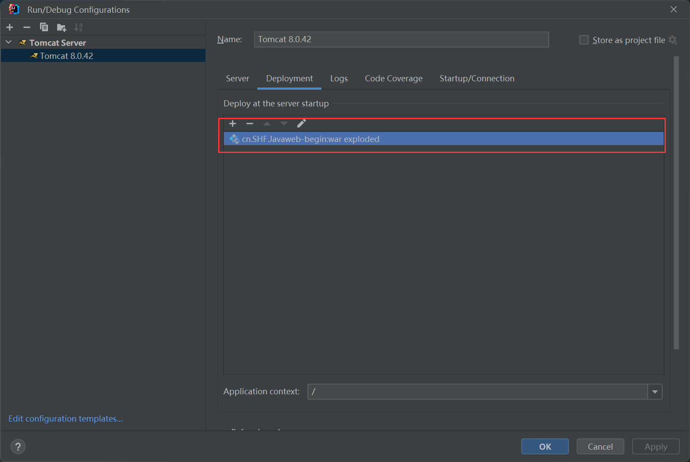

至此在idea中配置Tomcat完成


# 5. 执行过程


# 6. 设置编码

##  tomcat8之前，设置编码：

​      1)get请求方式：

​			 //get方式目前不需要设置编码（基于tomcat8）

​     		//如果是get请求发送的中文数据，转码稍微有点麻烦（tomcat8之前）

```
  String fname = request.getParameter("fname");
        //1.将字符串打散成字节数组
        byte[] bytes = fname.getBytes("ISO-8859-1");
        //2.将字节数组按照设定的编码重新组装成字符串
        fname = new String(bytes,"UTF-8");
```

​     

 2)post请求方式：
        		request.setCharacterEncoding("UTF-8");

##     tomcat8开始，设置编码

只需要针对post方式

​        request.setCharacterEncoding("UTF-8");
​    注意：
​        需要注意的是，设置编码(post)这一句代码必须在所有的获取参数动作之前


# 7. Servlet的继承关系 - 重点查看的是服务方法（service()）

## 1.  继承关系

javax.servlet.Servlet接口
    javax.servlet.GenericServlet抽象类
        javax.servlet.http.HttpServlet抽象子类


##  2. 相关方法

```java
javax.servlet.Servlet接口:
        void init(config) - 初始化方法
        void service(request,response) - 服务方法
        void destory() - 销毁方法
        
javax.servlet.GenericServlet抽象类：
        void service(request,response) - 仍然是抽象的

javax.servlet.http.HttpServlet 抽象子类：
        void service(request,response) - 不是抽象的
        
1. String method = req.getMethod(); 获取请求的方式
2. 各种if判断，根据请求方式不同，决定去调用不同的do方法
            if (method.equals("GET")) {
                this.doGet(req,resp);
            } else if (method.equals("HEAD")) {
                this.doHead(req, resp);
            } else if (method.equals("POST")) {
                this.doPost(req, resp);
            } else if (method.equals("PUT")) {
3. 在HttpServlet这个抽象类中，do方法都差不多:
protected void doGet(HttpServletRequest req, HttpServletResponse resp) throws ServletException, IOException {
            String protocol = req.getProtocol();
            String msg = lStrings.getString("http.method_get_not_supported");
            if (protocol.endsWith("1.1")) {
                resp.sendError(405, msg);
            } else {
                resp.sendError(400, msg);
            }
        }
```


##  3.小结：

1. 继承关系： HttpServlet -> GenericServlet -> Servlet

      

2. Servlet中的核心方法： init() , service() , destroy()

      

3. 服务方法： 当有请求过来时，service方法会自动响应（其实是tomca容器调用的）
          在HttpServlet中我们会去分析请求的方式：到底是get、post、head还是delete等等
          然后再决定调用的是哪个do开头的方法
          那么在HttpServlet中这些do方法默认都是405的实现风格-要我们子类去实现对应的方法，否则默认会报405错误

      

4. 因此，我们在新建Servlet时，我们才会去考虑请求方法，从而决定重写哪个do方法


# 8. Servlet的生命周期

1. 生命周期：从出生到死亡的过程就是生命周期。对应Servlet中的三个方法：init(),service(),destroy()

2. 默认情况下：

   第一次接收请求时，这个Servlet会进行实例化(调用构造方法)、初始化(调用init())、然后服务(调用service())

   从第二次请求开始，每一次都是服务
   当容器关闭时，其中的所有的servlet实例会被销毁，调用销毁方法

3.  通过案例我们发现：

​			Servlet实例tomcat只会创建一个，所有的请求都是这个实例去响应。

​			默认情况下，第一次请求时，tomcat才会去实例化，初始化，然后再服务.这样的好处是什么？ 提高系统的启动速度 。 这样的缺点是什么？ 第一次请求时，耗时较长。

​			因此得出结论： 如果需要提高系统的启动速度，当前默认情况就是这样。如果需要提高响应速度，我们应该设置Servlet的初始化时机。

4. Servlet的初始化时机：

   默认是第一次接收请求时，实例化，初始化

   我们可以通过<load-on-startup>来设置servlet启动的先后顺序,数字越小，启动越靠前，最小值0

5. Servlet在容器中是：单例的、线程不安全的

​		单例：所有的请求都是同一个实例去响应

​		线程不安全：一个线程需要根据这个实例中的某个成员变量值去做逻辑判断。但是在中间某个时机，另一个线程改变了这个成员变量的值，从而导致第一个线程的执行路径发生了变化

​		我们已经知道了servlet是线程不安全的，给我们的启发是： 尽量的不要在servlet中定义成员变量。如果不得不定义成员变量，那么不要去：①不要去修改成员变量的值 ②不要去根据成员变量的值做一些逻辑判断

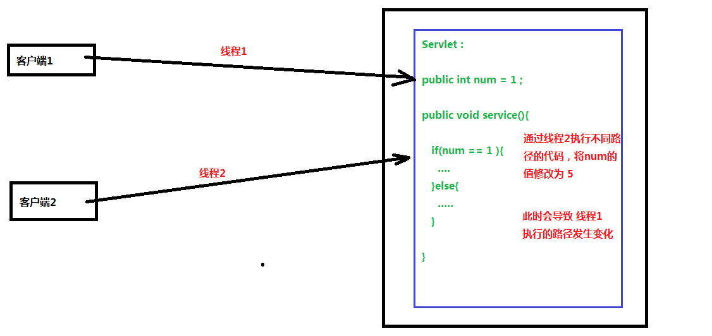


#  9. Http协议

1. Http 称之为 超文本传输协议

2. Http是无状态的

3. Http请求响应包含两个部分：请求和响应

   

   **请求：**

   请求包含三个部分： 1.请求行 ； 2.请求消息头 ； 3.请求主体

    1)请求行包含是三个信息： 1. 请求的方式 ； 2.请求的URL ； 3.请求的协议（一般都是HTTP1.1）
    2)请求消息头中包含了很多客户端需要告诉服务器的信息，比如：我的浏览器型号、版本、我能接收的内容的类型、我给你发的内容的类型、内容的长度等等
    3)请求体，三种情况
             get方式，没有请求体，但是有一个queryString
             post方式，有请求体，form data
             json格式，有请求体，request payload

​		

​			**响应：**

​		 响应也包含三本： 1. 响应行 ； 2.响应头 ； 3.响应体
​    			1)响应行包含三个信息：1.协议 2.响应状态码(200) 3.响应状态(ok)
​    			2)响应头：包含了服务器的信息；服务器发送给浏览器的信息（内容的媒体类型、编码、内容长度等）
​    			3)响应体：响应的实际内容（比如请求add.html页面时，响应的内容就是<html><head><body><form....）


# 10. 会话

## 1. Http是无状态的

 HTTP 无状态 ：服务器无法判断这两次请求是同一个客户端发过来的，还是不同的客户端发过来的
        无状态带来的现实问题：第一次请求是添加商品到购物车，第二次请求是结账；如果这两次请求服务器无法区分是同一个用户的，那么就会导致混乱
        通过会话跟踪技术来解决无状态的问题。


## 2. 会话跟踪技术


客户端第一次发请求给服务器，服务器获取session，获取不到，则创建新的，然后响应给客户端
        下次客户端给服务器发请求时，会把sessionID带给服务器，那么服务器就能获取到了，那么服务器就判断这一次请求和上次某次请求是同一个客户端，从而能够区分开客户端


常用的API：

```java
request.getSession() -> 获取当前的会话，没有则创建一个新的会话
request.getSession(true) -> 效果和不带参数相同
request.getSession(false) -> 获取当前会话，没有则返回null，不会创建新的

session.getId() -> 获取sessionID
session.isNew() -> 判断当前session是否是新的
session.getMaxInactiveInterval() -> session的非激活间隔时长，默认1800秒
session.setMaxInactiveInterval()
session.invalidate() -> 强制性让会话立即失效
          ....
```

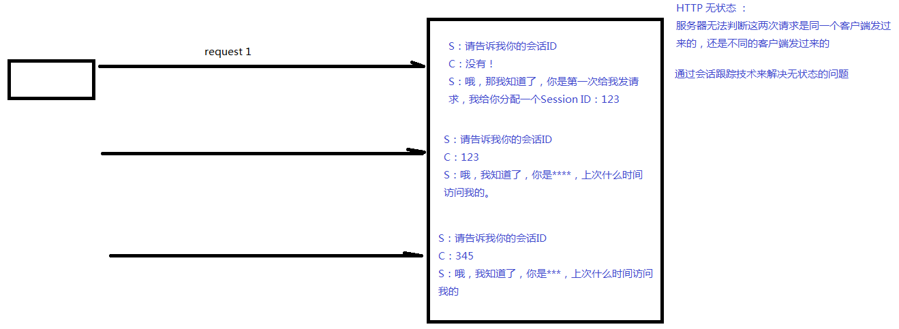


## 3. session保存作用域

session保存作用域是和具体的某一个session对应的

常用的API：

```java
void session.setAttribute(k,v)
Object session.getAttribute(k)
void removeAttribute(k)
```


# 11. 服务器内部转发以及客户端重定向

```java
 服务器内部转发 : request.getRequestDispatcher("...").forward(request,response);
```

1. 一次请求响应的过程，对于客户端而言，内部经过了多少次转发，客户端是不知道的

​		 地址栏没有变化

```java
客户端重定向： response.sendRedirect("....");
```

2. 两次请求响应的过程。客户端肯定知道请求URL有变化

​		 地址栏有变化
