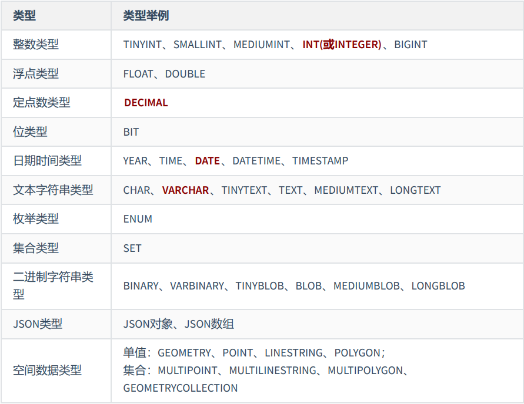
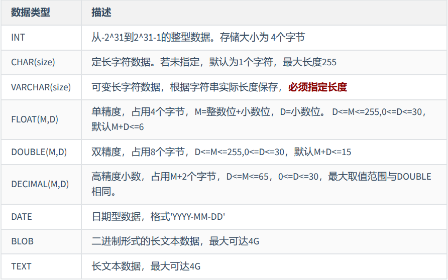
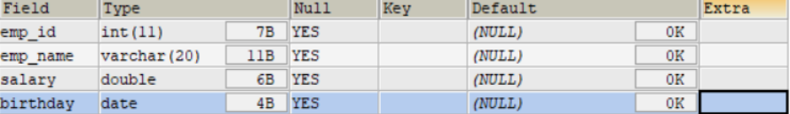
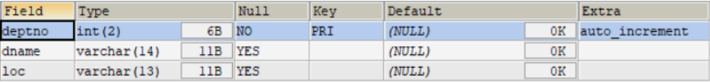
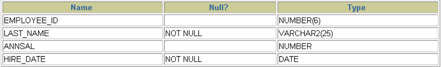
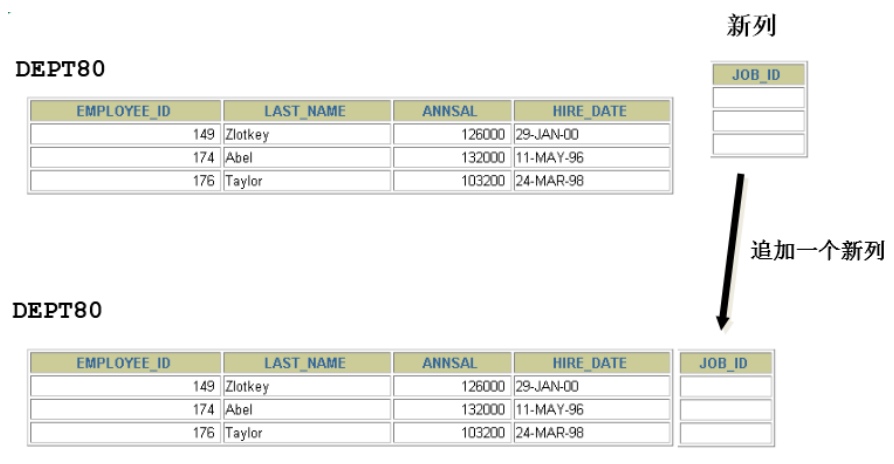

# 1. 基础知识

## 1.1 一条数据存储的过程

存储数据是处理数据的第一步 。只有正确地把数据存储起来，我们才能进行有效的处理和分析。否则，只 能是一团乱麻，无从下手。

那么，怎样才能把用户各种经营相关的、纷繁复杂的数据，有序、高效地存储起来呢？ 在 MySQL 中， 一个完整的数据存储过程总共有 4 步，分别是创建数据库、确认字段、创建数据表、插入数据。


我们要先创建一个数据库，而不是直接创建数据表呢？

因为从系统架构的层次上看，MySQL 数据库系统从大到小依次是 **数据库服务器 、 数据库 、 数据表** 、数 据表的 **行与列** 。

MySQL 数据库服务器之前已经安装。所以，我们就从创建数据库开始。


## 1.2 标识符命名规则

数据库名、表名不得超过30个字符，变量名限制为29个 

必须只能包含 A–Z, a–z, 0–9, _共63个字符 

数据库名、表名、字段名等对象名中间不要包含空格 

同一个MySQL软件中，数据库不能同名；同一个库中，表不能重名；同一个表中，字段不能重名 

必须保证你的字段没有和保留字、数据库系统或常用方法冲突。如果坚持使用，请在SQL语句中使 用`（着重号）引起来 

保持字段名和类型的一致性：在命名字段并为其指定数据类型的时候一定要保证一致性，假如数据 类型在一个表里是整数，那在另一个表里可就别变成字符型了


## 1.3 MySQL中的数据类型



其中，常用的几类类型介绍如下：




# 2. 创建和管理数据库

## 2.1 创建数据库

方式1：创建数据库

```sql
CREATE DATABASE 数据库名;
```

方式2：创建数据库并指定字符集

```sql
CREATE DATABASE 数据库名 CHARACTER SET 字符集;
```

方式3：判断数据库是否已经存在，不存在则创建数据库（ 推荐 ）

```sql
CREATE DATABASE IF NOT EXISTS 数据库名;
```

如果MySQL中已经存在相关的数据库，则忽略创建语句，不再创建数据库。

**注意：DATABASE 不能改名。一些可视化工具可以改名，它是建新库，把所有表复制到新库，再删 旧库完成的。**


## 2.2 使用数据库

查看当前所有的数据库

```sql
SHOW DATABASES; #有一个S，代表多个数据库
```

查看当前正在使用的数据库

```sql
SELECT DATABASE(); #使用的一个 mysql 中的全局函数
```

查看指定库下所有的表

```sql
SHOW TABLES FROM 数据库名;
```

查看数据库的创建信息

```sql
SHOW CREATE DATABASE 数据库名;
或者：
SHOW CREATE DATABASE 数据库名\G
```

使用/切换数据库

```sql
USE 数据库名;
```

**注意：要操作表格和数据之前必须先说明是对哪个数据库进行操作，否则就要对所有对象加上“数据库名.”。**


## 2.3 修改数据库

更改数据库字符集

```sql
ALTER DATABASE 数据库名 CHARACTER SET 字符集; #比如：gbk、utf8等
```


## 2.4 删除数据库

方式1：删除指定的数据库

```sql
DROP DATABASE 数据库名;
```

方式2：删除指定的数据库（ 推荐 ）

```sql
DROP DATABASE IF EXISTS 数据库名;
```


# 3. 创建表

## 3.1 创建方式1

**必须具备：**

​	CREATE TABLE权限 

​	存储空间

**语法格式：**

```sql
CREATE TABLE [IF NOT EXISTS] 表名(
	字段1, 数据类型 [约束条件] [默认值],
	字段2, 数据类型 [约束条件] [默认值],
	字段3, 数据类型 [约束条件] [默认值],
	……
	[表约束条件]
);
```

**加上了IF NOT EXISTS关键字，则表示：如果当前数据库中不存在要创建的数据表，则创建数据表； 如果当前数据库中已经存在要创建的数据表，则忽略建表语句，不再创建数据表。**

**必须指定：**

​	表名 

​	列名(或字段名)，数据类型，长度

**可选指定：**

​	约束条件 

​	默认值


创建表举例1：

```sql
-- 创建表
CREATE TABLE emp (
	-- int类型
	emp_id INT,
	-- 最多保存20个中英文字符
	emp_name VARCHAR(20),
	-- 总位数不超过15位
	salary DOUBLE,
	-- 日期类型
	birthday DATE
);
```

```sql
DESC emp;
```




MySQL在执行建表语句时，将id字段的类型设置为int(11)，这里的11实际上是int类型指定的显示宽度，默 认的显示宽度为11。也可以在创建数据表的时候指定数据的显示宽度。


创建表举例2：

```sql
CREATE TABLE dept(
	-- int类型，自增
	deptno INT(2) AUTO_INCREMENT,
	dname VARCHAR(14),
	loc VARCHAR(13),
	-- 主键
	PRIMARY KEY (deptno)
);
```

DESCRIBE dept;



**在MySQL 8.x版本中，不再推荐为INT类型指定显示长度，并在未来的版本中可能去掉这样的语法。**


## 3.2 创建方式2

**使用 AS subquery 选项，将创建表和插入数据结合起来**


指定的列和子查询中的列要一一对应 

通过列名和默认值定义列

```sql
CREATE TABLE emp1 AS SELECT * FROM employees;

CREATE TABLE emp2 AS SELECT * FROM employees WHERE 1=2; -- 创建的emp2是空表
```

```sql
CREATE TABLE dept80
AS
SELECT employee_id, last_name, salary*12 ANNSAL, hire_date
FROM employees
WHERE department_id = 80;
```

```sql
DESCRIBE dept80;
```




## 3.3 查看数据表结构

在MySQL中创建好数据表之后，可以查看数据表的结构。MySQL支持使用 DESCRIBE/DESC 语句查看数据 表结构，也支持使用 SHOW CREATE TABLE 语句查看数据表结构。

语法格式如下：

```sql
SHOW CREATE TABLE 表名\G
```

使用SHOW CREATE TABLE语句不仅可以查看表创建时的详细语句，还可以查看存储引擎和字符编码。


# 4. 修改表

修改表指的是修改数据库中已经存在的数据表的结构。

**使用 ALTER TABLE 语句可以实现：**

​	向已有的表中添加列 

​	修改现有表中的列 

​	删除现有表中的列 

​	重命名现有表中的列


## 4.1 追加一个列

语法格式如下：

```sql
ALTER TABLE 表名 ADD 【COLUMN】 字段名 字段类型 【FIRST|AFTER 字段名】;
```

举例：

```sql
ALTER TABLE dept80
ADD job_id varchar(15);
```




## 4.2 修改一个列

可以修改列的数据类型，长度、默认值和位置 

修改字段数据类型、长度、默认值、位置的语法格式如下：

```sql
ALTER TABLE 表名 MODIFY 【COLUMN】 字段名1 字段类型 【DEFAULT 默认值】【FIRST|AFTER 字段名2】;
```

举例：

```sql
ALTER TABLE dept80
MODIFY last_name VARCHAR(30);
```

```sql
ALTER TABLE dept80
MODIFY salary double(9,2) default 1000;
```

对默认值的修改只影响今后对表的修改 此外，还可以通过此种方式修改列的约束。这里暂先不讲。


## 4.3 重命名一个列

使用 CHANGE old_column new_column dataType子句重命名列。语法格式如下：

```sql
ALTER TABLE 表名 CHANGE 【column】 列名 新列名 新数据类型;
```

举例：

```sql
ALTER TABLE dept80
CHANGE department_name dept_name varchar(15);
```


## 4.4 删除一个列

删除表中某个字段的语法格式如下：

```sql
ALTER TABLE 表名 DROP 【COLUMN】字段名
```

举例：

```sql
ALTER TABLE dept80
DROP COLUMN job_id;
```


# 5. 重命名表

方式一：使用RENAME

```sql
RENAME TABLE emp
TO myemp;
```

方式二：

```sql
ALTER table dept
RENAME [TO] detail_dept; -- [TO]可以省略
```

必须是对象的拥有者


# 6. 删除表

在MySQL中，当一张数据表 没有与其他任何数据表形成关联关系 时，可以将当前数据表直接删除。 

数据和结构都被删除 

所有正在运行的相关事务被提交 

所有相关索引被删除 

语法格式：

```sql
DROP TABLE [IF EXISTS] 数据表1 [, 数据表2, …, 数据表n];
```

IF EXISTS 的含义为：如果当前数据库中存在相应的数据表，则删除数据表；如果当前数据库中不存 在相应的数据表，则忽略删除语句，不再执行删除数据表的操作。

举例：

```sql
DROP TABLE dept80;
```

DROP TABLE 语句不能回滚


# 7. 清空表

TRUNCATE TABLE语句：

​	删除表中所有的数据 

​	释放表的存储空间

举例：

```sql
TRUNCATE TABLE detail_dept;
```

TRUNCATE语句不能回滚，而使用 DELETE 语句删除数据，可以回滚 

对比：

```sql
SET autocommit = FALSE;

DELETE FROM emp2;
#TRUNCATE TABLE emp2;

SELECT * FROM emp2;

ROLLBACK;

SELECT * FROM emp2;
```

阿里开发规范： 

【参考】TRUNCATE TABLE 比 DELETE 速度快，且使用的系统和事务日志资源少，但 TRUNCATE 无事务且不触发 TRIGGER，有可能造成事故，故不建议在开发代码中使用此语句。 

说明：TRUNCATE TABLE 在功能上与不带 WHERE 子句的 DELETE 语句相同。
