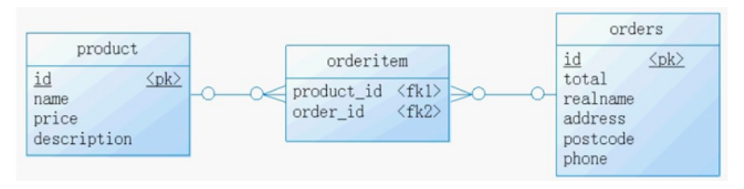

# RDBMS 与 非RDBMS

## 关系型数据库(RDBMS)

###  实质

这种类型的数据库是 最古老 的数据库类型，关系型数据库模型是把复杂的数据结构归结为简单的 二元关系 （即二维表格形式）。


关系型数据库以行( row)和列(column)的形式存储数据,以便于用户理解。这一系列的行和列被称为 表(table)，一组表组成了一个库(database)。

表与表之间的数据记录有关系(relationship)。现实世界中的各种实体以及实体之间的各种联系均用关系模型来表示。关系型数据库，就是建立在关系模型基础_上的数据库。

SQL 就是关系型数据库的查询语言。


---


### 优势

**复杂查询** 可以用SQL语句方便的在一个表以及多个表之间做非常复杂的数据查询。 

**事务支持** 使得对于安全性能很高的数据访问要求得以实现。


---


## 非关系型数据库(非RDBMS)


###  介绍

非关系型数据库，可看成传统关系型数据库的功能 阉割版本 ，基于键值对存储数据，不需要经过SQL层 的解析， 性能非常高 。同时，通过减少不常用的功能，进一步提高性能。

相比于 SQL，NoSQL 泛指非关系型数据库，包括了榜单上的键值型数据库、文档型数据库、搜索引擎和 列存储等，除此以外还包括图形数据库。也只有用 NoSQL 一词才能将这些技术囊括进来。

**键值型数据库**

键值型数据库通过 Key-Value 键值的方式来存储数据，其中 Key 和 Value 可以是简单的对象，也可以是复 杂的对象。Key 作为唯一的标识符，优点是查找速度快，在这方面明显优于关系型数据库，缺点是无法 像关系型数据库一样使用条件过滤（比如 WHERE），如果你不知道去哪里找数据，就要遍历所有的键， 这就会消耗大量的计算。

键值型数据库典型的使用场景是作为 内存缓存 。 Redis 是最流行的键值型数据库。


**文档型数据库** 

此类数据库可存放并获取文档，可以是XML、JSON等格式。在数据库中文档作为处理信息的基本单位， 一个文档就相当于一条记录。文档数据库所存放的文档，就相当于键值数据库所存放的“值”。MongoDB 是最流行的文档型数据库。此外，还有CouchDB等。 

**搜索引擎数据库** 

虽然关系型数据库采用了索引提升检索效率，但是针对全文索引效率却较低。搜索引擎数据库是应用在 搜索引擎领域的数据存储形式，由于搜索引擎会爬取大量的数据，并以特定的格式进行存储，这样在检 索的时候才能保证性能最优。核心原理是“倒排索引”。 典型产品：Solr、Elasticsearch、Splunk 等。 

**列式数据库** 

列式数据库是相对于行式存储的数据库，Oracle、MySQL、SQL Server 等数据库都是采用的行式存储 （Row-based），而列式数据库是将数据按照列存储到数据库中，这样做的好处是可以大量降低系统的 I/O，适合于分布式文件系统，不足在于功能相对有限。典型产品：HBase等。


**图形数据库**

图形数据库，利用了图这种数据结构存储了实体(对象)之间的关系。图形数据库最典型的例子就是社交网络中人与人的关系,数据模型主要是以节点和边(关系)来实现，特点在于能高效地解决复杂的关系问题。

图形数据库顾名思义，就是一种存储图形关系的数据库。它利用了图这种数据结构存储了实体(对象)之间的关系。关系型数据用于存储明确关系的数据，但对于复杂关系的数据存储却有些力不从心。如社交网络中人物之间的关系，如果用关系型数据库则非常复杂，用图形数据库将非常简单。典型产品: Neo4J、 InfoGrid等。


### NoSQL的演变

由于 SQL 一直称霸 DBMS，因此许多人在思考是否有一种数据库技术能远离 SQL，于是 NoSQL 诞生了， 但是随着发展却发现越来越离不开 SQL。到目前为止 NoSQL 阵营中的 DBMS 都会有实现类似 SQL 的功 能。下面是“NoSQL”这个名词在不同时期的诠释，从这些释义的变化中可以看出 NoSQL 功能的演变 ： 

1970：NoSQL = We have no SQL 

1980：NoSQL = Know SQL 

2000：NoSQL = No SQL! 

2005：NoSQL = Not only SQL 

2013：NoSQL = No, SQL! 

NoSQL 对 SQL 做出了很好的补充，比如实际开发中，有很多业务需求，其实并不需要完整的关系型数据 库功能，非关系型数据库的功能就足够使用了。这种情况下，使用 性能更高 、 成本更低 的非关系型数据库当然是更明智的选择。比如：日志收集、排行榜、定时器等。


#  关系型数据库设计规则

●关系型数据库的典型数据结构就是数据表，这些数据表的组成都是结构化的(Structured) 。

●将数据放到表中，表再放到库中。

●一个数据库中可以有多个表，每个表都有一个名字,用来标识自己。表名具有唯一 性。|

●表具有一些特性,这些特性定义了数据在表中如何存储,类似Java和Python中“类”的设计。


###  表、记录、字段

E-R（entity-relationship，实体-联系）模型中有三个主要概念是： 实体集 、 属性 、 联系集 。 

一个实体集（class）对应于数据库中的一个表（table），一个实体（instance）则对应于数据库表 中的一行（row），也称为一条记录（record）。一个属性（attribute）对应于数据库表中的一列 （column），也称为一个字段（field）。


```
ORM思想 (Object Relational Mapping)体现：
数据库中的一个表 <---> Java或Python中的一个类
表中的一条数据 <---> 类中的一个对象（或实体）
表中的一个列 <----> 类中的一个字段、属性(field)
```


### 表的关联关系

表与表之间的数据记录有关系(relationship)。现实世界中的各种实体以及实体之间的各种联系均用 

关系模型来表示。 四种：一对一关联、一对多关联、多对多关联、自我引用


### 一对一关联（one-to-one）

在实际的开发中应用不多，因为一对一可以创建成一张表。 

举例：设计 学生表 ：学号、姓名、手机号码、班级、系别、身份证号码、家庭住址、籍贯、紧急 联系人、... 

拆为两个表：两个表的记录是一一对应关系。 

基础信息表 （常用信息）：学号、姓名、手机号码、班级、系别 

档案信息表 （不常用信息）：学号、身份证号码、家庭住址、籍贯、紧急联系人、... 


两种建表原则： 

外键唯一：主表的主键和从表的外键（唯一），形成主外键关系，外键唯一。 

外键是主键：主表的主键和从表的主键，形成主外键关系。


### 一对多关系（one-to-many）

常见实例场景： 客户表和订单表 ， 分类表和商品表 ， 部门表和员工表 。 

举例： 

员工表：编号、姓名、...、所属部门 

部门表：编号、名称、简介 


一对多建表原则：

在从表(多方)创建一个字段，字段作为外键指向主表(一方)的主键


### 多对多（many-to-many）


要表示多对多关系，必须创建第三个表，该表通常称为 联接表 ，它将多对多关系划分为两个一对多关 系。将这两个表的主键都插入到第三个表中。


**举例1：学生-课程**

学生信息表 ：一行代表一个学生的信息（学号、姓名、手机号码、班级、系别...）

课程信息表: 一行代表一个课程的信息(课程编号、授课老师、简介..)

选课信息表:一个学生可以选多门课，一门课可以被多个学生选择

```
学号 课程编号
1 1001
2 1001
1 1002
```


**举例2：产品-订单** 

“订单”表和“产品”表有一种多对多的关系，这种关系是通过与“订单明细”表建立两个一对多关系来 定义的。一个订单可以有多个产品，每个产品可以出现在多个订单中。 

产品表 ：“产品”表中的每条记录表示一个产品。

订单表 ：“订单”表中的每条记录表示一个订单。 

订单明细表 ：每个产品可以与“订单”表中的多条记录对应，即出现在多个订单中。一个订单 可以与“产品”表中的多条记录对应，即包含多个产品。




**举例3：用户-角色**

多对多关系建表原则：需要创建第三张表，中间表中至少两个字段，这两个字段分别作为外键指向 各自一方的主键。


### 自我引用(Self reference)

