# 1. 函数的理解

## 1.1 什么是函数

函数在计算机语言的使用中贯穿始终，函数的作用是什么呢？它可以把我们经常使用的代码封装起来， 需要的时候直接调用即可。这样既 提高了代码效率 ，又 提高了可维护性 。在 SQL 中我们也可以使用函数 对检索出来的数据进行函数操作。使用这些函数，可以极大地 提高用户对数据库的管理效率 。

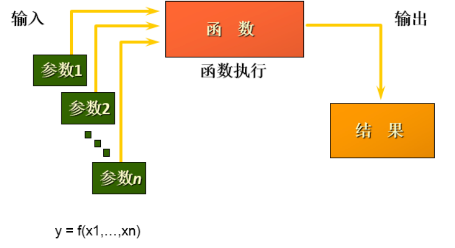

从函数定义的角度出发，我们可以将函数分成 内置函数 和 自定义函数 。在 SQL 语言中，同样也包括了 内置函数和自定义函数。内置函数是系统内置的通用函数，而自定义函数是我们根据自己的需要编写 的，本章及下一章讲解的是 SQL 的内置函数。


## 1.2 不同DBMS函数的差异

我们在使用 SQL 语言的时候，不是直接和这门语言打交道，而是通过它使用不同的数据库软件，即 **DBMS。DBMS 之间的差异性很大，远大于同一个语言不同版本之间的差异**。实际上，只有很少的函数是 被 DBMS 同时支持的。比如，大多数 DBMS 使用（||）或者（+）来做拼接符，而在 MySQL 中的字符串拼 接函数为concat()。大部分 DBMS 会有自己特定的函数，这就意味着**采用 SQL 函数的代码可移植性是很差的**，因此在使用函数的时候需要特别注意。


## 1.3 MySQL的内置函数及分类

MySQL提供了丰富的内置函数，这些函数使得数据的维护与管理更加方便，能够更好地提供数据的分析 与统计功能，在一定程度上提高了开发人员进行数据分析与统计的效率。

MySQL提供的内置函数从 实现的功能角度 可以分为数值函数、字符串函数、日期和时间函数、流程控制 函数、加密与解密函数、获取MySQL信息函数、聚合函数等。这里，我将这些丰富的内置函数再分为两 类： 单行函数 、 聚合函数（或分组函数） 。


**两种SQL函数**

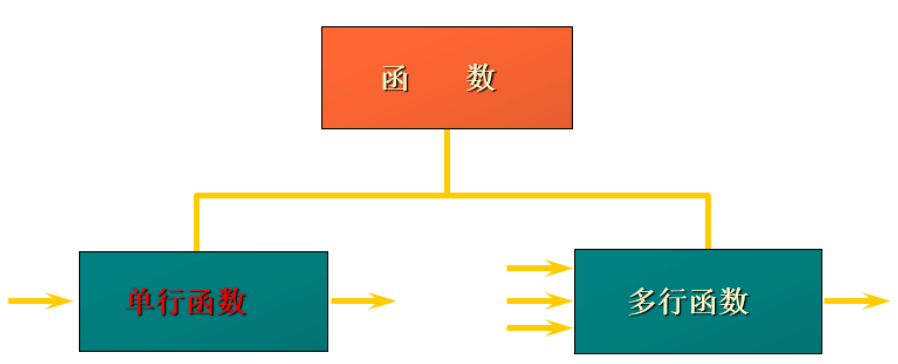


**单行函数**

​	操作数据对象 

​	接受参数返回一个结果 

​	**只对一行进行变换** 

​	**每行返回一个结果** 

​	可以嵌套 

​	参数可以是一列或一个值


# 2. 数值函数

## 2.1 基本函数


举例：

```sql
SELECT
ABS(-123),ABS(32),SIGN(-23),SIGN(43),PI(),CEIL(32.32),CEILING(-43.23),FLOOR(32.32),
FLOOR(-43.23),MOD(12,5)
FROM DUAL;
```


```sql
SELECT RAND(),RAND(),RAND(10),RAND(10),RAND(-1),RAND(-1)
FROM DUAL;
```


```sql
SELECT
ROUND(12.33),ROUND(12.343,2),ROUND(12.324,-1),TRUNCATE(12.66,1),TRUNCATE(12.66,-1)
FROM DUAL;
```


## 2.2 角度与弧度互换函数


```sql
SELECT RADIANS(30),RADIANS(60),RADIANS(90),DEGREES(2*PI()),DEGREES(RADIANS(90))
FROM DUAL;
```


## 2.3 三角函数


举例：

ATAN2(M,N)函数返回两个参数的反正切值。 与ATAN(X)函数相比，ATAN2(M,N)需要两个参数，例如有两个 点point(x1,y1)和point(x2,y2)，使用ATAN(X)函数计算反正切值为ATAN((y2-y1)/(x2-x1))，使用ATAN2(M,N)计 算反正切值则为ATAN2(y2-y1,x2-x1)。由使用方式可以看出，当x2-x1等于0时，ATAN(X)函数会报错，而 ATAN2(M,N)函数则仍然可以计算。

ATAN2(M,N)函数的使用示例如下：

```sql
SELECT
SIN(RADIANS(30)),DEGREES(ASIN(1)),TAN(RADIANS(45)),DEGREES(ATAN(1)),DEGREES(ATAN2(1,1)
)
FROM DUAL;
```


## 2.4 指数与对数


```sql
mysql> SELECT POW(2,5),POWER(2,4),EXP(2),LN(10),LOG10(10),LOG2(4)
-> FROM DUAL;
+----------+------------+------------------+-------------------+-----------+---------+
| POW(2,5) | POWER(2,4) | EXP(2) | LN(10) | LOG10(10) | LOG2(4) |
+----------+------------+------------------+-------------------+-----------+---------+
| 32 | 16 | 7.38905609893065 | 2.302585092994046 | 1 | 2 |
+----------+------------+------------------+-------------------+-----------+---------+
1 row in set (0.00 sec)
```


## 2.5 进制间的转换


```sql
mysql> SELECT BIN(10),HEX(10),OCT(10),CONV(10,2,8)
-> FROM DUAL;
+---------+---------+---------+--------------+
| BIN(10) | HEX(10) | OCT(10) | CONV(10,2,8) |
+---------+---------+---------+--------------+
| 1010 | A | 12 | 2 |
+---------+---------+---------+--------------+
1 row in set (0.00 sec)
```


# 3. 字符串函数

| 函数                              | 用法                                                         |
| --------------------------------- | ------------------------------------------------------------ |
| ASCII(S)                          | 返回字符串S中的第一个字符的ASCII码值                         |
| CHAR_LENGTH(s)                    | 返回字符串s的字符数。作用与CHARACTER_LENGTH(s)相同           |
| LENGTH(s)                         | 返回字符串s的字节数，和字符集有关                            |
| CONCAT(s1,s2,......,sn)           | 连接s1,s2,......,sn为一个字符串                              |
| CONCAT_WS(x, s1,s2,......,sn)     | 同CONCAT(s1,s2,...)函数，但是每个字符串之间要加上x           |
| INSERT(str, idx, len, replacestr) | 将字符串str从第idx位置开始，len个字符长的子串替换为字符串replacestr |
| REPLACE(str, a, b)                | 用字符串b替换字符串str中所有出现的字符串a                    |
| UPPER(s) 或 UCASE(s)              | 将字符串s的所有字母转成大写字母                              |
| LOWER(s) 或LCASE(s)               | 将字符串s的所有字母转成小写字母                              |
| LEFT(str,n)                       | 返回字符串str最左边的n个字符                                 |
| RIGHT(str,n)                      | 返回字符串str最右边的n个字符                                 |
| LPAD(str, len, pad)               | 用字符串pad对str最左边进行填充，直到str的长度为len个字符     |
| RPAD(str ,len, pad)               | 用字符串pad对str最右边进行填充，直到str的长度为len个字符     |
| LTRIM(s)                          | 去掉字符串s左侧的空格                                        |
| RTRIM(s)                          | 去掉字符串s右侧的空格                                        |
| TRIM(s)                           | 去掉字符串s开始与结尾的空格                                  |
| TRIM(s1 FROM s)                   | 去掉字符串s开始与结尾的s1                                    |
| TRIM(LEADING s1 FROM s)           | 去掉字符串s开始处的s1                                        |
| TRIM(TRAILING s1 FROM s)          | 去掉字符串s结尾处的s1                                        |
| REPEAT(str, n)                    | 返回str重复n次的结果                                         |
| SPACE(n)                          | 返回n个空格                                                  |
| STRCMP(s1,s2)                     | 比较字符串s1,s2的ASCII码值的大小                             |
| SUBSTR(s,index,len)               | 返回从字符串s的index位置其len个字符，作用与SUBSTRING(s,n,len)、 MID(s,n,len)相同 |
| LOCATE(substr,str)                | 返回字符串substr在字符串str中首次出现的位置，作用于POSITION(substr IN str)、INSTR(str,substr)相同。未找到，返回0 |
| ELT(m,s1,s2,…,sn)                 | 返回指定位置的字符串，如果m=1，则返回s1，如果m=2，则返回s2，如 果m=n，则返回sn |
| FIELD(s,s1,s2,…,sn)               | 返回字符串s在字符串列表中第一次出现的位置                    |
| FIND_IN_SET(s1,s2)                | 返回字符串s1在字符串s2中出现的位置。其中，字符串s2是一个以逗号分隔的字符串 |
| REVERSE(s)                        | 返回s反转后的字符串                                          |
| NULLIF(value1,value2)             | 比较两个字符串，如果value1与value2相等，则返回NULL，否则返回 value1 |

**注意：MySQL中，字符串的位置是从1开始的。**

举例：

```sql
mysql> SELECT FIELD('mm','hello','msm','amma'),FIND_IN_SET('mm','hello,mm,amma')
-> FROM DUAL;
+----------------------------------+-----------------------------------+
| FIELD('mm','hello','msm','amma') | FIND_IN_SET('mm','hello,mm,amma') |
+----------------------------------+-----------------------------------+
| 0 | 2 |
+----------------------------------+-----------------------------------+
1 row in set (0.00 sec)
mysql> SELECT NULLIF('mysql','mysql'),NULLIF('mysql', '');
+-------------------------+---------------------+
| NULLIF('mysql','mysql') | NULLIF('mysql', '') |
+-------------------------+---------------------+
| NULL | mysql |
+-------------------------+---------------------+
1 row in set (0.00 sec)
```


# 4. 日期和时间函数

## 4.1 获取日期、时间

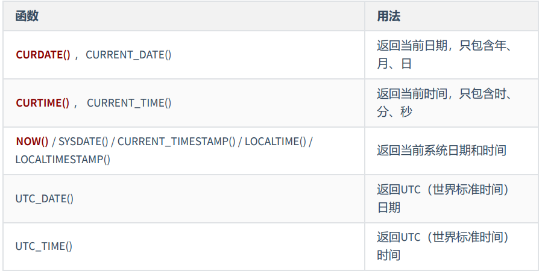

举例：

```sql
SELECT
CURDATE(),CURTIME(),NOW(),SYSDATE()+0,UTC_DATE(),UTC_DATE()+0,UTC_TIME(),UTC_TIME()+0
FROM DUAL;
```


## 4.2 日期与时间戳的转换


举例：

```sql
mysql> SELECT UNIX_TIMESTAMP(now());
+-----------------------+
| UNIX_TIMESTAMP(now()) |
+-----------------------+
| 1576380910 |
+-----------------------+
1 row in set (0.01 sec)

mysql> SELECT UNIX_TIMESTAMP(CURDATE());
+---------------------------+
| UNIX_TIMESTAMP(CURDATE()) |
+---------------------------+
| 1576339200 |
+---------------------------+
1 row in set (0.00 sec)

mysql> SELECT UNIX_TIMESTAMP(CURTIME());
+---------------------------+
| UNIX_TIMESTAMP(CURTIME()) |
+---------------------------+
| 1576380969 |
+---------------------------+
1 row in set (0.00 sec)

mysql> SELECT UNIX_TIMESTAMP('2011-11-11 11:11:11')
+---------------------------------------+
| UNIX_TIMESTAMP('2011-11-11 11:11:11') |
+---------------------------------------+
| 1320981071 |
+---------------------------------------+
1 row in set (0.00 sec)

mysql> SELECT FROM_UNIXTIME(1576380910);
+---------------------------+
| FROM_UNIXTIME(1576380910) |
+---------------------------+
| 2019-12-15 11:35:10 |
+---------------------------+
1 row in set (0.00 sec)
```


## 4.3 获取月份、星期、星期数、天数等函数

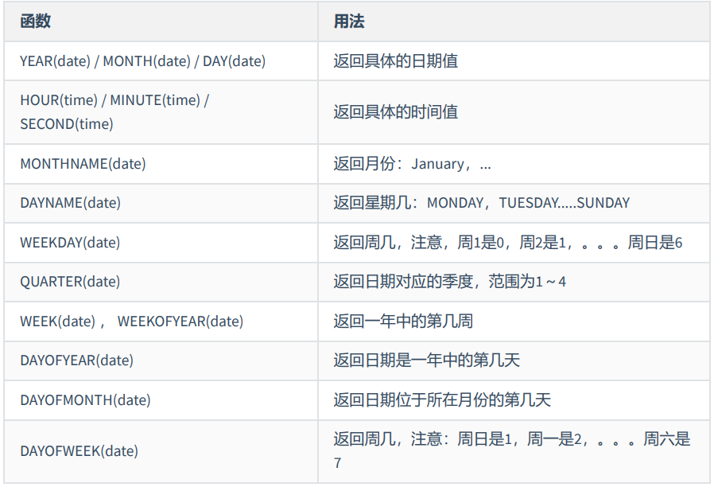

举例：

```sql
SELECT YEAR(CURDATE()),MONTH(CURDATE()),DAY(CURDATE()),
HOUR(CURTIME()),MINUTE(NOW()),SECOND(SYSDATE())
FROM DUAL;
```


```sql
SELECT MONTHNAME('2021-10-26'),DAYNAME('2021-10-26'),WEEKDAY('2021-10-26'),
QUARTER(CURDATE()),WEEK(CURDATE()),DAYOFYEAR(NOW()),
DAYOFMONTH(NOW()),DAYOFWEEK(NOW())
FROM DUAL;
```


## 4.4 日期的操作函数


EXTRACT(type FROM date)函数中type的取值与含义：

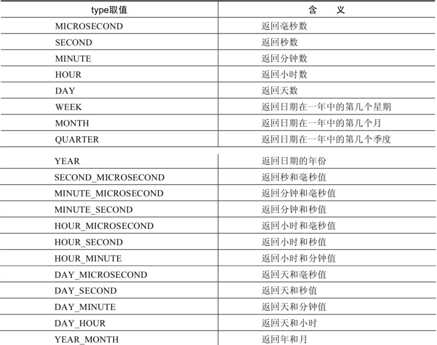

```sql
SELECT EXTRACT(MINUTE FROM NOW()),EXTRACT( WEEK FROM NOW()),
EXTRACT( QUARTER FROM NOW()),EXTRACT( MINUTE_SECOND FROM NOW())
FROM DUAL;
```


## 4.5 时间和秒钟转换的函数


举例：

```sql
mysql> SELECT TIME_TO_SEC(NOW());
+--------------------+
| TIME_TO_SEC(NOW()) |
+--------------------+
| 78774 |
+--------------------+
1 row in set (0.00 sec)
```

```sql
mysql> SELECT SEC_TO_TIME(78774);
+--------------------+
| SEC_TO_TIME(78774) |
+--------------------+
| 21:52:54 |
+--------------------+
1 row in set (0.12 sec)
```


## 4.6 计算日期和时间的函数

第1组：


上述函数中type的取值：

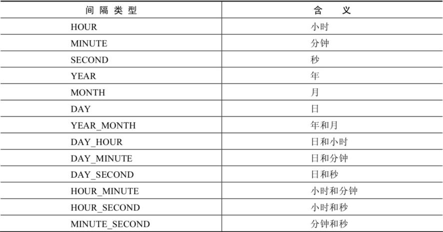

举例：

```sql
SELECT DATE_ADD(NOW(), INTERVAL 1 DAY) AS col1,DATE_ADD('2021-10-21 23:32:12',INTERVAL
1 SECOND) AS col2,
ADDDATE('2021-10-21 23:32:12',INTERVAL 1 SECOND) AS col3,
DATE_ADD('2021-10-21 23:32:12',INTERVAL '1_1' MINUTE_SECOND) AS col4,
DATE_ADD(NOW(), INTERVAL -1 YEAR) AS col5, #可以是负数
DATE_ADD(NOW(), INTERVAL '1_1' YEAR_MONTH) AS col6 #需要单引号
FROM DUAL;
```

```sql
SELECT DATE_SUB('2021-01-21',INTERVAL 31 DAY) AS col1,
SUBDATE('2021-01-21',INTERVAL 31 DAY) AS col2,
DATE_SUB('2021-01-21 02:01:01',INTERVAL '1 1' DAY_HOUR) AS col3
FROM DUAL;
```


第2组：

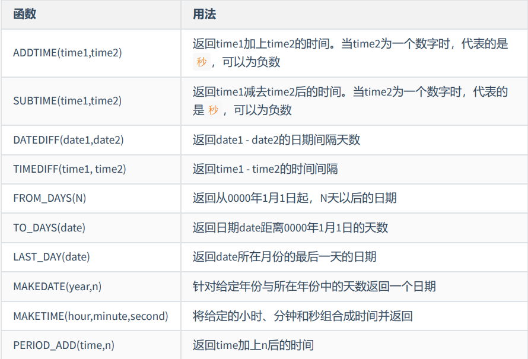

举例：

```sql
SELECT
ADDTIME(NOW(),20),SUBTIME(NOW(),30),SUBTIME(NOW(),'1:1:3'),DATEDIFF(NOW(),'2021-10-
01'),
TIMEDIFF(NOW(),'2021-10-25 22:10:10'),FROM_DAYS(366),TO_DAYS('0000-12-25'),
LAST_DAY(NOW()),MAKEDATE(YEAR(NOW()),12),MAKETIME(10,21,23),PERIOD_ADD(20200101010101,
10)
FROM DUAL;
```

```sql
mysql> SELECT ADDTIME(NOW(), 50);
+---------------------+
| ADDTIME(NOW(), 50) |
+---------------------+
| 2019-12-15 22:17:47 |
+---------------------+
1 row in set (0.00 sec)
```

```sql
mysql> SELECT ADDTIME(NOW(), '1:1:1');
+-------------------------+
| ADDTIME(NOW(), '1:1:1') |
+-------------------------+
| 2019-12-15 23:18:46 |
+-------------------------+
1 row in set (0.00 sec)
```

```sql
mysql> SELECT SUBTIME(NOW(), '1:1:1');
+-------------------------+
| SUBTIME(NOW(), '1:1:1') |
+-------------------------+
| 2019-12-15 21:23:50 |
+-------------------------+
1 row in set (0.00 sec)

mysql> SELECT SUBTIME(NOW(), '-1:-1:-1');
+----------------------------+
| SUBTIME(NOW(), '-1:-1:-1') |
+----------------------------+
| 2019-12-15 22:25:11 |
+----------------------------+
1 row in set, 1 warning (0.00 sec)
```

```sql
mysql> SELECT FROM_DAYS(366);
+----------------+
| FROM_DAYS(366) |
+----------------+
| 0001-01-01 |
+----------------+
1 row in set (0.00 sec)
```

```sql
mysql> SELECT MAKEDATE(2020,1);
+------------------+
| MAKEDATE(2020,1) |
+------------------+
| 2020-01-01 |
+------------------+
1 row in set (0.00 sec)

mysql> SELECT MAKEDATE(2020,32);
+-------------------+
| MAKEDATE(2020,32) |
+-------------------+
| 2020-02-01 |
+-------------------+
1 row in set (0.00 sec)
```

```sql
mysql> SELECT MAKETIME(1,1,1);
+-----------------+
| MAKETIME(1,1,1) |
+-----------------+
| 01:01:01 |
+-----------------+
1 row in set (0.00 sec)
```

```sql
mysql> SELECT PERIOD_ADD(20200101010101,1);
+------------------------------+
| PERIOD_ADD(20200101010101,1) |
+------------------------------+
| 20200101010102 |
+------------------------------+
1 row in set (0.00 sec)
```

```sql
mysql> SELECT TO_DAYS(NOW());
+----------------+
| TO_DAYS(NOW()) |
+----------------+
| 737773 |
+----------------+
1 row in set (0.00 sec)
```

举例：查询 7 天内的新增用户数有多少？

```sql
SELECT COUNT(*) as num FROM new_user WHERE TO_DAYS(NOW())-TO_DAYS(regist_time)<=7
```


## 4.7 日期的格式化与解析


**上述 非GET_FORMAT 函数中fmt参数常用的格式符：**

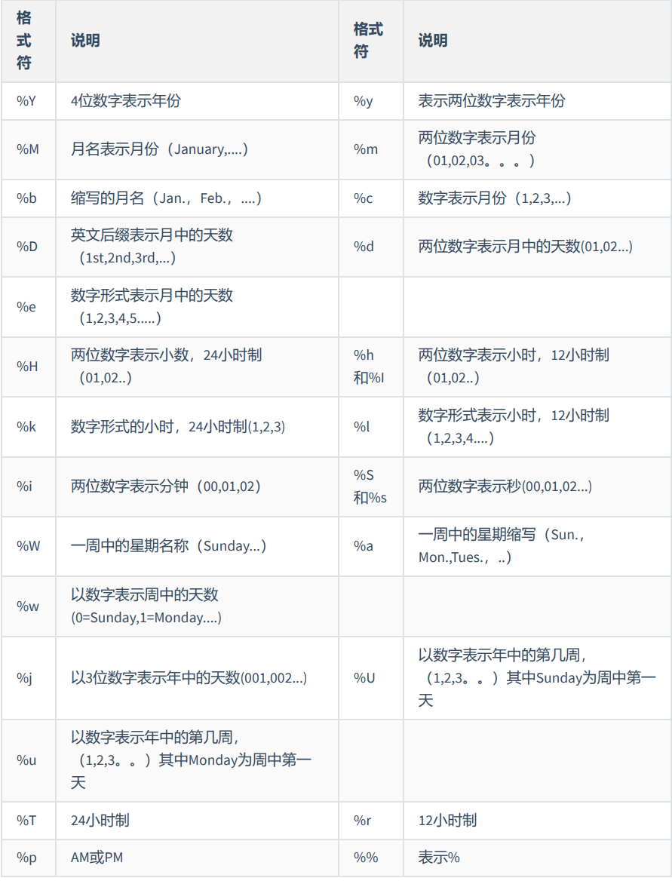

**GET_FORMAT函数中date_type和format_type参数取值如下：**

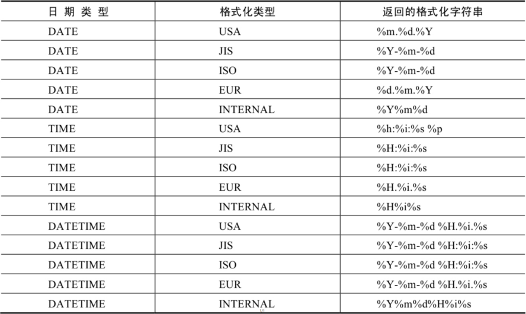

举例：

```sql
mysql> SELECT DATE_FORMAT(NOW(), '%H:%i:%s');
+--------------------------------+
| DATE_FORMAT(NOW(), '%H:%i:%s') |
+--------------------------------+
| 22:57:34 |
+--------------------------------+
1 row in set (0.00 sec)
```

```sql
SELECT STR_TO_DATE('09/01/2009','%m/%d/%Y')
FROM DUAL;
SELECT STR_TO_DATE('20140422154706','%Y%m%d%H%i%s')
FROM DUAL;
SELECT STR_TO_DATE('2014-04-22 15:47:06','%Y-%m-%d %H:%i:%s')
FROM DUAL;
```

```sql
mysql> SELECT GET_FORMAT(DATE, 'USA');
+-------------------------+
| GET_FORMAT(DATE, 'USA') |
+-------------------------+
| %m.%d.%Y |
+-------------------------+
1 row in set (0.00 sec)
SELECT DATE_FORMAT(NOW(),GET_FORMAT(DATE,'USA')),
FROM DUAL;
```

```sql
mysql> SELECT STR_TO_DATE('2020-01-01 00:00:00','%Y-%m-%d');
+-----------------------------------------------+
| STR_TO_DATE('2020-01-01 00:00:00','%Y-%m-%d') |
+-----------------------------------------------+
| 2020-01-01 |
+-----------------------------------------------+
1 row in set, 1 warning (0.00 sec)
```


# 5. 流程控制函数

流程处理函数可以根据不同的条件，执行不同的处理流程，可以在SQL语句中实现不同的条件选择。 MySQL中的流程处理函数主要包括IF()、IFNULL()和CASE()函数。

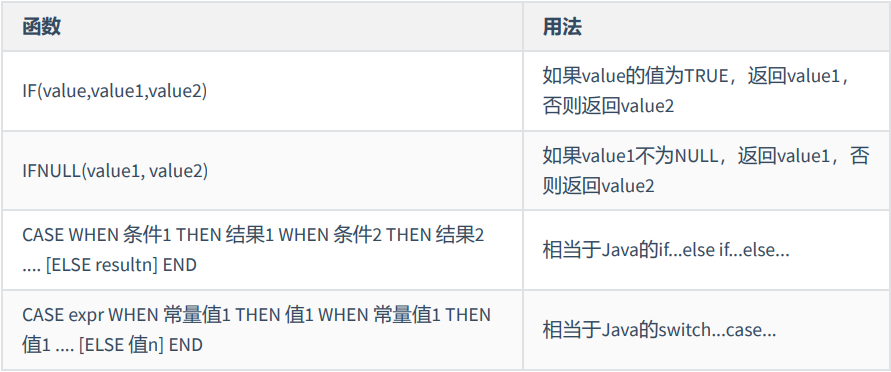

```sql
SELECT IF(1 > 0,'正确','错误')
->正确
```

```sql
SELECT IFNULL(null,'Hello Word')
->Hello Word
```

```sql
SELECT CASE
WHEN 1 > 0
THEN '1 > 0'
WHEN 2 > 0
THEN '2 > 0'
ELSE '3 > 0'
END
->1 > 0
```

```sql
SELECT CASE 1
WHEN 1 THEN '我是1'
WHEN 2 THEN '我是2'
ELSE '你是谁'
```

```sql
SELECT employee_id,salary, CASE WHEN salary>=15000 THEN '高薪'
WHEN salary>=10000 THEN '潜力股'
WHEN salary>=8000 THEN '屌丝'
ELSE '草根' END "描述"
FROM employees;
```

```sql
SELECT oid,`status`, CASE `status` WHEN 1 THEN '未付款'
WHEN 2 THEN '已付款'
WHEN 3 THEN '已发货'
WHEN 4 THEN '确认收货'
ELSE '无效订单' END
FROM t_order;
```

```sql
mysql> SELECT CASE WHEN 1 > 0 THEN 'yes' WHEN 1 <= 0 THEN 'no' ELSE 'unknown' END;
+---------------------------------------------------------------------+
| CASE WHEN 1 > 0 THEN 'yes' WHEN 1 <= 0 THEN 'no' ELSE 'unknown' END |
+---------------------------------------------------------------------+
| yes |
+---------------------------------------------------------------------+
1 row in set (0.00 sec)

mysql> SELECT CASE WHEN 1 < 0 THEN 'yes' WHEN 1 = 0 THEN 'no' ELSE 'unknown' END;
+--------------------------------------------------------------------+
| CASE WHEN 1 < 0 THEN 'yes' WHEN 1 = 0 THEN 'no' ELSE 'unknown' END |
+--------------------------------------------------------------------+
| unknown |
+--------------------------------------------------------------------+
1 row in set (0.00 sec)
```

```sql
mysql> SELECT CASE 1 WHEN 0 THEN 0 WHEN 1 THEN 1 ELSE -1 END;
+------------------------------------------------+
| CASE 1 WHEN 0 THEN 0 WHEN 1 THEN 1 ELSE -1 END |
+------------------------------------------------+
| 1 |
+------------------------------------------------+
1 row in set (0.00 sec)

mysql> SELECT CASE -1 WHEN 0 THEN 0 WHEN 1 THEN 1 ELSE -1 END;
+-------------------------------------------------+
| CASE -1 WHEN 0 THEN 0 WHEN 1 THEN 1 ELSE -1 END |
+-------------------------------------------------+
| -1 |
+-------------------------------------------------+
1 row in set (0.00 sec)
```

```sql
SELECT employee_id,12 * salary * (1 + IFNULL(commission_pct,0))
FROM employees;
```

```sql
SELECT last_name, job_id, salary,
CASE job_id WHEN 'IT_PROG' THEN 1.10*salary
WHEN 'ST_CLERK' THEN 1.15*salary
WHEN 'SA_REP' THEN 1.20*salary
ELSE salary END "REVISED_SALARY"
FROM employees;
```


# 6. 加密与解密函数

加密与解密函数主要用于对数据库中的数据进行加密和解密处理，以防止数据被他人窃取。这些函数在 保证数据库安全时非常有用。

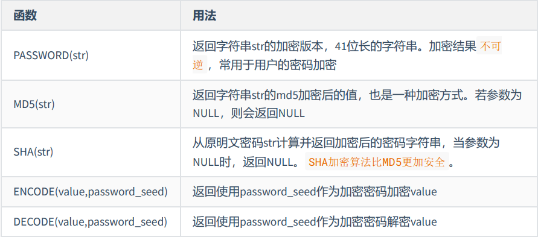

可以看到，ENCODE(value,password_seed)函数与DECODE(value,password_seed)函数互为反函数。

举例：

```sql
mysql> SELECT PASSWORD('mysql'), PASSWORD(NULL);
+-------------------------------------------+----------------+
| PASSWORD('mysql') | PASSWORD(NULL) |
+-------------------------------------------+----------------+
| *E74858DB86EBA20BC33D0AECAE8A8108C56B17FA | |
+-------------------------------------------+----------------+
1 row in set, 1 warning (0.00 sec)
```

```sql
SELECT md5('123')
->202cb962ac59075b964b07152d234b70
```

```sql
SELECT SHA('Tom123')
->c7c506980abc31cc390a2438c90861d0f1216d50
```

```sql
mysql> SELECT ENCODE('mysql', 'mysql');
+--------------------------+
| ENCODE('mysql', 'mysql') |
+--------------------------+
| íg ¼ ìÉ |
+--------------------------+
1 row in set, 1 warning (0.01 sec)
```

```sql
mysql> SELECT DECODE(ENCODE('mysql','mysql'),'mysql');
+-----------------------------------------+
| DECODE(ENCODE('mysql','mysql'),'mysql') |
+-----------------------------------------+
| mysql |
+-----------------------------------------+
1 row in set, 2 warnings (0.00 sec)
```


# 7. MySQL信息函数

MySQL中内置了一些可以查询MySQL信息的函数，这些函数主要用于帮助数据库开发或运维人员更好地 对数据库进行维护工作。

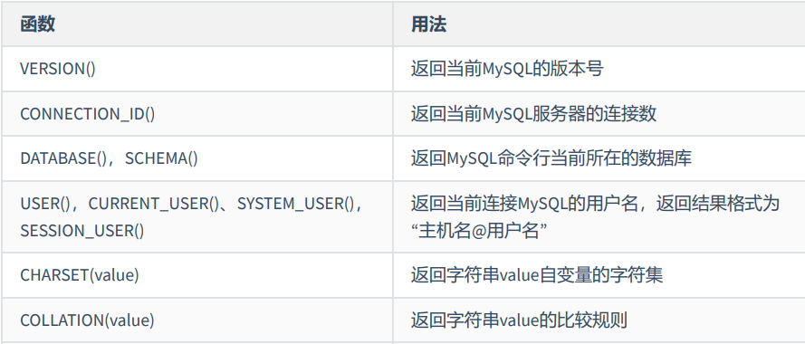

举例：

```sql
mysql> SELECT DATABASE();
+------------+
| DATABASE() |
+------------+
| test |
+------------+
1 row in set (0.00 sec)
mysql> SELECT DATABASE();
+------------+
| DATABASE() |
+------------+
| test |
+------------+
1 row in set (0.00 sec)
```

```sql
mysql> SELECT USER(), CURRENT_USER(), SYSTEM_USER(),SESSION_USER();
+----------------+----------------+----------------+----------------+
| USER() | CURRENT_USER() | SYSTEM_USER() | SESSION_USER() |
+----------------+----------------+----------------+----------------+
| root@localhost | root@localhost | root@localhost | root@localhost |
+----------------+----------------+----------------+----------------+
```

```sql
mysql> SELECT CHARSET('ABC');
+----------------+
| CHARSET('ABC') |
+----------------+
| utf8mb4 |
+----------------+
1 row in set (0.00 sec)
```

```sql
mysql> SELECT COLLATION('ABC');
+--------------------+
| COLLATION('ABC') |
+--------------------+
| utf8mb4_general_ci |
+--------------------+
1 row in set (0.00 sec)
```


# 8. 其他函数

MySQL中有些函数无法对其进行具体的分类，但是这些函数在MySQL的开发和运维过程中也是不容忽视 的。

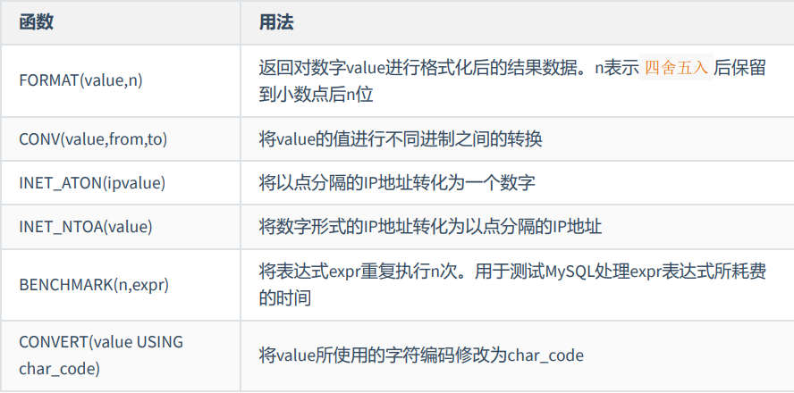

举例：

```sql
# 如果n的值小于或者等于0，则只保留整数部分
mysql> SELECT FORMAT(123.123, 2), FORMAT(123.523, 0), FORMAT(123.123, -2);
+--------------------+--------------------+---------------------+
| FORMAT(123.123, 2) | FORMAT(123.523, 0) | FORMAT(123.123, -2) |
+--------------------+--------------------+---------------------+
| 123.12 | 124 | 123 |
+--------------------+--------------------+---------------------+
1 row in set (0.00 sec)
```

```sql
mysql> SELECT CONV(16, 10, 2), CONV(8888,10,16), CONV(NULL, 10, 2);
+-----------------+------------------+-------------------+
| CONV(16, 10, 2) | CONV(8888,10,16) | CONV(NULL, 10, 2) |
+-----------------+------------------+-------------------+
| 10000 | 22B8 | NULL |
+-----------------+------------------+-------------------+
1 row in set (0.00 sec)
```

```sql
mysql> SELECT INET_ATON('192.168.1.100');
+----------------------------+
| INET_ATON('192.168.1.100') |
+----------------------------+
| 3232235876 |
+----------------------------+
1 row in set (0.00 sec)
# 以“192.168.1.100”为例，计算方式为192乘以256的3次方，加上168乘以256的2次方，加上1乘以256，再加上100。
```

```sql
mysql> SELECT INET_NTOA(3232235876);
+-----------------------+
| INET_NTOA(3232235876) |
+-----------------------+
| 192.168.1.100 |
+-----------------------+
1 row in set (0.00 sec)
```

```sql
mysql> SELECT BENCHMARK(1, MD5('mysql'));
+----------------------------+
| BENCHMARK(1, MD5('mysql')) |
+----------------------------+
| 0 |
+----------------------------+
1 row in set (0.00 sec)
mysql> SELECT BENCHMARK(1000000, MD5('mysql'));
+----------------------------------+
| BENCHMARK(1000000, MD5('mysql')) |
+----------------------------------+
| 0 |
+----------------------------------+
1 row in set (0.20 sec)
```

```sql
mysql> SELECT CHARSET('mysql'), CHARSET(CONVERT('mysql' USING 'utf8'));
+------------------+----------------------------------------+
| CHARSET('mysql') | CHARSET(CONVERT('mysql' USING 'utf8')) |
+------------------+----------------------------------------+
| utf8mb4 | utf8 |
+------------------+----------------------------------------+
1 row in set, 1 warning (0.00 sec)
```

