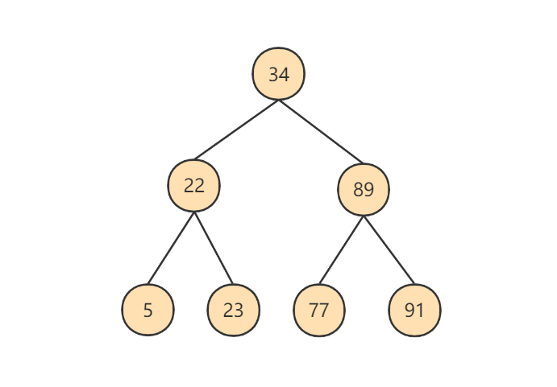
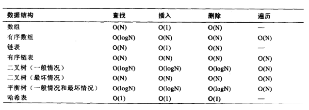

# 1. 为什么使用索引


假如给数据使用 二叉树 这样的数据结构进行存储，如下图所示


# 2. 索引及其优缺点

## 2.1 索引概述

MySQL官方对索引的定义为：索引（Index）是帮助MySQL高效获取数据的数据结构。

索引的本质：索引是数据结构。你可以简单理解为“排好序的快速查找数据结构”，满足特定查找算法。 这些数据结构以某种方式指向数据， 这样就可以在这些数据结构的基础上实现 高级查找算法 。


## 2.2 优点

（1）类似大学图书馆建书目索引，提高数据检索的效率，降低 数据库的IO成本 ，这也是创建索引最主 要的原因。 

（2）通过创建唯一索引，可以保证数据库表中每一行 数据的唯一性 。 

（3）在实现数据的 参考完整性方面，可以 加速表和表之间的连接 。换句话说，对于有依赖关系的子表和父表联合查询时， 可以提高查询速度。 

（4）在使用分组和排序子句进行数据查询时，可以显著 减少查询中分组和排序的时 间 ，降低了CPU的消耗。


## 2.3 缺点

增加索引也有许多不利的方面，主要表现在如下几个方面： 

（1）创建索引和维护索引要 耗费时间 ，并 且随着数据量的增加，所耗费的时间也会增加。 

（2）索引需要占 磁盘空间 ，除了数据表占数据空间之 外，每一个索引还要占一定的物理空间， 存储在磁盘上 ，如果有大量的索引，索引文件就可能比数据文 件更快达到最大文件尺寸。 

（3）虽然索引大大提高了查询速度，同时却会 降低更新表的速度 。当对表 中的数据进行增加、删除和修改的时候，索引也要动态地维护，这样就降低了数据的维护速度。

因此，选择使用索引时，需要综合考虑索引的优点和缺点。


## 3. InnoDB中索引的推演


## 3.1 索引之前的查找

先来看一个精确匹配的例子：

```sql
SELECT [列名列表] FROM 表名 WHERE 列名 = xxx;
```

\1. 在一个页中的查找

\2. 在很多页中查找

在没有索引的情况下，不论是根据主键列或者其他列的值进行查找，由于我们并不能快速的定位到记录 所在的页，所以只能 从第一个页 沿着 双向链表 一直往下找，在每一个页中根据我们上面的查找方式去查 找指定的记录。因为要遍历所有的数据页，所以这种方式显然是 超级耗时 的。如果一个表有一亿条记录 呢？此时 索引 应运而生。


## 3.2 设计索引

建一个表：

```sql
mysql> CREATE TABLE index_demo(
-> c1 INT,
-> c2 INT,
-> c3 CHAR(1),
-> PRIMARY KEY(c1)
-> ) ROW_FORMAT = Compact;
```

这个新建的 index_demo 表中有2个INT类型的列，1个CHAR(1)类型的列，而且我们规定了c1列为主键， 这个表使用 Compact 行格式来实际存储记录的。这里我们简化了index_demo表的行格式示意图：


我们只在示意图里展示记录的这几个部分：

record_type ：记录头信息的一项属性，表示记录的类型， 0 表示普通记录、 2 表示最小记 录、 3 表示最大记录、 1 暂时还没用过，下面讲。

next_record ：记录头信息的一项属性，表示下一条地址相对于本条记录的地址偏移量，我们用 箭头来表明下一条记录是谁。

各个列的值 ：这里只记录在 index_demo 表中的三个列，分别是 c1 、 c2 和 c3 。

其他信息 ：除了上述3种信息以外的所有信息，包括其他隐藏列的值以及记录的额外信息。


将记录格式示意图的其他信息项暂时去掉并把它竖起来的效果就是这样：


把一些记录放到页里的示意图就是：


### 1. 一个简单的索引设计方案

我们在根据某个搜索条件查找一些记录时为什么要遍历所有的数据页呢？因为各个页中的记录并没有规 律，我们并不知道我们的搜索条件匹配哪些页中的记录，所以不得不依次遍历所有的数据页。所以如果 我们 想快速的定位到需要查找的记录在哪些数据页 中该咋办？我们可以为快速定位记录所在的数据页而 建 立一个目录 ，建这个目录必须完成下边这些事：

**下一个数据页中用户记录的主键值必须大于上一个页中用户记录的主键值。**


**给所有的页建立一个目录项。**

所以我们为上边几个页做好的目录就像这样子：


以 页28 为例，它对应 目录项2 ，这个目录项中包含着该页的页号 28 以及该页中用户记录的最小主 键值 5 。我们只需要把几个目录项在物理存储器上连续存储（比如：数组），就可以实现根据主键 值快速查找某条记录的功能了。比如：查找主键值为 20 的记录，具体查找过程分两步：

\1. 先从目录项中根据 二分法 快速确定出主键值为 20 的记录在 目录项3 中（因为 12 < 20 < 209 ），它对应的页是 页9 。

\2. 再根据前边说的在页中查找记录的方式去 页9 中定位具体的记录。

至此，针对数据页做的简易目录就搞定了。这个目录有一个别名，称为 索引 。


### 2. InnoDB中的索引方案

**① 迭代1次：目录项纪录的页**

我们把前边使用到的目录项放到数据页中的样子就是这样：


从图中可以看出来，我们新分配了一个编号为30的页来专门存储目录项记录。这里再次强调 目录项记录 和普通的 用户记录 的**不同点**：

​	目录项记录 的 record_type 值是1，而 普通用户记录 的 record_type 值是0。

​	目录项记录只有 主键值和页的编号 两个列，而普通的用户记录的列是用户自己定义的，可能包含 很 多列 ，另外还有InnoDB自己添加的隐藏列。

​	了解：记录头信息里还有一个叫 min_rec_mask 的属性，只有在存储 目录项记录 的页中的主键值 最小的 目录项记录 的 min_rec_mask 值为 1 ，其他别的记录的 min_rec_mask 值都是 0 。


**相同点**：两者用的是一样的数据页，都会为主键值生成 Page Directory （页目录），从而在按照主键 值进行查找时可以使用 二分法 来加快查询速度。

现在以查找主键为 20 的记录为例，根据某个主键值去查找记录的步骤就可以大致拆分成下边两步：

​	\1. 先到存储 目录项记录 的页，也就是页30中通过 二分法 快速定位到对应目录项，因为 12 < 20 < 209 ，所以定位到对应的记录所在的页就是页9。

​	\2. 再到存储用户记录的页9中根据 二分法 快速定位到主键值为 20 的用户记录。


**② 迭代2次：多个目录项纪录的页**


从图中可以看出，我们插入了一条主键值为320的用户记录之后需要两个新的数据页：

为存储该用户记录而新生成了 页31 。

因为原先存储目录项记录的 页30的容量已满 （我们前边假设只能存储4条目录项记录），所以不得 不需要一个新的 页32 来存放 页31 对应的目录项。


现在因为存储目录项记录的页不止一个，所以如果我们想根据主键值查找一条用户记录大致需要3个步 骤，以查找主键值为 20 的记录为例：

\1. 确定 目录项记录页

​	我们现在的存储目录项记录的页有两个，即 页30 和 页32 ，又因为页30表示的目录项的主键值的 范围是 [1, 320) ，页32表示的目录项的主键值不小于 320 ，所以主键值为 20 的记录对应的目 录项记录在 页30 中。

\2. 通过目录项记录页 确定用户记录真实所在的页

​	在一个存储 目录项记录 的页中通过主键值定位一条目录项记录的方式说过了。	

\3. 在真实存储用户记录的页中定位到具体的记录。


**③ 迭代3次：目录项记录页的目录页**


如图，我们生成了一个存储更高级目录项的 页33 ，这个页中的两条记录分别代表页30和页32，如果用 户记录的主键值在 [1, 320) 之间，则到页30中查找更详细的目录项记录，如果主键值 不小于320 的 话，就到页32中查找更详细的目录项记录。


我们可以用下边这个图来描述它：


这个数据结构，它的名称是 B+树 。


**④ B+Tree**

一个B+树的节点其实可以分成好多层，规定最下边的那层，也就是存放我们用户记录的那层为第 0 层， 之后依次往上加。之前我们做了一个非常极端的假设：存放用户记录的页 最多存放3条记录 ，存放目录项 记录的页 最多存放4条记录 。其实真实环境中一个页存放的记录数量是非常大的，假设所有存放用户记录 的叶子节点代表的数据页可以存放 100条用户记录 ，所有存放目录项记录的内节点代表的数据页可以存 放 1000条目录项记录 ，那么：

如果B+树只有1层，也就是只有1个用于存放用户记录的节点，最多能存放 100 条记录。

如果B+树有2层，最多能存放 1000×100=10,0000 条记录

如果B+树有3层，最多能存放 1000×1000×100=1,0000,0000 条记录。

如果B+树有4层，最多能存放 1000×1000×1000×100=1000,0000,0000 条记录。相当多的记 录！！！

你的表里能存放 100000000000 条记录吗？**所以一般情况下，我们 用到的B+树都不会超过4层 ，那我们 通过主键值去查找某条记录最多只需要做4个页面内的查找（查找3个目录项页和一个用户记录页），又 因为在每个页面内有所谓的 Page Directory （页目录），所以在页面内也可以通过 二分法 实现快速 定位记录。**

**树的层次越低，io次数就越少**


## 3.3 常见索引概念

索引按照物理实现方式，索引可以分为 2 种：聚簇（聚集）和非聚簇（非聚集）索引。我们也把非聚集 索引称为二级索引或者辅助索引。

### 1. 聚簇索引

**特点：**

\1. 使用记录主键值的大小进行记录和页的排序，这包括三个方面的含义：

​	页内 的记录是按照主键的大小顺序排成一个 单向链表 。

​	各个存放 用户记录的页 也是根据页中用户记录的主键大小顺序排成一个 双向链表 。

​	存放 目录项记录的页 分为不同的层次，在同一层次中的页也是根据页中目录项记录的主键 大小顺序排成一个 双向链表 。

\2. B+树的 叶子节点 存储的是完整的用户记录。

​	所谓完整的用户记录，就是指这个记录中存储了所有列的值（包括隐藏列）。


优点：

数据访问更快 ，因为聚簇索引将索引和数据保存在同一个B+树中，因此从聚簇索引中获取数据比非 聚簇索引更快

聚簇索引对于主键的 排序查找 和 范围查找 速度非常快

按照聚簇索引排列顺序，查询显示一定范围数据的时候，由于数据都是紧密相连，数据库不用从多 个数据块中提取数据，所以 节省了大量的io操作 。


缺点：

插入速度严重依赖于插入顺序 ，按照主键的顺序插入是最快的方式，否则将会出现页分裂，严重影 响性能。因此，对于InnoDB表，我们一般都会定义一个**自增的ID列为主键**

更新主键的代价很高 ，因为将会导致被更新的行移动。因此，对于InnoDB表，我们一般定义主**键为 不可更新**

二级索引访问需要两次索引查找 ，第一次找到主键值，第二次根据主键值找到行数据


### 2. 二级索引（辅助索引、非聚簇索引）


概念：回表 我们根据这个以c2列大小排序的B+树只能确定我们要查找记录的主键值，所以如果我们想根 据c2列的值查找到完整的用户记录的话，仍然需要到 聚簇索引 中再查一遍，这个过程称为 回表 。也就 是根据c2列的值查询一条完整的用户记录需要使用到 2 棵B+树！


问题：为什么我们还需要一次 回表 操作呢？直接把完整的用户记录放到叶子节点不OK吗？


小结:聚簇索引与非聚簇索引的原理不同，在使用.上也有一-些区别:

1.聚簇索引的叶子节点存储的就是我们的数据记录，非聚簇索引的叶子节点存储的是数据位置。非聚簇索引不会影响数据表的物理存储顺序。

2.一个表只能有一个聚簇索引，因为只能有- -种排序存储的方式，但可以有多个非聚簇索引，也就是多个索引目录提供数据检索。

3.使用聚簇索引的时候，数据的查询效率高，但如果对数据进行插入，删除，更新等操作,效率会比非聚簇索
引低。


### 3. 联合索引

我们也可以同时以多个列的大小作为排序规则，也就是同时为多个列建立索引，比方说我们想让B+树按 照 c2和c3列 的大小进行排序，这个包含两层含义：

先把各个记录和页按照c2列进行排序。

在记录的c2列相同的情况下，采用c3列进行排序

注意一点，以c2和c3列的大小为排序规则建立的B+树称为 联合索引 ，本质上也是一个二级索引。它的意 思与分别为c2和c3列分别建立索引的表述是不同的，不同点如下：

​	建立 联合索引 只会建立如上图一样的1棵B+树。

​	为c2和c3列分别建立索引会分别以c2和c3列的大小为排序规则建立2棵B+树。


## 3.4 InnoDB的B+树索引的注意事项


### 1. 根页面位置万年不动

### 2. 内节点中目录项记录的唯一性

### 3. 一个页面最少存储2条记录


# 4. MyISAM中的索引方案

**B树索引适用存储引擎如表所示：**


即使多个存储引擎支持同一种类型的索引，但是他们的实现原理也是不同的。Innodb和MyISAM默认的索 引是Btree索引；而Memory默认的索引是Hash索引。

MyISAM引擎使用 B+Tree 作为索引结构，叶子节点的data域存放的是 数据记录的地址 。


**注意：** 在MySQL中，B 树实际上还是B+树。但是在选择谈到选择MySQL的数据结构时，这两者就区别大了


## 4.1 MyISAM 索引的原理


## 4.2 MyISAM 与 InnoDB 对比


**MyISAM 的索引方式都是“非聚簇”的，与 InnoDB 包含 1 个聚簇索引是不同的**


**两种引擎中索引的区别：**

1. 在 InnoDB 存储引擎中，我们只需要根据主键值对 聚簇索引 进行一次查找就能找到对应的记录，而在 MyISAM 中却需要进行一次 回表 操作，意味着 MyISAM 中建立的索引相当于全部都是 二级索引 。（MyISAM的回表就是根据地址到data表中查找数据）

2. InnoDB 的数据文件本身就是索引文件，而 MyISAM 索引文件和数据文件是 分离的 ，索引文件仅保存数据记录的地址。

3. InnoDB 的非聚簇索引 data 域存储相应记录 主键的值 ，而 MyISAM 索引记录的是 地址 。换句话说， InnoDB 的所有非聚簇索引都引用主键作为 data 域。

4. MyISAM 的回表操作是十分 快速 的，因为是拿着地址偏移量直接到文件中取数据的，反观 InnoDB 是通过获取主键之后再去聚簇索引里找记录，虽然说也不慢，但还是比不上直接用地址去访问。

5. InnoDB 要求表 必须有主键 ( MyISAM 可以没有 )。如果没有显式指定，则 MySQL 系统会自动选择一个可以非空且唯一标识数据记录的列作为主键。如果不存在这种列，则 MySQL 自动为 InnoDB 表生成一个隐含字段作为主键，这个字段长度为 6 个字节，类型为长整型。

6. InnoDB的主键是为了生成聚簇索引，所以必须有；MyISAM 中的索引都是非聚簇的，数据和索引分离，所以对MyISAM没有要求。但是为了查询方便，还是建议指定某一字段为主键，从而方便存储引擎为其构建索引，提升查询效率。
   


# 5. 索引的代价

索引是个好东西，可不能乱建，它在空间和时间上都会有消耗：

- **空间上的代价**

  每建立一个索引都要为它建立一棵 B+ 树，每一棵 B+ 树的每一个节点都是一个数据页，一个页默认会占用 16KB 的存储空间，一棵很大的 B+ 树由许多数据页组成，那就是很大的一片存储空间。

**时间上的代价**

​			每次对表中的数据进行 增、删、改操作时，都需要去修改各个 B+ 树索引。而且我们讲过，B+ 树每层节点都是按照索引列的值 从小到大的顺序排序 而组成了 双向链表 。不论是叶子节点中的记录，还是内节点中的记录（也就是不论是用户记录还是目录项记录）都是按照索引列的值从小到大的顺序而形成了一个单向链表。而增、删、改操作可能会对节点和记录的排序造成破坏，所以存储引擎需要额外的时间进行一些 记录移位 ， 页面分裂 、 页面回收 等操作来维护好节点和记录的排序。如果我们建了许多索引，每个索引对应的 B+ 树都要进行相关的维护操作，会给性能拖后腿。


一个表上索引建的越多，就会占用越多的存储空间，在增删改记录的时候性能就越差。为了建立又好又少的索引，我们得学学这些索引在哪些条件下起作用的。


# 6. MySQL 数据结构选择的合理性


## 6.1 全表遍历

加载所有页到内存，进行遍历查找，非常耗时，性能极差


## 6.2 Hash 结构


上图中哈希函数 h 有可能将两个不同的关键字映射到相同的位置，这叫做 `碰撞` ，在数据库中一般采用`链接法` 来解决。在链接法中，将散列到同一槽位的元素放在一个链表中，如下图所示：


**Hash 结构效率高，那为什么索引结构要设计成树型呢？**


**Hash 索引适用存储引擎如表所示：**

| **索引** / **存储引擎** | MyISAM | InnoDB | Memory |
| ----------------------- | ------ | ------ | ------ |
| HASH 索引               | 不支持 | 不支持 | `支持` |


**Hash索引的适用性**


采用自适应 Hash 索引目的是方便根据 SQL 的查询条件加速定位到叶子节点，特别是当 B+ 树比较深的时候，通过自适应 Hash 索引可以明显提高数据的检索效率。

我们可以通过 `innodb_adaptive_hash_index` 变量来查看是否开启了自适应 Hash，比如：

```sql
mysql> show variables like '%adaptive_hash_index';
```


## 6.3 二叉搜索树




创造出来的二分搜索树如下图所示：


## 6.4 AVL 树


你能看到此时树的高度降低了，当数据量N大的时候，以及树的分叉数M大的时候，M叉树的高度会远小于二叉树的高度(M>2)。所以，我们需要把树`从“瘦高"变"矮胖”`。


## 6.5 B-Tree

B树的英文是Balance Tree,也就是多路平衡查找树。简写为B-Tree (注意横杠表示这两个单词连起来的意思，不是减号)。它的高度远小于平衡二叉树的高度。

B 树的结构如下图所示：


一个 M 阶的 B 树（M>2）有以下的特性：

1. 根节点的儿子数的范围是 [2,M]。

2. 每个中间节点包含 k-1 个关键字和 k 个孩子，孩子的数量 = 关键字的数量 +1，k 的取值范围为 [ceil（M / 2）, M]。

3. 叶子节点包括 k-1 个关键字（叶子节点没有孩子），k 的取值范围为 [ceil（M / 2）, M]。

4. 假设中间节点节点的关键字为：Key[1]，Key[2]，…，Key[k-1]，且关键字按照升序排序，即 Key[i] < Key[i+1]。此时 k-1 个关键字相当于划分了 k 个范围，也就是对应着 k 个指针，即为：P[1]，P[2]，…，P[k]，其中 P[1] 指向关键字小于 Key[1] 的子树，P[i] 指向关键字属于 (Key[i-1], Key[i]）的子树，P[k] 指向关键字大于 Key[k-1] 的子树。

5. 所有叶子节点位于同一层。
   

上面那张图所表示的 B 树就是一棵 3 阶的 B 树。我们可以看下磁盘块 2，里面的关键字为（8，12），它 有 3 个孩子 (3，5)，(9，10) 和 (13，15)，你能看到 (3，5) 小于 8，(9，10) 在 8 和 12 之间，而 (13，15) 大于 12，刚好符合刚才我们给出的特征。


然后我们来看下如何用 B 树进行查找。假设我们想要 `查找的关键字是 9`，那么步骤可以分为以下几步：

1. 我们与根节点的关键字 (17，35)进行比较，9 小于 17 那么得到指针 P1;
2. 按照指针 P1 找到磁盘块 2，关键字为（8，12)，因为 9 在 8 和 12 之间，所以我们得到指针 P2;
3. 按照指针 P2 找到磁盘块 6，关键字为（9，10)，然后我们找到了关键字 9。

你能看出来在 B 树的搜索过程中，我们比较的次数并不少，但如果把数据读取出来然后在内存中进行比较，这个时间就是可以忽略不计的。而读取磁盘块本身需要进行 I/O 操作，消耗的时间比在内存中进行比较所需要的时间要多，是数据查找用时的重要因素。B 树相比平衡二叉树来说磁盘 I/O 操作更少， 在数据查询中比平衡二叉树效率要高。所以只要树的高度足够低，IO 次数足够少，就可以提高查询性能 。


**小结**

1. B树在插入和删除节点的时候如果导致树不平衡，就通过自动调整节点的位置来保持树的自平衡。
2. 关键字集合分布在整棵树中，即叶子节点和非叶子节点都存放数据。搜索有可能在非叶子节点结束
3. 其搜索性能等价于在关键字全集内做一次二分查找。


**再举例 1：**


**注意：**叶子节点和非叶子节点都存放数据。我们要查找C1:8，通过比较在磁盘块2中有对应的，那么数据就存在磁盘块2中


## 6.6 B+Tree

B+树也是一种多路搜索树，`基于B树做出了改进`，主流的DBMS都支持B+树的索引方式,比如MySQL。相比于B-Tree，B+Tree适合文件索引 系统。

- MySQL 官网说明：


**B+ 树和 B 树的差异：**

1. 有 k 个孩子的节点就有 k 个关键字。也就是孩子数量 = 关键字数，而 B 树中，孩子数量 = 关键字数 +1。

2. 非叶子节点的关键字也会同时存在在子节点中，并且是在子节点中所有关键字的最大（或最小)。

3. 非叶子节点仅用于索引，不保存数据记录，跟记录有关的信息都放在叶子节点中。而 B 树中，非叶子节点既保存索引，也保存数据记录 。

4. 所有关键字都在叶子节点出现，叶子节点构成一个有序链表，而且叶子节点本身按照关键字的大小从小到大顺序链接。而B树中，叶子节点组成的链表是不完整的，还包含目录页中的数据
   

下图就是一棵B+树，阶数为3，根节点中的关键字1、18、 35分别是子节点(1, 8，14) ，(18, 24, 31)和(35， 41， 53) 中的最小值。每一层父节点的关键字都会出现在下一层的子节点的关键字中，因此在叶子节点中包括了所有的关键字信息，并且每一个叶子节点都有一个指向下一个节点的指针，这样就形成了一个链表。


B 树和 B+ 树都可以作为索引的数据结构，在 MySQL 中采用的是 B+ 树。

但 B 树和 B+ 树各有自己的应用场景，不能说 B+ 树完全比 B 树好，反之亦然。


## 6.7 R 树

R-Tree 在 MySQL 很少使用，仅支持 geometry 数据类型 ，支持该类型的存储引擎只有 myisam、bdb、 innodb、ndb、archive 几种。举个 R 树在现实领域中能够解决的例子：查找 20 英里以内所有的餐厅。如果没有 R 树你会怎么解决？一般情况下我们会把餐厅的坐标（x,y）分为两个字段存放在数据库中，一个字段记录经度，另一个字段记录纬度。这样的话我们就需要遍历所有的餐厅获取其位置信息，然后计算是否满足要求。如果一个地区有 100 家餐厅的话，我们就要进行 100 次位置计算操作了，如果应用到谷歌、百度地图这种超大数据库中，这种方法便必定不可行了。R 树就很好的 解决了这种高维空间搜索问题。它把 B 树的思想很好的扩展到了多维空间，采用了 B 树分割空间的思想，并在添加、删除操作时采用合并、分解结点的方法，保证树的平衡性。因此，R 树就是一棵用来 存储高维数据的平衡树 。相对于 B-Tree，R-Tree 的优势在于范围查找。


| **索引** / **存储引擎** | MyISAM | InnoDB | Memory   |
| ----------------------- | ------ | ------ | -------- |
| R-Tree 索引             | 支持   | 支持   | `不支持` |


## 6.8 小结


面试中常考点：B+树和B-树的区别、B+树和Hash的区别


## 6.9 附录：算法的时间复杂度

同一问题可用不同算法解决，而一个算法的质量优劣将影响到算法乃至程序的效率。算法分析的目的在于选择合适算法和改进算法。

