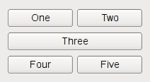

# Python Qt 简介

## Python图形界面开发的几种方案

前面的教程中，我们程序的用户交互界面都是命令行终端窗口。

程序的用户交互界面，英文称之为 UI (user interface)

当一个应用的 UI 比较复杂的时候，命令行方式就不便用户使用了，这时我们需要图形界面。

如果用 `Python` 语言开发 `跨平台` 的图形界面的程序，主要有3种选择：

- Tkinter

  基于Tk的Python库，这是Python官方采用的标准库，优点是作为Python标准库、稳定、发布程序较小，缺点是控件相对较少。

- wxPython

  基于wxWidgets的Python库，优点是控件比较丰富，缺点是稳定性相对差点、文档少、用户少。

- PySide2/PySide6、PyQt5/PyQt6

  基于Qt 的Python库，优点是控件比较丰富、跨平台体验好、文档完善、用户多。

  缺点是 库比较大，发布出来的程序比较大。

---

白月黑羽的建议是，如果大家要开发小工具，界面比较简单，可以采用Tkinter。

如果是发布功能比较多的正式产品，采用 基于Qt的 PySide2/PySide6、PyQt5/PyQt6

本教程介绍的就是 使用 PySide2、PyQt5 开发Python程序的图形界面。


## PySide2、PyQt5 简介

PySide2、PyQt5 都是基于著名的 Qt 库。

Qt库里面有非常强大的图形界面开发库，但是Qt库是C++语言开发的，PySide2、PyQt5可以让我们通过Python语言使用Qt。

但是 PySide2、PyQt5 这两者有什么区别呢？

可以形象地这样说： PySide2 是Qt的 `亲儿子` ， PyQt5 是Qt还没有亲儿子之前的收的 `义子` （Riverbank Computing这个公司开发的）。

那为什么 PyQt5 这个义子 反而比 PySide2 这个亲儿子更出名呢？

原因很简单：PySide2 这亲儿子最近（2018年7月）才出生。

但是亲儿子毕竟是亲儿子，Qt准备大力培养，PySide2 或许更有前途。

已经在使用 PyQt5 的朋友不要皱眉， 两个库的使用 对程序员来说，差别很小：它们的调用接口几乎一模一样。

如果你的程序是PyQt5开发的，通常只要略作修改，比如把导入的名字从 PyQt5 换成 PySide2 就行了。反之亦然。


## 安装 PySide2 PySide6

很简单，直接执行

```py
pip install pyside2
```

或者

```py
pip install pyside6
```

即可下载安装。

这个库比较大，大概有100M左右，大家耐心等待。

有的朋友，网络比较慢，可以指定国内的安装源，下载安装。

比如，使用豆瓣源下载安装：

```
pip install pyside2 -i https://pypi.douban.com/simple/
```


## 安装 PyQt5 PyQt6

如果你选择PyQt5，直接执行

```py
pip install pyqt5-tools
```

即可同时安装 PyQt5 和 一些重要的工具，比如 Qt designer。


# 一个案例

## 从一个示例开始

[点击这里，边看视频讲解，边学习以下内容](https://www.bilibili.com/video/BV1cJ411R7bP?p=2)

现在我们要开发一个程序，让用户输入一段文本包含：员工姓名、薪资、年龄。

格式如下：

```
薛蟠     4560 25
薛蝌     4460 25
薛宝钗   35776 23
薛宝琴   14346 18
王夫人   43360 45
王熙凤   24460 25
王子腾   55660 45
王仁     15034 65
尤二姐   5324 24
贾芹     5663 25
贾兰     13443 35
贾芸     4522 25
尤三姐   5905 22
贾珍     54603 35
```

该程序可以把薪资在 2万 以上、以下的人员名单分别打印出来。

当然我们可以像以前一样，开发命令行程序（准确的说应该叫字符终端程序，因为UI是字符终端），让用户在字符终端输入。

但是如果我们能开发下面这样的图形界面程序，就更酷了


能吗？

能，用 Python Qt，开发上面的界面就只要下面这短短的程序即可

```python
from PySide2.QtWidgets import QApplication, QMainWindow, QPushButton,  QPlainTextEdit

app = QApplication([])

window = QMainWindow()
window.resize(500, 400)
window.move(300, 310)
window.setWindowTitle('薪资统计')

textEdit = QPlainTextEdit(window)
textEdit.setPlaceholderText("请输入薪资表")
textEdit.move(10,25)
textEdit.resize(300,350)

button = QPushButton('统计', window)
button.move(380,80)

window.show()

app.exec_()
```

大家可以运行一下看看。

`QApplication` 提供了整个图形界面程序的底层管理功能，比如：

初始化、程序入口参数的处理，用户事件（对界面的点击、输入、拖拽）分发给各个对应的控件，等等…

对 QApplication 细节比较感兴趣的话，可以[点击这里参考官方网站](https://doc.qt.io/qt-5/qapplication.html)

既然QApplication要做如此重要的初始化操作，所以，我们必须在任何界面控件对象创建前，先创建它。


QMainWindow、QPlainTextEdit、QPushButton 是3个控件类，分别对应界面的主窗口、文本框、按钮

他们都是控件基类对象QWidget的子类。

要在界面上 `创建一个控件` ，就需要在程序代码中 `创建` 这个 `控件对应类` 的一个 `实例对象`。


在 Qt 系统中，控件（widget）是 `层层嵌套` 的，除了最顶层的控件，其他的控件都有父控件。

QPlainTextEdit、QPushButton 实例化时，都有一个参数window，如下

```python
QPlainTextEdit(window)
QPushButton('统计', window)
```

就是指定它的父控件对象 是 window 对应的QMainWindow 主窗口。

而 实例化 QMainWindow 主窗口时，却没有指定 父控件， 因为它就是最上层的控件了。


控件对象的 move 方法决定了这个控件显示的位置。

比如

`window.move(300, 310)` 就决定了 主窗口的 左上角坐标在 `相对屏幕的左上角` 的X横坐标300像素, Y纵坐标310像素这个位置。

`textEdit.move(10,25)` 就决定了文本框的 左上角坐标在 `相对父窗口的左上角` 的X横坐标10像素, Y纵坐标25像素这个位置。


控件对象的 resize 方法决定了这个控件显示的大小。

比如

`window.resize(500, 400)` 就决定了 主窗口的 宽度为500像素，高度为400像素。

`textEdit.resize(300,350)` 就决定了文本框的 宽度为300像素，高度为350像素。


放在主窗口的控件，要能全部显示在界面上， 必须加上下面这行代码

```python
window.show()
```


最后 ，通过下面这行代码

```py
app.exec_()
```


进入QApplication的事件处理循环，接收用户的输入事件（），并且分配给相应的对象去处理。


## 界面动作处理 (signal 和 slot)

接下来，我们要实现具体的统计功能：

当用户点击 **统计** 按钮时， 从界面控件 QPlainTextEdit 里面获取 用户输入的字符串内容，进行处理。

首先第一个问题： 用户点击了 **统计** 按钮，怎么通知程序？ 因为只有程序被通知了这个点击，才能做出相应的处理。

在 Qt 系统中， 当界面上一个控件被操作时，比如 被点击、被输入文本、被鼠标拖拽等， 就会发出 `信号` ，英文叫 `signal` 。就是表明一个事件（比如被点击、被输入文本）发生了。

我们可以预先在代码中指定 处理这个 signal 的函数，这个处理 signal 的函数 叫做 `slot` 。

比如，我们可以像下面这样定义一个函数

```py
def handleCalc():
    print('统计按钮被点击了')
```

然后， 指定 如果 发生了button 按钮被点击 的事情，需要让 `handleCalc` 来处理，像这样

```python
button.clicked.connect(handleCalc)
```

用QT的术语来解释上面这行代码，就是：把 button 被 点击（clicked） 的信号（signal）， 连接（connect）到了 handleCalc 这样的一个 slot上

大白话就是：让 handleCalc 来 处理 button 被 点击的操作。


但是上面这行代码运行后，只能在字符窗口 打印出 `统计按钮被点击了` ， 还不能处理分析任务。

要处理分析任务，我们还得从 textEdit 对应的 文本框中 获取用户输入的文本，并且分析薪资范围，最终弹出对话框显示统计结果。

我们修改后，代码如下

```py
from PySide2.QtWidgets import QApplication, QMainWindow, QPushButton,  QPlainTextEdit,QMessageBox

def handleCalc():
    info = textEdit.toPlainText()

    # 薪资20000 以上 和 以下 的人员名单
    salary_above_20k = ''
    salary_below_20k = ''
    for line in info.splitlines():
        if not line.strip():
            continue
        parts = line.split(' ')
        # 去掉列表中的空字符串内容
        parts = [p for p in parts if p]
        name,salary,age = parts
        if int(salary) >= 20000:
            salary_above_20k += name + '\n'
        else:
            salary_below_20k += name + '\n'

    QMessageBox.about(window,
                '统计结果',
                f'''薪资20000 以上的有：\n{salary_above_20k}
                \n薪资20000 以下的有：\n{salary_below_20k}'''
                )

app = QApplication([])

window = QMainWindow()
window.resize(500, 400)
window.move(300, 300)
window.setWindowTitle('薪资统计')

textEdit = QPlainTextEdit(window)
textEdit.setPlaceholderText("请输入薪资表")
textEdit.move(10,25)
textEdit.resize(300,350)

button = QPushButton('统计', window)
button.move(380,80)
button.clicked.connect(handleCalc)

window.show()

app.exec_()
```

运行后，你会发现结果如下


## 封装到类中

上面的代码把控件对应的变量名全部作为全局变量。

如果要设计稍微复杂一些的程序，就会出现太多的控件对应的变量名。

而且这样也不利于 代码的模块化。

所以，我们通常应该把 一个窗口和其包含的控件，对应的代码 全部封装到类中，如下所示

```py
from PySide2.QtWidgets import QApplication, QMainWindow, QPushButton,  QPlainTextEdit,QMessageBox

class Stats():
    def __init__(self):
        self.window = QMainWindow()
        self.window.resize(500, 400)
        self.window.move(300, 300)
        self.window.setWindowTitle('薪资统计')

        self.textEdit = QPlainTextEdit(self.window)
        self.textEdit.setPlaceholderText("请输入薪资表")
        self.textEdit.move(10, 25)
        self.textEdit.resize(300, 350)

        self.button = QPushButton('统计', self.window)
        self.button.move(380, 80)

        self.button.clicked.connect(self.handleCalc)


    def handleCalc(self):
        info = self.textEdit.toPlainText()

        # 薪资20000 以上 和 以下 的人员名单
        salary_above_20k = ''
        salary_below_20k = ''
        for line in info.splitlines():
            if not line.strip():
                continue
            parts = line.split(' ')
            # 去掉列表中的空字符串内容
            parts = [p for p in parts if p]
            name,salary,age = parts
            if int(salary) >= 20000:
                salary_above_20k += name + '\n'
            else:
                salary_below_20k += name + '\n'

        QMessageBox.about(self.window,
                    '统计结果',
                    f'''薪资20000 以上的有：\n{salary_above_20k}
                    \n薪资20000 以下的有：\n{salary_below_20k}'''
                    )

app = QApplication([])
stats = Stats()
stats.window.show()
app.exec_()
```

这样代码的可读性是不是好多了？


## 常见问题

不少学员发现， 运行python qt程序时，弹出错误提示框，显示如下提示信息

```py
This application failed to start because no Qt platform plugin could be 
initialized. Reinstalling the application may fix this problem.
```

解决方法是：

把 PySide2 或者 PyQt5 安装在解释器目录下的 `\plugins\platforms` 目录添加到环境变量Path中。

比如，我的环境就是把这个路径加到 环境变量 `Path` 中

```py
c:\Python38\Lib\site-packages\PySide2\plugins\platforms
```

另外有这种说法：

如果使用的 Python 解释器 是 Anaconda/Miniconda里面的，请把 `\plugins\platforms` 目录添加到环境变量 `QT_QPA_PLATFORM_PLUGIN_PATH` 中。


# 界面设计和布局


## Qt Designer 简介

QT程序界面的 一个个窗口、控件，就是像上面那样用相应的代码创建出来的。

但是，把你的脑海里的界面，用代码直接写出来，是有些困难的。

很多时候，运行时呈现的样子，不是我们要的。我们经常还要修改代码调整界面上控件的位置，再运行预览。反复多次这样操作。

可是这样，真的…太麻烦了。

其实，我们可以用QT界面生成器 `Qt Designer` ，拖拖拽拽就可以直观的创建出程序大体的界面。

怎么运行这个工具呢？

Windows下，运行 Python安装目录下 `Scripts\pyside2-designer.exe` 这个可执行文件


如果你安装的是pyqt5， 运行 Python安装目录下 `Scripts\pyqt5designer.exe` 这个可执行文件


根据上面链接的视频讲解，大家初步了解一下 Qt Designer 的使用方法。


通过 Qt Designer 设计的界面，最终是保存在一个ui文件中的。

大家可以打开这个ui文件看看，就是一个XML格式的界面定义。


## 动态加载UI文件

有了界面定义文件，我们的Python程序就可以从文件中加载UI定义，并且动态 创建一个相应的窗口对象。

如下：

```py
from PySide2.QtWidgets import QApplication, QMessageBox
from PySide2.QtUiTools import QUiLoader

class Stats:

    def __init__(self):
        # 从文件中加载UI定义

        # 从 UI 定义中动态 创建一个相应的窗口对象
        # 注意：里面的控件对象也成为窗口对象的属性了
        # 比如 self.ui.button , self.ui.textEdit
        self.ui = QUiLoader().load('main.ui')

        self.ui.button.clicked.connect(self.handleCalc)

    def handleCalc(self):
        info = self.ui.textEdit.toPlainText()

        salary_above_20k = ''
        salary_below_20k = ''
        for line in info.splitlines():
            if not line.strip():
                continue
            parts = line.split(' ')

            parts = [p for p in parts if p]
            name,salary,age = parts
            if int(salary) >= 20000:
                salary_above_20k += name + '\n'
            else:
                salary_below_20k += name + '\n'

        QMessageBox.about(self.ui,
                    '统计结果',
                    f'''薪资20000 以上的有：\n{salary_above_20k}
                    \n薪资20000 以下的有：\n{salary_below_20k}'''
                    )

app = QApplication([])
stats = Stats()
stats.ui.show()
app.exec_()
```

如果你使用的是PyQt5 而不是 PySide2，加载UI文件的代码如下

```py
from PyQt5 import uic

class Stats:

    def __init__(self):
        # 从文件中加载UI定义
        self.ui = uic.loadUi("main.ui")
```


## 转化UI文件为Python代码

还有一种使用UI文件的方式：先把UI文件直接转化为包含界面定义的Python代码文件，然后在你的程序中使用定义界面的类

1. 执行如下的命令 把UI文件直接转化为包含界面定义的Python代码文件

```
pyside2-uic main.ui > ui_main.py
```


如果你安装的是PyQt5，执行如下格式的命令转化

```py
pyuic5 main.ui > ui_main.py
```

然后在你的代码文件中这样使用定义界面的类

```py
from PySide2.QtWidgets import QApplication,QMainWindow
from ui_main import Ui_MainWindow

# 注意 这里选择的父类 要和你UI文件窗体一样的类型
# 主窗口是 QMainWindow， 表单是 QWidget， 对话框是 QDialog
class MainWindow(QMainWindow):

    def __init__(self):
        super().__init__()
        # 使用ui文件导入定义界面类
        self.ui = Ui_MainWindow()
        # 初始化界面
        self.ui.setupUi(self)

        # 使用界面定义的控件，也是从ui里面访问
        self.ui.webview.load('http://www.baidu.com')

app = QApplication([])
mainw = MainWindow()
mainw.show()
app.exec_()
```

那么我们该使用哪种方式比较好呢？动态加载还是转化为Python代码？

白月黑羽建议：通常采用动态加载比较方便，因为改动界面后，不需要转化，直接运行，特别方便。

但是，如果 你的程序里面有非qt designer提供的控件， 这时候，需要在代码里面加上一些额外的声明，而且 可能还会有奇怪的问题。往往就 要采用 转化Python代码的方法。


## 一个练习

请大家利用Qt Designer 实现一个 类似 `Postman` 的 HTTP 接口测试工具。

界面如下


要实现的功能，[点击这里观看视频说明](https://www.bilibili.com/video/BV1cJ411R7bP?p=6)

这个界面里面用到了常见的几个控件：按钮，单行文本框，多行文本框，组合选择框，表格。

其中 选择框、表格 这两个控件 没有接触过的朋友，可以先学习一下本教程 后面章节 `常见控件2` 。

如果你对 使用Python语言发送HTTP请求不熟悉，可以先把界面做出来。

然后[点击这里，学习白月黑羽的 HTTP Requests 教程](https://www.byhy.net/tut/auto/apitest/03/)后，再去实现。


## 界面布局 Layout

我们前面写的界面程序有个问题，如果你用鼠标拖拽主窗口边框右下角，进行缩放，就会发现里面的控件一直保持原有大小不变。这样会很难看。

我们通常希望，随着主窗口的缩放， 界面里面的控件、控件之间的距离也相应的进行缩放。

Qt是通过界面布局Layout类来实现这种功能的。


我们最常用的 Layout布局 有4种，分别是

- QHBoxLayout 水平布局

QHBoxLayout 把控件从左到右 水平横着摆放，如下所示


- QVBoxLayout 垂直布局

QHBoxLayout 把控件从上到下竖着摆放，如下所示


- QGridLayout 表格布局

QGridLayout 把多个控件 格子状摆放，有的控件可以 占据多个格子，如下所示



- QFormLayout 表单布局

QFormLayout 表单就像一个只有两列的表格，非常适合填写注册表单这种类型的界面，如下所示


### MainWindow 的Layout

如果我们选择的主窗口是MainWindow类型，要给MainWindow整体设定Layout，必须 `先添加一个控件到 centralwidget 下面` ，如下


然后才能右键点击 MainWindow，选择布局，如下


### 调整layout中控件的大小比例

可以通过设定控件的sizePolicy来调整，具体操作请看视频讲解。


### 调整控件间距

要调整控件上下间距，可以给控件添加layout，然后通过设定layout的上下的padding 和 margin 来调整间距，具体操作请看视频讲解。

要调整控件的左右间距，可以通过添加 horizontal spacer 进行控制，也可以通过layout的左右margin


### 调整控件次序

有的时候 我们需要调整 一个layout里面，控件的上下显示次序，或者左右显示次序，该怎么做呢？

如果是简单的两个控件在 layout里面，通常直接拖动就行了。

但如果是更复杂的情况，比如，

大家[点击这里](https://cdn2.byhy.net/files/py/qt/qss_pilot.zip)，下载一个白月黑羽实战班学员开发的程序界面代码，解压后，拖动里面的main.ui界面文件到Qt设计师里面。

如果我们要在原来的界面上做一些修改，如下图所示


## 界面布局步骤建议

[点击这里，边看视频讲解，边学习以下内容](https://www.bilibili.com/video/BV1cJ411R7bP?p=9)

对界面控件进行布局，白月黑羽的经验是 按照如下步骤操作

- 先不使用任何Layout，把所有控件 按位置 摆放在界面上
- 然后先从 最内层开始 进行控件的 Layout 设定
- 逐步拓展到外层 进行控件的 Layout设定
- 最后调整 layout中控件的大小比例， 优先使用 Layout的 layoutStrentch 属性来控制


## Layout 对应代码

前面我们都是在 Qt Designer 上添加的Layout和里面的控件。

有时候我们可能需要直接写 Layout相关的代码，而不使用 Qt Designer

常用的 3种类型的 Layout 是：

`QHBoxLayout` ： 水平布局

`QVBoxLayout` ： 垂直布局

`QGridLayout` ： 表格布局


它们都是 Pyside2 的 QtWidgets 模块里面定义的类型，所以可以这样导入使用

```py
from PySide2 import QtWidgets

hl = QtWidgets.QHBoxLayout()
vl = QtWidgets.QVBoxLayout()
gl = QtWidgets.QGridLayout()
```

也所以可以这样导入使用

```py
from PySide2.QtWidgets import QHBoxLayout,QVBoxLayout,QGridLayout

hl = QHBoxLayout()
vl = QVBoxLayout()
gl = QGridLayout()
```

要在layout中添加控件，使用其 `addWidget` 方法。

比如

```py
from PySide2 import QtWidgets

class Window(QtWidgets.QWidget):
    def __init__(self):
        super().__init__()
        
        button1 = QtWidgets.QPushButton('按钮1', self)
        button2 = QtWidgets.QPushButton('按钮2', self)
        button3 = QtWidgets.QPushButton('按钮3', self)

        # 创建layout对象，并且添加内部控件
        hl = QtWidgets.QHBoxLayout()
        hl.addWidget(button1)
        hl.addWidget(button2)
        hl.addWidget(button3)

        # 指定容器控件自身使用的layout
        self.setLayout(hl)

app = QtWidgets.QApplication([])
window = Window()
window.resize(400, 200)
window.show()
app.exec_()
```

要在layout中添加其它的layout作为 内部layout，使用其 `addLayout` 方法。

比如

```py
from PySide2 import QtWidgets

class Window(QtWidgets.QWidget):
    def __init__(self):
        super().__init__()
        
        button1 = QtWidgets.QPushButton('按钮1', self)
        button2 = QtWidgets.QPushButton('按钮2', self)
        button3 = QtWidgets.QPushButton('按钮3', self)

        # 创建一个水平layout作为内部layout
        hl = QtWidgets.QHBoxLayout()
        hl.addWidget(button1)
        hl.addWidget(button2)
        hl.addWidget(button3)
        
        textEdit = QtWidgets.QPlainTextEdit(self)   
        
        # 创建上级layout
        layout = QtWidgets.QVBoxLayout()
        # 添加内部控件
        layout.addWidget(textEdit)        
        # 添加 子layout
        layout.addLayout(hl)
        
        # 指定容器控件自身使用的layout
        self.setLayout(layout)

app = QtWidgets.QApplication([])
window = Window()
window.resize(400, 200)
window.show()
app.exec_()
```


## 从一个窗口跳转到另外一个窗口

经常有朋友问我，程序开始的时候显示一个窗口（比如登录窗口），操作后进入到另外一个窗口，怎么做。

方法很简单，主要就是 实例化另外一个窗口，显示新窗口，关闭老窗口。

如下代码所示

```py
from PySide2 import QtWidgets
import sys

class Window2(QtWidgets.QMainWindow):

    def __init__(self):
        super().__init__()
        self.setWindowTitle('窗口2')

        centralWidget = QtWidgets.QWidget()
        self.setCentralWidget(centralWidget)

        button = QtWidgets.QPushButton('按钮2')

        grid = QtWidgets.QGridLayout(centralWidget)
        grid.addWidget(button)


class MainWindow(QtWidgets.QMainWindow):
    def __init__(self):
        super().__init__()
        self.setWindowTitle('窗口1')

        centralWidget = QtWidgets.QWidget()
        self.setCentralWidget(centralWidget)

        button = QtWidgets.QPushButton('打开新窗口')
        button.clicked.connect(self.open_new_window)

        grid = QtWidgets.QGridLayout(centralWidget)
        grid.addWidget(button)

    def open_new_window(self):
        # 实例化另外一个窗口
        self.window2 = Window2()
        # 显示新窗口
        self.window2.show()
        # 关闭自己
        self.close()

if __name__ == '__main__':
    app = QtWidgets.QApplication(sys.argv)
    window = MainWindow()
    window.show()
    sys.exit(app.exec_())
```


[
点击这里下载](https://cdn2.byhy.net/files/qt/window-switch.zip) 一个登录切换到主窗口 的示例代码包

如果经常要在两个窗口来回跳转，可以使用 `hide()` 方法 隐藏窗口， 而不是 `closes()` 方法关闭窗口。 这样还有一个好处：被隐藏的窗口再次显示时，原来的操作内容还保存着，不会消失。


## 弹出模式对话框

有的时候，我们需要弹出一个模式对话框输入一些数据，然后回到 原窗口。

所谓模式对话框，就是弹出此对话框后， 原窗口就处于不可操作的状态，只有当模式对话框关闭才能继续。

参考如下代码

```python
from PySide2 import QtWidgets
import sys

class MyDialog(QtWidgets.QDialog):
    def __init__(self):
        super().__init__()
        self.setWindowTitle('模式对话框')

        self.resize(500, 400)
        self.textEdit = QtWidgets.QPlainTextEdit(self)
        self.textEdit.setPlaceholderText("请输入薪资表")
        self.textEdit.move(10, 25)
        self.textEdit.resize(300, 350)

        self.button = QtWidgets.QPushButton('统计', self)
        self.button.move(380, 80)

class MainWindow(QtWidgets.QMainWindow):
    def __init__(self):
        super().__init__()
        self.setWindowTitle('主窗口')

        centralWidget = QtWidgets.QWidget()
        self.setCentralWidget(centralWidget)

        button = QtWidgets.QPushButton('打开模式对话框')
        button.clicked.connect(self.open_new_window)

        grid = QtWidgets.QGridLayout(centralWidget)
        grid.addWidget(button)

    def open_new_window(self):
        # 实例化一个对话框类
        self.dlg = MyDialog()        
        # 显示对话框，代码阻塞在这里，
        # 等待对话框关闭后，才能继续往后执行
        self.dlg.exec_()

if __name__ == '__main__':
    app = QtWidgets.QApplication(sys.argv)
    window = MainWindow()
    window.show()
    sys.exit(app.exec_())
```


# 发布程序

## 正式发布程序

[点击这里，边看视频讲解，边学习以下内容](https://www.bilibili.com/video/BV1cJ411R7bP?p=10)

前面，我们开发好了一个HTTP协议测试程序，但是这个程序是Python程序，运行它需要Python解释器。

如果我们要发布程序给客户使用，当然不能要求别人去安装Python解释器，并且敲命令 `python httpclient.py`。

我们应该做成 `可执行程序` 发布别人使用。

我们可以使用 `PyInstaller` 来制作独立可执行程序。

我们的教程有对PyInstaller的专门介绍，[点击这里查看](https://www.byhy.net/tut/py/etc/toexe/)


------

我们前面开发的QT界面程序，在Windows 上只需要执行下面的命令，即可制作独立exe程序

```
pyinstaller httpclient.py --noconsole --hidden-import PySide2.QtXml
```

这样就会在当前目录下产生一个名为 `dist` 的目录。里面就有一个名为 httpclient 的目录，我们的可执行程序 httpclient.exe 就在里面。

其中

`--noconsole` 指定不要命令行窗口，否则我们的程序运行的时候，还会多一个黑窗口。 但是我建议大家可以先去掉这个参数，等确定运行成功后，再加上参数重新制作exe。因为这个黑窗口可以显示出程序的报错，这样我们容易找到问题的线索。

`--hidden-import PySide2.QtXml` 参数是因为这个 QtXml库是动态导入，PyInstaller没法分析出来，需要我们告诉它，

---

最后，别忘了，把程序所需要的ui文件拷贝到打包目录中。

因为PyInstaller只能分析出需要哪些代码文件。 而你的程序动态打开的资源文件，比如 图片、excel、ui这些，它是不会帮你打包的。

我们的 示例代码 需要 从 httpclient.ui 中加载界面，手动拷贝到 `dist/httpclient` 目录中。

然后，再双击运行 `httpclient.exe` ，完美！！