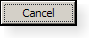
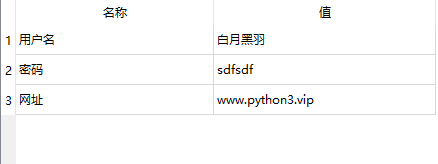
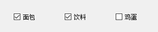
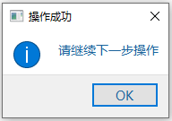

# 常用控件1

## 按钮

`QPushButton` 就是常见的按钮



[官网介绍](https://doc.qt.io/qtforpython-5.12/PySide2/QtWidgets/QPushButton.html)

### 信号：被点击

当按钮被点击就会发出 `clicked` 信号，可以这样指定处理该信号的函数

```py
button.clicked.connect(handleCalc)
```

### 改变文本

代码中可以使用 `setText` 方法来改变按钮文本，比如

```py
button.setText(text)
```

### 禁用、启用

所有控件（继承自QWidget类）都支持 禁用和启用方法。

禁用后，该控件不再处理用户操作

- 禁用

```py
button.setEnabled(False)
```

- 启用

```py
button.setEnabled(True)
```

### 设置图标

可以通过如下方法给按钮设置图标

```py
from PySide2.QtCore import Qt,QSize
from PySide2.QtGui import QIcon

# 设置图标
button.setIcon(QIcon('logo.png'))

# 设置图标大小
button.setIconSize(QSize(30, 30))
```

## 单行文本框

`QLineEdit` 是只能单行编辑的文本框。


[官网介绍](https://doc.qt.io/qtforpython-5.12/PySide2/QtWidgets/QLineEdit.html)

### 信号：文本被修改

当文本框中的内容被键盘编辑，被点击就会发出 `textChanged `信号，可以这样指定处理该信号的函数

```py
edit.textChanged.connect(handleTextChange)
```

Qt在调用这个信号处理函数时，传入的参数就是 文本框目前的内容字符串。

### 信号：按下回车键

当用户在文本框中任何时候按下回车键，就会发出 `returnPressed` 信号。

有时我们需要处理这种情况，比如登录界面，用户输完密码直接按回车键就进行登录处理，比再用鼠标点击登录按钮快捷的多。

可以指定处理 returnPressed 信号，如下所示

```py
passwordEdit.returnPressed.connect(onLogin)
```

### 获取文本

通过 `text` 方法获取编辑框内的文本内容，比如

```py
text = edit.text()
```

### 设置提示

通过 `setPlaceholderText` 方法可以设置提示文本内容，比如

```py
edit.setPlaceholderText('请在这里输入URL')
```

### 设置文本

通过 `setText` 方法设置编辑框内的文本内容为参数里面的文本字符串，比如

```py
edit.setText('你好，白月黑羽')
```

原来的所有内容会被清除

### 清除所有文本

`clear` 方法可以清除编辑框内所有的文本内容，比如

```py
edit.clear()
```

### 拷贝文本到剪贴板

`copy` 方法可以拷贝当前选中文本到剪贴板，比如

```py
edit.copy()
```

### 粘贴剪贴板文本

`paste` 方法可以把剪贴板内容，拷贝到编辑框当前光标所在处，比如

```py
edit.paste()
```

## 多行纯文本框

`QPlainTextEdit` 是可以 `多行` 的纯文本编辑框。


[官网介绍](https://doc.qt.io/qtforpython-5.12/PySide2/QtWidgets/QPlainTextEdit.html)

注意：在苹果MacOS上，有 更新文本框内容后，需要鼠标滑过才能更新显示的bug，[参考这里](https://bugreports.qt.io/browse/PYSIDE-871)

文本浏览框 内置了一个 [QTextDocument](https://doc.qt.io/qtforpython-5/PySide2/QtGui/QTextDocument.html) 类型的对象 ，存放文档。

### 信号：文本被修改

当文本框中的内容被键盘编辑，被点击就会发出 `textChanged `信号，可以这样指定处理该信号的函数

```py
edit.textChanged.connect(handleTextChange)
```

注意： Qt在调用这个信号处理函数时，**不会传入**文本框目前的内容字符串，作为参数。

这个行为 和 单行文本框不同。

### 信号：光标位置改变

当文本框中的光标位置变动，就会发出 `cursorPositionChanged` 信号，可以这样指定处理该信号的函数

```py
edit.cursorPositionChanged.connect(handleChanged)
```

### 获取文本

通过 `toPlainText` 方法获取编辑框内的文本内容，比如

```py
text = edit.toPlainText()
```

### 获取选中文本

```py
# 获取 QTextCursor 对象
textCursor = edit.textCursor()
selection = textCursor.selectedText()
```

### 设置提示

通过 `setPlaceholderText` 方法可以设置提示文本内容，比如

```py
edit.setPlaceholderText('请在这里输入薪资表')
```

### 设置文本

通过 `setPlainText` 方法设置编辑框内的文本内容 为参数里面的文本字符串，比如

```py
edit.setPlainText('''你好，白月黑羽
hello byhy''')
```

原来的所有内容会被清除

### 在末尾添加文本

通过 `appendPlainText` 方法在编辑框末尾添加文本内容，比如

```py
edit.appendPlainText('你好，白月黑羽')
```

注意：这种方法会在添加文本后 `自动换行`

### 在光标处插入文本

通过 `insertPlainText` 方法在编辑框末尾添加文本内容，比如

```py
edit.insertPlainText('你好，白月黑羽')
```

注意：这种方法 `不会` 在添加文本后自动换行

### 清除所有文本

`clear` 方法可以清除编辑框内所有的文本内容，比如

```py
edit.clear()
```

### 拷贝文本到剪贴板

`copy` 方法可以拷贝当前选中文本到剪贴板，比如

```py
edit.copy()
```

### 粘贴剪贴板文本

`paste` 方法可以把剪贴板内容，拷贝到编辑框当前光标所在处，比如

```py
edit.paste()
```

### 设置最大行数

有时候，代码会不断往文本框添加内容，为了防止占用过多资源，可以设置文本框最大行数。

像这样：

```py
edit.document().setMaximumBlockCount(1000)
```

就设置最大为 1000行

## 文本浏览框

`QTextBrowser` 是 `只能查看文本` 控件。

通常用来显示一些操作日志信息、或者不需要用户编辑的大段文本内容。

[官网介绍](https://doc.qt.io/qtforpython-5.12/PySide2/QtWidgets/QTextBrowser.html)

该控件 获取文本、设置文本、清除文本、剪贴板复制粘贴 等等， 都和上面介绍的 多行纯文本框是一样的。

下面我们主要讲解不同点

### 在末尾添加文本

通过 `append` 方法在编辑框末尾添加文本内容，比如

```py
textBrowser.append('你好，白月黑羽')
```

有时，浏览框里面的内容长度超出了可见范围，我们在末尾添加了内容，往往希望控件自动翻滚到当前添加的这行，

可以通过 `ensureCursorVisible` 方法来实现

```py
textBrowser.append('你好，白月黑羽')
textBrowser.ensureCursorVisible()
```

注意：这种方法会在添加文本后 `自动换行`

### 在光标处插入文本

通过 `insertPlainText` 方法在编辑框末尾添加文本内容，比如

```py
edit.insertPlainText('你好，白月黑羽')
```

注意：这种方法 `不会` 在添加文本后自动换行

## 标签

`QLabel` 就是常见的标签，可以用来显示文字（包括纯文本和富文本）、图片 甚至动画。


[官网介绍](https://doc.qt.io/qtforpython-5.12/PySide2/QtWidgets/QLabel.html)

### 创建对象

可以这样用代码创建一个 QLabel对象

```py
from PySide2 import QtWidgets

class Window(QtWidgets.QWidget):
    def __init__(self):
        label_path = QtWidgets.QLabel('初始内容', self)
```

### 改变文本

代码中可以使用 `setText` 方法来改变标签文本内容，比如

```py
label.setText(text)
```

### 显示图片

QLabel可以用来显示图片，有时一个图片可以让界面好看很多，如下图所示


怎么用QLabel 显示图片呢？

可以在 Qt Designer上 属性编辑器 QLabel 栏 的 pixmap 属性设置中选择图片文件指定。

下面有示例代码包， 演示如何显示图片，并且控制图片的显示风格

大家[点击这里](https://cdn2.byhy.net/files/py/qt/qss_pilot2.zip)，下载一个 程序界面代码，解压后，拖动里面的main.ui界面文件到Qt设计师里面。


# 常用控件2

## 组合选择框

`QComboBox` 是组合选择框，如下图所示


[官网介绍](https://doc.qt.io/qtforpython-5.12/PySide2/QtWidgets/QComboBox.html)

### 信号：选项改变

如果用户操作修改了QComboBox中的选项就会发出 `currentIndexChanged `信号，可以这样指定处理该信号的函数

```py
cbox.currentIndexChanged.connect(handleSelectionChange)
```

### 添加一个选项

代码中可以使用 `addItem` 方法来添加一个选项到 `末尾` ，参数就是选项文本

```py
cbox.addItem('byhy')
```

### 添加多个选项

代码中可以使用 `addItems` 方法来添加多个选项到 `末尾`，参数是包含了多个选项文本的列表

```py
cbox.addItems(['byhy','白月黑羽','python教程'])
```

### 清空选项

代码中可以使用 `clear` 方法来清空选项，也就是删除选择框内所有的选项

```py
cbox.clear()
```

### 获取当前选项文本

代码中可以使用 `currentText` 方法来获取当前 `选中的选项` 的文本，比如

```py
method = cbox.currentText()
```

## 列表

`QListWidget` 是列表控件，如下图所示


Qt Designer 如下图 选择：


列表里面每个列表项对应的类型是 `QListWidgetItem`

[QListWidget 官网介绍](https://doc.qt.io/qtforpython-5.12/PySide2/QtWidgets/QListWidget.html)

[QListWidgetItem 官网介绍](https://doc.qt.io/archives/qtforpython-5.12/PySide2/QtWidgets/QListWidgetItem.html)

### 实例化

可以通过Qt设计师创建UI，然后加载界面的方式实例化。

也可以直接通过代码创建列表控件实例

```py
from PySide2 import  QtWidgets

# parent变量对应的是父控件对象
listWidget = QtWidgets.QListWidget(parent)
```

### 添加一个列表项

代码中可以使用 `addItem` 方法来添加一个列表项到 `末尾` ，参数就是列表项文本

```py
listWidget.addItem('byhy')
```

如果你要添加的列表项并非简单的文本，而是，比如有图标

则需要添加参数是一个 QListWidgetItem 实例

```py
# 创建QListWidgetItem实例
listItem = QListWidgetItem()

# 设置图标
listItem.setIcon(some_icon)

# 可以给该列表项关联任意的对象
listItem.deviceCtrl = deviceCtrl

# 添加到列表控件中
listWidget.addItem(listItem)
```

### 添加多个列表项

代码中可以使用 `addItems` 方法来添加多个列表项到 `末尾`，参数是包含了多个列表项文本的列表

```py
listWidget.addItems(['byhy','白月黑羽','python教程'])
```

### 删除一个列表项

代码中可以使用 `takeItem` 方法来删除1个列表项，参数是该列表项所在行

```py
listWidget.takeItem(1)
```

就会删除第二行列表项

那，怎么指定某个item是第几行呢？

使用row方法，如下

```py
listWidget.row(item)
```

### 清空列表项

代码中可以使用 `clear` 方法来清空列表项，也就是删除选择框内所有的列表项

```py
listWidget.clear()
```

### 设置某个列表项为当前列表项

可以通过 `setCurrentItem` 方法，设置某个列表项为当前列表项

如下

```py
listWidget.setCurrentItem(listItem)
```

### 获取当前列表项文本

`currentItem` 方法可以得到列表当前选中项对象（QListWidgetItem） ，再调用这个对象的 `text` 方法，就可以获取文本内容，比如

```py
listWidget.currentItem().text()
```

可以使用 item 方法获取指定某行的 QListWidgetItem，

比如，

```py
listWidget.item(0).text()
```

就获取了 `第1行` 的列表项的文本。

### 遍历列表项

可以这样遍历列表里面的每个item

```py
for i in range(listWidget.count()):
    # 取出列表项
    listItem = listWidget.item(i)
```

### 信号：选项选择改变

如果用户鼠标或者键盘选择了一个选项，Qt就会发出 `itemSelectionChanged `信号，可以这样指定处理该信号的函数

```py
self.listWidget.itemSelectionChanged.connect(
    self.handleSelectionChange
)
```

然后定义一个处理函数

```py
    # 设备列表项选择改变 信号处理
    def handleSelectionChange(self):
        # 当前选择项目
        currentItem = self.listWidget.currentItem()
```

### 信号：选项文本改变

如果列表项文本可以编辑，并且用户修改了文本，Qt就会发出 `itemChanged `信号，可以这样指定处理该信号的函数

```py
self.listWidget.itemChanged.connect(
    self.handleItemTextChange
)
```

然后定义一个处理函数

```py
    # 设备列表项选择改变 信号处理
    # 参数 item 是修改的   QListWidgetItem对象
    def handleItemTextChange(self, item):
        # 这里写处理代码
        
```

## 表格

`QTableWidget` 是表格控件，如下图所示



表格控件单元格里面可以显示文字，也可以显示富文本、图片等内容。

表格控件的每个单元格里面要显示内容，都必须创建一个 `QTableWidgetItem` 类型的对象。

Qt Designer 如下图 选择：


[官网介绍: QTableWidge](https://doc.qt.io/qtforpython-5.12/PySide2/QtWidgets/QTableWidget.html)

[官网介绍: QTableWidgetItem](https://doc.qt.io/qtforpython-5.12/PySide2/QtWidgets/QTableWidgetItem.html)

### 实例化

可以通过Qt设计师创建UI，然后加载界面的方式实例化。

也可以直接通过代码创建表格控件实例

```py
from PySide2 import  QtWidgets

rows    = 0  # 行数
columns = 2  # 列数

# parent变量对应的是父控件对象
table = QtWidgets.QTableWidget(rows, columns, parent)
```

### 创建列 和 标题栏

我们可以通过 Qt designer 为一个表格创建列和对应的标题栏。

只需要双击 Qt designer 设计的窗体中的 表格控件， 就会出现这样的对话框。


在 `列` 标签栏中，点击左下角的加号，就可以为 添加一个列，并且设置标题栏名称。


### 插入一行、删除一行

`insertRow` 方法可以在指定位置插入一行，比如

```py
table.insertRow(0)
```

就插入一行到第 `1` 行这个位置， 表格原来第1行（包括原来的第1行）以后的内容，全部往下移动一行。

```py
table.insertRow(2)
```

就插入一行到第 `3` 行这个位置， 表格原来第3行（包括原来的第3行）以后的内容，全部往下移动一行。

`removeRow` 方法可以删除指定位置的一行，比如

```py
table.removeRow(0)
```

就删除第 `1` 行， 表格原来第1行以后的内容，全部往上移动一行。

```py
table.removeRow(2)
```

就删除第 `3` 行， 表格原来第3行以后的内容，全部往上移动一行。

### 设置单元格内容、对齐、属性

qt表格的单元格内的内容对象 是一个 单元格对象 `QTableWidgetItem` 实例

如果单元格 `没有被设置过` 内容，可以这样

```py
from PySide2.QtWidgets import QTableWidgetItem

item = QTableWidgetItem()
item.setText('白月黑羽')
table.setItem(row, 0, item)
```

也可以简写为

```py
from PySide2.QtWidgets import QTableWidgetItem

table.setItem(row, 0, QTableWidgetItem('白月黑羽'))
```

如果单元格 `已经被设置过` 文本内容，

`item` 方法可以获取指定位置的 QTableWidgetItem ，再调用这个对象的 `setText` 方法，就可以设置单元格文本内容，比如

```py
table.item(0,0).setText('白月黑羽-江老师')
```

就设置了 `第1行，第1列` 的单元格里面的文本。

```py
table.item(2,4).setText('白月黑羽-江老师')
```

就设置了 `第3行，第5列` 的单元格里面的文本。

如果希望某个单元格为 **只读**，不允许修改，可以使用QTableWidgetItem对象的 `setFlags` 方法，像这样

```py
from PySide2.QtWidgets import QTableWidgetItem
from PySide2.QtCore import Qt

item = QTableWidgetItem('白月黑羽')
item.setFlags(Qt.ItemIsEnabled) # 参数名字段不允许修改
table.setItem(row, 0, item)
```

如果想文本内容 **居中对齐**，每个当对应的QTableWidgetItem 调用 setTextAlignment，如下

```py
from PySide2.QtWidgets import QTableWidgetItem
from PySide2.QtCore import Qt

item = QTableWidgetItem()
item.setText('白月黑羽')
# 文本居中
item.setTextAlignment(Qt.AlignCenter) 
table.setItem(row, 0, item)
```

如果想设置 表格框 和 单元格边线 的颜色，可以使用样式如下

```css
QTableWidget {
	border:1px solid green;
    gridline-color: rgb(71, 191, 255);
}
```

### 获取单元格文本的内容

`item` 方法可以指定位置的单元格对象（QTableWidgetItem） ，再调用这个对象的 `text` 方法，就可以获取文本内容，比如

```py
table.item(0,0).text()
```

就获取了 `第1行，第1列` 的单元格里面的文本。

```py
table.item(2,4).text()
```

就获取了 `第3行，第5列` 的单元格里面的文本。

### 获取所有行数、列数

代码中可以使用 `rowCount` 方法来获取表格所有的 `行数` ，比如

```py
rowcount = table.rowCount()
```

可以使用 `columnCount` 方法来获取表格所有的 `列数` ，比如

```py
rowcount = table.columnCount()
```

### 获取当前选中是第几行

代码中可以使用 `currentRow` 方法来获取当前选中是第几行，比如

```py
currentrow = table.currentRow()
```

注意：行数是从0开始的， 第一行的行数是 0

### 设置表格行数、列数

代码中可以使用 `setRowCount` 方法来设置表格 `行数` ，比如

```py
table.setRowCount(10)
```

代码中可以使用 `setColumnCount` 方法来设置表格 `列数` ，比如

```py
table.setColumnCount(10)
```

### 清除/删除所有内容

`clearContents` 方法可以清除表格所有的内容，比如

```py
table.clearContents()
```

清除后，仍然会留下表格栏

如果连表格栏都要删除，可以使用 `setRowCount(0)`，像这样

```py
table.setRowCount(0)
```

### 设定列宽、宽度自动缩放

Qt Designer 上目前没法拖拽设定 每个列的宽度，只能在代码中指定。

如下所示

```py
# 设定第1列的宽度为 180像素
table.setColumnWidth(0, 180)

# 设定第2列的宽度为 100像素
table.setColumnWidth(1, 100)
```

如想让 表格控件宽度 随着父窗口的缩放自动缩放，可以

在 属性编辑器 中 勾选 `HorizontalHeaderStretchLastSection`

或者使用下面代码

```py
tableHeader = table.horizontalHeader()
tableHeader.setStretchLastSection(True)
```

还可以像下面这样设置

### 信号：单元格内容改动

当用户修改了一个单元格的内容，会发出 `cellChanged` 信号，并且携带参数指明该单元格的行号和列号。

我们的代码可以对该信号进行相应的处理。

示例代码如下

```py
    def __init__(self):
        # 指定单元格改动信号处理函数
        self.ui.table.cellChanged.connect(self.cfgItemChanged)

    
    def cfgItemChanged(self,row,column):
        # 获取更改内容
        cfgName = self.ui.table.item(row, 0).text() # 首列为配置名称
        cfgValue = self.ui.table.item(row, column).text()
```


# 常用控件3

## 单选按钮 和 按钮组

`QRadioButton` 是单选按钮，如下图所示


[官网介绍](https://doc.qt.io/qtforpython-5.12/PySide2/QtWidgets/QRadioButton.html)

### 说明

`同一个父窗口` 里面的多个单选按钮，只能选中一项。

如果你有多组单选按钮， 每组都应该有不同的父控件，或者不同的Layout。

通常建议：多组单选按钮，放到不同的 按钮组 `QButtonGroup` 中

[具体内容，点击这里，查看视频讲解](https://www.bilibili.com/video/BV1cJ411R7bP?p=12)

### 信号：选中状态改变

如果用户操作点击了按钮组 `QButtonGroup` 中的一个按钮， QButtonGroup 就会发出 `buttonClicked` 信号，可以这样指定处理该信号的函数

```py
buttongroup.buttonClicked.connect(handleButtonClicked)
```

然后，在处理函数中调用QButtonGroup对象的 `checkedButton()` 函数，返回值就是被选中的按钮对象。

再调用这个返回的按钮对象的 `text()` 方法得到界面文本，就可以知道是哪个选项被选中了。

## 勾选按钮 和 按钮组

`QCheckBox` 是勾选按钮，如下图所示



[官网介绍](https://doc.qt.io/qtforpython-5.12/PySide2/QtWidgets/QCheckBox.html)

### 说明

通常建议：多组勾选按钮，放到不同的 按钮组 `QButtonGroup` 中，按钮组就是父控件。

可以在 Qt设计师中设置 QButtonGroup 的 `exclusive` 属性， 来控制 是否 只能单选一个选项。

### 信号：选中状态改变

如果用户操作点击了按钮组 `QButtonGroup` 中的一个按钮， QButtonGroup 就会发出 `buttonClicked` 信号，可以这样指定处理该信号的函数

```py
buttongroup.buttonClicked.connect(handleButtonClicked)
```

QButtonGroup 设置为 `单选` 情况下：

在处理函数中调用QButtonGroup对象的 `checkedButton()` 函数，返回值就是被选中的按钮对象。

再调用这个返回的按钮对象的 `text()` 方法得到界面文本，就可以知道是哪个选项被选中了。

QButtonGroup 设置为 `多选` 情况下：

要得知哪些按钮被选中， 可以 对所有该组中的 按钮调用 `isChecked` 方法 ，来判断。

## tab页控件

我们可以通过tab页控件把界面分为好几个页面，如下所示


通过Qt designer 只需要拖拽控件到各个页面即可。

要修改tab页的标题，可以先点击该tab页，然后在下图所示处修改


### tab页中布局Layout

如果我们要在tab页上布局， 你可能会在对象查看器总直接右键点击该tab，可以你会发现 右键菜单里面没有布局项。

这是 Qt designer 非常坑爹的地方，我当时足足花了一个小时才找到方法。

1. 首先需要你在tab页上添加一个控件
2. 然后点击 在对象查看器 右键点击上层 TabWidget ，这时，你就会发现有布局菜单了

[点击这里，看视频讲解tab页中布局Layout](https://www.bilibili.com/video/BV1cJ411R7bP?p=13)

## 进度条

`QProgressBar` 是进度条，如下图所示


[官网介绍](https://doc.qt.io/qtforpython-5.12/PySide2/QtWidgets/QProgressBar.html)

### 说明

进度条也是一个常用的控件，当程序需要做一件比较耗费时间的任务（比如统计数据，下载文件等）时，可以用来向用户指示操作的进度。

而且有了进度显示，用户就知道应用程序仍在运行，并没有出问题。

QProgressBar进度条把每个进度称之为一个step（步骤）。

我们可以通过它的 `setRange` 方法设定步骤个数，比如

```py
progressBar.setRange(0,5)
```

就设定了，进度分为5步。

然后，通过 `setValue` 方法，指定当前完成到了哪一步，比如

```py
progressBar.setValue(3)
```

就表示完成了 3/5， 也就是 60%， 进度条就会显示60%的进度。

可以使用reset()将进度条倒退到开头。

有时候我们的任务没法知道完成了多少，比如下载一个未知大小的文件。

这时，可以把range 范围都设置为0，这样，进度条会显示忙碌指示符，而不是显示进度百分比。

下面是一个进度条程序的示例代码

```py
from PySide2.QtWidgets import QApplication, QMainWindow, QPushButton,  QProgressBar,QMessageBox
from time import sleep
from threading import  Thread

class Stats():
    def __init__(self):
        self.window = QMainWindow()
        self.window.resize(500, 400)
        self.window.move(300, 300)

        self.progressBar = QProgressBar(self.window)
        self.progressBar.resize(300, 20)
        self.progressBar.move(80, 30)
        # 进度是 0 - 5，
        self.progressBar.setRange(0,5)

        self.button = QPushButton('统计', self.window)
        self.button.move(80, 80)

        self.button.clicked.connect(self.handleCalc)

        # 统计进行中标记，不能同时做两个统计
        self.ongoing = False

    def handleCalc(self):
        def workerThreadFunc():
            self.ongoing = True
            for i in range(1,6):
                sleep(1)
                # 设置进度值
                self.progressBar.setValue(i)
            self.ongoing = False

        if self.ongoing:
            QMessageBox.warning(
                self.window,
                '警告','任务进行中，请等待完成')
            return

        # 通常任务执行比较耗时，应该在新的线程中进行
        # 否则会阻塞主线程显示界面
        worker = Thread(target=workerThreadFunc)
        worker.start()

app = QApplication([])
stats = Stats()
stats.window.show()
app.exec_()
```

上面的代码，运行时，会有很多告警，因为我们在新线程中操作界面对象，容易出问题。

更合理的方法是通过信号，在线程之间传递信息，对界面的操作都在主线程中完成。

如下

```py
from PySide2.QtWidgets import QApplication, QMainWindow, QPushButton,  QProgressBar,QMessageBox
from time import sleep
from threading import  Thread
from PySide2.QtCore import Signal,QObject

# 信号库
class SignalStore(QObject):
    # 定义一种信号
    progress_update = Signal(int)
    # 还可以定义其他作用的信号

# 实例化
so = SignalStore()

class Stats():
    def __init__(self): 
        # 连接信号到处理的slot函数
        so.progress_update.connect(self.setProgress)
        
        self.window = QMainWindow()
        self.window.resize(500, 400)
        self.window.move(300, 300)

        self.progressBar = QProgressBar(self.window)
        self.progressBar.resize(300, 20)
        self.progressBar.move(80, 30)
        # 进度是 0 - 5，
        self.progressBar.setRange(0,5)

        self.button = QPushButton('统计', self.window)
        self.button.move(80, 80)

        self.button.clicked.connect(self.handleCalc)

        # 统计进行中标记，不能同时做两个统计
        self.ongoing = False

    def handleCalc(self):
        def workerThreadFunc():
            self.ongoing = True
            for i in range(1,6):
                sleep(1)
                # 发出信息，通知主线程进行进度处理
                so.progress_update.emit(i)
            self.ongoing = False

        if self.ongoing:
            QMessageBox.warning(
                self.window,
                '警告','任务进行中，请等待完成')
            return

        worker = Thread(target=workerThreadFunc)
        worker.start()

    # 处理进度的slot函数
    def setProgress(self,value):
        self.progressBar.setValue(value)

app = QApplication([])
stats = Stats()
stats.window.show()
app.exec_()
```

## 数字输入框

`QSpinBox` 是数字输入框，可以输入或使用上下箭头选择数字，如下图所示


[官网介绍](https://doc.qt.io/qtforpython-5.12/PySide2/QtWidgets/QSpinBox.html)

### 获取数字

通过 `value` 方法获取编辑框内的文本内容，比如

```py
number = box.value()
```

注意：返回的是整数对象，不是字符串

### 设置数字

通过 `setValue` 方法可以设置提示文本内容，比如

```py
box.setValue(100)
```

## 日期控件

`QDateEdit` 类可以用来选择日期时间，如下图所示


[官网介绍](https://doc.qt.io/qtforpython-5.12/PySide2/QtWidgets/QDateEdit.html)

### 获取日期

当用户点击日期时间控件并且选取了 日期和时间，后来程序要获取这个控件里面选定的日期时间，可以使用date方法获取日期对象。

如下所示

```py
# 返回 PySide2.QtCore.QDate 对象
qdate = dateEdit.date()

# 可以转化为 指定格式的字符串
dateStr = qdate.toString('yyyy-MM-dd')

# 也可以获取年月日 对应的数字 ，比如日期是2020年5月2号
year = qdate.year()   # 返回 2020
month = qdate.month() # 返回 5
day = qdate.day()     # 返回 2
```

QDate 对象的具体说明[参考官方文档](https://doc.qt.io/qtforpython-5.12/PySide2/QtCore/QDate.html)

## 选择文件框

`QFileDialog` 类可以用来选择文件或者目录，如下图所示


[官网介绍](https://doc.qt.io/qtforpython-5.12/PySide2/QtWidgets/QFileDialog.html)

### 选择目录

通过 `getExistingDirectory 静态方法` 选择目录。

该方法，第一个参数是父窗口对象，第二个参数是选择框显示的标题。

比如

```py
from PySide2.QtWidgets import QFileDialog

filePath = QFileDialog.getExistingDirectory(self.ui, "选择存储路径")
```

返回值即为选择的路径字符串。

如果用户点击了 选择框的 取消选择按钮，返回 空字符串。

### 选择单个文件

如果你想弹出文件选择框，选择一个 `已经存在` 的文件，可以使用 QFileDialog 静态方法 `getOpenFileName` ，比如

```py
from PySide2.QtWidgets import QFileDialog

filePath, _  = QFileDialog.getOpenFileName(
            self.ui,             # 父窗口对象
            "选择你要上传的图片", # 标题
            r"d:\\data",        # 起始目录
            "图片类型 (*.png *.jpg *.bmp)" # 选择类型过滤项，过滤内容在括号中
        )
```

该方法返回值 是一个元组，第一个元素是选择的文件路径，第二个元素是文件类型，如果你只想获取文件路径即可，可以采用上面的代码写法。

如果用户点击了 选择框的 取消选择按钮，返回 空字符串。

如果你想弹出文件选择框，选择路径和文件名，来 `保存一个文件` ，可以使用 QFileDialog 静态方法 `getSaveFileName` ，比如

```py
from PySide2.QtWidgets import QFileDialog

filePath, _  = QFileDialog.getSaveFileName(
            self.ui,             # 父窗口对象
            "保存文件", # 标题
            r"d:\\data",        # 起始目录
            "json类型 (*.json)" # 选择类型过滤项，过滤内容在括号中
        )
```

### 选择多个文件

如果要选择多个文件，使用 `getOpenFileNames 静态方法`

```py
from PySide2.QtWidgets import QFileDialog

filePaths, _  = QFileDialog.getOpenFileNames(
            self.ui,             # 父窗口对象
            "选择你要上传的图片", # 标题
            r"d:\\data",        # 起始目录
            "图片类型 (*.png *.jpg *.bmp)" # 选择类型过滤项，过滤内容在括号中
        )
```

上例中 filePaths 对应的返回值是一个列表，里面包含了选择的文件。

如果用户点击了 选择框的 取消选择按钮，返回 空列表。


# 常用控件4

## 树控件

`QTreeWidget 树控件` 树控件， 是和 `QTreeWidgetItem 树节点控件` 结合使用的。

如下图所示


```
本节讲解 仅 内部学员 可见
```

## 提示框

`QMessageBox` 类可以用来弹出各种提示框

[官网介绍](https://doc.qt.io/qtforpython-5.12/PySide2/QtWidgets/QMessageBox.html)

该类可以通过一系列静态方法，显示 如下弹出框

- 错误报告


使用 `critical` 方法

```py
from PySide2.QtWidgets import QMessageBox

QMessageBox.critical(
    self.ui,
    '错误',
    '请选择爬取数据存储路径！')
```

- 警告


使用 `warning` 方法

```py
QMessageBox.warning(
    self.ui,
    '阅读太快',
    '阅读客户协议必须超过1分钟')
```

- 信息提示



使用 `information` 方法

```py
QMessageBox.information(
    self.ui,
    '操作成功',
    '请继续下一步操作')
```

也可以使用 `about` 方法

```py
QMessageBox.about(
    self.ui,
    '操作成功',
    '请继续下一步操作')
```

- 确认继续


使用 `question` 方法

```py
choice = QMessageBox.question(
    self.ui,
    '确认',
    '确定要删除本文件吗？')

if choice == QMessageBox.Yes:
    print('你选择了yes')
if choice == QMessageBox.No:
    print('你选择了no')
```

## 输入对话框

`QInputDialog` 输入对话框 只让用户输入一行数据信息，比如 姓名、年龄等。

可以方便的用来获取简单的信息。


[官网介绍](https://doc.qt.io/qtforpython-5.12/PySide2/QtWidgets/QInputDialog.html)

比如

```py
from PySide2.QtWidgets import QInputDialog,QLineEdit

# 返回值分别是输入数据 和 是否点击了 OK 按钮（True/False）
title, okPressed = QInputDialog.getText(
    self, 
    "输入目录名称",
    "名称:",
    QLineEdit.Normal,
    "")

if not okPressed:
    print('你取消了输入')
```

常用的方法有：

- getText

  弹出对话框，让用户输入 单行文本

- getMultiLineText

  弹出对话框，让用户输入 多行文本

- getInt

  弹出对话框，让用户输入 整数

- getItem

  弹出对话框，让用户选择 选项

  ```py
  items = ["春天", "夏天", "秋天", "冬天"]
  
  item, ok = QInputDialog().getItem(self, 
                                    "请选择",
                                    "季节:", 
                                    items, 
                                    0, 
                                    False)
  if ok and not item.isEmpty():
      itemLabel.setText(item)
  ```

## 菜单

可以在 Qt Designer上很方便的添加菜单，如下所示


点击菜单的信号是 `triggered`， 处理点击菜单的的代码如下

```py
self.ui.actionOpenFile.triggered.connect(self.openPageFile)
```

注意：如果菜单和工具栏有 `相同的 action` ，通常是先在 动作编辑器 创建一个action， 然后分别拖动到 菜单 和 工具栏

## 工具栏

在 Qt 设计师上添加工具栏，可以右键点击 `Main Window` 类型的窗体空白处，如下所示


选择添加工具栏

注意，只有 `Main Window` 类型的窗体，才能添加工具栏，如下


添加工具栏后，还要在工具栏上添加图标。

方法是点击右下角 动作编辑器，新建动作，如下图所示


然后如下图所示进行设置


添加动作成功后，就可以直接拖到工具栏上了。

然后，在代码中定义动作触发后的处理函数，如下所示

```py
self.ui.actionAddNote.triggered.connect(self.actionAddNode)
```

## 状态栏

[官网介绍](https://doc.qt.io/qtforpython-5.12/PySide2/QtWidgets/QStatusBar.html)

要在状态栏显示文本信息，只需要调用 QStatusBar 的 `showMessage` 方法

```py
self.ui.statusbar.showMessage(f'打开文件{filePath}')
```

## 剪贴板

Qt程序可以获取和设置剪贴板内容

[官网介绍](https://doc.qt.io/qtforpython-5.12/PySide2/QtGui/QClipboard.html)

```py
from PySide2.QtGui import QGuiApplication

cb = QGuiApplication.clipboard()
# 获取剪贴板内容
originalText = cb.text()
# 设置剪贴板内容
clipboard.setText(newText)
```

## MDI 多个子窗口

QMdiArea 提供了一个主窗口区，里面可以存放多个 QMdiSubWindow 子窗口

如图：

