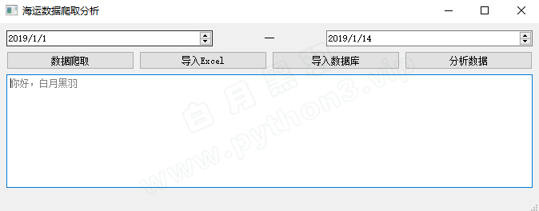
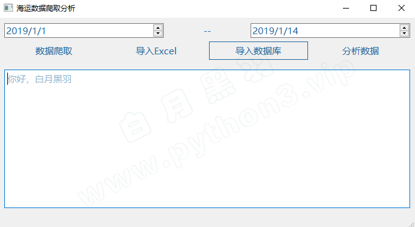
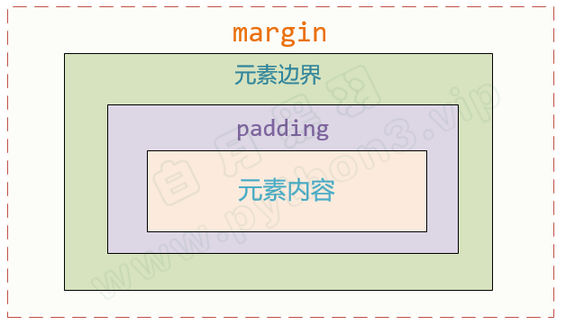

# 显示样式

## QSS 概念

[点击这里，边看视频讲解，边学习以下内容](https://www.bilibili.com/video/BV1cJ411R7bP?p=15)

前面，我们开发的程序界面有点简陋。

大家[点击这里](https://cdn2.byhy.net/files/py/qt/qss_pilot.zip)，下载一个白月黑羽实战班学员开发的程序界面代码，解压后，拖动里面的main.ui界面文件到Qt设计师里面。

像这样



要让产品更好看一些，通常就是指定界面元素的 `显示样式` 。比如指定颜色、字体、间距。

像这样



Qt有种定义界面显示样式的方法，称之为 `Qt Style Sheet` ，简称 `QSS`

如果你学习过Web网页开发，就会发现这个名词和 `CSS` 特别的相似。

没错，它的 语法和用途 和 CSS 特别的相似。

我们来看上图对应的示例

如果在设计师界面上 最上层的 MainWindow 对象 `styleSheet` 属性指定如下的内容

```css
QPushButton { 
    color: red ;
    font-size:15px;
}
```

就会发现，所有的按钮上的文字都变成了红色的，并且字体变大了。

注意这个指定界面元素 显示样式的 语法，由 selector 和 declaration 组成。

花括号前面的 部分，比如示例中的 `QPushButton` 称之为 selector。

花括号后面的 部分，比如示例中的

```css
{ 
    color: red ;
    font-size:15px;
}
```

称之为 Properties （样式属性）

## selector 选择器

[点击这里，边看视频讲解，边学习以下内容](https://www.bilibili.com/video/BV1cJ411R7bP?p=16)

花括号前面的 部分称之为 selector（中文可以叫 选择器），用来 告诉Qt `哪些特征的元素` 是你要设定显示效果的。

比如：`QPushButton` 选择所有类型为 QPushButton （包括其子类） 的界面元素 。

QSS selector语法 几乎 和 Web CSS 的 selector语法没有什么区别，了解CSS的朋友可以轻松掌握。

具体可以[点击这里，参考官方文档中的说明](https://doc.qt.io/qt-5/stylesheet-syntax.html)

### selector常见语法

| Selector            | 示例                        | 说明                                              |
| ------------------- | --------------------------- | ------------------------------------------------- |
| Universal Selector  | `*`                         | 星号匹配所有的界面元素                            |
| Type Selector       | `QPushButton`               | 选择所有 QPushButton类型 （包括其子类）           |
| Class Selector      | `.QPushButton`              | 选择所有 QPushButton类型 ，但是不包括其子类       |
| ID Selector         | `QPushButton#okButton`      | 选择所有 `对象名为 okButton` 的QPushButton类型    |
| Property Selector   | `QPushButton[flat="false"]` | 选择所有 flat 属性值为 false 的 QPushButton类型。 |
| Descendant Selector | `QDialog QPushButton`       | 选择所有 QDialog `内部` QPushButton类型           |
| Child Selector      | `QDialog > QPushButton`     | 选择所有 QDialog `直接子节点` QPushButton类型     |

### Pseudo-States 伪状态

我们可以这样指定当鼠标移动到一个元素上方的时候，元素的显示样式

```css
QPushButton:hover { color: red }
```

再比如，指定一个元素是disable状态的显示样式

```css
QPushButton:disabled { color: red }
```

再比如，指定一个元素是鼠标悬浮，并且处于勾选（checked）状态的显示样式

```css
QCheckBox:hover:checked { color: white }
```

### 优先级

如果一个元素的显示样式被多层指定了， `越靠近元素本身` 的选择指定，优先级越高

## 样式属性

[点击这里，边看视频讲解，边学习以下内容](https://www.bilibili.com/video/BV1cJ411R7bP?p=17)

QSS的样式属性和网页CSS非常相似。

QSS支持的具体样式，可以[点击这里，查看Qt官方文档](https://doc.qt.io/qt-5/stylesheet-reference.html#list-of-properties)

我们这里介绍一些常见的样式属性

### 背景

可以指定某些元素的背景色，像这样

```css
QTextEdit { background-color: yellow }
```

颜色可以使用红绿蓝数字，像这样

```css
QTextEdit { background-color: #e7d8d8 }
```

也可以像这样指定背景图片

```css
QTextEdit {
    background-image: url(gg03.png);
}
```

### 边框

可以像这样指定边框 `border:1px solid #1d649c;`

其中

`1px` 是边框宽度

`solid` 是边框线为实线， 也可以是 `dashed`(虚线) 和 `dotted`（点）

比如

```css
*[myclass=bar2btn]:hover{
	border:1px solid #1d649c;
}
```

边框可以指定为无边框 `border:none`

### 字体、大小、颜色

可以这样指定元素的 文字字体、大小、颜色

```css
*{	
	font-family:微软雅黑;
	font-size:15px;
	color: #1d649c;
}
```

### 宽度、高度

可以这样指定元素的 宽度、高度

```css
QPushButton {	
	width:50px;
	height:20px;
}
```

### margin、padding

见下图，根据视频讲解，理解margin、padding 的概念



可以这样指定元素的 元素的 margin

```css
QTextEdit {
	margin:10px 11px 12px 13px
}
```

分别指定了元素的上右下左margin。

也可以使用 margin-top, margin-right, margin-bottom, margin-left 单独指定 元素的上右下左margin

比如

```css
QTextEdit {
	margin:10px 50px;
	padding:10px 50px;
}
```

## 写代码设置css

前面的示例都是在Qt设计师软件中设置样式

也可以写代码直接设置样式，

比如，给控件设置背景色

```py
class QMyWidget(QtWidgets.QWidget):
  
    def __init__(self):
        super().__init__()

        # 给控件设置背景色
        self.setAttribute(Qt.WA_StyledBackground, True)
        self.setStyleSheet("background-color: white")
```