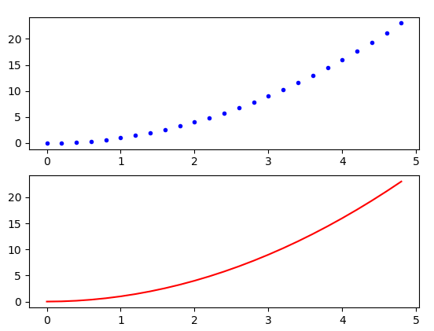
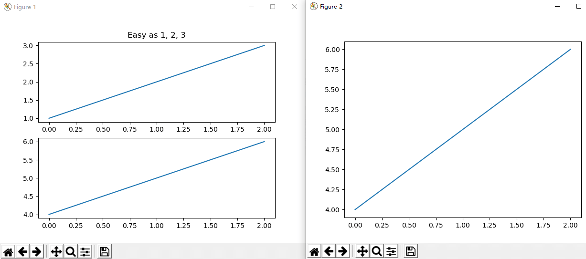
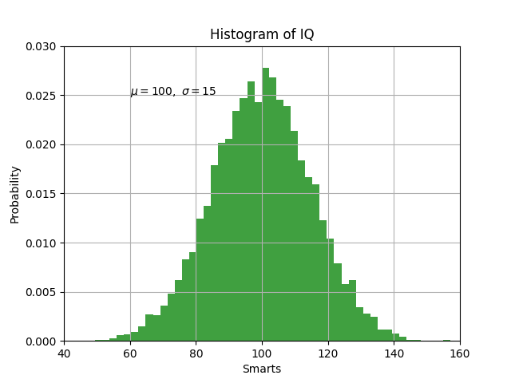
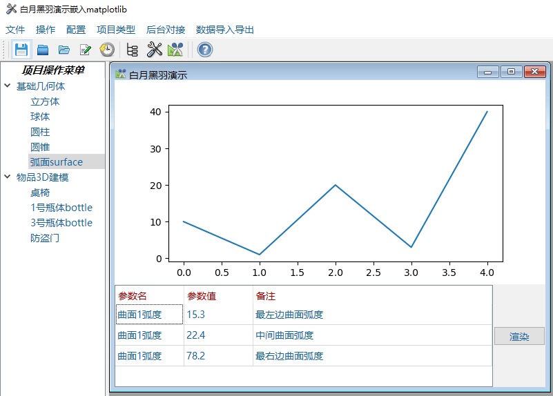

# Matplotlib 绘图

Matplotlib 提供非常全面的数据可视化功能。

## 安装

非常简单，直接 执行 `pip install matplotlib` 即可

## 简单示例

下面的代码，运行一下看看

```py
import matplotlib.pyplot as plt

# 如果只传入一个数组作为参数， matplotlib 认为是 Y 轴的坐标
# 并自动产生 从 0 开始的 对应 X 轴坐标： 0、1、2、3 ...
plt.plot([2, 4, 6, 8])
plt.ylabel('some numbers')
plt.show()
```

当然，我们也经常需要 `同时指定` 作图点的 X 坐标 和 Y 坐标

```py
import matplotlib.pyplot as plt

# 绘图点的 X 轴 坐标依次为 1, 3, 5, 7
# 绘图点的 Y 轴 坐标依次为 2, 4, 6, 8
plt.plot([1, 3, 5, 7], [2, 4, 6, 8])
plt.ylabel('some numbers')
plt.show()
```

可以在一幅图上，画多组数据，如下所示

```py
import matplotlib.pyplot as plt

# 画一组数据
plt.plot([1, 2, 3, 4], [1, 4, 9, 16])
# 再画一组数据
plt.plot([1, 2, 3, 4], [1, 3, 5, 8])
plt.show()
```

## 显示中文字符

matplotlib的缺省字体不支持中文，我们可以指定一个支持中文的字体

```py
import matplotlib.pyplot as plt

plt.rcParams['font.family'] = 'sans-serif'
# 设定字体为微软雅黑
plt.rcParams['font.sans-serif']=['Microsoft Yahei']

plt.plot([1, 2, 3, 4])
plt.xlabel('times 次数')
plt.show()
```

## 显示格式

给定了xy坐标作为 plot 的前两个参数， 还可以有可选的第三个参数，表示数据绘制的风格，缺省值为 `b- `。

`b` 表示 蓝色， `-` 表示 是线图。

如果想显示红色点图，就是 风格参数 `r.` ， `r` 代表红色， `.` 代表点， 如下

```py
import matplotlib.pyplot as plt

plt.plot([1, 2, 3, 4], [1, 4, 9, 16], 'r.')
plt.show()
```

完整的 风格参数定义，[点击这里参考官方文档](https://matplotlib.org/api/_as_gen/matplotlib.pyplot.plot.html#matplotlib.pyplot.plot)

## 指定宽度

我们可以 使用参数 `linewidth` 指定绘图的线条宽度

```py
import matplotlib.pyplot as plt

plt.plot(range(10), range(10), linewidth=0.5)
plt.show()
```

我们可以 使用参数 `markersize` 指定点的大小

```py
import matplotlib.pyplot as plt

plt.plot(range(10), range(10), 'r.', markersize=2.5)
plt.show()
```

## numpy 数组

其实 matplotlib 内部都是把作图数据转化为 numpy 的 ndarray 数组类型进行处理的。

所以，我们当然可以，直接使用 numpy 的数组作为 画图数据

```py
import matplotlib.pyplot as plt
import numpy as np

# arange 就像 Python中的range
# 从 0 到 5 步长为 0.2
t = np.arange(0, 5, 0.2)

# 使用 numpy 的ndarray 作为数据
plt.plot(t, t**2, 'b.')
plt.show()
```

## 柱状图

使用 `bar` 方法可以画柱状图

```py
import matplotlib.pyplot as plt

names = ['2016', '2017', '2018']
values = [1, 10, 100]

plt.bar(names, values)
plt.show()
```

## 饼图

```py
import matplotlib.pyplot as plt

# 指定饼图的每个切片名称
labels = 'Frogs', 'Hogs', 'Dogs', 'Logs'

# 指定每个切片的数值，从而决定了百分比
sizes = [15, 30, 45, 10]
explode = (0, 0.1, 0, 0)  # only "explode" the 2nd slice (i.e. 'Hogs')

fig1, ax1 = plt.subplots()
ax1.pie(sizes, explode=explode, labels=labels, autopct='%1.1f%%',
        shadow=True, startangle=90)
ax1.axis('equal')  # Equal aspect ratio ensures that pie is drawn as a circle.

plt.show()
```

## 散点图

使用 `scatter` 方法可以画散点图

```py
import matplotlib.pyplot as plt

names = ['2016', '2017', '2018', '2019', '2020']
values = [75, 78, 100, 150, 210]

plt.scatter(names, values)
plt.show()
```

## 多个子图（axes）

`subplot` 方法可以用来创建多个子图（axes）。

前面的示例中，我们并没有创建子图，其实， matplotlib缺省会帮我们调用 `plt.subplot(1,1,1)` 指定 1行，1列，共1个子图，当前子图为第1个.

如果你想指定更多的子图，可以这样，

```py
import matplotlib.pyplot as plt
import numpy as np

# arange 就像 Python中的range
# 从 0 到 5 步长为 0.2
t = np.arange(0, 5, 0.2)

# 指定2行，1列，共两个axe，当前使用第1个绘图块
plt.subplot(2,1,1)   
plt.plot(t, t**2, 'b.')


# 当前使用第2个绘图块
plt.subplot(2,1,2)   
plt.plot(t, t**2, 'r-')
plt.show()
```

结果如下：



## 多个绘图（Figure）

matplotlib 每个绘图区都对应一个 Figure 对象。

一个绘图 Figure 对象 里面可以包含多个 subplot对象。

而我们的程序可以同时打开多个绘图 Figure 对象。

比如下图，你可以发现有两个绘图窗口，对应两个 Figure 对象



前面的示例中，我们并没有声明创建Figure对象，其实是默认使用了 matplotlib 缺省Figure 对象。

默认Figure ，也就是相当于调用 `plt.figure(1) `指定第一个绘图。

我们可以像下面这样创建多个Figure

```py
import matplotlib.pyplot as plt
plt.figure(1)                # the first figure
plt.subplot(211)             # the first subplot in the first figure
plt.plot([1, 2, 3])
plt.subplot(212)             # the second subplot in the first figure
plt.plot([4, 5, 6])


plt.figure(2)                # a second figure
plt.plot([4, 5, 6])          # creates a subplot(111) by default

plt.figure(1)                # figure 1 current; subplot(212) still current
plt.subplot(211)             # make subplot(211) in figure1 current
plt.title('Easy as 1, 2, 3') # subplot 211 title

plt.show()
```

运行代码，就可以产生上面的图形。

## 图形中的文字

```py
import matplotlib.pyplot as plt
import numpy as np

mu, sigma = 100, 15
x = mu + sigma * np.random.randn(10000)

n, bins, patches = plt.hist(x, 50, density=1, facecolor='g', alpha=0.75)

# x轴标题
plt.xlabel('Smarts')
# y轴标题
plt.ylabel('Probability')
# 子图标题
plt.title('Histogram of IQ')
# 指定坐标处添加文本
plt.text(60, .025, r'$\mu=100,\ \sigma=15$')
plt.axis([40, 160, 0, 0.03])
plt.grid(True)
plt.show()
```

结果如下：



我们可以像这样，指定标题的颜色

```py
t = plt.xlabel('my data', fontsize=14, color='red')
```

## x轴刻度文字垂直

有时候我们作图时，x轴文字内容比较长，会出现重叠，这时需要x轴刻度文字垂直，可以如下设置

```py
import matplotlib.pyplot as plt
# 设定字体为微软雅黑
plt.rcParams['font.family'] = 'Microsoft Yahei'

# x刻度垂直，否则字会重叠
plt.xticks(rotation=-90)

# 加长底部空间，否则文字显示不全
plt.subplots_adjust(bottom=0.45)
```

## 嵌入Qt中

有时候，我希望Qt程序界面中包含 matplotlib绘图内容，怎么把 matplotlib绘图嵌入Qt中 呢？

就像这样

