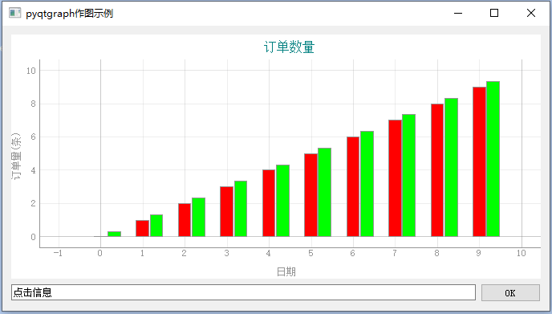
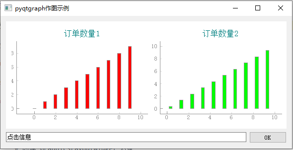
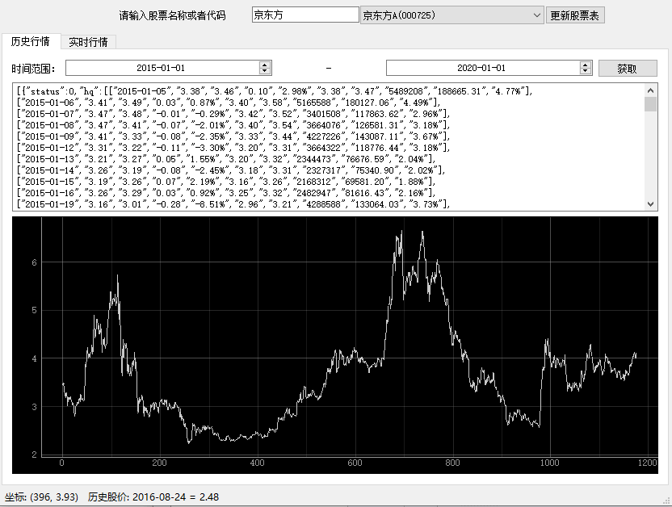

# PyQtGraph 绘图

## 数据绘图方案

Python语言 的数据可视化（绘图） 方法，常见的有 Matplotlib 和 PyQtGraph

- Matplotlib

说到 Python语言 的数据作图， Matplotlib 当然是最有名的。

优点： 功能完备、成熟稳定、社区生态圈庞大。

缺点： 某些作图场景性能不高。

- PyQtGraph

PyQtGraph 是基于Qt 的纯Python 库。

优点： 大数据量的作图性能高于 Matplotlib， 动态更新图的性能也比Matplotlib高。

并且和Qt图形界面框架完美融合，因为它的2D作图就是基于 Qt View Framework 开发的。

缺点： 作图功能没有Matplotlib多，开发社区没有Matplotlib大。

那么，我们应该使用哪种方案呢？我的建议是：

如果你已经使用Qt开发图形界面程序了，并且作图功能是PyQtGraph支持的， 建议使用 PyQtGraph，因为它和Qt界面无缝结合。

否则 使用 Matplotlib。

本文先介绍 PyQtGraph 的使用示例。

## PyQtGraph 安装

```py
pip install pyqtgraph
```

## 官方文档 和 案例

PyQtGraph 官方文档可以[点击这里查阅](https://pyqtgraph.readthedocs.io/en/latest/introduction.html)

其中包含了很多示例代码，我们只需运行如下代码，即可查看这些demo和对应的代码

```py
import pyqtgraph.examples
pyqtgraph.examples.run()
```

## 曲线图 示例

下面是一个最常见的 根据x/y轴对应的值 作曲线图的例子

```py
from pyqtgraph.Qt import QtGui, QtCore
import pyqtgraph as pg

# 创建 绘制窗口类 PlotWindow 对象，内置一个绘图控件类 PlotWidget 对象
pw = pg.plot()

# 设置图表标题、颜色、字体大小
pw.setTitle("气温趋势",color='008080',size='12pt')

# 背景色改为白色
pw.setBackground('w')

# 显示表格线
pw.showGrid(x=True, y=True)

# 设置上下左右的label
# 第一个参数 只能是 'left', 'bottom', 'right', or 'top'
pw.setLabel("left", "气温(摄氏度)")
pw.setLabel("bottom", "时间")

# 设置Y轴 刻度 范围
pw.setYRange(min=-10,  # 最小值
             max=50)  # 最大值

# 创建 PlotDataItem ，缺省是曲线图
curve = pw.plot( pen=pg.mkPen('b')) # 线条颜色

hour = [1, 2, 3, 4, 5, 6, 7, 8, 9, 10]
temperature = [30, 32, 34, 32, 33, 31, 29, 32, 35, 45]

curve.setData(hour, # x坐标
              temperature  # y坐标
              )

QtGui.QApplication.instance().exec_()
```

## 清除画图区，重新绘制

如果使用新的数据再次绘图，可以先调用clear方法清除原来的内容（plotitem），如下

```py
# 清除原来的plot内容
pw.clear()

# 创建 PlotDataItem ，缺省是曲线图
curve = pw.plot( pen=pg.mkPen('b')) # 线条颜色
hour = [1, 2, 3, 4, 5, 6, 7, 8, 9, 10]
temperature = [130, 132, 134, 132, 133,131, 129, 132, 135, 145]

curve.setData(hour, # x坐标
              temperature  # y坐标
              )
```

## PlotWidget 和 GraphicsLayoutWidget

PyQtGraph 中 绘图控件类 有两种 PlotWidget 和 GraphicsLayoutWidget， 都是 [GraphicsView](https://pyqtgraph.readthedocs.io/en/latest/widgets/graphicsview.html?highlight=setBackground#graphicsview) 子类。GraphicsView 是 Qt 的 QGraphicsView 子类，在其基础上改进了一些功能。

PlotWidget 只能内置一个 绘图对象PlotItem， 而 GraphicsLayoutWidget 可以内置多个 绘图对象。 通常我们使用最多的是PlotWidget

PlotWidget对象的 内置绘图对象 [PlotItem](https://pyqtgraph.readthedocs.io/en/latest/graphicsItems/plotitem.html#pyqtgraph.PlotItem) ，可以通过 getPlotItem() 方法获取。

为了方便，大部分的PlotItem方法都可以直接通过 PlotWidget对象调用。 比如我们上面示例代码中的 setTitle、showGrid、setLabel、setYRange、plot 等。

调用 plot方法，会创建一个PlotDataItem， 缺省是曲线图

关于PyQtGraph绘图基本架构的更多细节，[点击这里查看官方文档](https://pyqtgraph.readthedocs.io/en/latest/plotting.html)

## 嵌入到Qt程序界面中

上面的例子，图表是在单独的程序中运行显示。

如果我们要把它 嵌入到我们的Qt程序界面 中，主要通过 pyqtgraph 的 PlotWidget 或者 GraphicsLayoutWidget 控件类， 代码如下所示

```py
from PySide2 import QtWidgets
import pyqtgraph as pg

class MainWindow(QtWidgets.QWidget):

    def __init__(self):
        super().__init__()

        self.setWindowTitle('pyqtgraph作图示例')

        # 创建 PlotWidget 对象
        self.pw = pg.PlotWidget()

        # 设置图表标题
        self.pw.setTitle("气温趋势",color='008080',size='12pt')

        # 设置上下左右的label
        self.pw.setLabel("left","气温(摄氏度)")
        self.pw.setLabel("bottom","时间")
        # 背景色改为白色
        self.pw.setBackground('w')


        hour = [1,2,3,4,5,6,7,8,9,10]
        temperature = [30,32,34,32,33,31,29,32,35,45]

        # hour 和 temperature 分别是 : x, y 轴上的值
        self.pw.plot(hour,
                     temperature,
                     pen=pg.mkPen('b') # 线条颜色
                    )

        # 创建其他Qt控件
        okButton = QtWidgets.QPushButton("OK")
        lineEdit = QtWidgets.QLineEdit('点击信息')
        # 水平layout里面放 edit 和 button
        hbox = QtWidgets.QHBoxLayout()
        hbox.addWidget(lineEdit)
        hbox.addWidget(okButton)

        # 垂直layout里面放 pyqtgraph图表控件 和 前面的水平layout
        vbox = QtWidgets.QVBoxLayout()
        vbox.addWidget(self.pw)
        vbox.addLayout(hbox)

        # 设置全局layout
        self.setLayout(vbox)

if __name__ == '__main__':
    app = QtWidgets.QApplication()
    main = MainWindow()
    main.show()
    app.exec_()
```

## 柱状图

pyqtgraph 可以产生这样的 柱状图



```
本节内容 仅 内部学员 可见
```

## 绘制多个图形

可以使用 GraphicsLayoutWidget，创建多个绘图对形



对应代码如下

```
本节内容 仅 内部学员 可见
```

## 实时更新图

要画动态的实时更新图，只需要在把变更的内容重新plot即可。

示例代码如下

```py
from PySide2 import QtWidgets
from pyqtgraph.Qt import  QtCore
import pyqtgraph as pg
import sys
from random import randint

class MainWindow(QtWidgets.QMainWindow):

    def __init__(self):
        super().__init__()

        self.setWindowTitle('pyqtgraph作图')

        # 创建 PlotWidget 对象
        self.pw = pg.PlotWidget()

        # 设置图表标题
        self.pw.setTitle("气温趋势",
                         color='008080',
                         size='12pt')

        # 设置上下左右的label
        self.pw.setLabel("left","气温(摄氏度)")
        self.pw.setLabel("bottom","时间")

        # 设置Y轴 刻度 范围
        self.pw.setYRange(min=-10, # 最小值
                          max=50)  # 最大值

        # 显示表格线
        self.pw.showGrid(x=True, y=True)

        # 背景色改为白色
        self.pw.setBackground('w')

        # 设置Y轴 刻度 范围
        self.pw.setYRange(min=-10, # 最小值
                          max=50)  # 最大值

        # 居中显示 PlotWidget
        self.setCentralWidget(self.pw)

        # 实时显示应该获取 PlotDataItem对象, 调用其setData方法，
        # 这样只重新plot该曲线，性能更高
        self.curve = self.pw.plot(
            pen=pg.mkPen('r', width=1)
        )

        self.i = 0
        self.x = [] # x轴的值
        self.y = [] # y轴的值

        # 启动定时器，每隔1秒通知刷新一次数据
        self.timer = QtCore.QTimer()
        self.timer.timeout.connect(self.updateData)
        self.timer.start(1000)

    def updateData(self):
        self.i += 1
        self.x.append(self.i)
        # 创建随机温度值
        self.y.append(randint(10,30))

        # plot data: x, y values
        self.curve.setData(self.x,self.y)

if __name__ == '__main__':
    app = QtWidgets.QApplication()
    main = MainWindow()
    main.show()
    app.exec_()
```

## 在Qt Designer中加入第三方控件

PyQtGraph图形可以作为一个 Qt的 widget控件，嵌入到 Qt 程序主窗口中。

我们可以在 Qt Designer 中把 PyQtGraph图形控件 作为第三方控件 加入。

比如，像下面这样：



通过 Qt Designer，我们可以预先把界面上的控件的位置大小设计好，然后动态加载。

但是 界面上摆放的都是 Qt内置的控件， 那么像 PyQtGraph 里面的 PlotWidget这种第三方控件怎么 放到 Qt Designer中呢？ 我们的代码又怎么去获取到该控件对应的对象呢？

[点击这里，边看视频讲解，边学习以下内容](https://www.bilibili.com/video/av78483752?p=3)


根据上面的视频，产生的界面ui文件在下面的链接zip文件中

https://cdn2.byhy.net/files/qt/stock-01.zip

如果你使用的是PySide2， 对应的代码如下，注意第14行 注册的作用

```py
from PySide2.QtWidgets import QApplication
from PySide2.QtUiTools import QUiLoader
import pyqtgraph as pg

class Stock:

    def __init__(self):

        loader = QUiLoader()

        # pyside2 一定要 使用registerCustomWidget 
        # 来注册 ui文件中的第三方控件，这样加载的时候
        # loader才知道第三方控件对应的类，才能实例化对象
        loader.registerCustomWidget(pg.PlotWidget)
        self.ui = loader.load("main.ui")

        hour = [1,2,3,4,5,6,7,8,9,10]
        temperature = [30,32,34,32,33,31,29,32,35,45]

        # 通过控件名称 historyPlot，找到Qt designer设计的 控件
        self.ui.historyPlot.plot(hour,temperature)

app = QApplication([])
stock = Stock()
stock.ui.show()
app.exec_()
```

如果使用 PyQt5，就更简单了， 无需注册，对应的代码如下

```py
from PyQt5.QtWidgets import QApplication
from PyQt5 import QtWidgets, uic

class Stock:

    def __init__(self):

        # PyQt5 直接加载ui文件
        # 因为 第三方控件通过promote的定义
        # 已经可以知道 控件类所在模块的路径
        self.ui = uic.loadUi("main.ui")

        hour = [1,2,3,4,5,6,7,8,9,10]
        temperature = [30,32,34,32,33,31,29,32,35,45]
        self.ui.historyPlot.plot(hour, temperature)

app = QApplication([])
stock = Stock()
stock.ui.show()
app.exec_()
```

## 轴刻度为字符串

上面的程序运行起来， X轴的刻度是 数字， 如果我们希望轴刻度是文字怎么做呢？

我们参考了这个网址的介绍： https://stackoverflow.com/questions/31775468/show-string-values-on-x-axis-in-pyqtgraph?lq=1

需要定义从数字到字符串的映射列表，参考如下代码

```py
import pyqtgraph as pg

# 刻度表，注意是双层列表
xTick = [[(0, 'a'), (1, 'b'), (2, 'c'), (3, 'd'), (4, 'e'), (5, 'f')]]
x = [0,1,2,3,4,5]
y = [1, 2, 3, 4, 5, 6]

win = pg.GraphicsWindow()
stringaxis = pg.AxisItem(orientation='bottom')
stringaxis.setTicks(xTick)
plot = win.addPlot(axisItems={'bottom': stringaxis})
curve = plot.plot(x,y)

pg.QtGui.QApplication.exec_()
```

如果使用 PlotWidget，则要获取轴对象，参考代码如下

```py
# self.ui.historyPlot 就是 PlotWidget对象
xax = self.ui.historyPlot.getAxis('bottom')
xax.setTicks(xTick)
```

## 获取鼠标所在处刻度值

有时候，我们的程序需要获取 鼠标在 pyqtgraph 图形上移动时，鼠标所在对应的数据是什么。

```
解决方法，仅供实战班学员参考
```