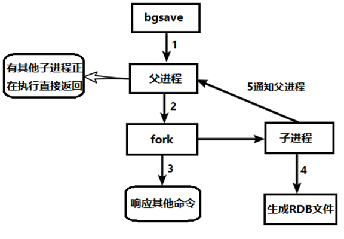
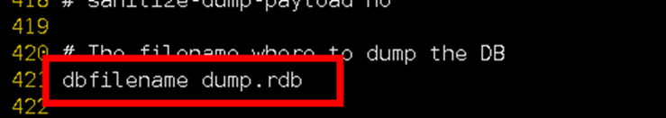
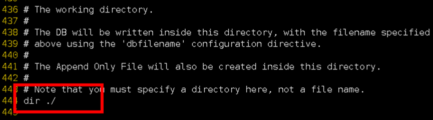
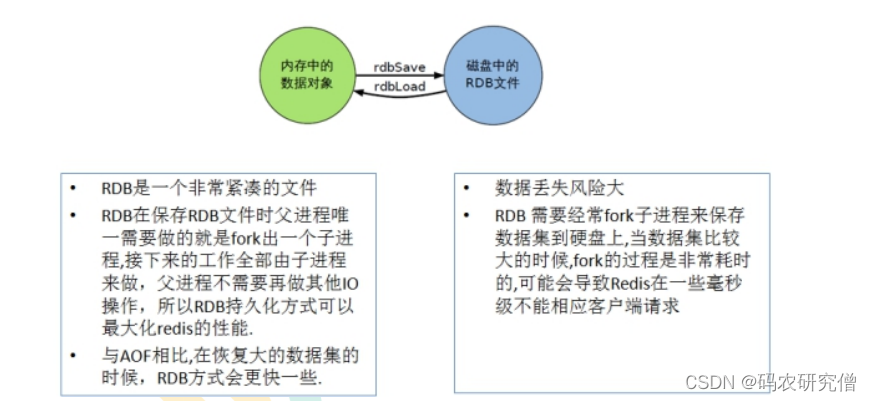
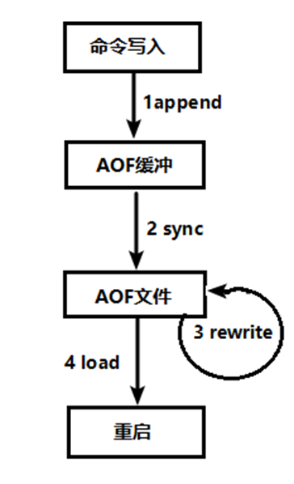
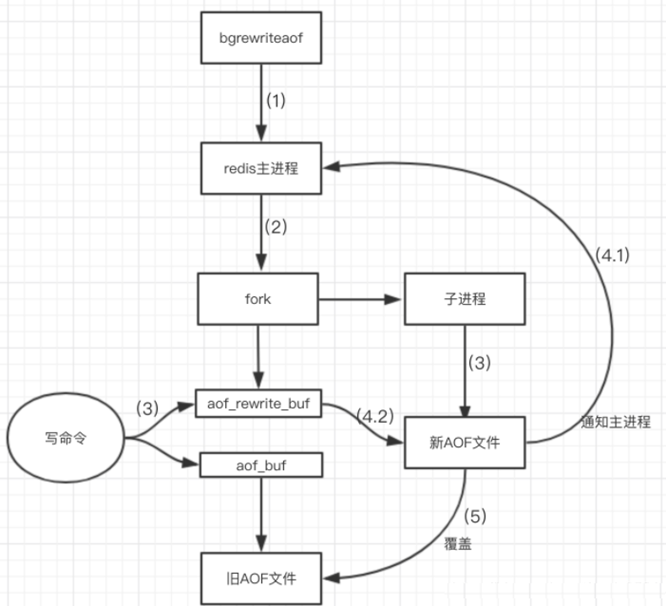
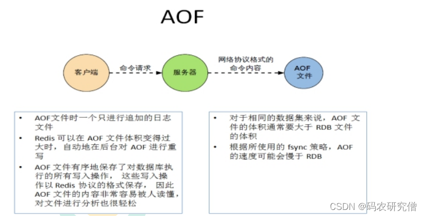

具体Redis 提供了2个不同形式的持久化方式

- RDB（Redis DataBase）
- AOF（Append Of File）

# 10.1 RDB

在指定的`时间间隔内`将内存中的`数据集快照`写入磁盘

**具体的备份流程如下：**

Redis会单独创建（fork）一个子进程来进行持久化，会先将数据写入到 一个临时文件中，待持久化过程都结束了，再用这个临时文件替换上次持久化好的文件。 整个过程中，主进程是不进行任何IO操作的，这就确保了极高的性能

- 如果需要进行大规模数据的恢复，且对于数据恢复的完整性不是非常敏感，那RDB方式要比AOF方式更加的高效。
- RDB的缺点是最后一次持久化后的数据可能丢失。

数据如果有变化的，会在`/usr/local/bin`目录下生成一个dum.rdb的文件

## **关于fork进程**

Fork的作用是复制一个与当前进程一样的进程。新进程的所有数据（变量、环境变量、程序计数器等） 数值都和原进程一致，但是是一个全新的进程，并作为原进程的子进程

- 在Linux程序中，fork()会产生一个和父进程完全相同的子进程，但子进程在此后多会exec系统调用，出于效率考虑，Linux中引入了“写时复制技术”
- 一般情况父进程和子进程会共用同一段物理内存，只有进程空间的各段的内容要发生变化时，才会将父进程的内容复制一份给子进程。

## 关于save和bgsave的比较

`save` ：save时只管保存，其它不管，全部阻塞。手动保存。不建议。

`bgsave`：Redis会在后台异步进行快照操作， 快照同时还可以响应客户端请求。可以通过lastsave 命令获取最后一次成功执行快照的时间

- `stop-writes-on-bgsave-error yes` 关闭写入磁盘操作。比如当Redis无法写入磁盘的话，直接关掉Redis的写操作

- `rdbcompression yes` 对于存储到磁盘中的快照，可以设置是否进行压缩存储，如果你不想消耗CPU来进行压缩的话，可以设置为关闭此功能。推荐yes.

- `rdbchecksum yes` 增加数据校验，增加大约10%的性能消耗，如果希望获取到最大的性能提升，可以关闭此功能

- `dbfilename dump.rdb` 在redis.conf中配置文件名称，默认为dump.rdb

- `dir ./` 默认为Redis启动时命令行所在的目录下

## 具体rdb的备份

在redis.conf中配置文件名称，默认为dump.rdb

rdb文件的保存路径，也可以修改。默认为Redis启动时命令行所在的目录下

dir "/myredis/"

**关于redis.conf配置文件的部分解释**

- save 3600
  save 300 10
  save 60 10000
  大概意思如下：save 秒钟 写操作次数，60秒传10000次的写操作。
  不设置save指令，或者给save传入空字符串

因为是临时文件，如果redis关闭之后，rdb的东西就会不见

所以通过mv 更改其名字之后`mv dump.rdb d.rdb`

在启动之前 又更改回来名字即可，mv d.rdb dump.rdb`（启动Redis, 备份数据会直接加载）

## 总结

**优点：**

- 适合大规模的数据恢复
- 对数据完整性和一致性要求不高更适合使用
- 节省磁盘空间
- 恢复速度快

**缺点：**

- Fork的时候，内存中的数据被克隆了一份，大致2倍的膨胀性需要考虑
- 虽然Redis在fork时使用了写时拷贝技术,但是如果数据庞大时还是比较消耗性能。
- 在备份周期在一定间隔时间做一次备份，所以如果Redis意外down掉的话，就会丢失最后一次快照后的所有修改。

****

##  如何停止

动态停止RDB：redis-cli config set save ""#save后给空值，表示禁用保存策略

# 10.2 AOF

以日志的形式来记录每个写操作（增量保存），将Redis执行过的所有写指令记录下来(读操作不记录)， 只许追加文件但不可以改写文件

- redis启动之初会读取该文件重新构建数据，换言之，redis 重启的话就根据日志文件的内容将写指令从前到后执行一次以完成数据的恢复工作

### AOF**持久化流程**

（1）客户端的请求写命令会被append追加到AOF缓冲区内；

（2）AOF缓冲区根据AOF持久化策略[always,everysec,no]将操作sync同步到磁盘的AOF文件中；

（3）AOF文件大小超过重写策略或手动重写时，会对AOF文件rewrite重写，压缩AOF文件容量；

（4）Redis服务重启时，会重新load加载AOF文件中的写操作达到数据恢复的目的；

###  AOF默认不开启

可以在redis.conf中配置文件名称，默认为 appendonly.aof

AOF文件的保存路径，同RDB的路径一致。

###  **AOF**和RDB同时开启，redis听谁的？

AOF和RDB同时开启，系统默认取AOF的数据（数据不会存在丢失）

### **AOF启动/修复/恢复**

AOF的备份机制和性能虽然和RDB不同, 但是备份和恢复的操作同RDB一样，都是拷贝备份文件，需要恢复时再拷贝到Redis工作目录下，启动系统即加载。

**正常恢复**

修改默认的appendonly no，改为yes

将有数据的aof文件复制一份保存到对应目录(查看目录：config get dir)

恢复：重启redis然后重新加载

 

**异常恢复**

修改默认的appendonly no，改为yes

如遇到**AOF****文件损坏**，通过/usr/local/bin/**redis-check-aof--fix appendonly.aof**进行恢复

备份被写坏的AOF文件

恢复：重启redis，然后重新加载

### **AOF**同步频率设置

appendfsync always

始终同步，每次Redis的写入都会立刻记入日志；性能较差但数据完整性比较好

appendfsync everysec

每秒同步，每秒记入日志一次，如果宕机，本秒的数据可能丢失。

appendfsync no

redis不主动进行同步，把同步时机交给操作系统。

### **Rewrite**压缩

AOF采用文件追加方式，文件会越来越大为避免出现此种情况，新增了重写机制, 当AOF文件的大小超过所设定的阈值时，Redis就会启动AOF文件的内容压缩， 只保留可以恢复数据的最小指令集.可以使用命令`bgrewriteaof`

**重写的机制：**

❤重要❤

AOF文件持续增长而过大时，会fork出一条新进程来将文件重写(也是先写临时文件最后再rename

redis4.0版本后的重写，是指上就是把rdb 的快照，以二级制的形式附在新的aof头部，作为已有的历史数据，替换掉原来的流水账操作

no-appendfsync-on-rewrite：

缓存，yes ,不写入aof文件只写入缓存，用户请求不会阻塞，但是在这段时间如果宕机会丢失这段时间的缓存数据。（降低数据安全性，提高性能）

磁盘，no，还是会把数据往磁盘里刷，但是遇到重写操作，可能会发生阻塞。（数据安全，但是性能降低）

**什么时候重写：**

Redis会记录上次重写时的AOF大小，默认配置是当AOF文件大小是上次rewrite后大小的一倍且文件大于64M时触发

重写虽然可以节约大量磁盘空间，减少恢复时间。但是每次重写还是有一定的负担的，因此设定Redis要满足一定条件才会进行重写。

- `auto-aof-rewrite-percentage`：设置重写的基准值，文件达到100%时开始重写（文件是原来重写后文件的2倍时触发）

- `auto-aof-rewrite-min-size`：设置重写的基准值，最小文件64MB。达到这个值开始重写。

**重写流程：**

（1）bgrewriteaof触发重写，判断是否当前有bgsave或bgrewriteaof在运行，如果有，则等待该命令结束后再继续执行。

（2）主进程fork出子进程执行重写操作，保证主进程不会阻塞。

（3）子进程遍历redis内存中数据到临时文件，客户端的写请求同时写入aof_buf缓冲区和aof_rewrite_buf重写缓冲区保证原AOF文件完整以及新AOF文件生成期间的新的数据修改动作不会丢失。

（4）1).子进程写完新的AOF文件后，向主进程发信号，父进程更新统计信息。2).主进程把aof_rewrite_buf中的数据写入到新的AOF文件。

（5）使用新的AOF文件覆盖旧的AOF文件，完成AOF重写

## 总结

优点：

- 备份机制更稳健，丢失数据概率更低
- 可读的日志文本，通过操作AOF稳健，可以处理误操作

缺点：

- 比起RDB占用更多的磁盘空间。
- 恢复备份速度要慢。
- 每次读写都同步的话，有一定的性能压力。
- 存在个别Bug，造成恢复不能

# 10.3 总结

- RDB持久化方式能够在指定的时间间隔能对你的数据进行快照存储

- AOF持久化方式记录每次对服务器写的操作,当服务器重启的时候会重新执行这些命令来恢复原始的数据,AOF命令以redis协议追加保存每次写的操作到文件末尾.
- Redis还能对AOF文件进行后台重写,使得AOF文件的体积不至于过大

- 只做缓存：如果你只希望你的数据在服务器运行的时候存在,你也可以不使用任何持久化方式.
- 同时开启两种持久化方式
- 在这种情况下,当redis重启的时候会优先载入AOF文件来恢复原始的数据, 因为在通常情况下AOF文件保存的数据集要比RDB文件保存的数据集要完整.

- RDB的数据不实时，同时使用两者时服务器重启也只会找AOF文件。那要不要只使用AOF呢？
- 建议不要，因为RDB更适合用于备份数据库(AOF在不断变化不好备份)， 快速重启，而且不会有AOF可能潜在的bug，留着作为一个万一的手段。