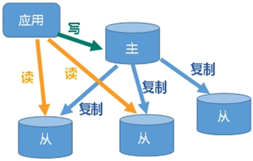
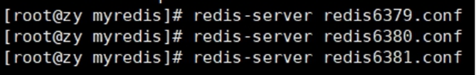
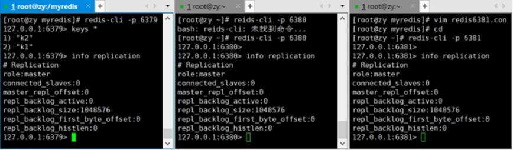
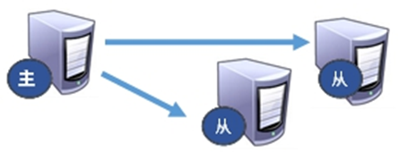
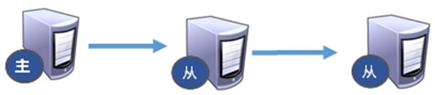
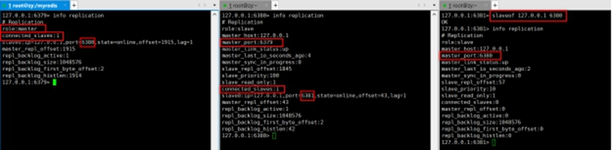
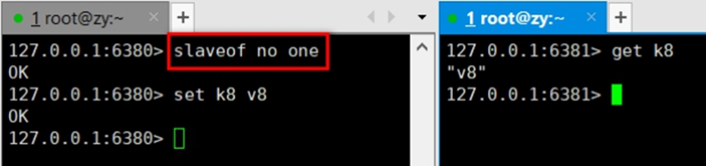
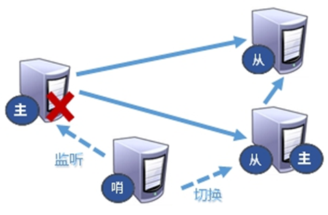
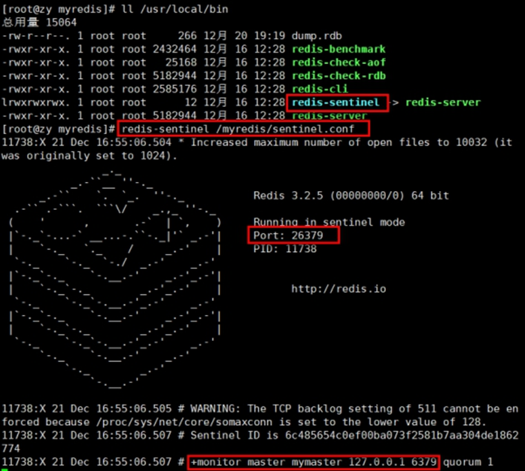
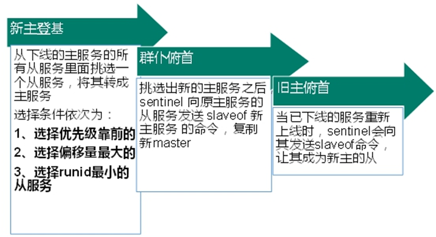

# 11. 主从复制

主机数据更新后根据配置和策略， 自动同步到备机的master/slaver机制，Master以写为主，Slave以读为主



## **主要的功能有：**

- 读写分离，性能扩展
- 容灾快速恢复


## **具体主从的复制原理：**

从机主动发送

- Slave启动成功连接到master后，从机slave会发送一个sync命令
- Master接到命令启动后台的存盘进程，同时收集所有接收到的用于修改数据集命令， 在后台进程执行完毕之后，master将传送整个数据文件到slave,以完成一次完全同步


1. 全量复制：而slave服务在接收到数据库文件数据后，将其存盘并加载到内存中。（刚开始从机连接主机，主机一次给）
2. 增量复制：Master继续将新的所有收集到的修改命令依次传给slave,完成同步 （主机修改了数据会给予从机修改的数据同步，叫做增量复制）


断开之后重新连接，只要是重新连接master,一次完全同步（全量复制)将被自动执行，rdb的数据就会给从机。

主机负责写，从机负责读


## 具体如何搭建

**redis.conf文件**


本身redis.conf文件中就有include的代码模块

所以在命令行中直接输入include 绝对路径，就可引入

具体文件的内容修改如下

开启daemonize yes 后台启动

Appendonly 关掉或者换名字，也就是不要AOF的追加，只要RDB持久化


### **实现一主两从**

步骤如下：

也就是3个配置文件

1. 新建一个`redis6379.conf`文件
   代码格式如下

```properties
include /myredis/redis.conf
pidfile /var/run/redis_6379.pid
port 6379
dbfilename dump6379.rdb
```

其他两个文件同理，只需要修改其pid进程号以及端口号，生成的rdb文件名


2. 启动三台服务器
   分别是`redis-server 配置文件`
   以及登录进入`redis-cli -p 端口号`

   


3. 登录进入之后，查看其主机运行的情况：`info replication`
   其都是主机，而没有从机

   

   

4. 为了显示一主两从
   再登录进入的从机上输入：`slaveof <ip><port>`
   在6380和6381上执行: `slaveof 127.0.0.1 6379`


### 情况1：一主两仆

主机挂掉，执行shutdown
从机`info replication`还是显示其主机是挂掉的哪个

如果从机挂掉，执行shutdown
主机开始写数据，从机在开启的时候，恢复数据的时候是从主机从头开始追加的




### 情况2：薪火相传

上一个Slave可以是下一个slave的Master，Slave同样可以接收其他 slaves的连接和同步请求，那么该slave作为了链条中下一个的master, 可以有效减轻master的写压力,去中心化降低风险。


从机的大哥是另一台从机的意思

用 slaveof <ip><port> ，中途变更转向:会清除之前的数据，重新建立拷贝最新的

风险是一旦某个slave宕机，后面的slave都没法备份

主机挂了，从机还是从机，无法写数据了






### 情况3：反客为主

当一个master宕机后，后面的slave可以立刻升为master，其后面的slave不用做任何修改
可以使用命令：`slaveof no one` 将从机变为主机




## 哨兵模式

主要是为了监控主机宕机之后，从机可以立马变为主机，就和上面的反客为主一样，不用手动设置

能够后台监控主机是否故障，如果故障了根据投票数自动将从库转换为主库



**自定义的/myredis**再目录中新建一个文件`sentinel.conf`，文件格式不能出错

文件内容为

```
sentinel monitor mymaster 127.0.0.1 6379 1
```

代码的含义为 `sentinel`哨兵，监控，一个id（别名），ip加端口号

其中mymaster为监控对象起的服务器名称， 1 为至少有多少个哨兵同意迁移的数量。


启动哨兵模式通过redis的bin目录下

命令如下：`redis-sentinel /sentinel.conf`




**具体哪个从机会变成主机**

其判定规则主要为

（顺序依次往下，优先级》偏移量》runid）

- 优先级在redis.conf中默认：slave-priority 100，值越小优先级越高
- 偏移量是指获得原主机数据最全的，也就是数据越多，变主机的机会越大
- 每个redis实例启动后都会随机生成一个40位的runid




在这里也有个缺点就是复制会有延时

由于所有的写操作都是先在Master上操作，然后同步更新到Slave上，所以从Master同步到Slave机器有一定的延迟，当系统很繁忙的时候，延迟问题会更加严重，Slave机器数量的增加也会使这个问题更加严重。


## java代码结合

主要是ip端口号的连接

以及主机名称`new JedisSentinelPool("mymaster",sentinelSet,jedisPoolConfig);`

```java
private static JedisSentinelPool jedisSentinelPool=null;

public static  Jedis getJedisFromSentinel(){
    if(jedisSentinelPool==null){
        Set<String> sentinelSet=new HashSet<>();
        sentinelSet.add("192.168.11.103:26379");

        JedisPoolConfig jedisPoolConfig =new JedisPoolConfig();
        jedisPoolConfig.setMaxTotal(10); //最大可用连接数
        jedisPoolConfig.setMaxIdle(5); //最大闲置连接数
        jedisPoolConfig.setMinIdle(5); //最小闲置连接数
        jedisPoolConfig.setBlockWhenExhausted(true); //连接耗尽是否等待
        jedisPoolConfig.setMaxWaitMillis(2000); //等待时间
        jedisPoolConfig.setTestOnBorrow(true); //取连接的时候进行一下测试 ping pong

        jedisSentinelPool=new JedisSentinelPool("mymaster",sentinelSet,jedisPoolConfig);
        return jedisSentinelPool.getResource();
    }else{
        return jedisSentinelPool.getResource();
    }
}
```

