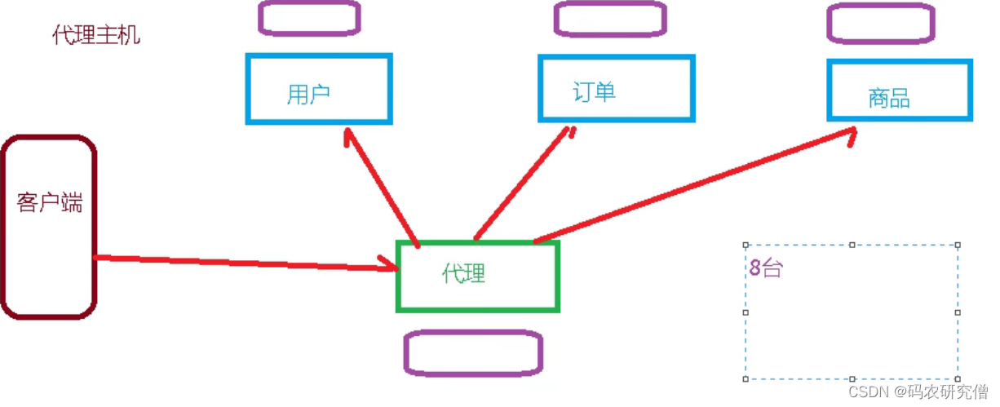
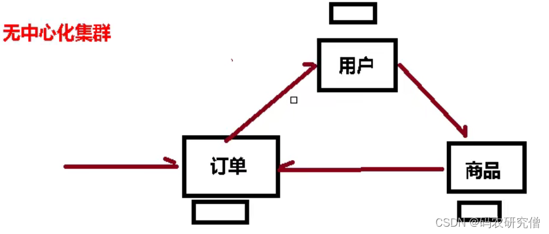
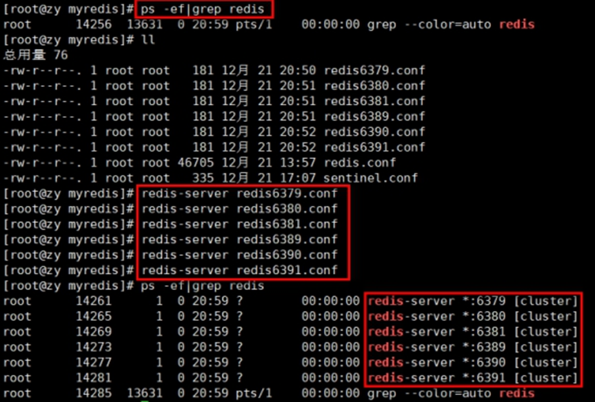

# 12. 集群


容量不够，并发写操作等问题
通过引入集群，也就是可以多个主机可以操作


另外，主从模式，薪火相传模式，主机宕机，导致ip地址发生变化，应用程序中配置需要修改对应的主机地址、端口等信息。
之前通过代理主机来解决，但是redis3.0中提供了解决方案。就是无中心化集群配置。

所谓的代理主机



所谓的无中心化集群




## 集群的定义：

Redis 集群实现了对Redis的水平扩容，即启动N个redis节点，将整个数据库分布存储在这N个节点中，每个节点存储总数据的1/N。

Redis 集群通过分区（partition）来提供一定程度的可用性（availability）： 即使集群中有一部分节点失效或者无法进行通讯， 集群也可以继续处理命令请求


## **搭建集群的步骤：**

1. 将rdb,aof文件都删除掉
2. 配置基本的redis.conf文件
   文件定义大致如下：
   比前面的文件多了三个

开启集群

节点名字

超时时间

```properties
include /myredis/redis.conf
pidfile "/var/run/redis_6391.pid"
port 6391
dbfilename "dump6391.rdb"
cluster-enabled yes
cluster-config-file nodes-6391.conf
cluster-node-timeout 15000
```

cluster-enabled yes  打开集群模式

cluster-config-file nodes-6379.conf 设定节点配置文件名

cluster-node-timeout 15000  设定节点失联时间，超过该时间（毫秒），集群自动进行主从切换。


再打开vi或者vim的时候可以输入这种命令 进行一键修改`%s/6379/6380`，将其6379修改为6380


3. 将其服务都启动，会有节点node出现，确保所有的节点都出现后，配置其集群

   

4. 到redis的src目录中
   执行该命令

```bash
redis-cli --cluster create --cluster-replicas 1 192.168.242.110:6379 192.168.242.110:6380 192.168.242.110:6381 192.168.242.110:6389 192.168.242.110:6390 192.168.242.110:6391
```

p一定要真实ip，不能是localhost或者127.0.0.1

 --replicas 1 采用最简单的方式配置集群，一台主机，一台从机，正好三组。


集群的启动要多加一个`- c`的参数，而且哪一个启动都可以，`redis-cli -c -p 6379`

如果以普通方式登

可能直接进入读主机，存储数据时，会出现MOVED重定向操作。所以，应该以集群方式登录登录进入之后，可以通过查看集群信息，`cluster nodes`


redis cluster 如何分配这六个节点

一个集群至少要有三个主节点。

选项 --cluster-replicas 1 表示我们希望为集群中的每个主节点创建一个从节点。

分配原则尽量保证每个主数据库运行在不同的IP地址，每个从库和主库不在一个IP地址上。


**故障**

如果某个主机宕机了，从机上位变主机，之前那个主机上线之后，就会变成从机

那如果主从都宕机了，也就是负责该服务的主从都宕机了

就看具体的配置

```
cluster-require-full-coverage
```

- 为yes ，那么 ，整个集群都挂掉
- 为no ，那么，该插槽数据全都不能使用，也无法存储。


## slots

一个 Redis 集群包含 16384 个插槽（hash slot）， 数据库中的每个键都属于这 16384 个插槽的其中一个，

集群使用公式 CRC16(key) % 16384 来计算键 key 属于哪个槽， 其中 CRC16(key) 语句用于计算键 key 的 CRC16 校验和 。

集群中的每个节点负责处理一部分插槽。 举个例子， 如果一个集群可以有主节点， 其中：

节点 A 负责处理 0 号至 5460 号插槽。

节点 B 负责处理 5461 号至 10922 号插槽。

节点 C 负责处理 10923 号至 16383 号插槽


在redis-cli每次录入、查询键值，redis都会计算出该key应该送往的插槽，如果不是该客户端对应服务器的插槽，redis会报错，并告知应前往的redis实例地址和端口

- 查询集群中的值，`CLUSTER KEYSLOT k1`
- 查询卡槽中key的数量，`CLUSTER COUNTKEYSINSLOT 12706`
- 查询指定卡槽返回key的数量，`CLUSTER GETKEYSINSLOT 5474 2`


如果在集群中录入值，录一个值，会根据计算进入到某个主从的卡槽值
如果传输多个值，要使用到分组的技术，在用mset 同时设置多个值的时候，需要把这些key放到同一个组中，不然会报错。可以通过{}来定义组的概念，从而使key中{}内相同内容的键值对放到一个slot中去


## java代码结合

即使连接的不是主机，集群会自动切换主机存储。主机写，从机读。
无中心化主从集群。无论从哪台主机写的数据，其他主机上都能读到数据

```java
public class JedisClusterTest {
    public static void main(String[] args) {
        HostAndPort hostAndPort = new HostAndPort("192.168.242.110", 6381);
        JedisCluster jedisCluster = new JedisCluster(hostAndPort);
        jedisCluster.set("k5","v5");
        String k5 = jedisCluster.get("k5");
        System.out.println(k5);
    }
}
```


## 优势劣势

优势：

- 实现扩容
- 分摊压力
- 无中心配置相对简单


劣势：

- 多键操作是不被支持的
- 多键的Redis事务是不被支持的。lua脚本不被支持
- 由于集群方案出现较晚，很多公司已经采用了其他的集群方案，而代理或者客户端分片的方案想要迁移至redis cluster，需要整体迁移而不是逐步过渡，复杂度较大。