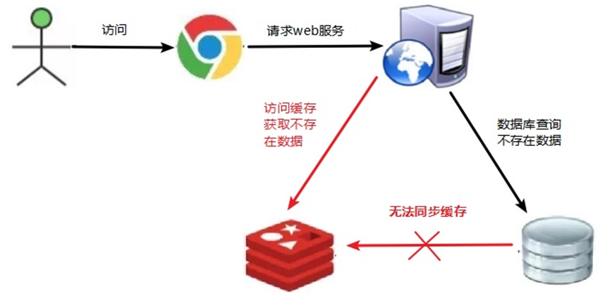
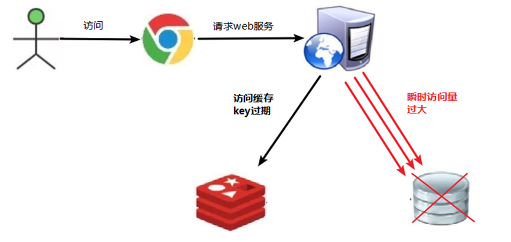
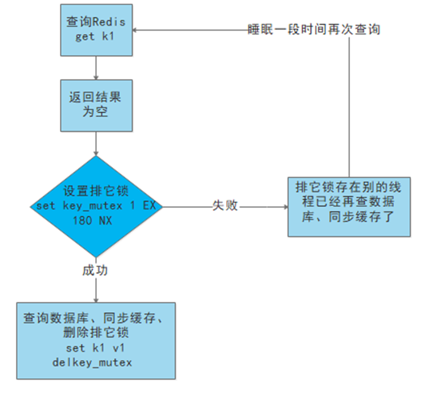
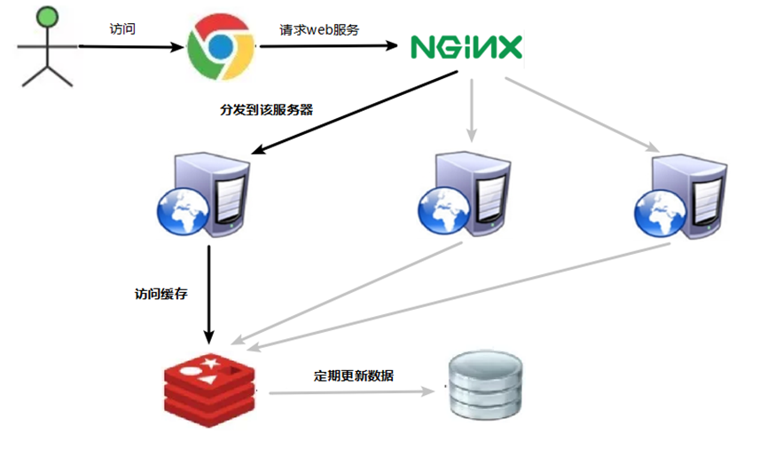
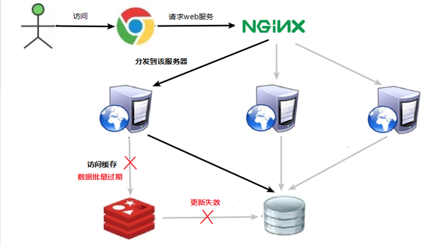
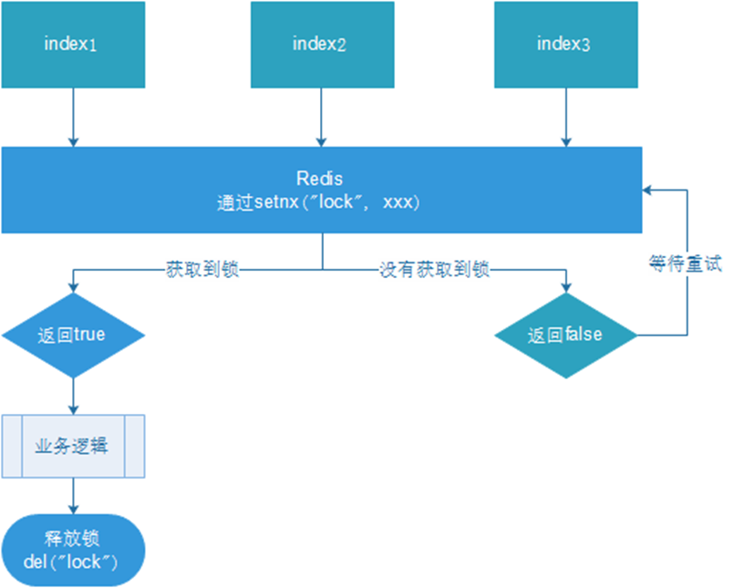
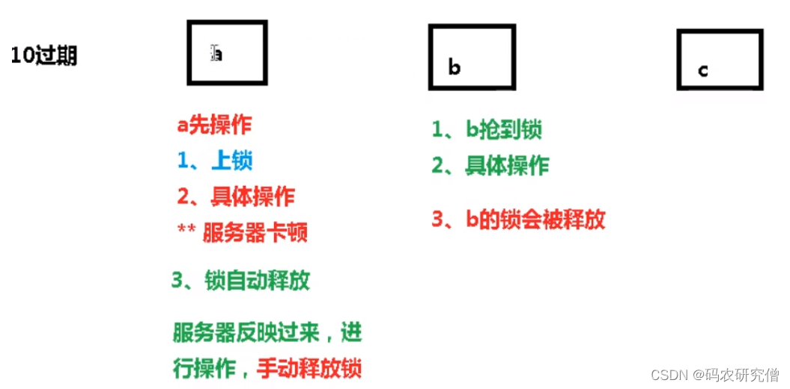
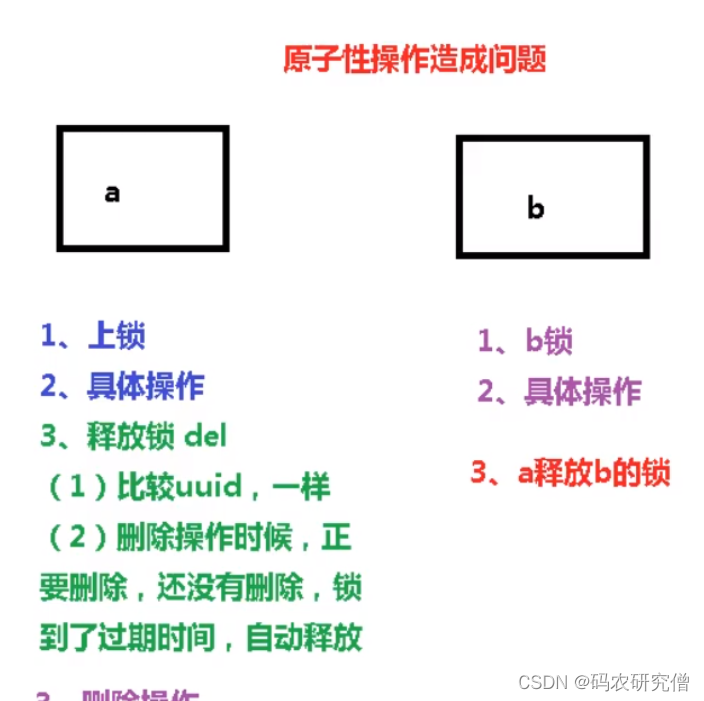
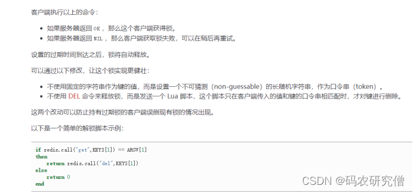

## 缓存穿透

key对应的数据在数据源并不存在，每次针对此key的请求从缓存获取不到，请求都会压到数据源，从而可能压垮数据源。比如用一个不存在的用户id获取用户信息，不论缓存还是数据库都没有，若黑客利用此漏洞进行攻击可能压垮数据库

通俗的来说：访问的数据缓存找不到，一直转而发送到数据库



解决方案：

一个一定不存在缓存及查询不到的数据，由于缓存是不命中时被动写的，并且出于容错考虑，如果从存储层查不到数据则不写入缓存，这将导致这个不存在的数据每次请求都要到存储层去查询，失去了缓存的意义


（1）对空值缓存：如果一个查询返回的数据为空（不管是数据是否不存在），我们仍然把这个空结果（null）进行缓存，设置空结果的过期时间会很短，最长不超过五分钟

（2）设置可访问的名单（白名单）：
使用bitmaps类型定义一个可以访问的名单，名单id作为bitmaps的偏移量，每次访问和bitmap里面的id进行比较，如果访问id不在bitmaps里面，进行拦截，不允许访问。

（3）采用布隆过滤器：(布隆过滤器（Bloom Filter）是1970年由布隆提出的。它实际上是一个很长的二进制向量(位图)和一系列随机映射函数（哈希函数）。布隆过滤器可以用于检索一个元素是否在一个集合中。它的优点是空间效率和查询时间都远远超过一般的算法，缺点是有一定的误识别率和删除困难。)
将所有可能存在的数据哈希到一个足够大的bitmaps中，一个一定不存在的数据会被 这个bitmaps拦截掉，从而避免了对底层存储系统的查询压力。

（4）进行实时监控：当发现Redis的命中率开始急速降低，需要排查访问对象和访问的数据，和运维人员配合，可以设置黑名单限制服务


总结如下：

1. 设置空值缓存，而且设置超时时间
2. 通过bitmap的位运算进行存储，数据量比较小
3. 实时监控，将其禁止访问


## 缓存击穿

key对应的数据存在，但在redis中过期，此时若有大量并发请求过来，这些请求发现缓存过期一般都会从后端DB加载数据并回设到缓存，这个时候大并发的请求可能会瞬间把后端DB压垮

也就是一个key过期，一直访问数据库



解决方案：

key可能会在某些时间点被超高并发地访问，是一种非常“热点”的数据。这个时候，需要考虑一个问题：缓存被“击穿”的问题。


（1）预先设置热门数据：在redis高峰访问之前，把一些热门数据提前存入到redis里面，加大这些热门数据key的时长

（2）实时调整：现场监控哪些数据热门，实时调整key的过期时长

（3）使用锁：先判断值是否为空再让他进来与否

​		（1）  就是在缓存失效的时候（判断拿出来的值为空），不是立即去load db。

​		（2）  先使用缓存工具的某些带成功操作返回值的操作（比如Redis的SETNX）去set一个mutex key

​		（3）  当操作返回成功时，再进行load db的操作，并回设缓存,最后删除mutex key；

​		（4）  当操作返回失败，证明有线程在load db，当前线程睡眠一段时间再重试整个get缓存的方法。




总结如下：

设置热门的key，加大时长过期

实时监控调整


## 缓存雪崩

key对应的数据存在，但在redis中过期，此时若有大量并发请求过来，这些请求发现缓存过期一般都会从后端DB加载数据并回设到缓存，这个时候大并发的请求可能会瞬间把后端DB压垮。

缓存雪崩与缓存击穿的区别在于这里针对很多key缓存，前者则是某一个key正常访问






解决方案：

（1）构建多级缓存架构：nginx缓存 + redis缓存 +其他缓存（ehcache等）

（2）使用锁或队列：

用加锁或者队列的方式保证来保证不会有大量的线程对数据库一次性进行读写，从而避免失效时大量的并发请求落到底层存储系统上。不适用高并发情况

（3）设置过期标志更新缓存：
记录缓存数据是否过期（设置提前量），如果过期会触发通知另外的线程在后台去更新实际key的缓存。

（4）将缓存失效时间分散开：
比如我们可以在原有的失效时间基础上增加一个随机值，比如1-5分钟随机，这样每一个缓存的过期时间的重复率就会降低，就很难引发集体失效的事件。


总结如下：

1. 设置多个级别的缓存架构，时间来得及缓冲
2. 使用锁的机制
3. 设置一个过期时间标志来通知
4. 将过期时间分散，比如5分钟、5.01分钟等


## 分布式锁

由于分布式系统多线程、多进程并且分布在不同机器上，这将使原单机部署情况下的并发控制锁策略失效，单纯的Java API并不能提供分布式锁的能力。为了解决这个问题就需要一种跨JVM的互斥机制来控制共享资源的访问

也就是在这个机器上了锁，另外一个机器也要可以识别到这个锁，也就是共享锁，都是同一把锁

解决方案如下：

1. 基于数据库实现分布式锁
2. 基于缓存（Redis等）
3. 基于Zookeeper


每一种分布式锁解决方案都有各自的优缺点：

1. 性能：redis最高
2. 可靠性：zookeeper最高


这里，我们就基于redis实现分布式锁

- setnx 上锁，通过del 解释
- 锁一直没有释放，可以通过设置过期时间来自动释放


但是如果上锁之后就断电了

解决方法为

可以边上锁边设置过期时间，通过命令`set users 10 nx ex 12`，nx为上锁，ex为过期时间




结合java代码具体的实现如下
也就是湖区锁之后，也加入一个时间限制

```java
@GetMapping("testLock")
public void testLock(){
    //1获取锁，setne ,顺便设置过期时间
    Boolean lock = redisTemplate.opsForValue().setIfAbsent("lock", "111",3,TimeUnit.SECONDS);
    //2获取锁成功、查询num的值
    if(lock){
        Object value = redisTemplate.opsForValue().get("num");
        //2.1判断num为空return
        if(StringUtils.isEmpty(value)){
            return;
        }
        //2.2有值就转成成int
        int num = Integer.parseInt(value+"");
        //2.3把redis的num加1
        redisTemplate.opsForValue().set("num", ++num);
        //2.4释放锁，del
        redisTemplate.delete("lock");

    }else{
        //3获取锁失败、每隔0.1秒再获取
        try {
            Thread.sleep(100);
            testLock();
        } catch (InterruptedException e) {
            e.printStackTrace();
        }
    }
}
```


### UUID防止误删

上面代码操作可能会出现，在解锁的时候刚好设置的时间结束了
而导致锁解错了



为此应该多一个判断是否是你的锁，虽然是共享锁，都是一样的，但是可以上锁之后在设置时间，还要给每个用户的这把锁都来一个uuid

具体代码如下

```java
@GetMapping("testLock")
public void testLock(){
	String uuid = UUID.randomUUID().toString();
    //1获取锁，setne ,顺便设置过期时间
    Boolean lock = redisTemplate.opsForValue().setIfAbsent("lock", uuid,3,TimeUnit.SECONDS);
    //2获取锁成功、查询num的值
    if(lock){
       ...
        String lockUuid = (String)redisTemplate.opsForValue().get("lock");
        if(uuid.equals(lockUuid)){
             //2.4释放锁，del
        	redisTemplate.delete("lock");
        }
    }else{
       ...
    }
}
```


### lua脚本保证原子性

问题又来了
如果在判断它的uuid相等之后，正准备解锁，发现又误解他人锁
所以引入lua脚本保证它的原子性



代码如下

```java
@GetMapping("testLockLua")
public void testLockLua() {
    //1 声明一个uuid ,将做为一个value 放入我们的key所对应的值中
    String uuid = UUID.randomUUID().toString();
    //2 定义一个锁：lua 脚本可以使用同一把锁，来实现删除！
    String skuId = "25"; // 访问skuId 为25号的商品 100008348542
    String locKey = "lock:" + skuId; // 锁住的是每个商品的数据

    // 3 获取锁
    Boolean lock = redisTemplate.opsForValue().setIfAbsent(locKey, uuid, 3, TimeUnit.SECONDS);

    // 第一种： lock 与过期时间中间不写任何的代码。
    // redisTemplate.expire("lock",10, TimeUnit.SECONDS);//设置过期时间
    // 如果true
    if (lock) {
        // 执行的业务逻辑开始
        // 获取缓存中的num 数据
        Object value = redisTemplate.opsForValue().get("num");
        // 如果是空直接返回
        if (StringUtils.isEmpty(value)) {
            return;
        }
        // 不是空 如果说在这出现了异常！ 那么delete 就删除失败！ 也就是说锁永远存在！
        int num = Integer.parseInt(value + "");
        // 使num 每次+1 放入缓存
        redisTemplate.opsForValue().set("num", String.valueOf(++num));
        /*使用lua脚本来锁*/
        // 定义lua 脚本
        String script = "if redis.call('get', KEYS[1]) == ARGV[1] then return redis.call('del', KEYS[1]) else return 0 end";
        // 使用redis执行lua执行
        DefaultRedisScript<Long> redisScript = new DefaultRedisScript<>();
        redisScript.setScriptText(script);
        // 设置一下返回值类型 为Long
        // 因为删除判断的时候，返回的0,给其封装为数据类型。如果不封装那么默认返回String 类型，
        // 那么返回字符串与0 会有发生错误。
        redisScript.setResultType(Long.class);
        // 第一个要是script 脚本 ，第二个需要判断的key，第三个就是key所对应的值。
        redisTemplate.execute(redisScript, Arrays.asList(locKey), uuid);
    } else {
        // 其他线程等待
        try {
            // 睡眠
            Thread.sleep(1000);
            // 睡醒了之后，调用方法。
            testLockLua();
        } catch (InterruptedException e) {
            e.printStackTrace();
        }
    }
}
```

关于lua的解释如下




总结如下：

1. 加锁

```java
// 1. 从redis中获取锁,set k1 v1 px 20000 nx
String uuid = UUID.randomUUID().toString();
Boolean lock = this.redisTemplate.opsForValue()
      .setIfAbsent("lock", uuid, 2, TimeUnit.SECONDS);
```

2. lua释放锁

```java
// 2. 释放锁 del
String script = "if redis.call('get', KEYS[1]) == ARGV[1] then return redis.call('del', KEYS[1]) else return 0 end";
// 设置lua脚本返回的数据类型
DefaultRedisScript<Long> redisScript = new DefaultRedisScript<>();
// 设置lua脚本返回类型为Long
redisScript.setResultType(Long.class);
redisScript.setScriptText(script);
redisTemplate.execute(redisScript, Arrays.asList("lock"),uuid);
```

3. 重试

```java
Thread.sleep(500);
testLock();
```


### 总结

为了确保分布式锁可用，我们至少要确保锁的实现同时满足以下四个条件：

同一时间只有一个人有锁，而且开锁解锁都是同一个人，不会死锁

- 互斥性。在任意时刻，只有一个客户端能持有锁。
- 不会发生死锁。即使有一个客户端在持有锁的期间崩溃而没有主动解锁，也能保证后续其他客户端能加锁。
- 解铃还须系铃人。加锁和解锁必须是同一个客户端，客户端自己不能把别人加的锁给解了。
- 加锁和解锁必须具有原子性