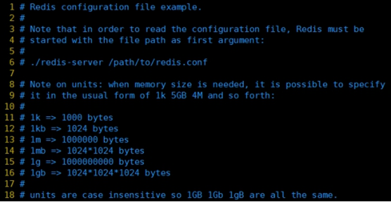
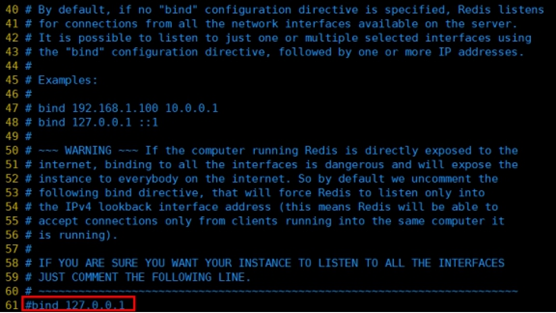
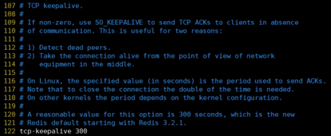
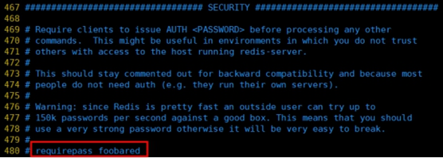
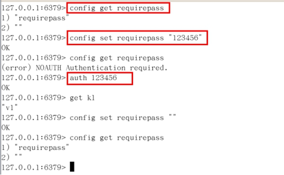
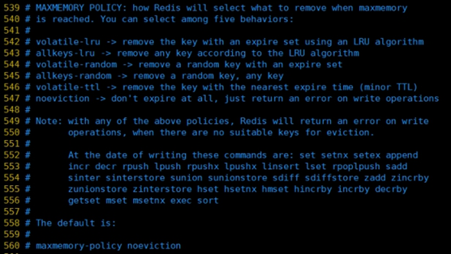

自定义目录：/etc/redis.conf

# 4.1 ###Units单位###

配置大小单位,开头定义了一些基本的度量单位，只支持bytes，不支持bit

大小写不敏感

---

# 4.2 ###INCLUDES包含###

类似jsp中的include，多实例的情况可以把公用的配置文件提取出来

---

# 4.3 ###网络相关配置###

## 4.3.1 bind

默认情况bind=127.0.0.1只能接受本机的访问请求

不写的情况下，无限制接受任何ip地址的访问

生产环境肯定要写你应用服务器的地址；服务器是需要远程访问的，所以需要将其注释掉

如果开启了protected-mode，那么在没有设定bind ip且没有设密码的情况下，Redis只允许接受本机的响应

保存配置，停止服务，重启启动查看进程，不再是本机访问了。

---

## 4.3.2 protected-mode

将本机访问保护模式设置no

---

## 4.3.3 Port

端口号，默认 6379

---

## 4.3.4 tcp-backlog

设置tcp的backlog，backlog其实是一个连接队列，backlog队列总和=未完成三次握手队列 + 已经完成三次握手队列。

在高并发环境下你需要一个高backlog值来避免慢客户端连接问题。

注意Linux内核会将这个值减小到/proc/sys/net/core/somaxconn的值（128），所以需要确认增大/proc/sys/net/core/somaxconn和/proc/sys/net/ipv4/tcp_max_syn_backlog（128）两个值来达到想要的效果

---

## 4.3.5 timeout

一个空闲的客户端维持多少秒会关闭，0表示关闭该功能。即**永不关闭**。

---

## 4.3.6 tcp-keepalive

对访问客户端的一种**心跳检测**，每个n秒检测一次。

单位为秒，如果设置为0，则不会进行Keepalive检测，建议设置成60 

---

# 4.4 ###GENERAL通用###

## 4.4.1 daemonize

是否为后台进程，设置为yes

守护进程，后台启动

---

## 4.4.2 pidfile

存放pid文件的位置，每个实例会产生一个不同的pid文件

---

## 4.4.3 loglevel

指定日志记录级别，Redis总共支持四个级别：debug、verbose、notice、warning，默认为**notice**

四个级别根据使用阶段来选择，生产环境选择notice 或者warning

---

## 4.4.4 logfile

日志文件名称

---

## 4.4.5 databases 16

设定库的数量 默认16，默认数据库为0，可以使用SELECT <dbid>命令在连接上指定数据库id

---

# 4.5 ###SECURITY安全###

## 4.5.1 设置密码

访问密码的查看、设置和取消

在命令中设置密码，只是临时的。重启redis服务器，密码就还原了。

永久设置，需要再配置文件中进行设置。

---

# 4.6 #### LIMITS限制###

## 4.6.1 maxclients

Ø 设置redis同时可以与多少个客户端进行连接。

Ø 默认情况下为10000个客户端。

Ø 如果达到了此限制，redis则会拒绝新的连接请求，并且向这些连接请求方发出“max number of clients reached”以作回应。

----

## 4.6.2 maxmemory

Ø 建议**必须设置**，否则，将内存占满，造成服务器宕机

Ø 设置redis可以使用的内存量。一旦到达内存使用上限，redis将会试图移除内部数据，移除规则可以通过**maxmemory-policy**来指定。

Ø 如果redis无法根据移除规则来移除内存中的数据，或者设置了“不允许移除”，那么redis则会针对那些需要申请内存的指令返回错误信息，比如SET、LPUSH等。

Ø 但是对于无内存申请的指令，仍然会正常响应，比如GET等。如果你的redis是主redis（说明你的redis有从redis），那么在设置内存使用上限时，需要在系统中留出一些内存空间给同步队列缓存，只有在你设置的是“不移除”的情况下，才不用考虑这个因素。

---

## 4.6.3 maxmemory-policy

Ø volatile-lru：使用LRU算法移除key，只对设置了过期时间的键；（最近最少使用）

Ø allkeys-lru：在所有集合key中，使用LRU算法移除key

Ø volatile-random：在过期集合中移除随机的key，只对设置了过期时间的键

Ø allkeys-random：在所有集合key中，移除随机的key

Ø volatile-ttl：移除那些TTL值最小的key，即那些最近要过期的key

Ø noeviction：不进行移除。针对写操作，只是返回错误信息

---

## 4.6.4 maxmemory-samples

Ø 设置样本数量，LRU算法和最小TTL算法都并非是精确的算法，而是估算值，所以你可以设置样本的大小，redis默认会检查这么多个key并选择其中LRU的那个。

Ø 一般设置3到7的数字，数值越小样本越不准确，但性能消耗越小。

