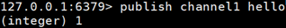
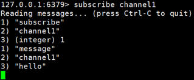

# 5.1 什么是发布和订阅


Redis 发布订阅 (pub/sub) 是一种消息通信模式：发送者 (pub) 发送消息，订阅者 (sub) 接收消息。

 

Redis 客户端可以订阅任意数量的频道。


---


# 5.2 Redis的发布和订阅


1、客户端可以订阅频道如下图


2、当给这个频道发布消息后，消息就会发送给订阅的客户端


---


# 5.3 发布订阅命令行实现


1、 打开一个客户端订阅channel1

```bash
SUBSCRIBE channel1
```


2、打开另一个客户端，给channel1发布消息hello

```bash
publish channel1 hello
```



返回的1是订阅者数量


3、打开第一个客户端可以看到发送的消息



注：发布的消息没有持久化，如果在订阅的客户端收不到hello，只能收到订阅后发布的消息