# Jedis操作Redis

在xml中配置

```xml
<!-- https://mvnrepository.com/artifact/redis.clients/jedis -->
    <dependencies>
        <dependency>
            <groupId>redis.clients</groupId>
            <artifactId>jedis</artifactId>
            <version>3.6.1</version>
        </dependency>
    </dependencies>
```

在类中定义

```java
public class JedisDemo1 {
    public static void main(String[] args) {
        //创建Jedis对象
        Jedis jedis = new Jedis("192.168.242.110", 6379);
        //测试
        String ping = jedis.ping();
        System.out.println(ping);
    }
}
```

结果显示为：

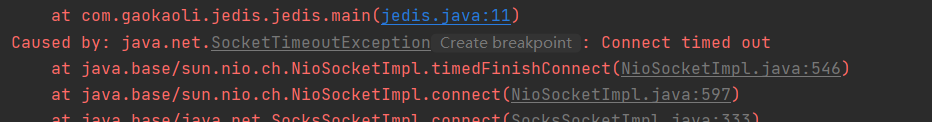

原因可能是：

- 防火墙要关闭，`systemctl stop/disable firewalld.service`
- 设置可远程访问，注释掉bind，`#bind 127.0.0.1 -::1` ，可远程访问
- 设置保护模式为no，`protected-mode no`

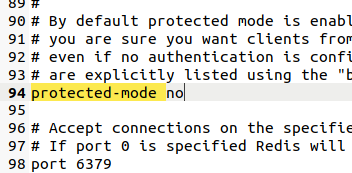

之后的结果为

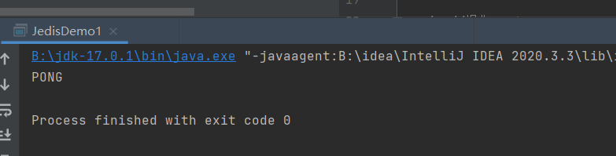


或者这样测试也可,代码如下：

```java
public class JedisDemo1 {

    public static void main(String[] args) {

        Jedis jedis = new Jedis("192.168.242.110", 6379);

        System.out.println(jedis.getClient().getPort());
        System.out.println("连接本地的Redis服务器成功");
        //查看服务是否运行
        System.out.println("服务正在运行：" + jedis.ping());

    }
}
```

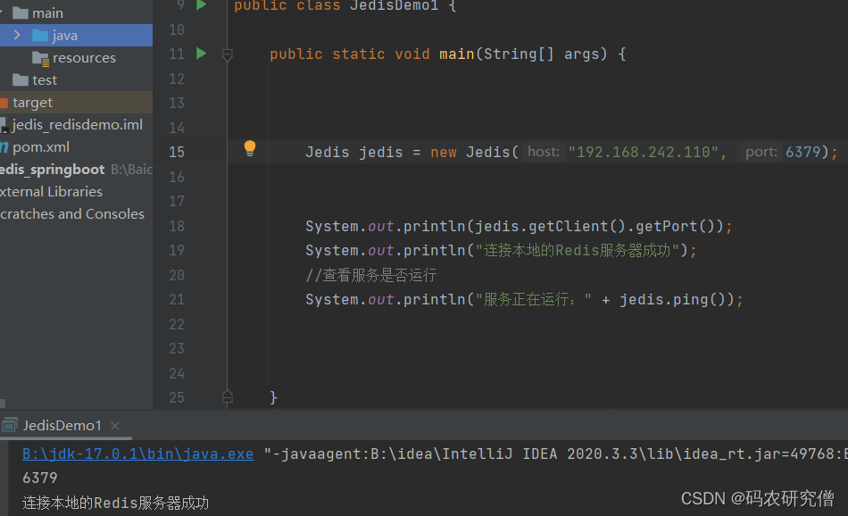


配合上面的数据类型，添加数据的代码演示

```java
Jedis jedis = new Jedis("127.0.0.1", 6379);
        Set<String> keys = jedis.keys("*");
        for(String key:keys){
            System.out.println("key");
        }
```


##  类型测试

### key的测试

代码如下

```java
jedis.set("k1", "v1");
jedis.set("k2", "v2");
jedis.set("k3", "v3");
Set<String> keys = jedis.keys("*");
System.out.println(keys.size());
for (String key : keys) {
System.out.println(key);
}
System.out.println(jedis.exists("k1"));
System.out.println(jedis.ttl("k1"));                
System.out.println(jedis.get("k1"));
```


### String测试代码

```java
jedis.mset("str1","v1","str2","v2","str3","v3");
System.out.println(jedis.mget("str1","str2","str3"));
```


或者通过如下代码测试

`mset`可以添加多个key-value

`mget`则是取出相对应多个key

```java
//操作key string
@Test
public void demo1() {
    //创建Jedis对象
    Jedis jedis = new Jedis("172.22.109.205",6379);

    //添加
    jedis.set("name","lucy");

    //获取
    String name = jedis.get("name");
    System.out.println(name);

    //设置多个key-value
    jedis.mset("k1","v1","k2","v2");
    List<String> mget = jedis.mget("k1", "k2");
    System.out.println(mget);

    Set<String> keys = jedis.keys("*");
    for(String key : keys) {
        System.out.println(key);
    }
    jedis.close();
}
```

测试结果如下

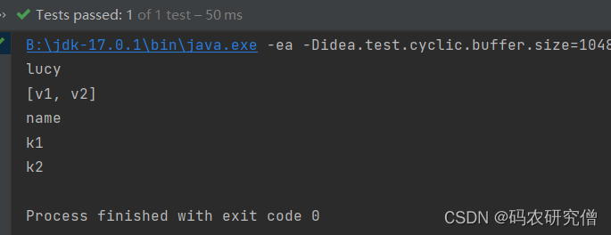


### List测试代码

```java
List<String> list = jedis.lrange("mylist",0,-1);
for (String element : list) {
System.out.println(element);
}
```

完整代码

通过lpush放到左边

lrange取出全部

输出的时候都是从右边到左边

```java
//操作list
@Test
public void demo2() {
    //创建Jedis对象
    Jedis jedis = new Jedis("172.22.109.205",6379);

    jedis.lpush("key1","lucy","mary","jack");
    List<String> values = jedis.lrange("key1", 0, -1);
    System.out.println(values);
    jedis.close();
}
```

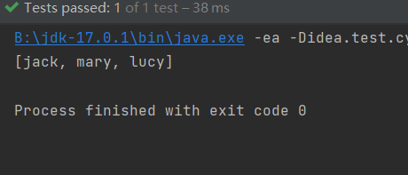


### Set测试代码

```java
jedis.sadd("orders", "order01");
jedis.sadd("orders", "order02");
jedis.sadd("orders", "order03");
jedis.sadd("orders", "order04");
Set<String> smembers = jedis.smembers("orders");
for (String order : smembers) {
System.out.println(order);
}
jedis.srem("orders", "order02");
```

完整代码如下

key可以对应多个value

sadd添加多个key-value

smembers输出多个value

srem则是删除

```java
/操作set
@Test
public void demo3() {
    //创建Jedis对象
    Jedis jedis = new Jedis("172.22.109.205",6379);

    jedis.sadd("names","lucy");
    jedis.sadd("names","mary");

    Set<String> names = jedis.smembers("names");
    System.out.println(names);
    jedis.close();
}
```

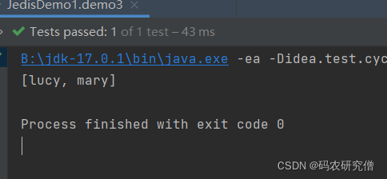


### Hash测试代码

```java
jedis.hset("hash1","userName","lisi");
System.out.println(jedis.hget("hash1","userName"));

Map<String,String> map = new HashMap<String,String>();
map.put("telphone","13810169999");
map.put("address","atguigu");
map.put("email","abc@163.com");

jedis.hmset("hash2",map);
List<String> result = jedis.hmget("hash2", "telphone","email");
for (String element : result) {
System.out.println(element);
}
```

代码演示：

```java
//操作hash
@Test
public void demo4() {
    //创建Jedis对象
    Jedis jedis = new Jedis("172.22.109.205",6379);

    jedis.hset("users","age","20");
    String hget = jedis.hget("users", "age");
    System.out.println(hget);
    jedis.close();
}
```

截图如下

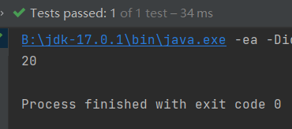


### Zset测试代码

```java
jedis.zadd("zset01", 100d, "z3");
jedis.zadd("zset01", 90d, "l4");
jedis.zadd("zset01", 80d, "w5");
jedis.zadd("zset01", 70d, "z6");
 
Set<String> zrange = jedis.zrange("zset01", 0, -1);
for (String e : zrange) {
System.out.println(e);
}
```

代码演示

```java
//操作zset
@Test
public void demo5() {
    //创建Jedis对象
    Jedis jedis = new Jedis("172.22.109.205",6379);

    jedis.zadd("china",100d,"shanghai");

    Set<String> china = jedis.zrange("china", 0, -1);
    System.out.println(china);

    jedis.close();
}
```

截图如下

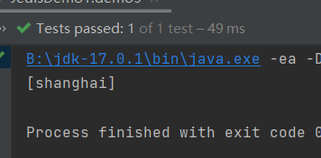


## Jedis实例-手机验证码


**要求**

1、输入手机号，点击发送后随机生成6位数字码，2分钟有效

2、输入验证码，点击验证，返回成功或失败

3、每个手机号每天只能输入3次


**思路：**

1. 生成随机6位数字验证码：Random
2. 验证码在2分钟内有效：把验证码放到redis里面，设置过期时间120秒
3. 判断验证码是否一致：从redis获取验证码和输入的验证码进行比较
4. 每个手机每天只能发送3次验证码：incr每次发送后+1，大于2的时候，提交不能发送


 **生成六位的验证码：**

```java
//1.生成6位数字验证码
public static String getCode() {
    Random random = new Random();
    String code = "";
    for(int i=0;i<6;i++) {
        int rand = random.nextInt(10);
        code += rand;
    }
    return code;
}
```


**验证码只能发送三次：**

验证码只能发送三次，通过incr进行

```java
//2 每个手机每天只能发送三次，验证码放到redis中，设置过期时间120
public static void verifyCode(String phone) {
    //连接redis
    Jedis jedis = new Jedis("172.22.109.205",6379);

    //拼接key
    //手机发送次数key
    String countKey = "VerifyCode"+phone+":count";
    //验证码key
    String codeKey = "VerifyCode"+phone+":code";

    //每个手机每天只能发送三次
    String count = jedis.get(countKey);
    if(count == null) {
        //没有发送次数，第一次发送
        //设置发送次数是1
        jedis.setex(countKey,24*60*60,"1");
    } else if(Integer.parseInt(count)<=2) {
        //发送次数+1
        jedis.incr(countKey);
    } else if(Integer.parseInt(count)>2) {
        //发送三次，不能再发送
        System.out.println("今天发送次数已经超过三次");
        jedis.close();
    }

    //发送验证码放到redis里面
    String vcode = getCode();
    jedis.setex(codeKey,120,vcode);//120秒
    jedis.close();
}
```


**验证码验证相同与否：**

验证码的key 与code是否相等

```java
//3 验证码校验
public static void getRedisCode(String phone,String code) {
    //从redis获取验证码
    Jedis jedis = new Jedis("172.22.109.205",6379);
    //验证码key
    String codeKey = "VerifyCode"+phone+":code";
    String redisCode = jedis.get(codeKey);
    //判断
    if(redisCode.equals(code)) {
        System.out.println("成功");
    }else {
        System.out.println("失败");
    }
    jedis.close();
}
```


**完整功能代码展示**

```java
public class PhoneCode {

    public static void main(String[] args) {
        //模拟验证码发送
        verifyCode("13678765435");

        //模拟验证码校验
        //getRedisCode("13678765435","4444");
    }

    //3 验证码校验
    public static void getRedisCode(String phone,String code) {
        //从redis获取验证码
        Jedis jedis = new Jedis("172.22.109.205",6379);
        //验证码key
        String codeKey = "VerifyCode"+phone+":code";
        String redisCode = jedis.get(codeKey);
        //判断
        if(redisCode.equals(code)) {
            System.out.println("成功");
        }else {
            System.out.println("失败");
        }
        jedis.close();
    }

    //2 每个手机每天只能发送三次，验证码放到redis中，设置过期时间120
    public static void verifyCode(String phone) {
        //连接redis
        Jedis jedis = new Jedis("172.22.109.205",6379);

        //拼接key
        //手机发送次数key
        String countKey = "VerifyCode"+phone+":count";
        //验证码key
        String codeKey = "VerifyCode"+phone+":code";

        //每个手机每天只能发送三次
        String count = jedis.get(countKey);
        if(count == null) {
            //没有发送次数，第一次发送
            //设置发送次数是1
            jedis.setex(countKey,24*60*60,"1");
        } else if(Integer.parseInt(count)<=2) {
            //发送次数+1
            jedis.incr(countKey);
        } else if(Integer.parseInt(count)>2) {
            //发送三次，不能再发送
            System.out.println("今天发送次数已经超过三次");
            jedis.close();
            return;//超过三次之后就会自动退出不会再发送了，不添加这一行，即使显示发送次数，但还会有验证码接收到
        }

        //发送验证码放到redis里面
        String vcode = getCode();//调用生成的验证码
        jedis.setex(codeKey,120,vcode);//设置生成的验证码只有120秒的时间
        jedis.close();
    }

    //1 生成6位数字验证码，code是验证码
    public static String getCode() {
        Random random = new Random();
        String code = "";
        for(int i=0;i<6;i++) {
            int rand = random.nextInt(10);
            code += rand;
        }
        return code;
    }
}
```


测试结果如下

```java
127.0.0.1:6379> flushdb
OK
127.0.0.1:6379> keys *
(empty array)
127.0.0.1:6379> keys *
1) "VerifyCode13678765435:code"
2) "VerifyCode13678765435:count"
127.0.0.1:6379> get VerifyCode13678765435:code
"590532"
127.0.0.1:6379> get VerifyCode13678765435:count
"1"
```

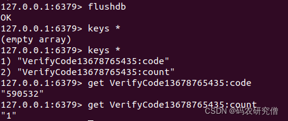

不超时的结果为

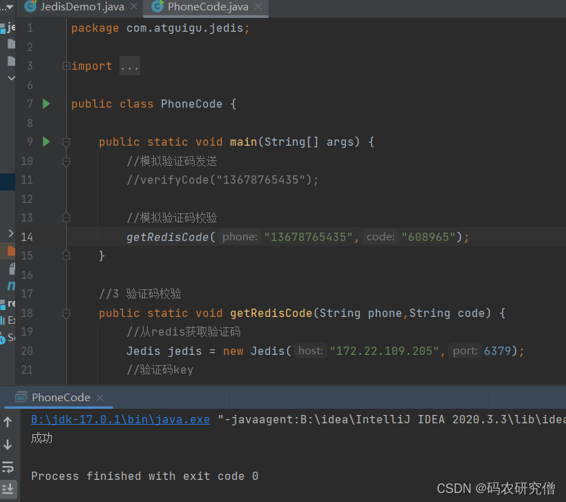


超时之后的结果为

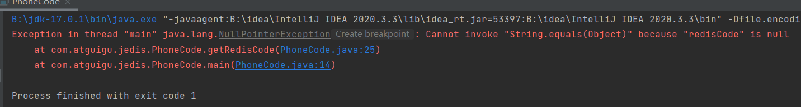