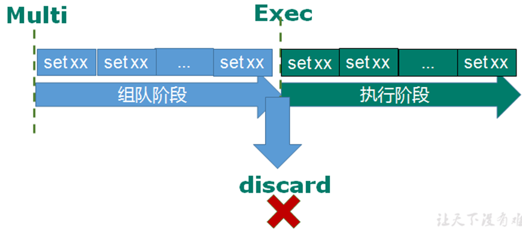

# 事务操作

- 单独的隔离操作
- 事务中的所有命令都会序列化
- 按顺序执行
- 执行的过程中，不会被其他命令请求所打断


## Redis事务三大特性：

- 单独的隔离操作（不会被打断）
- 没有隔离级别
- 不保证原子性


对比一下sql的事务特性，为acid，一致性，隔离性，原子性，持久性


而redis的事务特性没有隔离，因为都是单独的隔离而不会被打断，而且也不保证原子性，错了等待不到消息不会进行回滚


**串联多个命令防止别的命令插队**


主要的三个命令：**multi、exec和discard**



|  命令   |                功能                |
| :-----: | :--------------------------------: |
|  multi  |         组队阶段，还未执行         |
|  exec   | 执行阶段，将multi的队列放进 exec中 |
| discard |       放弃multi在队列中的值        |


输入multi的时候下一个会出现tx，代表是事务


**事务的成功：**


**事务的错误处理：**

组队的时候失败，即执行的时候也是失败

没有给予赋值value


组队的时候成功，执行的会出错

但个别指令如果出错，只有这个指令出错执行不了

组队的时候value的时候应该是一个值，而incr加不了


## 悲观锁和乐观锁

- 悲观锁：不能同时进行多人，执行的时候先上锁。传统的关系型数据库里边就用到了很多这种锁机制，比如行锁，表锁等，读锁，写锁等，都是在做操作之前先上锁

- 乐观锁：通过版本号一致与否，即给数据加上版本，同步更新数据以及加上版本号。不会上锁，判断版本号，可以多人操作，类似生活中的抢票。每次去拿数据的时候都认为别人不会修改，所以不会上锁，但是在更新的时候会判断一下在此期间别人有没有去更新这个数据，可以使用版本号等机制。乐观锁适用于多读的应用类型，这样可以提高吞吐量。Redis就是利用这种check-and-set机制实现事务的
  


通过具体案例演示悲观锁和乐观锁


在执行multi之前，执行命令`watch`

具体格式如下

```bash
watch key1 [key2]
```

具体代码格式如下

```sql
127.0.0.1:6379> flushdb
OK
127.0.0.1:6379> set add 100
OK
127.0.0.1:6379> watch add
OK
127.0.0.1:6379> multi
OK
127.0.0.1:6379(TX)> incrby add 20
QUEUED
127.0.0.1:6379(TX)> exec
1) (integer) 120
127.0.0.1:6379> 
```

`flushdb`是清空数据库


但如果在另一个服务器上，输入exec，会显示出错

因为用的是乐观锁，被修改了之后版本会发生改变


## 事务的秒杀示例

解决计数器和人员记录的事务操作


**主要的实现功能是**

在redis存入商品数，设定秒杀时间，提供用户秒杀窗口，用户秒杀成功，redis中商品数-1，用户信息也存入redis中(为了相同用户只能秒杀一次)


- 新建maven工程，导入主要的目录
- 导入前端的界面（jsp界面以及jquery包）
  主要的jsp界面如下
  代码逻辑如下：通过表单，点击一个按钮，之后功能实现传输到实现的逻辑上。为了凸显逻辑，在表单中只有一个隐藏的商品和一个按钮框

```jsp
<%@ page language="java" contentType="text/html; charset=UTF-8"
    pageEncoding="UTF-8"%>
<!DOCTYPE html PUBLIC "-//W3C//DTD HTML 4.01 Transitional//EN" "http://www.w3.org/TR/html4/loose.dtd">
<html>
<head>
<meta http-equiv="Content-Type" content="text/html; charset=UTF-8">
<title>Insert title here</title>
</head>
<body>
<h1>iPhone 13 Pro !!!  1元秒杀！！！
</h1>


<form id="msform" action="${pageContext.request.contextPath}/doseckill" enctype="application/x-www-form-urlencoded">
	<input type="hidden" id="prodid" name="prodid" value="0101">
	<input type="button"  id="miaosha_btn" name="seckill_btn" value="秒杀点我"/>
</form>

</body>
<script  type="text/javascript" src="${pageContext.request.contextPath}/script/jquery/jquery-3.1.0.js"></script>
<script  type="text/javascript">
$(function(){
	$("#miaosha_btn").click(function(){	 
		var url=$("#msform").attr("action");
	     $.post(url,$("#msform").serialize(),function(data){
     		if(data=="false"){
    			alert("抢光了" );
    			$("#miaosha_btn").attr("disabled",true);
    		}
		} );    
	})
})
</script>
</html>
```

- 主要的web.xml（配置主要的配置文件位置和名称）

```xml
<?xml version="1.0" encoding="UTF-8"?>
<web-app xmlns="http://java.sun.com/xml/ns/javaee"
           xmlns:xsi="http://www.w3.org/2001/XMLSchema-instance"
           xsi:schemaLocation="http://java.sun.com/xml/ns/javaee
		  http://java.sun.com/xml/ns/javaee/web-app_2_5.xsd"
           version="2.5">

    <servlet>
        <description></description>
        <display-name>doseckill</display-name>
        <servlet-name>doseckill</servlet-name>
        <servlet-class>com.atguigu.SecKillServlet</servlet-class>
    </servlet>
    <servlet-mapping>
        <servlet-name>doseckill</servlet-name>
        <url-pattern>/doseckill</url-pattern>
    </servlet-mapping>
</web-app>
```

- 点击按钮之后，会到一个主页面中
  通过一个随机数生成一个用户id，以及获取一个商品的id进行秒杀，秒杀的功能逻辑在其他文件中

```java
/**
 * 秒杀案例
 */
public class SecKillServlet extends HttpServlet {
	private static final long serialVersionUID = 1L;

    public SecKillServlet() {
        super();
    }

	protected void doPost(HttpServletRequest request, HttpServletResponse response) throws ServletException, IOException {

		String userid = new Random().nextInt(50000) +"" ;
		String prodid =request.getParameter("prodid");
		
		//boolean isSuccess=SecKill_redis.doSecKill(userid,prodid);
		boolean isSuccess= SecKill_redisByScript.doSecKill(userid,prodid);
		response.getWriter().print(isSuccess);
	}

}
```

- 具体秒杀的实现功能如下

传过来的参数有用户账号uid（这个形参是通过上面的random的实参传进来的，保证每个用户都不一样），商品id名称（商品id此处已经在jsp界面上写死了，只有一个商品秒杀）


具体的核心步骤以及思路：

1. 先判断这两个有一个为空，则返回false
2. 通过jedis来连接服务器的redis
3. 用户库存的名称和数量为后台服务器redis给出，通过`set 用户名称 数量`
4. 判断库存的数量是否为0，为0代表还没开始，结束其jedis连接

5. 在判断用户是不是有所重复，通过java代码模块的`sismember`，判断现在订单的id与服务器id是否有重复的，有重复就结束它的jedis连接

6. 判断商品数量是否为0，为0就结束jedis的连接

7. 核心代码也就是库存数减1个，用户数加1个，多个用户来秒杀库存

```java
public class SecKill_redis {

	public static void main(String[] args) {
		Jedis jedis =new Jedis("172.22.109.205",6379);
		System.out.println(jedis.ping());
		jedis.close();
	}

	//秒杀过程
	public static boolean doSecKill(String uid,String prodid) throws IOException {
		//1 uid和prodid非空判断
		if(uid == null || prodid == null) {
			return false;
		}

		//2 连接redis
		Jedis jedis = new Jedis("172.22.109.205",6379);

		//3 拼接key
		// 3.1 库存key
		String kcKey = "sk:"+prodid+":qt";
		// 3.2 秒杀成功用户key
		String userKey = "sk:"+prodid+":user";

		//4 获取库存，如果库存null，秒杀还没有开始
		String kc = jedis.get(kcKey);
		if(kc == null) {
			System.out.println("秒杀还没有开始，请等待");
			jedis.close();
			return false;
		}

		// 5 判断用户是否重复秒杀操作
		if(jedis.sismember(userKey, uid)) {
			System.out.println("已经秒杀成功了，不能重复秒杀");
			jedis.close();
			return false;
		}
		
		
	    //因为kc为字符串，所以先转换城integer类型的
		//6 判断如果商品数量，库存数量小于1，秒杀结束
		if(Integer.parseInt(kc)<=0) {
			System.out.println("秒杀已经结束了");
			jedis.close();
			return false;
		}


		//7.1 库存-1
		jedis.decr(kcKey);
		//7.2 把秒杀成功用户添加清单里面
		jedis.sadd(userKey,uid);

		System.out.println("秒杀成功了..");
		jedis.close();
		return true;
	}
}
```

但是这部分代码有个缺陷，是没有同时按下去的，一步一步进行点击不会出错，但是如果遇到了高并发的数据，就会出现bug


## 高并发测试

通过使用ab工具进行测试

具体下载方式通过联网进行下载

可以使用命令`apt install apache2-utils`或者是`apt install httpd-tools`，如果apt-get不能安装，换成yum（系统版本问题）


其具体参数设计，主要有几个比较重要

- -n 请求次数
- -c 当前请求次数的并发请求
- -T 设计的类型，可以是post，get
- -p 提交的参数

具体的命令格式可以是

下面这个ip地址是window的。

```bash
ab -n 2000 -c 200 -k -p ~/postfile -T application/x-www-form-urlencoded http://172.22.109.30:8081/Seckill/doseckill
```

-p 后面的是文件，通过gedit或者vim postfile， 模拟表单提交参数,以&符号结尾，存放当前目，`内容：prodid=0101&`

-T 是前端界面中


之后执行命令会出现超卖的问题

数量会直接显示负值

关于这个问题会出现连接超时的问题以及商品遗留问题


## 问题解决

解决出现的超卖问题以及连接超时问题以及商品的遗留问题


### 增加连接池

节省每次连接redis服务带来的消耗，把连接好的实例反复利用

具体其连接参数如下：

- `MaxTotal`：控制一个pool可分配多少个jedis实例，通过pool.getResource()来获取；如果赋值为-1，则表示不限制；如果pool已经分配了MaxTotal个jedis实例，则此时pool的状态为exhausted。

- `maxIdle`：控制一个pool最多有多少个状态为idle(空闲)的jedis实例；
- `MaxWaitMillis`：表示当borrow一个jedis实例时，最大的等待毫秒数，如果超过等待时间，则直接抛JedisConnectionException；

- `testOnBorrow`：获得一个jedis实例的时候是否检查连接可用性（ping()）；如果为true，则得到的jedis实例均是可用的；


**解决连接超时问题**

可以设置一个连接池，进行计数等

具体连接池的代码如下

```java
public class JedisPoolUtil {
	private static volatile JedisPool jedisPool = null;

	private JedisPoolUtil() {
	}

	public static JedisPool getJedisPoolInstance() {
		if (null == jedisPool) {
			synchronized (JedisPoolUtil.class) {
				if (null == jedisPool) {
					JedisPoolConfig poolConfig = new JedisPoolConfig();
					poolConfig.setMaxTotal(200);
					poolConfig.setMaxIdle(32);
					poolConfig.setMaxWaitMillis(100*1000);
					poolConfig.setBlockWhenExhausted(true);
					poolConfig.setTestOnBorrow(true);  // ping  PONG，判断是否还存在
				 
					jedisPool = new JedisPool(poolConfig, "172.22.109.205", 6379, 60000 );
				}
			}
		}
		return jedisPool;
	}

	public static void release(JedisPool jedisPool, Jedis jedis) {
		if (null != jedis) {
			jedisPool.returnResource(jedis);
		}
	}

}
```

之后再核心主题类，通过创建连接池再来获取数据

```java
//2 连接redis
//Jedis jedis = new Jedis("192.168.44.168",6379);
//通过连接池得到jedis对象
JedisPool jedisPoolInstance = JedisPoolUtil.getJedisPoolInstance();
Jedis jedis = jedisPoolInstance.getResource();
```


### 增加乐观锁

**解决超卖问题**


通过设置一个乐观锁

监视并且使用三个常用命令

通过判断版本号，判断是否有更改kckey的混乱使用


具体秒杀的过程通过事务来解决

```java
//加入一个监视的watch

jedis.watch(kcKey);


//7 秒杀过程
//使用事务
Transaction multi = jedis.multi();

//组队操作
multi.decr(kcKey);
multi.sadd(userKey,uid);

//执行
List<Object> results = multi.exec();

if(results == null || results.size()==0) {
	System.out.println("秒杀失败了....");
	jedis.close();
	return false;
}

//7.1 库存-1
//jedis.decr(kcKey);
//7.2 把秒杀成功用户添加清单里面
//jedis.sadd(userKey,uid);

System.out.println("秒杀成功了..");
jedis.close();
return true;
```


### 增加lua脚本

增加了乐观锁之后，确实可以解决高并发问题，不会出现超卖的问题

但是由于增加了乐观锁之后，假设一个人买了之后，版本改变了，下一个人都不能买了，所以出现了商品遗留的问题，都卖不出


**商品遗留问题**

解决该问题通过引入lua脚本

具体lua脚本，嵌入式脚本语言，很多应用程序、游戏使用LUA作为自己的嵌入式脚本语言，以此来实现可配置性、可扩展性


- 将复杂的或者多步的redis操作，写为一个脚本，一次提交给redis执行，减少反复连接redis的次数，提升性能。

- LUA脚本是类似redis事务，有一定的原子性，不会被其他命令插队，可以完成一些redis事务性的操作，但是注意redis的lua脚本功能，只有在Redis 2.6以上的版本才可以使用。

- 利用lua脚本淘汰用户，解决超卖问题。
- redis 2.6版本以后，通过lua脚本解决争抢问题，实际上是redis 利用其单线程的特性，用任务队列的方式解决多任务并发问题。


通过单线程任务排队的机制解决多个任务的高并发问题


具体lua脚本的逻辑代码如下

```lua
local userid=KEYS[1]; 
local prodid=KEYS[2];
local qtkey="sk:"..prodid..":qt";
local usersKey="sk:"..prodid.":usr'; 
local userExists=redis.call("sismember",usersKey,userid);
if tonumber(userExists)==1 then 
  return 2;
end
local num= redis.call("get" ,qtkey);
if tonumber(num)<=0 then 
  return 0; 
else 
  redis.call("decr",qtkey);
  redis.call("sadd",usersKey,userid);
end
return 1;
```

与java代码结合在一起如下

```java
public class SecKill_redisByScript {
	
	private static final  org.slf4j.Logger logger =LoggerFactory.getLogger(SecKill_redisByScript.class) ;

	public static void main(String[] args) {
		JedisPool jedispool =  JedisPoolUtil.getJedisPoolInstance();
 
		Jedis jedis=jedispool.getResource();
		System.out.println(jedis.ping());
		
		Set<HostAndPort> set=new HashSet<HostAndPort>();

	//	doSecKill("201","sk:0101");
	}
	
	static String secKillScript ="local userid=KEYS[1];\r\n" + 
			"local prodid=KEYS[2];\r\n" + 
			"local qtkey='sk:'..prodid..\":qt\";\r\n" + 
			"local usersKey='sk:'..prodid..\":usr\";\r\n" + 
			"local userExists=redis.call(\"sismember\",usersKey,userid);\r\n" + 
			"if tonumber(userExists)==1 then \r\n" + 
			"   return 2;\r\n" + 
			"end\r\n" + 
			"local num= redis.call(\"get\" ,qtkey);\r\n" + 
			"if tonumber(num)<=0 then \r\n" + 
			"   return 0;\r\n" + 
			"else \r\n" + 
			"   redis.call(\"decr\",qtkey);\r\n" + 
			"   redis.call(\"sadd\",usersKey,userid);\r\n" + 
			"end\r\n" + 
			"return 1" ;
			 
	static String secKillScript2 = 
			"local userExists=redis.call(\"sismember\",\"{sk}:0101:usr\",userid);\r\n" +
			" return 1";

	public static boolean doSecKill(String uid,String prodid) throws IOException {

		JedisPool jedispool =  JedisPoolUtil.getJedisPoolInstance();
		Jedis jedis=jedispool.getResource();

		 //String sha1=  .secKillScript;
		String sha1=  jedis.scriptLoad(secKillScript);
		Object result= jedis.evalsha(sha1, 2, uid,prodid);

		  String reString=String.valueOf(result);
		if ("0".equals( reString )  ) {
			System.err.println("已抢空！！");
		}else if("1".equals( reString )  )  {
			System.out.println("抢购成功！！！！");
		}else if("2".equals( reString )  )  {
			System.err.println("该用户已抢过！！");
		}else{
			System.err.println("抢购异常！！");
		}
		jedis.close();
		return true;
	}
}
```

