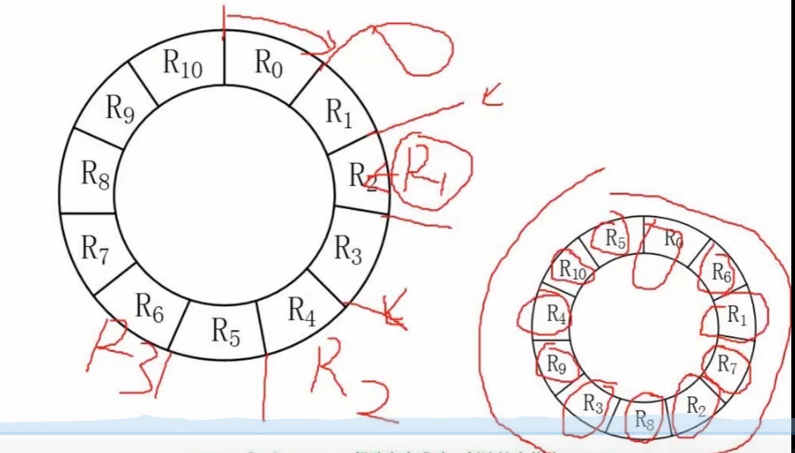
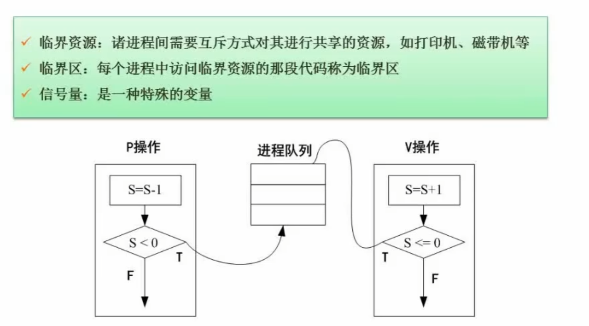
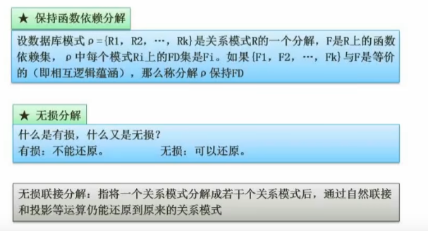
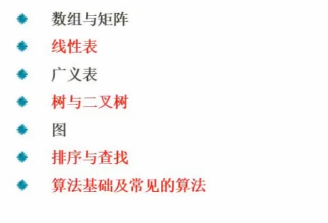
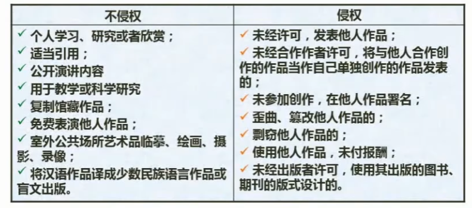
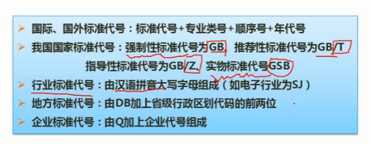
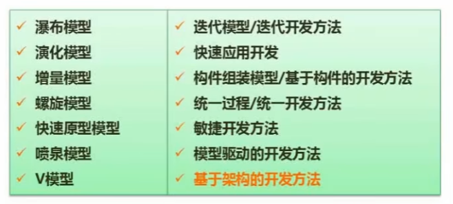
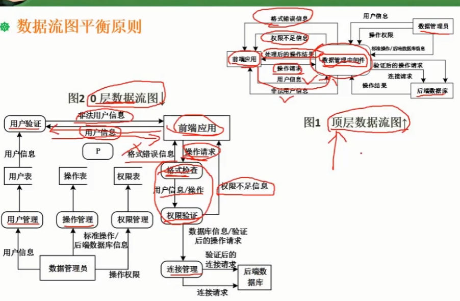
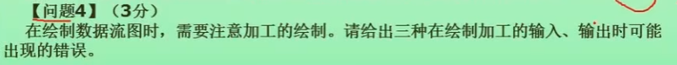
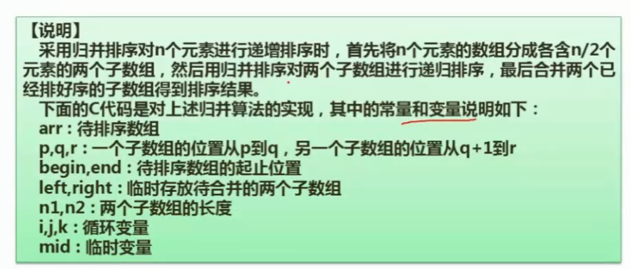

## 数据表示

- 原码

- 反码

- 补码

- 移码

|      | 数值1     | 数值-1    | 1-1       |
| ---- | --------- | --------- | --------- |
| 原码 | 0000 0001 | 1000 0001 | 1000 0010 |
| 反码 | 0000 0001 | 1111 1110 | 1111 1111 |
| 补码 | 0000 0001 | 1111 1111 | 0000 0000 |
| 移码 | 1000 0001 | 0111 1111 | 1000 0000 |


### 浮点数运算

浮点数表示：**N = M*R^e**

其中M称为尾数，e是指数，R为基数。


例子：

1000  -->  1.0 * 10^3       119  -->  1.19 * 10^2

以上两个数相加，将低指数转为高指数：(1.0 * 10^3) + (0.119 * 10^3) = 1.119 * 10^3

注：要注意小数点左边的数字要保持在一位。


## 计算机结构


### 结构分类 Flynn


### CISC与RISC111


## 流水线

### 概念


### 流水线计算

- 流水线周期为执行时间最长的一段
- 流水线计算公式：
  - 一条指令执行时间 +（指令条数 - 1）* 流水线周期
  - 理论公式：(t1 + t1 + …… + tk) + (n-1) * 流水线周期
  - 实践公式：(k+n-1) * 流水线周期 (其中k指的是几部分操作)


理论公式：(2+2+1) + (100-1) * 2 = 203

实践公式：(3 + 100 - 1) * 2 = 204

注：在选项中有理论公式的答案优先选择，没有则选择实践公式


### 流水线吞吐率计算


以上一案列的计算结果进行计算：

TP = 100 / 203

最大吞吐率：1/2


### 流水线加速比


以之前的流水线计算结果进行计算：

**S = (2+2+1)*100 / 203**


### 流水线的效率


**E = (t + t + t + 3t) * 4 / 15t * 4 = 24t / 60t**


## 层次存储结构


其中cache按k为单位，是1024k

内存为G或M，也是1024	


### Cache 概念


假设Cache命中率为95%，Cache的周期时间为1ns，主存储器周期时间为1ms = 1000ns

平均周期则为：**1ns * 95% + (1 - 95%) * 1000ns = 50.95ns**


### 局部性原理

- 时间局部性
- 空间局部性
- 工作集原理：工作集是进程运行时被频繁访问的页面集合

时间局部性例：

```
int i,s=0;
for(i=1;i<1000;i++)
	for(j=1; j<1000:j++)
		s+=j;
printf("结果为:%d", s)
即刚访问完的数据再次访问
```

空间局部性以数组为例：不停的对刚创建进行初始化的时候


### 主存 - 分类


### 主存 - 编址


例子：


先将C7FFFH补1，就变成C8000H。

然后C8000H-AC000H,得1C000H。

将结果转换为十进制，得114688，去除1024，得112K个地址单元。

内存块是 112 * 16 。

所以是（112K * 16） / （28 * 16 * x），得4 


## 磁盘结构与参数


处理11个记录得最长时间为366ms



最短则为66ms


## 总线


## 系统可靠性分析 

### 串联系统与并联系统


### 模冗余系统与混合系统


## 差错控制- CRC与海明校验码


## 操作系统

### 概述


### 进程管理 

#### 进程的状态


#### 前趋图


 

#### 进程的同步与进制


#### PV操作



**P操作是申请资源，S减1小于0说明S小于1，证明当前没有可申请的资源，所以这个进程要进入阻塞状态，反之就是有可使用的资源，可继续执行**

**s就像是临界资源数量，为了防止随机执行导致进程队列满，当执行v操作释放资源的时候，需要看当前进程队列中是否有进程在排队等候，所以小于等于0的时候直接调度进程从S<0语句下面执行**


例：


#### 死锁问题


#### 银行家算法


### 存储管理


#### 页式存储组织


#### 段式存储组织


#### 段页式存储组织


#### 快表

快表是一块小容量的相联存储器(Associative Memory) ，由高速缓存器组成，速度快，并且可以从硬件上保证按内容并行查找，- 般用来存放当前访问最频繁的少数活动页面的页号。


#### 页面置换算法


指令只会一次，数据则是两次


#### 索引文件结构


#### 文件和树型目录结构


#### 空闲存储空间的管理


字从1开始算，位置从0开始算


#### 数据传输控制方式


**主要前三种**


### 设备管理

#### 虚设备与SPOOLING技术


### 微内核操作系统


## 数据库

### 三级模式-两级映射


### 数据库设计过程


### ER模型


### 关系代数


### 规范化理论

#### 函数依赖


#### 价值与用途


#### 键


#### 范式


#### 第一范式


#### 第二范式


#### 第三范式


#### BC范式


#### 例题


#### 模式分解




### 并发控制


#### 存在的问题示例


#### 封锁协议


#### 数据库的完整性约束

* 实体完整性约束
* 参照完整性约束
* 用户自定义完整性约束
* 触发器


#### 数据库安全

|      措施      |                             说明                             |
| :------------: | :----------------------------------------------------------: |
| 用户标识和鉴定 | 最外层的安全保护措施，可以使用用户帐户、口令及随机数检验等方式 |
|    存取控制    | 对用户进行授权，包括操作类型 (如查找、插入、删除、修改等动作）和数据对象(主要是数据范围)的权限。 |
| 密码存储和传输 |                   对远程终端信息用密码传输                   |
|   视图的保护   |                        对视图进行授权                        |
|      审计      | 使用一个专用文件或数据库，自动将用户对数据库的所有操作记录下来 |


#### 数据备份


#### 数据库故障与恢复


### 数据仓库与数据挖掘


### 反规范化


### 大数据


## 计算机网络

### OSI/RM七层模型


### 网络技术标准与协议


#### TCP协议


#### DHCP协议


#### DNS协议


## 计算机网络的分类

### 拓扑结构


### 网络规划与设计


### 逻辑网络设计


### 分层设计


### IP地址


 


### 子网划分


### 无分类编制


c


### 特殊含义的IP地址


### 计算机网络与信息安全

#### HTML


### 无线网


### 网络接入技术


### IPV6


## 信息安全系统属性


### 对称加密技术


### 非对称加密技术


### 信息摘要


### 数字签名


### 数字信封与PGP


## 系统安全分析与设计

### 网络安全 - 各个网络层次的安全保障


### 网络威胁与攻击


### 防火墙


## 数据结构与算法基础




### 数组


### 稀疏矩阵


再将A[1,1]代入，得到A[3]即为正确答案


## 数据结构的定义


### 线性表的定义


#### 线性表


### 顺序存储与链式存储对比


### 队列与栈


### 广义表


深度为重度，如果（b，c）换位（b1，b2）则为三重

**表头为第一个元素，表位则是除表头以外所有元素**


### 数与二叉树


### 二叉树的遍历


前序遍历：12457836

中序遍历：42785136（左中右）

后序遍历：48752631（左右中）


### 反向构造二叉树


### 树转二叉树


### 查找二叉树

又叫“**排序二叉树**”


### 最优二叉树

又称“**哈夫曼树**”


### 线索二叉树


### 平衡二叉树


### 图-基本概念


### 图的存储-邻接矩阵


### 图的存储-邻接表


### 图的遍历


### 图-拓扑排序


### 图的最小生成树

#### 普里姆算法


#### 克鲁斯卡尔算法


### 算法的特性


### 算法的复杂度


赋值语句为O(1)，单循环为O(n)，嵌套循环为O(n^2)

树的查询为O(log2n)


### 查找-顺序查找


### 查找-二分查找


### 查找-散列表


线性探测法：往后占位


### 排序


#### 直接插入排序


#### 希尔排序


#### 直接选择排序


#### 堆排序


#### 冒泡排序


#### 快速排序


#### 归并排序


#### 基数排序


#### 时间复杂度与空间复杂度


## 程序设计语言与语言处理程序基础


### 编译过程


### 文法定义


#### 语法推导树


### 有限自动机与正规式


### 表达式


### 函数调用-传值与传址


### 各种程序语言的特点


## 法律法规


### 保护期限


### 知识产权人确定


### 侵权判定





### 标准化基础知识 - 标准的分类


### 标准的编号




## 多媒体基础


### 音频相关概念


### 图像相关概念


### 媒体的种类


### 多媒体相关计算问题


### 常见多媒体标准


### 数据压缩基础


### 有损压缩与无损压缩


## 软件开发模型




### 瀑布模型


### 其他经典模型


### 螺旋模型


### V模型


### 喷泉模型


面向对象的开发


### 构建组装模型（CBSD）


### 统一过程（UP、RUP）


### 敏捷开发方法


### 信息系统开发方法


### 需求分类与需求获取


### 结构化设计


#### 内聚和耦合


#### 系统模块/模块结构


### 软件测试

#### 测试原则与类型


#### 测试用例设计


#### 测试阶段


#### McCabe复杂度


#### 系统运行与维护


### 软件过程改进 - CMMI


### 项目管理


## 面向对象设计

### 需求开发

#### 需求分析 - OOA


### 设计原则


### UML


### 设计模式的概念


### 设计模式的分类


#### 创建型模式


#### 结构型模式


#### 行为型模式


## 数据流图


### 基本概念


### 数据字典


### 数据流图平衡原则





### 答题技巧


### 分析1




1、奇迹

2、黑洞

3、数据流命名问题

4、输入流加工不能产出输出流


### 分析2


## 数据设计


### 设计过程


### ER模型


### ER图向关系模型的转换


### 分析1


### 分析2


## UML建模


### 用例图


### 类图与对象图


### 顺序图


### 活动图


### 状态图


### 通信图


### 分析1


### 分析2


状态模式


## 数据结构及算法应用


### 分治法


#### 递归技术


#### 二分法查找


### 回溯法


### 贪心法


### 动态规划法


### 分析1


### 分析2




## 面向对象程序设计

