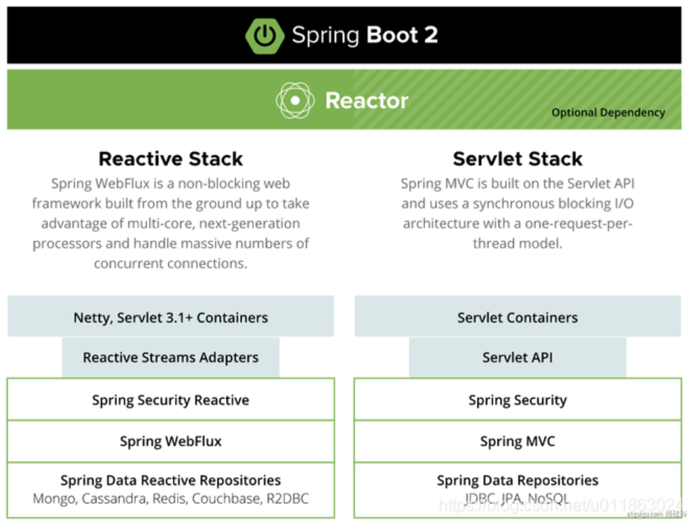
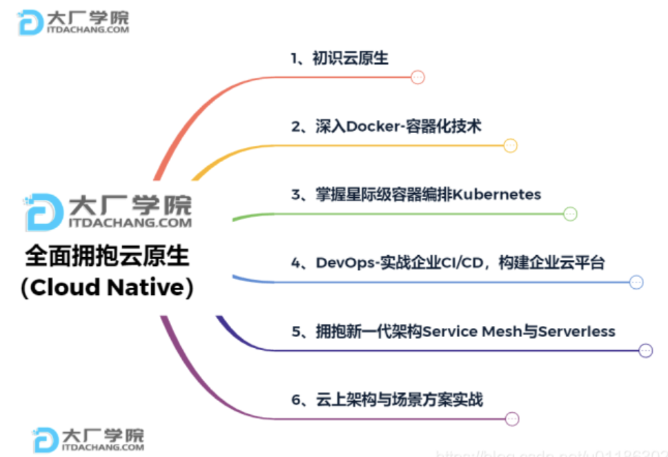
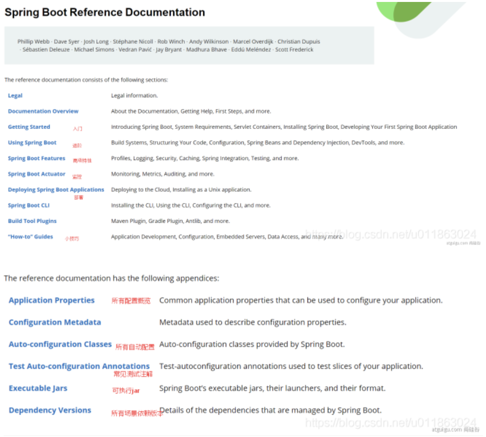
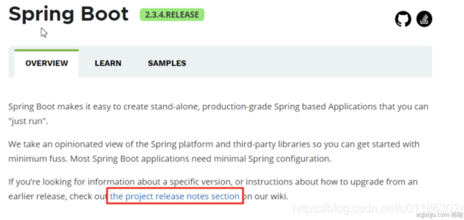
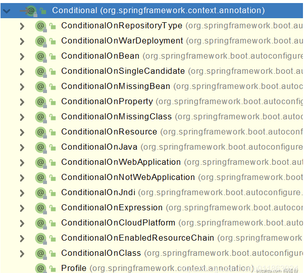
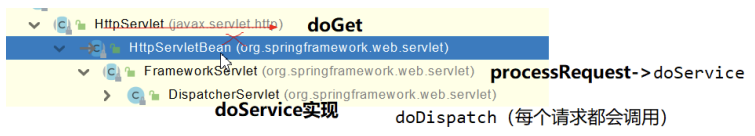
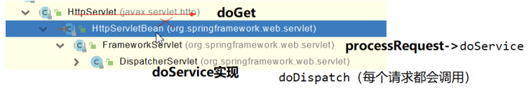
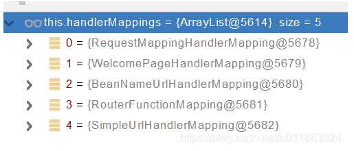

# 01、基础入门-SpringBoot2课程介绍

1、Spring Boot 2核心技术

2、Spring Boot 2响应式编程


学习要求
			-熟悉Spring基础
			-熟悉Maven使用

环境要求
			Java8及以上
			Maven 3.3及以上


学习资料

Spring Boot官网：https://spring.io/projects/spring-boot

Spring Boot官方文档：https://docs.spring.io/spring-boot/docs/

尚硅谷课程文档地址：https://www.yuque.com/atguigu/springboot

视频地址1、视频地址2：http://www.gulixueyuan.com/

源码地址：https://gitee.com/leifengyang/springboot2


# 02、基础入门-Spring生态圈

Spring官网：https://spring.io/


## Spring能做什么

**Spring的能力**


## Spring的生态

覆盖了：

- web开发
- 数据访问
- 安全控制
- 分布式
- 消息服务
- 移动开发
- 批处理
- …


## Spring5重大升级

- 响应式编程



- 内部源码设计

基于Java8的一些新特性，如：接口默认实现。重新设计[源码](https://so.csdn.net/so/search?q=源码&spm=1001.2101.3001.7020)架构。


## 为什么用SpringBoot

Spring Boot makes it easy to create stand-alone, production-grade Spring based Applications that you can “just run”.link

能快速创建出生产级别的Spring应用。


### SpringBoot优点


Create stand-alone Spring applications

创建独立Spring应用


Embed Tomcat, Jetty or Undertow directly (no need to deploy WAR files)

内嵌web服务器


Provide opinionated ‘starter’ dependencies to simplify your build configuration

自动starter依赖，简化构建配置


Automatically configure Spring and 3rd party libraries whenever possible

自动配置Spring以及第三方功能


Provide production-ready features such as metrics, health checks, and externalized configuration

提供生产级别的监控、健康检查及外部化配置


Absolutely no code generation and no requirement for XML configuration

无代码生成、无需编写XML


SpringBoot是整合Spring技术栈的一站式框架

SpringBoot是简化Spring技术栈的快速开发脚手架
	


### SpringBoot缺点

- 人称版本帝，迭代快，需要时刻关注变化
- 封装太深，内部原理复杂，不容易精通


# 03、基础入门-SpringBoot的大时代背景

## 微服务

In short, the microservice architectural style is an approach to developing a single application as a suite of small services, each running in its own process and communicating with lightweight mechanisms, often an HTTP resource API. These services are built around business capabilities and independently deployable by fully automated deployment machinery. There is a bare minimum of centralized management of these services, which may be written in different programming languages and use different data storage technologies.——James Lewis and Martin Fowler (2014)


- 微服务是一种架构风格
- 一个应用拆分为一组小型服务
- 每个服务运行在自己的进程内，也就是可独立部署和升级
- 服务之间使用轻量级HTTP交互
- 服务围绕业务功能拆分
- 可以由全自动部署机制独立部署
- 去中心化，服务自治。服务可以使用不同的语言、不同的存储技术


## 分布式


### 分布式的困难


- 远程调用
- 服务发现
- 负载均衡
- 服务容错
- 配置管理
- 服务监控
- 链路追踪
- 日志管理
- 任务调度
- …


### 分布式的解决

- SpringBoot + SpringCloud


## 云原生

原生应用如何上云。 Cloud Native


### 上云的困难

- 服务自愈
- 弹性伸缩
- 服务隔离
- 自动化部署
- 灰度发布
- 流量治理
- …


### 上云的解决




# 04、基础入门-SpringBoot官方文档架构

- [Spring Boot官网](https://spring.io/projects/spring-boot)
- [Spring Boot官方文档](https://docs.spring.io/spring-boot/docs/)


## 官网文档架构





[查看版本新特性](https://github.com/spring-projects/spring-boot/wiki#release-notes)




# 05、基础入门-SpringBoot-HelloWorld


## 系统要求

- Java 8
- Maven 3.3+
- IntelliJ IDEA 2019.1.2


## [Maven](https://so.csdn.net/so/search?q=Maven&spm=1001.2101.3001.7020)配置文件

新添内容：

```xml
<mirrors>
	<mirror>
		<id>nexus-aliyun</id>
		<mirrorOf>central</mirrorOf>
		<name>Nexus aliyun</name>
		<url>http://maven.aliyun.com/nexus/content/groups/public</url>
	</mirror>
</mirrors>

<profiles>
	<profile>
		<id>jdk-1.8</id>

		<activation>
			<activeByDefault>true</activeByDefault>
			<jdk>1.8</jdk>
		</activation>

		<properties>
			<maven.compiler.source>1.8</maven.compiler.source>
			<maven.compiler.target>1.8</maven.compiler.target>
			<maven.compiler.compilerVersion>1.8</maven.compiler.compilerVersion>
		</properties>
	</profile>
</profiles>
```


## HelloWorld项目

需求：浏览发送/hello请求，响应 “Hello，Spring Boot 2”

### 创建maven工程


### 引入依赖

```xml
<parent>
	<groupId>org.springframework.boot</groupId>
	<artifactId>spring-boot-starter-parent</artifactId>
	<version>2.3.4.RELEASE</version>
</parent>

<dependencies>
	<dependency>
		<groupId>org.springframework.boot</groupId>
		<artifactId>spring-boot-starter-web</artifactId>
	</dependency>
</dependencies>
```


### 创建主程序

```java
import org.springframework.boot.SpringApplication;
import org.springframework.boot.autoconfigure.SpringBootApplication;

@SpringBootApplication
public class MainApplication {

    public static void main(String[] args) {
        SpringApplication.run(MainApplication.class, args);
    }
}
```


### 编写业务

```java
import org.springframework.web.bind.annotation.RequestMapping;
import org.springframework.web.bind.annotation.RestController;

@RestController
public class HelloController {
    @RequestMapping("/hello")
    public String handle01(){
        return "Hello, Spring Boot 2!";
    }
}
```


### 运行&测试

- 运行`MainApplication`类
- 浏览器输入`http://localhost:8888/hello`，将会输出`Hello, Spring Boot 2!`。


### 设置配置

maven工程的resource文件夹中创建application.properties文件。

```properties
# 设置端口号
server.port=8888
```

[更多配置信息](https://docs.spring.io/spring-boot/docs/2.3.7.RELEASE/reference/html/appendix-application-properties.html#common-application-properties-server)


### 打包部署

在pom.xml添加

```xml
<build>
	<plugins>
		<plugin>
			<groupId>org.springframework.boot</groupId>
			<artifactId>spring-boot-maven-plugin</artifactId>
		</plugin>
	</plugins>
</build
```

在IDEA的Maven插件上点击运行 clean 、package，把helloworld工程项目的打包成jar包，

打包好的jar包被生成在helloworld工程项目的target文件夹内。

用cmd运行`java -jar boot-01-helloworld-1.0-SNAPSHOT.jar`，既可以运行helloworld工程项目。

将jar包直接在目标服务器执行即可。


# 06、基础入门-SpringBoot-依赖管理特性

- 父项目做依赖管理

```xml
依赖管理
<parent>
	<groupId>org.springframework.boot</groupId>
	<artifactId>spring-boot-starter-parent</artifactId>
	<version>2.3.4.RELEASE</version>
</parent>

上面项目的父项目如下：
<parent>
	<groupId>org.springframework.boot</groupId>
	<artifactId>spring-boot-dependencies</artifactId>
	<version>2.3.4.RELEASE</version>
</parent>

它几乎声明了所有开发中常用的依赖的版本号，自动版本仲裁机制
```

开发导入starter场景启动器

​	1、见到很多 spring-boot-starter-* ： *就某种场景

​	2、只要引入starter，这个场景的所有常规需要的依赖我们都自动引入

​	3、更多SpringBoot所有支持的场景：https://docs.spring.io/spring-boot/docs/current/reference/html/using-spring-boot.html#using-boot-starter

​	4、见到的 *-spring-boot-starter： 第三方为我们提供的简化开发的场景启动器。


```xml
所有场景启动器最底层的依赖
<dependency>
	<groupId>org.springframework.boot</groupId>
	<artifactId>spring-boot-starter</artifactId>
	<version>2.3.4.RELEASE</version>
	<scope>compile</scope>
</dependency>
```

- 无需关注版本号，自动版本仲裁
  1. 引入依赖默认都可以不写版本
  2. 引入非版本仲裁的jar，要写版本号。
- 可以修改默认版本号
  1. 查看spring-boot-dependencies里面规定当前依赖的版本 用的 key。
  2. 在当前项目里面重写配置，如下面的代码。

```xml
<properties>
	<mysql.version>5.1.43</mysql.version>
</properties>
```

IDEA快捷键：

- `ctrl + shift + alt + U`：以图的方式显示项目中依赖之间的关系。
- `alt + ins`：相当于Eclipse的 Ctrl + N，创建新类，新包等。


# 07、基础入门-SpringBoot-自动配置特性

- 自动配好Tomcat
  - 引入Tomcat依赖。
  - 配置Tomcat

```xml
<dependency>
	<groupId>org.springframework.boot</groupId>
	<artifactId>spring-boot-starter-tomcat</artifactId>
	<version>2.3.4.RELEASE</version>
	<scope>compile</scope>
</dependency>	
```

- 自动配好SpringMVC
  - 引入SpringMVC全套组件
  - 自动配好SpringMVC常用组件（功能）
- 自动配好Web常见功能，如：字符编码问题
  - SpringBoot帮我们配置好了所有web开发的常见场景

```java
public static void main(String[] args) {
    //1、返回我们IOC容器
    ConfigurableApplicationContext run = SpringApplication.run(MainApplication.class, args);

    //2、查看容器里面的组件
    String[] names = run.getBeanDefinitionNames();
    for (String name : names) {
        System.out.println(name);
    }
}
```

- 默认的包结构
  - 主程序所在包及其下面的所有子包里面的组件都会被默认扫描进来
  - 无需以前的包扫描配置
  - 想要改变扫描路径
    - @SpringBootApplication(scanBasePackages=“com.lun”)
    - @ComponentScan 指定扫描路径

```java
@SpringBootApplication
等同于
@SpringBootConfiguration
@EnableAutoConfiguration
@ComponentScan("com.lun")
```

各种配置拥有默认值

​	默认配置最终都是映射到某个类上，如：MultipartProperties

​	配置文件的值最终会绑定每个类上，这个类会在容器中创建对象


按需加载所有自动配置项

​	非常多的starter

​	引入了哪些场景这个场景的自动配置才会开启

​	SpringBoot所有的自动配置功能都在 spring-boot-autoconfigure 包里面

​	...


# 08、底层注解-@Configuration详解

- 基本使用
  - Full模式与Lite模式
  - 示例


```java
/**
 * 1、配置类里面使用@Bean标注在方法上给容器注册组件，默认也是单实例的
 * 2、配置类本身也是组件
 * 3、proxyBeanMethods：代理bean的方法
 *      Full(proxyBeanMethods = true)（保证每个@Bean方法被调用多少次返回的组件都是单实例的）（默认）
 *      Lite(proxyBeanMethods = false)（每个@Bean方法被调用多少次返回的组件都是新创建的）
 */
@Configuration(proxyBeanMethods = false) //告诉SpringBoot这是一个配置类 == 配置文件
public class MyConfig {

    /**
     * Full:外部无论对配置类中的这个组件注册方法调用多少次获取的都是之前注册容器中的单实例对象
     * @return
     */
    @Bean //给容器中添加组件。以方法名作为组件的id。返回类型就是组件类型。返回的值，就是组件在容器中的实例
    public User user01(){
        User zhangsan = new User("zhangsan", 18);
        //user组件依赖了Pet组件
        zhangsan.setPet(tomcatPet());
        return zhangsan;
    }

    @Bean("tom")
    public Pet tomcatPet(){
        return new Pet("tomcat");
    }
}
```


**@Configuration测试代码如下:**

```java
@SpringBootConfiguration
@EnableAutoConfiguration
@ComponentScan("com.atguigu.boot")
public class MainApplication {

    public static void main(String[] args) {
    //1、返回我们IOC容器
        ConfigurableApplicationContext run = SpringApplication.run(MainApplication.class, args);

    //2、查看容器里面的组件
        String[] names = run.getBeanDefinitionNames();
        for (String name : names) {
            System.out.println(name);
        }

    //3、从容器中获取组件
        Pet tom01 = run.getBean("tom", Pet.class);
        Pet tom02 = run.getBean("tom", Pet.class);
        System.out.println("组件："+(tom01 == tom02));

    //4、com.atguigu.boot.config.MyConfig$$EnhancerBySpringCGLIB$$51f1e1ca@1654a892
        MyConfig bean = run.getBean(MyConfig.class);
        System.out.println(bean);

    //如果@Configuration(proxyBeanMethods = true)代理对象调用方法。SpringBoot总会检查这个组件是否在容器中有。
        //保持组件单实例
        User user = bean.user01();
        User user1 = bean.user01();
        System.out.println(user == user1);

        User user01 = run.getBean("user01", User.class);
        Pet tom = run.getBean("tom", Pet.class);

        System.out.println("用户的宠物："+(user01.getPet() == tom));
    }
}
```

- 最佳实战
  - 配置 类组件之间**无依赖关系**用Lite模式加速容器启动过程，减少判断
  - 配置 类组件之间**有依赖关系**，方法会被调用得到之前单实例组件，用Full模式（默认）

lite 英 [laɪt] 美 [laɪt]
adj. 低热量的，清淡的(light的一种拼写方法);类似…的劣质品


# 09、底层注解-@Import导入组件

@Bean、@Component、@Controller、@Service、@Repository，它们是Spring的基本标签，在Spring Boot中并未改变它们原来的功能。

@ComponentScan 在[07、基础入门-SpringBoot-自动配置特性](https://blog.csdn.net/u011863024/article/details/113667634#)有用例。

@Import({User.class, DBHelper.class})给容器中**自动创建出这两个类型的组件**、默认组件的名字就是全类名

```java
@Import({User.class, DBHelper.class})
@Configuration(proxyBeanMethods = false) //告诉SpringBoot这是一个配置类 == 配置文件
public class MyConfig {
}
```

测试类：

```java
//1、返回我们IOC容器
ConfigurableApplicationContext run = SpringApplication.run(MainApplication.class, args);

//...

//5、获取组件
String[] beanNamesForType = run.getBeanNamesForType(User.class);

for (String s : beanNamesForType) {
    System.out.println(s);
}

DBHelper bean1 = run.getBean(DBHelper.class);
System.out.println(bean1);
```


# 10、底层注解-@Conditional条件装配

**条件装配：满足Conditional指定的条件，则进行组件注入**




**用@ConditionalOnMissingBean举例说明**

```java
@Configuration(proxyBeanMethods = false)
@ConditionalOnMissingBean(name = "tom")//没有tom名字的Bean时，MyConfig类的Bean才能生效。
public class MyConfig {

    @Bean
    public User user01(){
        User zhangsan = new User("zhangsan", 18);
        zhangsan.setPet(tomcatPet());
        return zhangsan;
    }

    @Bean("tom22")
    public Pet tomcatPet(){
        return new Pet("tomcat");
    }
}

public static void main(String[] args) {
    //1、返回我们IOC容器
    ConfigurableApplicationContext run = SpringApplication.run(MainApplication.class, args);

    //2、查看容器里面的组件
    String[] names = run.getBeanDefinitionNames();
    for (String name : names) {
        System.out.println(name);
    }

    boolean tom = run.containsBean("tom");
    System.out.println("容器中Tom组件："+tom);//false

    boolean user01 = run.containsBean("user01");
    System.out.println("容器中user01组件："+user01);//true

    boolean tom22 = run.containsBean("tom22");
    System.out.println("容器中tom22组件："+tom22);//true

}
```


# 11、底层注解-@ImportResource导入Spring配置文件

比如，公司使用bean.xml文件生成配置bean，然而你为了省事，想继续复用bean.xml，@ImportResource粉墨登场。


bean.xml：

```xml
<?xml version="1.0" encoding="UTF-8"?>
<beans ...">

    <bean id="haha" class="com.lun.boot.bean.User">
        <property name="name" value="zhangsan"></property>
        <property name="age" value="18"></property>
    </bean>

    <bean id="hehe" class="com.lun.boot.bean.Pet">
        <property name="name" value="tomcat"></property>
    </bean>
</beans>
```

使用方法：

```java
@ImportResource("classpath:beans.xml")
public class MyConfig {
...
}
```

测试类：

```java
public static void main(String[] args) {
    //1、返回我们IOC容器
    ConfigurableApplicationContext run = SpringApplication.run(MainApplication.class, args);

	boolean haha = run.containsBean("haha");
	boolean hehe = run.containsBean("hehe");
	System.out.println("haha："+haha);//true
	System.out.println("hehe："+hehe);//true
}
```


# 12、底层注解-@ConfigurationProperties配置绑定

如何使用Java读取到properties文件中的内容，并且把它封装到JavaBean中，以供随时使用

传统方法：

```java
public class getProperties {
     public static void main(String[] args) throws FileNotFoundException, IOException {
         Properties pps = new Properties();
         pps.load(new FileInputStream("a.properties"));
         Enumeration enum1 = pps.propertyNames();//得到配置文件的名字
         while(enum1.hasMoreElements()) {
             String strKey = (String) enum1.nextElement();
             String strValue = pps.getProperty(strKey);
             System.out.println(strKey + "=" + strValue);
             //封装到JavaBean。
         }
     }
 }
```


Spring Boot一种配置配置绑定：

**@ConfigurationProperties + @Component**

假设有配置文件application.properties

```properties
mycar.brand=BYD
mycar.price=100000
```

只有在容器中的组件，才会拥有SpringBoot提供的强大功能

```java
@Component
@ConfigurationProperties(prefix = "mycar")
public class Car {
...
}
```


Spring Boot另一种配置配置绑定：

**@EnableConfigurationProperties + @ConfigurationProperties**

1. 开启Car配置绑定功能
2. 把这个Car这个组件自动注册到容器中

```java
@EnableConfigurationProperties(Car.class)
public class MyConfig {
...
}
```

```java
@ConfigurationProperties(prefix = "mycar")
public class Car {
...
}
```


# 13、自动配置【源码分析】-自动包规则原理

Spring Boot应用的启动类：

```java
@SpringBootApplication
public class MainApplication {

    public static void main(String[] args) {
        SpringApplication.run(MainApplication.class, args);
    }

}
```

分析下`@SpringBootApplication`

```java
@Target(ElementType.TYPE)
@Retention(RetentionPolicy.RUNTIME)
@Documented
@Inherited
@SpringBootConfiguration
@EnableAutoConfiguration
@ComponentScan(
    excludeFilters = {@Filter(
    type = FilterType.CUSTOM,
    classes = {TypeExcludeFilter.class}
), @Filter(
    type = FilterType.CUSTOM,
    classes = {AutoConfigurationExcludeFilter.class}
)}
)
public @interface SpringBootApplication {
    ...
}
```

重点分析`@SpringBootConfiguration`，`@EnableAutoConfiguration`，`@ComponentScan`。


## @SpringBootConfiguration

```java
@Target(ElementType.TYPE)
@Retention(RetentionPolicy.RUNTIME)
@Documented
@Configuration
public @interface SpringBootConfiguration {
    @AliasFor(
        annotation = Configuration.class
    )
    boolean proxyBeanMethods() default true;
}
```

`@Configuration`代表当前是一个配置类。


## @ComponentScan

指定扫描哪些Spring注解。

@ComponentScan 在[07、基础入门-SpringBoot-自动配置特性](https://blog.csdn.net/u011863024/article/details/113667634#)有用例。


## @EnableAutoConfiguration

```java
@Target(ElementType.TYPE)
@Retention(RetentionPolicy.RUNTIME)
@Documented
@Inherited
@AutoConfigurationPackage
@Import(AutoConfigurationImportSelector.class)
public @interface EnableAutoConfiguration {
    String ENABLED_OVERRIDE_PROPERTY = "spring.boot.enableautoconfiguration";

    Class<?>[] exclude() default {};

    String[] excludeName() default {};
}
```

重点分析`@AutoConfigurationPackage`，`@Import(AutoConfigurationImportSelector.class)`。


## @AutoConfigurationPackage

标签名直译为：自动配置包，指定了默认的包规则。

```java
@Target(ElementType.TYPE)
@Retention(RetentionPolicy.RUNTIME)
@Documented
@Inherited
@Import(AutoConfigurationPackages.Registrar.class)//给容器中导入一个组件
public @interface AutoConfigurationPackage {
    String[] basePackages() default {};

    Class<?>[] basePackageClasses() default {};
}
```

1. 利用Registrar给容器中导入一系列组件
2. 将指定的一个包下的所有组件导入进MainApplication所在包下。


# 14、自动配置【源码分析】-初始加载自动配置类


## @Import(AutoConfigurationImportSelector.class)

1、利用getAutoConfigurationEntry(annotationMetadata);给容器中批量导入一些组件

2、调用List<String> configurations = getCandidateConfigurations(annotationMetadata, attributes)获取到所有需要导入到容器中的配置类

3、利用工厂加载 Map<String, List<String>> loadSpringFactories(@Nullable ClassLoader classLoader);得到所有的组件

4、从META-INF/spring.factories位置来加载一个文件。
					

​	默认扫描我们当前系统里面所有META-INF/spring.factories位置的文件

​	spring-boot-autoconfigure-2.3.4.RELEASE.jar包里面也有META-INF/spring.factories



```java
# 文件里面写死了spring-boot一启动就要给容器中加载的所有配置类
# spring-boot-autoconfigure-2.3.4.RELEASE.jar/META-INF/spring.factories
# Auto Configure
org.springframework.boot.autoconfigure.EnableAutoConfiguration=\
org.springframework.boot.autoconfigure.admin.SpringApplicationAdminJmxAutoConfiguration,\
org.springframework.boot.autoconfigure.aop.AopAutoConfiguration,\
...
```

虽然我们127个场景的所有自动配置启动的时候默认全部加载，但是`xxxxAutoConfiguration`按照条件装配规则（`@Conditional`），最终会按需配置。

如`AopAutoConfiguration`类：

```java
@Configuration(
    proxyBeanMethods = false
)
@ConditionalOnProperty(
    prefix = "spring.aop",
    name = "auto",
    havingValue = "true",
    matchIfMissing = true
)
public class AopAutoConfiguration {
    public AopAutoConfiguration() {
    }
	...
}
```


# 15、自动配置【源码分析】-自动配置流程

以`DispatcherServletAutoConfiguration`的内部类`DispatcherServletConfiguration`为例子:

```java
@Bean
@ConditionalOnBean(MultipartResolver.class)  //容器中有这个类型组件
@ConditionalOnMissingBean(name = DispatcherServlet.MULTIPART_RESOLVER_BEAN_NAME) //容器中没有这个名字 multipartResolver 的组件
public MultipartResolver multipartResolver(MultipartResolver resolver) {
	//给@Bean标注的方法传入了对象参数，这个参数的值就会从容器中找。
	//SpringMVC multipartResolver。防止有些用户配置的文件上传解析器不符合规范
	// Detect if the user has created a MultipartResolver but named it incorrectly
	return resolver;//给容器中加入了文件上传解析器；
}

```

SpringBoot默认会在底层配好所有的组件，但是**如果用户自己配置了以用户的优先**。

**总结**：

- SpringBoot先加载所有的自动配置类 xxxxxAutoConfiguration
- 每个自动配置类按照条件进行生效，默认都会绑定配置文件指定的值。（xxxxProperties里面读取，xxxProperties和配置文件进行了绑定）

- 生效的配置类就会给容器中装配很多组件
- 只要容器中有这些组件，相当于这些功能就有了
- 定制化配置
  - 用户直接自己@Bean替换底层的组件
  - 用户去看这个组件是获取的配置文件什么值就去修改。
  - 

**xxxxxAutoConfiguration —> 组件 —> xxxxProperties里面拿值 ----> application.properties**


# 16、最佳实践-SpringBoot应用如何编写


- 引入场景依赖
  - [官方文档](https://docs.spring.io/spring-boot/docs/current/reference/html/using-spring-boot.html#using-boot-starter)
- 查看自动配置了哪些（选做）
  - 自己分析，引入场景对应的自动配置一般都生效了
  - 配置文件中debug=true开启自动配置报告。
    - Negative（不生效）
    - Positive（生效）

- 是否需要修改
  - 参照文档修改配置项
    - [官方文档](https://docs.spring.io/spring-boot/docs/current/reference/html/appendix-application-properties.html#common-application-properties)
    - 自己分析。xxxxProperties绑定了配置文件的哪些。
  - 自定义加入或者替换组件
    - @Bean、@Component…
  - 自定义器 XXXXXCustomizer；
  - …


# 17、最佳实践-Lombok简化开发


Lombok用标签方式代替构造器、getter/setter、toString()等鸡肋代码。

spring boot已经管理Lombok。引入依赖：

```xml
 <dependency>
     <groupId>org.projectlombok</groupId>
     <artifactId>lombok</artifactId>
</dependency>
```

IDEA中File->Settings->Plugins，搜索安装Lombok插件。

```java
@NoArgsConstructor
//@AllArgsConstructor
@Data
@ToString
@EqualsAndHashCode
public class User {

    private String name;
    private Integer age;

    private Pet pet;

    public User(String name,Integer age){
        this.name = name;
        this.age = age;
    }
}
```

简化日志开发

```java
@Slf4j
@RestController
public class HelloController {
    @RequestMapping("/hello")
    public String handle01(@RequestParam("name") String name){
        log.info("请求进来了....");
        return "Hello, Spring Boot 2!"+"你好："+name;
    }
}
```


# 18、最佳实践-dev-tools

Spring Boot includes an additional set of tools that can make the application development experience a little more pleasant. The spring-boot-devtools module can be included in any project to provide additional development-time features.——link

Applications that use spring-boot-devtools automatically restart whenever files on the classpath change. This can be a useful feature when working in an IDE, as it gives a very fast feedback loop for code changes. By default, any entry on the classpath that points to a directory is monitored for changes. Note that certain resources, such as static assets and view templates, do not need to restart the application.——link

Triggering a restart

As DevTools monitors classpath resources, the only way to trigger a restart is to update the classpath. The way in which you cause the classpath to be updated depends on the IDE that you are using:

In Eclipse, saving a modified file causes the classpath to be updated and triggers a restart.
In IntelliJ IDEA, building the project (Build -> Build Project)(shortcut: Ctrl+F9) has the same effect.


添加依赖：

```xml
<dependencies>
    <dependency>
        <groupId>org.springframework.boot</groupId>
        <artifactId>spring-boot-devtools</artifactId>
        <optional>true</optional>
    </dependency>
</dependencies>
```

在IDEA中，项目或者页面修改以后：Ctrl+F9。


# 19、最佳实践-Spring Initailizr

[Spring Initailizr](https://start.spring.io/)是创建Spring Boot工程向导。

在IDEA中，菜单栏New -> Project -> Spring Initailizr。


# 20、配置文件-yaml的用法

同以前的properties用法

YAML 是 “YAML Ain’t Markup Language”（YAML 不是一种标记语言）的递归缩写。在开发的这种语言时，YAML 的意思其实是：“Yet Another Markup Language”（仍是一种标记语言）。

非常适合用来做以数据为中心的配置文件。


## 基本语法

- key: value；kv之间有空格
- 大小写敏感
- 使用缩进表示层级关系
- 缩进不允许使用tab，只允许空格
- 缩进的空格数不重要，只要相同层级的元素左对齐即可
- '#'表示注释
- 字符串无需加引号，如果要加，单引号’'、双引号""表示字符串内容会被 转义、不转义


## 数据类型

- 字面量：单个的、不可再分的值。date、boolean、string、number、null

```yaml
k: v
```

- 对象：键值对的集合。map、hash、set、object

```yaml
#行内写法：  

k: {k1:v1,k2:v2,k3:v3}

#或

k: 
  k1: v1
  k2: v2
  k3: v3
```

- 数组：一组按次序排列的值。array、list、queue

```yaml
#行内写法：  

k: [v1,v2,v3]

#或者

k:
 - v1
 - v2
 - v3
```


## 实例

```java
@Data
public class Person {
    private String userName;
    private Boolean boss;
    private Date birth;
    private Integer age;
    private Pet pet;
    private String[] interests;
    private List<String> animal;
    private Map<String, Object> score;
    private Set<Double> salarys;
    private Map<String, List<Pet>> allPets;
}

@Data
public class Pet {
    private String name;
    private Double weight;
}
```

用yaml表示以上对象

```yaml
person:
  userName: zhangsan
  boss: false
  birth: 2019/12/12 20:12:33
  age: 18
  pet: 
    name: tomcat
    weight: 23.4
  interests: [篮球,游泳]
  animal: 
    - jerry
    - mario
  score:
    english: 
      first: 30
      second: 40
      third: 50
    math: [131,140,148]
    chinese: {first: 128,second: 136}
  salarys: [3999,4999.98,5999.99]
  allPets:
    sick:
      - {name: tom}
      - {name: jerry,weight: 47}
    health: [{name: mario,weight: 47}]
```


# 21、配置文件-自定义类绑定的配置提示

You can easily generate your own configuration metadata file from items annotated with @ConfigurationProperties by using the spring-boot-configuration-processor jar. The jar includes a Java annotation processor which is invoked as your project is compiled.——link


自定义的类和配置文件绑定一般没有提示。若要提示，添加如下依赖：

```xml
<dependency>
    <groupId>org.springframework.boot</groupId>
    <artifactId>spring-boot-configuration-processor</artifactId>
    <optional>true</optional>
</dependency>

<!-- 下面插件作用是工程打包时，不将spring-boot-configuration-processor打进包内，让其只在编码的时候有用 -->
<build>
    <plugins>
        <plugin>
            <groupId>org.springframework.boot</groupId>
            <artifactId>spring-boot-maven-plugin</artifactId>
            <configuration>
                <excludes>
                    <exclude>
                        <groupId>org.springframework.boot</groupId>
                        <artifactId>spring-boot-configuration-processor</artifactId>
                    </exclude>
                </excludes>
            </configuration>
        </plugin>
    </plugins>
</build>
```


# 22、web场景-web开发简介

Spring Boot provides auto-configuration for Spring MVC that works well with most applications.(大多场景我们都无需自定义配置)

The auto-configuration adds the following features on top of Spring’s defaults:


- Inclusion of `ContentNegotiatingViewResolver` and `BeanNameViewResolver` beans.
  - 内容协商视图解析器和BeanName视图解析器

- Support for serving static resources, including support for WebJars (covered [later in this document](https://docs.spring.io/spring-boot/docs/current/reference/html/spring-boot-features.html#boot-features-spring-mvc-static-content))).
  - 静态资源（包括webjars）

- Automatic registration of `Converter`, `GenericConverter`, and `Formatter` beans.
  - 自动注册 `Converter，GenericConverter，Formatter`

- Support for `HttpMessageConverters` (covered [later in this document](https://docs.spring.io/spring-boot/docs/current/reference/html/spring-boot-features.html#boot-features-spring-mvc-message-converters)).
  - 支持 `HttpMessageConverters` （后来我们配合内容协商理解原理）

- Automatic registration of `MessageCodesResolver` (covered [later in this document](https://docs.spring.io/spring-boot/docs/current/reference/html/spring-boot-features.html#boot-features-spring-message-codes)).
  - 自动注册 `MessageCodesResolver` （国际化用）

- Static `index.html` support.
  - 静态index.html 页支持

- Custom `Favicon` support (covered [later in this document](https://docs.spring.io/spring-boot/docs/current/reference/html/spring-boot-features.html#boot-features-spring-mvc-favicon)).

  - 自定义 `Favicon`

- Automatic use of a ConfigurableWebBindingInitializer bean (covered later in this document).

  自动使用 ConfigurableWebBindingInitializer ，（DataBinder负责将请求数据绑定到JavaBean上）


If you want to keep those Spring Boot MVC customizations and make more MVC customizations (interceptors, formatters, view controllers, and other features), you can add your own @Configuration class of type WebMvcConfigurer but without @EnableWebMvc.

不用@EnableWebMvc注解。使用 @Configuration + WebMvcConfigurer 自定义规则


If you want to provide custom instances of RequestMappingHandlerMapping, RequestMappingHandlerAdapter, or ExceptionHandlerExceptionResolver, and still keep the Spring Boot MVC customizations, you can declare a bean of type WebMvcRegistrations and use it to provide custom instances of those components.

声明 WebMvcRegistrations 改变默认底层组件


If you want to take complete control of Spring MVC, you can add your own @Configuration annotated with @EnableWebMvc, or alternatively add your own @Configuration-annotated DelegatingWebMvcConfiguration as described in the Javadoc of @EnableWebMvc.

使用 @EnableWebMvc+@Configuration+DelegatingWebMvcConfiguration 全面接管SpringMVC


# 23、web场景-静态资源规则与定制化


## 静态资源目录


只要静态资源放在类路径下： called `/static` (or `/public` or `/resources` or `/META-INF/resources`

访问 ： 当前项目根路径/ + 静态资源名

原理： 静态映射/**。

请求进来，先去找Controller看能不能处理。不能处理的所有请求又都交给静态资源处理器。静态资源也找不到则响应404页面。

也可以改变默认的静态资源路径，`/static`，`/public`,`/resources`, `/META-INF/resources`失效

```yaml
resources:
  static-locations: [classpath:/haha/]
```


## 静态资源访问前缀

```yaml
spring:
  mvc:
    static-path-pattern: /res/**
```

当前项目 + static-path-pattern + 静态资源名 = 静态资源文件夹下找


## webjar


可用jar方式添加css，js等资源文件，

https://www.webjars.org/

例如，添加jquery

```xml
<dependency>
    <groupId>org.webjars</groupId>
    <artifactId>jquery</artifactId>
    <version>3.5.1</version>
</dependency>
```

访问地址：[http://localhost:8080/webjars/**jquery/3.5.1/jquery.js**](http://localhost:8080/webjars/jquery/3.5.1/jquery.js) 后面地址要按照依赖里面的包路径。


# 24、web场景-welcome与favicon功能

[官方文档](https://docs.spring.io/spring-boot/docs/2.3.8.RELEASE/reference/htmlsingle/#boot-features-spring-mvc-welcome-page)


## 欢迎页支持

- 静态资源路径下 index.html。
  - 可以配置静态资源路径
  - 但是不可以配置静态资源的访问前缀。否则导致 index.html不能被默认访问

```yaml
spring:
#  mvc:
#    static-path-pattern: /res/**   这个会导致welcome page功能失效
  resources:
    static-locations: [classpath:/haha/]
```

- controller能处理/index。


## 自定义Favicon

指网页标签上的小图标。

favicon.ico 放在静态资源目录下即可。

```yaml
spring:
#  mvc:
#    static-path-pattern: /res/**   这个会导致 Favicon 功能失效
```


# 25、web场景-【源码分析】-静态资源原理

- SpringBoot启动默认加载 xxxAutoConfiguration 类（自动配置类）
- SpringMVC功能的自动配置类`WebMvcAutoConfiguration`，生效

```java
@Configuration(proxyBeanMethods = false)
@ConditionalOnWebApplication(type = Type.SERVLET)
@ConditionalOnClass({ Servlet.class, DispatcherServlet.class, WebMvcConfigurer.class })
@ConditionalOnMissingBean(WebMvcConfigurationSupport.class)
@AutoConfigureOrder(Ordered.HIGHEST_PRECEDENCE + 10)
@AutoConfigureAfter({ DispatcherServletAutoConfiguration.class, TaskExecutionAutoConfiguration.class,
		ValidationAutoConfiguration.class })
public class WebMvcAutoConfiguration {
    ...
}
```


- 给容器中配置的内容：
  - 配置文件的相关属性的绑定：WebMvcProperties==**spring.mvc**、ResourceProperties==**spring.resources**

```java
@Configuration(proxyBeanMethods = false)
@Import(EnableWebMvcConfiguration.class)
@EnableConfigurationProperties({ WebMvcProperties.class, ResourceProperties.class })
@Order(0)
public static class WebMvcAutoConfigurationAdapter implements WebMvcConfigurer {
    ...
}
```


## 配置类只有一个有参构造器

```java
有参构造器所有参数的值都会从容器中确定
public WebMvcAutoConfigurationAdapter(WebProperties webProperties, WebMvcProperties mvcProperties,
		ListableBeanFactory beanFactory, ObjectProvider<HttpMessageConverters> messageConvertersProvider,
		ObjectProvider<ResourceHandlerRegistrationCustomizer> resourceHandlerRegistrationCustomizerProvider,
		ObjectProvider<DispatcherServletPath> dispatcherServletPath,
		ObjectProvider<ServletRegistrationBean<?>> servletRegistrations) {
	this.mvcProperties = mvcProperties;
	this.beanFactory = beanFactory;
	this.messageConvertersProvider = messageConvertersProvider;
	this.resourceHandlerRegistrationCustomizer = resourceHandlerRegistrationCustomizerProvider.getIfAvailable();
	this.dispatcherServletPath = dispatcherServletPath;
	this.servletRegistrations = servletRegistrations;
	this.mvcProperties.checkConfiguration();
}
```

- ResourceProperties resourceProperties；获取和spring.resources绑定的所有的值的对象
- WebMvcProperties mvcProperties 获取和spring.mvc绑定的所有的值的对象

- ListableBeanFactory beanFactory Spring的beanFactory
- HttpMessageConverters 找到所有的HttpMessageConverters

- ResourceHandlerRegistrationCustomizer 找到 资源处理器的自定义器。
- DispatcherServletPath

- ServletRegistrationBean 给应用注册Servlet、Filter…


## 资源处理的默认规则

```java
...
public class WebMvcAutoConfiguration {
    ...
	public static class EnableWebMvcConfiguration extends DelegatingWebMvcConfiguration implements ResourceLoaderAware {
        ...
		@Override
		protected void addResourceHandlers(ResourceHandlerRegistry registry) {
			super.addResourceHandlers(registry);
			if (!this.resourceProperties.isAddMappings()) {
				logger.debug("Default resource handling disabled");
				return;
			}
			ServletContext servletContext = getServletContext();
			addResourceHandler(registry, "/webjars/**", "classpath:/META-INF/resources/webjars/");
			addResourceHandler(registry, this.mvcProperties.getStaticPathPattern(), (registration) -> {
				registration.addResourceLocations(this.resourceProperties.getStaticLocations());
				if (servletContext != null) {
					registration.addResourceLocations(new ServletContextResource(servletContext, SERVLET_LOCATION));
				}
			});
		}
        ...
        
    }
    ...
}

```

根据上述代码，我们可以同过配置禁止所有静态资源规则。

```y
spring:
  resources:
    add-mappings: false   #禁用所有静态资源规则
```

静态资源规则：

```java
@ConfigurationProperties(prefix = "spring.resources", ignoreUnknownFields = false)
public class ResourceProperties {

    private static final String[] CLASSPATH_RESOURCE_LOCATIONS = { "classpath:/META-INF/resources/",
            "classpath:/resources/", "classpath:/static/", "classpath:/public/" };

    /**
     * Locations of static resources. Defaults to classpath:[/META-INF/resources/,
     * /resources/, /static/, /public/].
     */
    private String[] staticLocations = CLASSPATH_RESOURCE_LOCATIONS;
    ...
}
```


## 欢迎页的处理规则

```java
...
public class WebMvcAutoConfiguration {
    ...
	public static class EnableWebMvcConfiguration extends DelegatingWebMvcConfiguration implements ResourceLoaderAware {
        ...
		@Bean
		public WelcomePageHandlerMapping welcomePageHandlerMapping(ApplicationContext applicationContext,
				FormattingConversionService mvcConversionService, ResourceUrlProvider mvcResourceUrlProvider) {
			WelcomePageHandlerMapping welcomePageHandlerMapping = new WelcomePageHandlerMapping(
					new TemplateAvailabilityProviders(applicationContext), applicationContext, getWelcomePage(),
					this.mvcProperties.getStaticPathPattern());
			welcomePageHandlerMapping.setInterceptors(getInterceptors(mvcConversionService, mvcResourceUrlProvider));
			welcomePageHandlerMapping.setCorsConfigurations(getCorsConfigurations());
			return welcomePageHandlerMapping;
		}

```

`WelcomePageHandlerMapping`的构造方法如下：

```java
WelcomePageHandlerMapping(TemplateAvailabilityProviders templateAvailabilityProviders,
                          ApplicationContext applicationContext, Resource welcomePage, String staticPathPattern) {
    if (welcomePage != null && "/**".equals(staticPathPattern)) {
        //要用欢迎页功能，必须是/**
        logger.info("Adding welcome page: " + welcomePage);
        setRootViewName("forward:index.html");
    }
    else if (welcomeTemplateExists(templateAvailabilityProviders, applicationContext)) {
        //调用Controller /index
        logger.info("Adding welcome page template: index");
        setRootViewName("index");
    }
}
```

这构造方法内的代码也解释了[web场景-welcome与favicon功能](https://blog.csdn.net/u011863024/article/details/113667634#)中配置`static-path-pattern`了，welcome页面和小图标失效的问题。


# 26、请求处理-【源码分析】-Rest映射及源码解析


## 请求映射

- @xxxMapping;

  - @GetMapping
  - @PostMapping
  - @PutMapping
  - @DeleteMapping

  

- Rest风格支持（使用**HTTP**请求方式动词来表示对资源的操作）
  - 以前：
    - /getUser 获取用户
    - /deleteUser 删除用户
    - /editUser 修改用户
    - /saveUser保存用户


- 现在： /user
  - GET-获取用户
  - DELETE-删除用户
  - PUT-修改用户
  - POST-保存用户


- 核心Filter；HiddenHttpMethodFilter


## **用法**

- 开启页面表单的Rest功能
- 页面 form的属性method=post，隐藏域 _method=put、delete等（如果直接get或post，无需隐藏域）
- 编写请求映射

```yaml
spring:
  mvc:
    hiddenmethod:
      filter:
        enabled: true   #开启页面表单的Rest功能
```

```html
<form action="/user" method="get">
    <input value="REST-GET提交" type="submit" />
</form>

<form action="/user" method="post">
    <input value="REST-POST提交" type="submit" />
</form>

<form action="/user" method="post">
    <input name="_method" type="hidden" value="DELETE"/>
    <input value="REST-DELETE 提交" type="submit"/>
</form>

<form action="/user" method="post">
    <input name="_method" type="hidden" value="PUT" />
    <input value="REST-PUT提交"type="submit" />
<form>
```

```java
@GetMapping("/user")
//@RequestMapping(value = "/user",method = RequestMethod.GET)
public String getUser(){
    return "GET-张三";
}

@PostMapping("/user")
//@RequestMapping(value = "/user",method = RequestMethod.POST)
public String saveUser(){
    return "POST-张三";
}

@PutMapping("/user")
//@RequestMapping(value = "/user",method = RequestMethod.PUT)
public String putUser(){
    return "PUT-张三";
}

@DeleteMapping("/user")
//@RequestMapping(value = "/user",method = RequestMethod.DELETE)
public String deleteUser(){
    return "DELETE-张三";
}
```

Rest原理（表单提交要使用REST的时候）

- 表单提交会带上`\_method=PUT`

- **请求过来被**`HiddenHttpMethodFilter`拦截

  - 请求是否正常，并且是POST

    - 获取到`\_method`的值。
    - 兼容以下请求；**PUT**.**DELETE**.**PATCH**

    - **原生request（post），包装模式requesWrapper重写了getMethod方法，返回的是传入的值。**

    - **过滤器链放行的时候用wrapper。以后的方法调用getMethod是调用requesWrapper的。**

```java
public class HiddenHttpMethodFilter extends OncePerRequestFilter {

	private static final List<String> ALLOWED_METHODS =
			Collections.unmodifiableList(Arrays.asList(HttpMethod.PUT.name(),
					HttpMethod.DELETE.name(), HttpMethod.PATCH.name()));

	/** Default method parameter: {@code _method}. */
	public static final String DEFAULT_METHOD_PARAM = "_method";

	private String methodParam = DEFAULT_METHOD_PARAM;


	/**
	 * Set the parameter name to look for HTTP methods.
	 * @see #DEFAULT_METHOD_PARAM
	 */
	public void setMethodParam(String methodParam) {
		Assert.hasText(methodParam, "'methodParam' must not be empty");
		this.methodParam = methodParam;
	}

	@Override
	protected void doFilterInternal(HttpServletRequest request, HttpServletResponse response, FilterChain filterChain)
			throws ServletException, IOException {

		HttpServletRequest requestToUse = request;

		if ("POST".equals(request.getMethod()) && request.getAttribute(WebUtils.ERROR_EXCEPTION_ATTRIBUTE) == null) {
			String paramValue = request.getParameter(this.methodParam);
			if (StringUtils.hasLength(paramValue)) {
				String method = paramValue.toUpperCase(Locale.ENGLISH);
				if (ALLOWED_METHODS.contains(method)) {
					requestToUse = new HttpMethodRequestWrapper(request, method);
				}
			}
		}

		filterChain.doFilter(requestToUse, response);
	}


	/**
	 * Simple {@link HttpServletRequest} wrapper that returns the supplied method for
	 * {@link HttpServletRequest#getMethod()}.
	 */
	private static class HttpMethodRequestWrapper extends HttpServletRequestWrapper {

		private final String method;

		public HttpMethodRequestWrapper(HttpServletRequest request, String method) {
			super(request);
			this.method = method;
		}

		@Override
		public String getMethod() {
			return this.method;
		}
	}

}
```

- Rest使用客户端工具。
  - 如PostMan可直接发送put、delete等方式请求。


# 27、请求处理-【源码分析】-怎么改变默认的_method

```java
@Configuration(proxyBeanMethods = false)
@ConditionalOnWebApplication(type = Type.SERVLET)
@ConditionalOnClass({ Servlet.class, DispatcherServlet.class, WebMvcConfigurer.class })
@ConditionalOnMissingBean(WebMvcConfigurationSupport.class)
@AutoConfigureOrder(Ordered.HIGHEST_PRECEDENCE + 10)
@AutoConfigureAfter({ DispatcherServletAutoConfiguration.class, TaskExecutionAutoConfiguration.class,
		ValidationAutoConfiguration.class })
public class WebMvcAutoConfiguration {

    ...
    
    @Bean
    @ConditionalOnMissingBean(HiddenHttpMethodFilter.class)
    @ConditionalOnProperty(prefix = "spring.mvc.hiddenmethod.filter", name = "enabled", matchIfMissing = false)
    public OrderedHiddenHttpMethodFilter hiddenHttpMethodFilter() {
        return new OrderedHiddenHttpMethodFilter();
    }
    
    ...
}

```

`@ConditionalOnMissingBean(HiddenHttpMethodFilter.class)`意味着在没有`HiddenHttpMethodFilter`时，才执行`hiddenHttpMethodFilter()`。因此，我们可以自定义filter，改变默认的`\_method`。例如：

```java
@Configuration(proxyBeanMethods = false)
public class WebConfig{
    //自定义filter
    @Bean
    public HiddenHttpMethodFilter hiddenHttpMethodFilter(){
        HiddenHttpMethodFilter methodFilter = new HiddenHttpMethodFilter();
        methodFilter.setMethodParam("_m");
        return methodFilter;
    }    
}
```

将`\_method`改成`_m`。

```html
<form action="/user" method="post">
    <input name="_m" type="hidden" value="DELETE"/>
    <input value="REST-DELETE 提交" type="submit"/>
</form>
```


# 28、请求处理-【源码分析】-请求映射原理



SpringMVC功能分析都从 `org.springframework.web.servlet.DispatcherServlet` -> `doDispatch()`

```java
protected void doDispatch(HttpServletRequest request, HttpServletResponse response) throws Exception {
    HttpServletRequest processedRequest = request;
    HandlerExecutionChain mappedHandler = null;
    boolean multipartRequestParsed = false;

    WebAsyncManager asyncManager = WebAsyncUtils.getAsyncManager(request);

    try {
        ModelAndView mv = null;
        Exception dispatchException = null;

        try {
            processedRequest = checkMultipart(request);
            multipartRequestParsed = (processedRequest != request);

            // 找到当前请求使用哪个Handler（Controller的方法）处理
            mappedHandler = getHandler(processedRequest);

            //HandlerMapping：处理器映射。/xxx->>xxxx
    ...
}
```


`getHandler()`方法如下：

```java
@Nullable
protected HandlerExecutionChain getHandler(HttpServletRequest request) throws Exception {
    if (this.handlerMappings != null) {
        for (HandlerMapping mapping : this.handlerMappings) {
            HandlerExecutionChain handler = mapping.getHandler(request);
            if (handler != null) {
                return handler;
            }
        }
    }
    return null;
}
```

`this.handlerMappings`在Debug模式下展现的内容：



其中，保存了所有`@RequestMapping` 和`handler`的映射规则。


所有的请求映射都在HandlerMapping中：

- SpringBoot自动配置欢迎页的 WelcomePageHandlerMapping 。访问 /能访问到index.html；

- SpringBoot自动配置了默认 的 RequestMappingHandlerMapping

- 请求进来，挨个尝试所有的HandlerMapping看是否有请求信息。

  - 如果有就找到这个请求对应的handler

  - 如果没有就是下一个 HandlerMapping

- 我们需要一些自定义的映射处理，我们也可以自己给容器中放**HandlerMapping**。自定义 **HandlerMapping**


# 29、请求处理-常用参数注解使用


注解：

- `@PathVariable` 路径变量
- `@RequestHeader` 获取请求头

- `@RequestParam` 获取请求参数（指问号后的参数，url?a=1&b=2）
- `@CookieValue` 获取Cookie值
- `@RequestAttribute` 获取request域属性

- `@RequestBody` 获取请求体[POST]
- `@MatrixVariable` 矩阵变量
- `@ModelAttribute`


使用用例：

```java
@RestController
public class ParameterTestController {


    //  car/2/owner/zhangsan
    @GetMapping("/car/{id}/owner/{username}")
    public Map<String,Object> getCar(@PathVariable("id") Integer id,
                                     @PathVariable("username") String name,
                                     @PathVariable Map<String,String> pv,
                                     @RequestHeader("User-Agent") String userAgent,
                                     @RequestHeader Map<String,String> header,
                                     @RequestParam("age") Integer age,
                                     @RequestParam("inters") List<String> inters,
                                     @RequestParam Map<String,String> params,
                                     @CookieValue("_ga") String _ga,
                                     @CookieValue("_ga") Cookie cookie){

        Map<String,Object> map = new HashMap<>();

//        map.put("id",id);
//        map.put("name",name);
//        map.put("pv",pv);
//        map.put("userAgent",userAgent);
//        map.put("headers",header);
        map.put("age",age);
        map.put("inters",inters);
        map.put("params",params);
        map.put("_ga",_ga);
        System.out.println(cookie.getName()+"===>"+cookie.getValue());
        return map;
    }


    @PostMapping("/save")
    public Map postMethod(@RequestBody String content){
        Map<String,Object> map = new HashMap<>();
        map.put("content",content);
        return map;
    }
}
```


# 30、请求处理-@RequestAttribute

用例：

```java
@Controller
public class RequestController {

    @GetMapping("/goto")
    public String goToPage(HttpServletRequest request){

        request.setAttribute("msg","成功了...");
        request.setAttribute("code",200);
        return "forward:/success";  //转发到  /success请求
    }

    @GetMapping("/params")
    public String testParam(Map<String,Object> map,
                            Model model,
                            HttpServletRequest request,
                            HttpServletResponse response){
        map.put("hello","world666");
        model.addAttribute("world","hello666");
        request.setAttribute("message","HelloWorld");

        Cookie cookie = new Cookie("c1","v1");
        response.addCookie(cookie);
        return "forward:/success";
    }

    ///<-----------------主角@RequestAttribute在这个方法
    @ResponseBody
    @GetMapping("/success")
    public Map success(@RequestAttribute(value = "msg",required = false) String msg,
                       @RequestAttribute(value = "code",required = false)Integer code,
                       HttpServletRequest request){
        Object msg1 = request.getAttribute("msg");

        Map<String,Object> map = new HashMap<>();
        Object hello = request.getAttribute("hello");
        Object world = request.getAttribute("world");
        Object message = request.getAttribute("message");

        map.put("reqMethod_msg",msg1);
        map.put("annotation_msg",msg);
        map.put("hello",hello);
        map.put("world",world);
        map.put("message",message);

        return map;
    }
}
```


# 31、请求处理-@MatrixVariable与UrlPathHelper

1. 语法： 请求路径：/cars/sell;low=34;brand=byd,audi,yd

   SpringBoot默认是禁用了矩阵变量的功能

   手动开启：原理。对于路径的处理。UrlPathHelper的removeSemicolonContent设置为false，让其支持矩阵变量的。
   矩阵变量必须有url路径变量才能被解析


**手动开启矩阵变量**：

- 实现`WebMvcConfigurer`接口：

```java
@Configuration(proxyBeanMethods = false)
public class WebConfig implements WebMvcConfigurer {
    @Override
    public void configurePathMatch(PathMatchConfigurer configurer) {

        UrlPathHelper urlPathHelper = new UrlPathHelper();
        // 不移除；后面的内容。矩阵变量功能就可以生效
        urlPathHelper.setRemoveSemicolonContent(false);
        configurer.setUrlPathHelper(urlPathHelper);
    }
}
```


- 创建返回`WebMvcConfigurer`Bean：

```java
@Configuration(proxyBeanMethods = false)
public class WebConfig{
    @Bean
    public WebMvcConfigurer webMvcConfigurer(){
        return new WebMvcConfigurer() {
                        @Override
            public void configurePathMatch(PathMatchConfigurer configurer) {
                UrlPathHelper urlPathHelper = new UrlPathHelper();
                // 不移除；后面的内容。矩阵变量功能就可以生效
                urlPathHelper.setRemoveSemicolonContent(false);
                configurer.setUrlPathHelper(urlPathHelper);
            }
        }
    }
}
```


**`@MatrixVariable`的用例**

```java
@RestController
public class ParameterTestController {

    ///cars/sell;low=34;brand=byd,audi,yd
    @GetMapping("/cars/{path}")
    public Map carsSell(@MatrixVariable("low") Integer low,
                        @MatrixVariable("brand") List<String> brand,
                        @PathVariable("path") String path){
        Map<String,Object> map = new HashMap<>();

        map.put("low",low);
        map.put("brand",brand);
        map.put("path",path);
        return map;
    }

    // /boss/1;age=20/2;age=10

    @GetMapping("/boss/{bossId}/{empId}")
    public Map boss(@MatrixVariable(value = "age",pathVar = "bossId") Integer bossAge,
                    @MatrixVariable(value = "age",pathVar = "empId") Integer empAge){
        Map<String,Object> map = new HashMap<>();

        map.put("bossAge",bossAge);
        map.put("empAge",empAge);
        return map;

    }

}
```


# 32、请求处理-【源码分析】-各种类型参数解析原理

这要从`DispatcherServlet`开始说起：

```java
public class DispatcherServlet extends FrameworkServlet {
    
    protected void doDispatch(HttpServletRequest request, HttpServletResponse response) throws Exception {
        HttpServletRequest processedRequest = request;
        HandlerExecutionChain mappedHandler = null;
        boolean multipartRequestParsed = false;

        WebAsyncManager asyncManager = WebAsyncUtils.getAsyncManager(request);

        try {
            ModelAndView mv = null;
            Exception dispatchException = null;

            try {
                processedRequest = checkMultipart(request);
                multipartRequestParsed = (processedRequest != request);

                // Determine handler for the current request.
                mappedHandler = getHandler(processedRequest);
                if (mappedHandler == null) {
                    noHandlerFound(processedRequest, response);
                    return;
                }

                // Determine handler adapter for the current request.
                HandlerAdapter ha = getHandlerAdapter(mappedHandler.getHandler());
                ...
```

- `HandlerMapping`中找到能处理请求的`Handler`（Controller.method()）。

- 为当前Handler 找一个适配器 `HandlerAdapter`，用的最多的是**RequestMappingHandlerAdapter**。

- 适配器执行目标方法并确定方法参数的每一个值。


## HandlerAdapter

默认会加载所有`HandlerAdapter`

```java
public class DispatcherServlet extends FrameworkServlet {

    /** Detect all HandlerAdapters or just expect "handlerAdapter" bean?. */
    private boolean detectAllHandlerAdapters = true;

    ...
    
    private void initHandlerAdapters(ApplicationContext context) {
        this.handlerAdapters = null;

        if (this.detectAllHandlerAdapters) {
            // Find all HandlerAdapters in the ApplicationContext, including ancestor contexts.
            Map<String, HandlerAdapter> matchingBeans =
                BeanFactoryUtils.beansOfTypeIncludingAncestors(context, HandlerAdapter.class, true, false);
            if (!matchingBeans.isEmpty()) {
                this.handlerAdapters = new ArrayList<>(matchingBeans.values());
                // We keep HandlerAdapters in sorted order.
                AnnotationAwareOrderComparator.sort(this.handlerAdapters);
            }
        }
     ...
```

有这些`HandlerAdapter`：


1. 支持方法上标注`@RequestMapping`
2. 支持函数式编程的
3. …
4. …


## 执行目标方法

```java
public class DispatcherServlet extends FrameworkServlet {
    
	protected void doDispatch(HttpServletRequest request, HttpServletResponse response) throws Exception {
        ModelAndView mv = null;
        
        ...

        // Determine handler for the current request.
        mappedHandler = getHandler(processedRequest);
        if (mappedHandler == null) {
            noHandlerFound(processedRequest, response);
            return;
        }

        // Determine handler adapter for the current request.
        HandlerAdapter ha = getHandlerAdapter(mappedHandler.getHandler());

        ...
		//本节重点
        // Actually invoke the handler.
        mv = ha.handle(processedRequest, response, mappedHandler.getHandler());
```

`HandlerAdapter`接口实现类`RequestMappingHandlerAdapter`（主要用来处理`@RequestMapping`）

```java
public class RequestMappingHandlerAdapter extends AbstractHandlerMethodAdapter
		implements BeanFactoryAware, InitializingBean {

    ...
    
    //AbstractHandlerMethodAdapter类的方法，RequestMappingHandlerAdapter继承AbstractHandlerMethodAdapter
	public final ModelAndView handle(HttpServletRequest request, HttpServletResponse response, Object handler)
        throws Exception {

        return handleInternal(request, response, (HandlerMethod) handler);
    }

	@Override
	protected ModelAndView handleInternal(HttpServletRequest request,
			HttpServletResponse response, HandlerMethod handlerMethod) throws Exception {
    	ModelAndView mav;
        //handleInternal的核心
        mav = invokeHandlerMethod(request, response, handlerMethod);//解释看下节
		//...
		return mav;
    }
}
```


## 参数解析器

确定将要执行的目标方法的每一个参数的值是什么;

SpringMVC目标方法能写多少种参数类型。取决于**参数解析器argumentResolvers**。

```java
@Nullable
protected ModelAndView invokeHandlerMethod(HttpServletRequest request,
                                           HttpServletResponse response, HandlerMethod handlerMethod) throws Exception {

    ServletWebRequest webRequest = new ServletWebRequest(request, response);
    try {
        WebDataBinderFactory binderFactory = getDataBinderFactory(handlerMethod);
        ModelFactory modelFactory = getModelFactory(handlerMethod, binderFactory);

        ServletInvocableHandlerMethod invocableMethod = createInvocableHandlerMethod(handlerMethod);
        if (this.argumentResolvers != null) {//<-----关注点
            invocableMethod.setHandlerMethodArgumentResolvers(this.argumentResolvers);
        }
        
        ...
```

`this.argumentResolvers`在`afterPropertiesSet()`方法内初始化

```java
public class RequestMappingHandlerAdapter extends AbstractHandlerMethodAdapter
		implements BeanFactoryAware, InitializingBean {
	
    @Nullable
    private HandlerMethodArgumentResolverComposite argumentResolvers;
    
    @Override
    public void afterPropertiesSet() {
        ...
    	if (this.argumentResolvers == null) {//初始化argumentResolvers
        	List<HandlerMethodArgumentResolver> resolvers = getDefaultArgumentResolvers();
            this.argumentResolvers = new HandlerMethodArgumentResolverComposite().addResolvers(resolvers);
        }
        ...
    }

    //初始化了一堆的实现HandlerMethodArgumentResolver接口的
	private List<HandlerMethodArgumentResolver> getDefaultArgumentResolvers() {
		List<HandlerMethodArgumentResolver> resolvers = new ArrayList<>(30);

		// Annotation-based argument resolution
		resolvers.add(new RequestParamMethodArgumentResolver(getBeanFactory(), false));
		resolvers.add(new RequestParamMapMethodArgumentResolver());
		resolvers.add(new PathVariableMethodArgumentResolver());
		resolvers.add(new PathVariableMapMethodArgumentResolver());
		resolvers.add(new MatrixVariableMethodArgumentResolver());
		resolvers.add(new MatrixVariableMapMethodArgumentResolver());
		resolvers.add(new ServletModelAttributeMethodProcessor(false));
		resolvers.add(new RequestResponseBodyMethodProcessor(getMessageConverters(), this.requestResponseBodyAdvice));
		resolvers.add(new RequestPartMethodArgumentResolver(getMessageConverters(), this.requestResponseBodyAdvice));
		resolvers.add(new RequestHeaderMethodArgumentResolver(getBeanFactory()));
		resolvers.add(new RequestHeaderMapMethodArgumentResolver());
		resolvers.add(new ServletCookieValueMethodArgumentResolver(getBeanFactory()));
		resolvers.add(new ExpressionValueMethodArgumentResolver(getBeanFactory()));
		resolvers.add(new SessionAttributeMethodArgumentResolver());
		resolvers.add(new RequestAttributeMethodArgumentResolver());

		// Type-based argument resolution
		resolvers.add(new ServletRequestMethodArgumentResolver());
		resolvers.add(new ServletResponseMethodArgumentResolver());
		resolvers.add(new HttpEntityMethodProcessor(getMessageConverters(), this.requestResponseBodyAdvice));
		resolvers.add(new RedirectAttributesMethodArgumentResolver());
		resolvers.add(new ModelMethodProcessor());
		resolvers.add(new MapMethodProcessor());
		resolvers.add(new ErrorsMethodArgumentResolver());
		resolvers.add(new SessionStatusMethodArgumentResolver());
		resolvers.add(new UriComponentsBuilderMethodArgumentResolver());
		if (KotlinDetector.isKotlinPresent()) {
			resolvers.add(new ContinuationHandlerMethodArgumentResolver());
		}

		// Custom arguments
		if (getCustomArgumentResolvers() != null) {
			resolvers.addAll(getCustomArgumentResolvers());
		}

		// Catch-all
		resolvers.add(new PrincipalMethodArgumentResolver());
		resolvers.add(new RequestParamMethodArgumentResolver(getBeanFactory(), true));
		resolvers.add(new ServletModelAttributeMethodProcessor(true));

		return resolvers;
	}
    
}
```

`HandlerMethodArgumentResolverComposite`类如下：（众多**参数解析器argumentResolvers**的包装类）。

```java
public class HandlerMethodArgumentResolverComposite implements HandlerMethodArgumentResolver {

	private final List<HandlerMethodArgumentResolver> argumentResolvers = new ArrayList<>();
    
    ...
    
	public HandlerMethodArgumentResolverComposite addResolvers(
			@Nullable HandlerMethodArgumentResolver... resolvers) {

		if (resolvers != null) {
			Collections.addAll(this.argumentResolvers, resolvers);
		}
		return this;
	}
    
    ...
}
```

我们看看`HandlerMethodArgumentResolver`的源码：

```java
public interface HandlerMethodArgumentResolver {

    //当前解析器是否支持解析这种参数
	boolean supportsParameter(MethodParameter parameter);

	@Nullable//如果支持，就调用 resolveArgument
	Object resolveArgument(MethodParameter parameter, @Nullable ModelAndViewContainer mavContainer,
			NativeWebRequest webRequest, @Nullable WebDataBinderFactory binderFactory) throws Exception;

}
```


## 返回值处理器

**ValueHandler**

```java
@Nullable
protected ModelAndView invokeHandlerMethod(HttpServletRequest request,
                                           HttpServletResponse response, HandlerMethod handlerMethod) throws Exception {

    ServletWebRequest webRequest = new ServletWebRequest(request, response);
    try {
        WebDataBinderFactory binderFactory = getDataBinderFactory(handlerMethod);
        ModelFactory modelFactory = getModelFactory(handlerMethod, binderFactory);

        ServletInvocableHandlerMethod invocableMethod = createInvocableHandlerMethod(handlerMethod);
        if (this.argumentResolvers != null) {
            invocableMethod.setHandlerMethodArgumentResolvers(this.argumentResolvers);
        }
        if (this.returnValueHandlers != null) {//<---关注点
            invocableMethod.setHandlerMethodReturnValueHandlers(this.returnValueHandlers);
        }
     ...
```

`this.returnValueHandlers`在`afterPropertiesSet()`方法内初始化

```java
public class RequestMappingHandlerAdapter extends AbstractHandlerMethodAdapter
		implements BeanFactoryAware, InitializingBean {
	
	@Nullable
	private HandlerMethodReturnValueHandlerComposite returnValueHandlers;
    
	@Override
	public void afterPropertiesSet() {

        ...
        
		if (this.returnValueHandlers == null) {
			List<HandlerMethodReturnValueHandler> handlers = getDefaultReturnValueHandlers();
			this.returnValueHandlers = new HandlerMethodReturnValueHandlerComposite().addHandlers(handlers);
		}
	}
    
    //初始化了一堆的实现HandlerMethodReturnValueHandler接口的
    private List<HandlerMethodReturnValueHandler> getDefaultReturnValueHandlers() {
		List<HandlerMethodReturnValueHandler> handlers = new ArrayList<>(20);

		// Single-purpose return value types
		handlers.add(new ModelAndViewMethodReturnValueHandler());
		handlers.add(new ModelMethodProcessor());
		handlers.add(new ViewMethodReturnValueHandler());
		handlers.add(new ResponseBodyEmitterReturnValueHandler(getMessageConverters(),
				this.reactiveAdapterRegistry, this.taskExecutor, this.contentNegotiationManager));
		handlers.add(new StreamingResponseBodyReturnValueHandler());
		handlers.add(new HttpEntityMethodProcessor(getMessageConverters(),
				this.contentNegotiationManager, this.requestResponseBodyAdvice));
		handlers.add(new HttpHeadersReturnValueHandler());
		handlers.add(new CallableMethodReturnValueHandler());
		handlers.add(new DeferredResultMethodReturnValueHandler());
		handlers.add(new AsyncTaskMethodReturnValueHandler(this.beanFactory));

		// Annotation-based return value types
		handlers.add(new ServletModelAttributeMethodProcessor(false));
		handlers.add(new RequestResponseBodyMethodProcessor(getMessageConverters(),
				this.contentNegotiationManager, this.requestResponseBodyAdvice));

		// Multi-purpose return value types
		handlers.add(new ViewNameMethodReturnValueHandler());
		handlers.add(new MapMethodProcessor());

		// Custom return value types
		if (getCustomReturnValueHandlers() != null) {
			handlers.addAll(getCustomReturnValueHandlers());
		}

		// Catch-all
		if (!CollectionUtils.isEmpty(getModelAndViewResolvers())) {
			handlers.add(new ModelAndViewResolverMethodReturnValueHandler(getModelAndViewResolvers()));
		}
		else {
			handlers.add(new ServletModelAttributeMethodProcessor(true));
		}

		return handlers;
	}
}
```

`HandlerMethodReturnValueHandlerComposite`类如下：

```java
public class HandlerMethodReturnValueHandlerComposite implements HandlerMethodReturnValueHandler {

	private final List<HandlerMethodReturnValueHandler> returnValueHandlers = new ArrayList<>();

    ...
    
	public HandlerMethodReturnValueHandlerComposite addHandlers(
			@Nullable List<? extends HandlerMethodReturnValueHandler> handlers) {

		if (handlers != null) {
			this.returnValueHandlers.addAll(handlers);
		}
		return this;
	}

}
```

`HandlerMethodReturnValueHandler`接口：

```java
public interface HandlerMethodReturnValueHandler {

	boolean supportsReturnType(MethodParameter returnType);

	void handleReturnValue(@Nullable Object returnValue, MethodParameter returnType,
			ModelAndViewContainer mavContainer, NativeWebRequest webRequest) throws Exception;

}
```


## 回顾执行目标方法

```java
public class DispatcherServlet extends FrameworkServlet {
    ...
	protected void doDispatch(HttpServletRequest request, HttpServletResponse response) throws Exception {
        ModelAndView mv = null;
		...
        mv = ha.handle(processedRequest, response, mappedHandler.getHandler());
```

`RequestMappingHandlerAdapter`的`handle()`方法：

```java
public class RequestMappingHandlerAdapter extends AbstractHandlerMethodAdapter
		implements BeanFactoryAware, InitializingBean {

    ...
    
    //AbstractHandlerMethodAdapter类的方法，RequestMappingHandlerAdapter继承AbstractHandlerMethodAdapter
	public final ModelAndView handle(HttpServletRequest request, HttpServletResponse response, Object handler)
        throws Exception {

        return handleInternal(request, response, (HandlerMethod) handler);
    }

	@Override
	protected ModelAndView handleInternal(HttpServletRequest request,
			HttpServletResponse response, HandlerMethod handlerMethod) throws Exception {
    	ModelAndView mav;
        //handleInternal的核心
        mav = invokeHandlerMethod(request, response, handlerMethod);//解释看下节
		//...
		return mav;
    }
}
```

`RequestMappingHandlerAdapter`的`invokeHandlerMethod()`方法：

```java
public class RequestMappingHandlerAdapter extends AbstractHandlerMethodAdapter
		implements BeanFactoryAware, InitializingBean {
    
	protected ModelAndView invokeHandlerMethod(HttpServletRequest request,
			HttpServletResponse response, HandlerMethod handlerMethod) throws Exception {

		ServletWebRequest webRequest = new ServletWebRequest(request, response);
		try {
			...
            
            ServletInvocableHandlerMethod invocableMethod = createInvocableHandlerMethod(handlerMethod);
			if (this.argumentResolvers != null) {
				invocableMethod.setHandlerMethodArgumentResolvers(this.argumentResolvers);
			}
			if (this.returnValueHandlers != null) {
				invocableMethod.setHandlerMethodReturnValueHandlers(this.returnValueHandlers);
			}
			...

            //关注点：执行目标方法
			invocableMethod.invokeAndHandle(webRequest, mavContainer);
			if (asyncManager.isConcurrentHandlingStarted()) {
				return null;
			}

			return getModelAndView(mavContainer, modelFactory, webRequest);
		}
		finally {
			webRequest.requestCompleted();
		}
	}
```

`invokeAndHandle()`方法如下：

```java
public class ServletInvocableHandlerMethod extends InvocableHandlerMethod {

	public void invokeAndHandle(ServletWebRequest webRequest, ModelAndViewContainer mavContainer,
			Object... providedArgs) throws Exception {

		Object returnValue = invokeForRequest(webRequest, mavContainer, providedArgs);

        ...
        
		try {
            //returnValue存储起来
			this.returnValueHandlers.handleReturnValue(
					returnValue, getReturnValueType(returnValue), mavContainer, webRequest);
		}
		catch (Exception ex) {
			...
		}
	}
    
    @Nullable//InvocableHandlerMethod类的，ServletInvocableHandlerMethod类继承InvocableHandlerMethod类
	public Object invokeForRequest(NativeWebRequest request, @Nullable ModelAndViewContainer mavContainer,
			Object... providedArgs) throws Exception {

        获取方法的参数值
		Object[] args = getMethodArgumentValues(request, mavContainer, providedArgs);

        ...
       
		return doInvoke(args);
	}

    @Nullable
	protected Object doInvoke(Object... args) throws Exception {
		Method method = getBridgedMethod();//@RequestMapping的方法
		ReflectionUtils.makeAccessible(method);
		try {
			if (KotlinDetector.isSuspendingFunction(method)) {
				return CoroutinesUtils.invokeSuspendingFunction(method, getBean(), args);
			}
            //通过反射调用
			return method.invoke(getBean(), args);//getBean()指@RequestMapping的方法所在类的对象。
		}
		catch (IllegalArgumentException ex) {
			...
		}
		catch (InvocationTargetException ex) {
			...
		}
	}
    
}  
```


## 如何确定目标方法每一个参数的值

重点分析`ServletInvocableHandlerMethod`的`getMethodArgumentValues`方法

```java
public class ServletInvocableHandlerMethod extends InvocableHandlerMethod {
    ...

	@Nullable//InvocableHandlerMethod类的，ServletInvocableHandlerMethod类继承InvocableHandlerMethod类
	public Object invokeForRequest(NativeWebRequest request, @Nullable ModelAndViewContainer mavContainer,
			Object... providedArgs) throws Exception {

        获取方法的参数值
		Object[] args = getMethodArgumentValues(request, mavContainer, providedArgs);

        ...
       
		return doInvoke(args);
	}
 
    //本节重点，获取方法的参数值
	protected Object[] getMethodArgumentValues(NativeWebRequest request, @Nullable ModelAndViewContainer mavContainer,
			Object... providedArgs) throws Exception {

		MethodParameter[] parameters = getMethodParameters();
		if (ObjectUtils.isEmpty(parameters)) {
			return EMPTY_ARGS;
		}

		Object[] args = new Object[parameters.length];
		for (int i = 0; i < parameters.length; i++) {
			MethodParameter parameter = parameters[i];
			parameter.initParameterNameDiscovery(this.parameterNameDiscoverer);
			args[i] = findProvidedArgument(parameter, providedArgs);
			if (args[i] != null) {
				continue;
			}
            //查看resolvers是否有支持
			if (!this.resolvers.supportsParameter(parameter)) {
				throw new IllegalStateException(formatArgumentError(parameter, "No suitable resolver"));
			}
			try {
                //支持的话就开始解析吧
				args[i] = this.resolvers.resolveArgument(parameter, mavContainer, request, this.dataBinderFactory);
			}
			catch (Exception ex) {
				....
			}
		}
		return args;
	}
    
}
```

`this.resolvers`的类型为`HandlerMethodArgumentResolverComposite`（在[参数解析器](https://blog.csdn.net/u011863024/article/details/113667634#)章节提及）

```java
public class HandlerMethodArgumentResolverComposite implements HandlerMethodArgumentResolver {
    
	@Override
	public boolean supportsParameter(MethodParameter parameter) {
		return getArgumentResolver(parameter) != null;
	}

	@Override
	@Nullable
	public Object resolveArgument(MethodParameter parameter, @Nullable ModelAndViewContainer mavContainer,
			NativeWebRequest webRequest, @Nullable WebDataBinderFactory binderFactory) throws Exception {

		HandlerMethodArgumentResolver resolver = getArgumentResolver(parameter);
		if (resolver == null) {
			throw new IllegalArgumentException("Unsupported parameter type [" +
					parameter.getParameterType().getName() + "]. supportsParameter should be called first.");
		}
		return resolver.resolveArgument(parameter, mavContainer, webRequest, binderFactory);
	}
    
    
    @Nullable
	private HandlerMethodArgumentResolver getArgumentResolver(MethodParameter parameter) {
		HandlerMethodArgumentResolver result = this.argumentResolverCache.get(parameter);
		if (result == null) {
            //挨个判断所有参数解析器那个支持解析这个参数
			for (HandlerMethodArgumentResolver resolver : this.argumentResolvers) {
				if (resolver.supportsParameter(parameter)) {
					result = resolver;
					this.argumentResolverCache.put(parameter, result);//找到了，resolver就缓存起来，方便稍后resolveArgument()方法使用
					break;
				}
			}
		}
		return result;
	}
}
```


## 小结


本节描述，一个请求发送到DispatcherServlet后的具体处理流程，也就是SpringMVC的主要原理。

本节内容较多且硬核，对日后编程很有帮助，需耐心对待。

可以运行一个示例，打断点，在Debug模式下，查看程序流程。


