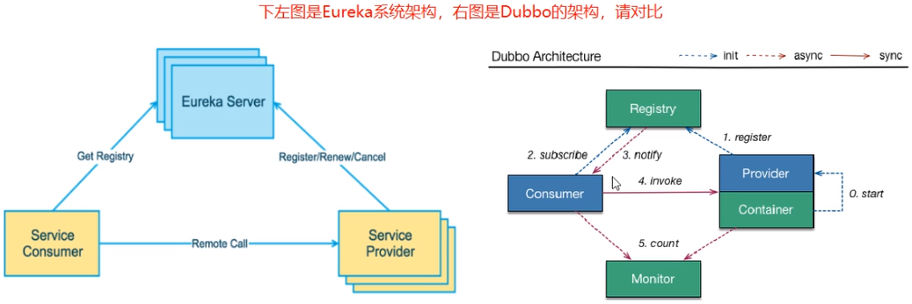
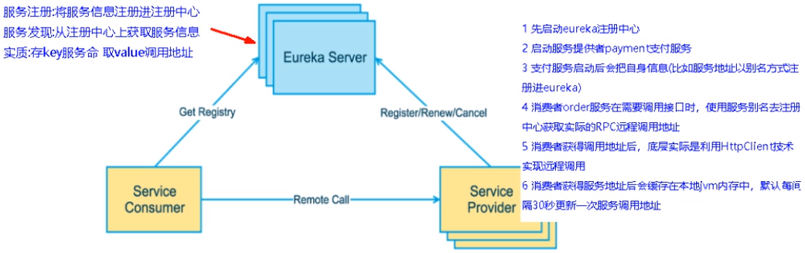
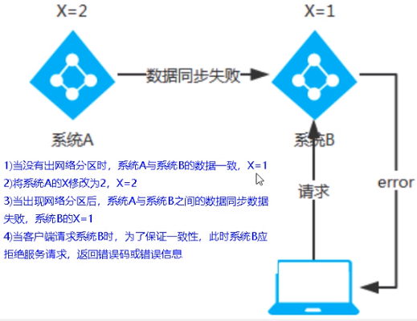
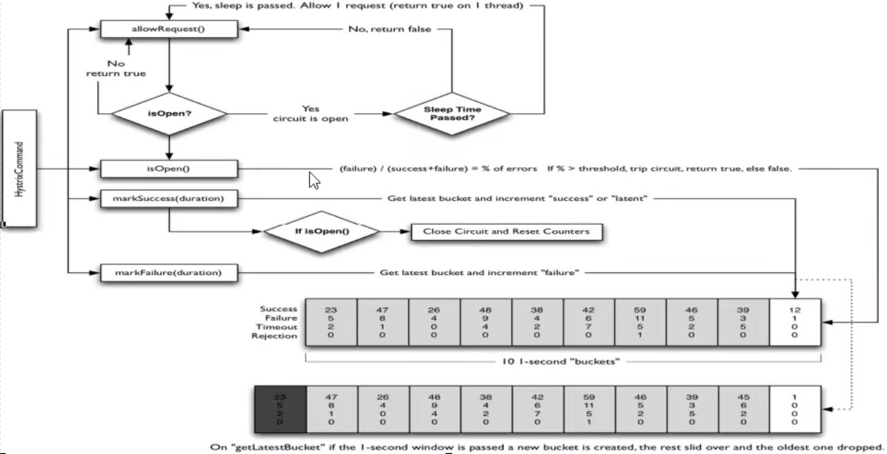
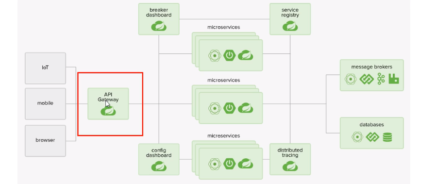
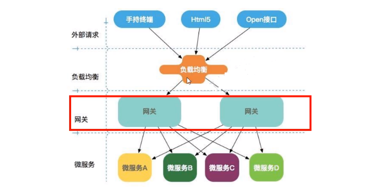
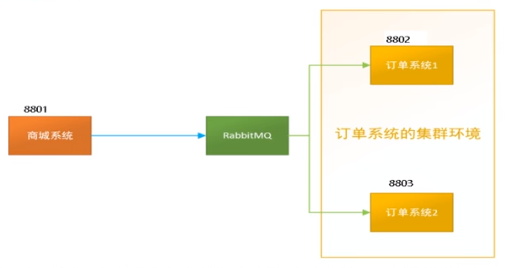

## 02_零基础[微服务](https://so.csdn.net/so/search?q=微服务&spm=1001.2101.3001.7020)架构理论入门

**什么是微服务**

```
In short, the microservice architectural style is an approach to developing a single application as a suite of small services, each running in its own process and communicating with lightweight mechanisms, often an HTTP resource API. These services are built around business capabilities and independently deployable by fully automated deployment machinery. There is a bare minimum of centralized management of these services, which may be written in different programming languages and use different data storage technologies.——James Lewis and Martin Fowler (2014)
```

- 微服务是一种架构风格
- 一个应用拆分为一组小型服务
- 每个服务运行在自己的进程内，也就是可独立部署和升级
- 服务之间使用轻量级HTTP交互
- 服务围绕业务功能拆分
- 可以由全自动部署机制独立部署
- 去中心化，服务自治。服务可以使用不同的语言、不同的存储技术


**主题词01：现代数字化生活-落地维度**

- 手机
- PC
- 智能家居
- …


**主题词02：分布式微服务架构-落地维度**

满足哪些维度？支撑起这些维度的具体技术？


- 服务调用
- 服务降级
- 服务注册与发先
- 服务熔断
- 负载均衡
- 服务消息队列
- 服务网关

- 配置中心管理
- 自动化构建部署
- 服务监控
- 全链路追踪
- 服务定时任务
- 调度操作


**Spring Cloud简介**

是什么？符合微服务技术维度

**SpringCloud=分布式微服务架构的站式解决方案，是多种微服务架构落地技术的集合体，俗称微服务全家桶**

猜猜SpringCloud这个大集合里有多少种技术?


SpringCloud俨然已成为微服务开发的主流技术栈，在国内开发者社区非常火爆。

**“微”力十足，互联网大厂微服务架构案例**


京东物流的：


**Spring Cloud技术栈**


**总结**


## 03_Boot和Cloud版本选型

- Spring Boot 2.X 版
  - [源码地址](https://github.com/spring-projects/spring-boot/releases/)
  - [Spring Boot 2 的新特性](https://github.com/spring-projects/spring-boot/wiki/spring-Boot-2.0-Release-Notes)
  - 通过上面官网发现，Boot官方**强烈建议**你升级到2.X以上版本
- Spring Cloud H版
  - [源码地址](https://github.com/spring-projects/spring-cloud)
  - [官网](https://spring.io/projects/spring-cloud)
- Spring Boot 与 Spring Cloud 兼容性查看
  - [文档](https://spring.io/projects/spring-cloud#adding-spring-cloud-to-an-existing-spring-boot-application)
  - [JSON接口](https://start.spring.io/actuator/info)
- 接下来开发用到的组件版本
  - Cloud - Hoxton.SR1
  - Boot - 2.2.2.RELEASE
  - Cloud Alibaba - 2.1.0.RELEASE
  - Java - Java 8
  - Maven - 3.5及以上
  - MySQL - 5.7及以上


## 04_Cloud组件停更说明

- 停更引发的“升级惨案”

  - 停更不停用
  - 被动修复bugs
  - 不再接受合并请求
  - 不再发布新版本

- Cloud升级

  - 服务注册中心
    - × Eureka
    - √ Zookeeper
    - √ Consul
    - √ Nacos
  - 服务调用
    - √ Ribbon
    - √ LoadBalancer
  - 服务调用2
    - × Feign
    - √ OpenFeign

  - 服务降级
    - × Hystrix
    - √ resilience4j
    - √ sentienl

  - 服务网关
    - × Zuul
    - ! Zuul2
    - √ gateway

  - 服务配置
    - × Config
    - √ Nacos

  - 服务总线
    - × Bus
    - √ Nacos

[Spring Cloud官方文档](https://cloud.spring.io/spring-cloud-static/Hoxton.SR1/reference/htmlsingle/)

[Spring Cloud中文文档](https://www.bookstack.cn/read/spring-cloud-docs/docs-index.md)

[Spring Boot官方文档](https://docs.spring.io/spring-boot/docs/2.2.2.RELEASE/reference/htmlsingle/)


## 05_父工程Project空间新建

约定 > 配置 > 编码

创建微服务cloud整体聚合父工程Project，有8个关键步骤：


1. New Project - maven工程 - create from archetype: maven-archetype-site
2. 聚合总父工程名字
3. Maven选版本
4. 工程名字
5. 字符编码 - Settings - File encoding
6. 注解生效激活 - Settings - Annotation Processors
7. Java编译版本选8
8. File Type过滤 - Settings - File Type


## 06_父工程pom文件

```xml
<?xml version="1.0" encoding="UTF-8"?>

<project xmlns="http://maven.apache.org/POM/4.0.0" xmlns:xsi="http://www.w3.org/2001/XMLSchema-instance"
         xsi:schemaLocation="http://maven.apache.org/POM/4.0.0 http://maven.apache.org/xsd/maven-4.0.0.xsd">
    <modelVersion>4.0.0</modelVersion>  

    <groupId>com.lun</groupId>
    <artifactId>LearnCloud</artifactId>
    <version>1.0.0-SNAPSHOT</version>
    <packaging>pom</packaging><!-- 这里添加，注意不是jar或war -->
    
    <!-- 统一管理jar包版本 -->
    <properties>
        <project.build.sourceEncoding>UTF-8</project.build.sourceEncoding>
        <maven.compiler.source>1.8</maven.compiler.source>
        <maven.compiler.target>1.8</maven.compiler.target>
        <junit.version>4.12</junit.version>
        <log4j.version>1.2.17</log4j.version>
        <lombok.version>1.16.18</lombok.version>
        <mysql.version>5.1.47</mysql.version>
        <druid.version>1.1.16</druid.version>
        <mybatis.spring.boot.version>1.3.0</mybatis.spring.boot.version>
    </properties>
    
    <!-- 子模块继承之后，提供作用：
		锁定版本+子modlue不用写groupId和version -->
    <dependencyManagement>
        <dependencies>
            <!--spring boot 2.2.2-->
            <dependency>
                <groupId>org.springframework.boot</groupId>
                <artifactId>spring-boot-dependencies</artifactId>
                <version>2.2.2.RELEASE</version>
                <type>pom</type>
                <scope>import</scope>
            </dependency>
            <!--spring cloud Hoxton.SR1-->
            <dependency>
                <groupId>org.springframework.cloud</groupId>
                <artifactId>spring-cloud-dependencies</artifactId>
                <version>Hoxton.SR1</version>
                <type>pom</type>
                <scope>import</scope>
            </dependency>
            <!--spring cloud alibaba 2.1.0.RELEASE-->
            <dependency>
                <groupId>com.alibaba.cloud</groupId>
                <artifactId>spring-cloud-alibaba-dependencies</artifactId>
                <version>2.1.0.RELEASE</version>
                <type>pom</type>
                <scope>import</scope>
            </dependency>
            <dependency>
                <groupId>mysql</groupId>
                <artifactId>mysql-connector-java</artifactId>
                <version>${mysql.version}</version>
            </dependency>
            <dependency>
                <groupId>com.alibaba</groupId>
                <artifactId>druid</artifactId>
                <version>${druid.version}</version>
            </dependency>
            <dependency>
                <groupId>org.mybatis.spring.boot</groupId>
                <artifactId>mybatis-spring-boot-starter</artifactId>
                <version>${mybatis.spring.boot.version}</version>
            </dependency>
            <dependency>
                <groupId>junit</groupId>
                <artifactId>junit</artifactId>
                <version>${junit.version}</version>
            </dependency>
            <dependency>
                <groupId>log4j</groupId>
                <artifactId>log4j</artifactId>
                <version>${log4j.version}</version>
            </dependency>
            <dependency>
                <groupId>org.projectlombok</groupId>
                <artifactId>lombok</artifactId>
                <version>${lombok.version}</version>
                <optional>true</optional>
            </dependency>
        </dependencies>
    </dependencyManagement>

    <build>
        <plugins>
            <plugin>
                <groupId>org.springframework.boot</groupId>
                <artifactId>spring-boot-maven-plugin</artifactId>
                <configuration>
                    <fork>true</fork>
                    <addResources>true</addResources>
                </configuration>
            </plugin>
        </plugins>
    </build>

</project>
```


## 07_复习DependencyManagement和Dependencies

Maven使用`dependencyManagement`元素来提供了一种管理依赖版本号的方式。

通常会在一个组织或者项目的最顶层的父POM中看到`dependencyManagement`元素。


使用pom.xml中的`dependencyManagement`元素能让所有在子项目中引用个依赖而不用显式的列出版本量。

Maven会沿着父子层次向上走，直到找到一个拥有`dependencyManagement`元素的项目，然后它就会使用这个
`dependencyManagement`元素中指定的版本号。

```xml
<dependencyManagement>
    <dependencies>
        <dependency>
        <groupId>mysq1</groupId>
        <artifactId>mysql-connector-java</artifactId>
        <version>5.1.2</version>
        </dependency>
    <dependencies>
</dependencyManagement>
```

然后在子项目里就可以添加`mysql-connector`时可以不指定版本号，例如：

```xml
<dependencies>
    <dependency>
    <groupId>mysq1</groupId>
    <artifactId>mysql-connector-java</artifactId>
    </dependency>
</dependencies>
```

这样做的**好处**就是：如果有多个子项目都引用同一样依赖，则可以避免在每个使用的子项目里都声明一个版本号，这样当想升级或切换到另一个版本时，只需要在顶层父容器里更新，而不需要一个一个子项目的修改；另外如果某个子项目需要另外的一个版本，只需要声明version就可。

- `dependencyManagement`里只是声明依赖，**并不实现引入**，因此**子项目需要显示的声明需要用的依赖**。

- 如果不在子项目中声明依赖，是不会从父项目中继承下来的；只有在子项目中写了该依赖项,并且没有指定具体版本，才会从父项目中继承该项，并且version和scope都读取自父pom。

- 如果子项目中指定了版本号，那么会使用子项目中指定的jar版本。


IDEA右侧旁的Maven插件有`Toggle ' Skip Tests' Mode`按钮，这样maven可以跳过单元测试

父工程创建完成执行`mvn : install`将父工程发布到仓库方便子工程继承。


## 08_支付模块构建(上)

创建微服务模块套路：

1. 建Module
2. 改POM
3. 写YML
4. 主启动
5. 业务类


创建cloud-provider-payment8001微服务提供者支付Module模块：

**1.建名为cloud-provider-payment8001的Maven工程**


**2.改POM**

```xml
<?xml version="1.0" encoding="UTF-8"?>
<project xmlns="http://maven.apache.org/POM/4.0.0"
         xmlns:xsi="http://www.w3.org/2001/XMLSchema-instance"
         xsi:schemaLocation="http://maven.apache.org/POM/4.0.0 http://maven.apache.org/xsd/maven-4.0.0.xsd">
    <parent>
        <artifactId>LearnCloud</artifactId>
        <groupId>com.lun</groupId>
        <version>1.0.0-SNAPSHOT</version>
    </parent>
    <modelVersion>4.0.0</modelVersion>

    <artifactId>cloud-provider-payment8001</artifactId>

    <dependencies>
        <!--包含了sleuth+zipkin-->
        <dependency>
            <groupId>org.springframework.cloud</groupId>
            <artifactId>spring-cloud-starter-zipkin</artifactId>
        </dependency>
        <!--eureka-client-->
        <dependency>
            <groupId>org.springframework.cloud</groupId>
            <artifactId>spring-cloud-starter-netflix-eureka-client</artifactId>
        </dependency>
            <!-- 引入自己定义的api通用包，可以使用Payment支付Entity -->
        <!--
        <dependency>
            <groupId>com.atguigu.springcloud</groupId>
            <artifactId>cloud-api-commons</artifactId>
            <version>${project.version}</version>
        </dependency>
        -->
        <dependency>
            <groupId>org.springframework.boot</groupId>
            <artifactId>spring-boot-starter-web</artifactId>
        </dependency>
        <dependency>
            <groupId>org.springframework.boot</groupId>
            <artifactId>spring-boot-starter-actuator</artifactId>
        </dependency>
        <dependency>
            <groupId>org.mybatis.spring.boot</groupId>
            <artifactId>mybatis-spring-boot-starter</artifactId>
        </dependency>
        <dependency>
            <groupId>com.alibaba</groupId>
            <artifactId>druid-spring-boot-starter</artifactId>
            <version>1.1.10</version>
        </dependency>
        <!--mysql-connector-java-->
        <dependency>
            <groupId>mysql</groupId>
            <artifactId>mysql-connector-java</artifactId>
        </dependency>
        <!--jdbc-->
        <dependency>
            <groupId>org.springframework.boot</groupId>
            <artifactId>spring-boot-starter-jdbc</artifactId>
        </dependency>
        <dependency>
            <groupId>org.springframework.boot</groupId>
            <artifactId>spring-boot-devtools</artifactId>
            <scope>runtime</scope>
            <optional>true</optional>
        </dependency>
        <dependency>
            <groupId>org.projectlombok</groupId>
            <artifactId>lombok</artifactId>
            <optional>true</optional>
        </dependency>
        <dependency>
            <groupId>org.springframework.boot</groupId>
            <artifactId>spring-boot-starter-test</artifactId>
            <scope>test</scope>
        </dependency>
    </dependencies>

</project>
```

**3.写YML**

```yml
server:
  port: 8001

spring:
  application:
    name: cloud-payment-service
  datasource:
    type: com.alibaba.druid.pool.DruidDataSource            # 当前数据源操作类型
    driver-class-name: org.gjt.mm.mysql.Driver              # mysql驱动包
    url: jdbc:mysql://localhost:3306/my?useUnicode=true&characterEncoding=utf-8&useSSL=false
    username: root
    password: 1234

mybatis:
  mapperLocations: classpath:mapper/*.xml
  type-aliases-package: com.lun.springcloud.entities    # 所有Entity别名类所在包
```


**4.主启动**

```java
import org.springframework.boot.SpringApplication;
import org.springframework.boot.autoconfigure.SpringBootApplication;

@SpringBootApplication
public class PaymentMain001 {

    public static void main(String[] args) {
        SpringApplication.run(PaymentMain001.class, args);
    }
}
```


## 09_支付模块构建(中)


**5.业务类**

### **SQL**

```sql
CREATE TABLE `payment`(
	`id` bigint(20) NOT NULL AUTO_INCREMENT COMMENT 'ID',
    `serial` varchar(200) DEFAULT '',
	PRIMARY KEY (id)
)ENGINE=InnoDB AUTO_INCREMENT=1 DEFAULT CHARSET=utf8mb4
```

### **Entities**

实体类Payment：

```java
package com.shf.springcloud.entities;

import lombok.AllArgsConstructor;
import lombok.Data;
import lombok.NoArgsConstructor;

import java.io.Serializable;

/**
 * @Author:Su HangFei
 * @Date:2023-02-14 17 12
 * @Project:Cloud
 */
@Data
@AllArgsConstructor
@NoArgsConstructor
public class Payment implements Serializable {
    private Long id;
    private String serial;
}
```

JSON封装体CommonResult：

```java
package com.shf.springcloud.entities;

import lombok.AllArgsConstructor;
import lombok.Data;
import lombok.NoArgsConstructor;

/**
 * @Author:Su HangFei
 * @Date:2023-02-14 17 14
 * @Project:Cloud
 */
@Data
@AllArgsConstructor
@NoArgsConstructor
public class CommonResult<T> {
    private Integer code;
    private String message;
    private T data;

    public CommonResult(Integer code, String message) {
        this.code = code;
        this.message = message;
    }
}
```


### **DAO**

接口PaymentDao：

```java
package com.shf.springcloud.dao;

import com.shf.springcloud.entities.Payment;
import org.apache.ibatis.annotations.Mapper;
import org.apache.ibatis.annotations.Param;

@Mapper
public interface PaymentDao {
    int create(Payment payment);

    Payment getPaymentById(@Param("id") Long id);

}
```

MyBatis映射文件PaymentMapper.xml，路径：resources/mapper/PaymentMapper.xml

```xml
<?xml version="1.0" encoding="UTF-8" ?>
<!DOCTYPE mapper
        PUBLIC "-//mybatis.org//DTD Mapper 3.0//EN"
        "http://mybatis.org/dtd/mybatis-3-mapper.dtd">

<mapper namespace="com.shf.springcloud.dao.PaymentDao">
    <insert id="create" parameterType="Payment" useGeneratedKeys="true" keyProperty="id">
        insert into payment(serial) values (#{serial});
    </insert>

    <resultMap id="BaseResultMap" type="com.shf.springcloud.entities.Payment">
        <id column="id" property="id" jdbcType="BIGINT" />
        <id column="serial" property="serial" jdbcType="VARCHAR" />
    </resultMap>
    <select id="getPaymentById" parameterType="Long" resultMap="BaseResultMap">
        select * from payment where id=#{id};
    </select>
</mapper>
```


### **Service**

接口PaymentService

```java
package com.shf.springcloud.service;

import com.shf.springcloud.entities.Payment;
import org.apache.ibatis.annotations.Param;

/**
 * @Author:Su HangFei
 * @Date:2023-02-14 20 42
 * @Project:Cloud
 */
public interface PaymentService {
    public int create(Payment payment);

    public Payment getPaymentById(@Param("id") Long id);
}
```

实现类


```java
package com.shf.springcloud.service.impl;

import com.shf.springcloud.dao.PaymentDao;
import com.shf.springcloud.entities.Payment;
import com.shf.springcloud.service.PaymentService;
import org.springframework.beans.factory.annotation.Autowired;
import org.springframework.stereotype.Service;

/**
 * @Author:Su HangFei
 * @Date:2023-02-14 20 44
 * @Project:Cloud
 */
@Service
public class PaymentServiceImpl implements PaymentService {

    @Autowired
    private PaymentDao paymentDao;

    public int create(Payment payment){
        return paymentDao.create(payment);
    }

    public Payment getPaymentById(Long id){
        return paymentDao.getPaymentById(id);
    }
}
```


### **Controller**

```java
package com.shf.springcloud.controller;

import com.shf.springcloud.entities.CommonResult;
import com.shf.springcloud.entities.Payment;
import com.shf.springcloud.service.PaymentService;
import lombok.extern.slf4j.Slf4j;
import org.springframework.beans.factory.annotation.Autowired;
import org.springframework.web.bind.annotation.*;

/**
 * @Author:Su HangFei
 * @Date:2023-02-14 20 52
 * @Project:Cloud
 */
@RestController
@Slf4j
public class PaymentController {

    @Autowired
    private PaymentService paymentService;

    @PostMapping("/payment/create")
    public CommonResult create(@RequestBody Payment payment){
        int result = paymentService.create(payment);

        log.info("*****插入结果："+result);

        if(result > 0)
        {
            return new CommonResult(200,"插入数据库成功",result);
        }else{
            return new CommonResult(444,"插入数据库失败",null);
        }
    }

    @GetMapping("/payment/get/{id}")
    public CommonResult getPaymentById(@PathVariable("id") Long id){
        Payment payment = paymentService.getPaymentById(id);

        log.info("*****查询结果："+payment);

        if(payment != null)
        {
            return new CommonResult(200,"查询成功",payment);
        }else{
            return new CommonResult(444,"查询数据库失败",null);
        }
    }

}
```


## 10_支付模块构建(下)

**6.测试**

1. 浏览器 - http://localhost:8001/payment/get/1
2. Postman - http://localhost:8001/payment/create?serial=lun2


**7.小总结**

创建微服务模块套路：

1. 建Module
2. 改POM
3. 写YML
4. 主启动
5. 业务类


## 11_[热部署](https://so.csdn.net/so/search?q=热部署&spm=1001.2101.3001.7020)Devtools

**开发时使用，生产环境关闭**

**1.Adding devtools to your project**

```xml
<dependency>
    <groupId>org.springframework.boot</groupId>
    <artifactId>spring-boot-devtools</artifactId>
    <scope>runtime</scope>
    <optional>true</optional>
</dependency>
```

**2.Adding plugin to your pom.xml**

下段配置复制到聚合父类总工程的pom.xml

```xml
<build>
    <!--
	<finalName>你的工程名</finalName>（单一工程时添加）
    -->
    <plugins>
        <plugin>
            <groupId>org.springframework.boot</groupId>
            <artifactId>spring-boot-maven-plugin</artifactId>
            <configuration>
                <fork>true</fork>
                <addResources>true</addResources>
            </configuration>
        </plugin>
    </plugins>
</build>
```

**3.Enabling automatic build**

File -> Settings(New Project Settings->Settings for New Projects) ->Complier

下面项勾选

- Automatically show first error in editor
- Display notification on build completion

- Build project automatically
- Compile independent modules in parallel


**4.Update the value of**

键入Ctrl + Shift + Alt + / ，打开Registry，勾选：

- compiler.automake.allow.when.app.running
- actionSystem.assertFocusAccessFromEdt


**5.重启IDEA**


## 12_消费者订单模块(上)

**1.建Module**

创建名为cloud-consumer-order80的maven工程。


**2.改POM**

```xml
<?xml version="1.0" encoding="UTF-8"?>

<project xmlns="http://maven.apache.org/POM/4.0.0" xmlns:xsi="http://www.w3.org/2001/XMLSchema-instance"
         xsi:schemaLocation="http://maven.apache.org/POM/4.0.0 http://maven.apache.org/xsd/maven-4.0.0.xsd">
  <parent>
    <artifactId>LearnCloud</artifactId>
    <groupId>com.lun</groupId>
    <version>1.0.0-SNAPSHOT</version>
  </parent>
  <modelVersion>4.0.0</modelVersion>

  <artifactId>cloud-consumer-order80</artifactId>

  <properties>
    <project.build.sourceEncoding>UTF-8</project.build.sourceEncoding>
    <maven.compiler.source>1.7</maven.compiler.source>
    <maven.compiler.target>1.7</maven.compiler.target>
  </properties>

  <dependencies>
    <dependency>
      <groupId>org.springframework.boot</groupId>
      <artifactId>spring-boot-starter-web</artifactId>
    </dependency>
    <dependency>
      <groupId>org.springframework.boot</groupId>
      <artifactId>spring-boot-starter-actuator</artifactId>
    </dependency>

    <dependency>
      <groupId>org.springframework.boot</groupId>
      <artifactId>spring-boot-devtools</artifactId>
      <scope>runtime</scope>
      <optional>true</optional>
    </dependency>
    <dependency>
      <groupId>org.projectlombok</groupId>
      <artifactId>lombok</artifactId>
      <optional>true</optional>
    </dependency>
    <dependency>
      <groupId>org.springframework.boot</groupId>
      <artifactId>spring-boot-starter-test</artifactId>
      <scope>test</scope>
    </dependency>
  </dependencies>
</project>
```


**3.写YML**

```yml
server:
  port: 80
```


**4.主启动**

```java
import org.springframework.boot.SpringApplication;
import org.springframework.boot.autoconfigure.SpringBootApplication;

/**
 * Hello world!
 *
 */
@SpringBootApplication
public class OrderMain80
{
    public static void main( String[] args ){
        SpringApplication.run(OrderMain80.class, args);
    }
}
```


**5.业务类**

实体类：

```java
import lombok.AllArgsConstructor;
import lombok.Data;
import lombok.NoArgsConstructor;

import java.io.Serializable;

@Data
@AllArgsConstructor
@NoArgsConstructor
public class Payment implements Serializable {
    private Long id;
    private String serial;
}
```

```java
import lombok.AllArgsConstructor;
import lombok.Data;
import lombok.NoArgsConstructor;

@Data
@AllArgsConstructor
@NoArgsConstructor
public class CommonResult<T>{
    private Integer code;
    private String message;
    private T data;

    public CommonResult(Integer code, String message){
        this(code, message, null);
    }
}
```


控制层：

```java
import com.lun.springcloud.entities.CommonResult;
import com.lun.springcloud.entities.Payment;
import lombok.extern.slf4j.Slf4j;
import org.springframework.web.bind.annotation.GetMapping;
import org.springframework.web.bind.annotation.PathVariable;
import org.springframework.web.bind.annotation.RestController;
import org.springframework.web.client.RestTemplate;

import javax.annotation.Resource;

@Slf4j
@RestController
public class OrderController {

    public static final String PAYMENT_URL = "http://localhost:8001";

    @Resource
    private RestTemplate restTemplate;

    @GetMapping("/consumer/payment/create")
    public CommonResult<Payment> create(Payment payment){

        return restTemplate.postForObject(PAYMENT_URL+"/payment/create", payment, CommonResult.class);
    }

    @GetMapping("/consumer/payment/get/{id}")
    public CommonResult<Payment> getPayment(@PathVariable("id") Long id){
        return restTemplate.getForObject(PAYMENT_URL+"/payment/get/"+id, CommonResult.class);
    }
}
```

配置类：

```java
import org.springframework.context.annotation.Bean;
import org.springframework.context.annotation.Configuration;
import org.springframework.web.client.RestTemplate;

@Configuration
public class ApplicationContextConfig {

    @Bean
    public RestTemplate getRestTemplate(){
        return new RestTemplate();
    }

}
```


**6.测试**

运行cloud-consumer-order80与cloud-provider-payment8001两工程

- 浏览器 - http://localhost/consumer/payment/get/1


**RestTemplate**

RestTemplate提供了多种便捷访问远程Http服务的方法，是一种简单便捷的访问restful服务模板类，是Spring提供的用于访问Rest服务的客户端模板工具集

[官网地址](https://docs.spring.io/spring-framework/docs/5.2.2.RELEASE/javadoc-api/org/springframework/web/client/RestTemplate.html)

使用：

- 使用restTemplate访问restful接口非常的简单粗暴无脑。
- `(url, requestMap, ResponseBean.class)`这三个参数分别代表。
- REST请求地址、请求参数、HTTP响应转换被转换成的对象类型。


## 13_消费者订单模块(下)

浏览器 - http://localhost/consumer/payment/create?serial=lun3

虽然，返回成功，但是观测数据库中，并没有创建serial为lun3的行。

解决之道：在loud-provider-payment8001工程的PaymentController中添加@RequestBody注解。


```java
public class PaymentController
{

    @PostMapping(value = "/payment/create")
    public CommonResult create(@RequestBody/*添加到这里*/ Payment payment){
		...
    }
}
```

通过修改idea的workspace.xml的方式来快速打开Run Dashboard窗口（这个用来显示哪些Spring Boot工程运行，停止等信息。我idea 2020.1版本在名为Services窗口就可以显示哪些Spring Boot工程运行，停止等信息出来，所以这仅作记录参考）。

- 开启Run DashBoard
  1. 打开工程路径下的.idea文件夹的workspace.xml
  2. 在`<component name="RunDashboard">`中修改或添加以下代码：

```
<option name="configurationTypes">
	<set>
		<option value="SpringBootApplicationConfigurationType"/>
    </set>
</option>
```

由于idea版本差异，可能需要关闭重启。


## 14_工程重构

观察cloud-consumer-order80与cloud-provider-payment8001两工程有重复代码（entities包下的实体）（坏味道），重构。

1.新建 - cloud-api-commons

2.POM

```xml
<?xml version="1.0" encoding="UTF-8"?>
<project xmlns="http://maven.apache.org/POM/4.0.0"
         xmlns:xsi="http://www.w3.org/2001/XMLSchema-instance"
         xsi:schemaLocation="http://maven.apache.org/POM/4.0.0 http://maven.apache.org/xsd/maven-4.0.0.xsd">
    <parent>
        <artifactId>LearnCloud</artifactId>
        <groupId>com.lun.springcloud</groupId>
        <version>1.0.0-SNAPSHOT</version>
    </parent>
    <modelVersion>4.0.0</modelVersion>

    <artifactId>cloud-api-commons</artifactId>

    <dependencies>
        <dependency>
            <groupId>org.springframework.boot</groupId>
            <artifactId>spring-boot-devtools</artifactId>
            <scope>runtime</scope>
            <optional>true</optional>
        </dependency>
        <dependency>
            <groupId>org.projectlombok</groupId>
            <artifactId>lombok</artifactId>
            <optional>true</optional>
        </dependency>
        <dependency>
            <groupId>cn.hutool</groupId>
            <artifactId>hutool-all</artifactId>
            <version>5.1.0</version>
        </dependency>
    </dependencies>

</project>
```


3.entities

将cloud-consumer-order80与cloud-provider-payment8001两工程的公有entities包移至cloud-api-commons工程下。


4.maven clean、install cloud-api-commons工程，以供给cloud-consumer-order80与cloud-provider-payment8001两工程调用。


5.订单80和支付8001分别改造

- 将cloud-consumer-order80与cloud-provider-payment8001两工程的公有entities包移除
- 引入cloud-api-commons依赖

```xml
<dependency>
    <groupId>com.lun.springcloud</groupId>
    <artifactId>cloud-api-commons</artifactId>
    <version>${project.version}</version>
</dependency>
```


6.测试


## 15_Eureka基础知识


**什么是服务治理**

Spring Cloud封装了Netflix 公司开发的Eureka模块来实现服务治理

在传统的RPC远程调用框架中，管理每个服务与服务之间依赖关系比较复杂，管理比较复杂，所以需要使用服务治理，管理服务于服务之间依赖关系，可以实现服务调用、负载均衡、容错等，实现服务发现与注册。

**什么是服务注册与发现**

Eureka采用了CS的设计架构，Eureka Sever作为服务注册功能的服务器，它是服务注册中心。而系统中的其他微服务，使用Eureka的客户端连接到 Eureka Server并维持心跳连接。这样系统的维护人员就可以通过Eureka Server来监控系统中各个微服务是否正常运行。

在服务注册与发现中，有一个注册中心。当服务器启动的时候，会把当前自己服务器的信息比如服务地址通讯地址等以别名方式注册到注册中心上。另一方(消费者服务提供者)，以该别名的方式去注册中心上获取到实际的服务通讯地址，然后再实现本地RPC调用RPC远程调用框架核心设计思想:在于注册中心，因为使用注册中心管理每个服务与服务之间的一个依赖关系(服务治理概念)。在任何RPC远程框架中，都会有一个注册中心存放服务地址相关信息(接口地址)





**Eureka包含两个组件:Eureka Server和Eureka Client**

**Eureka Server**提供服务注册服务

各个微服务节点通过配置启动后，会在EurekaServer中进行注册，这样EurekaServer中的服务注册表中将会存储所有可用服务节点的信息，服务节点的信息可以在界面中直观看到。


**EurekaClient**通过注册中心进行访问

它是一个Java客户端，用于简化Eureka Server的交互，客户端同时也具备一个内置的、使用轮询(round-robin)负载算法的负载均衡器。在应用启动后，将会向Eureka Server发送心跳(默认周期为30秒)。如果Eureka Server在多个心跳周期内没有接收到某个节点的心跳，EurekaServer将会从服务注册表中把这个服务节点移除（默认90秒)


## 16_EurekaServer服务端安装

IDEA生成eurekaServer端服务注册中心，类似物业公司

1.创建名为cloud-eureka-server7001的Maven工程

2.修改pom.xml

```xml
<!-- eureka新旧版本 -->
<!-- 以前的老版本（2018）-->
<dependency>
    <groupid>org.springframework.cloud</groupId>
    <artifactId>spring-cloud-starter-eureka</artifactId>
</dependency>

<!-- 现在新版本（2020.2）--><!-- 我们使用最新的 -->
<dependency>
    <groupId>org.springframework.cloud</groupId>
    <artifactId>spring-cloud-starter-netflix-eureka-server</artifactId>
</dependency>
```

```xml
<?xml version="1.0" encoding="UTF-8"?>
<project xmlns="http://maven.apache.org/POM/4.0.0"
         xmlns:xsi="http://www.w3.org/2001/XMLSchema-instance"
         xsi:schemaLocation="http://maven.apache.org/POM/4.0.0 http://maven.apache.org/xsd/maven-4.0.0.xsd">
    <parent>
        <artifactId>LearnCloud</artifactId>
        <groupId>com.lun.springcloud</groupId>
        <version>1.0.0-SNAPSHOT</version>
    </parent>
    <modelVersion>4.0.0</modelVersion>

    <artifactId>cloud-eureka-server7001</artifactId>

    <dependencies>
        <!--eureka-server-->
        <dependency>
            <groupId>org.springframework.cloud</groupId>
            <artifactId>spring-cloud-starter-netflix-eureka-server</artifactId>
        </dependency>
        <!-- 引入自己定义的api通用包，可以使用Payment支付Entity -->
        <dependency>
            <groupId>com.lun.springcloud</groupId>
            <artifactId>cloud-api-commons</artifactId>
            <version>${project.version}</version>
        </dependency>
        <!--boot web actuator-->
        <dependency>
            <groupId>org.springframework.boot</groupId>
            <artifactId>spring-boot-starter-web</artifactId>
        </dependency>
        <dependency>
            <groupId>org.springframework.boot</groupId>
            <artifactId>spring-boot-starter-actuator</artifactId>
        </dependency>
        <!--一般通用配置-->
        <dependency>
            <groupId>org.springframework.boot</groupId>
            <artifactId>spring-boot-devtools</artifactId>
            <scope>runtime</scope>
            <optional>true</optional>
        </dependency>
        <dependency>
            <groupId>org.projectlombok</groupId>
            <artifactId>lombok</artifactId>
        </dependency>
        <dependency>
            <groupId>org.springframework.boot</groupId>
            <artifactId>spring-boot-starter-test</artifactId>
            <scope>test</scope>
        </dependency>
        <dependency>
            <groupId>junit</groupId>
            <artifactId>junit</artifactId>
        </dependency>
    </dependencies>

</project>
```

3.添加application.yml

```yml
server:
  port: 7001

eureka:
  instance:
    hostname: locathost #eureka服务端的实例名称
  client:
    #false表示不向注册中心注册自己。
    register-with-eureka: false
    #false表示自己端就是注册中心，我的职责就是维护服务实例，并不需要去检索服务
    fetch-registry: false
    service-url:
      #设置与Eureka server交互的地址查询服务和注册服务都需要依赖这个地址。
      defaultZone: http://${eureka.instance.hostname}:${server.port}/eureka/
```

4.主启动

```java
import org.springframework.boot.SpringApplication;
import org.springframework.boot.autoconfigure.SpringBootApplication;
import org.springframework.cloud.netflix.eureka.server.EnableEurekaServer;

@SpringBootApplication
@EnableEurekaServer
public class EurekaMain7001 {
    public static void main(String[] args) {
        SpringApplication.run(EurekaMain7001.class, args);
    }
}
```

5.测试运行`EurekaMain7001`，浏览器输入`http://localhost:7001/`回车，会查看到Spring Eureka服务主页。


## 17_支付微服务8001入驻进EurekaServer

EurekaClient端cloud-provider-payment8001将注册进EurekaServer成为服务提供者provider，类似学校对外提供授课服务。

1.修改cloud-provider-payment8001

2.改POM

添加spring-cloud-starter-netflix-eureka-client依赖


```xml
<dependency>
    <groupId>org.springframework.cloud</groupId>
    <artifactId>spring-cloud-starter-netflix-eureka-client</artifactId>
</dependency>
```

3.写YML

```ynl
eureka:
  client:
    #表示是否将自己注册进Eurekaserver默认为true。
    register-with-eureka: true
    #是否从EurekaServer抓取已有的注册信息，默认为true。单节点无所谓，集群必须设置为true才能配合ribbon使用负载均衡
    fetchRegistry: true
    service-url:
      defaultZone: http://localhost:7001/eureka
```

4.主启动

```java
import org.springframework.boot.SpringApplication;
import org.springframework.boot.autoconfigure.SpringBootApplication;
import org.springframework.cloud.netflix.eureka.EnableEurekaClient;

@SpringBootApplication
@EnableEurekaClient//<-----添加该注解
public class PaymentMain001 {

    public static void main(String[] args) {
        SpringApplication.run(PaymentMain001.class, args);
    }
}
```

5.测试

- 启动cloud-provider-payment8001和cloud-eureka-server7001工程。
- 浏览器输入 - http://localhost:7001/ 主页内的Instances currently registered with Eureka会显示cloud-provider-payment8001的配置文件application.yml设置的应用名cloud-payment-service

```yml
spring:
  application:
    name: cloud-payment-service
```


6.自我保护机制

EMERGENCY! EUREKA MAY BE INCORRECTLY CLAIMING INSTANCES ARE UP WHEN THEY’RE NOT. RENEWALS ARELESSER THAN THRESHOLD AND HENCFT ARE NOT BEING EXPIRED JUST TO BE SAFE.


紧急情况！EUREKA可能错误地声称实例在没有启动的情况下启动了。续订小于阈值，因此实例不会为了安全而过期。


## 18_订单微服务80入驻进EurekaServer

EurekaClient端cloud-consumer-order80将注册进EurekaServer成为服务消费者consumer，类似来上课消费的同学

1.cloud-consumer-order80

2.POM

```xml
<dependency>
    <groupId>org.springframework.cloud</groupId>
    <artifactId>spring-cloud-starter-netflix-eureka-client</artifactId>
</dependency>
```

3.YML

```yml
server:
  port: 80

spring:
  application:
    name: cloud-order-service

eureka:
  client:
    #表示是否将自己注册进Eurekaserver默认为true。
    register-with-eureka: true
    #是否从EurekaServer抓取已有的注册信息，默认为true。单节点无所谓，集群必须设置为true才能配合ribbon使用负载均衡
    fetchRegistry: true
    service-url:
      defaultZone: http://localhost:7001/eureka
```

4.主启动

```java
import org.springframework.boot.SpringApplication;
import org.springframework.boot.autoconfigure.SpringBootApplication;
import org.springframework.cloud.netflix.eureka.EnableEurekaClient;

@SpringBootApplication
@EnableEurekaClient//<--- 添加该标签
public class OrderMain80
{
    public static void main( String[] args ){
        SpringApplication.run(OrderMain80.class, args);
    }
}
```

5.测试

- 启动cloud-provider-payment8001、cloud-eureka-server7001和cloud-consumer-order80这三工程。

- 浏览器输入 http://localhost:7001 , 在主页的Instances currently registered with Eureka将会看到cloud-provider-payment8001、cloud-consumer-order80两个工程名。

注意，application.yml配置中层次缩进和空格，两者不能少，否则，会抛出异常Failed to bind properties under 'eureka.client.service-url' to java.util.Map <java.lang.String, java.lang.String>。


## 19_Eureka集群原理说明



服务注册：将服务信息注册进注册中心

服务发现：从注册中心上获取服务信息

实质：存key服务命取value闭用地址

1先启动eureka注主册中心

2启动服务提供者payment支付服务

3支付服务启动后会把自身信息(比服务地址L以别名方式注朋进eureka

4消费者order服务在需要调用接口时，使用服务别名去注册中心获取实际的RPC远程调用地址

5消去者导调用地址后，底屋实际是利用HttpClient技术实现远程调用

6消费者实癸导服务地址后会缓存在本地jvm内存中，默认每间隔30秒更新—次服务调用地址


问题:微服务RPC远程服务调用最核心的是什么

高可用，试想你的注册中心只有一个only one，万一它出故障了，会导致整个为服务环境不可用。

解决办法：搭建Eureka注册中心集群，实现负载均衡+故障容错。


**互相注册，相互守望**。


## 20_Eureka集群环境构建

创建cloud-eureka-server7002工程，过程参考[16_EurekaServer服务端安装](https://blog.csdn.net/u011863024/article/details/114298270#)

- 找到C:\Windows\System32\drivers\etc路径下的hosts文件，修改映射配置添加进hosts文件

```xml
127.0.0.1 eureka7001.com
127.0.0.1 eureka7002.com
```

- 修改cloud-eureka-server7001配置文件

```yml
server:
  port: 7001

eureka:
  instance:
    hostname: eureka7001.com #eureka服务端的实例名称
  client:
    register-with-eureka: false     #false表示不向注册中心注册自己。
    fetch-registry: false     #false表示自己端就是注册中心，我的职责就是维护服务实例，并不需要去检索服务
    service-url:
    #集群指向其它eureka
      defaultZone: http://eureka7002.com:7002/eureka/
    #单机就是7001自己
      #defaultZone: http://eureka7001.com:7001/eureka/
```

- 修改cloud-eureka-server7002配置文件

```yml
server:
  port: 7002

eureka:
  instance:
    hostname: eureka7002.com #eureka服务端的实例名称
  client:
    register-with-eureka: false     #false表示不向注册中心注册自己。
    fetch-registry: false     #false表示自己端就是注册中心，我的职责就是维护服务实例，并不需要去检索服务
    service-url:
    #集群指向其它eureka
      defaultZone: http://eureka7001.com:7001/eureka/
    #单机就是7002自己
      #defaultZone: http://eureka7002.com:7002/eureka/
```

实践的时候，遇到异常情况

在开启cloud-eureka-server7002时，开启失败，说7002端口被占用，然后在cmd中输入`netstat -ano | find "7002"`，查不到任何东西。

纳闷一阵，重启电脑，问题解决。


## 21_订单支付两微服务注册进Eureka集群

- 将支付服务8001微服务，订单服务80微服务发布到上面2台Eureka集群配置中

将它们的配置文件的eureka.client.service-url.defaultZone进行修改

```yml
eureka:
  client:
    #表示是否将自己注册进Eurekaserver默认为true。
    register-with-eureka: true
    #是否从EurekaServer抓取已有的注册信息，默认为true。单节点无所谓，集群必须设置为true才能配合ribbon使用负载均衡
    fetchRegistry: true
    service-url:
      defaultZone: http://eureka7001.com:7001/eureka, http://eureka7002.com:7002/eureka
```


测试01

1. 先要启动EurekaServer，7001/7002服务
2. 再要启动服务提供者provider，8001
3. 再要启动消费者，80
4. 浏览器输入 - http://localhost/consumer/payment/get/1


## 22_支付微服务集群配置

**支付服务提供者8001集群环境构建**

参考cloud-provicer-payment8001

1.新建cloud-provider-payment8002

2.改POM

3.写YML - 端口8002

4.主启动

5.业务类

6.修改8001/8002的Controller，添加serverPort

```java
@RestController
@Slf4j
public class PaymentController{

    @Value("${server.port}")
    private String serverPort;//添加serverPort

    @PostMapping(value = "/payment/create")
    public CommonResult create(@RequestBody Payment payment)
    {
        int result = paymentService.create(payment);
        log.info("*****插入结果：" + result);

        if(result > 0) {
            return new CommonResult(200,"插入数据库成功,serverPort: "+serverPort/*添加到此处*/, result);
        }else{
            return new CommonResult(444,"插入数据库失败",null);
        }
    }
}
```

**负载均衡**

cloud-consumer-order80订单服务访问地址不能写死

```java
@Slf4j
@RestController
public class OrderController {

    //public static final String PAYMENT_URL = "http://localhost:8001";
    public static final String PAYMENT_URL = "http://CLOUD-PAYMENT-SERVICE";
    
    ...
}
```

使用@LoadBalanced注解赋予RestTemplate负载均衡的能力

```java
import org.springframework.cloud.client.loadbalancer.LoadBalanced;
import org.springframework.context.annotation.Bean;
import org.springframework.context.annotation.Configuration;
import org.springframework.web.client.RestTemplate;

@Configuration
public class ApplicationContextConfig {

    @Bean
    @LoadBalanced//使用@LoadBalanced注解赋予RestTemplate负载均衡的能力
    public RestTemplate getRestTemplate(){
        return new RestTemplate();
    }

}
```

ApplicationContextBean - 提前说一下Ribbon的负载均衡功能


**测试**

先要启动EurekaServer，7001/7002服务

再要启动服务提供者provider，8001/8002服务

浏览器输入 - http://localhost/consumer/payment/get/31

结果：负载均衡效果达到，8001/8002端口交替出现

Ribbon和Eureka整合后Consumer可以直接调用服务而不用再关心地址和端口号，且该服务还有负载功能。

**相互注册，相互守望**


## 23_actuator微服务信息完善

主机名称：服务名称修改（也就是将IP地址，换成可读性高的名字）

修改cloud-provider-payment8001，cloud-provider-payment8002

修改部分 - YML - eureka.instance.instance-id

```yml
eureka:
  ...
  instance:
    instance-id: payment8001 #添加此处
```

```yml
eureka:
  ...
  instance:
    instance-id: payment8002 #添加此处
```

修改之后

eureka主页将显示payment8001，payment8002代替原来显示的IP地址。

---

访问信息有IP信息提示，（就是将鼠标指针移至payment8001，payment8002名下，会有IP地址提示）

修改部分 - YML - eureka.instance.prefer-ip-address

```yml
eureka:
  ...
  instance:
    instance-id: payment8001 
    prefer-ip-address: true #添加此处
```

```yml
eureka:
  ...
  instance:
    instance-id: payment8002
    prefer-ip-address: true #添加此处
```


## 24_服务发现Discovery

对于注册进eureka里面的微服务，可以通过服务发现来获得该服务的信息

- 修改cloud-provider-payment8001的Controller

```java
@RestController
@Slf4j
public class PaymentController{
	...
    
    @Resource
    private DiscoveryClient discoveryClient;

    ...

    @GetMapping(value = "/payment/discovery")
    public Object discovery()
    {
        List<String> services = discoveryClient.getServices();
        for (String element : services) {
            log.info("*****element: "+element);
        }

        List<ServiceInstance> instances = discoveryClient.getInstances("CLOUD-PAYMENT-SERVICE");
        for (ServiceInstance instance : instances) {
            log.info(instance.getServiceId()+"\t"+instance.getHost()+"\t"+instance.getPort()+"\t"+instance.getUri());
        }

        return this.discoveryClient;
    }
}
```

- 8001主启动类

```java
@SpringBootApplication
@EnableEurekaClient
@EnableDiscoveryClient//添加该注解
public class PaymentMain001 {

    public static void main(String[] args) {
        SpringApplication.run(PaymentMain001.class, args);
    }
}
```

- 自测

先要启动EurekaSeryer

再启动8001主启动类，需要稍等一会儿

浏览器输入http://localhost:8001/payment/discovery

浏览器输出：

```json
{"services":["cloud-payment-service"],"order":0}
```

后台输出：

```
*****element: cloud-payment-service
CLOUD-PAYMENT-SERVICE	192.168.199.218	8001	http://192.168.199.218:8001
```


## 25_Eureka自我保护理论知识

**概述**

保护模式主要用于一组客户端和Eureka Server之间存在网络分区场景下的保护。一旦进入保护模式，Eureka Server将会尝试保护其服务注册表中的信息，不再删除服务注册表中的数据，也就是不会注销任何微服务。

如果在Eureka Server的首页看到以下这段提示，则说明Eureka进入了保护模式:

EMERGENCY! EUREKA MAY BE INCORRECTLY CLAIMING INSTANCES ARE UP WHEN THEY’RE NOT. RENEWALS ARE LESSER THANTHRESHOLD AND HENCE THE INSTANCES ARE NOT BEING EXPIRED JUSTTO BE SAFE


**导致原因**

一句话：某时刻某一个微服务不可用了，Eureka不会立刻清理，依旧会对该微服务的信息进行保存。

属于CAP里面的AP分支。

**为什么会产生Eureka自我保护机制?**

为了EurekaClient可以正常运行，防止与EurekaServer网络不通情况下，EurekaServer不会立刻将EurekaClient服务剔除


**什么是自我保护模式?**

默认情况下，如果EurekaServer在一定时间内没有接收到某个微服务实例的心跳，EurekaServer将会注销该实例(默认90秒)。但是当网络分区故障发生(延时、卡顿、拥挤)时，微服务与EurekaServer之间无法正常通信，以上行为可能变得非常危险了——因为微服务本身其实是健康的，此时本不应该注销这个微服务。Eureka通过“自我保护模式”来解决这个问题——当EurekaServer节点在短时间内丢失过多客户端时(可能发生了网络分区故障)，那么这个节点就会进入自我保护模式。


自我保护机制∶默认情况下EurekaClient定时向EurekaServer端发送心跳包

如果Eureka在server端在一定时间内(默认90秒)没有收到EurekaClient发送心跳包，便会直接从服务注册列表中剔除该服务，但是在短时间( 90秒中)内丢失了大量的服务实例心跳，这时候Eurekaserver会开启自我保护机制，不会剔除该服务（该现象可能出现在如果网络不通但是EurekaClient为出现宕机，此时如果换做别的注册中心如果一定时间内没有收到心跳会将剔除该服务，这样就出现了严重失误，因为客户端还能正常发送心跳，只是网络延迟问题，而保护机制是为了解决此问题而产生的)。

**在自我保护模式中，Eureka Server会保护服务注册表中的信息，不再注销任何服务实例**。

它的设计哲学就是宁可保留错误的服务注册信息，也不盲目注销任何可能健康的服务实例。一句话讲解：**好死不如赖活着**。

综上，自我保护模式是一种应对网络异常的安全保护措施。它的架构哲学是宁可同时保留所有微服务（健康的微服务和不健康的微服务都会保留）也不盲目注销任何健康的微服务。使用自我保护模式，可以让Eureka集群更加的健壮、稳定。


## 26_怎么禁止自我保护

- 在eurekaServer端7001处设置关闭自我保护机制

出厂默认，自我保护机制是开启的

使用`eureka.server.enable-self-preservation = false`可以禁用自我保护模式

```yml
eureka:
  ...
  server:
    #关闭自我保护机制，保证不可用服务被及时踢除
    enable-self-preservation: false
    eviction-interval-timer-in-ms: 2000
```

关闭效果：

spring-eureka主页会显示出一句：

**THE SELF PRESERVATION MODE IS TURNED OFF. THIS MAY NOT PROTECT INSTANCE EXPIRY IN CASE OF NETWORK/OTHER PROBLEMS.**

---

- 生产者客户端eureakeClient端8001

默认：

```
eureka.instance.lease-renewal-interval-in-seconds=30
eureka.instance.lease-expiration-duration-in-seconds=90
```

```yml
eureka:
  ...
  instance:
    instance-id: payment8001
    prefer-ip-address: true
    #心跳检测与续约时间
    #开发时没置小些，保证服务关闭后注册中心能即使剔除服务
    #Eureka客户端向服务端发送心跳的时间间隔，单位为秒(默认是30秒)
    lease-renewal-interval-in-seconds: 1
    #Eureka服务端在收到最后一次心跳后等待时间上限，单位为秒(默认是90秒)，超时将剔除服务
    lease-expiration-duration-in-seconds: 2
```

- 测试
  - 7001和8001都配置完成
  - 先启动7001再启动8001

结果：先关闭8001，马上被删除了


## 27_Eureka停更说明

https://github.com/Netflix/eureka/wiki

```
Eureka 2.0 (Discontinued)

The existing open source work on eureka 2.0 is discontinued. The code base and artifacts that were released as part of the existing repository of work on the 2.x branch is considered use at your own risk.

Eureka 1.x is a core part of Netflix’s service discovery system and is still an active project.
```

我们用ZooKeeper代替Eureka功能。


## 28_支付服务注册进zookeeper

- 注册中心Zookeeper

zookeeper是一个分布式协调工具，可以实现注册中心功能

关闭Linux服务器防火墙后，启动zookeeper服务器

用到的Linux命令行：

- `systemctl stop firewalld`关闭防火墙
- `systemctl status firewalld`查看防火墙状态

- `ipconfig`查看IP地址
- `ping`查验结果

zookeeper服务器取代Eureka服务器，zk作为服务注册中心

视频里是用虚拟机CentOS开启ZooKeeper，我打算在本机启动ZooKeeper，具体操作参考[ZooKeeper学习笔记](https://blog.csdn.net/u011863024/article/details/107434932)。

- 服务提供者

1.新建名为cloud-provider-payment8004的Maven工程。

2.POM

```xml
<?xml version="1.0" encoding="UTF-8"?>
<project xmlns="http://maven.apache.org/POM/4.0.0"
         xmlns:xsi="http://www.w3.org/2001/XMLSchema-instance"
         xsi:schemaLocation="http://maven.apache.org/POM/4.0.0 http://maven.apache.org/xsd/maven-4.0.0.xsd">
    <parent>
        <artifactId>LearnCloud</artifactId>
        <groupId>com.lun.springcloud</groupId>
        <version>1.0.0-SNAPSHOT</version>
    </parent>
    <modelVersion>4.0.0</modelVersion>

    <artifactId>cloud-provider-payment8004</artifactId>
    <dependencies>
        <!-- SpringBoot整合Web组件 -->
        <dependency>
            <groupId>org.springframework.boot</groupId>
            <artifactId>spring-boot-starter-web</artifactId>
        </dependency>
        <dependency><!-- 引入自己定义的api通用包，可以使用Payment支付Entity -->
            <groupId>com.lun.springcloud</groupId>
            <artifactId>cloud-api-commons</artifactId>
            <version>${project.version}</version>
        </dependency>
        <!-- SpringBoot整合zookeeper客户端 -->
        <dependency>
            <groupId>org.springframework.cloud</groupId>
            <artifactId>spring-cloud-starter-zookeeper-discovery</artifactId>
            <!--先排除自带的zookeeper3.5.3 防止与3.4.9起冲突-->
            <exclusions>
                <exclusion>
                    <groupId>org.apache.zookeeper</groupId>
                    <artifactId>zookeeper</artifactId>
                </exclusion>
            </exclusions>
        </dependency>
        <!--添加zookeeper3.4.9版本-->
        <dependency>
            <groupId>org.apache.zookeeper</groupId>
            <artifactId>zookeeper</artifactId>
            <version>3.4.9</version>
        </dependency>
        <dependency>
            <groupId>org.springframework.boot</groupId>
            <artifactId>spring-boot-devtools</artifactId>
            <scope>runtime</scope>
            <optional>true</optional>
        </dependency>
        <dependency>
            <groupId>org.projectlombok</groupId>
            <artifactId>lombok</artifactId>
            <optional>true</optional>
        </dependency>
        <dependency>
            <groupId>org.springframework.boot</groupId>
            <artifactId>spring-boot-starter-test</artifactId>
            <scope>test</scope>
        </dependency>
    </dependencies>

</project>
```

3.YML

```yml
#8004表示注册到zookeeper服务器的支付服务提供者端口号
server:
  port: 8004

#服务别名----注册zookeeper到注册中心名称
spring:
  application:
    name: cloud-provider-payment
  cloud:
    zookeeper:
      connect-string: 127.0.0.1:2181 # 192.168.111.144:2181 #
```


4.主启动类

```java
import org.springframework.boot.SpringApplication;
import org.springframework.boot.autoconfigure.SpringBootApplication;
import org.springframework.cloud.client.discovery.EnableDiscoveryClient;

@SpringBootApplication
@EnableDiscoveryClient//该注解用于向使用consul或者zookeeper作为注册中心时注册服务
public class PaymentMain8004 {
    public static void main(String[] args) {
        SpringApplication.run(PaymentMain8004.class, args);
    }
}
```


5.Controller

```java
import lombok.extern.slf4j.Slf4j;
import org.springframework.beans.factory.annotation.Value;
import org.springframework.web.bind.annotation.RequestMapping;
import org.springframework.web.bind.annotation.RestController;

import java.util.UUID;

@RestController
@Slf4j
public class PaymentController
{
    @Value("${server.port}")
    private String serverPort;

    @RequestMapping(value = "/payment/zk")
    public String paymentzk()
    {
        return "springcloud with zookeeper: "+serverPort+"\t"+ UUID.randomUUID().toString();
    }
}
```


6.启动8004注册进zookeeper（要先启动zookeeper的server）

- 验证测试：浏览器 - http://localhost:8004/payment/zk
- 验证测试2 ：接着用zookeeper客户端操作

```json
[zk: localhost:2181(CONNECTED) 0] ls /
[services, zookeeper]
[zk: localhost:2181(CONNECTED) 1] ls /services/cloud-provider-payment
[a4567f50-6ad9-47a3-9fbb-7391f41a9f3d]
[zk: localhost:2181(CONNECTED) 2] get /services/cloud-provider-payment/a4567f50-6ad9-47a3-9fbb-7391f41a9f3d
{"name":"cloud-provider-payment","id":"a4567f50-6ad9-47a3-9fbb-7391f41a9f3d","address":"192.168.199.218","port":8004,"ss
lPort":null,"payload":{"@class":"org.springframework.cloud.zookeeper.discovery.ZookeeperInstance","id":"application-1","
name":"cloud-provider-payment","metadata":{}},"registrationTimeUTC":1612811116918,"serviceType":"DYNAMIC","uriSpec":{"pa
rts":[{"value":"scheme","variable":true},{"value":"://","variable":false},{"value":"address","variable":true},{"value":"
:","variable":false},{"value":"port","variable":true}]}}
[zk: localhost:2181(CONNECTED) 3]

```

json格式化`get /services/cloud-provider-payment/a4567f50-6ad9-47a3-9fbb-7391f41a9f3d`的结果：

```json
{
    "name": "cloud-provider-payment", 
    "id": "a4567f50-6ad9-47a3-9fbb-7391f41a9f3d", 
    "address": "192.168.199.218", 
    "port": 8004, 
    "sslPort": null, 
    "payload": {
        "@class": "org.springframework.cloud.zookeeper.discovery.ZookeeperInstance", 
        "id": "application-1", 
        "name": "cloud-provider-payment", 
        "metadata": { }
    }, 
    "registrationTimeUTC": 1612811116918, 
    "serviceType": "DYNAMIC", 
    "uriSpec": {
        "parts": [
            {
                "value": "scheme", 
                "variable": true
            }, 
            {
                "value": "://", 
                "variable": false
            }, 
            {
                "value": "address", 
                "variable": true
            }, 
            {
                "value": ":", 
                "variable": false
            }, 
            {
                "value": "port", 
                "variable": true
            }
        ]
    }
}
```


## 29_临时还是持久节点

ZooKeeper的服务节点是**临时节点**，没有Eureka那含情脉脉。


## 30_订单服务注册进zookeeper

1.新建cloud-consumerzk-order80

2.POM

```xml
<?xml version="1.0" encoding="UTF-8"?>
<project xmlns="http://maven.apache.org/POM/4.0.0"
         xmlns:xsi="http://www.w3.org/2001/XMLSchema-instance"
         xsi:schemaLocation="http://maven.apache.org/POM/4.0.0 http://maven.apache.org/xsd/maven-4.0.0.xsd">
    <parent>
        <artifactId>LearnCloud</artifactId>
        <groupId>com.lun.springcloud</groupId>
        <version>1.0.0-SNAPSHOT</version>
    </parent>
    <modelVersion>4.0.0</modelVersion>

    <artifactId>cloud-consumerzk-order80</artifactId>

    <dependencies>
        <!-- SpringBoot整合Web组件 -->
        <dependency>
            <groupId>org.springframework.boot</groupId>
            <artifactId>spring-boot-starter-web</artifactId>
        </dependency>
        <!-- SpringBoot整合zookeeper客户端 -->
        <dependency>
            <groupId>org.springframework.cloud</groupId>
            <artifactId>spring-cloud-starter-zookeeper-discovery</artifactId>
            <!--先排除自带的zookeeper-->
            <exclusions>
                <exclusion>
                    <groupId>org.apache.zookeeper</groupId>
                    <artifactId>zookeeper</artifactId>
                </exclusion>
            </exclusions>
        </dependency>
        <!--添加zookeeper3.4.9版本-->
        <dependency>
            <groupId>org.apache.zookeeper</groupId>
            <artifactId>zookeeper</artifactId>
            <version>3.4.9</version>
        </dependency>
        <dependency>
            <groupId>org.springframework.boot</groupId>
            <artifactId>spring-boot-devtools</artifactId>
            <scope>runtime</scope>
            <optional>true</optional>
        </dependency>
        <dependency>
            <groupId>org.projectlombok</groupId>
            <artifactId>lombok</artifactId>
            <optional>true</optional>
        </dependency>
        <dependency>
            <groupId>org.springframework.boot</groupId>
            <artifactId>spring-boot-starter-test</artifactId>
            <scope>test</scope>
        </dependency>
    </dependencies>

</project>
```

3.YML

```yml
server:
  port: 80

#服务别名----注册zookeeper到注册中心名称
spring:
  application:
    name: cloud-consumer-order
  cloud:
    zookeeper:
      connect-string: 127.0.0.1:2181 # 192.168.111.144:2181 #
```

4.主启动

```java
import org.springframework.boot.SpringApplication;
import org.springframework.boot.autoconfigure.SpringBootApplication;
import org.springframework.cloud.client.discovery.EnableDiscoveryClient;

@SpringBootApplication
@EnableDiscoveryClient
public class OrderZKMain80 {
    public static void main(String[] args) {
        SpringApplication.run(OrderZKMain80.class, args);
    }
}
```

5.业务类

```java
import org.springframework.cloud.client.loadbalancer.LoadBalanced;
import org.springframework.context.annotation.Bean;
import org.springframework.context.annotation.Configuration;
import org.springframework.web.client.RestTemplate;

@Configuration
public class ApplicationContextConfig
{
    @Bean
    @LoadBalanced
    public RestTemplate getRestTemplate()
    {
        return new RestTemplate();
    }
}
```

```java
import javax.annotation.Resource;

@RestController
@Slf4j
public class OrderZKController
{
    public static final String INVOKE_URL = "http://cloud-provider-payment";

    @Resource
    private RestTemplate restTemplate;

    @GetMapping(value = "/consumer/payment/zk")
    public String paymentInfo()
    {
        String result = restTemplate.getForObject(INVOKE_URL+"/payment/zk",String.class);
        return result;
    }
}
```

6.验证测试

运行ZooKeeper服务端，cloud-consumerzk-order80，cloud-provider-payment8004。

打开ZooKeeper客户端：

```
[zk: localhost:2181(CONNECTED) 0] ls /
[services, zookeeper]
[zk: localhost:2181(CONNECTED) 1] ls /services
[cloud-consumer-order, cloud-provider-payment]
[zk: localhost:2181(CONNECTED) 2]
```

7.访问测试地址 - http://localhost/consumer/payment/zk


## 31_Consul简介

[Consul官网](https://www.consul.io/)

[Consul下载地址](https://www.consul.io/downloads)

```
What is Consul?

Consul is a service mesh solution providing a full featured control plane with service discovery, configuration, and segmentation functionality. Each of these features can be used individually as needed, or they can be used together to build a full service mesh. Consul requires a data plane and supports both a proxy and native integration model. Consul ships with a simple built-in proxy so that everything works out of the box, but also supports 3rd party proxy integrations such as Envoy. link

Consul是一个服务网格解决方案，它提供了一个功能齐全的控制平面，具有服务发现、配置和分段功能。这些特性中的每一个都可以根据需要单独使用，也可以一起用于构建全服务网格。Consul需要一个数据平面，并支持代理和本机集成模型。Consul船与一个简单的内置代理，使一切工作的开箱即用，但也支持第三方代理集成，如Envoy。
```

Consul是一套开源的分布式服务发现和配置管理系统，由HashiCorp 公司用Go语言开发。

提供了微服务系统中的服务治理、配置中心、控制总线等功能。这些功能中的每一个都可以根据需要单独使用，也可以一起使用以构建全方位的服务网格，总之Consul提供了一种完整的服务网格解决方案。

它具有很多优点。包括：基于raft协议，比较简洁；支持健康检查，同时支持HTTP和DNS协议支持跨数据中心的WAN集群提供图形界面跨平台，支持Linux、Mac、Windows。


The key features of Consul are:

Service Discovery: Clients of Consul can register a service, such as api or mysql, and other clients can use Consul to discover providers of a given service. Using either DNS or HTTP, applications can easily find the services they depend upon.

Health Checking: Consul clients can provide any number of health checks, either associated with a given service (“is the webserver returning 200 OK”), or with the local node (“is memory utilization below 90%”). This information can be used by an operator to monitor cluster health, and it is used by the service discovery components to route traffic away from unhealthy hosts.

KV Store: Applications can make use of Consul’s hierarchical key/value store for any number of purposes, including dynamic configuration, feature flagging, coordination, leader election, and more. The simple HTTP API makes it easy to use.

Secure Service Communication: Consul can generate and distribute TLS certificates for services to establish mutual TLS connections. Intentions can be used to define which services are allowed to communicate. Service segmentation can be easily managed with intentions that can be changed in real time instead of using complex network topologies and static firewall rules.

Multi Datacenter: Consul supports multiple datacenters out of the box. This means users of Consul do not have to worry about building additional layers of abstraction to grow to multiple regions.


能干嘛？

- 服务发现 - 提供HTTP和DNS两种发现方式。
- 健康监测 - 支持多种方式，HTTP、TCP、Docker、Shell脚本定制化
- KV存储 - Key、Value的存储方式
- 多数据中心 - Consul支持多数据中心
- 可视化Web界面

[怎么玩](https://www.springcloud.cc/spring-cloud-consul.html)


## 32_安装并运行Consul

[官网安装说明](https://learn.hashicorp.com/consul/getting-started/install.html)

windows版解压缩后，得consul.exe，打开cmd

- 查看版本`consul -v`：

```bash
D:\Consul>consul -v
Consul v1.9.3
Revision f55da9306
Protocol 2 spoken by default, understands 2 to 3 (agent will automatically use protocol >2 when speaking to compatible agents)
```

- 开发模式启动`consul agent -dev`：

浏览器输入 - http://localhost:8500/ - 打开Consul控制页。


## 33_服务提供者注册进Consul

1.新建Module支付服务provider8006

2.POM

```xml
<?xml version="1.0" encoding="UTF-8"?>
<project xmlns="http://maven.apache.org/POM/4.0.0"
         xmlns:xsi="http://www.w3.org/2001/XMLSchema-instance"
         xsi:schemaLocation="http://maven.apache.org/POM/4.0.0 http://maven.apache.org/xsd/maven-4.0.0.xsd">
    <parent>
        <artifactId>LearnCloud</artifactId>
        <groupId>com.lun.springcloud</groupId>
        <version>1.0.0-SNAPSHOT</version>
    </parent>
    <modelVersion>4.0.0</modelVersion>

    <artifactId>cloud-providerconsul-payment8006</artifactId>
    <dependencies>
        <!-- 引入自己定义的api通用包，可以使用Payment支付Entity -->
        <dependency>
            <groupId>com.lun.springcloud</groupId>
            <artifactId>cloud-api-commons</artifactId>
            <version>${project.version}</version>
        </dependency>
        <!--SpringCloud consul-server -->
        <dependency>
            <groupId>org.springframework.cloud</groupId>
            <artifactId>spring-cloud-starter-consul-discovery</artifactId>
        </dependency>
        <!-- SpringBoot整合Web组件 -->
        <dependency>
            <groupId>org.springframework.boot</groupId>
            <artifactId>spring-boot-starter-web</artifactId>
        </dependency>
        <dependency>
            <groupId>org.springframework.boot</groupId>
            <artifactId>spring-boot-starter-actuator</artifactId>
        </dependency>
        <!--日常通用jar包配置-->
        <dependency>
            <groupId>org.springframework.boot</groupId>
            <artifactId>spring-boot-devtools</artifactId>
            <scope>runtime</scope>
            <optional>true</optional>
        </dependency>
        <dependency>
            <groupId>org.projectlombok</groupId>
            <artifactId>lombok</artifactId>
            <optional>true</optional>
        </dependency>
        <dependency>
            <groupId>org.springframework.boot</groupId>
            <artifactId>spring-boot-starter-test</artifactId>
            <scope>test</scope>
        </dependency>
        <dependency>
            <groupId>cn.hutool</groupId>
            <artifactId>hutool-all</artifactId>
            <version>RELEASE</version>
            <scope>test</scope>
        </dependency>
        <dependency>
            <groupId>cn.hutool</groupId>
            <artifactId>hutool-all</artifactId>
            <version>RELEASE</version>
            <scope>test</scope>
        </dependency>
    </dependencies>

</project>
```

3.YML

```yml
###consul服务端口号
server:
  port: 8006

spring:
  application:
    name: consul-provider-payment
####consul注册中心地址
  cloud:
    consul:
      host: localhost
      port: 8500
      discovery:
        #hostname: 127.0.0.1
        service-name: ${spring.application.name}
```

4.主启动类

```java
import org.springframework.boot.SpringApplication;
import org.springframework.boot.autoconfigure.SpringBootApplication;
import org.springframework.cloud.client.discovery.EnableDiscoveryClient;

@SpringBootApplication
@EnableDiscoveryClient
public class PaymentMain8006
{
    public static void main(String[] args) {
            SpringApplication.run(PaymentMain8006.class, args);
    }
}
```

5.业务类Controller

```java
import lombok.extern.slf4j.Slf4j;
import org.springframework.beans.factory.annotation.Value;
import org.springframework.web.bind.annotation.RequestMapping;
import org.springframework.web.bind.annotation.RestController;

import java.util.UUID;

@RestController
@Slf4j
public class PaymentController
{
    @Value("${server.port}")
    private String serverPort;

    @RequestMapping(value = "/payment/consul")
    public String paymentConsul()
    {
        return "springcloud with consul: "+serverPort+"\t   "+ UUID.randomUUID().toString();
    }
}
```

6.验证测试

- http://localhost:8006/payment/consul
- http://localhost:8500 - 会显示provider8006


## 34_服务消费者注册进Consul

1.新建Module消费服务order80 - cloud-consumerconsul-order80

2.POM

```xml
<?xml version="1.0" encoding="UTF-8"?>
<project xmlns="http://maven.apache.org/POM/4.0.0"
         xmlns:xsi="http://www.w3.org/2001/XMLSchema-instance"
         xsi:schemaLocation="http://maven.apache.org/POM/4.0.0 http://maven.apache.org/xsd/maven-4.0.0.xsd">
    <parent>
        <artifactId>LearnCloud</artifactId>
        <groupId>com.lun.springcloud</groupId>
        <version>1.0.0-SNAPSHOT</version>
    </parent>
    <modelVersion>4.0.0</modelVersion>

    <artifactId>cloud-consumerconsul-order80</artifactId>
    <dependencies>
        <!--SpringCloud consul-server -->
        <dependency>
            <groupId>org.springframework.cloud</groupId>
            <artifactId>spring-cloud-starter-consul-discovery</artifactId>
        </dependency>
        <!-- SpringBoot整合Web组件 -->
        <dependency>
            <groupId>org.springframework.boot</groupId>
            <artifactId>spring-boot-starter-web</artifactId>
        </dependency>
        <dependency>
            <groupId>org.springframework.boot</groupId>
            <artifactId>spring-boot-starter-actuator</artifactId>
        </dependency>
        <!--日常通用jar包配置-->
        <dependency>
            <groupId>org.springframework.boot</groupId>
            <artifactId>spring-boot-devtools</artifactId>
            <scope>runtime</scope>
            <optional>true</optional>
        </dependency>
        <dependency>
            <groupId>org.projectlombok</groupId>
            <artifactId>lombok</artifactId>
            <optional>true</optional>
        </dependency>
        <dependency>
            <groupId>org.springframework.boot</groupId>
            <artifactId>spring-boot-starter-test</artifactId>
            <scope>test</scope>
        </dependency>
    </dependencies>
</project>
```

3.YML

```yml
###consul服务端口号
server:
  port: 80

spring:
  application:
    name: cloud-consumer-order
####consul注册中心地址
  cloud:
    consul:
      host: localhost
      port: 8500
      discovery:
        #hostname: 127.0.0.1
        service-name: ${spring.application.name}
```


4.主启动类

```java
import org.springframework.boot.SpringApplication;
import org.springframework.boot.autoconfigure.SpringBootApplication;
import org.springframework.cloud.client.discovery.EnableDiscoveryClient;

@SpringBootApplication
@EnableDiscoveryClient //该注解用于向使用consul或者zookeeper作为注册中心时注册服务
public class OrderConsulMain80
{
    public static void main(String[] args) {
            SpringApplication.run(OrderConsulMain80.class, args);
    }
}
```


5.配置Bean

```java
import org.springframework.cloud.client.loadbalancer.LoadBalanced;
import org.springframework.context.annotation.Bean;
import org.springframework.context.annotation.Configuration;
import org.springframework.web.client.RestTemplate;

/**
 */
@Configuration
public class ApplicationContextConfig
{
    @Bean
    @LoadBalanced
    public RestTemplate getRestTemplate()
    {
        return new RestTemplate();
    }
}
```


6.Controller

```javascript
import lombok.extern.slf4j.Slf4j;
import org.springframework.web.bind.annotation.GetMapping;
import org.springframework.web.bind.annotation.RestController;
import org.springframework.web.client.RestTemplate;

import javax.annotation.Resource;

@RestController
@Slf4j
public class OrderConsulController
{
    public static final String INVOKE_URL = "http://consul-provider-payment";

    @Resource
    private RestTemplate restTemplate;

    @GetMapping(value = "/consumer/payment/consul")
    public String paymentInfo()
    {
        String result = restTemplate.getForObject(INVOKE_URL+"/payment/consul",String.class);
        return result;
    }
}
```


7.验证测试

运行consul，cloud-providerconsul-payment8006，cloud-consumerconsul-order80

http://localhost:8500/ 主页会显示出consul，cloud-providerconsul-payment8006，cloud-consumerconsul-order80三服务。


8.访问测试地址 - http://localhost/consumer/payment/consul


## 35_三个注册中心异同点

| 组件名    | 语言CAP | 服务健康检查 | 对外暴露接口 | Spring Cloud集成 |
| --------- | ------- | ------------ | ------------ | ---------------- |
| Eureka    | Java    | AP           | 可配支持     | HTTP             |
| Consul    | Go      | CP           | 支持         | HTTP/DNS         |
| Zookeeper | Java    | CP           | 支持客户端   | 已集成           |

CAP：

- C：Consistency (强一致性)
- A：Availability (可用性)
- P：Partition tolerance （分区容错性)


**最多只能同时较好的满足两个**。

CAP理论的核心是：**一个分布式系统不可能同时很好的满足一致性，可用性和分区容错性这三个需求**。

因此，根据CAP原理将NoSQL数据库分成了满足CA原则、满足CP原则和满足AP原则三大类:

- CA - 单点集群，满足—致性，可用性的系统，通常在可扩展性上不太强大。
- CP - 满足一致性，分区容忍必的系统，通常性能不是特别高。
- AP - 满足可用性，分区容忍性的系统，通常可能对一致性要求低一些。

---


AP架构（Eureka）

当网络分区出现后，为了保证可用性，系统B可以返回旧值，保证系统的可用性。

结论：违背了一致性C的要求，只满足可用性和分区容错，即AP


---

CP架构（ZooKeeper/Consul）

当网络分区出现后，为了保证一致性，就必须拒接请求，否则无法保证一致性。

结论：违背了可用性A的要求，只满足一致性和分区容错，即CP。



---

CP 与 AP 对立同一的矛盾关系。


## 36_Ribbon入门介绍

Spring Cloud Ribbon是基于Netflix Ribbon实现的一套**客户端负载均衡的工具**。

简单的说，Ribbon是Netflix发布的开源项目，主要功能是提供**客户端的软件负载均衡算法和服务调用**。Ribbon客户端组件提供一系列完善的配置项如连接超时，重试等。

简单的说，就是在配置文件中列出Load Balancer(简称LB)后面所有的机器，Ribbon会自动的帮助你基于某种规则(如简单轮询，随机连接等）去连接这些机器。我们很容易使用Ribbon实现自定义的负载均衡算法。


[Github - Ribbon](https://github.com/Netflix/ribbon/wiki/Getting-Started)

Ribbon目前也进入维护模式。

Ribbon未来可能被Spring Cloud LoadBalacer替代。


**LB负载均衡(Load Balance)是什么**

简单的说就是将用户的请求平摊的分配到多个服务上，从而达到系统的HA (高可用)。

常见的负载均衡有软件Nginx，LVS，硬件F5等。


**Ribbon本地负载均衡客户端VS Nginx服务端负载均衡区别**

Nginx是服务器负载均衡，客户端所有请求都会交给nginx，然后由nginx实现转发请求。即负载均衡是由服务端实现的。

Ribbon本地负载均衡，在调用微服务接口时候，会在注册中心上获取注册信息服务列表之后缓存到JVM本地，从而在本地实现RPC远程服务调用技术。


**集中式LB**

即在服务的消费方和提供方之间使用独立的LB设施(可以是硬件，如F5, 也可以是软件，如nginx)，由该设施负责把访问请求通过某种策略转发至服务的提供方;

**进程内LB**

将LB逻辑集成到消费方，消费方从服务注册中心获知有哪些地址可用，然后自己再从这些地址中选择出一个合适的服务器。

**Ribbon就属于进程内LB**，它只是一个类库，集成于消费方进程，消费方通过它来获取到服务提供方的地址。

**一句话**

负载均衡 + RestTemplate调用


## 37_Ribbon的负载均衡和Rest调用

**架构说明**

总结：Ribbon其实就是一个软负载均衡的客户端组件，它可以和其他所需请求的客户端结合使用，和Eureka结合只是其中的一个实例。


Ribbon在工作时分成两步：

- 第一步先选择EurekaServer ,它优先选择在同一个区域内负载较少的server。
- 第二步再根据用户指定的策略，在从server取到的服务注册列表中选择一个地址。


其中Ribbon提供了多种策略：比如轮询、随机和根据响应时间加权。


**POM**

先前工程项目没有引入spring-cloud-starter-ribbon也可以使用ribbon。

```xml
<dependency>
    <groupld>org.springframework.cloud</groupld>
    <artifactld>spring-cloud-starter-netflix-ribbon</artifactid>
</dependency>
```

这是因为spring-cloud-starter-netflix-eureka-client自带了spring-cloud-starter-ribbon引用。

**二说RestTemplate的使用**

[RestTemplate Java Doc](https://docs.spring.io/spring-framework/docs/5.2.2.RELEASE/javadoc-api/org/springframework/web/client/RestTemplate.html)

**getForObject() / getForEntity()** - GET请求方法

getForObject()：返回对象为响应体中数据转化成的对象，基本上可以理解为Json。

getForEntity()：返回对象为ResponseEntity对象，包含了响应中的一些重要信息，比如响应头、响应状态码、响应体等。

```java
@GetMapping("/consumer/payment/getForEntity/{id}")
public CommonResult<Payment> getPayment2(@PathVariable("id") Long id)
{
    ResponseEntity<CommonResult> entity = restTemplate.getForEntity(PAYMENT_URL+"/payment/get/"+id,CommonResult.class);

    if(entity.getStatusCode().is2xxSuccessful()){
        return entity.getBody();//getForObject()
    }else{
        return new CommonResult<>(444,"操作失败");
    }
}
```

**postForObject() / postForEntity()** - POST请求方法


## 38_Ribbon默认自带的负载规则

lRule：根据特定算法中从服务列表中选取一个要访问的服务


- RoundRobinRule 轮询
- RandomRule 随机

- RetryRule 先按照RoundRobinRule的策略获取服务，如果获取服务失败则在指定时间内会进行重

- WeightedResponseTimeRule 对RoundRobinRule的扩展，响应速度越快的实例选择权重越大，越容易被选择

- BestAvailableRule 会先过滤掉由于多次访问故障而处于断路器跳闸状态的服务，然后选择一个并发量最小的服务

- AvailabilityFilteringRule 先过滤掉故障实例，再选择并发较小的实例

- ZoneAvoidanceRule 默认规则,复合判断server所在区域的性能和server的可用性选择服务器


## 39_Ribbon负载规则替换

1.修改cloud-consumer-order80


2.注意配置细节

官方文档明确给出了警告:

这个自定义配置类不能放在@ComponentScan所扫描的当前包下以及子包下，

否则我们自定义的这个配置类就会被所有的Ribbon客户端所共享，达不到特殊化定制的目的了。

（**也就是说不要将Ribbon配置类与主启动类同包**）


3.新建package - com.lun.myrule


4.在com.lun.myrule下新建MySelfRule规则类

```java
import com.netflix.loadbalancer.IRule;
import com.netflix.loadbalancer.RandomRule;
import org.springframework.context.annotation.Bean;
import org.springframework.context.annotation.Configuration;

@Configuration
public class MySelfRule {

    @Bean
    public IRule myRule(){
        return new RandomRule();
    }
}
```


5.主启动类添加@RibbonClient

```java
import com.lun.myrule.MySelfRule;
import org.springframework.boot.SpringApplication;
import org.springframework.boot.autoconfigure.SpringBootApplication;
import org.springframework.cloud.netflix.eureka.EnableEurekaClient;
import org.springframework.cloud.netflix.ribbon.RibbonClient;

@SpringBootApplication
@EnableEurekaClient
//添加到此处
@RibbonClient(name = "CLOUD-PAYMENT-SERVICE", configuration = MySelfRule.class)
public class OrderMain80
{
    public static void main( String[] args ){
        SpringApplication.run(OrderMain80.class, args);
    }
}
```


6.测试

开启cloud-eureka-server7001，cloud-consumer-order80，cloud-provider-payment8001，cloud-provider-payment8002

浏览器-输入http://localhost/consumer/payment/get/1

返回结果中的serverPort在8001与8002两种间反复横跳。


## 40_Ribbon默认负载轮询算法原理

**默认负载轮训算法: rest接口第几次请求数 % 服务器集群总数量 = 实际调用服务器位置下标，每次服务重启动后rest接口计数从1开始**。

List<Servicelnstance> instances = discoveryClient.getInstances("CLOUD-PAYMENT-SERVICE");

如:

- List [0] instances = 127.0.0.1:8002

- List [1] instances = 127.0.0.1:8001

  

8001+ 8002组合成为集群，它们共计2台机器，集群总数为2，按照轮询算法原理：

- 当总请求数为1时:1%2=1对应下标位置为1，则获得服务地址为127.0.0.1:8001

- 当总请求数位2时:2%2=О对应下标位置为0，则获得服务地址为127.0.0.1:8002
- 当总请求数位3时:3%2=1对应下标位置为1，则获得服务地址为127.0.0.1:8001
- 当总请求数位4时:4%2=О对应下标位置为0，则获得服务地址为127.0.0.1:8002

- 如此类推…


## 41_RoundRobinRule源码分析

```java
public interface IRule{
    /*
     * choose one alive server from lb.allServers or
     * lb.upServers according to key
     * 
     * @return choosen Server object. NULL is returned if none
     *  server is available 
     */

    //重点关注这方法
    public Server choose(Object key);
    
    public void setLoadBalancer(ILoadBalancer lb);
    
    public ILoadBalancer getLoadBalancer();    
}
```

```java
package com.netflix.loadbalancer;

import com.netflix.client.config.IClientConfig;
import org.slf4j.Logger;
import org.slf4j.LoggerFactory;

import java.util.List;
import java.util.concurrent.atomic.AtomicInteger;

/**
 * The most well known and basic load balancing strategy, i.e. Round Robin Rule.
 *
 * @author stonse
 * @author Nikos Michalakis <nikos@netflix.com>
 *
 */
public class RoundRobinRule extends AbstractLoadBalancerRule {

    private AtomicInteger nextServerCyclicCounter;
    private static final boolean AVAILABLE_ONLY_SERVERS = true;
    private static final boolean ALL_SERVERS = false;

    private static Logger log = LoggerFactory.getLogger(RoundRobinRule.class);

    public RoundRobinRule() {
        nextServerCyclicCounter = new AtomicInteger(0);
    }

    public RoundRobinRule(ILoadBalancer lb) {
        this();
        setLoadBalancer(lb);
    }

    //重点关注这方法。
    public Server choose(ILoadBalancer lb, Object key) {
        if (lb == null) {
            log.warn("no load balancer");
            return null;
        }

        Server server = null;
        int count = 0;
        while (server == null && count++ < 10) {
            List<Server> reachableServers = lb.getReachableServers();
            List<Server> allServers = lb.getAllServers();
            int upCount = reachableServers.size();
            int serverCount = allServers.size();

            if ((upCount == 0) || (serverCount == 0)) {
                log.warn("No up servers available from load balancer: " + lb);
                return null;
            }

            int nextServerIndex = incrementAndGetModulo(serverCount);
            server = allServers.get(nextServerIndex);

            if (server == null) {
                /* Transient. */
                Thread.yield();
                continue;
            }

            if (server.isAlive() && (server.isReadyToServe())) {
                return (server);
            }

            // Next.
            server = null;
        }

        if (count >= 10) {
            log.warn("No available alive servers after 10 tries from load balancer: "
                    + lb);
        }
        return server;
    }

    /**
     * Inspired by the implementation of {@link AtomicInteger#incrementAndGet()}.
     *
     * @param modulo The modulo to bound the value of the counter.
     * @return The next value.
     */
    private int incrementAndGetModulo(int modulo) {
        for (;;) {
            int current = nextServerCyclicCounter.get();
            int next = (current + 1) % modulo;//求余法
            if (nextServerCyclicCounter.compareAndSet(current, next))
                return next;
        }
    }

    @Override
    public Server choose(Object key) {
        return choose(getLoadBalancer(), key);
    }

    @Override
    public void initWithNiwsConfig(IClientConfig clientConfig) {
    }
}
```


## 42_Ribbon之手写轮询算法

自己试着写一个类似RoundRobinRule的本地负载均衡器。

- 7001/7002集群启动
- 8001/8002微服务改造- controller

```java
@RestController
@Slf4j
public class PaymentController{

    ...
    
	@GetMapping(value = "/payment/lb")
    public String getPaymentLB() {
        return serverPort;//返回服务接口
    }
    
    ...
}
```


- 80订单微服务改造

1.ApplicationContextConfig去掉注解@LoadBalanced，OrderMain80去掉注解@RibbonClient

```java
import org.springframework.cloud.client.loadbalancer.LoadBalanced;
import org.springframework.context.annotation.Bean;
import org.springframework.context.annotation.Configuration;
import org.springframework.web.client.RestTemplate;

@Configuration
public class ApplicationContextConfig {

    @Bean
    //@LoadBalanced
    public RestTemplate getRestTemplate(){
        return new RestTemplate();
    }

}
```

2.创建LoadBalancer接口

```java
import org.springframework.cloud.client.ServiceInstance;

import java.util.List;

/**
 */
public interface LoadBalancer
{
    ServiceInstance instances(List<ServiceInstance> serviceInstances);
}
```

3.MyLB

实现LoadBalancer接口

```java
import org.springframework.cloud.client.ServiceInstance;
import org.springframework.stereotype.Component;

import java.util.List;
import java.util.concurrent.atomic.AtomicInteger;

/**
 */
@Component//需要跟主启动类同包，或者在其子孙包下。
public class MyLB implements LoadBalancer
{

    private AtomicInteger atomicInteger = new AtomicInteger(0);

    public final int getAndIncrement()
    {
        int current;
        int next;

        do {
            current = this.atomicInteger.get();
            next = current >= 2147483647 ? 0 : current + 1;
        }while(!this.atomicInteger.compareAndSet(current,next));
        System.out.println("*****第几次访问，次数next: "+next);
        return next;
    }

    //负载均衡算法：rest接口第几次请求数 % 服务器集群总数量 = 实际调用服务器位置下标  ，每次服务重启动后rest接口计数从1开始。
    @Override
    public ServiceInstance instances(List<ServiceInstance> serviceInstances)
    {
        int index = getAndIncrement() % serviceInstances.size();

        return serviceInstances.get(index);
    }
}
```

4.OrderController

```java
import org.springframework.cloud.client.ServiceInstance;
import org.springframework.cloud.client.discovery.DiscoveryClient;
import com.lun.springcloud.lb.LoadBalancer;

@Slf4j
@RestController
public class OrderController {

    //public static final String PAYMENT_URL = "http://localhost:8001";
    public static final String PAYMENT_URL = "http://CLOUD-PAYMENT-SERVICE";

	...

    @Resource
    private LoadBalancer loadBalancer;

    @Resource
    private DiscoveryClient discoveryClient;

	...

    @GetMapping(value = "/consumer/payment/lb")
    public String getPaymentLB()
    {
        List<ServiceInstance> instances = discoveryClient.getInstances("CLOUD-PAYMENT-SERVICE");

        if(instances == null || instances.size() <= 0){
            return null;
        }

        ServiceInstance serviceInstance = loadBalancer.instances(instances);
        URI uri = serviceInstance.getUri();

        return restTemplate.getForObject(uri+"/payment/lb",String.class);

    }
}
```

5.测试 不停地刷新http://localhost/consumer/payment/lb，可以看到8001/8002交替出现。


## 43_OpenFeign是什么

[官方文档](https://cloud.spring.io/spring-cloud-static/Hoxton.SR1/reference/htmlsingle/#spring-cloud-openfeign)

[Github地址](https://github.com/spring-cloud/spring-cloud-openfeign)

Feign is a declarative web service client. It makes writing web service clients easier. To use Feign create an interface and annotate it. It has pluggable annotation support including Feign annotations and JAX-RS annotations. Feign also supports pluggable encoders and decoders. Spring Cloud adds support for Spring MVC annotations and for using the same HttpMessageConverters used by default in Spring Web. Spring Cloud integrates Ribbon and Eureka, as well as Spring Cloud LoadBalancer to provide a load-balanced http client when using Feign. link

Feign是一个声明式WebService客户端。使用Feign能让编写Web Service客户端更加简单。它的使用方法是定义一个服务接口然后在上面添加注解。Feign也支持可拔插式的编码器和解码器。Spring Cloud对Feign进行了封装，使其支持了Spring MVC标准注解和HttpMessageConverters。Feign可以与Eureka和Ribbon组合使用以支持负载均衡。

**Feign能干什么**

Feign旨在使编写Java Http客户端变得更容易。

前面在使用Ribbon+RestTemplate时，利用RestTemplate对http请求的封装处理，形成了一套模版化的调用方法。但是在实际开发中，由于对服务依赖的调用可能不止一处，往往一个接口会被多处调用，所以通常都会针对每个微服务自行封装一些客户端类来包装这些依赖服务的调用。所以，Feign在此基础上做了进一步封装，由他来帮助我们定义和实现依赖服务接口的定义。在Feign的实现下，我们只需创建一个接口并使用注解的方式来配置它(以前是Dao接口上面标注Mapper注解,现在是一个微服务接口上面标注一个Feign注解即可)，即可完成对服务提供方的接口绑定，简化了使用Spring cloud Ribbon时，自动封装服务调用客户端的开发量。


**Feign集成了Ribbon**

利用Ribbon维护了Payment的服务列表信息，并且通过轮询实现了客户端的负载均衡。而与Ribbon不同的是，**通过feign只需要定义服务绑定接口且以声明式的方法**，优雅而简单的实现了服务调用。


**Feign和OpenFeign两者区别**

**Feign**是Spring Cloud组件中的一个轻量级RESTful的HTTP服务客户端Feign内置了Ribbon，用来做客户端负载均衡，去调用服务注册中心的服务。Feign的使用方式是:使用Feign的注解定义接口，调用这个接口，就可以调用服务注册中心的服务。

```xml
<dependency>
    <groupId>org.springframework.cloud</groupId>
    <artifactId>spring-cloud-starter-feign</artifactId>
</dependency>
```

OpenFeign是Spring Cloud在Feign的基础上支持了SpringMVC的注解，如@RequesMapping等等。OpenFeign的@Feignclient可以解析SpringMVc的@RequestMapping注解下的接口，并通过动态代理的方式产生实现类，实现类中做负载均衡并调用其他服务。

```xml
<dependency>
    <groupId>org.springframework.cloud</groupId>
    <artifactId>spring-cloud-starter-openfeign</artifactId>
</dependency>
```


## 44_OpenFeign服务调用

接口+注解：微服务调用接口 + @FeignClient

1.新建cloud-consumer-feign-order80

2.POM

```xml
<?xml version="1.0" encoding="UTF-8"?>
<project xmlns="http://maven.apache.org/POM/4.0.0"
         xmlns:xsi="http://www.w3.org/2001/XMLSchema-instance"
         xsi:schemaLocation="http://maven.apache.org/POM/4.0.0 http://maven.apache.org/xsd/maven-4.0.0.xsd">
    <parent>
        <artifactId>LearnCloud</artifactId>
        <groupId>com.lun.springcloud</groupId>
        <version>1.0.0-SNAPSHOT</version>
    </parent>
    <modelVersion>4.0.0</modelVersion>

    <artifactId>cloud-consumer-feign-order80</artifactId>

    <dependencies>
        <!--openfeign-->
        <dependency>
            <groupId>org.springframework.cloud</groupId>
            <artifactId>spring-cloud-starter-openfeign</artifactId>
        </dependency>
        <!--eureka client-->
        <dependency>
            <groupId>org.springframework.cloud</groupId>
            <artifactId>spring-cloud-starter-netflix-eureka-client</artifactId>
        </dependency>
        <!-- 引入自己定义的api通用包，可以使用Payment支付Entity -->
        <dependency>
            <groupId>com.lun.springcloud</groupId>
            <artifactId>cloud-api-commons</artifactId>
            <version>${project.version}</version>
        </dependency>
        <!--web-->
        <dependency>
            <groupId>org.springframework.boot</groupId>
            <artifactId>spring-boot-starter-web</artifactId>
        </dependency>
        <dependency>
            <groupId>org.springframework.boot</groupId>
            <artifactId>spring-boot-starter-actuator</artifactId>
        </dependency>
        <!--一般基础通用配置-->
        <dependency>
            <groupId>org.springframework.boot</groupId>
            <artifactId>spring-boot-devtools</artifactId>
            <scope>runtime</scope>
            <optional>true</optional>
        </dependency>
        <dependency>
            <groupId>org.projectlombok</groupId>
            <artifactId>lombok</artifactId>
            <optional>true</optional>
        </dependency>
        <dependency>
            <groupId>org.springframework.boot</groupId>
            <artifactId>spring-boot-starter-test</artifactId>
            <scope>test</scope>
        </dependency>
    </dependencies>

</project>
```

3.YML

```yml
server:
  port: 80

eureka:
  client:
    register-with-eureka: false
    service-url:
      defaultZone: http://eureka7001.com:7001/eureka/,http://eureka7002.com:7002/eureka/
```

4.主启动

```java
import org.springframework.boot.SpringApplication;
import org.springframework.boot.autoconfigure.SpringBootApplication;
import org.springframework.cloud.openfeign.EnableFeignClients;

@SpringBootApplication
@EnableFeignClients
public class OrderFeignMain80 {
    public static void main(String[] args) {
        SpringApplication.run(OrderFeignMain80.class, args);
    }
}
```

5.业务类

业务逻辑接口+@FeignClient配置调用provider服务

新建PaymentFeignService接口并新增注解@FeignClient

```java
import com.lun.springcloud.entities.CommonResult;
import com.lun.springcloud.entities.Payment;
import org.springframework.cloud.openfeign.FeignClient;
import org.springframework.stereotype.Component;
import org.springframework.web.bind.annotation.GetMapping;
import org.springframework.web.bind.annotation.PathVariable;


@Component
@FeignClient(value = "CLOUD-PAYMENT-SERVICE")
public interface PaymentFeignService
{
    @GetMapping(value = "/payment/get/{id}")
    public CommonResult<Payment> getPaymentById(@PathVariable("id") Long id);

}
```

控制层Controller

```java
import com.lun.springcloud.entities.CommonResult;
import com.lun.springcloud.entities.Payment;
import com.lun.springcloud.service.PaymentFeignService;
import lombok.extern.slf4j.Slf4j;
import org.springframework.web.bind.annotation.GetMapping;
import org.springframework.web.bind.annotation.PathVariable;
import org.springframework.web.bind.annotation.RestController;
import javax.annotation.Resource;

@RestController
@Slf4j
public class OrderFeignController
{
    @Resource
    private PaymentFeignService paymentFeignService;

    @GetMapping(value = "/consumer/payment/get/{id}")
    public CommonResult<Payment> getPaymentById(@PathVariable("id") Long id)
    {
        return paymentFeignService.getPaymentById(id);
    }

}
```

6.测试

先启动2个eureka集群7001/7002

再启动2个微服务8001/8002

启动OpenFeign启动

http://localhost/consumer/payment/get/1

Feign自带负载均衡配置项


## 45_OpenFeign超时控制

**超时设置，故意设置超时演示出错情况**

1.服务提供方8001/8002故意写暂停程序

```java
@RestController
@Slf4j
public class PaymentController {
    
    ...
    
    @Value("${server.port}")
    private String serverPort;

    ...
    
    @GetMapping(value = "/payment/feign/timeout")
    public String paymentFeignTimeout()
    {
        // 业务逻辑处理正确，但是需要耗费3秒钟
        try {
            TimeUnit.SECONDS.sleep(3);
        } catch (InterruptedException e) {
            e.printStackTrace();
        }
        return serverPort;
    }
    
    ...
}
```

2.服务消费方80添加超时方法PaymentFeignService

```java
@Component
@FeignClient(value = "CLOUD-PAYMENT-SERVICE")
public interface PaymentFeignService{

    ...

    @GetMapping(value = "/payment/feign/timeout")
    public String paymentFeignTimeout();
}
```

3.服务消费方80添加超时方法OrderFeignController

```java
@RestController
@Slf4j
public class OrderFeignController
{
    @Resource
    private PaymentFeignService paymentFeignService;

    ...

    @GetMapping(value = "/consumer/payment/feign/timeout")
    public String paymentFeignTimeout()
    {
        // OpenFeign客户端一般默认等待1秒钟
        return paymentFeignService.paymentFeignTimeout();
    }
}
```

4.测试：

多次刷新http://localhost/consumer/payment/feign/timeout

将会跳出错误Spring Boot默认错误页面，主要异常：feign.RetryableException:Read timed out executing GET http://CLOUD-PAYMENT-SERVCE/payment/feign/timeout。

**OpenFeign默认等待1秒钟，超过后报错**

**YML文件里需要开启OpenFeign客户端超时控制**

```yml
#设置feign客户端超时时间(OpenFeign默认支持ribbon)(单位：毫秒)
ribbon:
  #指的是建立连接所用的时间，适用于网络状况正常的情况下,两端连接所用的时间
  ReadTimeout: 5000
  #指的是建立连接后从服务器读取到可用资源所用的时间
  ConnectTimeout: 5000
```


## 46_OpenFeign日志增强

**日志打印功能**

Feign提供了日志打印功能，我们可以通过配置来调整日恙级别，从而了解Feign 中 Http请求的细节。

说白了就是对Feign接口的调用情况进行监控和输出

**日志级别**

- NONE：默认的，不显示任何日志;
- BASIC：仅记录请求方法、URL、响应状态码及执行时间;
- HEADERS：除了BASIC中定义的信息之外，还有请求和响应的头信息;
- FULL：除了HEADERS中定义的信息之外，还有请求和响应的正文及元数据。

**配置日志bean**

```java
import feign.Logger;
import org.springframework.context.annotation.Bean;
import org.springframework.context.annotation.Configuration;

@Configuration
public class FeignConfig
{
    @Bean
    Logger.Level feignLoggerLevel()
    {
        return Logger.Level.FULL;
    }
}
```

**YML文件里需要开启日志的Feign客户端**

```yml
logging:
  level:
    # feign日志以什么级别监控哪个接口
    com.lun.springcloud.service.PaymentFeignService: debug
```

**后台日志查看**

得到更多日志信息。


## 47_Hystrix是什么

**概述**

**分布式系统面临的问题**

复杂分布式体系结构中的应用程序有数十个依赖关系，每个依赖关系在某些时候将不可避免地失败。

**服务雪崩**

多个微服务之间调用的时候，假设微服务A调用微服务B和微服务C，微服务B和微服务C又调用其它的微服务，这就是所谓的“扇出”。如果扇出的链路上某个微服务的调用响应时间过长或者不可用，对微服务A的调用就会占用越来越多的系统资源，进而引起系统崩溃，所谓的“雪崩效应”.

对于高流量的应用来说，单一的后避依赖可能会导致所有服务器上的所有资源都在几秒钟内饱和。比失败更糟糕的是，这些应用程序还可能导致服务之间的延迟增加，备份队列，线程和其他系统资源紧张，导致整个系统发生更多的级联故障。这些都表示需要对故障和延迟进行隔离和管理，以便单个依赖关系的失败，不能取消整个应用程序或系统。

所以，通常当你发现一个模块下的某个实例失败后，这时候这个模块依然还会接收流量，然后这个有问题的模块还调用了其他的模块，这样就会发生级联故障，或者叫雪崩


**Hystrix是什么**

Hystrix是一个用于处理分布式系统的**延迟**和**容错**的开源库，在分布式系统里，许多依赖不可避免的会调用失败，比如超时、异常等，Hystrix能够保证在一个依赖出问题的情况下，**不会导致整体服务失败，避免级联故障，以提高分布式系统的弹性**。

"断路器”本身是一种开关装置，当某个服务单元发生故障之后，通过断路器的故障监控（类似熔断保险丝)，向调用方返回一个符合预期的、可处理的备选响应（FallBack)，而不是长时间的等待或者抛出调用方无法处理的异常，这样就保证了服务调用方的线程不会被长时间、不必要地占用，从而避免了故障在分布式系统中的蔓延，乃至雪崩。


## 48_Hystrix停更进维

**能干嘛**

- 服务降级
- 服务熔断
- 接近实对的监控
- …


**官网资料**

[link](https://github.com/Netflix/Hystrix/wiki/How-To-Use)


**Hystrix官宣，停更进维**

[link](https://github.com/Netflix/Hystrix)

- 被动修bugs
- 不再接受合并请求
- 不再发布新版本


## 49_Hystrix的服务降级熔断限流概念初讲

**服务降级**

服务器忙，请稍后再试，不让客户端等待并立刻返回一个友好提示，fallback

**哪些情况会出发降级**

- 程序运行导常
- 超时
- 服务熔断触发服务降级
- 线程池/信号量打满也会导致服务降级


**服务熔断**

**类比保险丝**达到最大服务访问后，直接拒绝访问，拉闸限电，然后调用服务降级的方法并返回友好提示。

服务的降级 -> 进而熔断 -> 恢复调用链路


**服务限流**

秒杀高并发等操作，严禁一窝蜂的过来拥挤，大家排队，一秒钟N个，有序进行。


## 50_Hystrix**支付微服务构建**

将cloud-eureka-server7001改配置成单机版

1.新建cloud-provider-hygtrix-payment8001

2.POM

```xml
<?xml version="1.0" encoding="UTF-8"?>
<project xmlns="http://maven.apache.org/POM/4.0.0"
         xmlns:xsi="http://www.w3.org/2001/XMLSchema-instance"
         xsi:schemaLocation="http://maven.apache.org/POM/4.0.0 http://maven.apache.org/xsd/maven-4.0.0.xsd">
    <parent>
        <artifactId>cloud2020</artifactId>
        <groupId>com.atguigu.springcloud</groupId>
        <version>1.0-SNAPSHOT</version>
    </parent>
    <modelVersion>4.0.0</modelVersion>

    <artifactId>cloud-provider-hystrix-payment8001</artifactId>

    <dependencies>
        <!--hystrix-->
        <dependency>
            <groupId>org.springframework.cloud</groupId>
            <artifactId>spring-cloud-starter-netflix-hystrix</artifactId>
        </dependency>
        <!--eureka client-->
        <dependency>
            <groupId>org.springframework.cloud</groupId>
            <artifactId>spring-cloud-starter-netflix-eureka-client</artifactId>
        </dependency>
        <!--web-->
        <dependency>
            <groupId>org.springframework.boot</groupId>
            <artifactId>spring-boot-starter-web</artifactId>
        </dependency>
        <dependency>
            <groupId>org.springframework.boot</groupId>
            <artifactId>spring-boot-starter-actuator</artifactId>
        </dependency>
        <dependency><!-- 引入自己定义的api通用包，可以使用Payment支付Entity -->
            <groupId>com.atguigu.springcloud</groupId>
            <artifactId>cloud-api-commons</artifactId>
            <version>${project.version}</version>
        </dependency>
        <dependency>
            <groupId>org.springframework.boot</groupId>
            <artifactId>spring-boot-devtools</artifactId>
            <scope>runtime</scope>
            <optional>true</optional>
        </dependency>
        <dependency>
            <groupId>org.projectlombok</groupId>
            <artifactId>lombok</artifactId>
            <optional>true</optional>
        </dependency>
        <dependency>
            <groupId>org.springframework.boot</groupId>
            <artifactId>spring-boot-starter-test</artifactId>
            <scope>test</scope>
        </dependency>
    </dependencies>

</project>
```

3.YML

```yml
server:
  port: 8001

spring:
  application:
    name: cloud-provider-hystrix-payment

eureka:
  client:
    register-with-eureka: true
    fetch-registry: true
    service-url:
      #defaultZone: http://eureka7001.com:7001/eureka,http://eureka7002.com:7002/eureka
      defaultZone: http://eureka7001.com:7001/eureka
```

4.主启动

```java
import org.springframework.boot.SpringApplication;
import org.springframework.boot.autoconfigure.SpringBootApplication;
import org.springframework.cloud.netflix.eureka.EnableEurekaClient;

/**
 */
@SpringBootApplication
@EnableEurekaClient
public class PaymentHystrixMain8001
{
    public static void main(String[] args) {
            SpringApplication.run(PaymentHystrixMain8001.class, args);
    }
}
```


5.业务类

service

```java
import org.springframework.stereotype.Service;

import java.util.concurrent.TimeUnit;

/**
 */
@Service
public class PaymentService {
    /**
     */
    public String paymentInfo_OK(Integer id)
    {
        return "线程池:  "+Thread.currentThread().getName()+"  paymentInfo_OK,id:  "+id+"\t"+"O(∩_∩)O哈哈~";
    }

    public String paymentInfo_TimeOut(Integer id)
    {
        try { TimeUnit.MILLISECONDS.sleep(3000); } catch (InterruptedException e) { e.printStackTrace(); }
        return "线程池:  "+Thread.currentThread().getName()+" id:  "+id+"\t"+"O(∩_∩)O哈哈~"+"  耗时(秒): 3";
    }
}
```

controller

```java
import com.lun.springcloud.service.PaymentService;
import lombok.extern.slf4j.Slf4j;
import org.springframework.beans.factory.annotation.Value;
import org.springframework.web.bind.annotation.GetMapping;
import org.springframework.web.bind.annotation.PathVariable;
import org.springframework.web.bind.annotation.RestController;

import javax.annotation.Resource;

/**
 */
@RestController
@Slf4j
public class PaymentController
{
    @Resource
    private PaymentService paymentService;

    @Value("${server.port}")
    private String serverPort;

    @GetMapping("/payment/hystrix/ok/{id}")
    public String paymentInfo_OK(@PathVariable("id") Integer id)
    {
        String result = paymentService.paymentInfo_OK(id);
        log.info("*****result: "+result);
        return result;
    }

    @GetMapping("/payment/hystrix/timeout/{id}")
    public String paymentInfo_TimeOut(@PathVariable("id") Integer id)
    {
        String result = paymentService.paymentInfo_TimeOut(id);
        log.info("*****result: "+result);
        return result;
    }
}
```


6.正常测试

启动eureka7001


启动cloud-provider-hystrix-payment8001


访问

success的方法 - http://localhost:8001/payment/hystrix/ok/1

每次调用耗费5秒钟 - http://localhost:8001/payment/hystrix/timeout/1


上述module均OK

以上述为根基平台，从正确 -> 错误 -> 降级熔断 -> 恢复。


## 51_JMeter高并发压测后卡顿

**上述在非高并发情形下，还能勉强满足**

**Jmeter压测测试**

[JMeter官网](https://jmeter.apache.org/index.html)

The Apache JMeter™ application is open source software, a 100% pure Java application designed to load test functional behavior and measure performance. It was originally designed for testing Web Applications but has since expanded to other test functions.

开启Jmeter，来20000个并发压死8001，20000个请求都去访问paymentInfo_TimeOut服务


1.测试计划中右键添加-》线程-》线程组（线程组202102，线程数：200，线程数：100，其他参数默认）

2.刚刚新建线程组202102，右键它-》添加-》取样器-》Http请求-》基本 输入http://localhost:8001/payment/hystrix/ok/1

3.点击绿色三角形图标启动。

看演示结果：拖慢，原因：tomcat的默认的工作线程数被打满了，没有多余的线程来分解压力和处理。


**Jmeter压测结论**

上面还是服务提供者8001自己测试，假如此时外部的消费者80也来访问，那消费者只能干等，最终导致消费端80不满意，服务端8001直接被拖慢。


## 52_订单微服务调用支付服务出现卡顿

**看热闹不嫌弃事大，80新建加入**

1.新建 - cloud-consumer-feign-hystrix-order80

2.POM

```xml
<?xml version="1.0" encoding="UTF-8"?>
<project xmlns="http://maven.apache.org/POM/4.0.0"
         xmlns:xsi="http://www.w3.org/2001/XMLSchema-instance"
         xsi:schemaLocation="http://maven.apache.org/POM/4.0.0 http://maven.apache.org/xsd/maven-4.0.0.xsd">
    <parent>
        <artifactId>LearnCloud</artifactId>
        <groupId>com.lun.springcloud</groupId>
        <version>1.0.0-SNAPSHOT</version>
    </parent>
    <modelVersion>4.0.0</modelVersion>

    <artifactId>cloud-consumer-feign-hystrix-order80</artifactId>

    <dependencies>
        <!--openfeign-->
        <dependency>
            <groupId>org.springframework.cloud</groupId>
            <artifactId>spring-cloud-starter-openfeign</artifactId>
        </dependency>
        <!--hystrix-->
        <dependency>
            <groupId>org.springframework.cloud</groupId>
            <artifactId>spring-cloud-starter-netflix-hystrix</artifactId>
        </dependency>
        <!--eureka client-->
        <dependency>
            <groupId>org.springframework.cloud</groupId>
            <artifactId>spring-cloud-starter-netflix-eureka-client</artifactId>
        </dependency>
        <!-- 引入自己定义的api通用包，可以使用Payment支付Entity -->
        <dependency>
            <groupId>com.lun.springcloud</groupId>
            <artifactId>cloud-api-commons</artifactId>
            <version>${project.version}</version>
        </dependency>
        <!--web-->
        <dependency>
            <groupId>org.springframework.boot</groupId>
            <artifactId>spring-boot-starter-web</artifactId>
        </dependency>
        <dependency>
            <groupId>org.springframework.boot</groupId>
            <artifactId>spring-boot-starter-actuator</artifactId>
        </dependency>
        <!--一般基础通用配置-->
        <dependency>
            <groupId>org.springframework.boot</groupId>
            <artifactId>spring-boot-devtools</artifactId>
            <scope>runtime</scope>
            <optional>true</optional>
        </dependency>
        <dependency>
            <groupId>org.projectlombok</groupId>
            <artifactId>lombok</artifactId>
            <optional>true</optional>
        </dependency>
        <dependency>
            <groupId>org.springframework.boot</groupId>
            <artifactId>spring-boot-starter-test</artifactId>
            <scope>test</scope>
        </dependency>
    </dependencies>

</project>
```

3.YML

```yml
server:
  port: 80

eureka:
  client:
    register-with-eureka: false
    service-url:
      defaultZone: http://eureka7001.com:7001/eureka/
```

4.主启动

```java
import org.springframework.boot.SpringApplication;
import org.springframework.boot.autoconfigure.SpringBootApplication;
import org.springframework.cloud.netflix.hystrix.EnableHystrix;
import org.springframework.cloud.openfeign.EnableFeignClients;

/**
 */
@SpringBootApplication
@EnableFeignClients
//@EnableHystrix
public class OrderHystrixMain80
{
    public static void main(String[] args)
    {
        SpringApplication.run(OrderHystrixMain80.class,args);
    }
}
```


5.业务类

```java
import org.springframework.cloud.openfeign.FeignClient;
import org.springframework.stereotype.Component;
import org.springframework.web.bind.annotation.GetMapping;
import org.springframework.web.bind.annotation.PathVariable;

/**
 */
@Component
@FeignClient(value = "CLOUD-PROVIDER-HYSTRIX-PAYMENT" /*,fallback = PaymentFallbackService.class*/)
public interface PaymentHystrixService
{
    @GetMapping("/payment/hystrix/ok/{id}")
    public String paymentInfo_OK(@PathVariable("id") Integer id);

    @GetMapping("/payment/hystrix/timeout/{id}")
    public String paymentInfo_TimeOut(@PathVariable("id") Integer id);
}
```

```java
import com.lun.springcloud.service.PaymentHystrixService;
import lombok.extern.slf4j.Slf4j;
import org.springframework.web.bind.annotation.GetMapping;
import org.springframework.web.bind.annotation.PathVariable;
import org.springframework.web.bind.annotation.RestController;

import javax.annotation.Resource;

@RestController
@Slf4j
public class OrderHystirxController {
    @Resource
    private PaymentHystrixService paymentHystrixService;

    @GetMapping("/consumer/payment/hystrix/ok/{id}")
    public String paymentInfo_OK(@PathVariable("id") Integer id)
    {
        String result = paymentHystrixService.paymentInfo_OK(id);
        return result;
    }

    @GetMapping("/consumer/payment/hystrix/timeout/{id}")
    public String paymentInfo_TimeOut(@PathVariable("id") Integer id) {
        String result = paymentHystrixService.paymentInfo_TimeOut(id);
        return result;
    }
}
```

6.正常测试

http://localhost/consumer/payment/hystrix/ok/1


7.高并发测试

2W个线程压8001

消费端80微服务再去访问正常的Ok微服务8001地址

http://localhost/consumer/payment/hystrix/ok/32

消费者80被拖慢

原因：8001同一层次的其它接口服务被困死，因为tomcat线程池里面的工作线程已经被挤占完毕。

正因为有上述故障或不佳表现才有我们的降级/容错/限流等技术诞生。


## 53_降级容错解决的维度要求

超时导致服务器变慢(转圈) - 超时不再等待

出错(宕机或程序运行出错) - 出错要有兜底

解决：

- 对方服务(8001)超时了，调用者(80)不能一直卡死等待，必须有服务降级。
- 对方服务(8001)down机了，调用者(80)不能一直卡死等待，必须有服务降级。
- 对方服务(8001)OK，调用者(80)自己出故障或有自我要求(自己的等待时间小于服务提供者)，自己处理降级。


## 54_Hystrix之服务降级支付侧fallback

降级配置 - @HystrixCommand

8001先从自身找问题

**设置自身调用超时时间的峰值，峰值内可以正常运行，超过了需要有兜底的方法处埋，作服务降级fallback**。


**8001fallback**

业务类启用 - @HystrixCommand报异常后如何处理

—旦调用服务方法失败并抛出了错误信息后，会自动调用@HystrixCommand标注好的fallbackMethod调用类中的指定方法

```java
@Service
public class PaymentService{

    @HystrixCommand(fallbackMethod = "paymentInfo_TimeOutHandler"/*指定善后方法名*/,commandProperties = {
            @HystrixProperty(name="execution.isolation.thread.timeoutInMilliseconds",value="3000")
    })
    public String paymentInfo_TimeOut(Integer id)
    {
        //int age = 10/0;
        try { TimeUnit.MILLISECONDS.sleep(5000); } catch (InterruptedException e) { e.printStackTrace(); }
        return "线程池:  "+Thread.currentThread().getName()+" id:  "+id+"\t"+"O(∩_∩)O哈哈~"+"  耗时(秒): ";
    }

    //用来善后的方法
    public String paymentInfo_TimeOutHandler(Integer id)
    {
        return "线程池:  "+Thread.currentThread().getName()+"  8001系统繁忙或者运行报错，请稍后再试,id:  "+id+"\t"+"o(╥﹏╥)o";
    }
    
}
```

上面故意制造两种异常:

1. int age = 10/0，计算异常
2. 我们能接受3秒钟，它运行5秒钟，超时异常。


当前服务不可用了，做服务降级，兜底的方案都是paymentInfo_TimeOutHandler


**主启动类激活**

添加新注解@EnableCircuitBreaker

```
import org.springframework.boot.SpringApplication;
import org.springframework.boot.autoconfigure.SpringBootApplication;
import org.springframework.cloud.client.circuitbreaker.EnableCircuitBreaker;
import org.springframework.cloud.netflix.eureka.EnableEurekaClient;

@SpringBootApplication
@EnableEurekaClient
@EnableCircuitBreaker//添加到此处
public class PaymentHystrixMain8001{
    public static void main(String[] args) {
            SpringApplication.run(PaymentHystrixMain8001.class, args);
    }
}
```


## 55_Hystrix之服务降级订单侧fallback

80订单微服务，也可以更好的保护自己，自己也依样画葫芦进行客户端降级保护

题外话，切记 - 我们自己配置过的热部署方式对java代码的改动明显

但对@HystrixCommand内属性的修改建议重启微服务

YML

```yml
server:
  port: 80

eureka:
  client:
    register-with-eureka: false
    service-url:
      defaultZone: http://eureka7001.com:7001/eureka/

#开启
feign:
  hystrix:
    enabled: true
```

主启动

```java
import org.springframework.boot.SpringApplication;
import org.springframework.boot.autoconfigure.SpringBootApplication;
import org.springframework.cloud.netflix.hystrix.EnableHystrix;
import org.springframework.cloud.openfeign.EnableFeignClients;

@SpringBootApplication
@EnableFeignClients
@EnableHystrix//添加到此处
public class OrderHystrixMain80{
    
    public static void main(String[] args){
        SpringApplication.run(OrderHystrixMain80.class,args);
    }
}
```

业务类

```java
import com.lun.springcloud.service.PaymentHystrixService;
import com.netflix.hystrix.contrib.javanica.annotation.HystrixCommand;
import com.netflix.hystrix.contrib.javanica.annotation.HystrixProperty;
import lombok.extern.slf4j.Slf4j;
import org.springframework.web.bind.annotation.GetMapping;
import org.springframework.web.bind.annotation.PathVariable;
import org.springframework.web.bind.annotation.RestController;

import javax.annotation.Resource;

@RestController
@Slf4j
public class OrderHystirxController {
    @Resource
    private PaymentHystrixService paymentHystrixService;


    @GetMapping("/consumer/payment/hystrix/timeout/{id}")
    @HystrixCommand(fallbackMethod = "paymentTimeOutFallbackMethod",commandProperties = {
            @HystrixProperty(name="execution.isolation.thread.timeoutInMilliseconds",value="1500")
    })
    public String paymentInfo_TimeOut(@PathVariable("id") Integer id) {
        //int age = 10/0;
        String result = paymentHystrixService.paymentInfo_TimeOut(id);
        return result;
    }
    
    //善后方法
    public String paymentTimeOutFallbackMethod(@PathVariable("id") Integer id){
        return "我是消费者80,对方支付系统繁忙请10秒钟后再试或者自己运行出错请检查自己,o(╥﹏╥)o";
    }

}
```


## 56_Hystrix之全局服务降级DefaultProperties

**目前问题1** 每个业务方法对应一个兜底的方法，代码膨胀

**解决方法**

1:1每个方法配置一个服务降级方法，技术上可以，但是不聪明

1:N除了个别重要核心业务有专属，其它普通的可以通过@DefaultProperties(defaultFallback = “”)统一跳转到统一处理结果页面

通用的和独享的各自分开，避免了代码膨胀，合理减少了代码量

```java
import com.lun.springcloud.service.PaymentHystrixService;
import com.netflix.hystrix.contrib.javanica.annotation.DefaultProperties;
import com.netflix.hystrix.contrib.javanica.annotation.HystrixCommand;
import lombok.extern.slf4j.Slf4j;
import org.springframework.web.bind.annotation.GetMapping;
import org.springframework.web.bind.annotation.PathVariable;
import org.springframework.web.bind.annotation.RestController;

import javax.annotation.Resource;

@RestController
@Slf4j
@DefaultProperties(defaultFallback = "payment_Global_FallbackMethod")
public class OrderHystirxController {
    @Resource
    private PaymentHystrixService paymentHystrixService;

    @GetMapping("/consumer/payment/hystrix/ok/{id}")
    public String paymentInfo_OK(@PathVariable("id") Integer id)
    {
        String result = paymentHystrixService.paymentInfo_OK(id);
        return result;
    }

    @GetMapping("/consumer/payment/hystrix/timeout/{id}")
//    @HystrixCommand(fallbackMethod = "paymentTimeOutFallbackMethod",commandProperties = {
//            @HystrixProperty(name="execution.isolation.thread.timeoutInMilliseconds",value="1500")
//    })
    @HystrixCommand//用全局的fallback方法
    public String paymentInfo_TimeOut(@PathVariable("id") Integer id) {
        //int age = 10/0;
        String result = paymentHystrixService.paymentInfo_TimeOut(id);
        return result;
    }
    public String paymentTimeOutFallbackMethod(@PathVariable("id") Integer id)
    {
        return "我是消费者80,对方支付系统繁忙请10秒钟后再试或者自己运行出错请检查自己,o(╥﹏╥)o";
    }

    // 下面是全局fallback方法
    public String payment_Global_FallbackMethod()
    {
        return "Global异常处理信息，请稍后再试，/(ㄒoㄒ)/~~";
    }
}
```


## 57_Hystrix之通配服务降级FeignFallback

**目前问题2** 统一和自定义的分开，代码混乱

**服务降级，客户端去调用服务端，碰上服务端宕机或关闭**

本次案例服务降级处理是在客户端80实现完成的，与服务端8001没有关系，只需要为[Feign](https://so.csdn.net/so/search?q=Feign&spm=1001.2101.3001.7020)客户端定义的接口添加一个服务降级处理的实现类即可实现解耦


**未来我们要面对的异常**

- 运行
- 超时
- 宕机


**修改cloud-consumer-feign-hystrix-order80**

根据cloud-consumer-feign-[hystrix](https://so.csdn.net/so/search?q=hystrix&spm=1001.2101.3001.7020)-order80已经有的PaymentHystrixService接口，

重新新建一个类(AaymentFallbackService)实现该接口，统一为接口里面的方法进行异常处理


PaymentFallbackService类实现PaymentHystrixService接口

```java
import org.springframework.stereotype.Component;


@Component
public class PaymentFallbackService implements PaymentHystrixService
{
    @Override
    public String paymentInfo_OK(Integer id)
    {
        return "-----PaymentFallbackService fall back-paymentInfo_OK ,o(╥﹏╥)o";
    }

    @Override
    public String paymentInfo_TimeOut(Integer id)
    {
        return "-----PaymentFallbackService fall back-paymentInfo_TimeOut ,o(╥﹏╥)o";
    }
}
```

YML

```yml
server:
  port: 80

eureka:
  client:
    register-with-eureka: false
    service-url:
      defaultZone: http://eureka7001.com:7001/eureka/

#开启
feign:
  hystrix:
    enabled: true
```

PaymentHystrixService接口

```java
import org.springframework.cloud.openfeign.FeignClient;
import org.springframework.stereotype.Component;
import org.springframework.web.bind.annotation.GetMapping;
import org.springframework.web.bind.annotation.PathVariable;

@Component
@FeignClient(value = "CLOUD-PROVIDER-HYSTRIX-PAYMENT" ,//
             fallback = PaymentFallbackService.class)//指定PaymentFallbackService类
public interface PaymentHystrixService
{
    @GetMapping("/payment/hystrix/ok/{id}")
    public String paymentInfo_OK(@PathVariable("id") Integer id);

    @GetMapping("/payment/hystrix/timeout/{id}")
    public String paymentInfo_TimeOut(@PathVariable("id") Integer id);
}
```

**测试**

单个eureka先启动7001

PaymentHystrixMain8001启动

正常访问测试 - http://localhost/consumer/payment/hystrix/ok/1

故意关闭微服务8001

客户端自己调用提示 - 此时服务端provider已经down了，但是我们做了服务降级处理，让客户端在服务端不可用时也会获得提示信息而不会挂起耗死服务器。


## 58_Hystrix之服务熔断理论

断路器，相当于保险丝。


**熔断机制概述**

熔断机制是应对雪崩效应的一种微服务链路保护机制。当扇出链路的某个微服务出错不可用或者响应时间太长时，会进行服务的降级，进而熔断该节点微服务的调用，快速返回错误的响应信息。**当检测到该节点微服务调用响应正常后，恢复调用链路**。


在Spring Cloud框架里，熔断机制通过Hystrix实现。Hystrix会监控微服务间调用的状况，当失败的调用到一定阈值，缺省是5秒内20次调用失败，就会启动熔断机制。熔断机制的注解是@HystrixCommand。

[Martin Fowler的相关论文](https://martinfowler.com/bliki/CircuitBreaker.html)


## 59_Hystrix之服务熔断案例(上)

[Hutool国产工具类](https://hutool.cn/)

修改cloud-provider-hystrix-payment8001

```java
import cn.hutool.core.util.IdUtil;
import com.netflix.hystrix.contrib.javanica.annotation.HystrixCommand;
import com.netflix.hystrix.contrib.javanica.annotation.HystrixProperty;
import org.springframework.stereotype.Service;
import org.springframework.web.bind.annotation.PathVariable;

import java.util.concurrent.TimeUnit;

@Service
public class PaymentService{    

    ...
    
    //=====服务熔断
    @HystrixCommand(fallbackMethod = "paymentCircuitBreaker_fallback",commandProperties = {
            @HystrixProperty(name = "circuitBreaker.enabled",value = "true"),// 是否开启断路器
            @HystrixProperty(name = "circuitBreaker.requestVolumeThreshold",value = "10"),// 请求次数
            @HystrixProperty(name = "circuitBreaker.sleepWindowInMilliseconds",value = "10000"), // 时间窗口期
            @HystrixProperty(name = "circuitBreaker.errorThresholdPercentage",value = "60"),// 失败率达到多少后跳闸
    })
    public String paymentCircuitBreaker(@PathVariable("id") Integer id) {
        if(id < 0) {
            throw new RuntimeException("******id 不能负数");
        }
        String serialNumber = IdUtil.simpleUUID();

        return Thread.currentThread().getName()+"\t"+"调用成功，流水号: " + serialNumber;
    }
    public String paymentCircuitBreaker_fallback(@PathVariable("id") Integer id) {
        return "id 不能负数，请稍后再试，/(ㄒoㄒ)/~~   id: " +id;
    }

}
```

The precise way that the circuit opening and closing occurs is as follows:

1. Assuming the volume across a circuit meets a certain threshold : `HystrixCommandProperties.circuitBreakerRequestVolumeThreshold()`

2. And assuming that the error percentage, as defined above exceeds the error percentage defined in :

   `HystrixCommandProperties.circuitBreakerErrorThresholdPercentage()`

3. Then the circuit-breaker transitions from CLOSED to OPEN.

4. While it is open, it short-circuits all requests made against that circuit-breaker.

5. After some amount of time (`HystrixCommandProperties.circuitBreakerSleepWindowInMilliseconds()`),

   the next request is let through. If it fails, the command stays OPEN for the sleep window. If it succeeds, it transitions to CLOSED and the logic in 1) takes over again.
   [link](https://github.com/Netflix/Hystrix/issues/674)


HystrixCommandProperties配置类

```java
package com.netflix.hystrix;

...

public abstract class HystrixCommandProperties {
    private static final Logger logger = LoggerFactory.getLogger(HystrixCommandProperties.class);

    /* defaults */
    /* package */ static final Integer default_metricsRollingStatisticalWindow = 10000;// default => statisticalWindow: 10000 = 10 seconds (and default of 10 buckets so each bucket is 1 second)
    private static final Integer default_metricsRollingStatisticalWindowBuckets = 10;// default => statisticalWindowBuckets: 10 = 10 buckets in a 10 second window so each bucket is 1 second
    private static final Integer default_circuitBreakerRequestVolumeThreshold = 20;// default => statisticalWindowVolumeThreshold: 20 requests in 10 seconds must occur before statistics matter
    private static final Integer default_circuitBreakerSleepWindowInMilliseconds = 5000;// default => sleepWindow: 5000 = 5 seconds that we will sleep before trying again after tripping the circuit
    private static final Integer default_circuitBreakerErrorThresholdPercentage = 50;// default => errorThresholdPercentage = 50 = if 50%+ of requests in 10 seconds are failures or latent then we will trip the circuit
    private static final Boolean default_circuitBreakerForceOpen = false;// default => forceCircuitOpen = false (we want to allow traffic)
    /* package */ static final Boolean default_circuitBreakerForceClosed = false;// default => ignoreErrors = false 
    private static final Integer default_executionTimeoutInMilliseconds = 1000; // default => executionTimeoutInMilliseconds: 1000 = 1 second
    private static final Boolean default_executionTimeoutEnabled = true;

    ...
}
```


## 60_Hystrix之服务熔断案例(下)

```java
@RestController
@Slf4j
public class PaymentController
{
    @Resource
    private PaymentService paymentService;

    ...
    
    //====服务熔断
    @GetMapping("/payment/circuit/{id}")
    public String paymentCircuitBreaker(@PathVariable("id") Integer id)
    {
        String result = paymentService.paymentCircuitBreaker(id);
        log.info("****result: "+result);
        return result;
    }
}
```

**测试**

自测cloud-provider-hystrix-payment8001

正确 - http://localhost:8001/payment/circuit/1

错误 - http://localhost:8001/payment/circuit/-1

多次错误，再来次正确，但错误得显示

重点测试 - 多次错误，然后慢慢正确，发现刚开始不满足条件，就算是正确的访问地址也不能进行


## 61_Hystrix之服务熔断总结

**大神结论**

[Martin Fowler的相关论文](https://martinfowler.com/bliki/CircuitBreaker.html)


**熔断类型**

- 熔断打开：请求不再进行调用当前服务，内部设置时钟一般为MTTR(平均故障处理时间)，当打开时长达到所设时钟则进入半熔断状态。
- 熔断关闭：熔断关闭不会对服务进行熔断。
- 熔断半开：部分请求根据规则调用当前服务，如果请求成功且符合规则则认为当前服务恢复正常，关闭熔断。


**官网断路器流程图**




**官网步骤**

The precise way that the circuit opening and closing occurs is as follows:

1. Assuming the volume across a circuit meets a certain threshold :

   `HystrixCommandProperties.circuitBreakerRequestVolumeThreshold()`

2. And assuming that the error percentage, as defined above exceeds the error percentage defined in : `HystrixCommandProperties.circuitBreakerErrorThresholdPercentage()`

3. Then the circuit-breaker transitions from CLOSED to OPEN.

4. While it is open, it short-circuits all requests made against that circuit-breaker.

5. After some amount of time (`HystrixCommandProperties.circuitBreakerSleepWindowInMilliseconds()`),

   the next request is let through. If it fails, the command stays OPEN for the sleep window. If it succeeds, it transitions to CLOSED and the logic in 1) takes over again.

[link](https://github.com/Netflix/Hystrix/issues/674)


**断路器在什么情况下开始起作用**

```java
//=====服务熔断
@HystrixCommand(fallbackMethod = "paymentCircuitBreaker_fallback",commandProperties = {
    @HystrixProperty(name = "circuitBreaker.enabled",value = "true"),// 是否开启断路器
    @HystrixProperty(name = "circuitBreaker.requestVolumeThreshold",value = "10"),// 请求次数
    @HystrixProperty(name = "circuitBreaker.sleepWindowInMilliseconds",value = "10000"), // 时间窗口期
    @HystrixProperty(name = "circuitBreaker.errorThresholdPercentage",value = "60"),// 失败率达到多少后跳闸
})
public String paymentCircuitBreaker(@PathVariable("id") Integer id) {
    ...
}
```

涉及到断路器的三个重要参数：

1. **快照时间窗**：断路器确定是否打开需要统计一些请求和错误数据，而统计的时间范围就是快照时间窗，默认为最近的10秒。

2. **请求总数阀值**：在快照时间窗内，必须满足请求总数阀值才有资格熔断。默认为20，意味着在10秒内，如果该hystrix命令的调用次数不足20次7,即使所有的请求都超时或其他原因失败，断路器都不会打开。

3. **错误百分比阀值**：当请求总数在快照时间窗内超过了阀值，比如发生了30次调用，如果在这30次调用中，有15次发生了超时异常，也就是超过50%的错误百分比，在默认设定50%阀值情况下，这时候就会将断路器打开。


**断路器开启或者关闭的条件**

- 到达以下阀值，断路器将会开启：
  - 当满足一定的阀值的时候（默认10秒内超过20个请求次数)
  - 当失败率达到一定的时候（默认10秒内超过50%的请求失败)

- 当开启的时候，所有请求都不会进行转发
- 一段时间之后（默认是5秒)，这个时候断路器是半开状态，会让其中一个请求进行转发。如果成功，断路器会关闭，若失败，继续开启。


**断路器打开之后**

1：再有请求调用的时候，将不会调用主逻辑，而是直接调用降级fallback。通过断路器，实现了自动地发现错误并将降级逻辑切换为主逻辑，减少响应延迟的效果。

2：原来的主逻辑要如何恢复呢？

对于这一问题，hystrix也为我们实现了自动恢复功能。

当断路器打开，对主逻辑进行熔断之后，hystrix会启动一个休眠时间窗，在这个时间窗内，降级逻辑是临时的成为主逻辑，当休眠时间窗到期，断路器将进入半开状态，释放一次请求到原来的主逻辑上，如果此次请求正常返回，那么断路器将继续闭合，主逻辑恢复，如果这次请求依然有问题，断路器继续进入打开状态，休眠时间窗重新计时。


**All配置**

```java
@HystrixCommand(fallbackMethod = "fallbackMethod", 
                groupKey = "strGroupCommand", 
                commandKey = "strCommand", 
                threadPoolKey = "strThreadPool",
                
                commandProperties = {
                    // 设置隔离策略，THREAD 表示线程池 SEMAPHORE：信号池隔离
                    @HystrixProperty(name = "execution.isolation.strategy", value = "THREAD"),
                    // 当隔离策略选择信号池隔离的时候，用来设置信号池的大小（最大并发数）
                    @HystrixProperty(name = "execution.isolation.semaphore.maxConcurrentRequests", value = "10"),
                    // 配置命令执行的超时时间
                    @HystrixProperty(name = "execution.isolation.thread.timeoutinMilliseconds", value = "10"),
                    // 是否启用超时时间
                    @HystrixProperty(name = "execution.timeout.enabled", value = "true"),
                    // 执行超时的时候是否中断
                    @HystrixProperty(name = "execution.isolation.thread.interruptOnTimeout", value = "true"),
                    
                    // 执行被取消的时候是否中断
                    @HystrixProperty(name = "execution.isolation.thread.interruptOnCancel", value = "true"),
                    // 允许回调方法执行的最大并发数
                    @HystrixProperty(name = "fallback.isolation.semaphore.maxConcurrentRequests", value = "10"),
                    // 服务降级是否启用，是否执行回调函数
                    @HystrixProperty(name = "fallback.enabled", value = "true"),
                    // 是否启用断路器
                    @HystrixProperty(name = "circuitBreaker.enabled", value = "true"),
                    // 该属性用来设置在滚动时间窗中，断路器熔断的最小请求数。例如，默认该值为 20 的时候，如果滚动时间窗（默认10秒）内仅收到了19个请求， 即使这19个请求都失败了，断路器也不会打开。
                    @HystrixProperty(name = "circuitBreaker.requestVolumeThreshold", value = "20"),
                    
                    // 该属性用来设置在滚动时间窗中，表示在滚动时间窗中，在请求数量超过 circuitBreaker.requestVolumeThreshold 的情况下，如果错误请求数的百分比超过50, 就把断路器设置为 "打开" 状态，否则就设置为 "关闭" 状态。
                    @HystrixProperty(name = "circuitBreaker.errorThresholdPercentage", value = "50"),
                    // 该属性用来设置当断路器打开之后的休眠时间窗。 休眠时间窗结束之后，会将断路器置为 "半开" 状态，尝试熔断的请求命令，如果依然失败就将断路器继续设置为 "打开" 状态，如果成功就设置为 "关闭" 状态。
                    @HystrixProperty(name = "circuitBreaker.sleepWindowinMilliseconds", value = "5000"),
                    // 断路器强制打开
                    @HystrixProperty(name = "circuitBreaker.forceOpen", value = "false"),
                    // 断路器强制关闭
                    @HystrixProperty(name = "circuitBreaker.forceClosed", value = "false"),
                    // 滚动时间窗设置，该时间用于断路器判断健康度时需要收集信息的持续时间
                    @HystrixProperty(name = "metrics.rollingStats.timeinMilliseconds", value = "10000"),
                    
                    // 该属性用来设置滚动时间窗统计指标信息时划分"桶"的数量，断路器在收集指标信息的时候会根据设置的时间窗长度拆分成多个 "桶" 来累计各度量值，每个"桶"记录了一段时间内的采集指标。
                    // 比如 10 秒内拆分成 10 个"桶"收集这样，所以 timeinMilliseconds 必须能被 numBuckets 整除。否则会抛异常
                    @HystrixProperty(name = "metrics.rollingStats.numBuckets", value = "10"),
                    // 该属性用来设置对命令执行的延迟是否使用百分位数来跟踪和计算。如果设置为 false, 那么所有的概要统计都将返回 -1。
                    @HystrixProperty(name = "metrics.rollingPercentile.enabled", value = "false"),
                    // 该属性用来设置百分位统计的滚动窗口的持续时间，单位为毫秒。
                    @HystrixProperty(name = "metrics.rollingPercentile.timeInMilliseconds", value = "60000"),
                    // 该属性用来设置百分位统计滚动窗口中使用 “ 桶 ”的数量。
                    @HystrixProperty(name = "metrics.rollingPercentile.numBuckets", value = "60000"),
                    // 该属性用来设置在执行过程中每个 “桶” 中保留的最大执行次数。如果在滚动时间窗内发生超过该设定值的执行次数，
                    // 就从最初的位置开始重写。例如，将该值设置为100, 滚动窗口为10秒，若在10秒内一个 “桶 ”中发生了500次执行，
                    // 那么该 “桶” 中只保留 最后的100次执行的统计。另外，增加该值的大小将会增加内存量的消耗，并增加排序百分位数所需的计算时间。
                    @HystrixProperty(name = "metrics.rollingPercentile.bucketSize", value = "100"),
                    
                    // 该属性用来设置采集影响断路器状态的健康快照（请求的成功、 错误百分比）的间隔等待时间。
                    @HystrixProperty(name = "metrics.healthSnapshot.intervalinMilliseconds", value = "500"),
                    // 是否开启请求缓存
                    @HystrixProperty(name = "requestCache.enabled", value = "true"),
                    // HystrixCommand的执行和事件是否打印日志到 HystrixRequestLog 中
                    @HystrixProperty(name = "requestLog.enabled", value = "true"),

                },
                threadPoolProperties = {
                    // 该参数用来设置执行命令线程池的核心线程数，该值也就是命令执行的最大并发量
                    @HystrixProperty(name = "coreSize", value = "10"),
                    // 该参数用来设置线程池的最大队列大小。当设置为 -1 时，线程池将使用 SynchronousQueue 实现的队列，否则将使用 LinkedBlockingQueue 实现的队列。
                    @HystrixProperty(name = "maxQueueSize", value = "-1"),
                    // 该参数用来为队列设置拒绝阈值。 通过该参数， 即使队列没有达到最大值也能拒绝请求。
                    // 该参数主要是对 LinkedBlockingQueue 队列的补充,因为 LinkedBlockingQueue 队列不能动态修改它的对象大小，而通过该属性就可以调整拒绝请求的队列大小了。
                    @HystrixProperty(name = "queueSizeRejectionThreshold", value = "5"),
                }
               )
public String doSomething() {
	...
}
```


## 62_Hystrix工作流程最后总结

**服务限流** - 后面高级篇讲解alibaba的Sentinel说明

[官方解释](https://github.com/Netflix/Hystrix/wiki/How-it-Works)


**步骤说明**

1. 创建HystrixCommand （用在依赖的服务返回单个操作结果的时候）或HystrixObserableCommand（用在依赖的服务返回多个操作结果的时候）对象。

2. 命令执行。
3. 其中 HystrixCommand实现了下面前两种执行方式
   1. execute()：同步执行，从依赖的服务返回一个单一的结果对象或是在发生错误的时候抛出异常。
   2. queue()：异步执行，直接返回一个Future对象，其中包含了服务执行结束时要返回的单一结果对象。
4. 而 HystrixObservableCommand实现了后两种执行方式：
   1. obseve()：返回Observable对象，它代表了操作的多个统
      果，它是一个Hot Observable （不论“事件源”是否有“订阅者”，都会在创建后对事件进行发布，所以对于Hot Observable的每一个“订阅者”都有可能是从“事件源”的中途开始的，并可能只是看到了整个操作的局部过程）。
   2. toObservable()：同样会返回Observable对象，也代表了操作的多个结果，但它返回的是一个Cold Observable（没有“订间者”的时候并不会发布事件，而是进行等待，直到有“订阅者"之后才发布事件，所以对于Cold Observable 的订阅者，它可以保证从一开始看到整个操作的全部过程）。
5. 若当前命令的请求缓存功能是被启用的，并且该命令缓存命中，那么缓存的结果会立即以Observable对象的形式返回。
6. 检查断路器是否为打开状态。如果断路器是打开的，那么Hystrix不会执行命令，而是转接到fallback处理逻辑(第8步)；如果断路器是关闭的，检查是否有可用资源来执行命令(第5步)。
7. 线程池/请求队列信号量是否占满。如果命令依赖服务的专有线程地和请求队列，或者信号量（不使用线程的时候）已经被占满，那么Hystrix也不会执行命令，而是转接到fallback处理理辑(第8步) 。
8. Hystrix会根据我们编写的方法来决定采取什么样的方式去请求依赖服务。
   1. HystrixCommand.run()：返回一个单一的结果，或者抛出异常。
   2. HystrixObservableCommand.construct()：返回一个Observable对象来发射多个结果，或通过onError发送错误通知。
9. Hystix会将“成功”、“失败”、“拒绝”、“超时” 等信息报告给断路器，而断路器会维护一组计数器来统计这些数据。断路器会使用这些统计数据来决定是否要将断路器打开，来对某个依赖服务的请求进行"熔断/短路"。
10. 当命令执行失败的时候，Hystix会进入fallback尝试回退处理，我们通常也称波操作为“服务降级”。而能够引起服务降级处理的情况有下面几种：
    1. 第4步∶当前命令处于“熔断/短路”状态，断洛器是打开的时候。
    2. 第5步∶当前命令的钱程池、请求队列或者信号量被占满的时候。
    3. 第6步∶HystrixObsevableCommand.construct()或HytrixCommand.run()抛出异常的时候。
11. 当Hystrix命令执行成功之后，它会将处理结果直接返回或是以Observable的形式返回。

**tips**：如果我们没有为命令实现降级逻辑或者在降级处理逻辑中抛出了异常，Hystrix依然会运回一个Obsevable对象，但是它不会发射任结果数惯，而是通过onError方法通知命令立即中断请求，并通过onError方法将引起命令失败的异常发送给调用者。


## 63_Hystrix图形化Dashboard搭建

**概述**

除了隔离依赖服务的调用以外，Hystrix还提供了准实时的调用监控(Hystrix Dashboard)，Hystrix会持续地记录所有通过Hystrix发起的请求的执行信息，并以统计报表和图形的形式展示给用户，包括每秒执行多少请求多少成功，多少失败等。

Netflix通过hystrix-metrics-event-stream项目实现了对以上指标的监控。Spring Cloud也提供了Hystrix Dashboard的整合，对监控内容转化成可视化界面。

**仪表盘9001**

1新建cloud-consumer-hystrix-dashboard9001

2.POM

```xml
<?xml version="1.0" encoding="UTF-8"?>
<project xmlns="http://maven.apache.org/POM/4.0.0"
         xmlns:xsi="http://www.w3.org/2001/XMLSchema-instance"
         xsi:schemaLocation="http://maven.apache.org/POM/4.0.0 http://maven.apache.org/xsd/maven-4.0.0.xsd">
    <parent>
        <artifactId>LearnCloud</artifactId>
        <groupId>com.lun.springcloud</groupId>
        <version>1.0.0-SNAPSHOT</version>
    </parent>
    <modelVersion>4.0.0</modelVersion>

    <artifactId>cloud-consumer-hystrix-dashboard9001</artifactId>

    <dependencies>
        <dependency>
            <groupId>org.springframework.cloud</groupId>
            <artifactId>spring-cloud-starter-netflix-hystrix-dashboard</artifactId>
        </dependency>
        <dependency>
            <groupId>org.springframework.boot</groupId>
            <artifactId>spring-boot-starter-actuator</artifactId>
        </dependency>

        <dependency>
            <groupId>org.springframework.boot</groupId>
            <artifactId>spring-boot-devtools</artifactId>
            <scope>runtime</scope>
            <optional>true</optional>
        </dependency>
        <dependency>
            <groupId>org.projectlombok</groupId>
            <artifactId>lombok</artifactId>
            <optional>true</optional>
        </dependency>
        <dependency>
            <groupId>org.springframework.boot</groupId>
            <artifactId>spring-boot-starter-test</artifactId>
            <scope>test</scope>
        </dependency>
    </dependencies>

</project>
```

3.YML

```yml
server:
  port: 9001
```

4.HystrixDashboardMain9001+新注解@EnableHystrixDashboard

```java
import org.springframework.boot.SpringApplication;
import org.springframework.boot.autoconfigure.SpringBootApplication;
import org.springframework.cloud.netflix.hystrix.dashboard.EnableHystrixDashboard;

@SpringBootApplication
@EnableHystrixDashboard
public class HystrixDashboardMain9001
{
    public static void main(String[] args) {
        SpringApplication.run(HystrixDashboardMain9001.class, args);
    }
}

```

5.所有Provider微服务提供类(8001/8002/8003)都需要监控依赖配置

```xml
<dependency>
    <groupId>org.springframework.boot</groupId>
    <artifactId>spring-boot-starter-actuator</artifactId>
</dependency>
```

6.启动cloud-consumer-hystrix-dashboard9001该微服务后续将监控微服务8001

浏览器输入http://localhost:9001/hystrix


## 64_Hystrix图形化Dashboard监控实战

**修改cloud-provider-hystrix-payment8001**

注意：新版本Hystrix需要在主启动类PaymentHystrixMain8001中指定监控路径

```java
import com.netflix.hystrix.contrib.metrics.eventstream.HystrixMetricsStreamServlet;
import org.springframework.boot.SpringApplication;
import org.springframework.boot.autoconfigure.SpringBootApplication;
import org.springframework.boot.web.servlet.ServletRegistrationBean;
import org.springframework.cloud.client.circuitbreaker.EnableCircuitBreaker;
import org.springframework.cloud.netflix.eureka.EnableEurekaClient;
import org.springframework.context.annotation.Bean;

@SpringBootApplication
@EnableEurekaClient
@EnableCircuitBreaker
public class PaymentHystrixMain8001
{
    public static void main(String[] args) {
            SpringApplication.run(PaymentHystrixMain8001.class, args);
    }


    /**
     *此配置是为了服务监控而配置，与服务容错本身无关，springcloud升级后的坑
     *ServletRegistrationBean因为springboot的默认路径不是"/hystrix.stream"，
     *只要在自己的项目里配置上下面的servlet就可以了
     *否则，Unable to connect to Command Metric Stream 404
     */
    @Bean
    public ServletRegistrationBean getServlet() {
        HystrixMetricsStreamServlet streamServlet = new HystrixMetricsStreamServlet();
        ServletRegistrationBean registrationBean = new ServletRegistrationBean(streamServlet);
        registrationBean.setLoadOnStartup(1);
        registrationBean.addUrlMappings("/hystrix.stream");
        registrationBean.setName("HystrixMetricsStreamServlet");
        return registrationBean;
    }
}
```

**监控测试**

启动1个eureka

启动8001，9001


**观察监控窗口**

9001监控8001 - 填写监控地址 - http://localhost:8001/hystrix.stream 到 http://localhost:9001/hystrix页面的输入框。

测试地址

- http://localhost:8001/payment/circuit/1
- http://localhost:8001/payment/circuit/-1
- 测试通过
- 先访问正确地址，再访问错误地址，再正确地址，会发现图示断路器都是慢慢放开的。


- 1圈

实心圆：共有两种含义。它通过颜色的变化代表了实例的健康程度，它的健康度从绿色<黄色<橙色<红色递减。

该实心圆除了颜色的变化之外，它的大小也会根据实例的请求流量发生变化，**流量越大该实心圆就越大**。所以通过该实心圆的展示，就可以在大量的实例中快速的发现故障实例和高压力实例。


- 1线

曲线：用来记录2分钟内流量的相对变化，可以通过它来观察到流量的上升和下降趋势。


- 整图说明


- 整图说明2


## 65_GateWay和Zuul说明

Zuul开发人员窝里斗，实属明日黄花

重点关注Gate Way


## 66_GateWay是什么

[上一代zuul 1.x官网](https://github.com/Netflix/zuul/wiki)

[Gateway官网](https://cloud.spring.io/spring-cloud-static/spring-cloud-gateway/2.2.1.RELEASE/reference/html/)


**概述**

Cloud全家桶中有个很重要的组件就是网关，在1.x版本中都是采用的Zuul网关;

但在2.x版本中，zuul的升级一直跳票，SpringCloud最后自己研发了一个网关替代Zuul，那就是SpringCloud Gateway—句话：gateway是原zuul1.x版的替代



Gateway是在Spring生态系统之上构建的API网关服务，基于Spring 5，Spring Boot 2和Project Reactor等技术。

Gateway旨在提供一种简单而有效的方式来对API进行路由，以及提供一些强大的过滤器功能，例如:熔断、限流、重试等。

SpringCloud Gateway是Spring Cloud的一个全新项目，基于Spring 5.0+Spring Boot 2.0和Project Reactor等技术开发的网关，它旨在为微服务架构提供—种简单有效的统一的API路由管理方式。

SpringCloud Gateway作为Spring Cloud 生态系统中的网关，目标是替代Zuul，在Spring Cloud 2.0以上版本中，没有对新版本的Zul 2.0以上最新高性能版本进行集成，仍然还是使用的Zuul 1.x非Reactor模式的老版本。而为了提升网关的性能，SpringCloud Gateway是基于WebFlux框架实现的，而WebFlux框架底层则使用了高性能的Reactor模式通信框架Netty。

Spring Cloud Gateway的目标提供统一的路由方式且基于 Filter链的方式提供了网关基本的功能，例如:安全，监控/指标，和限流。


**作用**

- 方向代理
- 鉴权
- 流量控制
- 熔断
- 日志监控
- …


**微服务架构中网关的位置**




## 67_GateWay非阻塞异步模型

有Zuull了怎么又出来Gateway？**我们为什么选择Gateway?**

1. netflix不太靠谱，zuul2.0一直跳票，迟迟不发布。

   1. 一方面因为Zuul1.0已经进入了维护阶段，而且Gateway是SpringCloud团队研发的，是亲儿子产品，值得信赖。而且很多功能Zuul都没有用起来也非常的简单便捷。
   2. Gateway是基于异步非阻塞模型上进行开发的，性能方面不需要担心。虽然Netflix早就发布了最新的Zuul 2.x，但Spring Cloud貌似没有整合计划。而且Netflix相关组件都宣布进入维护期；不知前景如何?
   3. 多方面综合考虑Gateway是很理想的网关选择。

2. SpringCloud Gateway具有如下特性

   1. 基于Spring Framework 5，Project Reactor和Spring Boot 2.0进行构建；
   2. 动态路由：能够匹配任何请求属性；
   3. 可以对路由指定Predicate (断言)和Filter(过滤器)；
   4. 集成Hystrix的断路器功能；
   5. 集成Spring Cloud 服务发现功能；
   6. 易于编写的Predicate (断言)和Filter (过滤器)；
   7. 请求限流功能；
   8. 支持路径重写。

3. SpringCloud Gateway与Zuul的区别

   1. 在SpringCloud Finchley正式版之前，Spring Cloud推荐的网关是Netflix提供的Zuul。

   2. Zuul 1.x，是一个基于阻塞I/O的API Gateway。
   3. Zuul 1.x基于Servlet 2.5使用阻塞架构它不支持任何长连接(如WebSocket)Zuul的设计模式和Nginx较像，每次I/О操作都是从工作线程中选择一个执行，请求线程被阻塞到工作线程完成，但是差别是Nginx用C++实现，Zuul用Java实现，而JVM本身会有第-次加载较慢的情况，使得Zuul的性能相对较差。
   4. Zuul 2.x理念更先进，想基于Netty非阻塞和支持长连接，但SpringCloud目前还没有整合。Zuul .x的性能较Zuul 1.x有较大提升。在性能方面，根据官方提供的基准测试,Spring Cloud Gateway的RPS(每秒请求数)是Zuul的1.6倍。
   5. Spring Cloud Gateway建立在Spring Framework 5、Project Reactor和Spring Boot2之上，使用非阻塞API。
   6. Spring Cloud Gateway还支持WebSocket，并且与Spring紧密集成拥有更好的开发体验


**Zuul1.x模型**

Springcloud中所集成的Zuul版本，采用的是Tomcat容器，使用的是传统的Serviet IO处理模型。

Servlet的生命周期？servlet由servlet container进行生命周期管理。

- container启动时构造servlet对象并调用servlet init()进行初始化；

- container运行时接受请求，并为每个请求分配一个线程（一般从线程池中获取空闲线程）然后调用service)；

- container关闭时调用servlet destory()销毁servlet。


上述模式的**缺点**：

Servlet是一个简单的网络IO模型，当请求进入Servlet container时，Servlet container就会为其绑定一个线程，在并发不高的场景下这种模型是适用的。但是一旦高并发(如抽风用Jmeter压)，线程数量就会上涨，而线程资源代价是昂贵的（上线文切换，内存消耗大）严重影响请求的处理时间。在一些简单业务场景下，不希望为每个request分配一个线程，只需要1个或几个线程就能应对极大并发的请求，这种业务场景下servlet模型没有优势。

所以Zuul 1.X是基于servlet之上的一个阻塞式处理模型，即Spring实现了处理所有request请求的一个servlet (DispatcherServlet)并由该servlet阻塞式处理处理。所以SpringCloud Zuul无法摆脱servlet模型的弊端。


**Gateway模型**

WebFlux是什么？[官方文档](https://docs.spring.io/spring/docs/current/spring-framework-reference/web-reactive.html#spring-webflux)

传统的Web框架，比如说: Struts2，SpringMVC等都是基于Servlet APl与Servlet容器基础之上运行的。

但是在Servlet3.1之后有了异步非阻塞的支持。而WebFlux是一个典型非阻塞异步的框架，它的核心是基于Reactor的相关API实现的。相对于传统的web框架来说，它可以运行在诸如Netty，Undertow及支持Servlet3.1的容器上。非阻塞式+函数式编程(Spring 5必须让你使用Java 8)。

Spring WebFlux是Spring 5.0 引入的新的响应式框架，区别于Spring MVC，它不需要依赖Servlet APl，它是完全异步非阻塞的，并且基于Reactor来实现响应式流规范。


Spring Cloud Gateway requires the Netty runtime provided by Spring Boot and Spring Webflux. It does not work in a traditional Servlet Container or when built as a WAR[link](https://cloud.spring.io/spring-cloud-static/spring-cloud-gateway/2.2.1.RELEASE/reference/html/#gateway-starter)


## 68_Gateway工作流程

**三大核心概念**

1. Route(路由) - 路由是构建网关的基本模块,它由ID,目标URI,一系列的断言和过滤器组成,如断言为true则匹配该路由；

2. Predicate(断言) - 参考的是Java8的java.util.function.Predicate，开发人员可以匹配HTTP请求中的所有内容(例如请求头或请求参数),如果请求与断言相匹配则进行路由；

3. Filter(过滤) - 指的是Spring框架中GatewayFilter的实例,使用过滤器,可以在请求被路由前或者之后对请求进行修改。


web请求，通过一些匹配条件，定位到真正的服务节点。并在这个转发过程的前后，进行一些精细化控制。

predicate就是我们的匹配条件；而fliter，就可以理解为一个无所不能的拦截器。有了这两个元素，再加上目标uri，就可以实现一个具体的路由了


**Gateway工作流程**

[官网总结](https://cloud.spring.io/spring-cloud-static/spring-cloud-gateway/2.2.1.RELEASE/reference/html/#gateway-how-it-works)


Clients make requests to Spring Cloud Gateway. If the Gateway Handler Mapping determines that a request matches a route, it is sent to the Gateway Web Handler. This handler runs the request through a filter chain that is specific to the request. The reason the filters are divided by the dotted line is that filters can run logic both before and after the proxy request is sent. All “pre” filter logic is executed. Then the proxy request is made. After the proxy request is made, the “post” filter logic is run. [link](https://cloud.spring.io/spring-cloud-static/spring-cloud-gateway/2.2.1.RELEASE/reference/html/#gateway-how-it-works)


客户端向Spring Cloud Gateway发出请求。然后在Gateway Handler Mapping 中找到与请求相匹配的路由，将其发送到GatewayWeb Handler。

Handler再通过指定的过滤器链来将请求发送到我们实际的服务执行业务逻辑，然后返回。


过滤器之间用虚线分开是因为过滤器可能会在发送代理请求之前(“pre”)或之后(“post"）执行业务逻辑。

Filter在“pre”类型的过滤器可以做参数校验、权限校验、流量监控、日志输出、协议转换等，在“post”类型的过滤器中可以做响应内容、响应头的修改，日志的输出，流量监控等有着非常重要的作用。

**核心逻辑**：路由转发 + 执行过滤器链。


## 69_Gateway9527搭建

1.新建Module - cloud-gateway-gateway9527

2.POM

```xml
<?xml version="1.0" encoding="UTF-8"?>
<project xmlns="http://maven.apache.org/POM/4.0.0"
         xmlns:xsi="http://www.w3.org/2001/XMLSchema-instance"
         xsi:schemaLocation="http://maven.apache.org/POM/4.0.0 http://maven.apache.org/xsd/maven-4.0.0.xsd">
    <parent>
        <artifactId>LearnCloud</artifactId>
        <groupId>com.lun.springcloud</groupId>
        <version>1.0.0-SNAPSHOT</version>
    </parent>
    <modelVersion>4.0.0</modelVersion>

    <artifactId>cloud-gateway-gateway9527</artifactId>

    <dependencies>
        <!--gateway-->
        <dependency>
            <groupId>org.springframework.cloud</groupId>
            <artifactId>spring-cloud-starter-gateway</artifactId>
        </dependency>
        <!--eureka-client-->
        <dependency>
            <groupId>org.springframework.cloud</groupId>
            <artifactId>spring-cloud-starter-netflix-eureka-client</artifactId>
        </dependency>
        <!-- 引入自己定义的api通用包，可以使用Payment支付Entity -->
        <dependency>
            <groupId>com.lun.springcloud</groupId>
            <artifactId>cloud-api-commons</artifactId>
            <version>${project.version}</version>
        </dependency>
        <!--一般基础配置类-->
        <dependency>
            <groupId>org.springframework.boot</groupId>
            <artifactId>spring-boot-devtools</artifactId>
            <scope>runtime</scope>
            <optional>true</optional>
        </dependency>
        <dependency>
            <groupId>org.projectlombok</groupId>
            <artifactId>lombok</artifactId>
            <optional>true</optional>
        </dependency>
        <dependency>
            <groupId>org.springframework.boot</groupId>
            <artifactId>spring-boot-starter-test</artifactId>
            <scope>test</scope>
        </dependency>
    </dependencies>

</project>
```

3.YML

```yml
server:
  port: 9527

spring:
  application:
    name: cloud-gateway

eureka:
  instance:
    hostname: cloud-gateway-service
  client: #服务提供者provider注册进eureka服务列表内
    service-url:
      register-with-eureka: true
      fetch-registry: true
      defaultZone: http://eureka7001.com:7001/eureka
```

4.业务类

无

5.主启动类

```java
import org.springframework.boot.SpringApplication;
import org.springframework.boot.autoconfigure.SpringBootApplication;
import org.springframework.cloud.netflix.eureka.EnableEurekaClient;


@SpringBootApplication
@EnableEurekaClient
public class GateWayMain9527
{
    public static void main(String[] args) {
        SpringApplication.run(GateWayMain9527.class, args);
    }
}
```


6.9527网关如何做路由映射?

cloud-provider-payment8001看看controller的访问地址

- get
- lb

我们目前不想暴露8001端口，希望在8001外面套一层9527


7.YML新增网关配置

```yml
server:
  port: 9527

spring:
  application:
    name: cloud-gateway
#############################新增网关配置###########################
  cloud:
    gateway:
      routes:
        - id: payment_routh #payment_route    #路由的ID，没有固定规则但要求唯一，建议配合服务名
          uri: http://localhost:8001          #匹配后提供服务的路由地址
          #uri: lb://cloud-payment-service #匹配后提供服务的路由地址
          predicates:
            - Path=/payment/get/**         # 断言，路径相匹配的进行路由

        - id: payment_routh2 #payment_route    #路由的ID，没有固定规则但要求唯一，建议配合服务名
          uri: http://localhost:8001          #匹配后提供服务的路由地址
          #uri: lb://cloud-payment-service #匹配后提供服务的路由地址
          predicates:
            - Path=/payment/lb/**         # 断言，路径相匹配的进行路由
####################################################################

eureka:
  instance:
    hostname: cloud-gateway-service
  client: #服务提供者provider注册进eureka服务列表内
    service-url:
      register-with-eureka: true
      fetch-registry: true
      defaultZone: http://eureka7001.com:7001/eureka
```

8.测试

- 启动7001
- 启动8001-cloud-provider-payment8001
- 启动9527网关
- 访问说明
  - 添加网关前 - http://localhost:8001/payment/get/1
  - 添加网关后 - http://localhost:9527/payment/get/1
  - 两者访问成功，返回相同结果


## 70_Gateway配置路由的两种方式

**在配置文件yml中配置，见上一章节**

**代码中注入RouteLocator的Bean**

官方案例 - [link](https://cloud.spring.io/spring-cloud-static/spring-cloud-gateway/2.2.1.RELEASE/reference/html/#modifying-the-way-remote-addresses-are-resolved)

```java
RemoteAddressResolver resolver = XForwardedRemoteAddressResolver
    .maxTrustedIndex(1);

...

.route("direct-route",
    r -> r.remoteAddr("10.1.1.1", "10.10.1.1/24")
        .uri("https://downstream1")
.route("proxied-route",
    r -> r.remoteAddr(resolver, "10.10.1.1", "10.10.1.1/24")
        .uri("https://downstream2")
)
```

百度国内新闻网址，需要外网 - http://news.baidu.com/guonei

业务需求 - 通过9527网关访问到外网的百度新闻网址

**编码**

cloud-gateway-gateway9527业务实现

```java
import org.springframework.cloud.gateway.route.RouteLocator;
import org.springframework.cloud.gateway.route.builder.RouteLocatorBuilder;
import org.springframework.context.annotation.Bean;
import org.springframework.context.annotation.Configuration;


@Configuration
public class GateWayConfig
{
    @Bean
    public RouteLocator customRouteLocator(RouteLocatorBuilder routeLocatorBuilder)
    {
        RouteLocatorBuilder.Builder routes = routeLocatorBuilder.routes();

        routes.route("path_route_atguigu",
                r -> r.path("/guonei")
                        .uri("http://news.baidu.com/guonei")).build();

        return routes.build();
    }
}
```

**测试**

浏览器输入http://localhost:9527/guonei，返回http://news.baidu.com/guonei相同的页面。


## 71_GateWay配置动态路由

默认情况下Gateway会根据注册中心注册的服务列表，以注册中心上微服务名为路径创建**动态路由进行转发，从而实现动态路由的功能**（不写死一个地址）。

**启动**

- eureka7001
- payment8001/8002

**POM**

```xml
<!--eureka-client-->
<dependency>
    <groupId>org.springframework.cloud</groupId>
    <artifactId>spring-cloud-starter-netflix-eureka-client</artifactId>
</dependency>
```

**YML**

需要注意的是uri的协议为lb，表示启用Gateway的负载均衡功能。

lb://serviceName是spring cloud gateway在微服务中自动为我们创建的负载均衡uri。

```yml
server:
  port: 9527

spring:
  application:
    name: cloud-gateway
#############################新增网关配置###########################
  cloud:
    gateway:
      discovery:
        locator:
          enabled: true #开启从注册中心动态创建路由的功能，利用微服务名进行路由
      routes:
        - id: payment_routh #payment_route    #路由的ID，没有固定规则但要求唯一，建议配合服务名
          #uri: http://localhost:8001          #匹配后提供服务的路由地址
          uri: lb://cloud-payment-service #匹配后提供服务的路由地址
          predicates:
            - Path=/payment/get/**         # 断言，路径相匹配的进行路由

        - id: payment_routh2 #payment_route    #路由的ID，没有固定规则但要求唯一，建议配合服务名
          #uri: http://localhost:8001          #匹配后提供服务的路由地址
          uri: lb://cloud-payment-service #匹配后提供服务的路由地址
          predicates:
            - Path=/payment/lb/**         # 断言，路径相匹配的进行路由
####################################################################

eureka:
  instance:
    hostname: cloud-gateway-service
  client: #服务提供者provider注册进eureka服务列表内
    service-url:
      register-with-eureka: true
      fetch-registry: true
      defaultZone: http://eureka7001.com:7001/eureka
```

**测试**

浏览器输入 - http://localhost:9527/payment/lb

结果

不停刷新页面，8001/8002两个端口切换。


## 72_GateWay常用的Predicate

[官方文档](https://cloud.spring.io/spring-cloud-static/spring-cloud-gateway/2.2.1.RELEASE/reference/html/#gateway-request-predicates-factories)

**Route Predicate Factories这个是什么**

Spring Cloud Gateway matches routes as part of the Spring WebFlux HandlerMapping infrastructure. Spring Cloud Gateway includes many built-in route predicate factories. All of these predicates match on different attributes of the HTTP request. You can combine multiple route predicate factories with logical and statements.[link](https://cloud.spring.io/spring-cloud-static/spring-cloud-gateway/2.2.1.RELEASE/reference/html/#gateway-request-predicates-factories)

Spring Cloud Gateway将路由匹配作为Spring WebFlux HandlerMapping基础架构的一部分。

Spring Cloud Gateway包括许多内置的Route Predicate工厂。所有这些Predicate都与HTTP请求的不同属性匹配。多个RoutePredicate工厂可以进行组合。


Spring Cloud Gateway创建Route 对象时，使用RoutePredicateFactory 创建 Predicate对象，Predicate 对象可以赋值给Route。Spring Cloud Gateway包含许多内置的Route Predicate Factories。所有这些谓词都匹配HTTP请求的不同属性。多种谓词工厂可以组合，并通过逻辑and。


**常用的Route Predicate Factory**

1. The After Route Predicate Factory
2. The Before Route Predicate Factory
3. The Between Route Predicate Factory
4. The Cookie Route Predicate Factory
5. The Header Route Predicate Factory
6. The Host Route Predicate Factory
7. The Method Route Predicate Factory
8. The Path Route Predicate Factory
9. The Query Route Predicate Factory
10. The RemoteAddr Route Predicate Factory
11. The weight Route Predicate Factory


**讨论几个Route Predicate Factory**

**The After Route Predicate Factory**

```yml
spring:
  cloud:
    gateway:
      routes:
      - id: after_route
        uri: https://example.org
        predicates:
        # 这个时间后才能起效
        - After=2017-01-20T17:42:47.789-07:00[America/Denver]
```

可以通过下述方法获得上述格式的时间戳字符串

```java
import java.time.ZonedDateTime;


public class T2
{
    public static void main(String[] args)
    {
        ZonedDateTime zbj = ZonedDateTime.now(); // 默认时区
        System.out.println(zbj);

       //2021-02-22T15:51:37.485+08:00[Asia/Shanghai]
    }
}
```

**The Between Route Predicate Factory**

```yml
spring:
  cloud:
    gateway:
      routes:
      - id: between_route
        uri: https://example.org
        # 两个时间点之间
        predicates:
        - Between=2017-01-20T17:42:47.789-07:00[America/Denver], 2017-01-21T17:42:47.789-07:00[America/Denver]
```

**The Cookie Route Predicate Factory**

```yml
spring:
  cloud:
    gateway:
      routes:
      - id: cookie_route
        uri: https://example.org
        predicates:
        - Cookie=chocolate, ch.p
```

 

The cookie route predicate factory takes two parameters, the cookie name and a regular expression.

This predicate matches cookies that have the given name and whose values match the regular expression.

测试

```
# 该命令相当于发get请求，且没带cookie
curl http://localhost:9527/payment/lb

# 带cookie的
curl http://localhost:9527/payment/lb --cookie "chocolate=chip"
```


**The Header Route Predicate Factory**

```yml
spring:
  cloud:
    gateway:
      routes:
      - id: header_route
        uri: https://example.org
        predicates:
        - Header=X-Request-Id, \d+
```

The header route predicate factory takes two parameters, the header name and a regular expression.

This predicate matches with a header that has the given name whose value matches the regular expression.


测试

```
# 带指定请求头的参数的CURL命令
curl http://localhost:9527/payment/lb -H "X-Request-Id:123"
```


其它的，举一反三。

**小结**

说白了，Predicate就是为了实现一组匹配规则，让请求过来找到对应的Route进行处理。


## 73_GateWay的Filter

[官方文档](https://cloud.spring.io/spring-cloud-static/spring-cloud-gateway/2.2.1.RELEASE/reference/html/#gatewayfilter-factories)

Route filters allow the modification of the incoming HTTP request or outgoing HTTP response in some manner. Route filters are scoped to a particular route. Spring Cloud Gateway includes many built-in GatewayFilter Factories.

路由过滤器可用于修改进入的HTTP请求和返回的HTTP响应，路由过滤器只能指定路由进行使用。Spring Cloud Gateway内置了多种路由过滤器，他们都由GatewayFilter的工厂类来产生。 


Spring Cloud Gateway的Filter:

- 生命周期：
  - pre
  - post
- 种类（具体看官方文档）：
  - GatewayFilter - 有31种
  - GlobalFilter - 有10种


常用的GatewayFilter：AddRequestParameter GatewayFilter

自定义全局GlobalFilter：

两个主要接口介绍：

1. GlobalFilter
2. Ordered


能干什么：

1. 全局日志记录
2. 统一网关鉴权
3. …


代码案例：

GateWay9527项目添加MyLogGateWayFilter类：

```java
import lombok.extern.slf4j.Slf4j;
import org.springframework.cloud.gateway.filter.GatewayFilterChain;
import org.springframework.cloud.gateway.filter.GlobalFilter;
import org.springframework.core.Ordered;
import org.springframework.http.HttpStatus;
import org.springframework.stereotype.Component;
import org.springframework.web.server.ServerWebExchange;
import reactor.core.publisher.Mono;

import java.util.Date;

@Component
@Slf4j
public class MyLogGateWayFilter implements GlobalFilter,Ordered
{

    @Override
    public Mono<Void> filter(ServerWebExchange exchange, GatewayFilterChain chain)
    {
        log.info("***********come in MyLogGateWayFilter:  "+new Date());

        String uname = exchange.getRequest().getQueryParams().getFirst("uname");

        if(uname == null)
        {
            log.info("*******用户名为null，非法用户，o(╥﹏╥)o");
            exchange.getResponse().setStatusCode(HttpStatus.NOT_ACCEPTABLE);
            return exchange.getResponse().setComplete();
        }

        return chain.filter(exchange);
    }

    @Override
    public int getOrder()
    {
        return 0;
    }
}
```

测试：

启动：

- EurekaMain7001
- PaymentMain8001
- GateWayMain9527
- PaymentMain8002

浏览器输入：

- http://localhost:9527/payment/lb - 反问异常
- http://localhost:9527/payment/lb?uname=abc - 正常反问


## 74_Config分布式配置中心介绍

**分布式系统面临的配置问题**

微服务意味着要将单体应用中的业务拆分成一个个子服务，每个服务的粒度相对较小，因此系统中会出现大量的服务。由于每个服务都需要必要的配置信息才能运行，所以一套集中式的、动态的配置管理设施是必不可少的。

SpringCloud提供了ConfigServer来解决这个问题，我们每一个微服务自己带着一个application.yml，上百个配置文件的管理.……

**是什么**


SpringCloud Config为微服务架构中的微服务提供集中化的外部配置支持，配置服务器为各个不同微服务应用的所有环境提供了一个中心化的外部配置。

**怎么玩**

SpringCloud Config分为**服务端**和**客户端**两部分。

- 服务端也称为分布式配置中心，它是一个独立的微服务应用，用来连接配置服务器并为客户端提供获取配置信息，加密/解密信息等访问接口。

- 客户端则是通过指定的配置中心来管理应用资源，以及与业务相关的配置内容，并在启动的时候从配置中心获取和加载配置信息配置服务器默认采用git来存储配置信息，这样就有助于对环境配置进行版本管理，并且可以通过git客户端工具来方便的管理和访问配置内容。


**能干嘛**

- 集中管理配置文件
- 不同环境不同配置，动态化的配置更新，分环境部署比如dev/test/prod/beta/release
- 运行期间动态调整配置，不再需要在每个服务部署的机器上编写配置文件，服务会向配置中心统一拉取配置自己的信息

- 当配置发生变动时，服务不需要重启即可感知到配置的变化并应用新的配置
- 将配置信息以REST接口的形式暴露 - post/crul访问刷新即可…


**与GitHub整合配置**

由于SpringCloud Config默认使用Git来存储配置文件(也有其它方式,比如支持SVN和本地文件)，但最推荐的还是Git，而且使用的是http/https访问的形式。

**官网**

https://cloud.spring.io/spring-cloud-static/spring-cloud-config/2.2.1.RELEASE/reference/html/


## 75_Config配置总控中心搭建

用你自己的账号在GitHub上新建一个名为springcloud-config的新Repository。

由上一步获得刚新建的git地址 - `git@github.com:abc/springcloud-config.git`。

本地硬盘目录上新建git仓库并clone。

- 工作目录为D:\SpringCloud2021
- `git clone git@github.com:abc/springcloud-config.git`

此时在工作目录会创建名为springcloud-config的文件夹。


在springcloud-config的文件夹种创建三个配置文件（为本次教学使用的）,随后`git add .`，`git commit -m "sth"`等一系列上传操作上传到springcloud-config的新Repository。

- config-dev.yml

```
config:
  info: "master branch,springcloud-config/config-dev.yml version=7"
```

- config-prod.yml

```
config:
  info: "master branch,springcloud-config/config-prod.yml version=1"
```

- config-test.yml

```
config:
  info: "master branch,springcloud-config/config-test.yml version=1" 
```

新建Module模块cloud-config-center-3344，它即为Cloud的配置中心模块CloudConfig Center

POM

```xml
<?xml version="1.0" encoding="UTF-8"?>
<project xmlns="http://maven.apache.org/POM/4.0.0"
         xmlns:xsi="http://www.w3.org/2001/XMLSchema-instance"
         xsi:schemaLocation="http://maven.apache.org/POM/4.0.0 http://maven.apache.org/xsd/maven-4.0.0.xsd">
    <parent>
        <artifactId>LearnCloud</artifactId>
        <groupId>com.lun.springcloud</groupId>
        <version>1.0.0-SNAPSHOT</version>
    </parent>
    <modelVersion>4.0.0</modelVersion>

    <artifactId>cloud-config-center-3344</artifactId>

    <dependencies>
        <!--添加消息总线RabbitMQ支持-->
        <dependency>
            <groupId>org.springframework.cloud</groupId>
            <artifactId>spring-cloud-starter-bus-amqp</artifactId>
        </dependency>
        <dependency>
            <groupId>org.springframework.cloud</groupId>
            <artifactId>spring-cloud-config-server</artifactId>
        </dependency>
        <dependency>
            <groupId>org.springframework.cloud</groupId>
            <artifactId>spring-cloud-starter-netflix-eureka-client</artifactId>
        </dependency>
        <dependency>
            <groupId>org.springframework.boot</groupId>
            <artifactId>spring-boot-starter-web</artifactId>
        </dependency>

        <dependency>
            <groupId>org.springframework.boot</groupId>
            <artifactId>spring-boot-starter-actuator</artifactId>
        </dependency>
        <dependency>
            <groupId>org.springframework.boot</groupId>
            <artifactId>spring-boot-devtools</artifactId>
            <scope>runtime</scope>
            <optional>true</optional>
        </dependency>
        <dependency>
            <groupId>org.projectlombok</groupId>
            <artifactId>lombok</artifactId>
            <optional>true</optional>
        </dependency>
        <dependency>
            <groupId>org.springframework.boot</groupId>
            <artifactId>spring-boot-starter-test</artifactId>
            <scope>test</scope>
        </dependency>
    </dependencies>

</project>
```

YML

```yml
server:
  port: 3344

spring:
  application:
    name:  cloud-config-center #注册进Eureka服务器的微服务名
  cloud:
    config:
      server:
        git:
          uri: git@github.com:zzyybs/springcloud-config.git #GitHub上面的git仓库名字
        ####搜索目录
          search-paths:
            - springcloud-config
      ####读取分支
      label: master

#服务注册到eureka地址
eureka:
  client:
    service-url:
      defaultZone: http://localhost:7001/eureka
```

主启动类

```java
import org.springframework.boot.SpringApplication;
import org.springframework.boot.autoconfigure.SpringBootApplication;
import org.springframework.cloud.config.server.EnableConfigServer;

@SpringBootApplication
@EnableConfigServer
public class ConfigCenterMain3344
{
    public static void main(String[] args) {
            SpringApplication.run(ConfigCenterMain3344.class, args);
    }
}
```

windows下修改hosts文件，增加映射

```
127.0.0.1 config-3344.com
```

测试通过Config微服务是否可以从GitHub上获取配置内容

- 启动ConfigCenterMain3344
- 浏览器防问 - http://config-3344.com:3344/master/config-dev.yml
- 页面返回结果：

```
config:
  info: "master branch,springcloud-config/config-dev.yml version=7"
```

配置读取规则

- [官方文档](https://cloud.spring.io/spring-cloud-static/spring-cloud-config/2.2.1.RELEASE/reference/html/#_quick_start)
- /{label}/{application}-{profile}.yml（推荐)
  - master分支
    - http://config-3344.com:3344/master/config-dev.yml
    - http://config-3344.com:3344/master/config-test.yml
    - http://config-3344.com:3344/master/config-prod.yml
  - dev分支
    - http://config-3344.com:3344/dev/config-dev.yml
    - http://config-3344.com:3344/dev/config-test.yml
    - http://config-3344.com:3344/dev/config-prod.yml
- /{application}-{profile}.yml
  - http://config-3344.com:3344/config-dev.yml
  - http://config-3344.com:3344/config-test.yml
  - http://config-3344.com:3344/config-prod.yml
  - http://config-3344.com:3344/config-xxxx.yml(不存在的配置)
- /{application}/{profile}[/{label}]
  - http://config-3344.com:3344/config/dev/master
  - http://config-3344.com:3344/config/test/master
  - http://config-3344.com:3344/config/test/dev
- 重要配置细节总结
  - /{name}-{profiles}.yml
  - /{label}-{name}-{profiles}.yml
  - label：分支(branch)
  - name：服务名
  - profiles：环境(dev/test/prod)

成功实现了用SpringCloud Config通过GitHub获取配置信息


## 76_Config客户端配置与测试

**新建cloud-config-client-3355**

**POM**

```xml
<?xml version="1.0" encoding="UTF-8"?>
<project xmlns="http://maven.apache.org/POM/4.0.0"
         xmlns:xsi="http://www.w3.org/2001/XMLSchema-instance"
         xsi:schemaLocation="http://maven.apache.org/POM/4.0.0 http://maven.apache.org/xsd/maven-4.0.0.xsd">
    <parent>
        <artifactId>LearnCloud</artifactId>
        <groupId>com.lun.springcloud</groupId>
        <version>1.0.0-SNAPSHOT</version>
    </parent>
    <modelVersion>4.0.0</modelVersion>

    <artifactId>cloud-config-client-3355</artifactId>

    <dependencies>
        <!--添加消息总线RabbitMQ支持-->
        <dependency>
            <groupId>org.springframework.cloud</groupId>
            <artifactId>spring-cloud-starter-bus-amqp</artifactId>
        </dependency>
        <dependency>
            <groupId>org.springframework.cloud</groupId>
            <artifactId>spring-cloud-starter-config</artifactId>
        </dependency>
        <dependency>
            <groupId>org.springframework.cloud</groupId>
            <artifactId>spring-cloud-starter-netflix-eureka-client</artifactId>
        </dependency>
        <dependency>
            <groupId>org.springframework.boot</groupId>
            <artifactId>spring-boot-starter-web</artifactId>
        </dependency>
        <dependency>
            <groupId>org.springframework.boot</groupId>
            <artifactId>spring-boot-starter-actuator</artifactId>
        </dependency>

        <dependency>
            <groupId>org.springframework.boot</groupId>
            <artifactId>spring-boot-devtools</artifactId>
            <scope>runtime</scope>
            <optional>true</optional>
        </dependency>
        <dependency>
            <groupId>org.projectlombok</groupId>
            <artifactId>lombok</artifactId>
            <optional>true</optional>
        </dependency>
        <dependency>
            <groupId>org.springframework.boot</groupId>
            <artifactId>spring-boot-starter-test</artifactId>
            <scope>test</scope>
        </dependency>
    </dependencies>


</project>
```


**bootstrap.yml**

applicaiton.yml是用户级的资源配置项

bootstrap.yml是系统级的，优先级更加高

Spring Cloud会创建一个Bootstrap Context，作为Spring应用的Application Context的父上下文。

初始化的时候，BootstrapContext负责从外部源加载配置属性并解析配置。这两个上下文共享一个从外部获取的Environment。

Bootstrap属性有高优先级，默认情况下，它们不会被本地配置覆盖。Bootstrap context和Application Context有着不同的约定，所以新增了一个bootstrap.yml文件，保证Bootstrap Context和Application Context配置的分离。

要将Client模块下的application.yml文件改为bootstrap.yml,这是很关键的，因为bootstrap.yml是比application.yml先加载的。bootstrap.yml优先级高于application.yml。

```yml
server:
  port: 3355

spring:
  application:
    name: config-client
  cloud:
    #Config客户端配置
    config:
      label: master #分支名称
      name: config #配置文件名称
      profile: dev #读取后缀名称   上述3个综合：master分支上config-dev.yml的配置文件被读取http://config-3344.com:3344/master/config-dev.yml
      uri: http://localhost:3344 #配置中心地址k


#服务注册到eureka地址
eureka:
  client:
    service-url:
      defaultZone: http://localhost:7001/eureka
```

**修改config-dev.yml配置并提交到GitHub中，比如加个变量age或者版本号version**

主启动

```java
import org.springframework.boot.SpringApplication;
import org.springframework.boot.autoconfigure.SpringBootApplication;
import org.springframework.cloud.netflix.eureka.EnableEurekaClient;


@EnableEurekaClient
@SpringBootApplication
public class ConfigClientMain3355
{
    public static void main(String[] args) {
            SpringApplication.run(ConfigClientMain3355.class, args);
    }
}
```

业务类

```java
import org.springframework.beans.factory.annotation.Value;
import org.springframework.cloud.context.config.annotation.RefreshScope;
import org.springframework.web.bind.annotation.GetMapping;
import org.springframework.web.bind.annotation.RestController;


@RestController
@RefreshScope
public class ConfigClientController
{
    @Value("${config.info}")
    private String configInfo;

    @GetMapping("/configInfo")
    public String getConfigInfo()
    {
        return configInfo;
    }
}
```

**测试**

- 启动Config配置中心3344微服务并自测
  - http://config-3344.com:3344/master/config-prod.yml
  - http://config-3344.com:3344/master/config-dev.yml
- 启动3355作为Client准备访问
  - http://localhost:3355/configlnfo


**成功实现了客户端3355访问SpringCloud Config3344通过GitHub获取配置信息可题随时而来**

**分布式配置的动态刷新问题**

- Linux运维修改GitHub上的配置文件内容做调整
- 刷新3344，发现ConfigServer配置中心立刻响应
- 刷新3355，发现ConfigClient客户端没有任何响应
- 3355没有变化除非自己重启或者重新加载
- 难到每次运维修改配置文件，客户端都需要重启??噩梦


## 77_Config动态刷新之手动版

避免每次更新配置都要重启客户端微服务3355

**动态刷新步骤**：

修改3355模块

POM引入actuator监控

```xml
<dependency>
    <groupId>org.springframework.boot</groupId>
    <artifactId>spring-boot-starter-actuator</artifactId>
</dependency>
```

修改YML，添加暴露监控端口配置：

```yml
# 暴露监控端点
management:
  endpoints:
    web:
      exposure:
        include: "*"
```

@RefreshScope业务类Controller修改

```java
import org.springframework.cloud.context.config.annotation.RefreshScope;
...

@RestController
@RefreshScope//<-----
public class ConfigClientController
{
...
}
```


测试

此时修改github配置文件内容 -> 访问3344 -> 访问3355

http://localhost:3355/configInfo

3355改变没有??? **没有**，还需一步

How

需要运维人员发送Post请求刷新3355

```
curl -X POST "http://localhost:3355/actuator/refresh"
```

再次测试

http://localhost:3355/configInfo

3355改变没有??? **改了**。

成功实现了客户端3355刷新到最新配置内容，避免了服务重启


想想还有什么问题?

- 假如有多个微服务客户端3355/3366/3377
- 每个微服务都要执行—次post请求，手动刷新?
- 可否广播，一次通知，处处生效?
- 我们想大范围的自动刷新，求方法


## 78_Bus消息总线是什么

**上—讲解的加深和扩充**

一言以蔽之，分布式自动刷新配置功能。

Spring Cloud Bus配合Spring Cloud Config使用可以实现配置的动态刷新。

**是什么**

Spring Cloud Bus 配合Spring Cloud Config 使用可以实现配置的动态刷新。


Spring Cloud Bus是用来将分布式系统的节点与轻量级消息系统链接起来的框架，它整合了Java的事件处理机制和消息中间件的功能。Spring Clud Bus目前支持RabbitMQ和Kafka。

**能干嘛**

Spring Cloud Bus能管理和传播分布式系统间的消息，就像一个分布式执行器，可用于广播状态更改、事件推送等，也可以当作微服务间的通信通道。


**为何被称为总线**

什么是总线

在微服务架构的系统中，通常会使用轻量级的消息代理来构建一个共用的消息主题，并让系统中所有微服务实例都连接上来。由于该主题中产生的消息会被所有实例监听和消费，所以称它为**消息总线**。在总线上的各个实例，都可以方便地广播一些需要让其他连接在该主题上的实例都知道的消息。

基本原理

ConfigClient实例都监听MQ中同一个topic(默认是Spring Cloud Bus)。当一个服务刷新数据的时候，它会把这个信息放入到Topic中，这样其它监听同一Topic的服务就能得到通知，然后去更新自身的配置。


## 79_Bus之RabbitMQ环境配置

- 安装Erlang，下载地址：http://erlang.org/download/otp_win64_21.3.exe
- 安装RabbitMQ，下载地址：https://github.com/rabbitmq/rabbitmq-server/releases/download/v3.8.3/rabbitmq-server-3.8.3.exe
- 打开cmd进入RabbitMQ安装目录下的sbin目录，如：D:\devSoft\RabbitMQ Scrverk\rabbitmq_server-3.7.14\sbin
- 输入以下命令启动管理功能

```
rabbitmq-plugins enable rabbitmq _management
```

这样就可以添加可视化插件。

- 访问地址查看是否安装成功：http://localhost:15672/
- 输入账号密码并登录：guest guest


## 80_Bus动态刷新全局广播的设计思想和选型

必须先具备良好的RabbitMQ环境先

演示广播效果，增加复杂度，再以3355为模板再制作一个3366

1.新建cloud-config-client-3366

2.POM

```xml
<?xml version="1.0" encoding="UTF-8"?>
<project xmlns="http://maven.apache.org/POM/4.0.0"
         xmlns:xsi="http://www.w3.org/2001/XMLSchema-instance"
         xsi:schemaLocation="http://maven.apache.org/POM/4.0.0 http://maven.apache.org/xsd/maven-4.0.0.xsd">
    <parent>
        <artifactId>LearnCloud</artifactId>
        <groupId>com.lun.springcloud</groupId>
        <version>1.0.0-SNAPSHOT</version>
    </parent>
    <modelVersion>4.0.0</modelVersion>

    <artifactId>cloud-config-client-3366</artifactId>

    <dependencies>
        <!--添加消息总线RabbitMQ支持-->
        <dependency>
            <groupId>org.springframework.cloud</groupId>
            <artifactId>spring-cloud-starter-bus-amqp</artifactId>
        </dependency>
        <dependency>
            <groupId>org.springframework.cloud</groupId>
            <artifactId>spring-cloud-starter-config</artifactId>
        </dependency>
        <dependency>
            <groupId>org.springframework.cloud</groupId>
            <artifactId>spring-cloud-starter-netflix-eureka-client</artifactId>
        </dependency>
        <dependency>
            <groupId>org.springframework.boot</groupId>
            <artifactId>spring-boot-starter-web</artifactId>
        </dependency>
        <dependency>
            <groupId>org.springframework.boot</groupId>
            <artifactId>spring-boot-starter-actuator</artifactId>
        </dependency>

        <dependency>
            <groupId>org.springframework.boot</groupId>
            <artifactId>spring-boot-devtools</artifactId>
            <scope>runtime</scope>
            <optional>true</optional>
        </dependency>
        <dependency>
            <groupId>org.projectlombok</groupId>
            <artifactId>lombok</artifactId>
            <optional>true</optional>
        </dependency>
        <dependency>
            <groupId>org.springframework.boot</groupId>
            <artifactId>spring-boot-starter-test</artifactId>
            <scope>test</scope>
        </dependency>
    </dependencies>

</project>
```

3.YML

```yml
server:
  port: 3366

spring:
  application:
    name: config-client
  cloud:
    #Config客户端配置
    config:
      label: master #分支名称
      name: config #配置文件名称
      profile: dev #读取后缀名称   上述3个综合：master分支上config-dev.yml的配置文件被读取http://config-3344.com:3344/master/config-dev.yml
      uri: http://localhost:3344 #配置中心地址

#rabbitmq相关配置 15672是Web管理界面的端口；5672是MQ访问的端口
  rabbitmq:
    host: localhost
    port: 5672
    username: guest
    password: guest

#服务注册到eureka地址
eureka:
  client:
    service-url:
      defaultZone: http://localhost:7001/eureka

# 暴露监控端点
management:
  endpoints:
    web:
      exposure:
        include: "*"
```

4.主启动

```java
import org.springframework.boot.SpringApplication;
import org.springframework.boot.autoconfigure.SpringBootApplication;
import org.springframework.cloud.netflix.eureka.EnableEurekaClient;

@EnableEurekaClient
@SpringBootApplication
public class ConfigClientMain3366
{
    public static void main(String[] args)
    {
        SpringApplication.run(ConfigClientMain3366.class,args);
    }
}
```

5.controller

```java
import org.springframework.beans.factory.annotation.Value;
import org.springframework.cloud.context.config.annotation.RefreshScope;
import org.springframework.web.bind.annotation.GetMapping;
import org.springframework.web.bind.annotation.RestController;

/**
 */
@RestController
@RefreshScope
public class ConfigClientController
{
    @Value("${server.port}")
    private String serverPort;

    @Value("${config.info}")
    private String configInfo;

    @GetMapping("/configInfo")
    public String configInfo()
    {
        return "serverPort: "+serverPort+"\t\n\n configInfo: "+configInfo;
    }

}
```

**设计思想**

1.利用消息总线触发一个客户端/bus/refresh,而刷新所有客户端的配置


2.利用消息总线触发一个服务端ConfigServer的/bus/refresh端点，而刷新所有客户端的配置


图二的架构显然更加适合，图—不适合的原因如下：

- 打破了微服务的职责单一性，因为微服务本身是业务模块，它本不应该承担配置刷新的职责。
- 破坏了微服务各节点的对等性。
- 有一定的局限性。例如，微服务在迁移时，它的网络地址常常会发生变化，此时如果想要做到自动刷新，那就会增加更多的修改。


## 81_Bus动态刷新全局广播配置实现

**给cloud-config-center-3344配置中心服务端添加消息总线支持**

POM

```xml
<!--添加消息总线RabbitNQ支持-->
<dependency>
	<groupId>org.springframework.cloud</groupId>
	<artifactId>spring-cloud-starter-bus-amap</artifactId>
</dependency>
<dependency>
	<groupId>org-springframework.boot</groupId>
	<artifactId>spring-boot-starter-actuator</artifactId>
</dependency>
```

YML

```yml
server:
  port: 3344

spring:
  application:
    name:  cloud-config-center #注册进Eureka服务器的微服务名
  cloud:
    config:
      server:
        git:
          uri: git@github.com:zzyybs/springcloud-config.git #GitHub上面的git仓库名字
        ####搜索目录
          search-paths:
            - springcloud-config
      ####读取分支
      label: master
#rabbitmq相关配置<--------------------------
rabbitmq:
    host: localhost
    port: 5672
    username: guest
    password: guest

#服务注册到eureka地址
eureka:
  client:
    service-url:
      defaultZone: http://localhost:7001/eureka

##rabbitmq相关配置,暴露bus刷新配置的端点<--------------------------
management:
  endpoints: #暴露bus刷新配置的端点
    web:
      exposure:
        include: 'bus-refresh'
```

**给cloud-config-client-3355客户端添加消息总线支持**

POM

```xml
<!--添加消息总线RabbitNQ支持-->
<dependency>
	<groupId>org.springframework.cloud</groupId>
	<artifactId>spring-cloud-starter-bus-amap</artifactId>
</dependency>
<dependency>
	<groupId>org-springframework.boot</groupId>
	<artifactId>spring-boot-starter-actuator</artifactId>
</dependency>
```

YML

```yml
server:
  port: 3355

spring:
  application:
    name: config-client
  cloud:
    #Config客户端配置
    config:
      label: master #分支名称
      name: config #配置文件名称
      profile: dev #读取后缀名称   上述3个综合：master分支上config-dev.yml的配置文件被读取http://config-3344.com:3344/master/config-dev.yml
      uri: http://localhost:3344 #配置中心地址k

#rabbitmq相关配置 15672是Web管理界面的端口；5672是MQ访问的端口<----------------------
  rabbitmq:
    host: localhost
    port: 5672
    username: guest
    password: guest

#服务注册到eureka地址
eureka:
  client:
    service-url:
      defaultZone: http://localhost:7001/eureka

# 暴露监控端点
management:
  endpoints:
    web:
      exposure:
        include: "*"
```

**给cloud-config-client-3366客户端添加消息总线支持**

POM

```xml
<!--添加消息总线RabbitNQ支持-->
<dependency>
	<groupId>org.springframework.cloud</groupId>
	<artifactId>spring-cloud-starter-bus-amap</artifactId>
</dependency>
<dependency>
	<groupId>org-springframework.boot</groupId>
	<artifactId>spring-boot-starter-actuator</artifactId>
</dependency>
```

YML

```yml
server:
  port: 3366

spring:
  application:
    name: config-client
  cloud:
    #Config客户端配置
    config:
      label: master #分支名称
      name: config #配置文件名称
      profile: dev #读取后缀名称   上述3个综合：master分支上config-dev.yml的配置文件被读取http://config-3344.com:3344/master/config-dev.yml
      uri: http://localhost:3344 #配置中心地址

#rabbitmq相关配置 15672是Web管理界面的端口；5672是MQ访问的端口<-----------------------
  rabbitmq:
    host: localhost
    port: 5672
    username: guest
    password: guest

#服务注册到eureka地址
eureka:
  client:
    service-url:
      defaultZone: http://localhost:7001/eureka

# 暴露监控端点
management:
  endpoints:
    web:
      exposure:
        include: "*"
```

**测试**

- 启动
  - EurekaMain7001
  - ConfigcenterMain3344
  - ConfigclientMain3355
  - ConfigclicntMain3366

- 运维工程师
  - 修改Github上配置文件内容，增加版本号
  - 发送POST请求
    - `curl -X POST "http://localhost:3344/actuator/bus-refresh"`
    - **—次发送，处处生效**

- 配置中心
  - http://config-3344.com:3344/config-dev.yml
- 客户端
  - http://localhost:3355/configlnfo
  - http://localhost:3366/configInfo
  - 获取配置信息，发现都已经刷新了

**—次修改，广播通知，处处生效**


## 82_Bus动态刷新定点通知

不想全部通知，只想定点通知

- 只通知3355
- 不通知3366

简单一句话 - **指定具体某一个实例生效而不是全部**

- 公式：http://localhost:3344/actuator/bus-refresh/{destination}
- /bus/refresh请求不再发送到具体的服务实例上，而是发给config server通过destination参数类指定需要更新配置的服务或实例

案例

- 我们这里以刷新运行在3355端口上的config-client（配置文件中设定的应用名称）为例，只通知3355，不通知3366
- `curl -X POST "http://localhost:3344/actuator/bus-refresh/config-client:3355`


通知总结


## 83_Stream为什么被引入

常见MQ(消息中间件)：

- ActiveMQ
- RabbitMQ
- RocketMQ
- Kafka

有没有一种新的技术诞生，让我们不再关注具体MQ的细节，我们只需要用一种适配绑定的方式，自动的给我们在各种MQ内切换。（类似于Hibernate）

Cloud Stream是什么？屏蔽底层消息中间件的差异，降低切换成本，统一消息的**编程模型**。


## 84_Stream是什么及Binder介绍

[官方文档1](https://spring.io/projects/spring-cloud-stream#overview)

[官方文档2](https://cloud.spring.io/spring-tloud-static/spring-cloud-stream/3.0.1.RELEASE/reference/html/Spring)

[Cloud Stream中文指导手册](https://m.wang1314.com/doc/webapp/topic/20971999.html)


**什么是Spring Cloud Stream？**

官方定义Spring Cloud Stream是一个构建消息驱动微服务的框架。

应用程序通过inputs或者 outputs 来与Spring Cloud Stream中binder对象交互。


通过我们配置来binding(绑定)，而Spring Cloud Stream 的binder对象负责与消息中间件交互。所以，我们只需要搞清楚如何与Spring Cloud Stream交互就可以方便使用消息驱动的方式。


通过使用Spring Integration来连接消息代理中间件以实现消息事件驱动。
Spring Cloud Stream为一些供应商的消息中间件产品提供了个性化的自动化配置实现，引用了发布-订阅、消费组、分区的三个核心概念。


目前仅支持RabbitMQ、 Kafka。


## 85_Stream的设计思想

**标准MQ**


- 生产者/消费者之间靠**消息**媒介传递信息内容

- 消息必须走特定的通道 - 消息通道 Message Channel

- 消息通道里的消息如何被消费呢，谁负责收发处理 - 消息通道MessageChannel的子接口SubscribableChannel，由MessageHandler消息处理器所订阅。


**为什么用Cloud Stream？**

比方说我们用到了RabbitMQ和Kafka，由于这两个消息中间件的架构上的不同，像RabbitMQ有exchange，kafka有Topic和Partitions分区。


这些中间件的差异性导致我们实际项目开发给我们造成了一定的困扰，我们如果用了两个消息队列的其中一种，后面的业务需求，我想往另外一种消息队列进行迁移，这时候无疑就是一个灾难性的，一大堆东西都要重新推倒重新做，因为它跟我们的系统耦合了，这时候Spring Cloud Stream给我们提供了—种解耦合的方式。


**Stream凭什么可以统一底层差异？**

在没有绑定器这个概念的情况下，我们的SpringBoot应用要直接与消息中间件进行信息交互的时候，由于各消息中间件构建的初衷不同，它们的实现细节上会有较大的差异性通过定义绑定器作为中间层，完美地实现了应用程序与消息中间件细节之间的隔离。通过向应用程序暴露统一的Channel通道，使得应用程序不需要再考虑各种不同的消息中间件实现。

**通过定义绑定器Binder作为中间层，实现了应用程序与消息中间件细节之间的隔离**。


**Binder**：

- INPUT对应于消费者
- OUTPUT对应于生产者


**Stream中的消息通信方式遵循了发布-订阅模式**

Topic主题进行广播

- 在RabbitMQ就是Exchange
- 在Kakfa中就是Topic


## 86_Stream编码常用注解简介

**Spring Cloud Stream标准流程套路**


- Binder - 很方便的连接中间件，屏蔽差异。

- Channel - 通道，是队列Queue的一种抽象，在消息通讯系统中就是实现存储和转发的媒介，通过Channel对队列进行配置。

- Source和Sink - 简单的可理解为参照对象是Spring Cloud Stream自身，从Stream发布消息就是输出，接受消息就是输入。


**编码API和常用注解**

| 组成            | **说明**                                                     |
| --------------- | ------------------------------------------------------------ |
| Middleware      | 中间件，目前只支持RabbitMQ和Kafka                            |
| Binder          | Binder是应用与消息中间件之间的封装，目前实行了Kafka和RabbitMQ的Binder，通过Binder可以很方便的连接中间件，可以动态的改变消息类型(对应于Kafka的topic,RabbitMQ的exchange)，这些都可以通过配置文件来实现 |
| @Input          | 注解标识输入通道，通过该输乎通道接收到的消息进入应用程序     |
| @Output         | 注解标识输出通道，发布的消息将通过该通道离开应用程序         |
| @StreamListener | 监听队列，用于消费者的队列的消息接收                         |
| @EnableBinding  | 指信道channel和exchange绑定在一起                            |


**案例说明**

准备RabbitMQ环境（[79_Bus之RabbitMQ环境配置](https://blog.csdn.net/u011863024/article/details/114298282#)有提及）

工程中新建三个子模块

- cloud-stream-rabbitmq-provider8801，作为生产者进行发消息模块
- cloud-stream-rabbitmq-consumer8802，作为消息接收模块
- cloud-stream-rabbitmq-consumer8803，作为消息接收模块


## 87_Stream消息驱动之生产者

新建Module：cloud-stream-rabbitmq-provider8801

POM

```xml
<?xml version="1.0" encoding="UTF-8"?>
<project xmlns="http://maven.apache.org/POM/4.0.0"
         xmlns:xsi="http://www.w3.org/2001/XMLSchema-instance"
         xsi:schemaLocation="http://maven.apache.org/POM/4.0.0 http://maven.apache.org/xsd/maven-4.0.0.xsd">
    <parent>
        <artifactId>LearnCloud</artifactId>
        <groupId>com.lun.springcloud</groupId>
        <version>1.0.0-SNAPSHOT</version>
    </parent>
    <modelVersion>4.0.0</modelVersion>

    <artifactId>cloud-stream-rabbitmq-provider8801</artifactId>

    <dependencies>
        <dependency>
            <groupId>org.springframework.boot</groupId>
            <artifactId>spring-boot-starter-web</artifactId>
        </dependency>
        <dependency>
            <groupId>org.springframework.boot</groupId>
            <artifactId>spring-boot-starter-actuator</artifactId>
        </dependency>
        <dependency>
            <groupId>org.springframework.cloud</groupId>
            <artifactId>spring-cloud-starter-netflix-eureka-client</artifactId>
        </dependency>
        <dependency>
            <groupId>org.springframework.cloud</groupId>
            <artifactId>spring-cloud-starter-stream-rabbit</artifactId>
        </dependency>
        <!--基础配置-->
        <dependency>
            <groupId>org.springframework.boot</groupId>
            <artifactId>spring-boot-devtools</artifactId>
            <scope>runtime</scope>
            <optional>true</optional>
        </dependency>
        <dependency>
            <groupId>org.projectlombok</groupId>
            <artifactId>lombok</artifactId>
            <optional>true</optional>
        </dependency>
        <dependency>
            <groupId>org.springframework.boot</groupId>
            <artifactId>spring-boot-starter-test</artifactId>
            <scope>test</scope>
        </dependency>
    </dependencies>

</project>
```

YML

```yml
server:
  port: 8801

spring:
  application:
    name: cloud-stream-provider
  cloud:
      stream:
        binders: # 在此处配置要绑定的rabbitmq的服务信息；
          defaultRabbit: # 表示定义的名称，用于于binding整合
            type: rabbit # 消息组件类型
            environment: # 设置rabbitmq的相关的环境配置
              spring:
                rabbitmq:
                  host: localhost
                  port: 5672
                  username: guest
                  password: guest
        bindings: # 服务的整合处理
          output: # 这个名字是一个通道的名称
            destination: studyExchange # 表示要使用的Exchange名称定义
            content-type: application/json # 设置消息类型，本次为json，文本则设置“text/plain”
            binder: defaultRabbit # 设置要绑定的消息服务的具体设置

eureka:
  client: # 客户端进行Eureka注册的配置
    service-url:
      defaultZone: http://localhost:7001/eureka
  instance:
    lease-renewal-interval-in-seconds: 2 # 设置心跳的时间间隔（默认是30秒）
    lease-expiration-duration-in-seconds: 5 # 如果现在超过了5秒的间隔（默认是90秒）
    instance-id: send-8801.com  # 在信息列表时显示主机名称
    prefer-ip-address: true     # 访问的路径变为IP地址
```

主启动类StreamMQMain8801

```java
import org.springframework.boot.SpringApplication;
import org.springframework.boot.autoconfigure.SpringBootApplication;

@SpringBootApplication
public class StreamMQMain8801 {
    public static void main(String[] args) {
        SpringApplication.run(StreamMQMain8801.class,args);
    }
}
```

业务类

1.发送消息接口

```java
public interface IMessageProvider {
    public String send();
}
```

2.发送消息接口实现类

```java
import com.lun.springcloud.service.IMessageProvider;
import org.springframework.cloud.stream.annotation.EnableBinding;
import org.springframework.cloud.stream.messaging.Source;
import org.springframework.integration.support.MessageBuilder;
import org.springframework.messaging.MessageChannel;

import javax.annotation.Resource;
import java.util.UUID;


@EnableBinding(Source.class) //定义消息的推送管道
public class MessageProviderImpl implements IMessageProvider
{
    @Resource
    private MessageChannel output; // 消息发送管道

    @Override
    public String send()
    {
        String serial = UUID.randomUUID().toString();
        output.send(MessageBuilder.withPayload(serial).build());
        System.out.println("*****serial: "+serial);
        return null;
    }
}
```

3.Controller

```java
import com.lun.springcloud.service.IMessageProvider;
import org.springframework.web.bind.annotation.GetMapping;
import org.springframework.web.bind.annotation.RestController;

import javax.annotation.Resource;

@RestController
public class SendMessageController
{
    @Resource
    private IMessageProvider messageProvider;

    @GetMapping(value = "/sendMessage")
    public String sendMessage() {
        return messageProvider.send();
    }

}
```

测试

- 启动 7001eureka
- 启动 RabpitMq（[79_Bus之RabbitMQ环境配置](https://blog.csdn.net/u011863024/article/details/114298282#)）
  - rabbitmq-plugins enable rabbitmq_management
  - http://localhost:15672/
- 启动 8801
- 访问 - http://localhost:8801/sendMessage
  - 后台将打印`serial: UUID`字符串


## 88_Stream消息驱动之消费者

新建Module：cloud-stream-rabbitmq-consumer8802

POM

```xml
<?xml version="1.0" encoding="UTF-8"?>
<project xmlns="http://maven.apache.org/POM/4.0.0"
         xmlns:xsi="http://www.w3.org/2001/XMLSchema-instance"
         xsi:schemaLocation="http://maven.apache.org/POM/4.0.0 http://maven.apache.org/xsd/maven-4.0.0.xsd">
    <parent>
        <artifactId>LearnCloud</artifactId>
        <groupId>com.lun.springcloud</groupId>
        <version>1.0.0-SNAPSHOT</version>
    </parent>
    <modelVersion>4.0.0</modelVersion>

    <artifactId>cloud-stream-rabbitmq-consumer8802</artifactId>
    
    <dependencies>
        <dependency>
            <groupId>org.springframework.boot</groupId>
            <artifactId>spring-boot-starter-web</artifactId>
        </dependency>
        <dependency>
            <groupId>org.springframework.cloud</groupId>
            <artifactId>spring-cloud-starter-netflix-eureka-client</artifactId>
        </dependency>
        <dependency>
            <groupId>org.springframework.cloud</groupId>
            <artifactId>spring-cloud-starter-stream-rabbit</artifactId>
        </dependency>
        <dependency>
            <groupId>org.springframework.boot</groupId>
            <artifactId>spring-boot-starter-actuator</artifactId>
        </dependency>
        <!--基础配置-->
        <dependency>
            <groupId>org.springframework.boot</groupId>
            <artifactId>spring-boot-devtools</artifactId>
            <scope>runtime</scope>
            <optional>true</optional>
        </dependency>
        <dependency>
            <groupId>org.projectlombok</groupId>
            <artifactId>lombok</artifactId>
            <optional>true</optional>
        </dependency>
        <dependency>
            <groupId>org.springframework.boot</groupId>
            <artifactId>spring-boot-starter-test</artifactId>
            <scope>test</scope>
        </dependency>
    </dependencies>

</project>
```

YML

```yml
server:
  port: 8802

spring:
  application:
    name: cloud-stream-consumer
  cloud:
      stream:
        binders: # 在此处配置要绑定的rabbitmq的服务信息；
          defaultRabbit: # 表示定义的名称，用于于binding整合
            type: rabbit # 消息组件类型
            environment: # 设置rabbitmq的相关的环境配置
              spring:
                rabbitmq:
                  host: localhost
                  port: 5672
                  username: guest
                  password: guest
        bindings: # 服务的整合处理
          input: # 这个名字是一个通道的名称
            destination: studyExchange # 表示要使用的Exchange名称定义
            content-type: application/json # 设置消息类型，本次为对象json，如果是文本则设置“text/plain”
            binder: defaultRabbit # 设置要绑定的消息服务的具体设置

eureka:
  client: # 客户端进行Eureka注册的配置
    service-url:
      defaultZone: http://localhost:7001/eureka
  instance:
    lease-renewal-interval-in-seconds: 2 # 设置心跳的时间间隔（默认是30秒）
    lease-expiration-duration-in-seconds: 5 # 如果现在超过了5秒的间隔（默认是90秒）
    instance-id: receive-8802.com  # 在信息列表时显示主机名称
    prefer-ip-address: true     # 访问的路径变为IP地址
```

主启动类StreamMQMain8802

```java
import org.springframework.boot.SpringApplication;
import org.springframework.boot.autoconfigure.SpringBootApplication;

@SpringBootApplication
public class StreamMQMain8802 {
    public static void main(String[] args) {
        SpringApplication.run(StreamMQMain8802.class,args);
    }
}
```

业务类

```java
import org.springframework.beans.factory.annotation.Value;
import org.springframework.cloud.stream.annotation.EnableBinding;
import org.springframework.cloud.stream.annotation.StreamListener;
import org.springframework.cloud.stream.messaging.Sink;
import org.springframework.messaging.Message;
import org.springframework.stereotype.Component;


@Component
@EnableBinding(Sink.class)
public class ReceiveMessageListenerController
{
    @Value("${server.port}")
    private String serverPort;


    @StreamListener(Sink.INPUT)
    public void input(Message<String> message)
    {
        System.out.println("消费者1号,----->接受到的消息: "+message.getPayload()+"\t  port: "+serverPort);
    }
}
```

测试

- 启动EurekaMain7001
- 启动StreamMQMain8801
- 启动StreamMQMain8802
- 8801发送8802接收消息


## 89_Stream之消息重复消费

依照8802，克隆出来一份运行8803 - cloud-stream-rabbitmq-consumer8803。

**启动**

- RabbitMQ
- 服务注册 - 8801
- 消息生产 - 8801
- 消息消费 - 8802
- 消息消费 - 8802


**运行后有两个问题**

1. 有重复消费问题
2. 消息持久化问题


**消费**

- http://localhost:8801/sendMessage
- 目前是8802/8803同时都收到了，存在重复消费问题
- 如何解决：分组和持久化属性group（重要）


**生产实际案例**

比如在如下场景中，订单系统我们做集群部署，都会从RabbitMQ中获取订单信息，那如果一个订单同时被两个服务获取到，那么就会造成数据错误，我们得避免这种情况。这时我们就可以**使用Stream中的消息分组来解决**。



注意在Stream中处于同一个group中的多个消费者是竞争关系，就能够保证消息只会被其中一个应用消费一次。不同组是可以全面消费的(重复消费)。


## 90_Stream之group解决消息重复消费

**原理**

微服务应用放置于同一个group中，就能够保证消息只会被其中一个应用消费一次。

**不同的组**是可以重复消费的，**同一个组**内会发生竞争关系，只有其中一个可以消费。

**8802/8803都变成不同组，group两个不同**

group: A_Group、B_Group

8802修改YML

```yml
spring:
  application:
    name: cloud-stream-provider
  cloud:
      stream:
        binders: # 在此处配置要绑定的rabbitmq的服务信息；
          defaultRabbit: # 表示定义的名称，用于于binding整合
            type: rabbit # 消息组件类型
            environment: # 设置rabbitmq的相关的环境配置
              spring:
                rabbitmq:
                  host: localhost
                  port: 5672
                  username: guest
                  password: guest
        bindings: # 服务的整合处理
          output: # 这个名字是一个通道的名称
            destination: studyExchange # 表示要使用的Exchange名称定义
            content-type: application/json # 设置消息类型，本次为json，文本则设置“text/plain”
            binder: defaultRabbit # 设置要绑定的消息服务的具体设置
            group: A_Group #<----------------------------------------关键
```

8803修改YML（与8802的类似位置 `group: B_Group`）

结论：**还是重复消费**

8802/8803实现了轮询分组，每次只有一个消费者，8801模块的发的消息只能被8802或8803其中一个接收到，这样避免了重复消费。

**8802/8803都变成相同组，group两个相同**

group: A_Group

8802修改YML`group: A_Group`

8803修改YML`group: A_Group`

结论：同一个组的多个微服务实例，每次只会有一个拿到


## 91_Stream之消息持久化

通过上述，解决了重复消费问题，再看看持久化。

停止8802/8803并**去除掉**8802的分组`group: A_Group`，8803的分组`group: A_Group`没有去掉。

8801先发送4条消息到RabbitMq。

先启动8802，**无分组属性配置**，后台没有打出来消息。

再启动8803，**有分组属性配置**，后台打出来了MQ上的消息。(消息持久化体现)


## 92_Sleuth是什么

**为什么会出现这个技术？要解决哪些问题？**

在微服务框架中，一个由客户端发起的请求在后端系统中会经过多个不同的的服务节点调用来协同产生最后的请求结果，每一个前段请求都会形成一条复杂的分布式服务调用链路，链路中的任何一环出现高延时或错误都会引起整个请求最后的失败。


**是什么**

- https://github.com/spring-cloud/spring-cloud-sleuth
- Spring Cloud Sleuth提供了一套完整的服务跟踪的解决方案
- 在分布式系统中提供追踪解决方案并且兼容支持了zipkin

**解决**


## 93_Sleuth之zipkin搭建安装

1.zipkin

**下载**

- SpringCloud从F版起已不需要自己构建Zipkin Server了，只需调用jar包即可

- https://dl.bintray.com/openzipkin/maven/io/zipkin/java/zipkin-server/

- zipkin-server-2.12.9-exec.jar


**运行jar**

```
java -jar zipkin-server-2.12.9-exec.jar
```

**运行控制台**

http://localhost:9411/zipkin/


**术语**

完整的调用链路

表示一请求链路，一条链路通过Trace ld唯一标识，Span标识发起的请求信息，各span通过parent id关联起来


—条链路通过Trace ld唯一标识，Span标识发起的请求信息，各span通过parent id关联起来


整个链路的依赖关系如下：


名词解释

- Trace：类似于树结构的Span集合，表示一条调用链路，存在唯一标识
- span：表示调用链路来源，通俗的理解span就是一次请求信息


## 94_Sleuth链路监控展现

2.服务提供者

cloud-provider-payment8001

POM

```xml
<!--包含了sleuth+zipkin-->
<dependency>
    <groupId>org.springframework.cloud</groupId>
    <artifactId>spring-cloud-starter-zipkin</artifactId>
</dependency>
```

YML

```yml

spring:
  application:
    name: cloud-payment-service

  zipkin: #<-------------------------------------关键 
      base-url: http://localhost:9411
  sleuth: #<-------------------------------------关键
    sampler:
    #采样率值介于 0 到 1 之间，1 则表示全部采集
    probability: 1
    
  datasource:
    type: com.alibaba.druid.pool.DruidDataSource            # 当前数据源操作类型
    driver-class-name: org.gjt.mm.mysql.Driver              # mysql驱动包
    url: jdbc:mysql://localhost:3306/db2019?useUnicode=true&characterEncoding=utf-8&useSSL=false
    username: root
    password: 123456
```

业务类PaymentController

```java
@RestController
@Slf4j
public class PaymentController {
    
    ...
    
 	@GetMapping("/payment/zipkin")
    public String paymentZipkin() {
        return "hi ,i'am paymentzipkin server fall back，welcome to here, O(∩_∩)O哈哈~";
    }    
}
```


3.服务消费者(调用方)

cloue-consumer-order80

POM

```xml
<dependency>
    <groupId>org.springframework.cloud</groupId>
    <artifactId>spring-cloud-starter-zipkin</artifactId>
</dependency>
```

YML

```yml
spring:
    application:
        name: cloud-order-service
    zipkin:
      base-url: http://localhost:9411
    sleuth:
      sampler:
        probability: 1
```

业务类OrderController

```java
    // ====================> zipkin+sleuth
    @GetMapping("/consumer/payment/zipkin")
    public String paymentZipkin()
    {
        String result = restTemplate.getForObject("http://localhost:8001"+"/payment/zipkin/", String.class);
        return result;
    }
}
```

4.依次启动eureka7001/8001/80 - 80调用8001几次测试下

5.打开浏览器访问: http://localhost:9411


## 95_Cloud Alibaba简介

**为什么会出现SpringCloud alibaba**

Spring Cloud Netflix项目进入维护模式

https://spring.io/blog/2018/12/12/spring-cloud-greenwich-rc1-available-now

什么是维护模式？

将模块置于维护模式，意味着Spring Cloud团队将不会再向模块添加新功能。

他们将修复block级别的 bug 以及安全问题，他们也会考虑并审查社区的小型pull request。

**SpringCloud alibaba带来了什么**

**是什么**

[官网](https://github.com/alibaba/spring-cloud-alibaba/blob/master/README-zh.md)

Spring Cloud Alibaba 致力于提供微服务开发的一站式解决方案。此项目包含开发分布式应用微服务的必需组件，方便开发者通过 Spring Cloud 编程模型轻松使用这些组件来开发分布式应用服务。

依托 Spring Cloud Alibaba，您只需要添加一些注解和少量配置，就可以将 Spring Cloud 应用接入阿里微服务解决方案，通过阿里中间件来迅速搭建分布式应用系统。

诞生：2018.10.31，Spring Cloud Alibaba 正式入驻了Spring Cloud官方孵化器，并在Maven 中央库发布了第一个版本。


**能干嘛**

- **服务限流降级**：默认支持 WebServlet、WebFlux, OpenFeign、RestTemplate、Spring Cloud Gateway, Zuul, Dubbo 和 RocketMQ 限流降级功能的接入，可以在运行时通过控制台实时修改限流降级规则，还支持查看限流降级 Metrics 监控。
- **服务注册与发现**：适配 Spring Cloud 服务注册与发现标准，默认集成了 Ribbon 的支持。

- **分布式配置管理**：支持分布式系统中的外部化配置，配置更改时自动刷新。
- **消息驱动能力**：基于 Spring Cloud Stream 为微服务应用构建消息驱动能力。

- **分布式事务**：使用 @GlobalTransactional 注解， 高效并且对业务零侵入地解决分布式事务问题。
- **阿里云对象存储**：阿里云提供的海量、安全、低成本、高可靠的云存储服务。支持在任何应用、任何时间、任何地点存储和访问任意类型的数据。

- **分布式任务调度**：提供秒级、精准、高可靠、高可用的定时（基于 Cron 表达式）任务调度服务。同时提供分布式的任务执行模型，如网格任务。网格任务支持海量子任务均匀分配到所有 Worker（schedulerx-client）上执行。

- **阿里云短信服务**：覆盖全球的短信服务，友好、高效、智能的互联化通讯能力，帮助企业迅速搭建客户触达通道。


**去哪下**

如果需要使用已发布的版本，在 `dependencyManagement` 中添加如下配置。

```xml
<dependencyManagement>
    <dependencies>
        <dependency>
            <groupId>com.alibaba.cloud</groupId>
            <artifactId>spring-cloud-alibaba-dependencies</artifactId>
            <version>2.2.5.RELEASE</version>
            <type>pom</type>
            <scope>import</scope>
        </dependency>
    </dependencies>
</dependencyManagement>
```

然后在 `dependencies` 中添加自己所需使用的依赖即可使用。


**怎么玩**

- **[Sentinel](https://github.com/alibaba/Sentinel)**：把流量作为切入点，从流量控制、熔断降级、系统负载保护等多个维度保护服务的稳定性。

- **[Nacos](https://github.com/alibaba/Nacos)**：一个更易于构建云原生应用的动态服务发现、配置管理和服务管理平台。

- **[RocketMQ](https://rocketmq.apache.org/)**：一款开源的分布式消息系统，基于高可用分布式集群技术，提供低延时的、高可靠的消息发布与订阅服务。

- **[Dubbo](https://github.com/apache/dubbo)**：Apache Dubbo™ 是一款高性能 Java RPC 框架。

- **[Seata](https://github.com/seata/seata)**：阿里巴巴开源产品，一个易于使用的高性能微服务分布式事务解决方案。

- **[Alibaba Cloud OSS](https://www.aliyun.com/product/oss)**: 阿里云对象存储服务（Object Storage Service，简称 OSS），是阿里云提供的海量、安全、低成本、高可靠的云存储服务。您可以在任何应用、任何时间、任何地点存储和访问任意类型的数据。

- **[Alibaba Cloud SchedulerX](https://help.aliyun.com/document_detail/43136.html)**: 阿里中间件团队开发的一款分布式任务调度产品，提供秒级、精准、高可靠、高可用的定时（基于 Cron 表达式）任务调度服务。

- **[Alibaba Cloud SMS](https://www.aliyun.com/product/sms)**: 覆盖全球的短信服务，友好、高效、智能的互联化通讯能力，帮助企业迅速搭建客户触达通道。


**Spring Cloud Alibaba学习资料获取**

- 官网
  - https://spring.io/projects/spring-cloud-alibaba#overview
- 英文
  - https://github.com/alibaba/spring-cloud-alibaba
  - https://spring-cloud-alibaba-group.github.io/github-pages/greenwich/spring-cloud-alibaba.html
- 中文
  - https://github.com/alibaba/spring-cloud-alibaba/blob/master/README-zh.md


## 96_Nacos简介和下载

**为什么叫Nacos**

- 前四个字母分别为Naming和Configuration的前两个字母，最后的s为Service。


**是什么**

- 一个更易于构建云原生应用的动态服务发现、配置管理和服务管理平台。
- Nacos: Dynamic Naming and Configuration Service
- Nacos就是注册中心＋配置中心的组合 -> **Nacos = Eureka+Config+Bus**


**能干嘛**

- 替代Eureka做服务注册中心
- 替代Config做服务配置中心


去哪下

- https://github.com/alibaba/nacos/releases
- [官网文档](https://spring-cloud-alibaba-group.github.io/github-pages/greenwich/spring-cloud-alibaba.html#_spring cloud alibaba nacos_discovery)


**各中注册中心比较**

| 服务注册与发现框架 | CAP模型 | 控制台管理 |   社区活跃度    |
| :----------------: | :-----: | :--------: | :-------------: |
|       Eureka       |   AP    |    支持    | 低(2.x版本闭源) |
|     Zookeeper      |   CP    |   不支持   |       中        |
|       consul       |   CP    |    支持    |       高        |
|       Nacos        |   AP    |    支持    |       高        |

据说Nacos在阿里巴巴内部有超过10万的实例运行，已经过了类似双十一等各种大型流量的考验。


## 97_Nacos安装

- 本地Java8+Maven环境已经OK先
- 从[官网](https://github.com/alibaba/nacos/releases)下载Nacos
- 解压安装包，直接运行bin目录下的startup.cmd
- 命令运行成功后直接访问http://localhost:8848/nacos，默认账号密码都是nacos
- 结果页面


## 98_Nacos之服务提供者注册

[官方文档](https://spring-cloud-alibaba-group.github.io/github-pages/greenwich/spring-cloud-alibaba.html#_spring_cloud_alibaba_nacos_discovery)

新建Module - cloudalibaba-provider-payment9001

POM

父POM

```xml
<dependencyManagement>
    <dependencies>
        <!--spring cloud alibaba 2.1.0.RELEASE-->
        <dependency>
            <groupId>com.alibaba.cloud</groupId>
            <artifactId>spring-cloud-alibaba-dependencies</artifactId>
            <version>2.1.0.RELEASE</version>
            <type>pom</type>
            <scope>import</scope>
        </dependency>
    </dependencies>
</dependencyManagement>
```

本模块POM

```xml
<?xml version="1.0" encoding="UTF-8"?>
<project xmlns="http://maven.apache.org/POM/4.0.0"
         xmlns:xsi="http://www.w3.org/2001/XMLSchema-instance"
         xsi:schemaLocation="http://maven.apache.org/POM/4.0.0 http://maven.apache.org/xsd/maven-4.0.0.xsd">
    <parent>
        <artifactId>cloud2020</artifactId>
        <groupId>com.atguigu.springcloud</groupId>
        <version>1.0-SNAPSHOT</version>
    </parent>
    <modelVersion>4.0.0</modelVersion>

    <artifactId>cloudalibaba-provider-payment9001</artifactId>

    <dependencies>
        <!--SpringCloud ailibaba nacos -->
        <dependency>
            <groupId>com.alibaba.cloud</groupId>
            <artifactId>spring-cloud-starter-alibaba-nacos-discovery</artifactId>
        </dependency>
        <!-- SpringBoot整合Web组件 -->
        <dependency>
            <groupId>org.springframework.boot</groupId>
            <artifactId>spring-boot-starter-web</artifactId>
        </dependency>
        <dependency>
            <groupId>org.springframework.boot</groupId>
            <artifactId>spring-boot-starter-actuator</artifactId>
        </dependency>
        <!--日常通用jar包配置-->
        <dependency>
            <groupId>org.springframework.boot</groupId>
            <artifactId>spring-boot-devtools</artifactId>
            <scope>runtime</scope>
            <optional>true</optional>
        </dependency>
        <dependency>
            <groupId>org.projectlombok</groupId>
            <artifactId>lombok</artifactId>
            <optional>true</optional>
        </dependency>
        <dependency>
            <groupId>org.springframework.boot</groupId>
            <artifactId>spring-boot-starter-test</artifactId>
            <scope>test</scope>
        </dependency>
    </dependencies>
</project>
```

YML

```yml
server:
  port: 9001

spring:
  application:
    name: nacos-payment-provider
  cloud:
    nacos:
      discovery:
        server-addr: localhost:8848 #配置Nacos地址

management:
  endpoints:
    web:
      exposure:
        include: '*'
```

主启动

```java
import org.springframework.boot.SpringApplication;
import org.springframework.boot.autoconfigure.SpringBootApplication;
import org.springframework.cloud.client.discovery.EnableDiscoveryClient;

@EnableDiscoveryClient
@SpringBootApplication
public class PaymentMain9001 {
    public static void main(String[] args) {
            SpringApplication.run(PaymentMain9001.class, args);
    }
}
```

业务类

```java
import org.springframework.beans.factory.annotation.Value;
import org.springframework.web.bind.annotation.GetMapping;
import org.springframework.web.bind.annotation.PathVariable;
import org.springframework.web.bind.annotation.RestController;

@RestController
public class PaymentController {
    @Value("${server.port}")
    private String serverPort;

    @GetMapping(value = "/payment/nacos/{id}")
    public String getPayment(@PathVariable("id") Integer id) {
        return "nacos registry, serverPort: "+ serverPort+"\t id"+id;
    }
}
```

测试

- http://localhost:9001/payment/nacos/1
- nacos控制台
- nacos服务注册中心+服务提供者9001都OK了


为了下一章节演示nacos的负载均衡，参照9001新建9002

- 新建cloudalibaba-provider-payment9002
- 9002其它步骤你懂的
- 或者**取巧**不想新建重复体力劳动，可以利用IDEA功能，直接拷贝虚拟端口映射


## 99_Nacos之服务消费者注册和负载

新建Module - cloudalibaba-consumer-nacos-order83

POM

```xml
<?xml version="1.0" encoding="UTF-8"?>
<project xmlns="http://maven.apache.org/POM/4.0.0"
         xmlns:xsi="http://www.w3.org/2001/XMLSchema-instance"
         xsi:schemaLocation="http://maven.apache.org/POM/4.0.0 http://maven.apache.org/xsd/maven-4.0.0.xsd">
    <parent>
        <artifactId>LearnCloud</artifactId>
        <groupId>com.lun.springcloud</groupId>
        <version>1.0.0-SNAPSHOT</version>
    </parent>
    <modelVersion>4.0.0</modelVersion>

    <artifactId>cloudalibaba-consumer-nacos-order83</artifactId>

    <dependencies>
        <!--SpringCloud ailibaba nacos -->
        <dependency>
            <groupId>com.alibaba.cloud</groupId>
            <artifactId>spring-cloud-starter-alibaba-nacos-discovery</artifactId>
        </dependency>
        <!-- 引入自己定义的api通用包，可以使用Payment支付Entity -->
        <dependency>
            <groupId>com.lun.springcloud</groupId>
            <artifactId>cloud-api-commons</artifactId>
            <version>1.0.0-SNAPSHOT</version>
        </dependency>
        <!-- SpringBoot整合Web组件 -->
        <dependency>
            <groupId>org.springframework.boot</groupId>
            <artifactId>spring-boot-starter-web</artifactId>
        </dependency>
        <dependency>
            <groupId>org.springframework.boot</groupId>
            <artifactId>spring-boot-starter-actuator</artifactId>
        </dependency>
        <!--日常通用jar包配置-->
        <dependency>
            <groupId>org.springframework.boot</groupId>
            <artifactId>spring-boot-devtools</artifactId>
            <scope>runtime</scope>
            <optional>true</optional>
        </dependency>
        <dependency>
            <groupId>org.projectlombok</groupId>
            <artifactId>lombok</artifactId>
            <optional>true</optional>
        </dependency>
        <dependency>
            <groupId>org.springframework.boot</groupId>
            <artifactId>spring-boot-starter-test</artifactId>
            <scope>test</scope>
        </dependency>
    </dependencies>

</project>
```

为什么nacos支持负载均衡？因为spring-cloud-starter-alibaba-nacos-discovery内含netflix-ribbon包。

YML

```yml
server:
  port: 83

spring:
  application:
    name: nacos-order-consumer
  cloud:
    nacos:
      discovery:
        server-addr: localhost:8848

#消费者将要去访问的微服务名称(注册成功进nacos的微服务提供者)
service-url:
  nacos-user-service: http://nacos-payment-provider
```

主启动

```java
import org.springframework.boot.SpringApplication;
import org.springframework.boot.autoconfigure.SpringBootApplication;
import org.springframework.cloud.client.discovery.EnableDiscoveryClient;


@EnableDiscoveryClient
@SpringBootApplication
public class OrderNacosMain83
{
    public static void main(String[] args)
    {
        SpringApplication.run(OrderNacosMain83.class,args);
    }
}
```

业务类

ApplicationContextConfig

```java
import org.springframework.cloud.client.loadbalancer.LoadBalanced;
import org.springframework.context.annotation.Bean;
import org.springframework.context.annotation.Configuration;
import org.springframework.web.client.RestTemplate;

@Configuration
public class ApplicationContextConfig
{
    @Bean
    @LoadBalanced
    public RestTemplate getRestTemplate()
    {
        return new RestTemplate();
    }
}
```

OrderNacosController

```java
import lombok.extern.slf4j.Slf4j;
import org.springframework.beans.factory.annotation.Value;
import org.springframework.web.bind.annotation.GetMapping;
import org.springframework.web.bind.annotation.PathVariable;
import org.springframework.web.bind.annotation.RestController;
import org.springframework.web.client.RestTemplate;

import javax.annotation.Resource;

@RestController
@Slf4j
public class OrderNacosController {
    
    @Resource
    private RestTemplate restTemplate;

    @Value("${service-url.nacos-user-service}")
    private String serverURL;

    @GetMapping(value = "/consumer/payment/nacos/{id}")
    public String paymentInfo(@PathVariable("id") Long id)
    {
        return restTemplate.getForObject(serverURL+"/payment/nacos/"+id,String.class);
    }

}
```

测试

- 启动nacos控制台
- http://localhost:83/Eonsumer/payment/nacos/13
  - 83访问9001/9002，轮询负载OK


## 100_Nacos服务注册中心对比提升

**Nacos全景图**


**Nacos和CAP**

Nacos与其他注册中心特性对比


**Nacos服务发现实例模型**


**Nacos支持AP和CP模式的切换**

C是所有节点在同一时间看到的数据是一致的;而A的定义是所有的请求都会收到响应。


何时选择使用何种模式?

—般来说，如果不需要存储服务级别的信息且服务实例是通过nacos-client注册，并能够保持心跳上报，那么就可以选择AP模式。当前主流的服务如Spring cloud和Dubbo服务，都适用于AP模式，AP模式为了服务的可能性而减弱了一致性，因此AP模式下只支持注册临时实例。

如果需要在服务级别编辑或者存储配置信息，那么CP是必须，K8S服务和DNS服务则适用于CP模式。CP模式下则支持注册持久化实例，此时则是以Raft协议为集群运行模式，该模式下注册实例之前必须先注册服务，如果服务不存在，则会返回错误。


切换命令：

```
curl -X PUT '$NACOS_SERVER:8848/nacos/v1/ns/operator/switches?entry=serverMode&value=CP
```