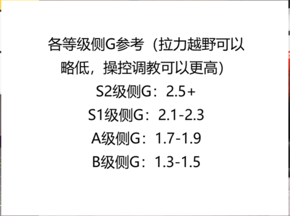

## 1. 套件升级

### 改造（发动机、传动方式、车体套件）

源生性能很强的车并不一定更换引擎。

性能过低的车尽量往V8的引擎升级。

进气有离心式机械增压直接选；双涡轮>正排量机械增压

---

### 地盘与操作性

弹簧及阻尼器：选择对应的所跑赛道。（ab级不用升）

前后防倾杆：必装。

地盘强化/防滚笼：除非拉力或越野 否则没必要安装。

车重减轻（选装）：重量越低，相对于地面轮胎的摩擦力和摩擦系数越小，容易打滑，而重量越重对撞上障碍物的的影响也就越小。

---

### 传动系统

离合器：对于拉力赛或者越野离合器很重要，需要自动挡，提升换挡速率，同时提升换挡速度，会减少加速时间。（一般没有用）

变速箱：大部分原厂高性能车，一般来说只需要更换能解锁最终传动比的变速箱，除非改动较大的车需更换能解锁所有传动比的变速箱。

传动系统：主要是对车身减重，对于原厂性能较低的车的提升非常大。

差速器：必装，更换所需赛道使用的差速器。

---

### 轮胎与轮毂

轮胎踏面胶料：选择对应赛道的轮胎，如果可提升的空间有限，则可以选择更换，优先度较低。

如果性能分有限，可以不先升级胎宽。

前轮胎宽：可以提升抓地力、刹车能力、提升一点转向能力，但会降低一点极速。

后轮胎宽：很有必要更换，因为当转向过度，往往是后轮打滑，增加后轮胎宽，可以提升弯道能力和起步能力。（太宽会推头）

轮毂：对性能提升并不大，可以选择重量低的提升一点性能；有的时候也可以选择重量高的来降低性能分用来加装其他部件。

前后轮毂尺寸：对性能来说没什么变化；随意。

前轮距与后轮距：越宽越好，理论上来说是重心高度不变，下盘越宽越稳定，越能提供更大的转向距离。

---

### 空间套件

只要不是转向很差的车，先升级其他的再回来装。

前空气套件：可以增加前轮的下压力，增加转向性能和刹车能力，但是会损失一点极速。

后空气套件；对于整辆车的影响很大，能增加后轮的下压力，但是都是纸面成绩，会降低比前空气套件更多的极速，并且极大降低车体瞬间反应，对于转向过度的车有很大的改善，但是对于转向不足的车是致命的。

转向过度从某方面来说就是后轮打滑，增加后侧下压力可以改善这种情况，但在某些时候，一定的可控打滑，可以增加转向能力。

总的来说：前空气套件增强转向，后空气套件增强稳定。

---

### 引擎

凑分，不超过所定分值，尽量找扭力提升大的。

有上增压就先加装增压

排气-活塞-进气-阀门-点火-凸轮抽-排气量-中冷-油冷

涡轮增压，尽量加装飞轮，提升极速

---

## 调教

### 轮胎

后驱车前轮胎压大于后轮

四驱车后轮大于前轮

1.3-1.4

公路车、漂移车 = 1.8-1.9

越野车=1.5，拉力车=1.7

如果未更换轮胎的话，则需要更低的胎压，为1.9左右。

如果更换了，则在2.1左右，转向不好的前2.0后2.1。

### 齿轮设备

先向右调直到出现2km/h以上的极速降低，再调最后一个挡，直到出现3km/h的降低，如果刚调了就下降，那就不用动最后一个挡。

### 轮胎定位

看前轮，如果外侧胎温比内侧胎温高太多，则减小外倾角，反之则增加，直到内测胎温略微高一点就可以了

前后束角一正一负        后驱车后轮=正束角  四驱前驱前轮=负束角

前后倾角 5-7°

### 防倾杆

前软后硬，

前10-20后60+

设车是中置四驱，前端重比46%， 前比后46: 54防倾杆设定为48: 52，调整约2%，和约为64

若是后驱，容易发生转向过度，调整为52: 48前后调整约百分之6

前驱车极易转向不足，前防倾杆要软，可以调为38: 62， 调整约8%

### 弹簧

车越重，弹簧越要硬一点

X=前，Y等于后，1. 2吨均值为135

X+Y=2*135, X:Y=46:54；解得X=124.2 Y=145

赛车车身前比后高一点

### 阻尼

回弹：前硬后软

x=前，Y=后，1.2吨均值为135

X+Y=18 (17左右，如果容易弹跳就高点) ,X:Y= 46:54

解得X=8.28.2 Y=9.27

冲击硬度前软后硬，约为回弹的50%-75%

### 空气动力

前侧下压无脑拉高

后侧往前

### 刹车

制动力压力调高15%

### 差速器

它对弯道性能影响很大

前加速高：转向不足；后加速高：转向过度

公路车后加速=60%-80%；前加速按照中差的比例设置

减速不超过加速一半

漂移车100%后加速后减速

公路车中心差速器：60%-70% 拉力车：50%-60%

