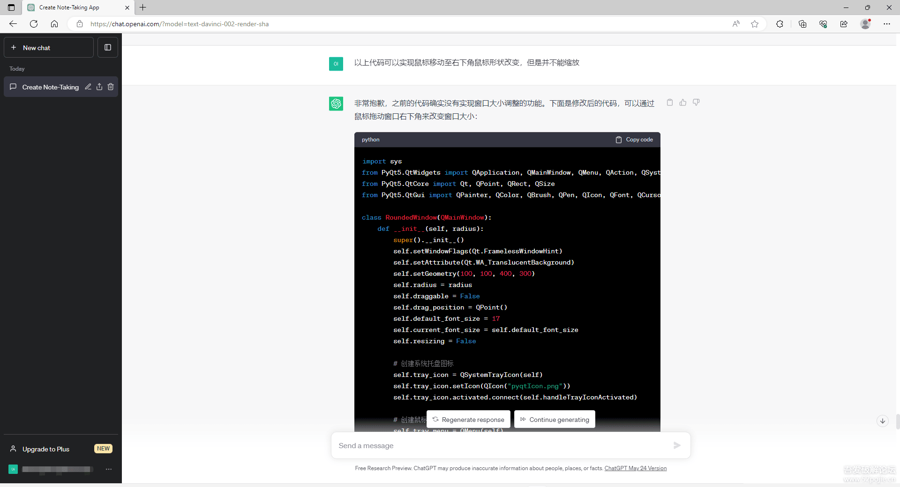

## **一步一步指使ChatGPT使用Python编写一个桌面便签应用** 


**ChatGPT的编程能力也不差，本次我就一步一步提要求，让ChatGPT根据我的要求，编写出一个可用的，可打包运行的桌面便签。**





### 代码

```python
import sys
from PyQt5.QtWidgets import QApplication, QMainWindow, QMenu, QAction, QSystemTrayIcon, QMessageBox, QTextEdit
from PyQt5.QtCore import Qt, QPoint, QRect, QSize
from PyQt5.QtGui import QPainter, QColor, QBrush, QPen, QIcon, QFont, QCursor
 
class RoundedWindow(QMainWindow):
    def __init__(self, radius):
        super().__init__()
        self.setWindowFlags(Qt.FramelessWindowHint)
        self.setAttribute(Qt.WA_TranslucentBackground)
        self.setGeometry(700, 400, 400, 300)
        self.radius = radius
        self.draggable = False
        self.drag_position = QPoint()
        self.default_font_size = 13
        self.current_font_size = self.default_font_size
        self.resizing = False
 
        # 创建系统托盘图标
        self.tray_icon = QSystemTrayIcon(self)
        self.tray_icon.setIcon(QIcon("noteIcon.png"))
        self.tray_icon.activated.connect(self.handleTrayIconActivated)
 
        # 创建鼠标右键菜单
        self.tray_menu = QMenu(self)
        exit_action = QAction("退出", self)
        exit_action.triggered.connect(QApplication.instance().quit)
        self.tray_menu.addAction(exit_action)
        self.tray_icon.setContextMenu(self.tray_menu)
 
        # 创建文本编辑框
        self.text_edit = QTextEdit(self)
        self.text_edit.setGeometry(10, 40, self.width() - 20, self.height() - 50)
        self.text_edit.setStyleSheet("background-color: transparent; border: none; color: white;")
        self.text_edit.setFont(QFont("Arial", self.current_font_size))
        self.text_edit.textChanged.connect(self.saveTextToFile)
 
    def paintEvent(self, event):
        painter = QPainter(self)
        painter.setRenderHint(QPainter.Antialiasing)
        painter.setBrush(QColor(0, 0, 0, 150))  # 设置半透明背景颜色
        painter.drawRoundedRect(self.rect(), self.radius, self.radius)
 
        # 绘制红色关闭按钮
        close_button = QRect(10, 10, 20, 20)
        painter.setBrush(QColor(255, 0, 0))
        painter.setPen(Qt.NoPen)
        painter.drawEllipse(close_button)
 
        # 绘制黄色最小化按钮
        minimize_button = QRect(40, 10, 20, 20)
        painter.setBrush(QColor(255, 255, 0))
        painter.setPen(Qt.NoPen)
        painter.drawEllipse(minimize_button)
 
        # 绘制灰色最大化按钮
        maximize_button = QRect(70, 10, 20, 20)
        painter.setBrush(QColor(128, 128, 128))
        painter.setPen(Qt.NoPen)
        painter.drawEllipse(maximize_button)
 
    def mousePressEvent(self, event):
        if event.button() == Qt.LeftButton:
            self.draggable = True
            self.drag_position = event.globalPos() - self.frameGeometry().topLeft()
            event.accept()
 
            # 判断点击的按钮
            pos = event.pos()
            if QRect(10, 10, 20, 20).contains(pos):
                self.close()  # 关闭当前窗口
            elif QRect(40, 10, 20, 20).contains(pos):
                self.hide()  # 最小化当前窗口
 
    def mouseMoveEvent(self, event):
        if event.buttons() == Qt.LeftButton and self.draggable:
            self.move(event.globalPos() - self.drag_position)
            event.accept()
 
        # 检查是否在窗口右下角，设置鼠标形状
        if self.isInBottomRightCorner(event.pos()):
            self.setCursor(Qt.SizeFDiagCursor)
        else:
            self.setCursor(Qt.ArrowCursor)
 
        # 检查是否正在调整窗口大小
        if self.resizing:
            self.resizeWindow(event.globalPos())
 
    def mouseReleaseEvent(self, event):
        if event.button() == Qt.LeftButton:
            self.draggable = False
            self.resizing = False
            event.accept()
 
    def handleTrayIconActivated(self, reason):
        if reason == QSystemTrayIcon.Trigger:
            self.showNormal()  # 点击托盘图标恢复窗口显示
 
    def closeEvent(self, event):
        self.hide()  # 窗口关闭时隐藏而不是退出应用程序
        self.tray_icon.show()  # 显示系统托盘图标
        event.ignore()  # 忽略窗口关闭事件
 
    def saveTextToFile(self):
        text = self.text_edit.toPlainText()
        with open("bianqian.txt", "w") as file:
            file.write(text)
 
    def isInBottomRightCorner(self, pos):
        window_rect = self.rect()
        corner_rect = QRect(window_rect.bottomRight() - QPoint(20, 20), QSize(20, 20))
        return corner_rect.contains(pos)
 
    def resizeWindow(self, pos):
        new_size = QSize(pos.x() - self.geometry().left(), pos.y() - self.geometry().top())
        self.resize(new_size)
 
    def wheelEvent(self, event):
        if event.modifiers() == Qt.ControlModifier:
            delta = event.angleDelta().y()
            if delta > 0:
                self.increaseFontSize()
            else:
                self.decreaseFontSize()
 
    def increaseFontSize(self):
        self.current_font_size += 1
        self.text_edit.setFont(QFont("Arial", self.current_font_size))
 
    def decreaseFontSize(self):
        if self.current_font_size > 1:
            self.current_font_size -= 1
            self.text_edit.setFont(QFont("Arial", self.current_font_size))
 
if __name__ == '__main__':
    app = QApplication(sys.argv)
    radius = 15  # 修改圆角的值
    window = RoundedWindow(radius)
    window.show()
 
    # 调试：检查系统托盘是否可用
    if not QSystemTrayIcon.isSystemTrayAvailable():
        QMessageBox.critical(None, "错误", "系统托盘不可用！")
        sys.exit(1)
 
    # 调试：检查图标是否加载成功
    if not window.tray_icon.isSystemTrayAvailable():
        QMessageBox.critical(None, "错误", "无法加载系统托盘图标！")
        sys.exit(1)
 
    window.tray_icon.show()
    sys.exit(app.exec_())
```


### 运行结果


### **便签属性**

1、半透明、圆角、最小化、系统托盘
		2、按住Ctrl不放滚动鼠标可改变文字大小
		3、系统托盘鼠标右键完全退出
		4、便签输入的文字实时更新至bianqian.txt


### **打包exe**

这么点东西打包成exe居然有34.9M这么大！这绝对不是Python的问题，是我技术的问题。

