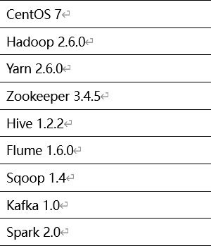
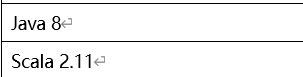
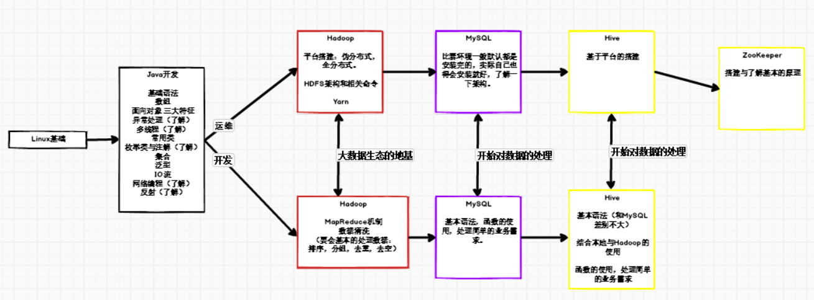
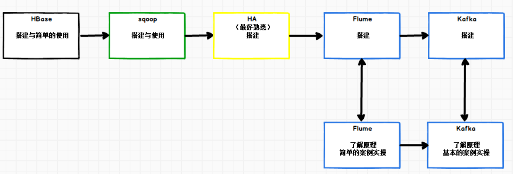
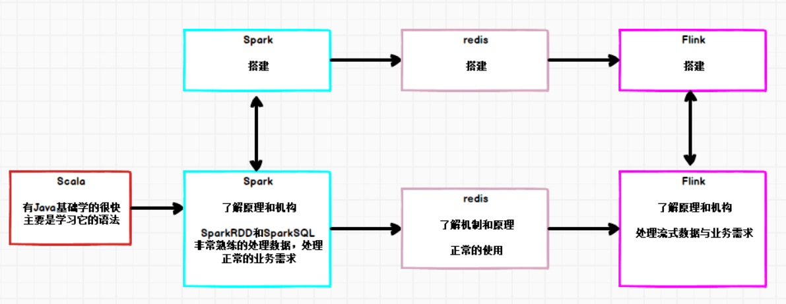

# 前言：

所有的框架与组件，尽可能的按照以下的版本号，大版本号要求比较严格，小版本号可看情况。

# 筑基：

linux基本的命令运用；

Java要熟练的使用，一切的基础，依图分重次。

Hadoop对HDFS的命令相关要熟练，MapReduce计算框架也要正常的使用，能够处理数据清洗，了解数据的处理走向与过程。

MySQL与Hive要熟练，增删改查都要会，高阶函数的使用，多表查询，窗口函数熟练运用。

---

# 元婴：

了解运用Sqoop的使用，和Flume结合Kafka的基本案例实操。

---

# 大乘：重中之重，钱途无量

scala是后面两个计算框架的使用语言，要能够灵活使用它相较于java的一些特性。

**Spark重点（匹数据处理）：反复的学习，了解数据的走向与过程，对数据的清洗与挖掘要很熟练。**

**Flink重点（流数据处理）：结合redis、kafka的使用也是要非常的熟练。**

