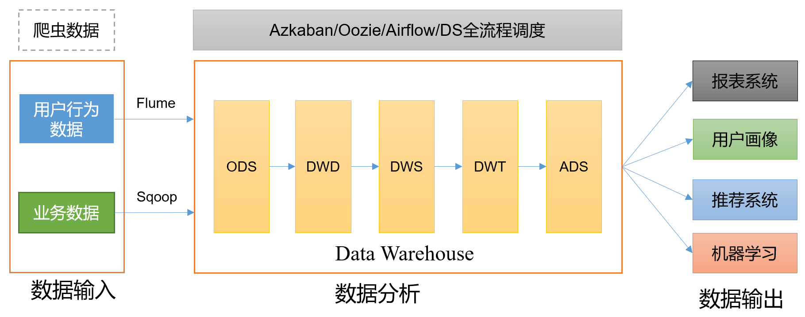
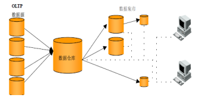
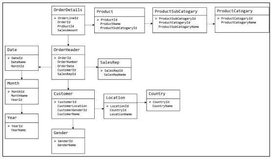
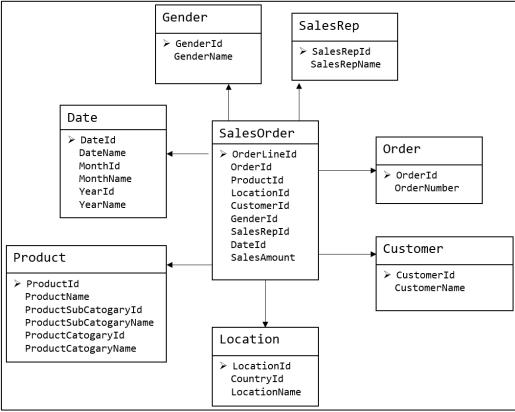
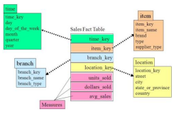
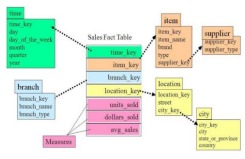
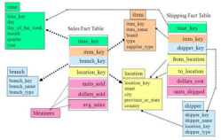

# 数仓分层

## 1.1 为什么要分层

数据仓库（Data Warehouse），是为企业制定决策，提供数据支持的，可以帮助企业，改进业务流程，提高产品质量等。

➢ 1）把复杂问题简单化 将复杂的任务分解成多层来完成，每一层只处理简单的任务，方便定位问题。 

➢ 2）减少重复开发 规范数据分层，通过的中间层数据，能够减少极大的重复计算，增加一次计算结果的复用性。 

➢ 3）隔离原始数据 不论是数据的异常还是数据的敏感性，使真实数据与统计数据解耦开。	

## 1.2 数据集市与数据仓库概念

数据集市（Data Market），现在市面上的公司和书籍都对数据集市有不同的概念。

数据集市则是一种微型的数据仓库，它通常有更少的数据，更少的主题区域，以 及更少的历史数据，因此是部门级的，一般只能为某个局部范围内的管理人员服务。 

数据仓库是企业级的，能为整个企业各个部门的运行提供决策支持手段。

## 1.3 数仓命名规范

### 1.3.1 表命名

➢ ODS层命名为ods_表名 

➢ DIM层命名为dim_表名 

➢ DWD层命名为dwd__表名 

➢ DWS层命名为dws_表名 

➢ DWT层命名为dwt__表名 

➢ ADS层命名为ads_表名 

➢ 临时表命名为tmp_表名

### 1.3.2 脚本命名

➢ 数据源_to_目标_db/log.sh 

➢ 用户行为脚本以log为后缀；业务数据脚本以db为后缀。

### 1.3.3 表字段类型

➢ 数量类型为bigint 

➢ 金额类型为decimal(16, 2)，表示：16 位有效数字，其中小数部分 2 位 

➢ 字符串(名字，描述信息等)类型为string 

➢ 主键外键类型为string 

➢ 时间戳类型为bigint

## 2.2 关系建模与维度建模

关系建模和维度建模是两种数据仓库的建模技术。关系建模由 Bill Inmon 所倡导，维 度建模由 Ralph Kimball 所倡导。

### 2.2.1 关系建模

关系建模将复杂的数据抽象为两个概念——实体和关系，并使用规范化的方式表示出 来。关系模型如图所示，从图中可以看出，较为松散、零碎，物理表数量多。

关系模型严格遵循第三范式（3NF），数据冗余程度低，数据的一致性容易得到保证。 由于数据分布于众多的表中，查询会相对复杂，在大数据的场景下，查询效率相对较低。

### 2.2.2 维度建模

维度模型如图所示，从图中可以看出，模型相对清晰、简洁。

维度模型以数据分析作为出发点，不遵循三范式，故数据存在一定的冗余。维度模型 面向业务，将业务用事实表和维度表呈现出来。表结构简单，故查询简单，查询效率较高。

## 2.4 维度模型分类

在维度建模的基础上又分为三种模型：星型模型、雪花模型、星座模型。

雪花模型与星型模型的区别主要在于维度的层级，标准的 星型模型维度只有一层，而雪花模型可能会涉及多级。

雪花模型，比较靠近3NF，但是无法完全遵守，因为遵循3NF的性能成本太高。

星座模型与前两种情况的区别是事实表的数量，星座模型是 基于多个事实表。 

基本上是很多数据仓库的常态，因为很多数据仓库都是多个 事实表的。所以星座不星座只反映是否有多个事实表，他们之间 是否共享一些维度表。 

所以星座模型并不和前两个模型冲突。
