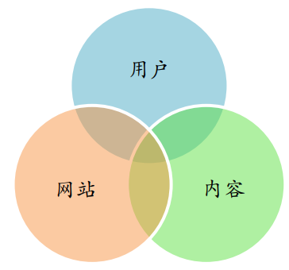
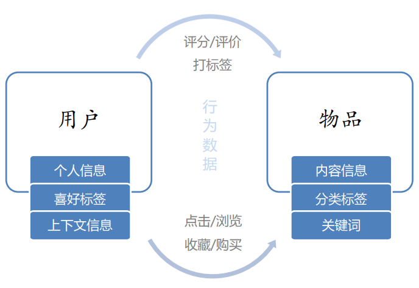
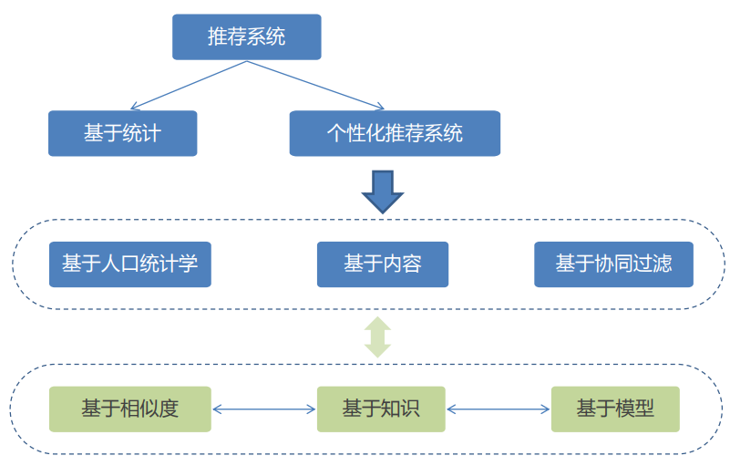
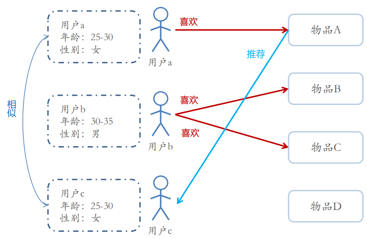
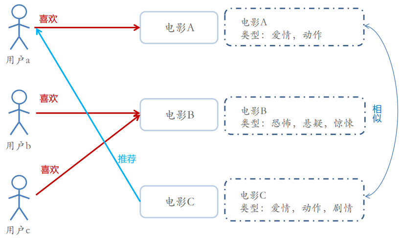
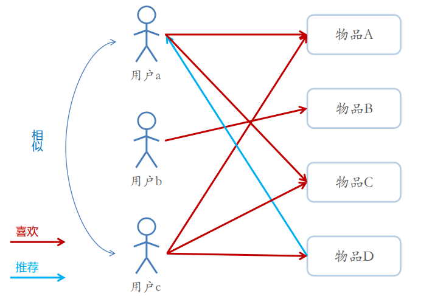
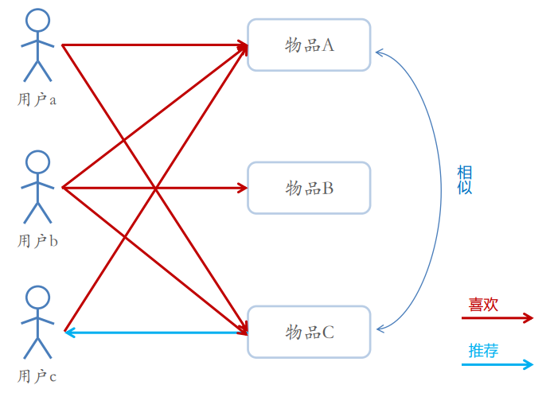
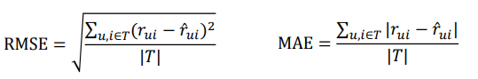
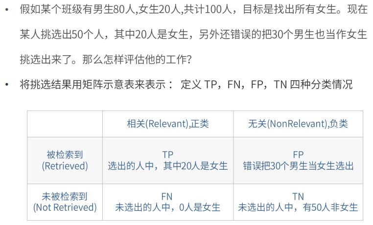
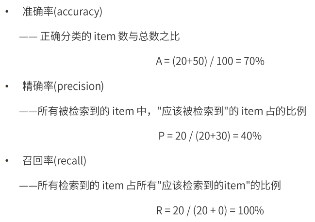

# 主要内容

---

## • 推荐系统概述

– 推荐系统的目的 

– 推荐系统的应用 

– 推荐系统的基本思想 

– 推荐系统分类

## • 推荐算法简介

– 基于人口统计学的推荐 

– 基于内容的推荐 

– 基于协同过滤的推荐 

– 混合推荐

## • 推荐系统评测

# 推荐系统的目的

---

 • 信息过载

 • 推荐系统

• 推荐系统是信息过载所采用的措施，面对海量的数据信息， 从中快速推荐出符合用户特点的物品。解决一些人的“选择 恐惧症”；面向没有明确需求的人。

• 解决如何从大量信息中找到自己感兴趣的信息。 

• 解决如何让自己生产的信息脱颖而出，受到大众的喜爱。

• 让用户更快更好的获取到自己 需要的内容 

• 让内容更快更好的推送到喜欢 它的用户手中 

• 让网站（平台）更有效的保留 用户资源

# 推荐系统的基本思想

---

• 利用用户和物品的特征信息，给用户推荐那些具有用户喜欢的特征的物品。 

• 利用用户喜欢过的物品，给用户推荐与他喜欢过的物品相似的物品。 

• 利用和用户相似的其他用户，给用户推荐那些和他们兴趣爱好相似的其他用 户喜欢的物品。

• 知你所想，精准推送 – 利用用户和物品的特征信息，给用户推荐那些具有用户喜欢的特征的物品。 

• 物以类聚 – 利用用户喜欢过的物品，给用户推荐与他喜欢过的物品相似的物品。 

• 人以群分 – 利用和用户相似的其他用户，给用户推荐那些和他们兴趣爱好相似的其他用户喜 欢的物品。

# 推荐系统的数据分析

---

• 要推荐物品或内容的元数据，例如关键字，分类标签，基因描述等；

 • 系统用户的基本信息，例如性别，年龄，兴趣标签等 

• 用户的行为数据，可以转化为对物品或者信息的偏好，根据应用本身的不同， 可能包括用户对物品的评分，用户查看物品的记录，用户的购买记录等。这 些用户的偏好信息可以分为两类：

​	– 显式的用户反馈：这类是用户在网站上自然浏览或者使用网站以外，显式的提供 反馈信息，例如用户对物品的评分，或者对物品的评论。

​	 – 隐式的用户反馈：这类是用户在使用网站是产生的数据，隐式的反应了用户对物 品的喜好，例如用户购买了某物品，用户查看了某物品的信息等等。

# 推荐系统的分类

---

• 根据实时性分类 

​	– 离线推荐 

​	– 实时推荐 

• 根据推荐原则分类 

​	– 基于相似度的推荐 

​	– 基于知识的推荐 

​	– 基于模型的推荐

• 根据推荐是否个性化分类

​	 – 基于统计的推荐 

​	– 个性化推荐 

• 根据数据源分类 

​	– 基于人口统计学的推荐 

​	– 基于内容的推荐 

​	– 基于协同过滤的推荐

# 推荐算法简介

---

• 基于人口统计学的推荐 

• 基于内容的推荐 

• 基于协同过滤的推荐 

• 混合推荐

## 基于人口统计学的推荐算法

## 基于内容的推荐算法

## 基于协同过滤的推荐算法

---

• 协同过滤（Collaborative Filtering，CF）

• 基于近邻的协同过滤 

​	– 基于用户（User-CF）

​	– 基于物品（Item-CF）

• 基于模型的协同过滤 

​	– 奇异值分解（SVD） 

​	– 潜在语义分析（LSA） 

​	– 支撑向量机（SVM）

### 协同过滤（CF）推荐方法

●	基于内容(Content based, CB)主要利用的是用户评价过的物品的内容特征，而CF方法还可以利用其他用户评分过的物品内容
	

●	CF可以解决CB的一些局限

- 物品内容不完全或者难以获得时，依然可以通过其他用户的反馈给出推荐

- CF基于用户之间对物品的评价质量，避免了CB仅依赖内容可能造成的对物品质量
  判断的干扰

- CF推荐不受内容限制，只要其他类似用户给出了对不同物品的兴趣，CF就可以给
  用户推荐出内容差异很大的物品(但有某种内在联系)

●分为两类:基于近邻和基于模型

### 基于用户的协同过滤

### 基于物品的协同过滤

### 混合推荐

---

• 实际网站的推荐系统往往都不是单纯只采用了某一种推荐的机制和策略，往往是将多 个方法混合在一起，从而达到更好的推荐效果。比较流行的组合方法有： 

​	• 加权混合 

​		– 用线性公式（linear formula）将几种不同的推荐按照一定权重组合起来，具体权重的值需要 在测试数据集上反复实验，从而达到最好的推荐效果 

​	• 切换混合 

​		– 切换的混合方式，就是允许在不同的情况（数据量，系统运行状况，用户和物品的数目等）下， 选择最为合适的推荐机制计算推荐 

​	• 分区混合 

​		– 采用多种推荐机制，并将不同的推荐结果分不同的区显示给用户 

​	• 分层混合 

​		– 采用多种推荐机制，并将一个推荐机制的结果作为另一个的输入，从而综合各个推荐机制的优 缺点，得到更加准确的推荐

# 推荐系统评测

---

• 让用户更快更好的获取到自己 需要的内容 

• 让内容更快更好的推送到喜欢 它的用户手中 

• 让网站（平台）更有效的保留 用户资源

## 推荐系统实验方法

• 离线实验 

​	– 通过体制系统获得用户行为数据，并按照一定格式生成一个标准的数据集 

​	– 将数据集按照一定的规则分成训练集和测试集 

​	– 在训练集上训练用户兴趣模型，在测试集上进行预测 

​	– 通过事先定义的离线指标评测算法在测试集上的预测结果 

• 用户调查 

​	– 用户调查需要有一些真实用户，让他们在需要测试的推荐系统上完成一些任务；我们需要记录 他们的行为，并让他们回答一些问题；最后进行分析 

• 在线实验 

​	– AB测试

## 推荐系统评测指标

---

• 预测准确度 

• 用户满意度 

• 覆盖率 

• 多样性 

• 惊喜度 

• 信任度 

• 实时性 

• 健壮性 

• 商业目标

## 推荐准确度评测

---

• 评分预测 

​	– 很多网站都有让用户给物品打分的功能，如果知道用户对物品的历史评分，就可 以从中学习一个兴趣模型，从而预测用户对新物品的评分 

​	– 评分预测的准确度一般用均方根误差（RMSE）或平均绝对误差（MAE）计算

• Top-N推荐

– 网站提供推荐服务时，一般是给用户一个个性化的推荐列表，这种推荐叫做 Top-N推荐 

– Top-N推荐的预测准确率一般用精确率（precision）和召回率（recall）来度量

## 准确率、精确率和召回率

---

