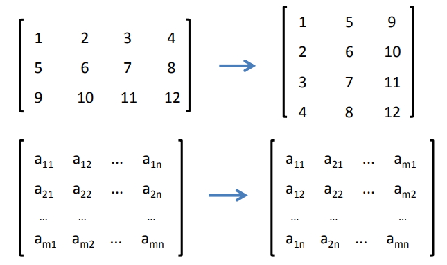

# 线性代数

●什么是矩阵

●矩阵的转置

●矩阵中的基本概念

●矩阵的运算法则

●矩阵的加法

●矩阵的逆

●矩阵的乘法

## 矩阵

---

●	矩阵(Matrix) 是一个按照长方阵列排列的复数或实数集合

●	矩阵最早来自于方程组的系数及常数所构成的方阵，最初是用来解决

​			线性方程求解的工具

●	矩阵是高等代数中的常见工具，也常见于统计分析等应用数学学科中;

​			矩阵在物理学和计算机科学中都有应用

●	矩阵的运算是数值分析领域的重要问题

## 矩阵的定义

---

• 由 m × n 个数 aij (i = 1,2,...,m; j = 1,2,...,n) 排成的 m 行 n 列的数表 A 就称为 m 行 n 列 的矩阵 

• 这 m × n 个数称作矩阵 A 的元素，元素 aij 位于矩阵 A 的第 i 行第 j 列 

• m × n 矩阵 A 可以记作 Am×n，其中 m是行数，n是列数，m, n > 0

## 特殊矩阵

---

• 对于Am×n，如果 m = n，即矩阵的行数与列数相等，那么称A为方阵

• 行数与列数都等于 n 的矩阵称为 n 阶矩阵，又称做 n 阶方阵，可以记作 An 

• 只有一行的矩阵 A1×n 称为行矩阵，又叫行向量 

• 同样，只有一列的矩阵 An×1 称为列矩阵，又叫列向量

• 对于方阵，从左上角到右下角的直线，叫做**主对角线**，主对角线上的元素称为**主对角线元素**

矩阵的元素全部为0，称为**零矩阵**，用 O 表示

对于方阵，如果只有对角线元素为1，其余元素都为0，那么称为**单位矩阵**，一般用 I 或者 E 表示

对于方阵，不在对角线上的元素都为0， 称为**对角矩阵**

## 矩阵的加法

---

• 把矩阵的对应位元素相加 

• 矩阵的形状必须一致，即必须是同型矩阵

## 矩阵的乘法

---

1. 数与矩阵相乘

​	●数值与矩阵每一 -个元素相乘

2. 矩阵与矩阵相乘

●左矩阵的每- -行与右矩阵的每一-列， 对应每一-个元素相乘

●A * B,那么有A矩阵m * n，B矩阵n * k,要求左侧矩阵的列数n，必须等于右侧矩阵的行数n，结果矩阵C为m * k矩阵。

●规则:一行乘一列，行定列移动，列尽下一行

## 矩阵的转置

---

• 把矩阵 A 的行换成相同序数的列，得到一个新矩阵，叫做 A 的**转置矩阵**，记作 AT 

• 行变列，列变行 

• A 为 m × n 矩阵，转置之后为 n × m 矩阵

## 矩阵的运算法则

---

## 矩阵的逆

# 微积分基本知识

## 导数

● 导数反映的是函数y= f(x)在某一点处沿x轴正方向的变化率

●在x轴上某一点处，如果f (x)>0, 说明f(x)的函数值在x点沿x轴正方向是趋于增加的;如果f (x)<0, 说明f(x)的函数值在x点沿x轴正方向是趋于减少的

## 偏导数

●导数与偏导数本质是- -致的，都是当自变量的变化量趋于0时，函数值的变化量与自变量变化量比值的极限

●偏导数也就是函数在某一点上沿某个坐标轴正方向的的变化率

●导数指的是一元函数中，函数y=f(x)在某一点处沿x轴正方向的变化率;而偏导数，指的是多元函数中，函数y=f(X1,X2.......Xn)在某一点处沿某一坐标轴 (x1，x2，...... ,xn)正方向的变化率

## 方向导数

●函数某-点在某一趋近方向(向量方向)上的导数值

●方向导数就是函数在除坐标轴正方向外，其他特定方向上的变化率

## 梯度（Gradient）

●定义:函数在某一点的梯度是这样一个向量，它的方向与取得最大方向导数的方向一致,而它的模为方向导数的最大值

●梯度是一个向量，即有方向、有大小;梯度的方向是最大方向导数的方向;

●梯度的值是最大方向导数的值

## 凸函数和凹函数

# 概率统计基础知识

## 常用统计变量

## 常见概率分布

## 重要概率公式

