# 机器学习的概念

---

## 机器学习是什么

●	什么是学习

​	-从人的学习说起

​	-学习理论;从实践经验中总结

​	-在理论上推导;在实践中检验

​	-通过各种手段获取知识或技能的过程

●	机器怎么学习?

​	-处理某个特定的任务，以大量的“经验”为基础

​	-对任务完成的好坏，给予- -定的评判标准

​	-通过分析经验数据，任务完成得更好了

## 机器学习的开端

---

●	1952年，IBM的Arthur Samuel (被誉为“机器学习之父”)设计了一款可以学习的西洋跳棋程序。

●	它能通过观察棋子的走位来构建新的模型,并用其提高自己的下棋技巧。

●	Samuel 和这个程序进行多场对弈后发现,随着时间的推移，程序的棋艺变得越来越好。

## 机器学习的定义

---

●	机器学习(Machine Learning, ML)主要研究计算机系统对于特定任务的性能，逐步进行改善的算法和统计模型。

●	通过输入海量训练数据对模型进行训练，使模型掌握数据所蕴含的潜在规律，进而对新输入的数据进行准确的分类或预测。

●	是一门多领域交叉学科，涉及概率论、统计学、逼近论、凸优化、算法复杂度理论等多门学科。专门研究计算机怎样模拟或实现人类的学习行为，以获取新的知识或技能，重新组织已有的知识结构使之不断改善自身的性能。

## 机器学习的过程

---

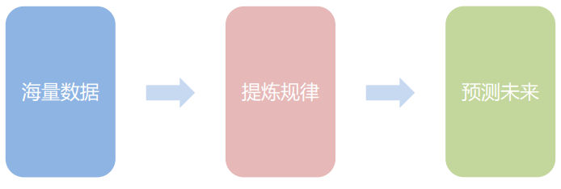

# 机器学习的分类

---

## 机器学习主要分类

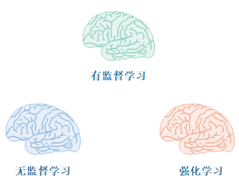

●	有监督学习:提供数据并提供数据对应结果的机器学习过程。

●	无监督学习:提供数据并且不提供数据对应结果的机器学习过程。

●	强化学习:通过与环境交互并获取延迟返回进而改进行为的学习过程。

## 无监督学习

---

●	无监督学习(Unsupervised Learning)算法采用一组仅包含输入的.数据，通过寻找数据中的内在结构来进行样本点的分组或聚类。

●	算法从没有被标记或分类的测试数据中学习。

●	无监督学习算法不是响应反馈，而是要识别数据中的共性特征;对于一个新数据，可以通过判断其中是否存在这种特征，来做出相应的反馈。

●	无监督学习的核心应用是统计学中的密度估计和聚类分析。

## 无监督学习应用

---

●无监督聚类应用的一个例子就是在谷歌新闻中。

●谷歌新闻每天都会收集很多新闻内容。它将这些新闻分组，组成有关联的新闻，然后按主题显示给用户

●谷歌新闻做的就是搜索新闻事件,自动地把它们聚类到一起;这些新闻事件全是同一主题的

## 监督学习

----

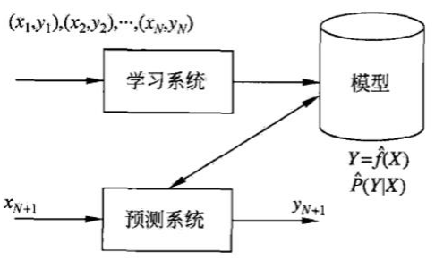

●	监督学习(Supervised Learning)算法构建了包含输入和所需输出的一组数据的数学模型。这些数据称为训练数据，由- -组训练样本组成。

●	监督学习主要包括分类和回归。

●	当输出被限制为有限的一-组值(离散数值)时使用分类算法;当输出可以具有范围内的任何数值(连续数值)时使用回归算法。

●	相似度学习是和回归和分类都密切相关的一类监督机器学习，它的目.标是使用相似性函数从样本中学习，这个函数可以度量两个对象之间的相似度或关联度。它在排名、推荐系统、视觉识别跟踪、人脸识别等方面有很好的应用场景。.

## 监督学习应用

●	预测房价或房屋出售情况

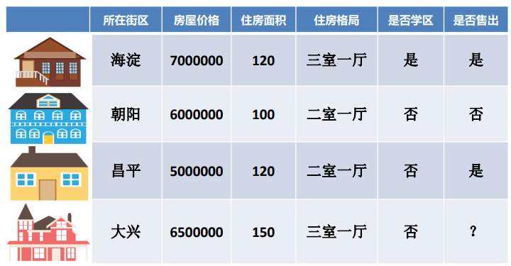

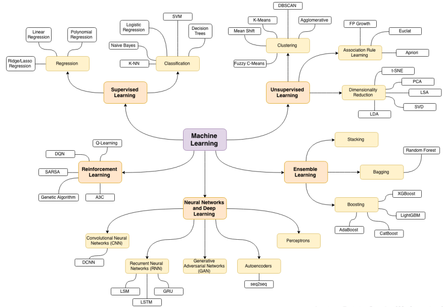

# 监督学习深入介绍

---

## 监督学习三要素

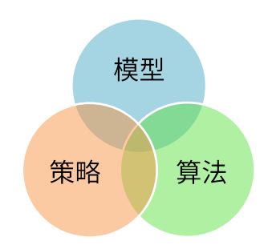

●	模型 (model) : 总结数据的内在规律，用数学函数描述的系统

●	策略(strategy) :选取最优模型的评价准则

●	算法(algorithm) : 选取最优模型的具体方法

## 监督学习实现步骤

---

●	得到一个有限的训练数据集

●	确定包含所有学习模型的集合

●	确定模型选择的准则，也就是学习策略

●	实现求解最优模型的算法，也就是学习算法

●	通过学习算法选择最优模型

●	利用得到的最优模型，对新数据进行预测或分析

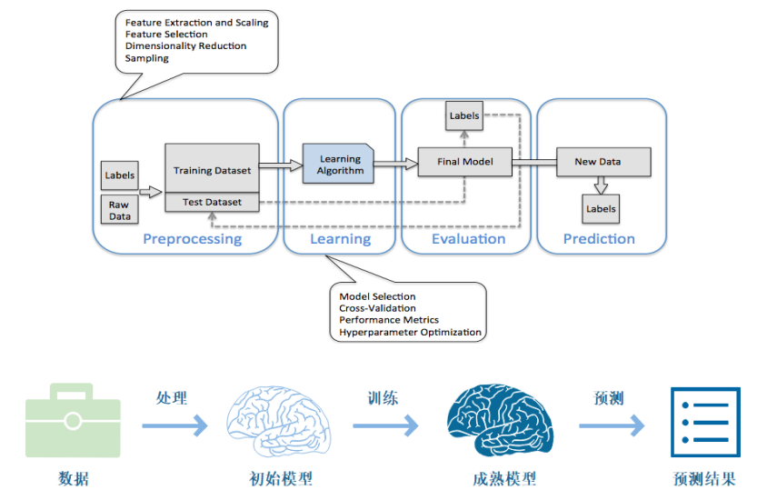

## 模型评估策略

---

●模型评估

	-	训练集和测试集
​			

​	-	损失函数和经验风险
​	

​	-	训练误差和测试误差

●模型选择

- 过拟合和欠拟合
  		

- 正则化和交叉验证

## 训练集和测试集

---

●	我们将数据输入到模型中训练出了对应模型，但是模型的效果好不好呢?我们需要对模型的好坏进行评估

●	我们将用来训练模型的数据称为训练集，将用来测试模型好坏的集合称为测试集。

●	训练集:输入到模型中对模型进行训练的数据集合。

●	测试集:模型训练完成后测试训练效果的数据集合。

## 损失函数

---

●	损失函数用来衡量模型预测误差的大小。

●	定义:选取模型f为决策函数，对于给定的输入参数X, f(X) 为预测结果，Y为真实结果; f(X)和Y 之间可能会有偏差，我们就用一个损失函数(loss function)来度量预测偏差的程度，记作L(,f(X))

●	损失函数是系数的函数

●	损失函数值越小，模型就越好

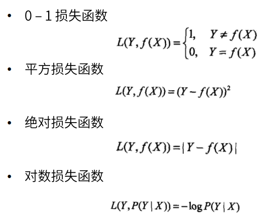

## 经验风险

---

•	 经验风险 

​	– 模型 f(X) 关于训练数据集的平均损失称为经验风险（empirial risk），记作 Remp 

• 	经验风险最小化（Empirical Risk Minimization，ERM） 

– 这一策略认为，经验风险最小的模型就是最优的模型 

– 样本足够大时，ERM 有很好的学习效果，因为有足够多的“经验” 

– 样本较小时，ERM 就会出现一些问题

## 训练误差和测试误差

---

• 训练误差 

​	– 训练误差（training error）是关于训练集的平均损失。 

​	– 训练误差的大小，可以用来判断给定问题是否容易学习，但本质上并不重要 

• 测试误差 

​	– 测试误差（testing error）是关于测试集的平均损失。 

​	– 测试误差真正反映了模型对未知数据的预测能力，这种能力一般被称为 泛化能力

# 过拟合和欠拟合

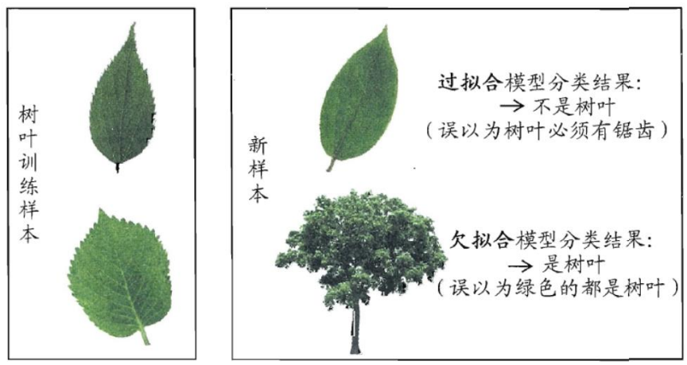

## 欠拟合

---

●	模型没有很好地捕捉到数据特征，特征集过小，导致模型不能很好地拟合数据，称之为欠拟合(unde-fiting) 。

●	欠拟合的本质是对数据的特征“学习”得不够.

●	例如，想分辨一只猫， 只给出了四条腿、两只眼、有尾巴这三个特征，那么由此训练出来的模型根本无法分辨猫损失函数是系数的函数损失函数值越小，模型就越好

## 过拟合

---

●	把训练数据学习的太彻底，以至于把噪声数据的特征也学习到了，特征集过大，这样就会导致在后期测试的时候不能够很好地识别数据，即不能正确的分类，模型泛化能力太差，称之为过拟合(ore-fitting) 。

●例如，想分辨一只猫，给出了四条腿、两只眼、一条尾巴、叫声、颜色，能够捕捉老鼠、喜欢吃鱼、... .，.然后恰好所有的训练数据的猫都是白色，那么这个白色是一个噪声数据，会干扰判断，结果模型把颜色是白色也学习到了,而白色是局部样本的特征，不是全局特征，就造成了输入一个黑猫的数据，判断出不是猫。

## 过拟合和欠拟合

---

●	假设我们有10个样本点，用一个M次多项式函数来做曲线拟合:

●	当模型复杂度增大时，训练误差会逐渐减小并趋向于0;而测试误差会先减小，达到最小值之后再增大.

●	当模型复杂度过大时，就会发生过拟合;所以模型复杂度应适当

## 正则化

---

●结构风险最小化(Structural Risk Minimization, SRM)

- 是在ERM基础上，为了防止过拟合而提出来的策略

- 在经验风险_上加上表示模型复杂度的正则化项(regularizer) ，或者叫惩罚项

- 正则化项一般是 模型复杂度的单调递增函数，即模型越复杂，正则化值越大

  

●结构风险 最小化的典型实现是正则化(regularization)

- 形式:

- 第一项是经验风险，第二项J(f)是正则化项，h≥0是调整两者关系的系数

- 正则化项可以取不同的形式，比如，特征向量的L 1范数或L2范数

## 奥卡姆剃刀

---

●奥卡姆剃刀(Occam 's razor)原理:如无必要,勿增实体

●正则化符合奥卡姆剃刀原理。它的思想是:在所有可能选择的模型中，我们应该选择能够很好地解释已知数据并且十分简单的模型

●如果简单的模型已经够用，我们不应该一味地追求更小的训练误差，而把模型变得越来越复杂

## 交叉验证

----

●	数据集划分

​	-	如果样本数据充足， - -种简单方法是随机将数据集切成三部分:训练集(trainingset) 、验证集(validation set)和测试集(test set)

​	-	训练集用 于训练模型，验证集用于模型选择，测试集用于学习方法评估

●	数据不充足时，可以重复地利用数据一-交叉验证 (cross validation)

​	- 简单交叉验证

​	- 数据随机分为两部分，如70%作为训练集，剩^下30%作为测试集

​	- 训练集在不同的条件 下(比如参数个数)训练模型，得到不同的模型

​	-	在 测试集.上评价各个模型的测试误差，选出最优模型

●	S折交叉验证

- 将 数据随机切分为S个互不相交、相同大小的子集; S-1个做训练集，剩下一个做测试集

- 重复进行训练集、测试集的选取，有S种可能的选择

●	留一交叉验证

# 分类和回归

---

●	监督学习问题主要可以划分为两类，即分类问题和回归问题
	

-	分类问题预测数据属于哪-类别。--离散

​	
 - 回归问题根据数据预测一-个数值。 - -连续

   

●	通俗地讲，分类问题就是预测数据属于哪一种类型，就像.上面的房屋出售预测，通过大量数据训练模型，然后去预测某个给定房屋能不能出售出去，属于能够出售类型还是不能出售类型。

●	回归问题就是预测一-个数值，比如给出房屋一些特征，预测房价如果将_上面的房屋出售的问题改为预测房屋出售的概率，得到的结果将不再是可以售出(1) 和不能售出(0) ，将会是一个连续的数值，例如0.5，这就变成了一个回归问题

## 分类问题

---

●	在监督学习中，当输出变量Y取有限个离散值时，预测问题就成了分类(classification)问题

●	监督学习从数据中学习一个分类模型或分类决策函数，称为分类器(classifier) ;分类器对新的输入进行预测，称为分类

●	分类问题包括学习和分类两个过程。学习过程中，根据已知的训练数据集利用学习方法学习- -个分类器;分类过程中，利用已习得的分类器对新的输入实力进行分类

●	分类问题可以用很多学习方法来解决，比如k近邻、决策树、感知机、逻辑斯谛回归、
支撑向量机、朴素贝叶斯法、神经网络等

## 精确率和召回率

---

●	评价分类器性能的指标一般是分类准确率(accuracy)，它定义为分类器对测试集正确分类的样本数与总样本数之比

●	对于二类分类问题，常用的评价指标是精确率(precision) 与召回率(recall)

●	通常以关注的类为正类，其它为负类，按照分类器在测试集.上预测的正确与否，会有四种情况出现，它们的总数分别记作:

- TP:将正类预测为正类的数目

- FN:将正类预测为负类的数目

  

- FP: 将负类预测为正类的数目

  

- TN:将负类预测为负类的数目

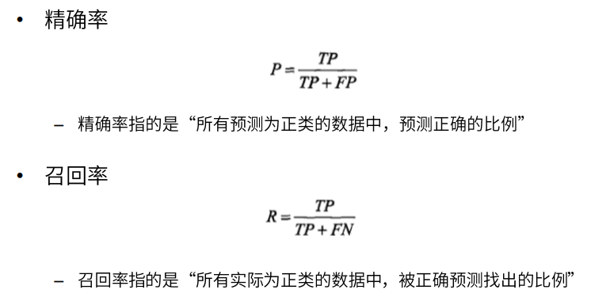

## 回归问题

---

●	回归问题用于预测输入变量和输出变量之间的关系

●	回归模型就是表示从输入变量到输出变量之间映射的函数

●	回归问题的学习等价于函数拟合:选择一条函数曲线，使其很好地拟合已知数据,并且能够很好地预测未知数据

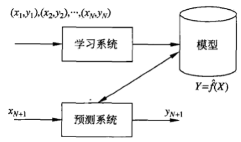

●回归问题的分类

- 按照输入变量的个数: -元回归和多元回归

- 按照模型类型:线性回归和非线性回归

●	回归学习的损失函数--平方 损失函数

●	如果选取平方损失函数作为损失函数，回归问题可以用著名的**最小二乘法**(least squares)来求解

# 模型求解算法（学习算法）

---

●	梯度下降算法

●    牛顿法和拟牛顿法

## 梯度下降算法

---

●	梯度下降(gradient descent)是一种常用的一-阶优化方法，是求解无约束优化问题最简单、最经典的方法之一

●	梯度方向:函数变化增长最快的方向(变量沿此方向变化时函数增长最快)

●	负梯度方向:函数变化减少最快的方向(变量沿此方向变化时函数减少最快)

●	损失函数是系数的函数，那么如果系数沿着损失函数的负梯度方向变化，此时损失函数减少最快，能够以最快速度下降到极小值

●	沿着负梯度方向迭代，迭代后的θ使损失函数J(日)更小:

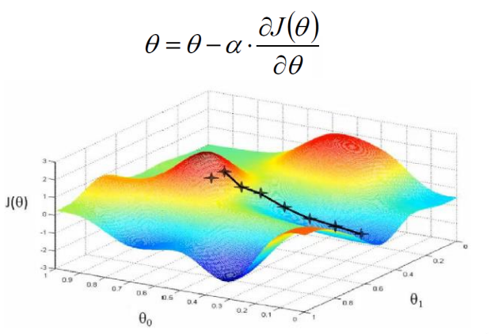

●	比如我们在一座大山上的某处位置，由于我们不知道怎么下山，于是决定走一步算一步，也就是在每走到一个位置的时候，求解当前位置的梯度，沿着梯度的负方向，也就是当前最陡峭的位置向下走一步,然后继续求解当前位置梯度，向这一步所在位置沿着最陡峭最易下山的位置走一步。这样一步步的走下去，-直走到觉得我们已经到了山脚。当然这样走下去，有可能我们不能走到山脚，而是到了某一个局部的山谷处。

●	从上面的解释可以看出，梯度下降不一定能够找到全局的最优解，有可能是一个局部最优解如果损失函数是凸函数，梯度下降法得到的解就一定是全局 最优解

## 牛顿法和拟牛顿法

---

●	牛顿法(Newton method)

●	迭代公式:

- 梯度下降法只考虑了一-阶导数，而牛顿法考虑了二阶导数，因此收敛速度更快

●	拟牛顿法(quasi Newton method)

- 牛顿法需要求解目标函数的海赛矩阵的逆矩阵，计算比较复杂
- 拟牛顿法通过正定矩阵近似海赛矩阵的逆矩阵，从而大大简化了计算过程