# 监督学习 —— 回归模型

---

●线性回归模型

- 元线性回归

- 多元线性回归

●	非线性回归模型

●	最小二乘法

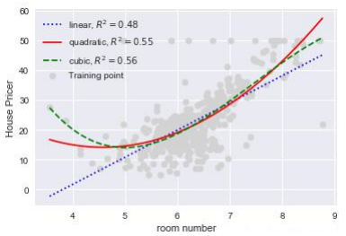

●线性回归(linear regression)是一种线性模型，它假设输入变量x和单个输出变量y之间存在线性关系

●具体来说，利用线性回归模型，可以从一-组输入变量x的线性组合中，计算输出变量y

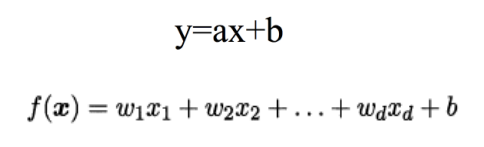

## 线性方程求解

---

假设我们有一个如下的二元一次方程:
								y = ax+b

我们已知两组数据: x=1时，y=3,即(1,3)

​								x=2时，y=5,即(2, 5)

将数据输入方程中，可得:
					a+ b=3
					2a+b=5

解得:
				a=2, b= 1

即方程为:
						2x+ 1=y

当我们有任意一个x时，输入方程，就可以得到对应的y

例如x=5时，y=11。

## 线性回归模型

---

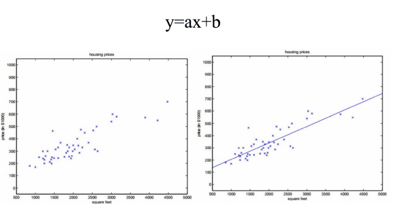

● 给定有d个属性(特征) 描述的示例x= (x1;x2;;xd) ，其中xi是x在第i个属性(特征)上的取值， 线性模型(linear model)试图学得一个通过属性(特征)的线性组合来进行预测的函数，即:

​									f(x)= W1x1 + W2x2 +... + Waxd +b 

● 一般用向量形式写成:
											f(x)= w'x +b

➢其中w = (W1;W2;... ;wd)

● 假设特征和结果都满足线性，即不大于- -次方。

● w和b学得之后，模型就得以确定。

● 许多功能更为强大的非线性模型可在线性模型的基础.上通过引入层级结构或高维映射而得。

## 最小二乘法

---

●	基于均方误差最小化来进行模型求解的方法称为“最小二乘法”(least square method)

●	它的主要思想就是选择未知参数，使得理论值与观测值之差的平方和达到最小。

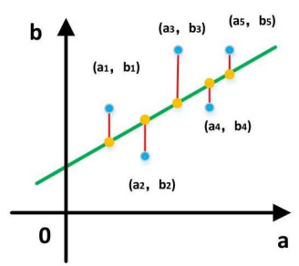

●	我们假设输入属性(特征)的数目只有一个:

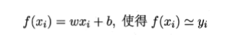

●在线性回归中，最小二乘法就是试图找到一条直线，使所有样本到直线上的欧式距离之和最小。

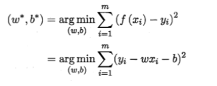

## 求解线性回归

---

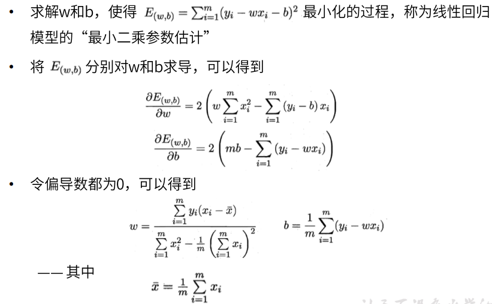

 

## 多元线性回归

---

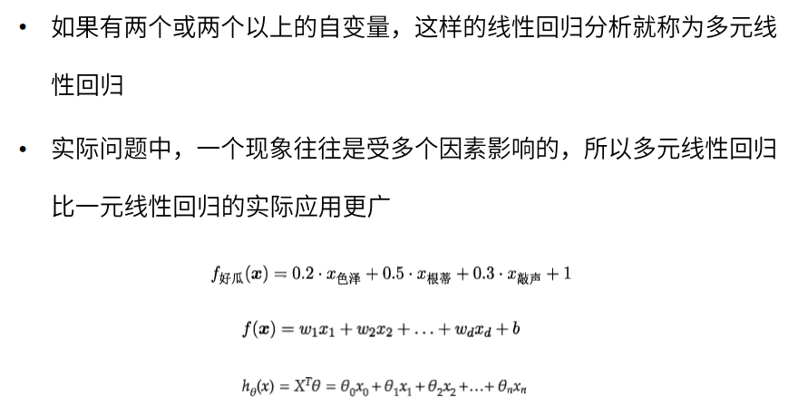

## 梯度下降法求解线性回归

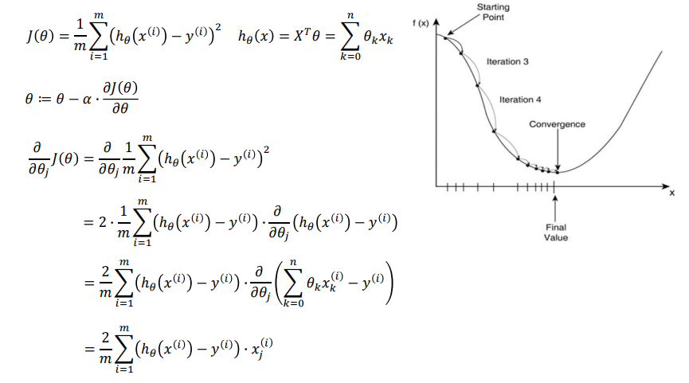

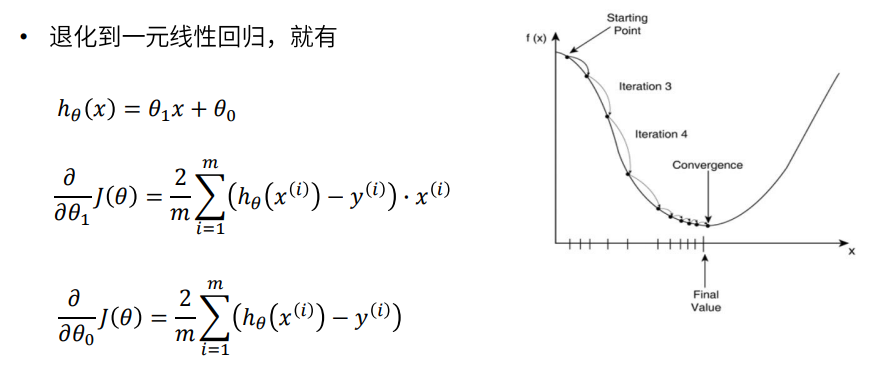

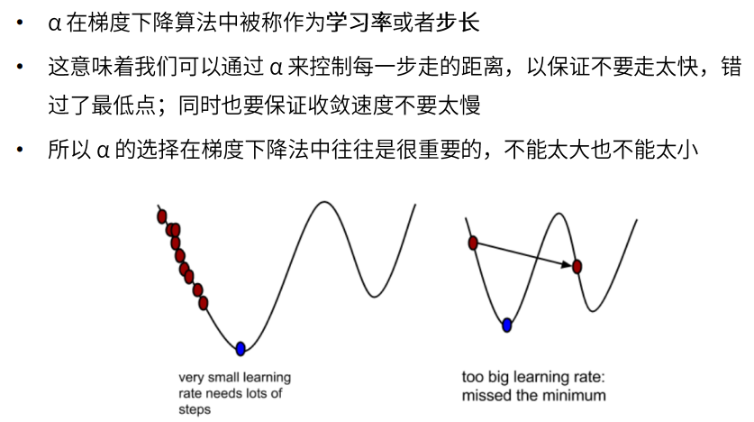

## 梯度下降法和最小二乘法

●	相同点

- 本质和目标相同: 两种方法都是经典的学习算法，在给定已知数据的前提下利用求导算出一个模型(函数)， 使得损失函数小，然后对给定的新数据进行估算预测

●	不同点

- 损失函数:梯度下降可以选取其它损失函数，而最小二乘-一定是平方损失函数

- 实现方法:最小二乘法是直接求导找出全局最小;而梯度下降是一种迭代法

- 效果:最小二乘找到的一定是全局最小，但计算繁琐，且复杂情况下未必有解;梯度下降迭代计算简单，但找到的一-般是局部小，只有在目标函数是凸函数时才是全局最小;到最小点附近时收敛速度会变慢，且对初始点的选择极为敏感

# 分类模型

---

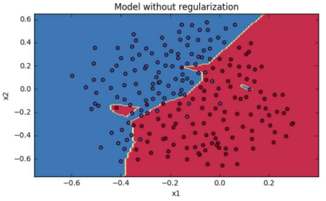

## K近邻（KNN）

---

●	最简单最初级的分类器，就是将全部的训练数据所对应的类别都记录下来，当测试对象的属性和某个训练对象的属性完全匹配时，便可以对其进行分类

●	K近邻(k-nearest neighbour, KNN)是一种基本分类方法 ,通过测量不同特征值之间的距离进行分类。它的思路是:如果一个样本在特征空间中的k个最相似(即特征空间中最邻近)的样本中的大多数属于某一个类别，则该样本也属于这个类别，其中K通常是不大于20的整数

●	KNN算法中，所选择的邻居都是已经正确分类的对象

## KNN示例

---

●	绿色圆要被决定赋予哪个类，是红色三角形还是蓝色四方形?

●	如果K=3，由于红色三角形所占比例为2/3，绿色圆将被赋予红色三角形那个类，如果K=5，由于蓝色四方形比例为3/5,因此绿色圆被赋予蓝色四方形类

●	KNN算法的结果很大程度取决于K的选择

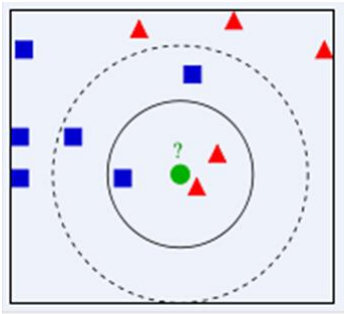

## KNN距离计算

---

●KNN中，通过计算对象间距离来作为各个对象之间的非相似性指标，避免了对象之间的匹配问题，在这里距离一般使用**欧氏距离或曼哈顿距离**:

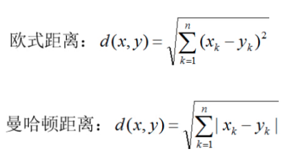

## KNN算法

---

●	在训练集中数据和标签已知的情况下，输入测试数据，将测试数据的特征与训练集中对应的特征进行相互比较，找到训练集中与之最为相似的前K个数据,则该测试数据对应的类别就是K个数据中出现次数最多的那个分类，其算法的描述为:

a)计算测试数据与各个训练数据之间的距离;

b)按照距离的递增关系进行排序;

c)选取距离最小的K个点;

d)确定前K个点所在 类别的出现频率;

e)返回前K个 点中出现频率最高的类别作为测试数据的预测分类。

## 逻辑斯蒂回归

---

●	线性回归的问题一-怎样 判断肿瘤是否恶性?

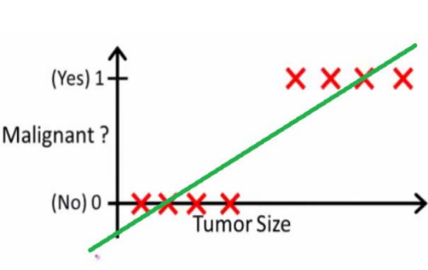

●	线性回归健壮性不够，一旦有噪声,立刻“投降”

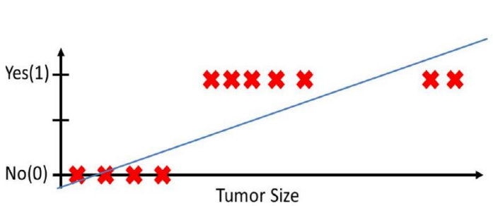

## 逻辑斯蒂回归 —— 分类问题

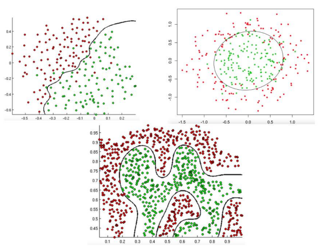

## Sigmoid函数（压缩函数）

---

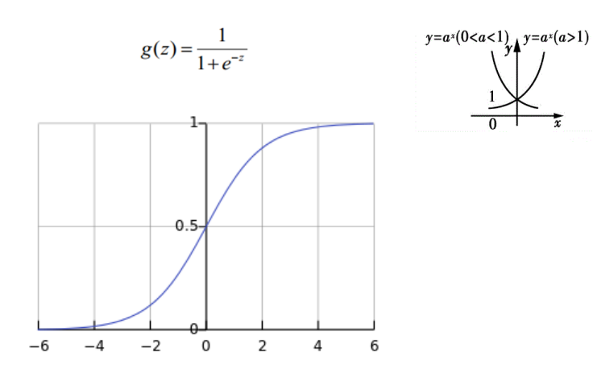

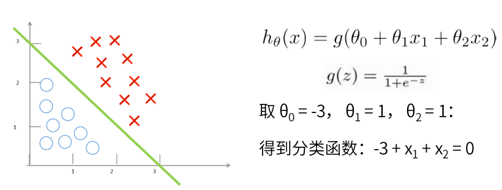

●	我们将线性回归拟合出来的值用压缩函数进行压缩，压缩完成后用0.5做一个概率的判定边界，就能把样本分成两类，即正样本和负样本

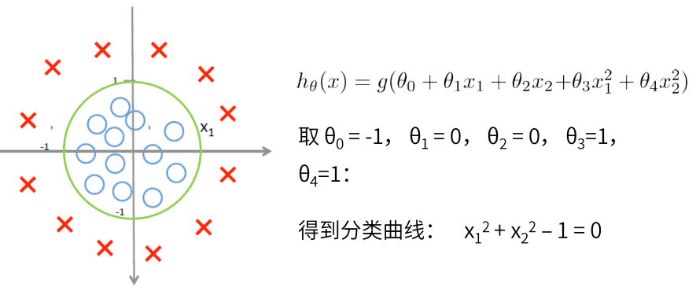

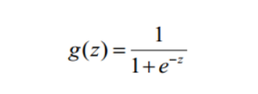

●	sigmoid函数中，eZ中z的正负决定了g(z) 的值最后是大于0.5还是小于0.5;即z大于0时，g(z)大于0.5， z小于0时，g(z)小于 0.5

●	当z对应的表达式为分类边界时，恰好有分类边界两侧对应z正负不同，也就使得分类边界两边分别对应g(z)>0.5和g(z)<0.5,因此根据g(z)与0.5的大小关系，就可以实现分类

## 逻辑斯谛回归损失函数

---

●	平方损失函数的问题

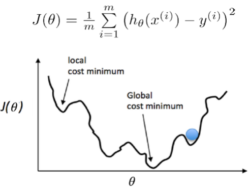

## 损失函数

---

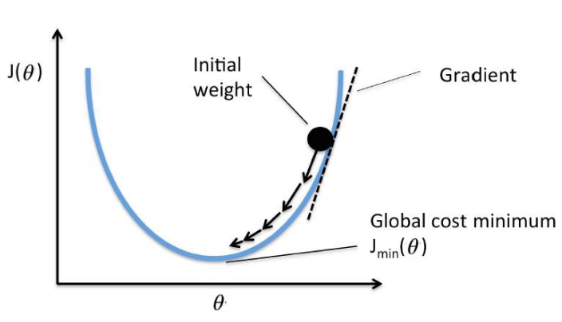

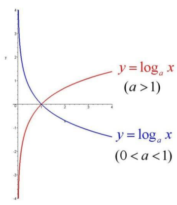

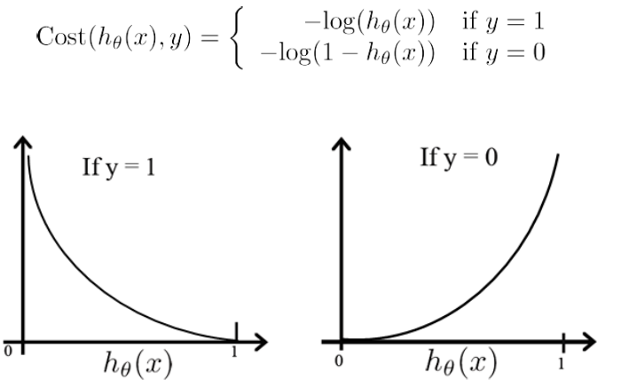

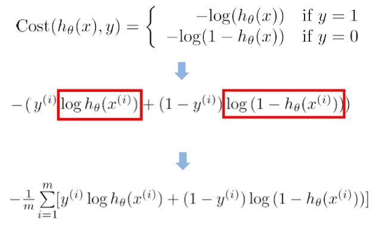

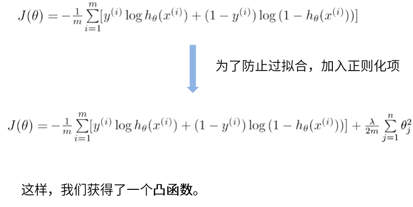

## 梯度下降法求解

---

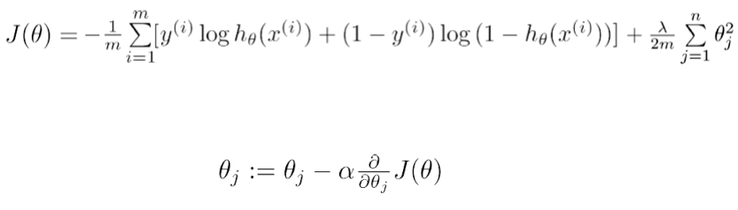

# 决策树

---

●	决策树是一-种简单高效并且具有强解释性的模型，广泛应用于数据分析领域。其本质是一颗自.上而下的由多个判断节点组成的树

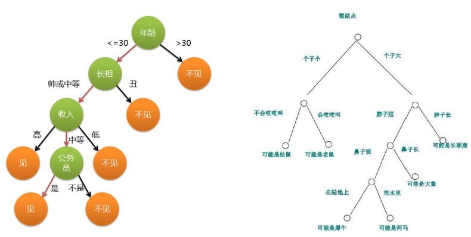

## 决策树示例

---

●	预测小明今天是否会出门打球

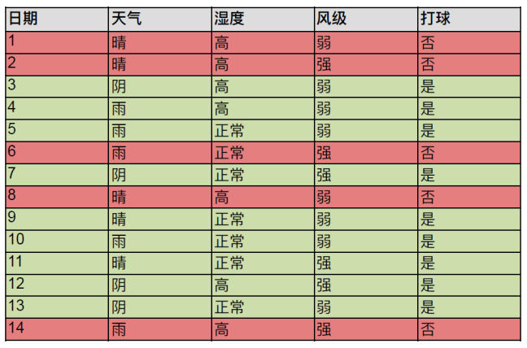

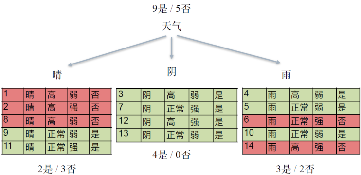

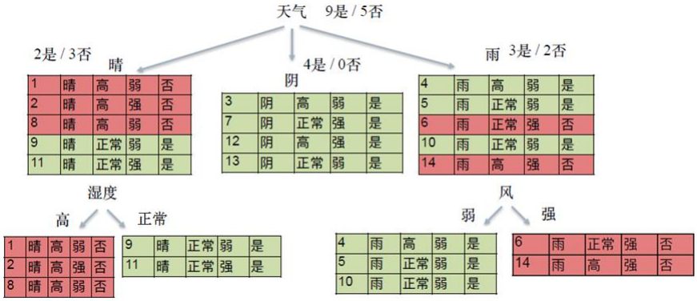

## 决策树与 if-then 规则

---

●	决策树可以看作一- 个if-then规则的集合

●	由决策树的根节点到叶节点的每一条路径，构建一条规则:路径上内部节点的特征对应着规则的条件(condition) ，叶节点对应规则的结论

●	决策树的if-then规则集合有一个重要性质:互斥并且完备。这就是说，每个实例都被一条规则(一 条路径)所覆盖，并且只被这一条规则覆盖

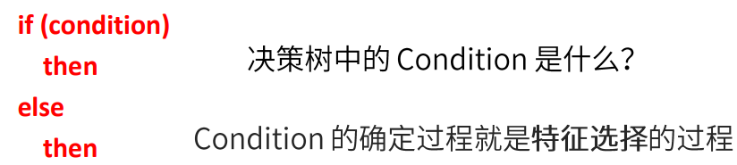

## 决策树的目标

---

●	决策树学习的本质，是从训练数据集中归纳出一-组if-then分类规则

●	与训练集不相矛盾的决策树，可能有很多个，也可能- -个也没有;所以我们需要选择一个与训练数据集矛盾较小的决策树

●	另一角度,我们可以把决策树看成一一个 条件概率模型，我们的目标是将实例分配到条件概率更大的那一类中去

●	从所有可能的情况中选择最优决策树，是一个**NP完全问题**，所以我们通常采用启发式算法求解决策树，得到一个**次最优解**

●	采用的算法通常是递归地进行以下过程:选择最优特征，并根据该特征对训练数据进行分割，使得各个子数据集都有一个最好的分类

## 特征选择

---

●	特征选择 就是决定用哪个特征来划分特征空间

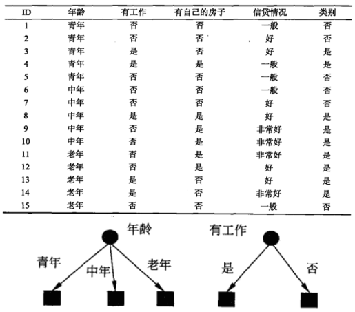

## 随机变量

---

●	随机变量(random variable)的本质是一-个函数，是从样本空间的子集到实数的映射，将事件转换成一个数值

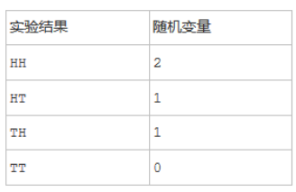

●根据样本空间中的元素不同(即不同的实验结果)，随机变量的值也将随机产生。可以说，随机变量是“数值化”的实验结果

●在现实生活中，实验结果是描述性的词汇，比如“硬币的"正面” 、“反 面”

●在数学家眼里，这些文字化的叙述太过繁琐，所以拿数字来代表它们

## 熵

●熵. (entropy)用来衡量随机变量的不确定性

●变量的不确定性越大，熵也就越大

设X是-个取有限个值的离散随机变量，其概率分布为:

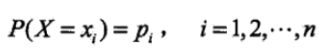

则随机变量X的熵定义为:

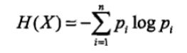

通常，上式中的对数以2为底或者 以e为底(自然对数)，这时熵的单位分别称为比特(bit) 或纳特(nat)

当随机变量只取两个值，例如1,0 时，则X的分布为:

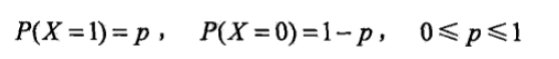

熵为：

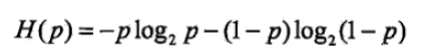

这时，熵H(p)随概率p变化的曲线如下图所示(单 位为比特)

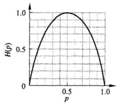

## 熵的示例

---

●	给三个球分类

→显然一眼就可以看出把红球独自一组，黑球一组;

→那么从熵的观点来看，是什么情况呢?

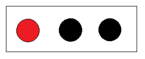

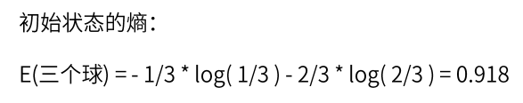

●	第二种分法就是红球自己-组，剩下两个黑球- -组

→在红球组中出现黑球的概率是0,在黑球组中出现红球的概率是0,这样的分类已经“纯”了，也就是分类后子集中的随机变量已经变成确定性的了

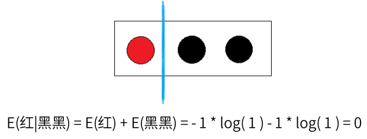

## 决策树的目标

---

●	我们使用决策树模型的最终目的是利用决策树模型进行分类预测，预测我们给出的一-组数据最终属于哪一种类别，这是一-个由不确定到确定的过程

●	最终理想的分类是，每一-组数据，都能确定性地按照决策树分支找到对应的类别

●	所以我们就选择使数据信息熵下降最快的特征作为分类节点，使得决策树尽快地趋于确定

## 条件熵（conditional entropy）

---

●	条件熵H( Y|X)表示在已知随机变量X的条件下随机变量Y的不确定性:

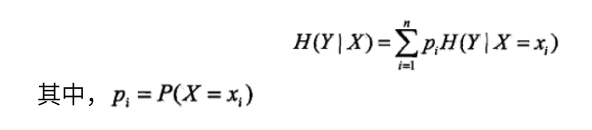

●	熵H(D)表示对数据集D进行分类的不确定性。

●	条件熵H(D|A)指在给定特征A的条件下数据集分类的不确定性

●当熵和条件熵的概率由数据估计得到时，所对应的熵与条件熵分别称为经验熵(empirical entropy)和经验条件熵(empirical conditional entropy)

## 信息增益

---

●	特征A对训练数据集D的信息增益g(D, A),定义为集合D的经验熵H(D)与特征A给定条件下D的条件熵H(D|A)之差，即

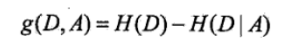

●	决策树学习应用信 息增益准则选择特征

●	经验熵H(D)表示对数据集 D进行分类的不确定性。而经验条件熵H(D|A)表示在特征A给定的条件下对数据集D进行分类的不确定性。那么它们的差，即信息增益，就表示由于特征A而使得对数据集D的分类的不确定性减少的程度

●	对于数据集D而言，信息增益依赖于特征，不同的特征往往具有不同的

●	信息增益信息增益大的特征具有更强的分类能力

## 决策树的生成算法

---

●ID3

- 决策树(ID3)的训练过程 就是找到信息增益最大的特征，然后按照此特征进行分类，然后再找到各类型子集中信息增益最大的特征，然后按照此特征进行分类，最终得到符合要求的模型。.

●C4.5

- C4.5算法在ID3基础.上做了改进，用信息增益比来选择特征

●	分类与回归树(CART)

- 由特征选择、树的生成和剪枝三部分组成，既可以用于分类也可以用于回归

# 无监督学习

---

## 聚类 —— k均值

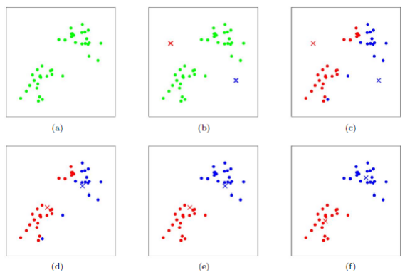

●	k均值(k-means) 是聚类算法中最为简单、高效的，属于无监督学习算法

●	核心思想:由用户指定k个初始质心(initial centroids)，以作为聚类的类别(cluster) ， 重复迭代直至算法收敛

●	基本算法流程:

- 选取k个初始质心(作为初始cluster) ;

- repeat:
对每个样本点，计算得到距其最近的质心，将其类别标为该质心所对应的cluster;
重新计算k个cluser对应的质心;
- until 质心不再发生变化或迭代达到上限