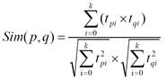
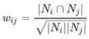

# 项目体系架构设计

## 项目系统架构

项目以推荐系统建设领域知名的经过修改过的中文亚马逊电商数据集作为依托，以某电商网站真实业务数据架构为基础，构建了符合教学体系的一体化的电商推荐系统，包含了离线推荐与实时推荐体系，综合利用了协同过滤算法以及基于内容的推荐方法来提供混合推荐。提供了从前端应用、后台服务、算法设计实现、平台部署等多方位的闭环的业务实现。


**用户可视化：**主要负责实现和用户的交互以及业务数据的展示，主体采用AngularJS2进行实现，部署在Apache服务上。

**综合业务服务：**主要实现JavaEE层面整体的业务逻辑，通过Spring进行构建，对接业务需求。部署在Tomcat上。


**【数据存储部分】**

**业务数据库：**项目采用广泛应用的文档数据库MongDB作为主数据库，主要负责平台业务逻辑数据的存储。

**缓存数据库：**项目采用Redis作为缓存数据库，主要用来支撑实时推荐系统部分对于数据的高速获取需求。


**【离线推荐部分】**

**离线统计服务：**批处理统计性业务采用Spark Core + Spark SQL进行实现，实现对指标类数据的统计任务。

**离线推荐服务：**离线推荐业务采用Spark Core + Spark MLlib进行实现，采用ALS算法进行实现。


**【实时推荐部分】**

**日志采集服务：**通过利用Flume-ng对业务平台中用户对于商品的一次评分行为进行采集，实时发送到Kafka集群。

**消息缓冲服务：**项目采用Kafka作为流式数据的缓存组件，接受来自Flume的数据采集请求。并将数据推送到项目的实时推荐系统部分。

**实时推荐服务：**项目采用Spark Streaming作为实时推荐系统，通过接收Kafka中缓存的数据，通过设计的推荐算法实现对实时推荐的数据处理，并将结构合并更新到MongoDB数据库。


## 项目数据流程


【系统初始化部分】

1. 通过Spark SQL将系统初始化数据加载到MongoDB中。

【离线推荐部分】

1. 可以通过Azkaban实现对于离线统计服务以离线推荐服务的调度，通过设定的运行时间完成对任务的触发执行。
2. 离线统计服务从MongoDB中加载数据，将【商品平均评分统计】、【商品评分个数统计】、【最近商品评分个数统计】三个统计算法进行运行实现，并将计算结果回写到MongoDB中；离线推荐服务从MongoDB中加载数据，通过ALS算法分别将【用户推荐结果矩阵】、【影片相似度矩阵】回写到MongoDB中。

【实时推荐部分】

1. Flume从综合业务服务的运行日志中读取日志更新，并将更新的日志实时推送到Kafka中；Kafka在收到这些日志之后，通过kafkaStream程序对获取的日志信息进行过滤处理，获取用户评分数据流【UID|MID|SCORE|TIMESTAMP】，并发送到另外一个Kafka队列；Spark Streaming监听Kafka队列，实时获取Kafka过滤出来的用户评分数据流，融合存储在Redis中的用户最近评分队列数据，提交给实时推荐算法，完成对用户新的推荐结果计算；计算完成之后，将新的推荐结构和MongDB数据库中的推荐结果进行合并。

【业务系统部分】

1. 推荐结果展示部分，从MongoDB中将离线推荐结果、实时推荐结果、内容推荐结果进行混合，综合给出相对应的数据。
2. 商品信息查询服务通过对接MongoDB实现对商品信息的查询操作。
3. 商品评分部分，获取用户通过UI给出的评分动作，后台服务进行数据库记录后，一方面将数据推动到Redis群中，另一方面，通过预设的日志框架输出到Tomcat中的日志中。
4. 商品标签部分，项目提供用户对商品打标签服务。


# 工具环境搭建

---

我们的项目中用到了多种工具进行数据的存储、计算、采集和传输，本章主要简单介绍设计的工具环境搭建。

如果机器的配置不足，推荐只采用一台虚拟机进行配置，而非完全分布式，将该虚拟机CPU的内存设置的尽可能大，推荐为CPU > 4、MEM > 4GB。


## MongoDB（单节点）环境配置

```bash
// 通过WGET下载Linux版本的MongoDB
[bigdata@linux ~]$ wget https://fastdl.mongodb.org/linux/mongodb-linux-x86_64-rhel62-3.4.3.tgz
// 将压缩包解压到指定目录
[bigdata@linux backup]$ tar -xf mongodb-linux-x86_64-rhel62-3.4.3.tgz -C ~/
// 将解压后的文件移动到最终的安装目录
[bigdata@linux ~]$ mv mongodb-linux-x86_64-rhel62-3.4.3/ /usr/local/mongodb
// 在安装目录下创建data文件夹用于存放数据和日志
[bigdata@linux mongodb]$ mkdir /usr/local/mongodb/data/
// 在data文件夹下创建db文件夹，用于存放数据
[bigdata@linux mongodb]$ mkdir /usr/local/mongodb/data/db/
// 在data文件夹下创建logs文件夹，用于存放日志
[bigdata@linux mongodb]$ mkdir /usr/local/mongodb/data/logs/
// 在logs文件夹下创建log文件
[bigdata@linux mongodb]$ touch /usr/local/mongodb/data/logs/ mongodb.log
// 在data文件夹下创建mongodb.conf配置文件
[bigdata@linux mongodb]$ touch /usr/local/mongodb/data/mongodb.conf
// 在mongodb.conf文件中输入如下内容
[bigdata@linux mongodb]$ vim ./data/mongodb.conf
#端口号port = 27017
#数据目录
dbpath = /usr/local/mongodb/data/db
#日志目录
logpath = /usr/local/mongodb/data/logs/mongodb.log
#设置后台运行
fork = true
#日志输出方式
logappend = true
#开启认证
#auth = true
```

完成MongoDB的安装后，启动MongoDB服务器：

```bash
// 启动MongoDB服务器
[bigdata@linux mongodb]$ sudo /usr/local/mongodb/bin/mongod -config /usr/local/mongodb/data/mongodb.conf
// 访问MongoDB服务器
[bigdata@linux mongodb]$ /usr/local/mongodb/bin/mongo
// 停止MongoDB服务器
[bigdata@linux mongodb]$ sudo /usr/local/mongodb/bin/mongod -shutdown -config /usr/local/mongodb/data/mongodb.conf
```


##  Redis（单节点）环境配置

```bash
// 通过WGET下载REDIS的源码
[bigdata@linux ~]$wget http://download.redis.io/releases/redis-4.0.2.tar.gz 
// 将源代码解压到安装目录
[bigdata@linux ~]$ tar -xf redis-4.0.2.tar.gz -C ~/
// 进入Redis源代码目录，编译安装
[bigdata@linux ~]$ cd redis-4.0.2/
// 安装GCC
[bigdata@linux ~]$ sudo yum install gcc
// 编译源代码
[bigdata@linux redis-4.0.2]$ make MALLOC=libc
// 编译安装
[bigdata@linux redis-4.0.2]$ sudo make install
// 创建配置文件
[bigdata@linux redis-4.0.2]$ sudo cp ~/redis-4.0.2/redis.conf /etc/ 
// 修改配置文件中以下内容
[bigdata@linux redis-4.0.2]$ sudo vim /etc/redis.conf
daemonize yes   #37行  #是否以后台daemon方式运行，默认不是后台运行
pidfile /var/run/redis/redis.pid   #41行  #redis的PID文件路径（可选）
bind 0.0.0.0    #64行  #绑定主机IP，默认值为127.0.0.1，我们是跨机器运行，所以需要更改
logfile /var/log/redis/redis.log   #104行  #定义log文件位置，模式log信息定向到stdout，输出到/dev/null（可选）
dir “/usr/local/rdbfile”  #188行  #本地数据库存放路径，默认为./，编译安装默认存在在/usr/local/bin下（可选）
```

在安装完Redis之后，启动Redis

```bash
// 启动Redis服务器
[bigdata@linux redis-4.0.2]$ redis-server /etc/redis.conf
// 连接Redis服务器
[bigdata@linux redis-4.0.2]$ redis-cli
// 停止Redis服务器
[bigdata@linux redis-4.0.2]$ redis-cli shutdown
```


##  Spark（单节点）环境配置

```bash
// 通过wget下载zookeeper安装包
[bigdata@linux ~]$ wget https://d3kbcqa49mib13.cloudfront.net/spark-2.1.1-bin-hadoop2.7.tgz 
// 将spark解压到安装目录
[bigdata@linux ~]$ tar –xf spark-2.1.1-bin-hadoop2.7.tgz –C ./cluster
// 进入spark安装目录
[bigdata@linux cluster]$ cd spark-2.1.1-bin-hadoop2.7/
// 复制slave配置文件
[bigdata@linux spark-2.1.1-bin-hadoop2.7]$ cp ./conf/slaves.template ./conf/slaves    
// 修改slave配置文件
[bigdata@linux spark-2.1.1-bin-hadoop2.7]$ vim ./conf/slaves
linux  #在文件最后将本机主机名进行添加
// 复制Spark-Env配置文件
[bigdata@linux spark-2.1.1-bin-hadoop2.7]$ cp ./conf/spark-env.sh.template ./conf/spark-env.sh 
SPARK_MASTER_HOST=linux       #添加spark master的主机名
SPARK_MASTER_PORT=7077        #添加spark master的端口号
```

安装完成之后，启动Spark

```bash
// 启动Spark集群
[bigdata@linux spark-2.1.1-bin-hadoop2.7]$ sbin/start-all.sh
// 访问Spark集群，浏览器访问http://linux:8080
 
// 关闭Spark集群
[bigdata@linux spark-2.1.1-bin-hadoop2.7]$ sbin/stop-all.sh
```


 

## Zookeeper（单节点）环境配置

```bash
// 通过wget下载zookeeper安装包
[bigdata@linux ~]$ wget http://mirror.bit.edu.cn/apache/zookeeper/zookeeper-3.4.10/zookeeper-3.4.10.tar.gz 
// 将zookeeper解压到安装目录
[bigdata@linux ~]$ tar –xf zookeeper-3.4.10.tar.gz –C ./cluster
// 进入zookeeper安装目录
[bigdata@linux cluster]$ cd zookeeper-3.4.10/
// 创建data数据目录
[bigdata@linux zookeeper-3.4.10]$ mkdir data/
// 复制zookeeper配置文件
[bigdata@linux zookeeper-3.4.10]$ cp ./conf/zoo_sample.cfg ./conf/zoo.cfg   
// 修改zookeeper配置文件
[bigdata@linux zookeeper-3.4.10]$ vim conf/zoo.cfg
dataDir=/home/bigdata/cluster/zookeeper-3.4.10/data  #将数据目录地址修改为创建的目录
// 启动Zookeeper服务
[bigdata@linux zookeeper-3.4.10]$ bin/zkServer.sh start
// 查看Zookeeper服务状态
[bigdata@linux zookeeper-3.4.10]$ bin/zkServer.sh status
ZooKeeper JMX enabled by default
Using config: /home/bigdata/cluster/zookeeper-3.4.10/bin/../conf/zoo.cfg
Mode: standalone
// 关闭Zookeeper服务
[bigdata@linux zookeeper-3.4.10]$ bin/zkServer.sh stop
```


## Flume-ng（单节点）环境配置

```bash
/ 通过wget下载zookeeper安装包
[bigdata@linux ~]$ wget http://www.apache.org/dyn/closer.lua/flume/1.8.0/apache-flume-1.8.0-bin.tar.gz
// 将zookeeper解压到安装目录
[bigdata@linux ~]$ tar –xf apache-flume-1.8.0-bin.tar.gz –C ./cluster
// 等待项目部署时使用
```


## Kafka（单节点）环境配置

```bash
// 通过wget下载zookeeper安装包
[bigdata@linux ~]$ wget http://mirrors.tuna.tsinghua.edu.cn/apache/kafka/0.10.2.1/kafka_2.11-0.10.2.1.tgz 
// 将kafka解压到安装目录
[bigdata@linux ~]$ tar –xf kafka_2.12-0.10.2.1.tgz –C ./cluster
// 进入kafka安装目录
[bigdata@linux cluster]$ cd kafka_2.12-0.10.2.1/   
// 修改kafka配置文件
[bigdata@linux kafka_2.12-0.10.2.1]$ vim config/server.properties
host.name=linux                  #修改主机名
port=9092                         #修改服务端口号
zookeeper.connect=linux:2181     #修改Zookeeper服务器地址
// 启动kafka服务 !!! 启动之前需要启动Zookeeper服务
[bigdata@linux kafka_2.12-0.10.2.1]$ bin/kafka-server-start.sh -daemon ./config/server.properties
// 关闭kafka服务
[bigdata@linux kafka_2.12-0.10.2.1]$ bin/kafka-server-stop.sh
// 创建topic
[bigdata@linux kafka_2.12-0.10.2.1]$ bin/kafka-topics.sh --create --zookeeper linux:2181 --replication-factor 1 --partitions 1 --topic recommender
// kafka-console-producer
[bigdata@linux kafka_2.12-0.10.2.1]$ bin/kafka-console-producer.sh --broker-list linux:9092 --topic recommender
// kafka-console-consumer
[bigdata@linux kafka_2.12-0.10.2.1]$ bin/kafka-console-consumer.sh --bootstrap-server linux:9092 --topic recommender
```


# 创建项目并初始化业务数据

---

我们的项目主体用Scala编写，采用IDEA作为开发环境进行项目编写，采用maven作为项目构建和管理工具。


## 在IDEA中创建maven项目

打开IDEA，创建一个maven项目，命名为ECommerceRecommendSystem。为了方便后期的联调，我们会把业务系统的代码也添加进来，所以我们可以以ECommerceRecommendSystem作为父项目，并在其下建一个名为recommender的子项目，然后再在下面搭建多个子项目用于提供不同的推荐服务。


### 项目框架搭建

在ECommerceRecommendSystem下新建一个 maven module作为子项目，命名为recommender。同样的，再以recommender为父项目，新建一个maven module作为子项目。我们的第一步是初始化业务数据，所以子项目命名为 DataLoader。

父项目只是为了规范化项目结构，方便依赖管理，本身是不需要代码实现的，所以ECommerceRecommendSystem和recommender下的src文件夹都可以删掉。

目前的整体项目框架如下：


### 声明项目中工具的版本信息


我们整个项目需要用到多个工具，它们的不同版本可能会对程序运行造成影响，所以应该在最外层的ECommerceRecommendSystem中声明所有子项目共用的版本信息。

*ECommerceRecommendSystem/pom.xml*

```properties
<properties>
   <log4j.version>1.2.17</log4j.version>
	<slf4j.version>1.7.22</slf4j.version>
	<mongodb-spark.version>2.0.0</mongodb-spark.version>
	<casbah.version>3.1.1</casbah.version>
	<redis.version>2.9.0</redis.version>
	<kafka.version>0.10.2.1</kafka.version>
	<spark.version>2.1.1</spark.version>
	<scala.version>2.11.8</scala.version>
	<jblas.version>1.2.1</jblas.version>
</properties>
```


### 添加项目依赖


首先，对于整个项目而言，应该有同样的日志管理，我们在ECommerceRecommendSystem中引入公有依赖：

*ECommerceRecommendSystem/pom.xml*

```properties
<dependencies>
    <!-- 引入共同的日志管理工具 -->
    <dependency>
        <groupId>org.slf4j</groupId>
        <artifactId>jcl-over-slf4j</artifactId>
        <version>${slf4j.version}</version>
    </dependency>
    <dependency>
        <groupId>org.slf4j</groupId>
        <artifactId>slf4j-api</artifactId>
        <version>${slf4j.version}</version>
    </dependency>
    <dependency>
        <groupId>org.slf4j</groupId>
        <artifactId>slf4j-log4j12</artifactId>
        <version>${slf4j.version}</version>
    </dependency>
    <dependency>
        <groupId>log4j</groupId>
        <artifactId>log4j</artifactId>
        <version>${log4j.version}</version>
    </dependency>
</dependencies>
```

同样，对于maven项目的构建，可以引入公有的插件：

```properties
<build>
    <!--声明并引入子项目共有的插件-->
    <plugins>
        <plugin>
            <groupId>org.apache.maven.plugins</groupId>
            <artifactId>maven-compiler-plugin</artifactId>
            <version>3.6.1</version>
            <!--所有的编译用JDK1.8-->
            <configuration>
                <source>1.8</source>
                <target>1.8</target>
            </configuration>
        </plugin>
    </plugins>
    <pluginManagement>
        <plugins>
            <!--maven的打包插件-->
            <plugin>
                <groupId>org.apache.maven.plugins</groupId>
                <artifactId>maven-assembly-plugin</artifactId>
                <version>3.0.0</version>
                <executions>
                    <execution>
                        <id>make-assembly</id>
                        <phase>package</phase>
                        <goals>
                            <goal>single</goal>
                        </goals>
                    </execution>
                </executions>
            </plugin>
            <!--该插件用于将scala代码编译成class文件-->
            <plugin>
                <groupId>net.alchim31.maven</groupId>
                <artifactId>scala-maven-plugin</artifactId>
                <version>3.2.2</version>
                <executions>
                    <!--绑定到maven的编译阶段-->
                    <execution>
                        <goals>
                            <goal>compile</goal>
                            <goal>testCompile</goal>
                        </goals>
                    </execution>
                </executions>
            </plugin>
        </plugins>
    </pluginManagement>
</build>
```

然后，在recommender模块中，我们可以为所有的推荐模块声明spark相关依赖（这里的dependencyManagement表示仅声明相关信息，子项目如果依赖需要自行引入）：

```properties
<dependencyManagement>
    <dependencies>
        <!-- 引入Spark相关的Jar包 -->
        <dependency>
            <groupId>org.apache.spark</groupId>
            <artifactId>spark-core_2.11</artifactId>
            <version>${spark.version}</version>
        </dependency>
        <dependency>
            <groupId>org.apache.spark</groupId>
            <artifactId>spark-sql_2.11</artifactId>
            <version>${spark.version}</version>
        </dependency>
        <dependency>
            <groupId>org.apache.spark</groupId>
            <artifactId>spark-streaming_2.11</artifactId>
            <version>${spark.version}</version>
        </dependency>
        <dependency>
            <groupId>org.apache.spark</groupId>
            <artifactId>spark-mllib_2.11</artifactId>
            <version>${spark.version}</version>
        </dependency>
        <dependency>
            <groupId>org.apache.spark</groupId>
            <artifactId>spark-graphx_2.11</artifactId>
            <version>${spark.version}</version>
        </dependency>
<dependency>
            <groupId>org.scala-lang</groupId>
<artifactId>scala-library</artifactId>
<version>${scala.version}</version>
</dependency>
    </dependencies>
</dependencyManagement>
```

由于各推荐模块都是scala代码，还应该引入scala-maven-plugin插件，用于scala程序的编译。因为插件已经在父项目中声明，所以这里不需要再声明版本和具体配置：

```properties
<build>
    <plugins>
        <!-- 父项目已声明该plugin，子项目在引入的时候，不用声明版本和已经声明的配置 -->
        <plugin>
            <groupId>net.alchim31.maven</groupId>
            <artifactId>scala-maven-plugin</artifactId>
        </plugin>
    </plugins>
</build>
```

对于具体的DataLoader子项目，需要spark相关组件，还需要mongodb的相关依赖，我们在pom.xml文件中引入所有依赖（在父项目中已声明的不需要再加详细信息）：

*ECommerceRecommendSystem/recommender/DataLoader/pom.xml*

```properties
<dependencies>
    <!-- Spark的依赖引入 -->
    <dependency>
        <groupId>org.apache.spark</groupId>
        <artifactId>spark-core_2.11</artifactId>
    </dependency>
    <dependency>
        <groupId>org.apache.spark</groupId>
        <artifactId>spark-sql_2.11</artifactId>
    </dependency>
    <!-- 引入Scala -->
    <dependency>
        <groupId>org.scala-lang</groupId>
        <artifactId>scala-library</artifactId>
    </dependency>
    <!-- 加入MongoDB的驱动 -->
    <dependency>
        <groupId>org.mongodb</groupId>
        <artifactId>casbah-core_2.11</artifactId>
        <version>${casbah.version}</version>
    </dependency>
    <dependency>
        <groupId>org.mongodb.spark</groupId>
        <artifactId>mongo-spark-connector_2.11</artifactId>
        <version>${mongodb-spark.version}</version>
    </dependency>
</dependencies>
```


## 数据加载准备

在src/main/目录下，可以看到已有的默认源文件目录是java，我们可以将其改名为scala。将数据文products.csv，ratings.csv复制到资源文件目录src/main/resources下，我们将从这里读取数据并加载到mongodb中。


### Products数据集

数据格式：

```
productId,name,categoryIds, amazonId, imageUrl, categories, tags
```

例如：

```
3982^Fuhlen 富勒 M8眩光舞者时尚节能无线鼠标(草绿)(眩光.悦动.时尚炫舞鼠标 12个月免换电池 高精度光学寻迹引擎 超细微接收器10米传输距离)^1057,439,736^B009EJN4T2^https://images-cn-4.ssl-images-amazon.com/images/I/31QPvUDNavL._SY300_QL70_.jpg^外设产品|鼠标|电脑/办公^富勒|鼠标|电子产品|好用|外观漂亮
```

Product数据集有7个字段，每个字段之间通过“^”符号进行分割。其中的categoryIds、amazonId对于内容特征没有实质帮助，我们只需要其它5个字段：

| **字段名**     | **字段类型** | **字段描述** | **字段备注**     |
| -------------- | ------------ | ------------ | ---------------- |
| **productId**  | Int          | 商品ID       |                  |
| **name**       | String       | 商品名称     |                  |
| **categories** | String       | 商品分类     | 每一项用“\|”分割 |
| **imageUrl**   | String       | 商品图片URL  |                  |
| **tags**       | String       | 商品UGC标签  | 每一项用“\|”分割 |


### Ratings数据集

数据格式：

```
userId,prudcutId,rating,timestamp
```

例如：

```
4867,457976,5.0,1395676800
```

Rating数据集有4个字段，每个字段之间通过“，”分割。

| **字段名**    | **字段类型** | **字段描述** | **字段备注** |
| ------------- | ------------ | ------------ | ------------ |
| **userId**    | Int          | 用户ID       |              |
| **produtId**  | Int          | 商品ID       |              |
| **score**     | Double       | 评分值       |              |
| **timestamp** | Long         | 评分的时间   |              |

 

### 日志管理配置文件


log4j对日志的管理，需要通过配置文件来生效。在src/main/resources下新建配置文件log4j.properties，写入以下内容：

```properties
log4j.rootLogger=info, stdout
log4j.appender.stdout=org.apache.log4j.ConsoleAppender
log4j.appender.stdout.layout=org.apache.log4j.PatternLayout
log4j.appender.stdout.layout.ConversionPattern=%d{yyyy-MM-dd HH:mm:ss,SSS}  %5p --- [%50t]  %-80c(line:%5L)  :  %m%n
```


## 数据初始化到MongoDB


### 数据加载程序主体实现

我们会为原始数据定义几个样例类，通过SparkContext的textFile方法从文件中读取数据，并转换成DataFrame，再利用Spark SQL提供的write方法进行数据的分布式插入。

在DataLoader/src/main/scala下新建package，命名为com.atguigu.recommender，新建名为DataLoader的scala class文件。

程序主体代码如下：

*DataLoader/src/main/scala/com.atguigu.recommerder/DataLoader.scala*

```scala
// 定义样例类
case class Product(productId: Int, name: String, imageUrl: String, categories: String, 
tags: String)
case class Rating(userId: Int, productId: Int, score: Double, timestamp: Int)

case class MongoConfig(uri:String, db:String)

object DataLoader {
  // 以window下为例，需替换成自己的路径，linux下为 /YOUR_PATH/resources/products.csv
  val PRODUCT_DATA_PATH = " YOUR_PATH\\resources\\products.csv"
  val RATING_DATA_PATH = " YOUR_PATH\\resources\\ratings.csv"

  val MONGODB_PRODUCT_COLLECTION = "Product"
  val MONGODB_RATING_COLLECTION = "Rating"
 
// 主程序的入口
  def main(args: Array[String]): Unit = {
    // 定义用到的配置参数
    val config = Map(
      "spark.cores" -> "local[*]",
      "mongo.uri" -> "mongodb://localhost:27017/recommender",
      "mongo.db" -> "recommender"
    )
    // 创建一个SparkConf配置
    val sparkConf = new
SparkConf().setAppName("DataLoader").setMaster(config("spark.cores"))
    // 创建一个SparkSession 
    val spark = SparkSession.builder().config(sparkConf).getOrCreate()

    // 在对DataFrame和Dataset进行操作许多操作都需要这个包进行支持
    import spark.implicits._

    // 将Product、Rating数据集加载进来
    val productRDD = spark.sparkContext.textFile(PRODUCT_DATA_PATH)
      //将ProdcutRDD装换为DataFrame
    val productDF = productRDD.map(item =>{
        val attr = item.split("\\^")
Product(attr(0).toInt,attr(1).trim,attr(4).trim,attr(5).trim,attr(6).trim)
    }).toDF()

    val ratingRDD = spark.sparkContext.textFile(RATING_DATA_PATH)
      //将ratingRDD转换为DataFrame
    val ratingDF = ratingRDD.map(item => {
        val attr = item.split(",")
Rating(attr(0).toInt,attr(1).toInt,attr(2).toDouble,attr(3).toInt)
    }).toDF()

    // 声明一个隐式的配置对象
    implicit val mongoConfig =
	MongoConfig(config.get("mongo.uri").get,config.get("mongo.db").get)
    // 将数据保存到MongoDB中
    storeDataInMongoDB(productDF, ratingDF)

    // 关闭Spark
    spark.stop()
  }
```


### 将数据写入MongoDB


接下来，实现storeDataInMongo方法，将数据写入mongodb中：

```scala
def storeDataInMongoDB(productDF: DataFrame, ratingDF:DataFrame)
	(implicit mongoConfig: MongoConfig): Unit = {

  //新建一个到MongoDB的连接
  val mongoClient = MongoClient(MongoClientURI(mongoConfig.uri))

  // 定义通过MongoDB客户端拿到的表操作对象
  val productCollection = mongoClient(mongoConfig.db)(MONGODB_PRODUCT_COLLECTION)
val ratingCollection = mongoClient(mongoConfig.db)(MONGODB_RATING_COLLECTION)

  //如果MongoDB中有对应的数据库，那么应该删除
  productCollection.dropCollection()
  ratingCollection.dropCollection()

  //将当前数据写入到MongoDB
  productDF
    .write
    .option("uri",mongoConfig.uri)
    .option("collection",MONGODB_PRODUCT_COLLECTION)
    .mode("overwrite")
    .format("com.mongodb.spark.sql")
    .save()
  ratingDF
    .write
    .option("uri",mongoConfig.uri)
    .option("collection",MONGODB_RATING_COLLECTION)
    .mode("overwrite")
    .format("com.mongodb.spark.sql")
    .save()

  //对数据表建索引
productCollection.createIndex(MongoDBObject("productId" -> 1))
ratingCollection.createIndex(MongoDBObject("userId" -> 1))
ratingCollection.createIndex(MongoDBObject("productId" -> 1))

  //关闭MongoDB的连接
  mongoClient.close()
}
```


# 离线推荐服务建设


## 离线推荐服务

---

离线推荐服务是综合用户所有的历史数据，利用设定的离线统计算法和离线推荐算法周期性的进行结果统计与保存，计算的结果在一定时间周期内是固定不变的，变更的频率取决于算法调度的频率。

离线推荐服务主要计算一些可以预先进行统计和计算的指标，为实时计算和前端业务相应提供数据支撑。

离线推荐服务主要分为统计推荐、基于隐语义模型的协同过滤推荐以及基于内容和基于Item-CF的相似推荐。我们这一章主要介绍前两部分，基于内容和Item-CF的推荐在整体结构和实现上是类似的，我们将在第7章详细介绍。


## 离线统计服务


### 统计服务主体框架

在recommender下新建子项目StatisticsRecommender，pom.xml文件中只需引入spark、scala和mongodb的相关依赖：

```properties
<dependencies>
    <!-- Spark的依赖引入 -->
    <dependency>
        <groupId>org.apache.spark</groupId>
        <artifactId>spark-core_2.11</artifactId>
    </dependency>
    <dependency>
        <groupId>org.apache.spark</groupId>
        <artifactId>spark-sql_2.11</artifactId>
    </dependency>
    <!-- 引入Scala -->
    <dependency>
        <groupId>org.scala-lang</groupId>
        <artifactId>scala-library</artifactId>
    </dependency>
    <!-- 加入MongoDB的驱动 -->
    <!-- 用于代码方式连接MongoDB -->
    <dependency>
        <groupId>org.mongodb</groupId>
        <artifactId>casbah-core_2.11</artifactId>
        <version>${casbah.version}</version>
    </dependency>
    <!-- 用于Spark和MongoDB的对接 -->
    <dependency>
        <groupId>org.mongodb.spark</groupId>
        <artifactId>mongo-spark-connector_2.11</artifactId>
        <version>${mongodb-spark.version}</version>
    </dependency>
</dependencies>
```

在resources文件夹下引入log4j.properties，然后在src/main/scala下新建scala 单例对象com.atguigu.statistics.StatisticsRecommender。

同样，我们应该先建好样例类，在main()方法中定义配置、创建SparkSession并加载数据，最后关闭spark。代码如下：

*src/main/scala/com.atguigu.statistics/StatisticsRecommender.scala*

```scala
case class Rating(userId: Int, productId: Int, score: Double, timestamp: Int)

case class MongoConfig(uri:String, db:String)

object StatisticsRecommender {

  val MONGODB_RATING_COLLECTION = "Rating"

  //统计的表的名称
  val RATE_MORE_PRODUCTS = "RateMoreProducts"
  val RATE_MORE_RECENTLY_PRODUCTS = "RateMoreRecentlyProducts"
  val AVERAGE_PRODUCTS = "AverageProducts"

  // 入口方法
  def main(args: Array[String]): Unit = {

    val config = Map(
      "spark.cores" -> "local[*]",
      "mongo.uri" -> "mongodb://localhost:27017/recommender",
      "mongo.db" -> "recommender"
    )

    //创建SparkConf配置
    val sparkConf = new SparkConf().setAppName("StatisticsRecommender").setMaster(config("spark.cores"))
    //创建SparkSession
    val spark = SparkSession.builder().config(sparkConf).getOrCreate()

    val mongoConfig = MongoConfig(config("mongo.uri"),config("mongo.db"))

    //加入隐式转换
    import spark.implicits._

    //数据加载进来
    val ratingDF = spark
      .read
      .option("uri",mongoConfig.uri)
      .option("collection",MONGODB_RATING_COLLECTION)
      .format("com.mongodb.spark.sql")
      .load()
      .as[Rating]
      .toDF()

    //创建一张名叫ratings的表
    ratingDF.createOrReplaceTempView("ratings")
//TODO: 不同的统计推荐结果
spark.stop()
}
```


### 历史热门商品统计


根据所有历史评分数据，计算历史评分次数最多的商品。

实现思路：

通过Spark SQL读取评分数据集，统计所有评分中评分数最多的商品，然后按照从大到小排序，将最终结果写入MongoDB的RateMoreProducts数据集中。

```scala
//统计所有历史数据中每个商品的评分数
//数据结构 -》  productId,count
val rateMoreProductsDF = spark.sql("select productId, count(productId) as count from ratings group by productId ")

rateMoreProductsDF
  .write
  .option("uri",mongoConfig.uri)
  .option("collection",RATE_MORE_PRODUCTS)
  .mode("overwrite")
  .format("com.mongodb.spark.sql")
  .save()
```


### 最近热门商品统计

根据评分，按月为单位计算最近时间的月份里面评分数最多的商品集合。

实现思路：

通过Spark SQL读取评分数据集，通过UDF函数将评分的数据时间修改为月，然后统计每月商品的评分数。统计完成之后将数据写入到MongoDB的RateMoreRecentlyProducts数据集中。

```scala
//统计以月为单位拟每个商品的评分数
//数据结构 -》 productId,count,time

//创建一个日期格式化工具
val simpleDateFormat = new SimpleDateFormat("yyyyMM")

//注册一个UDF函数，用于将timestamp装换成年月格式   1260759144000  => 201605
spark.udf.register("changeDate",(x:Int) => simpleDateFormat.format(new Date(x * 1000L)).toInt)

// 将原来的Rating数据集中的时间转换成年月的格式
val ratingOfYearMonth = spark.sql("select productId, score, changeDate(timestamp) as yearmonth from ratings")

// 将新的数据集注册成为一张表
ratingOfYearMonth.createOrReplaceTempView("ratingOfMonth")

val rateMoreRecentlyProducts = spark.sql("select productId, count(productId) as count ,yearmonth from ratingOfMonth group by yearmonth,productId order by yearmonth desc, count desc")

rateMoreRecentlyProducts
  .write
  .option("uri",mongoConfig.uri)
  .option("collection",RATE_MORE_RECENTLY_PRODUCTS)
  .mode("overwrite")
  .format("com.mongodb.spark.sql")
  .save()
```


### 商品平均得分统计

根据历史数据中所有用户对商品的评分，周期性的计算每个商品的平均得分。

实现思路：

通过Spark SQL读取保存在MongDB中的Rating数据集，通过执行以下SQL语句实现对于商品的平均分统计：

```scala
//统计每个商品的平均评分
val averageProductsDF = spark.sql("select productId, avg(score) as avg from ratings group by productId ")

averageProductsDF
  .write
  .option("uri",mongoConfig.uri)
  .option("collection",AVERAGE_PRODUCTS)
  .mode("overwrite")
  .format("com.mongodb.spark.sql")
  .save()
```

统计完成之后将生成的新的DataFrame写出到MongoDB的AverageProducts集合中。


## 基于隐语义模型的协同过滤推荐

项目采用ALS作为协同过滤算法，根据MongoDB中的用户评分表计算离线的用户商品推荐列表以及商品相似度矩阵。


### 用户商品推荐列表

通过ALS训练出来的Model来计算所有当前用户商品的推荐列表，主要思路如下：

\1.  userId和productId做笛卡尔积，产生（userId，productId）的元组

\2.  通过模型预测（userId，productId）对应的评分。

\3.  将预测结果通过预测分值进行排序。

\4.  返回分值最大的K个商品，作为当前用户的推荐列表。

最后生成的数据结构如下：将数据保存到MongoDB的UserRecs表中


新建recommender的子项目OfflineRecommender，引入spark、scala、mongo和jblas的依赖：

```properties
<dependencies>

    <dependency>
        <groupId>org.scalanlp</groupId>
        <artifactId>jblas</artifactId>
        <version>${jblas.version}</version>
    </dependency>

    <!-- Spark的依赖引入 -->
    <dependency>
        <groupId>org.apache.spark</groupId>
        <artifactId>spark-core_2.11</artifactId>
    </dependency>
    <dependency>
        <groupId>org.apache.spark</groupId>
        <artifactId>spark-sql_2.11</artifactId>
    </dependency>
    <dependency>
        <groupId>org.apache.spark</groupId>
        <artifactId>spark-mllib_2.11</artifactId>
    </dependency>
    <!-- 引入Scala -->
    <dependency>
        <groupId>org.scala-lang</groupId>
        <artifactId>scala-library</artifactId>
    </dependency>

    <!-- 加入MongoDB的驱动 -->
    <!-- 用于代码方式连接MongoDB -->
    <dependency>
        <groupId>org.mongodb</groupId>
        <artifactId>casbah-core_2.11</artifactId>
        <version>${casbah.version}</version>
    </dependency>
    <!-- 用于Spark和MongoDB的对接 -->
    <dependency>
        <groupId>org.mongodb.spark</groupId>
        <artifactId>mongo-spark-connector_2.11</artifactId>
        <version>${mongodb-spark.version}</version>
    </dependency>
</dependencies>
```

同样经过前期的构建样例类、声明配置、创建SparkSession等步骤，可以加载数据开始计算模型了。

核心代码如下：

*src/main/scala/com.atguigu.offline/OfflineRecommender.scala*

```scala
case class ProductRating(userId: Int, productId: Int, score: Double, timestamp: Int)

case class MongoConfig(uri:String, db:String)

// 标准推荐对象，productId,score
case class Recommendation(productId: Int, score:Double)

// 用户推荐列表
case class UserRecs(userId: Int, recs: Seq[Recommendation])

// 商品相似度（商品推荐）
case class ProductRecs(productId: Int, recs: Seq[Recommendation])

object OfflineRecommmeder {

  // 定义常量
  val MONGODB_RATING_COLLECTION = "Rating"

  // 推荐表的名称
  val USER_RECS = "UserRecs"
  val PRODUCT_RECS = "ProductRecs"

  val USER_MAX_RECOMMENDATION = 20

  def main(args: Array[String]): Unit = {
    // 定义配置
    val config = Map(
      "spark.cores" -> "local[*]",
      "mongo.uri" -> "mongodb://localhost:27017/recommender",
      "mongo.db" -> "recommender"
    )

    // 创建spark session
    val sparkConf = new SparkConf().setMaster(config("spark.cores")).setAppName("OfflineRecommender")
    val spark = SparkSession.builder().config(sparkConf).getOrCreate()

    implicit val mongoConfig = MongoConfig(config("mongo.uri"),config("mongo.db"))

    import spark.implicits._
//读取mongoDB中的业务数据
val ratingRDD = spark
.read
.option("uri",mongoConfig.uri)
.option("collection",MONGODB_RATING_COLLECTION)
.format("com.mongodb.spark.sql")
.load()
.as[ProductRating]
.rdd
.map(rating=> (rating.userId, rating.productId, rating.score)).cache()
//用户的数据集 RDD[Int]
val userRDD = ratingRDD.map(_._1).distinct()
val prodcutRDD = ratingRDD.map(_._2).distinct()

//创建训练数据集
val trainData = ratingRDD.map(x => Rating(x._1,x._2,x._3))
// rank 是模型中隐语义因子的个数, iterations 是迭代的次数, lambda 是ALS的正则化参
val (rank,iterations,lambda) = (50, 5, 0.01)
// 调用ALS算法训练隐语义模型
val model = ALS.train(trainData,rank,iterations,lambda)

//计算用户推荐矩阵
val userProducts = userRDD.cartesian(productRDD)
// model已训练好，把id传进去就可以得到预测评分列表RDD[Rating] (userId,productId,rating)
val preRatings = model.predict(userProducts)

val userRecs = preRatings
.filter(_.rating > 0)
.map(rating => (rating.user,(rating.product, rating.rating)))
.groupByKey()    
.map{
case (userId,recs) => UserRecs(userId,recs.toList.sortWith(_._2 >
_._2).take(USER_MAX_RECOMMENDATION).map(x => Recommendation(x._1,x._2)))
}.toDF()

userRecs.write
.option("uri",mongoConfig.uri)
.option("collection",USER_RECS)
.mode("overwrite")
.format("com.mongodb.spark.sql")
.save()

//TODO：计算商品相似度矩阵

// 关闭spark
spark.stop()
}
}
```


### 商品相似度矩阵

通过ALS计算商品相似度矩阵，该矩阵用于查询当前商品的相似商品并为实时推荐系统服务。

离线计算的ALS 算法，算法最终会为用户、商品分别生成最终的特征矩阵，分别是表示用户特征矩阵的U(m x k)矩阵，每个用户由 k个特征描述；表示物品特征矩阵的V(n x k)矩阵，每个物品也由 k 个特征描述。

V(n x k)表示物品特征矩阵，每一行是一个 k 维向量，虽然我们并不知道每一个维度的特征意义是什么，但是k 个维度的数学向量表示了该行对应商品的特征。

所以，每个商品用V(n x k)每一行的向量表示其特征，于是任意两个商品 p：特征向量为，商品q：特征向量为之间的相似度sim(p,q)可以使用和的余弦值来表示：



数据集中任意两个商品间相似度都可以由公式计算得到，商品与商品之间的相似度在一段时间内基本是固定值。最后生成的数据保存到MongoDB的ProductRecs表中。


核心代码如下：

```scala
//计算商品相似度矩阵
//获取商品的特征矩阵，数据格式 RDD[(scala.Int, scala.Array[scala.Double])]
val productFeatures = model.productFeatures.map{case (productId,features) =>
  (productId, new DoubleMatrix(features))
}

// 计算笛卡尔积并过滤合并
val productRecs = productFeatures.cartesian(productFeatures)
  .filter{case (a,b) => a._1 != b._1}  
  .map{case (a,b) =>
    val simScore = this.consinSim(a._2,b._2) // 求余弦相似度
    (a._1,(b._1,simScore))
  }.filter(_._2._2 > 0.6)    
  .groupByKey()             
  .map{case (productId,items) =>
    ProductRecs(productId,items.toList.map(x => Recommendation(x._1,x._2)))
  }.toDF()

productRecs
  .write
  .option("uri", mongoConfig.uri)
  .option("collection",PRODUCT_RECS)
  .mode("overwrite")
  .format("com.mongodb.spark.sql")
  .save()
```

其中，consinSim是求两个向量余弦相似度的函数，代码实现如下：

```scala
//计算两个商品之间的余弦相似度
def consinSim(product1: DoubleMatrix, product2:DoubleMatrix) : Double ={
  product1.dot(product2) / ( product1.norm2()  * product2.norm2() )
}
```


### 模型评估和参数选取


在上述模型训练的过程中，我们直接给定了隐语义模型的rank,iterations,lambda三个参数。对于我们的模型，这并不一定是最优的参数选取，所以我们需要对模型进行评估。通常的做法是计算均方根误差（RMSE），考察预测评分与实际评分之间的误差。


有了RMSE，我们可以就可以通过多次调整参数值，来选取RMSE最小的一组作为我们模型的优化选择。

在scala/com.atguigu.offline/下新建单例对象ALSTrainer，代码主体架构如下：

```scala
def main(args: Array[String]): Unit = {
  val config = Map(
    "spark.cores" -> "local[*]",
    "mongo.uri" -> "mongodb://localhost:27017/recommender",
    "mongo.db" -> "recommender"
  )
  //创建SparkConf
  val sparkConf = new SparkConf().setAppName("ALSTrainer").setMaster(config("spark.cores"))
  //创建SparkSession
  val spark = SparkSession.builder().config(sparkConf).getOrCreate()

  val mongoConfig = MongoConfig(config("mongo.uri"),config("mongo.db"))

  import spark.implicits._

  //加载评分数据
  val ratingRDD = spark
    .read
    .option("uri",mongoConfig.uri)
    .option("collection",OfflineRecommender.MONGODB_RATING_COLLECTION)
    .format("com.mongodb.spark.sql")
    .load()
    .as[ProductRating]
    .rdd
    .map(rating => Rating(rating.userId,rating.productId,rating.score)).cache()

  // 将一个RDD随机切分成两个RDD，用以划分训练集和测试集
  val splits = ratingRDD.randomSplit(Array(0.8, 0.2))

  val trainingRDD = splits(0)
  val testingRDD = splits(1)

  //输出最优参数
  adjustALSParams(trainingRDD, testingRDD)

  //关闭Spark
  spark.close()
}
```

其中adjustALSParams方法是模型评估的核心，输入一组训练数据和测试数据，输出计算得到最小RMSE的那组参数。代码实现如下：

```scala
// 输出最终的最优参数
def adjustALSParams(trainData:RDD[Rating], testData:RDD[Rating]): Unit ={
// 这里指定迭代次数为5，rank和lambda在几个值中选取调整
  val result = for(rank <- Array(100,200,250); lambda <- Array(1, 0.1, 0.01, 0.001))
    yield {
      val model = ALS.train(trainData,rank,5,lambda)
      val rmse = getRMSE(model, testData)
      (rank,lambda,rmse)
    }
  // 按照rmse排序
  println(result.sortBy(_._3).head)
}
```

计算RMSE的函数getRMSE代码实现如下：

```scala
def getRMSE(model:MatrixFactorizationModel, data:RDD[Rating]):Double={
  val userProducts = data.map(item => (item.user,item.product))
  val predictRating = model.predict(userProducts)
val real = data.map(item => ((item.user,item.product),item.rating))
  val predict = predictRating.map(item => ((item.user,item.product),item.rating))
  // 计算RMSE
  sqrt(
    real.join(predict).map{case ((userId,productId),(real,pre))=>
      // 真实值和预测值之间的差
      val err = real - pre
      err * err
    }.mean()
  )
}
```

运行代码，我们就可以得到目前数据的最优模型参数。


### 基于内容的相似推荐


原始数据中的tag文件，是用户给商品打上的标签，这部分内容想要直接转成评分并不容易，不过我们可以将标签内容进行提取，得到商品的内容特征向量，进而可以通过求取相似度矩阵。这部分可以与实时推荐系统直接对接，计算出与用户当前评分商品的相似商品，实现基于内容的实时推荐。为了避免热门标签对特征提取的影响，我们还可以通过TF-IDF算法对标签的权重进行调整，从而尽可能地接近用户偏好。

基于以上思想，加入TF-IDF算法的求取商品特征向量的核心代码如下：

```scala
// 载入商品数据集
val productTagsDF = spark
  .read
  .option("uri",mongoConfig.uri)
  .option("collection",MONGODB_PRODUCT_COLLECTION)
  .format("com.mongodb.spark.sql")
  .load()
  .as[Product]
  .map(x => (x.productId, x.name, x.genres.map(c => if(c == '|') ' ' else c)))
  .toDF("productId", "name", "tags").cache()

// 实例化一个分词器，默认按空格分
val tokenizer = new Tokenizer().setInputCol("tags").setOutputCol("words")

// 用分词器做转换
val wordsData = tokenizer.transform(productTagsDF)

// 定义一个HashingTF工具
val hashingTF = new HashingTF().setInputCol("words").setOutputCol("rawFeatures").setNumFeatures(200)

// 用 HashingTF 做处理
val featurizedData = hashingTF.transform(wordsData)

// 定义一个IDF工具
val idf = new IDF().setInputCol("rawFeatures").setOutputCol("features")

// 将词频数据传入，得到idf模型（统计文档）
val idfModel = idf.fit(featurizedData)

// 用tf-idf算法得到新的特征矩阵
val rescaledData = idfModel.transform(featurizedData)

// 从计算得到的 rescaledData 中提取特征向量
val productFeatures = rescaledData.map{
  case row => ( row.getAs[Int]("productId"),row.getAs[SparseVector]("features").toArray )
}
  .rdd
  .map(x => {
    (x._1, new DoubleMatrix(x._2) )
  })
```

然后通过商品特征向量进而求出相似度矩阵，就可以在商品详情页给出相似推荐了；通常在电商网站中，用户浏览商品或者购买完成之后，都会显示类似的推荐列表。

得到的相似度矩阵也可以为实时推荐提供基础，得到用户推荐列表。可以看出，基于内容和基于隐语义模型，目的都是为了提取出物品的特征向量，从而可以计算出相似度矩阵。而我们的实时推荐系统算法正是基于相似度来定义的。


### 基于物品的协同过滤相似推荐


基于物品的协同过滤（Item-CF），只需收集用户的常规行为数据（比如点击、收藏、购买）就可以得到商品间的相似度，在实际项目中应用很广。

我们的整体思想是，如果两个商品有同样的受众（感兴趣的人群），那么它们就是有内在相关性的。所以可以利用已有的行为数据，分析商品受众的相似程度，进而得出商品间的相似度。我们把这种方法定义为物品的“同现相似度”，公式如下：



其中，Ni 是购买商品 i （或对商品 i 评分）的用户列表，Nj 是购买商品 j 的用户列表。

核心代码实现如下：

```scala
 val ratingDF = spark.read
      .option("uri", mongoConfig.uri)
      .option("collection", MONGODB_RATING_COLLECTION)
      .format("com.mongodb.spark.sql")
      .load()
      .as[Rating]
      .map(x=> (x.userId, x.productId, x.score) )
      .toDF("userId", "productId", "rating")

    // 统计每个商品的评分个数，并通过内连接添加到 ratingDF 中
    val numRatersPerProduct = ratingDF.groupBy("productId").count()
    val ratingWithCountDF = ratingDF.join(numRatersPerProduct, "productId")

    // 将商品评分按 userId 两两配对，可以统计两个商品被同一用户做出评分的次数
    val joinedDF = ratingWithCountDF.join(ratingWithCountDF, "userId")
      .toDF("userId", "product1", "rating1", "count1", "product2", "rating2", "count2")
      .select("userId", "product1", "count1", "product2", "count2")
    joinedDF.createOrReplaceTempView("joined")
    val cooccurrenceDF = spark.sql(
      """
        |select product1
        |, product2
        |, count(userId) as coocount
        |, first(count1) as count1
        |, first(count2) as count2
        |from joined
        |group by product1, product2
      """.stripMargin
    ).cache()

    val simDF = cooccurrenceDF.map{ row =>
      // 用同现的次数和各自的次数，计算同现相似度
      val coocSim = cooccurrenceSim( row.getAs[Long]("coocount"), row.getAs[Long]("count1"), row.getAs[Long]("count2") )
      ( row.getAs[Int]("product1"), ( row.getAs[Int]("product2"), coocSim ) )
    }
      .rdd
      .groupByKey()
      .map{
        case (productId, recs) =>
          ProductRecs( productId,
            recs.toList
              .filter(x=>x._1 != productId)
              .sortWith(_._2>_._2)
              .map(x=>Recommendation(x._1,x._2))
              .take(MAX_RECOMMENDATION)
          )
      }
      .toDF()
```

其中，计算同现相似度的函数代码实现如下：

```scala
def cooccurrenceSim(cooCount: Long, count1: Long, count2: Long): Double ={
      cooCount / math.sqrt( count1 * count2 )
    }
```

