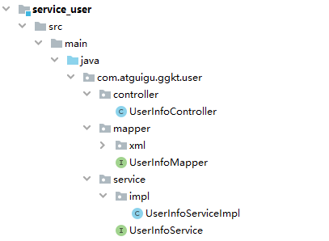
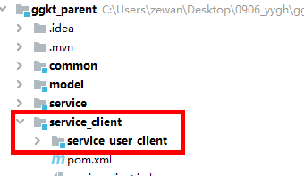
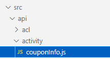

## 硅谷课堂第十一天-营销管理模块和公众号菜单管理

[TOC]

### 一、优惠券列表接口

#### 1、编写获取用户信息接口

**（1）获取优惠券详情时候，需要获取使用者的昵称和手机号，所以使用远程调用实现此功能。**

##### 1.1、创建service_user模块


##### 1.2、生成相关代码



##### 1.3、创建启动类

```java
@SpringBootApplication
@EnableDiscoveryClient
@MapperScan("com.atguigu.ggkt.user.mapper")
public class ServiceUserApplication {

    public static void main(String[] args) {
        SpringApplication.run(ServiceUserApplication.class, args);
    }

}
```

##### 1.4、创建配置文件

```properties
# 服务端口
server.port=8304
# 服务名
spring.application.name=service-user

# 环境设置：dev、test、prod
spring.profiles.active=dev

# mysql数据库连接
spring.datasource.driver-class-name=com.mysql.jdbc.Driver
spring.datasource.url=jdbc:mysql://localhost:3306/glkt_user?characterEncoding=utf-8&useSSL=false
spring.datasource.username=root
spring.datasource.password=root

#返回json的全局时间格式
spring.jackson.date-format=yyyy-MM-dd HH:mm:ss
spring.jackson.time-zone=GMT+8

#mybatis日志
mybatis-plus.configuration.log-impl=org.apache.ibatis.logging.stdout.StdOutImpl

# nacos服务地址
spring.cloud.nacos.discovery.server-addr=127.0.0.1:8848
```

##### 1.5、编写UserInfocontroller

**实现根据用户id获取用户信息接口**

```java
@RestController
@RequestMapping("/admin/user/userInfo")
public class UserInfoController {

    @Autowired
    private UserInfoService userService;

    @ApiOperation(value = "获取")
    @GetMapping("inner/getById/{id}")
    public UserInfo getById(@PathVariable Long id) {
        return userService.getById(id);
    }
}
```

##### 1.6、配置网关

**在网关配置文件配置路径**

```properties
#service-user模块配置
#设置路由id
spring.cloud.gateway.routes[3].id=service-user
#设置路由的uri
spring.cloud.gateway.routes[3].uri=lb://service-user
#设置路由断言,代理servicerId为auth-service的/auth/路径
spring.cloud.gateway.routes[3].predicates= Path=/*/user/**
```


#### 2、创建模块定义远程接口

##### 2.1、创建模块

**在ggkt_parent -> service_client -> service_user_client**



##### 2.2、service_client引入依赖

```xml
<dependencies>
    <dependency>
        <groupId>com.atguigu</groupId>
        <artifactId>service_util</artifactId>
        <version>0.0.1-SNAPSHOT</version>
        <scope>provided </scope>
    </dependency>

    <dependency>
        <groupId>com.atguigu</groupId>
        <artifactId>model</artifactId>
        <version>0.0.1-SNAPSHOT</version>
        <scope>provided </scope>
    </dependency>

    <dependency>
        <groupId>org.springframework.boot</groupId>
        <artifactId>spring-boot-starter-web</artifactId>
        <scope>provided </scope>
    </dependency>

    <!-- 服务调用feign -->
    <dependency>
        <groupId>org.springframework.cloud</groupId>
        <artifactId>spring-cloud-starter-openfeign</artifactId>
        <scope>provided </scope>
    </dependency>
</dependencies>
```

##### 2.3、定义远程调用的接口

```java
@FeignClient(value = "service-user")
public interface UserInfoFeignClient {
    
    @GetMapping("/admin/user/userInfo/inner/getById/{id}")
    UserInfo getById(@PathVariable Long id);

}
```


#### 3、编写Service实现方法

##### 3.1、service_activity引入依赖

```xml
<dependencies>
    <dependency>
        <groupId>com.atguigu</groupId>
        <artifactId>service_user_client</artifactId>
        <version>0.0.1-SNAPSHOT</version>
    </dependency>
</dependencies>
```

##### 3.2、service_activity添加注解

```java
@SpringBootApplication
@EnableDiscoveryClient
@EnableFeignClients(basePackages = "com.atguigu")
@ComponentScan(basePackages = "com.atguigu")
public class ServiceActivityApplication {

    public static void main(String[] args) {
        SpringApplication.run(ServiceActivityApplication.class, args);
    }
}
```

##### 3.3、CouponInfoServiceImpl实现方法

**远程调用，根据用户id获取用户信息**

```java
@Service
public class CouponInfoServiceImpl extends ServiceImpl<CouponInfoMapper, CouponInfo> implements CouponInfoService {

    @Autowired
    private CouponUseService couponUseService;

    @Autowired
    private UserInfoFeignClient userInfoFeignClient;

    //获取已使用优惠券列表
    @Override
    public IPage<CouponUse> selectCouponUsePage(Page<CouponUse> pageParam, CouponUseQueryVo couponUseQueryVo) {
        //获取条件
        Long couponId = couponUseQueryVo.getCouponId();
        String couponStatus = couponUseQueryVo.getCouponStatus();
        String getTimeBegin = couponUseQueryVo.getGetTimeBegin();
        String getTimeEnd = couponUseQueryVo.getGetTimeEnd();
        //封装条件
        QueryWrapper<CouponUse> wrapper = new QueryWrapper<>();
        if(!StringUtils.isEmpty(couponId)) {
            wrapper.eq("coupon_id",couponId);
        }
        if(!StringUtils.isEmpty(couponStatus)) {
            wrapper.eq("coupon_status",couponStatus);
        }
        if(!StringUtils.isEmpty(getTimeBegin)) {
            wrapper.ge("get_time",getTimeBegin);
        }
        if(!StringUtils.isEmpty(getTimeEnd)) {
            wrapper.le("get_time",getTimeEnd);
        }
        //调用方法查询
        IPage<CouponUse> page = couponUseService.page(pageParam, wrapper);
        //封装用户昵称和手机号
        List<CouponUse> couponUseList = page.getRecords();
        couponUseList.stream().forEach(item->{
            this.getUserInfoBycouponUse(item);
        });
        return page;
    }

    //封装用户昵称和手机号
    private CouponUse getUserInfoBycouponUse(CouponUse couponUse) {
        Long userId = couponUse.getUserId();
        if(!StringUtils.isEmpty(userId)) {
            UserInfo userInfo = userInfoFeignClient.getById(userId);
            if(userInfo != null) {
                couponUse.getParam().put("nickName", userInfo.getNickName());
                couponUse.getParam().put("phone", userInfo.getPhone());
            }
        }
        return couponUse;
    }
}
```


#### 4、配置网关

##### 4.1、配置路由规则

**（1）service_gateway配置文件**

```properties
#service-activity模块配置
#设置路由id
spring.cloud.gateway.routes[2].id=service-activity
#设置路由的uri
spring.cloud.gateway.routes[2].uri=lb://service-activity
#设置路由断言,代理servicerId为auth-service的/auth/路径
spring.cloud.gateway.routes[2].predicates= Path=/*/activity/**
```


#### 5、整合优惠券前端

##### 5.1、定义接口

（**1）创建api -> activity -> couponInfo.js**



```js
import request from '@/utils/request'

const api_name = '/admin/activity/couponInfo'

export default {

  getPageList(page, limit) {
    return request({
      url: `${api_name}/${page}/${limit}`,
      method: 'get'
    })
  },
  getById(id) {
    return request({
      url: `${api_name}/get/${id}`,
      method: 'get'
    })
  },

  save(role) {
    return request({
      url: `${api_name}/save`,
      method: 'post',
      data: role
    })
  },

  updateById(role) {
    return request({
      url: `${api_name}/update`,
      method: 'put',
      data: role
    })
  },
  removeById(id) {
    return request({
      url: `${api_name}/remove/${id}`,
      method: 'delete'
    })
  },
  removeRows(idList) {
    return request({
      url: `${api_name}/batchRemove`,
      method: 'delete',
      data: idList
    })
  },

  getPageCouponUseList(page, limit, searchObj) {
    return request({
      url: `${api_name}/couponUse/${page}/${limit}`,
      method: 'get',
      params: searchObj
    })
  }
}
```

##### 5.2、创建路由

**（1）router -> index.js定义路由**

```js
{
  path: '/activity',
  component: Layout,
  redirect: '/couponInfo/list',
  name: 'Activity',
  meta: { title: '营销活动管理', icon: 'el-icon-football' },
  alwaysShow: true,
  children: [
    {
      path: 'couponInfo/list',
      name: 'CouponInfo',
      component: () => import('@/views/activity/couponInfo/list'),
      meta: { title: '优惠券列表' }
    },
    {
      path: 'couponInfo/add',
      name: 'CouponInfoAdd',
      component: () => import('@/views/activity/couponInfo/form'),
      meta: { title: '添加' },
      hidden: true
    },
    {
      path: 'couponInfo/edit/:id',
      name: 'CouponInfoEdit',
      component: () => import('@/views/activity/couponInfo/form'),
      meta: { title: '编辑', noCache: true },
      hidden: true
    },
    {
      path: 'couponInfo/show/:id',
      name: 'CouponInfoShow',
      component: () => import('@/views/activity/couponInfo/show'),
      meta: { title: '详情', noCache: true },
      hidden: true
    }
  ]
},
```

##### 5.3、创建vue页面

**（1）创建views -> activity-> couponInfo-> 页面**


**（2）list.vue**

```vue
<template>
  <div class="app-container">

    <!-- 工具条 -->
    <el-card class="operate-container" shadow="never">
      <i class="el-icon-tickets" style="margin-top: 5px"></i>
      <span style="margin-top: 5px">数据列表</span>
      <el-button class="btn-add" size="mini" @click="add()">添加</el-button>
    </el-card>

    <!-- banner列表 -->
    <el-table
      v-loading="listLoading"
      :data="list"
      element-loading-text="数据正在加载......"
      border
      fit
      highlight-current-row>

      <el-table-column
        label="序号"
        width="70"
        align="center">
        <template slot-scope="scope">
          {{ (page - 1) * limit + scope.$index + 1 }}
        </template>
      </el-table-column>

      <el-table-column prop="couponName" label="购物券名称" />
      <el-table-column prop="couponType" label="购物券类型">
        <template slot-scope="scope">
          {{ scope.row.couponType == 'REGISTER' ? '注册卷' : '推荐赠送卷' }}
        </template>
      </el-table-column>
      <el-table-column label="规则">
        <template slot-scope="scope">
          {{ '现金卷：' + scope.row.amount + '元' }}
        </template>
      </el-table-column>
      <el-table-column label="使用范围 ">
          所有商品
      </el-table-column>
      <el-table-column prop="publishCount" label="发行数量" />
      <el-table-column prop="expireTime" label="过期时间" />
      <el-table-column prop="createTime" label="创建时间" />
      <el-table-column label="操作" width="150" align="center">
        <template slot-scope="scope">
          <router-link :to="'/activity/couponInfo/edit/'+scope.row.id">
            <el-button size="mini" type="text" >修改</el-button>
          </router-link>
          <el-button size="mini" type="text" @click="removeDataById(scope.row.id)">删除</el-button>
          <router-link :to="'/activity/couponInfo/show/'+scope.row.id">
            <el-button size="mini" type="text" >详情</el-button>
          </router-link>
        </template>
      </el-table-column>
    </el-table>

    <!-- 分页组件 -->
    <el-pagination
      :current-page="page"
      :total="total"
      :page-size="limit"
      :page-sizes="[5, 10, 20, 30, 40, 50, 100]"
      style="padding: 30px 0; text-align: center;"
      layout="sizes, prev, pager, next, jumper, ->, total, slot"
      @current-change="fetchData"
      @size-change="changeSize"
    />
  </div>
</template>

<script>
import api from '@/api/activity/couponInfo'

export default {
  data() {
    return {
      listLoading: true, // 数据是否正在加载
      list: null, // banner列表
      total: 0, // 数据库中的总记录数
      page: 1, // 默认页码
      limit: 10, // 每页记录数
      searchObj: {}, // 查询表单对象
      multipleSelection: [] // 批量选择中选择的记录列表
    }
  },

  // 生命周期函数：内存准备完毕，页面尚未渲染
  created() {
    console.log('list created......')
    this.fetchData()
  },

  // 生命周期函数：内存准备完毕，页面渲染成功
  mounted() {
    console.log('list mounted......')
  },

  methods: {

    // 当页码发生改变的时候
    changeSize(size) {
      console.log(size)
      this.limit = size
      this.fetchData(1)
    },

    add(){
      this.$router.push({ path: '/activity/couponInfo/add' })
    },

    // 加载banner列表数据
    fetchData(page = 1) {
      console.log('翻页。。。' + page)
      // 异步获取远程数据（ajax）
      this.page = page

      api.getPageList(this.page, this.limit, this.searchObj).then(
        response => {
          this.list = response.data.records
          this.total = response.data.total

          // 数据加载并绑定成功
          this.listLoading = false
        }
      )
    },

    // 重置查询表单
    resetData() {
      console.log('重置查询表单')
      this.searchObj = {}
      this.fetchData()
    },

    // 根据id删除数据
    removeDataById(id) {
      // debugger
      this.$confirm('此操作将永久删除该记录, 是否继续?', '提示', {
        confirmButtonText: '确定',
        cancelButtonText: '取消',
        type: 'warning'
      }).then(() => { // promise
        // 点击确定，远程调用ajax
        return api.removeById(id)
      }).then((response) => {
        this.fetchData(this.page)
        if (response.code) {
          this.$message({
            type: 'success',
            message: '删除成功!'
          })
        }
      }).catch(() => {
        this.$message({
          type: 'info',
          message: '已取消删除'
        })
      })
    }
  }
}
</script>
```

**（3）form.vue**

```vue
<template>
  <div class="app-container">
    <el-form label-width="120px">

      <el-form-item label="优惠券名称">
        <el-input v-model="couponInfo.couponName"/>
      </el-form-item>
      <el-form-item label="优惠券类型">
        <el-radio-group v-model="couponInfo.couponType">
          <el-radio label="1">注册卷</el-radio>
          <el-radio label="2">推荐购买卷</el-radio>
        </el-radio-group>
      </el-form-item>

      <el-form-item label="发行数量">
        <el-input v-model="couponInfo.publishCount"/>
      </el-form-item>
      <el-form-item label="领取时间">
        <el-date-picker
          v-model="couponInfo.startTime"
          type="date"
          placeholder="选择开始日期"
          value-format="yyyy-MM-dd" />
        至
        <el-date-picker
          v-model="couponInfo.endTime"
          type="date"
          placeholder="选择开始日期"
          value-format="yyyy-MM-dd" />
      </el-form-item>
      <el-form-item label="过期时间">
        <el-date-picker
          v-model="couponInfo.expireTime"
          type="datetime"
          placeholder="选择开始日期"
          value-format="yyyy-MM-dd HH:mm:ss" />
      </el-form-item>
      <el-form-item label="直播详情">
        <el-input v-model="couponInfo.ruleDesc" type="textarea" rows="5"/>
      </el-form-item>
      <el-form-item>
        <el-button type="primary" @click="saveOrUpdate">保存</el-button>
        <el-button @click="back">返回</el-button>
      </el-form-item>
    </el-form>
  </div>
</template>

<script>

import api from '@/api/activity/couponInfo'

const defaultForm = {
  id: '',
  couponType: '1',
  couponName: '',
  amount: '0',
  conditionAmount: '0',
  startTime: '',
  endTime: '',
  rangeType: '1',
  ruleDesc: '',
  publishCount: '',
  perLimit: '1',
  useCount: '0',
  receiveCount: '',
  expireTime: '',
  publishStatus: ''
}

export default {
  data() {
    return {
      couponInfo: defaultForm,
      saveBtnDisabled: false,

      keyword: '',
      skuInfoList: []
    }
  },

  // 监听器
  watch: {
    $route(to, from) {
      console.log('路由变化......')
      console.log(to)
      console.log(from)
      this.init()
    }
  },

  // 生命周期方法（在路由切换，组件不变的情况下不会被调用）
  created() {
    console.log('form created ......')
    this.init()
  },

  methods: {

    // 表单初始化
    init() {
      // debugger
      if (this.$route.params && this.$route.params.id) {
        const id = this.$route.params.id
        this.fetchDataById(id)
      } else {
        // 对象拓展运算符：拷贝对象，而不是赋值对象的引用
        this.couponInfo = { ...defaultForm }
      }
    },

    saveOrUpdate() {
      this.saveBtnDisabled = true // 防止表单重复提交
      if (!this.couponInfo.id) {
        this.saveData()
      } else {
        this.updateData()
      }
    },

    // 新增
    saveData() {
      api.save(this.couponInfo).then(response => {
        // debugger
        if (response.code) {
          this.$message({
            type: 'success',
            message: response.message
          })
          this.$router.push({ path: '/activity/couponInfo/list' })
        }
      })
    },

    // 根据id更新记录
    updateData() {
      api.updateById(this.couponInfo).then(response => {
        debugger
        if (response.code) {
          this.$message({
            type: 'success',
            message: response.message
          })
          this.$router.push({ path: '/activity/couponInfo/list' })
        }
      })
    },

    back() {
      this.$router.push({ path: '/activity/couponInfo/list' })
    },

    // 根据id查询记录
    fetchDataById(id) {
      api.getById(id).then(response => {
        // debugger
        this.couponInfo = response.data
      })
    }
  }
}
</script>
```

**（4）show.vue**

```vue
<template>
  <div class="app-container">

    <h4>优惠券信息</h4>
    <table class="table table-striped table-condenseda table-bordered" width="100%">
      <tbody>
      <tr>
        <th width="15%">优惠券名称</th>
        <td width="35%"><b style="font-size: 14px">{{ couponInfo.couponName }}</b></td>
        <th width="15%">优惠券类型</th>
        <td width="35%">
          {{ couponInfo.couponType == 'REGISTER' ? '注册卷' : '推荐赠送卷' }}
        </td>
      </tr>
      <tr>
        <th>发行数量</th>
        <td>{{ couponInfo.publishCount }}</td>
        <th>每人限领次数</th>
        <td>{{ couponInfo.perLimit }}</td>
      </tr>
      <tr>
        <th>领取数量</th>
        <td>{{ couponInfo.receiveCount }}</td>
        <th>使用数量</th>
        <td>{{ couponInfo.useCount }}</td>
      </tr>
      <tr>
        <th>领取时间</th>
        <td>{{ couponInfo.startTime }}至{{ couponInfo.endTime }}</td>
        <th>过期时间</th>
        <td>{{ couponInfo.expireTime }}</td>
      </tr>
      <tr>
        <th>规则描述</th>
        <td colspan="3">{{ couponInfo.ruleDesc }}</td>
      </tr>
      </tbody>
    </table>

    <h4>
      优惠券发放列表&nbsp;&nbsp;&nbsp;
    </h4>
    <el-table
      v-loading="listLoading"
      :data="list"
      stripe
      border
      style="width: 100%;margin-top: 10px;">

      <el-table-column
        label="序号"
        width="70"
        align="center">
        <template slot-scope="scope">
          {{ (page - 1) * limit + scope.$index + 1 }}
        </template>
      </el-table-column>
      <el-table-column prop="param.nickName" label="用户昵称" />
      <el-table-column prop="param.phone" label="手机号" />
      <el-table-column label="使用状态">
        <template slot-scope="scope">
          {{ scope.row.couponStatus == 'NOT_USED' ? '未使用' : '已使用' }}
        </template>
      </el-table-column>
      <el-table-column prop="getTime" label="获取时间" />
      <el-table-column prop="usingTime" label="使用时间" />
      <el-table-column prop="usedTime" label="支付时间" />
      <el-table-column prop="expireTime" label="过期时间" />
    </el-table>
    <!-- 分页组件 -->
    <el-pagination
      :current-page="page"
      :total="total"
      :page-size="limit"
      :page-sizes="[5, 10, 20, 30, 40, 50, 100]"
      style="padding: 30px 0; text-align: center;"
      layout="sizes, prev, pager, next, jumper, ->, total, slot"
      @current-change="fetchData"
      @size-change="changeSize"
    />

    <div style="margin-top: 15px;">
      <el-form label-width="0px">
        <el-form-item>
          <el-button @click="back">返回</el-button>
        </el-form-item>
      </el-form>
    </div>
  </div>
</template>

<script>
import api from '@/api/activity/couponInfo'
export default {
  data() {
    return {
      listLoading: false, // 数据是否正在加载

      couponId: null,
      couponInfo: {},

      list: null, // banner列表
      total: 0, // 数据库中的总记录数
      page: 1, // 默认页码
      limit: 10, // 每页记录数
      searchObj: {} // 查询表单对象
    }
  },

  // 监听器
  watch: {
    $route(to, from) {
      console.log('路由变化......')
      console.log(to)
      console.log(from)
      this.init()
    }
  },

  // 生命周期方法（在路由切换，组件不变的情况下不会被调用）
  created() {
    console.log('form created ......')
    this.couponId = this.$route.params.id
    // 获取优惠券信息
    this.fetchDataById()
    this.fetchData()
  },

  methods: {

    // 根据id查询记录
    fetchDataById() {
      api.getById(this.couponId).then(response => {
        //
        this.couponInfo = response.data
      })
    },

    // 当页码发生改变的时候
    changeSize(size) {
      console.log(size)
      this.limit = size
      this.fetchData(1)
    },

    // 加载banner列表数据
    fetchData(page = 1) {
      console.log('翻页。。。' + page)
      // 异步获取远程数据（ajax）
      this.page = page
      this.searchObj.couponId = this.couponId
      api.getPageCouponUseList(this.page, this.limit, this.searchObj).then(
        response => {
          this.list = response.data.records
          this.total = response.data.total

          // 数据加载并绑定成功
          this.listLoading = false
        }
      )
    },

    back() {
      this.$router.push({ path: '/activity/couponInfo/list' })
    }
  }
}
</script>
<style>
  .app-container h4 {
    color: #606266;
  }
</style>
```


### 二、微信公众号

#### 1、注册公众号

微信公众平台：https://mp.weixin.qq.com/


硅谷课堂要求基于H5，具有微信支付等高级功能的，因此需要注册服务号，订阅号不具备支付功能。

注册步骤参考官方注册文档：https://kf.qq.com/faq/120911VrYVrA151013MfYvYV.html，

注册过程仅做了解，有公司运营负责申请与认证。

#### 2、公众号功能介绍

我们在微信公众平台扫码登录后可以发现管理页面左侧菜单栏有丰富的功能：


大概可以分为这几大模块：
**首页**、**内容与互动**、**数据**、**广告与服务**、**设置与开发**、**新功能**

作为开发人员，首先应该关注的是设置与开发模块；而作为产品运营人员与数据分析人员，关注的是内容与互动、数据及广告与服务模块。

首先我们不妨各个功能模块都点击看一看，大概了解下我们能做些什么。可以确认的是，这个微信公众平台当然**不只是给开发人员使用**的，它提供了很多**非技术人员**可在**UI界面上交互操作**的功能模块。

如配置消息回复、自定义菜单、发布文章等：


这个时候我们可能会想：这些功能好像非技术人员都能随意操作，那么还需要我们技术人员去开发吗？

**答案是**： 如果只是日常简单的推送文章，就像我们关注的大多数公众号一样，那确实不需要技术人员去开发；但是，如果你想将你们的网站嵌入进去公众号菜单里（这里指的是把前端项目的首页链接配置在自定义菜单），并且实现微信端的独立登录认证、获取微信用户信息、微信支付等高级功能，或者觉得UI交互的配置方式无法满足你的需求，你需要更加自由、随心所欲的操作，那么我们就必须启用开发者模式了，通过技术人员的手段去灵活控制公众号。

**这里有一点需要注意，如果我们决定技术人员开发公众号，必须启用服务器配置，而这将导致UI界面设置的自动回复和自定义菜单失效！**

我们在 **设置与开发 - 基本配置 - 服务器配置** 中点击启用：


至于服务器配置中的选项代表什么意思、如何填写，我们下面再讲。


#### 3、微信公众平台测试帐号

##### 3.1、申请测试帐号

微信公众平台接口测试帐号：https://mp.weixin.qq.com/debug/cgi-bin/sandbox?t=sandbox/login&token=399029368&lang=zh_CN


##### 3.2、查看测试号管理

（1）其中appID和appsecret用于后面菜单开发使用

（2）其中URL是开发者用来接收微信消息和事件的接口URL。Token可由开发者可以任意填写，用作生成签名（该Token会和接口URL中包含的Token进行比对，从而验证安全性）。本地测试，url改为内网穿透地址。


##### 3.3、关注公众号


#### 4、开发业务介绍

硅谷课堂涉及的微信公众号功能模块：自定义菜单、消息、微信支付、授权登录等


### 三、后台管理系统-公众号菜单管理

#### 1、需求分析

##### 1.1、微信自定义菜单说明

微信自定义菜单文档地址：https://developers.weixin.qq.com/doc/offiaccount/Custom_Menus/Creating_Custom-Defined_Menu.html

微信自定义菜单注意事项：

1. 自定义菜单最多包括3个一级菜单，每个一级菜单最多包含5个二级菜单。
2. 一级菜单最多4个汉字，二级菜单最多8个汉字，多出来的部分将会以“...”代替。
3. 创建自定义菜单后，菜单的刷新策略是，在用户进入公众号会话页或公众号profile页时，如果发现上一次拉取菜单的请求在5分钟以前，就会拉取一下菜单，如果菜单有更新，就会刷新客户端的菜单。测试时可以尝试取消关注公众账号后再次关注，则可以看到创建后的效果。

##### 1.2、硅谷课堂自定义菜单

一级菜单：直播、课程、我的

二级菜单：根据一级菜单动态设置二级菜单，直播（近期直播课程），课程（课程分类），我的（我的订单、我的课程、我的优惠券及关于我们）

说明：

​	1、二级菜单可以是网页类型，点击跳转H5页面

​	2、二级菜单可以是消息类型，点击返回消息

##### 1.3、数据格式

自定义菜单通过后台管理设置到数据库表，数据配置好后，通过微信接口推送菜单数据到微信平台。

**表结构（menu）：**


表示例数据：


##### 1.4、管理页面

**（1）页面功能“列表、添加、修改与删除”是对menu表的操作**

**（2）页面功能“同步菜单与删除菜单”是对微信平台接口操作**


#### 2、搭建菜单管理后端环境

##### 2.1、创建模块service_wechat

**（1）在service下创建子模块service_wechat**


**（2）引入依赖**

```xml
    <dependencies>
        <dependency>
            <groupId>com.github.binarywang</groupId>
            <artifactId>weixin-java-mp</artifactId>
            <version>4.1.0</version>
        </dependency>
    </dependencies>
```

##### 2.2、生成菜单相关代码


##### 2.3、创建启动类和配置文件

**（1）启动类**

```java
@SpringBootApplication
@EnableDiscoveryClient
@EnableFeignClients(basePackages = "com.atguigu")
@MapperScan("com.atguigu.ggkt.wechat.mapper")
@ComponentScan(basePackages = "com.atguigu")
public class ServiceWechatApplication {
    public static void main(String[] args) {
        SpringApplication.run(ServiceWechatApplication.class, args);
    }
}
```

**（2）配置文件**

```properties
# 服务端口
server.port=8305
# 服务名
spring.application.name=service-wechat

# 环境设置：dev、test、prod
spring.profiles.active=dev

# mysql数据库连接
spring.datasource.driver-class-name=com.mysql.jdbc.Driver
spring.datasource.url=jdbc:mysql://localhost:3306/glkt_wechat?characterEncoding=utf-8&useSSL=false
spring.datasource.username=root
spring.datasource.password=root

#返回json的全局时间格式
spring.jackson.date-format=yyyy-MM-dd HH:mm:ss
spring.jackson.time-zone=GMT+8

#mybatis日志
mybatis-plus.configuration.log-impl=org.apache.ibatis.logging.stdout.StdOutImpl

mybatis-plus.mapper-locations=classpath:com/atguigu/ggkt/wechat/mapper/xml/*.xml

# nacos服务地址
spring.cloud.nacos.discovery.server-addr=127.0.0.1:8848

#公众号id和秘钥
# 硅谷课堂微信公众平台appId
wechat.mpAppId: wx09f201e9013e81d8
# 硅谷课堂微信公众平台api秘钥
wechat.mpAppSecret: 6c999765c12c51850d28055e8b6e2eda
```

##### 2.4、配置网关

```properties
#service-wechat模块配置
#设置路由id
spring.cloud.gateway.routes[4].id=service-wechat
#设置路由的uri
spring.cloud.gateway.routes[4].uri=lb://service-wechat
#设置路由断言,代理servicerId为auth-service的/auth/路径
spring.cloud.gateway.routes[4].predicates= Path=/*/wechat/**
```


#### 3、开发菜单管理接口

##### 3.1、编写MenuController

```java
@RestController
@RequestMapping("/admin/wechat/menu")
public class MenuController {

    @Autowired
    private MenuService menuService;

    //获取所有菜单，按照一级和二级菜单封装
    @GetMapping("findMenuInfo")
    public Result findMenuInfo() {
        List<MenuVo> list = menuService.findMenuInfo();
        return Result.ok(list);
    }

    //获取所有一级菜单
    @GetMapping("findOneMenuInfo")
    public Result findOneMenuInfo() {
        List<Menu> list = menuService.findMenuOneInfo();
        return Result.ok(list);
    }

    @ApiOperation(value = "获取")
    @GetMapping("get/{id}")
    public Result get(@PathVariable Long id) {
        Menu menu = menuService.getById(id);
        return Result.ok(menu);
    }

    @ApiOperation(value = "新增")
    @PostMapping("save")
    public Result save(@RequestBody Menu menu) {
        menuService.save(menu);
        return Result.ok(null);
    }

    @ApiOperation(value = "修改")
    @PutMapping("update")
    public Result updateById(@RequestBody Menu menu) {
        menuService.updateById(menu);
        return Result.ok(null);
    }

    @ApiOperation(value = "删除")
    @DeleteMapping("remove/{id}")
    public Result remove(@PathVariable Long id) {
        menuService.removeById(id);
        return Result.ok(null);
    }

    @ApiOperation(value = "根据id列表删除")
    @DeleteMapping("batchRemove")
    public Result batchRemove(@RequestBody List<Long> idList) {
        menuService.removeByIds(idList);
        return Result.ok(null);
    }
}
```

##### 3.2、编写Service

**（1）MenuService定义方法**

```java
public interface MenuService extends IService<Menu> {
    //获取全部菜单
    List<MenuVo> findMenuInfo();
    //获取一级菜单
    List<Menu> findOneMenuInfo();
}
```

**（2）MenuServiceImpl实现方法**

```java
@Service
public class MenuServiceImpl extends ServiceImpl<MenuMapper, Menu> implements MenuService {
    //获取全部菜单
    @Override
    public List<MenuVo> findMenuInfo() {
        List<MenuVo> list = new ArrayList<>();
        List<Menu> menuList = baseMapper.selectList(null);
        List<Menu> oneMenuList = menuList.stream().filter(menu -> menu.getParentId().longValue() == 0).collect(Collectors.toList());
        for(Menu oneMenu : oneMenuList) {
            MenuVo oneMenuVo = new MenuVo();
            BeanUtils.copyProperties(oneMenu, oneMenuVo);

            List<Menu> twoMenuList = menuList.stream()
                    .filter(menu -> menu.getParentId().longValue() == oneMenu.getId())
                    .sorted(Comparator.comparing(Menu::getSort))
                    .collect(Collectors.toList());
            List<MenuVo> children = new ArrayList<>();
            for(Menu twoMenu : twoMenuList) {
                MenuVo twoMenuVo = new MenuVo();
                BeanUtils.copyProperties(twoMenu, twoMenuVo);
                children.add(twoMenuVo);
            }
            oneMenuVo.setChildren(children);
            list.add(oneMenuVo);
        }
        return list;
    }

    //获取一级菜单
    @Override
    public List<Menu> findOneMenuInfo() {
        QueryWrapper<Menu> wrapper = new QueryWrapper<>();
        wrapper.eq("parent_id",0);
        List<Menu> list = baseMapper.selectList(wrapper);
        return list;
    }
}
```


#### 4、同步菜单（获取access_token）

##### 4.1、文档查看

（**1）进行菜单同步时候，需要获取到公众号的access_token，通过access_token进行菜单同步**

接口文档：https://developers.weixin.qq.com/doc/offiaccount/Basic_Information/Get_access_token.html


**（2）调用方式**


##### 4.2、service_wechat添加配置

```properties
# 硅谷课堂微信公众平台appId
wechat.mpAppId: wx09f201e9013e81d8
# 硅谷课堂微信公众平台api秘钥
wechat.mpAppSecret: 6c999765c12c51850d28055e8b6e2eda
```

##### 4.3、添加工具类

```java
@Component
public class ConstantPropertiesUtil implements InitializingBean {

    @Value("${wechat.mpAppId}")
    private String appid;

    @Value("${wechat.mpAppSecret}")
    private String appsecret;

    public static String ACCESS_KEY_ID;
    public static String ACCESS_KEY_SECRET;

    @Override
    public void afterPropertiesSet() throws Exception {
        ACCESS_KEY_ID = appid;
        ACCESS_KEY_SECRET = appsecret;
    }
}
```

##### 4.4、复制HttpClient工具类


##### 4.5、添加Menucontroller方法

```java
    //获取access_token
    @GetMapping("getAccessToken")
    public Result getAccessToken() {
        try {
            //拼接请求地址
            StringBuffer buffer = new StringBuffer();
            buffer.append("https://api.weixin.qq.com/cgi-bin/token");
            buffer.append("?grant_type=client_credential");
            buffer.append("&appid=%s");
            buffer.append("&secret=%s");
            //请求地址设置参数
            String url = String.format(buffer.toString(),
                    ConstantPropertiesUtil.ACCESS_KEY_ID,
                    ConstantPropertiesUtil.ACCESS_KEY_SECRET);
            //发送http请求
            String tokenString = HttpClientUtils.get(url);
            //获取access_token
            JSONObject jsonObject = JSONObject.parseObject(tokenString);
            String access_token = jsonObject.getString("access_token");
            //返回
            return Result.ok(access_token);
        } catch (Exception e) {
            e.printStackTrace();
            return Result.fail(null);
        }
    }
```

##### 4.6、测试


#### 5、同步菜单（功能实现）

接口文档：https://developers.weixin.qq.com/doc/offiaccount/Custom_Menus/Creating_Custom-Defined_Menu.html

**接口调用请求说明**

http请求方式：POST（请使用https协议） https://api.weixin.qq.com/cgi-bin/menu/create?access_token=ACCESS_TOKEN

**weixin-java-mp**是封装好了的微信接口客户端，使用起来很方便，后续我们就使用weixin-java-mp处理微信平台接口。

##### 5.1、添加配置类

```java
@Component
public class WeChatMpConfig {

    @Autowired
    private ConstantPropertiesUtil constantPropertiesUtil;

    @Bean
    public WxMpService wxMpService(){
        WxMpService wxMpService = new WxMpServiceImpl();
        wxMpService.setWxMpConfigStorage(wxMpConfigStorage());
        return wxMpService;
    }
    @Bean
    public WxMpConfigStorage wxMpConfigStorage(){
        WxMpDefaultConfigImpl wxMpConfigStorage = new WxMpDefaultConfigImpl();
        wxMpConfigStorage.setAppId(ConstantPropertiesUtil.ACCESS_KEY_ID);
        wxMpConfigStorage.setSecret(ConstantPropertiesUtil.ACCESS_KEY_SECRET);
        return wxMpConfigStorage;
    }
}
```

##### 5.2、定义Service方法

**MenuService**

```java
void syncMenu();
```

##### 5.3、实现Service方法

**MenuServiceImpl**

```java
    @Autowired
    private WxMpService wxMpService;
    
    /**
     * 说明：
     * 自定义菜单最多包括3个一级菜单，每个一级菜单最多包含5个二级菜单。
     * 一级菜单最多4个汉字，二级菜单最多8个汉字，多出来的部分将会以“...”代替。
     * 创建自定义菜单后，菜单的刷新策略是，在用户进入公众号会话页或公众号profile页时，如果发现上一次拉取菜单的请求在5分钟以前，就会拉取一下菜单，如果菜单有更新，就会刷新客户端的菜单。测试时可以尝试取消关注公众账号后再次关注，则可以看到创建后的效果。
     */
    @SneakyThrows
    @Override
    public void syncMenu() {
        List<MenuVo> menuVoList = this.findMenuInfo();
        //菜单
        JSONArray buttonList = new JSONArray();
        for(MenuVo oneMenuVo : menuVoList) {
            JSONObject one = new JSONObject();
            one.put("name", oneMenuVo.getName());
            JSONArray subButton = new JSONArray();
            for(MenuVo twoMenuVo : oneMenuVo.getChildren()) {
                JSONObject view = new JSONObject();
                view.put("type", twoMenuVo.getType());
                if(twoMenuVo.getType().equals("view")) {
                    view.put("name", twoMenuVo.getName());
                    view.put("url", "http://ggkt2.vipgz1.91tunnel.com/#"
                            +twoMenuVo.getUrl());
                } else {
                    view.put("name", twoMenuVo.getName());
                    view.put("key", twoMenuVo.getMeunKey());
                }
                subButton.add(view);
            }
            one.put("sub_button", subButton);
            buttonList.add(one);
        }
        //菜单
        JSONObject button = new JSONObject();
        button.put("button", buttonList);
        this.wxMpService.getMenuService().menuCreate(button.toJSONString());
    }
```

##### 5.4、controller方法

```java
@ApiOperation(value = "同步菜单")
@GetMapping("syncMenu")
public Result createMenu() throws WxErrorException {
    menuService.syncMenu();
    return Result.ok(null);
}
```


#### 6、删除菜单

##### 6.1、service接口

```java
void removeMenu();
```

##### 6.2、service接口实现

```java
@SneakyThrows
@Override
public void removeMenu() {
    wxMpService.getMenuService().menuDelete();
}
```

##### 6.3、controller方法

```java
@ApiOperation(value = "删除菜单")
@DeleteMapping("removeMenu")
public Result removeMenu() {
    menuService.removeMenu();
    return Result.ok(null);
}
```


#### 7、开发菜单管理前端

##### 7.1、添加路由

**（1）src -> router -> index.js添加路由**

```js
{
    path: '/wechat',
    component: Layout,
    redirect: '/wechat/menu/list',
    name: 'Wechat',
    meta: {
      title: '菜单管理',
      icon: 'el-icon-refrigerator'
    },
    alwaysShow: true,
    children: [
      {
        path: 'menu/list',
        name: 'Menu',
        component: () => import('@/views/wechat/menu/list'),
        meta: { title: '菜单列表' }
      }
    ]
},
```

##### 7.2、定义接口

**（1）src -> api -> wechat -> menu.js定义接口**

```js
import request from '@/utils/request'

const api_name = '/admin/wechat/menu'

export default {

  findMenuInfo() {
    return request({
      url: `${api_name}/findMenuInfo`,
      method: `get`
    })
  },

  findOneMenuInfo() {
    return request({
      url: `${api_name}/findOneMenuInfo`,
      method: `get`
    })
  },

  save(menu) {
    return request({
      url: `${api_name}/save`,
      method: `post`,
      data: menu
    })
  },

  getById(id) {
    return request({
      url: `${api_name}/get/${id}`,
      method: `get`
    })
  },

  updateById(menu) {
    return request({
      url: `${api_name}/update`,
      method: `put`,
      data: menu
    })
  },

  syncMenu() {
    return request({
      url: `${api_name}/syncMenu`,
      method: `get`
    })
  },

  removeById(id) {
    return request({
      url: `${api_name}/remove/${id}`,
      method: 'delete'
    })
  },

  removeMenu() {
    return request({
      url: `${api_name}/removeMenu`,
      method: `delete`
    })
  }
}
```

##### 7.3、编写页面

**（1）创建views -> wechat -> menu -> list.vue**

```vue
<template>
  <div class="app-container">

    <!-- 工具条 -->
    <el-card class="operate-container" shadow="never">
      <i class="el-icon-tickets" style="margin-top: 5px"></i>
      <span style="margin-top: 5px">数据列表</span>
      <el-button class="btn-add" size="mini" @click="remove" style="margin-left: 10px;">删除菜单</el-button>
      <el-button class="btn-add" size="mini" @click="syncMenu">同步菜单</el-button>
      <el-button class="btn-add" size="mini" @click="add">添 加</el-button>
    </el-card>

    <el-table
      :data="list"
      style="width: 100%;margin-bottom: 20px;"
      row-key="id"
      border
      default-expand-all
      :tree-props="{children: 'children'}">

      <el-table-column label="名称" prop="name" width="350"></el-table-column>
      <el-table-column label="类型" width="100">
        <template slot-scope="scope">
          {{ scope.row.type == 'view' ? '链接' : scope.row.type == 'click' ? '事件' : '' }}
        </template>
      </el-table-column>
      <el-table-column label="菜单URL" prop="url" ></el-table-column>
      <el-table-column label="菜单KEY" prop="meunKey"  width="130"></el-table-column>
      <el-table-column label="排序号" prop="sort"  width="70"></el-table-column>
      <el-table-column label="操作" width="170" align="center">
        <template slot-scope="scope">
          <el-button v-if="scope.row.parentId > 0" type="text" size="mini" @click="edit(scope.row.id)">修改</el-button>
          <el-button v-if="scope.row.parentId > 0" type="text" size="mini" @click="removeDataById(scope.row.id)">删除</el-button>
        </template>
      </el-table-column>
    </el-table>

    <el-dialog title="添加/修改" :visible.sync="dialogVisible" width="40%" >
      <el-form ref="flashPromotionForm" label-width="150px" size="small" style="padding-right: 40px;">

        <el-form-item label="选择一级菜单">
          <el-select
            v-model="menu.parentId"
            placeholder="请选择">
            <el-option
              v-for="item in list"
              :key="item.id"
              :label="item.name"
              :value="item.id"/>
          </el-select>
        </el-form-item>
        <el-form-item v-if="menu.parentId == 1" label="菜单名称">
          <el-select
            v-model="menu.name"
            placeholder="请选择"
            @change="liveCourseChanged">
            <el-option
              v-for="item in liveCourseList"
              :key="item.id"
              :label="item.courseName"
              :value="item"/>
          </el-select>
        </el-form-item>
        <el-form-item v-if="menu.parentId == 2" label="菜单名称">
          <el-select
            v-model="menu.name"
            placeholder="请选择"
            @change="subjectChanged">
            <el-option
              v-for="item in subjectList"
              :key="item.id"
              :label="item.title"
              :value="item"/>
          </el-select>
        </el-form-item>
        <el-form-item v-if="menu.parentId == 3" label="菜单名称">
          <el-input v-model="menu.name"/>
        </el-form-item>
        <el-form-item label="菜单类型">
          <el-radio-group v-model="menu.type">
            <el-radio label="view">链接</el-radio>
            <el-radio label="click">事件</el-radio>
          </el-radio-group>
        </el-form-item>
        <el-form-item v-if="menu.type == 'view'" label="链接">
          <el-input v-model="menu.url"/>
        </el-form-item>
        <el-form-item v-if="menu.type == 'click'" label="菜单KEY">
          <el-input v-model="menu.meunKey"/>
        </el-form-item>
        <el-form-item label="排序">
          <el-input v-model="menu.sort"/>
        </el-form-item>
      </el-form>
      <span slot="footer" class="dialog-footer">
        <el-button @click="dialogVisible = false" size="small">取 消</el-button>
        <el-button type="primary" @click="saveOrUpdate()" size="small">确 定</el-button>
      </span>
    </el-dialog>
  </div>
</template>
<script>
import menuApi from '@/api/wechat/menu'
//import liveCourseApi from '@/api/live/liveCourse'
import subjectApi from '@/api/vod/subject'
const defaultForm = {
  id: null,
  parentId: 1,
  name: '',
  nameId: null,
  sort: 1,
  type: 'view',
  meunKey: '',
  url: ''
}
export default {

  // 定义数据
  data() {
    return {
      list: [],

      liveCourseList: [],
      subjectList: [],

      dialogVisible: false,
      menu: defaultForm,
      saveBtnDisabled: false
    }
  },

  // 当页面加载时获取数据
  created() {
    this.fetchData()
   // this.fetchLiveCourse()
    this.fetchSubject()
  },

  methods: {
    // 调用api层获取数据库中的数据
    fetchData() {
      console.log('加载列表')
      menuApi.findMenuInfo().then(response => {
        this.list = response.data
        console.log(this.list)
      })
    },

    // fetchLiveCourse() {
    //   liveCourseApi.findLatelyList().then(response => {
    //     this.liveCourseList = response.data
    //     this.liveCourseList.push({'id': 0, 'courseName': '全部列表'})
    //   })
    // },

    fetchSubject() {
      console.log('加载列表')
      subjectApi.getChildList(0).then(response => {
        this.subjectList = response.data
      })
    },

    syncMenu() {
      this.$confirm('你确定上传菜单吗, 是否继续?', '提示', {
        confirmButtonText: '确定',
        cancelButtonText: '取消',
        type: 'warning'
      }).then(() => {
        return menuApi.syncMenu();
      }).then((response) => {
        this.fetchData()
        this.$message.success(response.message)
      }).catch(error => {
        console.log('error', error)
        // 当取消时会进入catch语句:error = 'cancel'
        // 当后端服务抛出异常时：error = 'error'
        if (error === 'cancel') {
          this.$message.info('取消上传')
        }
      })
    },

    // 根据id删除数据
    removeDataById(id) {
      // debugger
      this.$confirm('此操作将永久删除该记录, 是否继续?', '提示', {
        confirmButtonText: '确定',
        cancelButtonText: '取消',
        type: 'warning'
      }).then(() => { // promise
        // 点击确定，远程调用ajax
        return menuApi.removeById(id)
      }).then((response) => {
        this.fetchData(this.page)
        if (response.code) {
          this.$message({
            type: 'success',
            message: '删除成功!'
          })
        }
      }).catch(() => {
        this.$message({
          type: 'info',
          message: '已取消删除'
        })
      })
    },

    // -------------
    add(){
      this.dialogVisible = true
      this.menu = Object.assign({}, defaultForm)
    },

    edit(id) {
      this.dialogVisible = true
      this.fetchDataById(id)
    },

    fetchDataById(id) {
      menuApi.getById(id).then(response => {
        this.menu = response.data
      })
    },

    saveOrUpdate() {
      this.saveBtnDisabled = true // 防止表单重复提交

      if (!this.menu.id) {
        this.saveData()
      } else {
        this.updateData()
      }
    },

    // 新增
    saveData() {
      menuApi.save(this.menu).then(response => {
        if (response.code) {
          this.$message({
            type: 'success',
            message: response.message
          })
          this.dialogVisible = false;
          this.fetchData(this.page)
        }
      })
    },

    // 根据id更新记录
    updateData() {
      menuApi.updateById(this.menu).then(response => {
        if (response.code) {
          this.$message({
            type: 'success',
            message: response.message
          })
          this.dialogVisible = false;
          this.fetchData(this.page)
        }
      })
    },

    // 根据id查询记录
    fetchDataById(id) {
      menuApi.getById(id).then(response => {
        this.menu = response.data
      })
    },

    subjectChanged(item) {
      console.info(item)
      this.menu.name = item.title
      this.menu.url = '/course/' + item.id
    },

    liveCourseChanged(item) {
      console.info(item)
      this.menu.name = item.courseName
      if(item.id == 0) {
        this.menu.url = '/live'
      } else {
        this.menu.url = '/liveInfo/' + item.id
      }

    }
  }
}
</script>
```


#### 8、公众号菜单功能测试

**（1）在手机公众号可以看到同步之后的菜单**


